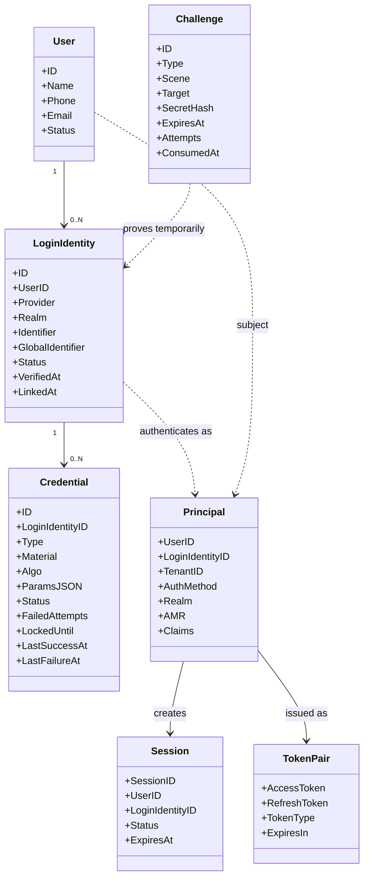

# 00-AuthN 模型总览：User、LoginIdentity、Credential、Challenge

## 1. 本文解决什么问题

本文用于重新确立 IAM 项目中 **AuthN（认证）模块** 的核心模型。

新版 AuthN 不再以“账号 Account”为核心组织认证语义，而是以 IAM 上下文中的几类认证对象为核心：

```text
User / Principal
  └── LoginIdentity 0..N
        └── Credential 0..N

Challenge 独立承载短期认证挑战。
Token / Session 承载认证成功后的访问凭证与服务端认证上下文。
```

这套模型要回答五个问题：

1. **谁是认证主体？**
   - `User` 是 IAM 中的稳定主体。

2. **系统如何找到这个主体？**
   - `LoginIdentity` 表示 User 绑定的登录身份，例如 username、phone、wechat_minip、wecom。

3. **系统如何证明这个登录身份属于请求者？**
   - 需要 IAM 保存长期认证材料时，使用 `Credential`。
   - 使用短期验证码时，使用 `Challenge`。
   - 使用微信、企业微信等外部身份源时，通过 IDP 协作解析外部 proof。

4. **认证成功后如何表达这个主体？**
   - 领域层构造 `Principal`。
   - `Principal` 是认证结果，不是 JWT。

5. **认证结果如何变成可访问系统的凭证？**
   - 应用层通过 Token 链路签发 Access Token / Refresh Token。
   - Session 与 TokenStore 管理服务端认证上下文和 refresh 生命周期。
   - JWT/JWS/JWK/JWKS/KeyRotation 是 Token 的安全表达与密钥治理机制。

本文是后续 AuthN 文档的基础事实源。后续 Onboarding、Linking、Login、Token、Session、JWT/JWKS、IDP 文档都应回到本文的模型边界。

---

## 2. 核心结论

### 2.1 IAM 不建业务 Account

IAM AuthN 关注的是：

```text
主体是谁？
系统如何找到这个主体？
请求者如何证明自己控制某个登录身份？
认证成功后如何表达主体？
认证结果如何被签发为访问凭证？
```

因此 IAM AuthN 中不应该建模业务语义下的账号，例如：

```text
运营账号
客户账号
医生账号
家长账号
外部客户账号
```

这些是业务系统概念，不是 IAM AuthN 的核心概念。

在 IAM 中，认证相关对象应拆分为：

```text
User
LoginIdentity
Credential
Challenge
Principal
Session
Token
```

如果业务系统需要表达“某个用户是某租户下的运营人员”，应该通过业务系统自己的成员模型，或者 AuthZ 的 `Subject + Scope + Role / Permission` 表达，而不是在 AuthN 中引入业务 Account。

---

### 2.2 User 是稳定身份主体

`User` 是 IAM 内部稳定身份主体。

它回答：

```text
系统内部这个人是谁？
这个主体是否存在？
这个主体是否启用？
```

它不回答：

```text
这个人通过什么方式登录？
这个人使用什么认证材料？
这个人当前是否持有 Token？
这个人在某业务系统中是什么业务角色？
```

这些分别由 `LoginIdentity`、`Credential`、`Session/Token`、`AuthZ` 或业务系统表达。

---

### 2.3 LoginIdentity 是登录身份绑定，不是业务账号

`LoginIdentity` 表达：

```text
某个 IAM User 绑定了一个可以用于登录识别的身份。
```

例如：

```text
username + tenant-realm + zhangsan
phone + global + +8613811112222
wechat_minip + wx_appid + openid
wecom + corp_id + userid
```

`LoginIdentity` 不保存密码哈希，不保存短信验证码，不保存第三方 access token。

它只回答一个问题：

```text
这个登录标识属于哪个 User？
```

---

### 2.4 Credential 只在需要长期认证材料时存在

`Credential` 表达：

```text
IAM 自己需要保存并校验的长期认证材料。
```

例如：

```text
password hash
passkey public key credential
TOTP encrypted secret
recovery code hash
```

不是所有 `LoginIdentity` 都需要 `Credential`。

| LoginIdentity Provider | 是否需要 Credential | 原因 |
| --- | ---: | --- |
| `username` | 是 | IAM 需要保存 password hash 并校验密码 |
| `phone` | 通常否 | SMS OTP 是短期 Challenge，不是长期 Credential |
| `wechat_minip` | 否 | 微信完成外部认证，IAM 保存 identity binding |
| `wecom` | 否 | 企业微信完成外部认证，IAM 保存 identity binding |
| `passkey` | 是 | IAM 需要保存 public key credential record |
| `totp` | 是 | IAM 需要保存加密后的 TOTP secret |

因此 `LoginIdentity -> Credential` 的关系不是 `1:1`，而是：

```text
LoginIdentity 0..N Credential
```

标准语义上，密码属于长期认证秘密的一种；一次性验证码、out-of-band secret、session secret 等则有不同生命周期和用途。本文中的 `Credential` / `Challenge` / `Session` 正是按生命周期与用途拆分，而不是混成一个“账号凭据”对象。

---

### 2.5 Challenge 是短期认证挑战

`Challenge` 表达：

```text
一次短期、可过期、可消费的认证挑战。
```

典型场景：

```text
短信登录验证码
手机号绑定验证码
邮箱验证码
OAuth state
找回密码临时 code
```

`Challenge` 和 `Credential` 的区别是：

| 对象 | 生命周期 | 是否长期保存 | 用途 |
| --- | --- | ---: | --- |
| `Credential` | 长期 | 是 | 保存 IAM 需要反复校验的认证材料 |
| `Challenge` | 短期 | 否，通常 Redis TTL | 保存一次性认证挑战 |

当前代码中，手机号登录和手机号绑定都使用 `Challenge`，不应把 SMS OTP 建模为长期 Credential。

需要特别注意：

```text
Challenge 是 AuthN 的一级模型对象；
但 Challenge 不是独立的主业务链路；
它主要支撑 Login.phone_otp 与 Linking.link_phone。
```

因此新版文档体系中不再单独保留一篇 Challenge 主链路文档，而是把 Challenge 放入：

```text
00 模型总览：定义 Challenge 模型边界
02 Linking：讲 link_phone scene 如何使用 Challenge
03 Login：讲 phone_otp login 如何使用 Challenge
08 事实源索引：索引 Challenge 代码事实源
```

---

### 2.6 Principal 是认证成功后的主体表达

`Principal` 是认证成功后的主体表达。

它回答：

```text
这次请求认证成功后，系统识别出的主体是谁？
通过哪个 LoginIdentity 认证？
使用了什么认证方式？
处在哪个 Realm / Tenant 上下文？
```

它通常包含：

```text
UserID
LoginIdentityID
TenantID
AuthMethod
Realm
AMR
Claims
```

`Principal` 不是 JWT，也不是 Session。

它是 AuthN 领域层产出的认证结果模型。

---

### 2.7 Token 是 Principal 的访问凭证表达

`Token` 表达认证成功后的访问凭证。

它回答：

```text
认证成功后，客户端后续如何证明自己已经登录？
系统如何在短期访问凭证和长期续期凭证之间拆分风险？
服务端如何支持 refresh、logout、revoke、audit？
```

在 IAM 中，应区分：

| 对象 | 语义 |
| --- | --- |
| `Principal` | 认证成功后的主体表达 |
| `Session` | 服务端认证上下文 |
| `Access Token` | 短期访问凭证 |
| `Refresh Token` | 用于换取新 Access Token 的续期凭证 |
| `JWT/JWS` | Access Token 的一种安全表达方式 |
| `JWKS` | 公钥发布机制 |

Token 不是 Credential。

Access Token / Refresh Token 是认证结果的访问表达，不是登录身份，也不是长期认证材料。

---

## 3. 核心模型图



---

## 4. 核心对象说明

### 4.1 User：IAM 中的稳定主体

`User` 是 IAM 中的稳定主体。

它表达：

```text
这个主体是谁？
这个主体是否存在？
这个主体是否启用？
```

它不表达：

```text
用户通过什么方式登录
用户的密码哈希是什么
用户的微信 openid 是什么
用户当前 Token 是什么
用户在某业务系统中是什么角色
```

这些分别属于 `LoginIdentity`、`Credential`、`Session/Token` 和 `AuthZ`。

代码事实源：

```text
internal/apiserver/domain/identity/user
```

---

### 4.2 LoginIdentity：登录身份绑定

`LoginIdentity` 是 AuthN 模块中最关键的模型。

它表达：

```text
某个 User 可以通过某个登录身份被找到。
```

当前领域模型位于：

```text
internal/apiserver/domain/authn/loginidentity
```

核心字段：

| 字段 | 语义 |
| --- | --- |
| `ID` | 登录身份 ID |
| `UserID` | 归属的 IAM User |
| `Provider` | 登录身份来源，例如 username、phone、wechat_minip、wecom |
| `Realm` | 身份命名空间，例如 tenant_id、global、appid、corp_id |
| `Identifier` | 命名空间内标识，例如 username、phone、openid、userid |
| `GlobalIdentifier` | 跨 realm 稳定标识，例如微信 unionid |
| `Status` | 登录身份状态 |
| `VerifiedAt` | 身份验证时间 |
| `LinkedAt` | 绑定时间 |
| `Profile` | 外部身份资料快照 |
| `Meta` | 扩展元数据 |

#### ProviderKey

`ProviderKey` 是定位 LoginIdentity 的唯一键：

```text
Provider + Realm + Identifier
```

例如：

| 场景 | Provider | Realm | Identifier | GlobalIdentifier |
| --- | --- | --- | --- | --- |
| 用户名密码 | `username` | tenant_id 或 `default` | username | 空 |
| 手机号 | `phone` | `global` | +E164 phone | 空 |
| 微信小程序 | `wechat_minip` | appid | openid | unionid |
| 企业微信 | `wecom` | corpid | userid | 空 |

`GlobalIdentifier` 不参与主唯一键，但可用于跨 realm 查找已有 User，例如微信 unionid 复用。

#### 不变量

`LoginIdentity` 应满足以下不变量：

```text
1. Provider 必须合法。
2. Realm 不能为空。
3. Identifier 不能为空。
4. Provider + Realm + Identifier 全局唯一。
5. LoginIdentity 只能属于一个 User。
6. 已属于 User A 的 LoginIdentity 不能被 User B 绑定。
7. 非 active 的 LoginIdentity 不能被复用为可登录身份。
```

---

### 4.3 Credential：长期认证材料

`Credential` 只表达 IAM 需要保存和校验的长期认证材料。

当前领域模型位于：

```text
internal/apiserver/domain/authn/credential
```

核心字段：

| 字段 | 语义 |
| --- | --- |
| `ID` | 凭据 ID |
| `LoginIdentityID` | 归属的 LoginIdentity |
| `Type` | 凭据类型，目前主要是 password |
| `Material` | 认证材料，例如 password hash |
| `Algo` | 算法，例如 argon2id、bcrypt |
| `ParamsJSON` | 低频参数或元数据 |
| `Status` | 凭据状态 |
| `FailedAttempts` | 失败次数 |
| `LockedUntil` | 锁定截止时间 |
| `LastSuccessAt` | 最近认证成功时间 |
| `LastFailureAt` | 最近认证失败时间 |

#### 当前已实现的 Credential 类型

当前主要支持：

```text
password
```

后续可以扩展：

```text
passkey
totp
recovery_code
```

但不要急于提前实现。现阶段更重要的是把 password lifecycle 做完整。

#### Credential 不变量

```text
1. Credential 必须归属于某个 LoginIdentity。
2. Credential 不保存 Provider / Realm / Identifier。
3. Credential 不保存 openid、unionid、corp_id、userid。
4. OAuth token grant 不属于 Credential。
5. SMS OTP 不属于 Credential。
```

---

### 4.4 Challenge：短期认证挑战

`Challenge` 是短期认证过程对象。

当前领域模型位于：

```text
internal/apiserver/domain/authn/challenge
```

应用服务位于：

```text
internal/apiserver/application/authn/challenge
```

Redis 仓储位于：

```text
internal/apiserver/infra/cache/redis/challenge_repository.go
```

核心字段：

| 字段 | 语义 |
| --- | --- |
| `ID` | Challenge ID |
| `Type` | Challenge 类型，例如 sms_otp |
| `Scene` | 使用场景，例如 login、link_phone |
| `Target` | 目标，例如手机号 |
| `SecretHash` | secret hash，不保存明文验证码 |
| `ExpiresAt` | 过期时间 |
| `Attempts` | 尝试次数 |
| `ConsumedAt` | 消费时间 |
| `CreatedAt` | 创建时间 |

当前关键 scene：

```text
login
link_phone
```

Challenge 的当前应用边界是：

```text
SendSMSOTP：创建并发送短信验证码。
VerifyAndConsume：验证并消费验证码。
DeleteSMSOTP：删除验证码。
```

其中 Creator 负责创建 OTP 和写入 Challenge，Verifier 负责读取、比较、过期判断和消费。

#### Challenge 与 Credential 的边界

```text
SMS OTP 是 Challenge，不是 Credential。
Phone 是 LoginIdentity，不是 Credential。
Password hash 是 Credential，不是 Challenge。
OAuth code / js_code / auth_code 是外部 IDP proof，不是 Credential。
```

---

### 4.5 Principal：认证成功后的主体表达

`Principal` 是认证成功后的主体表达。

它不是持久化身份模型，而是认证结果模型。

它应包含：

```text
UserID
LoginIdentityID
TenantID
AuthMethod
Realm
AMR
Claims
```

其中：

| 字段 | 语义 |
| --- | --- |
| `UserID` | Token subject，对应 IAM User |
| `LoginIdentityID` | 本次认证使用的登录身份 |
| `TenantID` | 当前认证上下文中的租户 |
| `AuthMethod` | 本次认证方式，例如 password、phone_otp、wechat_minip |
| `Realm` | 本次登录身份所在 realm |
| `AMR` | Authentication Method References |
| `Claims` | Token claims 的领域来源 |

Principal 后续会被 Token 应用服务转换为 claims，并参与 Access Token / Refresh Token / Session 上下文构造。

---

### 4.6 Token / Session：认证结果的访问表达与服务端上下文

`Token` 和 `Session` 承接认证成功后的访问上下文。

```text
Principal -> TokenApplicationService -> TokenPair
Principal -> SessionManager / TokenStore -> Session / refresh lifecycle
```

核心边界：

```text
Principal 是认证结果。
Session 是服务端认证上下文。
Access Token 是短期访问凭证。
Refresh Token 是续期凭证。
JWT/JWS 是 Access Token 的安全表达。
JWKS 是验签公钥集合。
```

Token / Session 不属于 Credential。

它们不会证明“用户掌握某个长期认证材料”，而是表达“用户已经完成认证后形成的访问状态”。

---

## 5. 核心关系与典型场景

### 5.1 用户名 + 密码

```text
User U1
  └── LoginIdentity L1
        Provider = username
        Realm = tenant_id or default
        Identifier = zhangsan
        └── Credential C1
              Type = password
              Material = password hash
```

认证过程：

```text
username + realm
  -> LoginIdentity
  -> password Credential
  -> verify password
  -> Principal
  -> TokenPair
```

---

### 5.2 手机号验证码登录

```text
User U1
  └── LoginIdentity L2
        Provider = phone
        Realm = global
        Identifier = +8613811112222
        └── no Credential
```

认证过程：

```text
phone + otp
  -> Challenge verify and consume
  -> LoginIdentity
  -> Principal
  -> TokenPair
```

这里没有长期 Credential。

---

### 5.3 微信小程序登录

```text
User U1
  └── LoginIdentity L3
        Provider = wechat_minip
        Realm = wx_appid
        Identifier = openid
        GlobalIdentifier = unionid
        └── no Credential
```

认证过程：

```text
appid + js_code
  -> 微信 code2session
  -> openid / unionid
  -> LoginIdentity
  -> Principal
  -> TokenPair
```

这里不创建 Credential。微信完成外部认证，IAM 保存 LoginIdentity 绑定关系。

---

### 5.4 企业微信登录

```text
User U1
  └── LoginIdentity L4
        Provider = wecom
        Realm = corp_id
        Identifier = userid
        └── no Credential
```

认证过程：

```text
corp_id + oauth_code
  -> 企业微信身份解析
  -> userid
  -> LoginIdentity
  -> Principal
  -> TokenPair
```

---

### 5.5 一个 User 多登录身份

```text
User U1
  ├── LoginIdentity username / tenant-A / zhangsan
  │     └── Credential password
  ├── LoginIdentity phone / global / +8613811112222
  ├── LoginIdentity wechat_minip / wx-appid / openid
  └── LoginIdentity wecom / corp-id / userid
```

这个结构表达：

```text
一个 IAM User 可以通过多个登录身份完成认证。
```

它不表达：

```text
这个 User 是运营账号、客户账号、医生账号或家长账号。
```

业务身份应由业务系统、Identity/ProfileLink 或 AuthZ scope/role 表达。

---

## 6. 主要链路入口

### 6.1 Onboarding：首次开通登录身份

Onboarding 负责：

```text
首次建立 User 与 LoginIdentity 的绑定，并按需创建 Credential。
```

应用层入口：

```text
internal/apiserver/application/authn/onboarding
```

核心流程：

```text
OnboardingRequest
  -> requestPreparer
  -> UnitOfWork.WithinTx
  -> userResolver
  -> loginIdentityEnsurer
  -> credentialEnsurer
  -> OnboardingResult
```

Onboarding 的重点不是“登录”，而是：

```text
建立 User；
建立或复用 LoginIdentity；
在 password 等场景创建 Credential；
在 wechat_minip 等外部身份源场景不创建 Credential。
```

深潜文档：

```text
01-Onboarding链路-从身份开通到LoginIdentity与Credential.md
```

---

### 6.2 Linking：已认证 User 绑定/解绑更多登录身份

Linking 负责：

```text
已认证 User 绑定、解绑、查看自己的 LoginIdentity。
```

应用层入口：

```text
internal/apiserver/application/authn/linking
```

当前能力：

```text
List
SendPhoneLinkChallenge
LinkPhone
LinkWechatMini
LinkWecom
Unlink
```

核心安全规则：

```text
1. LoginIdentity 不能跨 User 绑定。
2. 非 active LoginIdentity 不能作为可用登录身份复用。
3. 手机号绑定必须先通过 link_phone scene 的 Challenge。
4. 解绑时不能删除最后一个 active LoginIdentity。
5. 解绑当前登录身份、username、phone 等敏感 LoginIdentity 时，需要 recent authentication。
```

深潜文档：

```text
02-Linking链路-登录身份绑定解绑与安全边界.md
```

---

### 6.3 Login：证明 LoginIdentity 并产出 Principal

Login 负责：

```text
证明请求者控制某个 LoginIdentity，并在认证成功后构造 Principal。
```

应用层入口：

```text
internal/apiserver/application/authn/login
```

核心流程：

```text
LoginRequest
  -> MethodSelector
  -> ProofFactory
  -> Domain Authenticator
  -> AuthDecision
  -> CredentialRecorder.Record(optional)
  -> Principal
```

不同 auth method 的证明方式不同：

| Auth Method | 证明方式 | 是否使用 persisted Credential |
| --- | --- | ---: |
| password | 校验 password hash | 是 |
| phone_otp | 校验 Challenge | 否 |
| wechat_minip | 外部 IDP code2session | 否 |
| wecom | 外部 IDP 身份解析 | 否 |

注意：

```text
Login 链路中的 PasswordCredential / PhoneOTPCredential / WechatMinipCredential / WecomCredential 属于 authentication proof，表示本次认证请求携带的证明输入。
它们不是 domain/authn/credential.Credential，不进入 auth_credentials 表。
```

深潜文档：

```text
03-Login链路-从登录请求到Principal.md
```

---

### 6.4 Token：从 Principal 到 AccessToken / RefreshToken

Token 链路负责：

```text
把认证成功后的 Principal 转换为客户端可携带的访问凭证。
```

应用层入口：

```text
internal/apiserver/application/authn/token
```

核心流程：

```text
Principal
  -> TokenApplicationService.IssueToken
  -> AccessToken claims
  -> AccessTokenCodec / JWT-JWS signer
  -> RefreshToken generator / TokenStore
  -> TokenAudit(optional)
  -> TokenPair
```

Token 链路关注：

```text
签发 Access Token；
签发或保存 Refresh Token；
刷新 Token；
撤销 Token；
记录 Token 审计；
与 SessionManager / TokenStore 协作。
```

深潜文档：

```text
04-Token链路-从Principal到AccessToken与RefreshToken.md
```

---

### 6.5 Challenge：支撑 phone_otp 与 link_phone 的短期证明机制

Challenge 负责：

```text
创建、发送、校验并消费短期认证挑战。
```

当前主要用于：

```text
phone_otp login
phone identity linking
```

核心流程：

```text
SendSMSOTP
  -> Creator.CreateSMSOTP
  -> Redis store challenge with TTL
  -> SMS delivery

VerifyAndConsume
  -> Load challenge
  -> Check expired / consumed
  -> Compare secret hash
  -> Consume challenge
```

Challenge 不再单独成篇。它在以下文档中被展开：

```text
02-Linking链路-登录身份绑定解绑与安全边界.md
03-Login链路-从登录请求到Principal.md
08-AuthN分层架构与事实源索引.md
```

---

## 7. 分层架构说明

### 7.1 Application 层

Application 层负责编排用例，不直接表达领域核心不变量。

| 模块 | 职责 |
| --- | --- |
| `application/authn/onboarding` | 首次开通 User + LoginIdentity + optional Credential |
| `application/authn/linking` | 已认证 User 绑定/解绑 LoginIdentity |
| `application/authn/login` | 登录认证、构造 Principal |
| `application/authn/challenge` | 创建、发送、校验、消费短期 Challenge |
| `application/authn/token` | Token 签发、刷新、撤销 |
| `application/authn/session` | Session 查询与管理 |
| `application/authn/jwks` | JWKS 发布、Key 管理与轮换应用编排 |

---

### 7.2 Domain 层

Domain 层表达核心模型和领域规则。

| 模块 | 职责 |
| --- | --- |
| `domain/identity/user` | IAM User 主体 |
| `domain/authn/loginidentity` | 登录身份绑定 |
| `domain/authn/credential` | 长期认证材料 |
| `domain/authn/challenge` | 短期认证挑战 |
| `domain/authn/authentication` | 认证策略、Principal、AuthDecision |
| `domain/authn/session` | 会话模型 |
| `domain/idp/wechatapp` | 微信应用配置与密钥材料 |

---

### 7.3 Infra 层

Infra 层实现技术细节。

| 能力 | Infra 实现 |
| --- | --- |
| LoginIdentity 持久化 | `infra/mysql/loginidentity` |
| Credential 持久化 | `infra/mysql/credential` |
| Challenge 存储 | `infra/cache/redis/challenge_repository.go` |
| Token 存储 | Redis TokenStore |
| JWT/JWS 签发 | JWT Generator / Token Codec |
| JWKS 发布 | keyset / JWKS builder |
| 微信/企微身份解析 | IDP adapter / WeChat app config / SecretVault |
| SMS 发送 | SMS infra / MQ 或 log sender |

---

### 7.4 Transport 层

Transport 层只负责协议适配。

```text
REST request / gRPC request
  -> Application command / request
  -> Application service
  -> response DTO
```

Transport 层不应该直接操作领域对象，也不应该绕过 Application 层访问仓储。

---

## 8. 关键边界与规则

### 8.1 AuthN 与 Identity 的边界

```text
Identity/User 负责主体基本信息；
AuthN 负责主体如何被认证。
```

`User.Phone`、`User.Email` 可以作为基础资料存在，但手机号登录必须通过 `LoginIdentity(provider=phone)` 表达。

---

### 8.2 AuthN 与 AuthZ 的边界

AuthN 只回答：

```text
请求者是谁？通过什么方式证明的？
```

AuthZ 回答：

```text
这个主体能访问什么？
```

授权主体通常应是：

```text
Subject = user:<UserID>
Tenant / Scope = xxx
Role / Permission = xxx
```

不要把权限绑定到 LoginIdentity。LoginIdentity 是登录入口，不是授权主体。

---

### 8.3 AuthN 与业务账号的边界

IAM 不建模业务 Account。

业务系统可以建：

```text
TenantMember
OperatorProfile
CustomerProfile
DoctorProfile
GuardianProfile
```

这些业务对象通过 `user_id` 引用 IAM User。

IAM 内部只保留：

```text
User
LoginIdentity
Credential
Challenge
Principal
Session
Token
```

---

### 8.4 LoginIdentity 与 Credential 的边界

```text
LoginIdentity：你是谁，或者你从哪个登录身份进入系统。
Credential：你凭什么证明这个身份属于你。
```

因此：

```text
openid / userid / phone / username -> LoginIdentity
password hash / passkey public key / TOTP secret -> Credential
sms otp / oauth state -> Challenge
external provider code / auth_code -> IDP proof
access token / refresh token of external provider -> ExternalAuthorization（未来）
```

---

### 8.5 Principal 与 Token 的边界

```text
Principal 是认证结果。
Token 是认证结果的访问凭证表达。
```

因此：

```text
Login 产出 Principal；
Token 链路把 Principal 转换成 Access Token / Refresh Token；
JWT/JWS/JWK/JWKS 是 Token 的安全表达与验签基础设施；
AuthZ 不应该直接依赖 LoginIdentity；
资源访问判断应基于 User/Subject、Tenant/Scope、Resource、Action、Permission。
```

---

### 8.6 ExternalAuthorization 的预留边界

如果未来 IAM 要保存第三方授权 token，例如：

```text
微信 access token
企业微信 access token
GitHub access token
Google refresh token
```

不要放进 `Credential`。

应单独建模：

```text
ExternalAuthorization / OAuthGrant / ProviderGrant
```

因为第三方授权 token 表达的是“代表用户访问外部系统的授权”，不是“本系统验证用户身份的认证材料”。

---

## 9. 常见误区

### 9.1 误区：LoginIdentity 就是 Account

不对。

`LoginIdentity` 是 IAM 中的登录身份绑定，不是业务账号。

业务账号属于业务系统，或者由 Identity/ProfileLink、AuthZ scope/role 表达。

---

### 9.2 误区：每个 LoginIdentity 都应该有 Credential

不对。

微信、企微、手机号验证码等场景不需要 IAM 保存长期 Credential。

```text
LoginIdentity 0..N Credential
```

---

### 9.3 误区：手机号验证码是 Credential

不对。

手机号是 LoginIdentity。

验证码是 Challenge。

---

### 9.4 误区：Principal 就是 JWT

不对。

Principal 是认证结果。

JWT 是 Token 层对 Principal 的一种安全表达。

---

### 9.5 误区：Token 里应该放 CredentialID

一般不需要。

Token 应表达认证主体和认证上下文：

```text
user_id
login_identity_id
auth_method
realm
amr
sid
```

Credential 是内部认证材料记录，不是对外主体上下文。

---

## 10. 代码事实源索引

| 主题 | 代码位置 |
| --- | --- |
| User 模型 | `internal/apiserver/domain/identity/user` |
| LoginIdentity 模型 | `internal/apiserver/domain/authn/loginidentity` |
| ProviderKey | `internal/apiserver/domain/authn/loginidentity/key.go` |
| LoginIdentity Builder | `internal/apiserver/domain/authn/loginidentity/builder.go` |
| Credential 模型 | `internal/apiserver/domain/authn/credential` |
| Challenge 模型 | `internal/apiserver/domain/authn/challenge` |
| Challenge 应用服务 | `internal/apiserver/application/authn/challenge` |
| Onboarding 应用服务 | `internal/apiserver/application/authn/onboarding` |
| Login 应用服务 | `internal/apiserver/application/authn/login` |
| Linking 应用服务 | `internal/apiserver/application/authn/linking` |
| Principal / AuthDecision | `internal/apiserver/domain/authn/authentication` |
| Token 应用服务 | `internal/apiserver/application/authn/token` |
| Token infra | `internal/apiserver/infra/token` |
| Session 领域模型 | `internal/apiserver/domain/authn/session` |
| Session 应用服务 | `internal/apiserver/application/authn/session` |
| JWKS 应用服务 | `internal/apiserver/application/authn/jwks` |
| Keyset infra | `internal/apiserver/infra/token/keyset` |
| AuthN 装配 | `internal/apiserver/container/assembler` |
| AuthN capabilities | `internal/apiserver/container/assembler/capabilities.go` |
| LoginIdentity MySQL 仓储 | `internal/apiserver/infra/mysql/loginidentity` |
| Credential MySQL 仓储 | `internal/apiserver/infra/mysql/credential` |
| Challenge Redis 仓储 | `internal/apiserver/infra/cache/redis/challenge_repository.go` |
| 数据库 schema | `internal/pkg/migration/migrations/000001_init_schema.up.sql` |

---

## 11. 面试与项目讲解口径

可以这样讲：

> IAM 的 AuthN 模块没有使用业务意义上的 Account 作为核心模型，而是把认证语义拆成 User、LoginIdentity、Credential、Challenge、Principal、Token/Session 几类对象。User 是 IAM 稳定主体；LoginIdentity 表示主体绑定的登录身份，例如 username、phone、wechat、wecom；Credential 只在系统需要保存并校验长期认证材料时存在，例如 password hash；短信验证码、手机号绑定验证码等短期证明由 Challenge 承载；认证成功后领域层产出 Principal，应用层再把 Principal 签发为 Access Token / Refresh Token，并通过 Session / TokenStore 管理服务端认证上下文。

进一步可以补充：

> Onboarding 负责首次建立 User 与 LoginIdentity，按需创建 Credential；Linking 负责已认证 User 绑定或解绑更多 LoginIdentity；Login 负责验证某个 LoginIdentity 并构造 Principal；Token 链路负责把 Principal 转换为 TokenPair；Challenge 是支撑 phone_otp login 和 link_phone 的短期证明机制；Session/JWT/JWKS 负责认证结果的生命周期管理、安全表达与密钥发布。

---

## 12. 后续文档入口

本文只讲 AuthN 总模型。后续文档继续展开：

```text
01-Onboarding链路-从身份开通到LoginIdentity与Credential.md
02-Linking链路-登录身份绑定解绑与安全边界.md
03-Login链路-从登录请求到Principal.md
04-Token链路-从Principal到AccessToken与RefreshToken.md
05-Session与Token边界-Principal-Session-AccessToken-RefreshToken.md
06-JWT-JWS-JWK-JWKS边界与KeyRotation.md
07-第三方登录与IDP协作-WeChat-WeCom.md
08-AuthN分层架构与事实源索引.md
```

---

## 13. 外部标准参考

本文中的 Credential、Challenge、Session、JWT/JWS/JWK/JWKS 等术语参考以下公开标准：

```text
NIST SP 800-63B: Digital Identity Guidelines - Authentication and Authenticator Lifecycle
RFC 7519: JSON Web Token (JWT)
RFC 7515: JSON Web Signature (JWS)
RFC 7517: JSON Web Key (JWK)
```

这些标准不直接决定 IAM 项目的代码结构，但用于校准术语边界：

```text
Password / authenticator secret 更偏长期认证材料；
out-of-band secret、one-time passcode 更偏短期认证证明；
session secret 用于建立认证会话连续性；
JWT/JWS/JWK/JWKS 更偏认证结果的安全表达与密钥发布。
```
