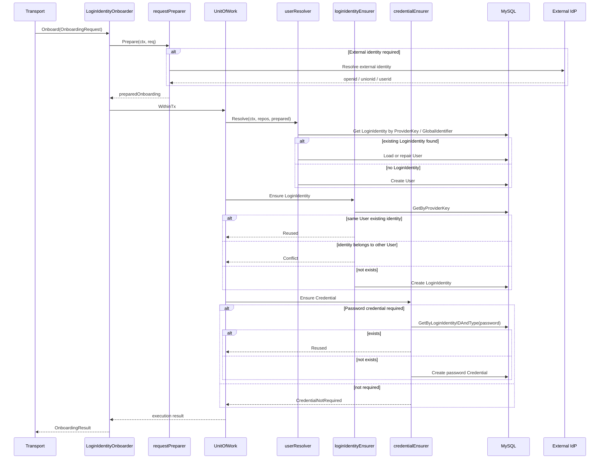

# 01-Onboarding 链路：从身份开通到 LoginIdentity 与 Credential

## 1. 本文解决什么问题

本文说明 IAM AuthN 模块中的 **Onboarding（登录身份开通）链路**。

Onboarding 的职责不是“登录”，也不是“绑定更多登录身份”，而是：

```text
首次建立 IAM User 与 LoginIdentity 的关系，并按需创建 Credential。
```

换句话说，Onboarding 负责把一个尚未进入 IAM 的认证主体，转化为系统中可以被认证的结构：

```text
User
  └── LoginIdentity
        └── Credential(optional)
```

其中：

- `User` 是 IAM 中的稳定主体；
- `LoginIdentity` 是该主体绑定的登录身份；
- `Credential` 只在 IAM 需要保存长期认证材料时创建；
- 微信、企业微信、手机号验证码等场景通常不创建长期 Credential。

本文重点说明：

1. Onboarding 与 Login、Linking 的边界；
2. Onboarding 输入模型如何从 `User + LoginIdentity + Credential` 进入应用层；
3. `requestPreparer` 如何在事务外准备数据；
4. `userResolver`、`loginIdentityEnsurer`、`credentialEnsurer` 如何在事务内协作；
5. 幂等、冲突、可选 Credential 等关键规则；
6. 应用层、领域层、Infra 层各自负责什么。

---

## 2. 核心结论

### 2.1 Onboarding 是“首次开通”，不是“登录”

Onboarding 负责创建或复用认证所需的基础结构：

```text
User
LoginIdentity
Credential(optional)
```

Login 负责证明请求者控制某个登录身份，并签发 Token：

```text
LoginRequest -> Proof -> Authenticator -> Principal -> Token
```

两者边界不同：

| 链路 | 目标 | 是否签发 Token |
|---|---|---:|
| Onboarding | 建立 User 与 LoginIdentity，并按需创建 Credential | 否 |
| Login | 验证 LoginIdentity 的控制权，生成 Principal 与 Token | 是 |

---

### 2.2 Onboarding 是“首次开通”，不是“已登录用户绑定更多身份”

已认证 User 绑定更多登录身份，应由 `linking` 模块负责。

```text
Onboarding：创建 User + 第一个或初始 LoginIdentity
Linking：已有 User 绑定/解绑更多 LoginIdentity
```

例如：

```text
首次微信小程序注册 -> Onboarding
已登录用户绑定手机号 -> Linking
已登录用户绑定企业微信 -> Linking
已登录用户解绑微信 -> Linking
```

这样可以避免 Onboarding 重新膨胀成“所有身份操作的大杂烩”。

---

### 2.3 Credential 是可选的

Onboarding 并不总是创建 Credential。

| 开通场景 | LoginIdentity | Credential |
|---|---|---|
| username/password | username identity | password Credential |
| mock consumer password | username identity in default realm | password Credential |
| wechat_minip | wechat_minip identity | 无 |
| phone | phone identity | 通常无，OTP 走 Challenge |
| wecom | wecom identity | 通常无，外部 IdP 证明身份 |

当前应用层已经通过 `CredentialNotRequired` 表达“该登录身份不需要长期 Credential”。

---

## 3. Onboarding 输入模型

当前 Onboarding 应用入口是：

```text
internal/apiserver/application/authn/onboarding
```

Driving Port：

```go
// LoginIdentityOnboarder 负责登录身份开通用例。
type LoginIdentityOnboarder interface {
    Onboard(ctx context.Context, req OnboardingRequest) (*OnboardingResult, error)
}
```

`OnboardingRequest` 被拆为三段：

```go
type OnboardingRequest struct {
    User          OnboardingUserInput
    LoginIdentity OnboardingLoginIdentityInput
    Credential    *OnboardingCredentialInput
}
```

这个输入结构对应本文的核心模型：

```text
User input
LoginIdentity input
Credential input(optional)
```

---

## 4. OnboardingUserInput：用户主体输入

`OnboardingUserInput` 表达创建 User 所需的基础信息：

```go
type OnboardingUserInput struct {
    Name  string
    Phone meta.Phone
    Email meta.Email
}
```

它只服务于 IAM User 的创建或修复。

它不表达：

```text
登录方式
密码
openid
unionid
corp_id
验证码
```

这些分别属于 `LoginIdentity`、`Credential` 或 `Challenge`。

---

## 5. OnboardingLoginIdentityInput：登录身份输入

`OnboardingLoginIdentityInput` 是登录身份输入的抽象。

它负责把外部请求中的登录身份信息，准备成一个稳定的 `ProviderKey`：

```text
Provider + Realm + Identifier + GlobalIdentifier(optional)
```

典型输入类型包括：

```text
UsernameLoginIdentityInput
MockConsumerUsernameLoginIdentityInput
WechatMiniLoginIdentityInput
```

### 5.1 UsernameLoginIdentityInput

用于 username/password 登录身份开通。

核心输入：

```text
username
realm tenant id
profile
meta
```

最终生成：

```text
Provider = username
Realm = tenant_id 或 default
Identifier = username
```

### 5.2 MockConsumerUsernameLoginIdentityInput

用于内部 mock C 端登录身份开通。

特点：

```text
Provider = username
Realm = default
Identifier = username
```

这个场景本质上仍然是 username identity，只是 realm 固定为 default。

### 5.3 WechatMiniLoginIdentityInput

用于微信小程序登录身份开通。

输入可能包含：

```text
appid
js_code
openid
unionid
profile
meta
```

如果请求只有 `appid + js_code`，则 `requestPreparer` 会在事务外调用微信 IdP：

```text
appid + js_code -> code2session -> openid / unionid
```

最终生成：

```text
Provider = wechat_minip
Realm = appid
Identifier = openid
GlobalIdentifier = unionid(optional)
```

---

## 6. OnboardingCredentialInput：可选凭据输入

`OnboardingCredentialInput` 当前主要承载 password credential 输入：

```go
type OnboardingCredentialInput struct {
    Password *PasswordCredentialInput
}
```

密码凭据输入：

```go
type PasswordCredentialInput struct {
    Plaintext string
}
```

只有当登录身份需要 IAM 保存长期认证材料时，才会使用 Credential 输入。

例如 username/password 开通：

```text
LoginIdentity = username
Credential = password hash
```

微信小程序开通：

```text
LoginIdentity = wechat_minip
Credential = nil
```

---

## 7. 总体链路图



---

## 8. 分层职责

## 8.1 Application 层职责

Onboarding 应用层负责用例编排。

核心组件：

| 组件 | 职责 |
|---|---|
| `LoginIdentityOnboarder` | 用例入口，组织完整开通流程 |
| `requestPreparer` | 事务外准备输入、解析外部身份、生成 preparedOnboarding |
| `userResolver` | 解析或创建 User |
| `loginIdentityEnsurer` | 确保 ProviderKey 对应 LoginIdentity 存在 |
| `credentialEnsurer` | 按需创建或复用 Credential |
| `UnitOfWork` | 提供事务边界 |

Application 层不应该：

```text
直接拼 SQL
直接操作 JWT
绕过领域模型创建持久化对象
把业务账号概念塞进 AuthN
```

---

## 8.2 Domain 层职责

Domain 层负责模型和规则。

| 领域模块 | 职责 |
|---|---|
| `identity/user` | IAM User 主体 |
| `authn/loginidentity` | LoginIdentity、Provider、ProviderKey、Builder、状态规则 |
| `authn/credential` | Credential、PasswordIssuer、凭据状态、锁定、轮换 |
| `authn/challenge` | Challenge 模型，短期认证挑战 |
| `idp/wechatapp` | 微信应用配置、密钥材料、启用状态 |

Onboarding 主要依赖前三者：

```text
User
LoginIdentity
Credential(optional)
```

微信小程序场景还会依赖 IDP 配置与外部身份解析。

---

## 8.3 Infra 层职责

Infra 层负责具体存储与外部系统适配。

| 能力 | Infra 实现 |
|---|---|
| User 持久化 | MySQL user repository |
| LoginIdentity 持久化 | `infra/mysql/loginidentity` |
| Credential 持久化 | `infra/mysql/credential` |
| UnitOfWork | MySQL transaction UoW |
| 微信 code2session | IDP adapter |
| 微信 app secret 解密 | SecretVault |

Infra 层应保证：

```text
1. Provider + Realm + Identifier 唯一。
2. Credential 能按 LoginIdentityID + Type 唯一查询。
3. UoW 中 User、LoginIdentity、Credential 的写入具有事务一致性。
```

---

## 9. 事务边界

Onboarding 分为事务外和事务内两段。

## 9.1 事务外：requestPreparer

事务外处理：

```text
trim 输入
校验 LoginIdentity input 是否存在
解析微信 code2session
生成 ProviderKey
整理 Credential 输入
```

这些操作不应该放进数据库事务，因为：

```text
1. 外部 IdP 调用可能耗时；
2. AppSecret 查询和解密不属于数据库一致性写入；
3. 输入清洗不需要事务；
4. 事务应该尽量只包住 User / LoginIdentity / Credential 写入。
```

---

## 9.2 事务内：User + LoginIdentity + Credential

事务内处理：

```text
1. Resolve or create User
2. Ensure LoginIdentity
3. Ensure Credential if required
```

这样可以保证：

```text
User 创建成功但 LoginIdentity 失败 -> 回滚
LoginIdentity 创建成功但 Credential 创建失败 -> 回滚
同一个 ProviderKey 并发创建 -> 唯一键保护
```

---

## 10. UserResolver 详解

`userResolver` 的职责是：

```text
给定 preparedOnboarding，解析或创建 User。
```

它的优先级是：

```text
1. 通过 LoginIdentity ProviderKey 查找已有 LoginIdentity。
2. 如果 ProviderKey 没命中且存在 GlobalIdentifier，则通过 GlobalIdentifier 查找已有 LoginIdentity。
3. 如果找到 LoginIdentity，则加载其 User。
4. 如果 User 缺失且允许修复，则修复 User。
5. 如果没有找到 LoginIdentity，则创建新 User。
```

## 10.1 为什么不再按手机号直接找 User

手机号是否用于登录，应该由 `LoginIdentity(provider=phone)` 表达。

因此 UserResolver 不应该因为 `User.Phone` 相同就默认复用用户。

原因：

```text
1. User.Phone 是基础资料；
2. LoginIdentity(phone) 才是登录身份绑定；
3. 两者语义不同；
4. 认证系统应该以 LoginIdentity 为登录入口事实源。
```

---

## 10.2 GlobalIdentifier 的作用

微信小程序场景中：

```text
Provider = wechat_minip
Realm = appid
Identifier = openid
GlobalIdentifier = unionid
```

`Provider + Realm + Identifier` 定位某个 App 下的 openid。

`GlobalIdentifier` 可用于跨 App 识别同一微信用户。

典型逻辑：

```text
appid + openid 未命中
但 unionid 命中了已有 LoginIdentity
则复用该 LoginIdentity 归属的 User
然后为同一 User 创建当前 appid + openid 的新 LoginIdentity
```

这可以支持微信多 App 场景下的用户身份归并。

---

## 11. LoginIdentityEnsurer 详解

`loginIdentityEnsurer` 的职责是：

```text
确保 preparedOnboarding 中的 ProviderKey 对应的 LoginIdentity 存在。
```

核心规则：

```text
1. 如果 ProviderKey 已存在且属于当前 User，则复用。
2. 如果 ProviderKey 已存在但属于其他 User，则报冲突。
3. 如果 ProviderKey 已存在但非 active，则禁止复用。
4. 如果 ProviderKey 不存在，则创建新的 LoginIdentity。
```

这保证了登录身份的归属安全：

```text
一个 LoginIdentity 只能属于一个 User。
```

---

## 12. CredentialEnsurer 详解

`credentialEnsurer` 的职责是：

```text
按需确保 Credential 存在。
```

它不负责所有登录身份，只负责需要长期认证材料的场景。

当前主要处理 password credential。

## 12.1 需要 Credential 的场景

```text
username/password
mock consumer password
```

流程：

```text
1. 根据 LoginIdentityID + password 查找已有 Credential。
2. 如果已有，则返回 CredentialReused。
3. 如果没有，则使用 PasswordIssuer 生成 password Credential。
4. 保存 Credential。
5. 返回 CredentialCreated。
```

## 12.2 不需要 Credential 的场景

```text
wechat_minip
phone_otp
wecom
```

返回：

```text
Credential = nil
Status = CredentialNotRequired
```

这不是异常，而是正常结果。

---

## 13. 典型场景

## 13.1 用户名密码开通

输入：

```text
User:
  name
  phone
  email

LoginIdentity:
  provider = username
  realm = tenant_id or default
  identifier = username

Credential:
  password plaintext
```

结果：

```text
User created or reused
LoginIdentity created or reused
Password Credential created or reused
```

最终模型：

```text
User U1
  └── LoginIdentity username / tenant-A / zhangsan
        └── Credential password
```

---

## 13.2 Mock consumer password 开通

输入：

```text
User:
  name
  phone
  email

LoginIdentity:
  provider = username
  realm = default
  identifier = email or explicit username

Credential:
  password plaintext
```

结果：

```text
User
LoginIdentity(username/default)
Credential(password)
```

这个场景用于内部测试或 mock C 端身份开通，本质仍然是 username/password。

---

## 13.3 微信小程序开通

输入：

```text
User:
  name / phone / email，可按业务要求提供

LoginIdentity:
  provider = wechat_minip
  appid
  js_code 或 openid/unionid

Credential:
  nil
```

事务外准备：

```text
appid + js_code -> code2session -> openid / unionid
```

最终模型：

```text
User U1
  └── LoginIdentity wechat_minip / appid / openid
        GlobalIdentifier = unionid
        no Credential
```

---

## 14. 幂等与冲突规则

## 14.1 幂等规则

Onboarding 应支持幂等：

```text
同一个 ProviderKey 多次开通，应复用同一个 LoginIdentity。
同一个 password Credential 已存在时，应复用现有 Credential。
微信 unionid 命中已有 User 时，应复用 User。
```

## 14.2 冲突规则

以下情况必须报错：

```text
ProviderKey 已属于其他 User。
ProviderKey 对应的 LoginIdentity 非 active。
需要 password Credential 但未提供 password。
User 创建失败。
LoginIdentity 创建唯一键冲突且无法确认属于当前 User。
```

## 14.3 不应做的事情

```text
不应因为 User.Phone 相同就默认复用 User。
不应给微信/企微强行创建 Credential。
不应把 OAuth access token 存入 Credential。
不应在数据库事务内调用外部 IdP。
```

---

## 15. Onboarding 与其他链路的关系

## 15.1 与 Login 的关系

Onboarding 之后，系统具备登录所需的模型基础：

```text
User
LoginIdentity
Credential(optional)
```

但 Onboarding 不签发 Token。

用户要获得 Token，仍需走 Login：

```text
LoginIdentity proof -> Authenticator -> Principal -> Token
```

---

## 15.2 与 Linking 的关系

Onboarding 负责初始身份开通。

Linking 负责已认证用户绑定更多身份。

```text
首次微信注册 -> Onboarding
登录后绑定手机号 -> Linking
登录后绑定企业微信 -> Linking
```

---

## 15.3 与 Challenge 的关系

Onboarding 本身不直接等同 Challenge。

如果某个开通场景需要短期证明，例如手机号开通，则应通过 Challenge 完成证明，然后再创建 LoginIdentity。

当前手机号绑定更适合由 Linking 处理：

```text
SendPhoneLinkChallenge
VerifyAndConsumeSMSOTP
Create LoginIdentity(phone)
```

---

## 15.4 与 AuthZ 的关系

Onboarding 不授予权限。

Onboarding 只建立认证基础。

权限应由 AuthZ 模块通过以下结构表达：

```text
User + Scope + Role / Permission
```

不要在 Onboarding 中创建业务角色或业务账号。

---

## 16. 代码事实源索引

| 主题 | 代码位置 |
|---|---|
| Onboarding Driving Port | `internal/apiserver/application/authn/onboarding/port.go` |
| Onboarding 主服务 | `internal/apiserver/application/authn/onboarding/service.go` |
| 请求准备 | `internal/apiserver/application/authn/onboarding/request_preparer.go` |
| 用户解析 | `internal/apiserver/application/authn/onboarding/user_resolver.go` |
| 登录身份确保 | `internal/apiserver/application/authn/onboarding/login_identity_ensurer.go` |
| 凭据确保 | `internal/apiserver/application/authn/onboarding/credential_ensurer.go` |
| 微信身份解析 | `internal/apiserver/application/authn/onboarding/wechat_identity_resolver.go` |
| UoW 接口 | `internal/apiserver/application/authn/uow/uow.go` |
| LoginIdentity 领域模型 | `internal/apiserver/domain/authn/loginidentity` |
| Credential 领域模型 | `internal/apiserver/domain/authn/credential` |
| LoginIdentity MySQL 仓储 | `internal/apiserver/infra/mysql/loginidentity` |
| Credential MySQL 仓储 | `internal/apiserver/infra/mysql/credential` |
| 数据库 schema | `internal/pkg/migration/migrations/000001_init_schema.up.sql` |

---

## 17. 面试与项目讲解口径

可以这样讲：

> IAM 的 Onboarding 链路负责首次建立认证主体与登录身份的关系。它不是登录链路，也不是授权链路。输入被拆成 User、LoginIdentity、Credential 三部分，其中 Credential 是可选的。应用层先在事务外通过 requestPreparer 清洗输入、解析第三方身份，再在事务内依次解析或创建 User、确保 LoginIdentity 存在、按需创建 Credential。这样可以保证 User、LoginIdentity、Credential 的写入一致性，同时避免在数据库事务中调用外部 IdP。

进一步可以补充：

> 这个模型的关键点是 LoginIdentity 与 Credential 解耦。用户名密码场景会创建 username LoginIdentity 和 password Credential；微信小程序场景只创建 wechat_minip LoginIdentity，不创建 Credential，因为微信已经完成外部认证。手机号验证码也不应该建 Credential，验证码应由 Challenge 承载。

---

## 18. 后续文档入口

本文说明 Onboarding。

后续应继续阅读：

```text
02-Login链路-从登录请求到Principal与Token.md
03-Linking链路-登录身份绑定解绑与安全边界.md
04-Challenge链路-短信验证码与短期认证挑战.md
05-Session与Token边界-Principal-Session-JWT-RefreshToken.md
```

其中：

```text
Login 说明如何证明 LoginIdentity 并签发 Token。
Linking 说明已认证 User 如何绑定更多 LoginIdentity。
Challenge 说明 OTP 等短期认证挑战如何创建、校验与消费。
```
