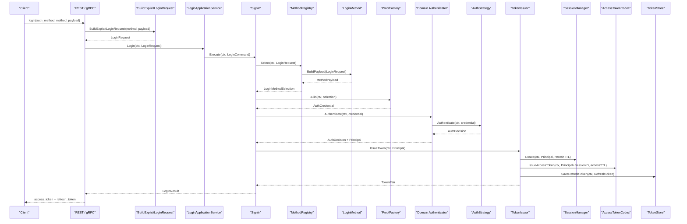
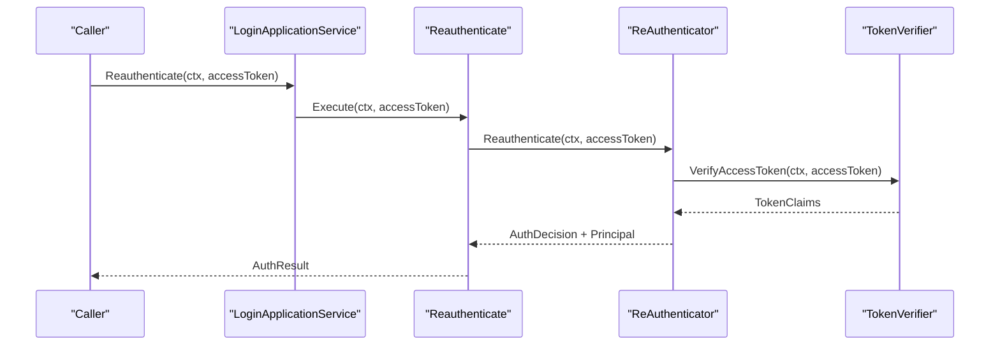

# 登录链路：从 Login 请求到 Session 与 Token

## 本文回答

本文回答：IAM 一次登录请求如何从 REST `POST /api/v2/authn/login` 或 gRPC `Login` 进入 AuthN application，如何通过 `MethodRegistry` 选择登录方式，如何由 `LoginMethod` 验证并构造方法专属 payload，如何通过 `ProofFactory` 生成领域层 `AuthCredential`，如何由 `Authenticator/AuthStrategy` 得到认证判决，最终如何创建 session、签发 access token、保存 refresh token，并返回给调用方。

读完本文，你应该能回答：

- REST v2 登录请求的结构是什么；
- `auth_method` 和 `method_payload` 如何映射到 application `LoginRequest`；
- 为什么 handler 不直接查账号、查凭据或签 JWT；
- `MethodRegistry` 和 `LoginMethod` 的边界是什么；
- password、phone_otp、wechat、wecom 分别如何构造 method payload；
- `ProofFactory` 如何把 method payload 转成领域 `AuthCredential`；
- `Authenticator` 如何选择 `AuthStrategy`；
- password、phone OTP、微信、企微策略的认证边界是什么；
- 登录成功后的 `Principal` 是什么；
- session、access token、refresh token 分别在哪里创建；
- bearer access token 为什么通过 `Reauthenticate` 或 `TokenVerifier` 验证，而不是作为公开登录方式。

本文只讨论“登录到 session/token”的主链路。Refresh、Verify、Revoke、JWKS、KeyRotation 会在后续文档中单独展开。

---

## 30 秒结论

IAM 的登录链路不是：

```text
handler 查账号
handler 验密码
handler 签 JWT
```

当前链路是：

```text
REST / gRPC Login
  -> BuildExplicitLoginRequest
  -> LoginRequest
  -> LoginApplicationService.Login
  -> SignIn.Execute
  -> MethodRegistry.Select
  -> LoginMethod.BuildPayload
  -> ProofFactory.Build
  -> AuthCredential
  -> domain Authenticator.Authenticate
  -> AuthDecision / Principal
  -> TokenIssuer.IssueToken
  -> Session + AccessToken + RefreshToken
  -> TokenPair
```

核心设计是把登录拆成四层：

| 层 | 责任 |
| --- | --- |
| Transport | 绑定 REST/gRPC request，把 `auth_method + method_payload` 转成 application request |
| Application | 选择登录方式、构造领域 proof、调用 domain authentication、签发 token |
| Domain | 执行不同凭据类型的认证策略，返回认证判决 |
| Infra | 提供 MySQL、Redis、JWT、IDP、SecretVault、OTP 等具体实现 |

当前公开登录方式只包括：

```text
password
phone_otp
wechat
wecom
```

已有 bearer access token 的再验证是独立用例：

```text
LoginApplicationService.Reauthenticate
  -> ReAuthenticator
  -> TokenVerifier.VerifyAccessToken
  -> AuthResult
```

它不创建新 session，不签发新 token，也不是公开 login `auth_method`。

核心源码入口：

- [../../internal/apiserver/transport/rest/authn/handler/auth_login.go](../../internal/apiserver/transport/rest/authn/handler/auth_login.go)
- [../../internal/apiserver/transport/rest/authn/request/auth.go](../../internal/apiserver/transport/rest/authn/request/auth.go)
- [../../internal/apiserver/transport/grpc/service/authn/auth_login_service.go](../../internal/apiserver/transport/grpc/service/authn/auth_login_service.go)
- [../../internal/apiserver/application/authn/login/compatibility/explicit_payload.go](../../internal/apiserver/application/authn/login/compatibility/explicit_payload.go)
- [../../internal/apiserver/application/authn/login/service.go](../../internal/apiserver/application/authn/login/service.go)
- [../../internal/apiserver/application/authn/login/sign_in.go](../../internal/apiserver/application/authn/login/sign_in.go)
- [../../internal/apiserver/application/authn/login/re_authenticate.go](../../internal/apiserver/application/authn/login/re_authenticate.go)
- [../../internal/apiserver/application/authn/login/method/selector.go](../../internal/apiserver/application/authn/login/method/selector.go)
- [../../internal/apiserver/application/authn/login/proof/factory.go](../../internal/apiserver/application/authn/login/proof/factory.go)
- [../../internal/apiserver/domain/authn/authentication/authenticater.go](../../internal/apiserver/domain/authn/authentication/authenticater.go)
- [../../internal/apiserver/application/authn/token/issuer.go](../../internal/apiserver/application/authn/token/issuer.go)

---

## 主图：从 Login 到 TokenPair



---

## 重点速查

| 关注点 | 当前事实 | 代码证据 |
| --- | --- | --- |
| REST 登录入口 | `POST /api/v2/authn/login` 调用 `AuthHandler.LoginV2`。 | [../../internal/apiserver/transport/rest/authn/handler/auth_login.go](../../internal/apiserver/transport/rest/authn/handler/auth_login.go) |
| gRPC 登录入口 | `authServiceServer.Login` 使用同一套 explicit login contract。 | [../../internal/apiserver/transport/grpc/service/authn/auth_login_service.go](../../internal/apiserver/transport/grpc/service/authn/auth_login_service.go) |
| 公开 `auth_method` | `password`、`phone_otp`、`wechat`、`wecom`。 | [../../internal/apiserver/application/authn/login/method/selector.go](../../internal/apiserver/application/authn/login/method/selector.go) |
| wire payload 如何转 application request | `BuildExplicitLoginRequest` 调用 compatibility 层解析 JSON 字段名。 | [../../internal/apiserver/application/authn/login/explicit_contract.go](../../internal/apiserver/application/authn/login/explicit_contract.go)、[../../internal/apiserver/application/authn/login/compatibility/explicit_payload.go](../../internal/apiserver/application/authn/login/compatibility/explicit_payload.go) |
| Application 登录门面 | `LoginApplicationService.Login(ctx, LoginCommand)`。 | [../../internal/apiserver/application/authn/login/service.go](../../internal/apiserver/application/authn/login/service.go) |
| 登录编排器 | `SignIn.Execute` 串起 method selection、proof、domain authentication、token issue。 | [../../internal/apiserver/application/authn/login/sign_in.go](../../internal/apiserver/application/authn/login/sign_in.go) |
| 登录方式选择 | `MethodRegistry.Select` 按 `AuthMethod` 找 `LoginMethod`。 | [../../internal/apiserver/application/authn/login/method/selector.go](../../internal/apiserver/application/authn/login/method/selector.go) |
| 方法 payload | `LoginMethod.BuildPayload` 校验并返回 method-specific payload。 | [../../internal/apiserver/application/authn/login/method/](../../internal/apiserver/application/authn/login/method/) |
| 领域 proof 构造 | `ProofFactory.Build` 按 `CredentialKind` 选择 proof builder。 | [../../internal/apiserver/application/authn/login/proof/factory.go](../../internal/apiserver/application/authn/login/proof/factory.go) |
| 领域认证入口 | `Authenticator.Authenticate(ctx, proof)` 按 `CredentialType()` 选择 strategy。 | [../../internal/apiserver/domain/authn/authentication/authenticater.go](../../internal/apiserver/domain/authn/authentication/authenticater.go) |
| Token issue | `TokenIssuer.IssueToken` 创建 session、签 access token、保存 refresh token。 | [../../internal/apiserver/application/authn/token/issuer.go](../../internal/apiserver/application/authn/token/issuer.go) |
| bearer 再验证 | `Reauthenticate` 通过 `TokenVerifier.VerifyAccessToken` 校验已有 access token。 | [../../internal/apiserver/application/authn/login/re_authenticate.go](../../internal/apiserver/application/authn/login/re_authenticate.go)、[../../internal/apiserver/application/authn/login/reauth/token.go](../../internal/apiserver/application/authn/login/reauth/token.go) |

---

## 1. Transport 登录入口

REST v2 登录入口注册为：

```text
POST /api/v2/authn/login
```

请求结构是：

```json
{
  "auth_method": "password",
  "device_id": "optional-device-id",
  "method_payload": {}
}
```

`auth_method` 当前允许：

```text
password
phone_otp
wechat
wecom
```

`method_payload` 按登录方式解析。

### password

```json
{
  "username": "admin@example.com",
  "password": "secret",
  "tenant_id": 1
}
```

### phone_otp

```json
{
  "phone": "+8613800000000",
  "otp_code": "123456"
}
```

### wechat

```json
{
  "app_id": "wx_xxx",
  "code": "wx.login returned code"
}
```

### wecom

```json
{
  "corp_id": "ww_xxx",
  "auth_code": "wecom auth code"
}
```

`device_id` 当前是 wire contract 字段，但登录 application request 尚未消费它。当前 session/token 的事实来源仍是 `Principal` 和 `TokenIssuer`。

Transport 层只做协议适配：

1. 绑定 JSON 或 protobuf；
2. 校验公开 `auth_method` 和 `method_payload`；
3. 调用 `BuildExplicitLoginRequest`；
4. 补充公共上下文，例如 REST 的 `RemoteIP` 和 `UserAgent`；
5. 调用 `LoginApplicationService.Login`。

它不做账号查询、密码校验、OTP 校验、微信 code exchange、session 创建、JWT 签名或 refresh token 保存。

---

## 2. LoginRequest：统一输入

`LoginRequest` 是 application 登录用例的结构化输入。

当前定义在：

- [../../internal/apiserver/application/authn/login/method/types.go](../../internal/apiserver/application/authn/login/method/types.go)
- [../../internal/apiserver/application/authn/login/types.go](../../internal/apiserver/application/authn/login/types.go)

核心字段：

| 字段 | 用途 |
| --- | --- |
| `AuthMethod` | 对外登录方式：password、phone_otp、wechat、wecom |
| `TenantID` | 公共上下文，当前主要由 password payload 的 `tenant_id` 映射而来 |
| `RemoteIP` | 公共上下文，由 transport 填充 |
| `UserAgent` | 公共上下文，由 transport 填充 |
| `Payload` | 方法专属 payload，类型由 `auth_method` 决定 |

`LoginRequest` 的关键约束是：

```text
公共上下文放顶层
方法专属字段放 Payload
领域 proof 构造时同时接收 common + payload
```

这样可以避免同一份上下文在不同 payload 里各存一份，也让 REST/gRPC 的字段名差异被收敛在 compatibility 层。

---

## 3. MethodRegistry：选择登录方式

`MethodRegistry` 是 application/login 对 method 选择能力的别名：

```go
type MethodRegistry = method.Selector
```

当前默认注册：

```go
method.DefaultSelector()
```

包含：

| AuthMethod | LoginMethod | CredentialKind |
| --- | --- | --- |
| `password` | `NewPasswordMethod()` | `password` |
| `phone_otp` | `NewPhoneOTPMethod()` | `phone_otp` |
| `wechat` | `NewWechatMethod()` | `oauth_wx_minip` |
| `wecom` | `NewWecomMethod()` | `oauth_wecom` |

`MethodRegistry.Select(ctx, cmd)` 做三件事：

1. 规范化并检查 `AuthMethod`；
2. 找到对应 `LoginMethod`；
3. 调用 `LoginMethod.BuildPayload(cmd)`，返回 `LoginMethodSelection`。

`LoginMethodSelection` 包含：

```text
AuthMethod
CredentialKind
CommonPayload
Payload
```

这里仍然没有访问账号、Redis、JWT 或外部 IDP。它只是把“调用方选择了哪种登录方式”变成明确的 application selection。

---

## 4. LoginMethod：校验并构造 payload

每个 `LoginMethod` 只负责该方式的 payload：

| 方法 | payload 类型 | 校验 |
| --- | --- | --- |
| password | `PasswordPayload` | `username`、`password` 必填 |
| phone_otp | `PhoneOTPPayload` | `phone`、`otp_code` 必填 |
| wechat | `WechatPayload` | `app_id`、`code` 必填 |
| wecom | `WecomPayload` | `corp_id`、`auth_code` 必填 |

核心源码：

- [../../internal/apiserver/application/authn/login/method/password.go](../../internal/apiserver/application/authn/login/method/password.go)
- [../../internal/apiserver/application/authn/login/method/phone_otp.go](../../internal/apiserver/application/authn/login/method/phone_otp.go)
- [../../internal/apiserver/application/authn/login/method/wechat.go](../../internal/apiserver/application/authn/login/method/wechat.go)
- [../../internal/apiserver/application/authn/login/method/wecom.go](../../internal/apiserver/application/authn/login/method/wecom.go)

这层不构造领域 `AuthCredential`。字段合法之后，仍然要交给 `ProofFactory` 生成领域 proof。

---

## 5. ProofFactory：构造领域 AuthCredential

`ProofFactory` 把 `LoginMethodSelection` 转成领域 `AuthCredential`。

入口：

- [../../internal/apiserver/application/authn/login/proof/factory.go](../../internal/apiserver/application/authn/login/proof/factory.go)

默认工厂：

```go
proof.DefaultFactory(repo, vault, wecomConfig)
```

默认 builder：

| CredentialKind | Builder | 输出领域凭据 |
| --- | --- | --- |
| `password` | `NewPasswordBuilder()` | `PasswordCredential` |
| `phone_otp` | `NewPhoneOTPBuilder()` | `PhoneOTPCredential` |
| `oauth_wx_minip` | `wechatBuilder` | `WechatMinipCredential` |
| `oauth_wecom` | `wecomBuilder` | `WecomCredential` |

password 和 phone_otp builder 主要把 payload + common 转成领域 proof。

wechat 和 wecom builder 会额外读取 IDP 基础设施：

1. 通过 WechatApp repository 查询 app/corp 配置；
2. 校验应用启用状态；
3. 通过 SecretVault 解密 AppSecret 或 CorpSecret；
4. 构造 `WechatMinipCredential` 或 `WecomCredential`。

注意：第三方 code exchange 不在 `ProofFactory` 执行。它只准备领域认证所需材料，真正的 code exchange 和账号绑定判定属于 domain strategy。

---

## 6. Authenticator：领域认证判定

`Authenticator.Authenticate(ctx, credential)` 是领域认证入口。

它根据 `credential.CredentialType()` 选择对应 `AuthStrategy`：

| CredentialType | AuthStrategy | 主要职责 |
| --- | --- | --- |
| password | `PasswordAuthStrategy` | 查账号、查密码凭据、校验密码、检查账号状态 |
| phone_otp | `PhoneOTPAuthStrategy` | 查手机号凭据、消费 OTP、检查账号状态 |
| oauth_wx_minip | `OAuthWechatMinipAuthStrategy` | 微信 code exchange、查 OAuth 绑定、检查账号状态 |
| oauth_wecom | `OAuthWeChatComAuthStrategy` | 企微 code exchange、查 OAuth 绑定、检查账号状态 |

成功时返回：

```text
AuthDecision{OK: true, Principal: ...}
```

失败时返回：

```text
AuthDecision{OK: false, Code: ...}
```

`SignIn` 根据 `AuthDecision` 决定是否继续签发 token。

核心源码：

- [../../internal/apiserver/domain/authn/authentication/authenticater.go](../../internal/apiserver/domain/authn/authentication/authenticater.go)
- [../../internal/apiserver/domain/authn/authentication/auth-password.go](../../internal/apiserver/domain/authn/authentication/auth-password.go)
- [../../internal/apiserver/domain/authn/authentication/auth-phone-otp.go](../../internal/apiserver/domain/authn/authentication/auth-phone-otp.go)
- [../../internal/apiserver/domain/authn/authentication/auth-wechat-mini.go](../../internal/apiserver/domain/authn/authentication/auth-wechat-mini.go)
- [../../internal/apiserver/domain/authn/authentication/auth-wechat-com.go](../../internal/apiserver/domain/authn/authentication/auth-wechat-com.go)

---

## 7. TokenIssuer：创建登录态与 token

认证成功后，`SignIn` 调用：

```go
TokenIssuer.IssueToken(ctx, principal)
```

当前签发顺序是：

```text
Principal
  -> SessionManager.Create(ctx, principal, sessionExpiresAt)
  -> AccessTokenCodec.IssueAccessToken(ctx, principalWithSession, accessTTL)
  -> TokenStore.SaveRefreshToken(ctx, refreshToken)
  -> TokenPair
```

关键语义：

| 对象 | 创建位置 | 说明 |
| --- | --- | --- |
| Session | `TokenIssuer.IssueToken` | 一次在线登录态锚点，过期时间按 refresh TTL |
| Access Token | `TokenIssuer.issueTokenPair` | 当前 infra 是 JWT/JWS，包含 session ID |
| Refresh Token | `TokenIssuer.issueTokenPair` | uuid value，保存到 Redis token store，绑定 session |

核心源码：

- [../../internal/apiserver/application/authn/token/issuer.go](../../internal/apiserver/application/authn/token/issuer.go)
- [../../internal/apiserver/domain/authn/session/manager.go](../../internal/apiserver/domain/authn/session/manager.go)
- [../../internal/apiserver/infra/cache/redis/token-store.go](../../internal/apiserver/infra/cache/redis/token-store.go)

---

## 8. Reauthenticate：bearer token 再验证

`Reauthenticate` 用于验证已有 access token 是否仍然有效。

它不是登录：

- 不读取 `auth_method`；
- 不构造 method payload；
- 不构造新的领域登录 proof；
- 不创建 session；
- 不签发新 token。

它的链路是：



`TokenVerifier.VerifyAccessToken` 会检查：

```text
JWT signature/claims
  -> expiry
  -> service token short-circuit
  -> revoked access marker
  -> session exists and active
  -> user/account subject access
```

REST `/authn/verify` 和 gRPC `VerifyToken` 当前仍属于 token lifecycle facade，它们同样依赖 `TokenVerifier`，并可附加 issuer/audience 期望值校验。

核心源码：

- [../../internal/apiserver/application/authn/login/re_authenticate.go](../../internal/apiserver/application/authn/login/re_authenticate.go)
- [../../internal/apiserver/application/authn/login/reauth/token.go](../../internal/apiserver/application/authn/login/reauth/token.go)
- [../../internal/apiserver/application/authn/token/verifier.go](../../internal/apiserver/application/authn/token/verifier.go)
- [../../internal/apiserver/application/authn/token/service_verify.go](../../internal/apiserver/application/authn/token/service_verify.go)

---

## 9. 错误边界

| 阶段 | 典型错误 | 说明 |
| --- | --- | --- |
| request validate | 不支持的 `auth_method` | transport 或 compatibility 层拒绝 |
| wire payload parse | JSON 字段无法解析 | 返回 bind/payload 错误 |
| method selection | 找不到登录方式 | 返回 unsupported auth method |
| method payload build | 必填字段缺失或类型不匹配 | 返回 payload invalid |
| proof build | 缺少 IDP 配置、应用禁用、secret 解密失败 | 返回 proof build failed |
| domain authentication | 密码错误、OTP 错误、无 OAuth 绑定、账号不可用 | 返回认证失败业务 code |
| token issue | session 创建、JWT 签发、refresh 保存失败 | 登录失败，不应返回半成品 token |
| reauthenticate | token 过期、撤销、session 失效、subject 不可用 | 返回认证失败或 token invalid |

---

## 10. 新增登录方式时改哪里

新增公开登录方式时，按顺序扩展：

1. transport DTO 或 compatibility wire payload；
2. `method.AuthMethod` 和 `method.CredentialKind`；
3. 一个 `LoginMethod`，负责 payload 类型和字段校验；
4. `method.DefaultSelector()` 注册；
5. 一个 proof builder，负责把 payload + common 转成领域 `AuthCredential`；
6. `proof.DefaultFactory()` 注册；
7. 一个领域 `AuthStrategy`，负责真正的认证判定；
8. AuthN application builder 中注册该 strategy；
9. 登录链路测试和 transport contract 测试。

不应该把账号查询、外部身份交换、token 签发塞进 transport 或 `LoginMethod`。

---

## 11. 推荐读源码顺序

### 第一轮：transport 到 application request

```text
internal/apiserver/transport/rest/authn/request/auth.go
internal/apiserver/transport/rest/authn/handler/auth_login.go
internal/apiserver/transport/grpc/service/authn/auth_login_service.go
internal/apiserver/application/authn/login/compatibility/explicit_payload.go
```

目标：理解 wire contract 如何变成 `LoginRequest`。

### 第二轮：application 编排

```text
internal/apiserver/application/authn/login/service.go
internal/apiserver/application/authn/login/sign_in.go
internal/apiserver/application/authn/login/method/selector.go
internal/apiserver/application/authn/login/proof/factory.go
```

目标：理解登录用例只做 orchestrate。

### 第三轮：各登录方式

```text
internal/apiserver/application/authn/login/method/password.go
internal/apiserver/application/authn/login/method/phone_otp.go
internal/apiserver/application/authn/login/method/wechat.go
internal/apiserver/application/authn/login/method/wecom.go
internal/apiserver/application/authn/login/proof/password.go
internal/apiserver/application/authn/login/proof/phone_otp.go
internal/apiserver/application/authn/login/proof/oauth.go
```

目标：理解 method payload 和 proof 的分工。

### 第四轮：领域认证

```text
internal/apiserver/domain/authn/authentication/authenticater.go
internal/apiserver/domain/authn/authentication/auth-password.go
internal/apiserver/domain/authn/authentication/auth-phone-otp.go
internal/apiserver/domain/authn/authentication/auth-wechat-mini.go
internal/apiserver/domain/authn/authentication/auth-wechat-com.go
```

目标：理解真正的认证判定和 Principal 构造。

### 第五轮：登录态和 token

```text
internal/apiserver/application/authn/token/issuer.go
internal/apiserver/application/authn/token/verifier.go
internal/apiserver/application/authn/token/refresher.go
internal/apiserver/domain/authn/session/
internal/apiserver/infra/cache/redis/token-store.go
internal/apiserver/infra/cache/redis/session_store.go
```

目标：理解 session、access token、refresh token 的生命周期。
