# 登录链路：从 Login 请求到 Session 与 Token

## 本文回答

本文回答：IAM 一次登录请求如何从 REST `POST /api/v2/authn/login` 进入 AuthN application，如何通过 `SignInAdapterCatalog` 和 `MethodSelector` 选择登录方式，如何构造领域层 `AuthCredential`，如何由 `Authenticator/AuthStrategy` 得到认证判决，最终如何创建 session、签发 access token、保存 refresh token，并返回给调用方。

读完本文，你应该能回答：

- REST v2 登录请求的结构是什么；
- `auth_method` 和 `method_payload` 如何映射到 application `LoginRequest`；
- 为什么 handler 不直接查账号、查凭据或签 JWT；
- `SignInAdapterCatalog` 解决什么问题；
- password、phone_otp、wechat、wecom 分别如何构造 domain proof；
- `Authenticator` 如何选择 `AuthStrategy`；
- password、phone OTP、微信、企微策略的认证边界是什么；
- 登录成功后的 `Principal` 是什么；
- session、access token、refresh token 分别在哪里创建；
- 登录失败、认证失败、token issue 失败分别如何处理；
- bearer / `jwt_token` 为什么是内部兼容能力，不是 REST v2 公开登录方式。

本文只讨论“登录到 session/token”的主链路。Refresh、Verify、Revoke、JWKS、KeyRotation 会在后续文档中单独展开。

---

## 30 秒结论

IAM 的登录链路不是：

```text
handler 查账号
handler 验密码
handler 签 JWT
```

而是：

```text
REST LoginV2
  -> LoginRequest
  -> LoginApplicationService
  -> SignIn
  -> MethodSelector
  -> SignInAdapter
  -> AuthCredential proof
  -> domain Authenticator
  -> AuthStrategy
  -> AuthDecision / Principal
  -> TokenIssuer
  -> Session + AccessToken + RefreshToken
  -> REST TokenPair
```

核心设计是把登录拆成三层：

| 层 | 责任 |
| --- | --- |
| Transport | 解析 REST request，把不同 `method_payload` 转成 application request |
| Application | 选择登录方式、构造 proof、调用 domain authentication、签发 token |
| Domain | 执行不同凭据类型的认证策略，返回认证判决 |
| Infra | 提供 MySQL、Redis、JWT、IDP、SecretVault、OTP 等具体实现 |

当前 REST v2 公开登录方式只包括：

```text
password
phone_otp
wechat
wecom
```

AuthN application 内部还支持 `jwt_token` bearer 复认证 adapter，但它不是 REST v2 `LoginV2Request` 允许的公开 `auth_method`。

核心源码入口：

- [../../internal/apiserver/transport/rest/authn/router.go](../../internal/apiserver/transport/rest/authn/router.go)
- [../../internal/apiserver/transport/rest/authn/handler/auth_login.go](../../internal/apiserver/transport/rest/authn/handler/auth_login.go)
- [../../internal/apiserver/transport/rest/authn/request/auth.go](../../internal/apiserver/transport/rest/authn/request/auth.go)
- [../../internal/apiserver/application/authn/login/services.go](../../internal/apiserver/application/authn/login/services.go)
- [../../internal/apiserver/application/authn/login/services_impl.go](../../internal/apiserver/application/authn/login/services_impl.go)
- [../../internal/apiserver/application/authn/login/sign_in.go](../../internal/apiserver/application/authn/login/sign_in.go)
- [../../internal/apiserver/application/authn/login/adapter_catalog.go](../../internal/apiserver/application/authn/login/adapter_catalog.go)
- [../../internal/apiserver/domain/authn/authentication/authenticater.go](../../internal/apiserver/domain/authn/authentication/authenticater.go)
- [../../internal/apiserver/application/authn/token/issuer.go](../../internal/apiserver/application/authn/token/issuer.go)

---

## 主图：从 Login 到 TokenPair

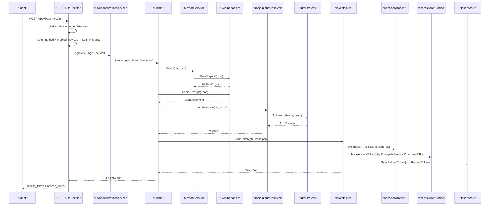

---

## 重点速查

| 关注点 | 当前事实 | 代码证据 |
| --- | --- | --- |
| REST 登录入口 | `POST /api/v2/authn/login` 调用 `AuthHandler.LoginV2`。 | [../../internal/apiserver/transport/rest/authn/router.go](../../internal/apiserver/transport/rest/authn/router.go)、[../../internal/apiserver/transport/rest/authn/handler/auth_login.go](../../internal/apiserver/transport/rest/authn/handler/auth_login.go) |
| REST v2 允许的 auth_method | `password`、`phone_otp`、`wechat`、`wecom`。 | [../../internal/apiserver/transport/rest/authn/request/auth.go](../../internal/apiserver/transport/rest/authn/request/auth.go) |
| REST DTO 如何转 application request | `buildLoginRequest` 根据 method 调用 payload adapter。 | [../../internal/apiserver/transport/rest/authn/handler/auth_login.go](../../internal/apiserver/transport/rest/authn/handler/auth_login.go) |
| Application 登录门面 | `LoginApplicationService.Login(ctx, LoginRequest)`。 | [../../internal/apiserver/application/authn/login/services.go](../../internal/apiserver/application/authn/login/services.go) |
| 登录编排器 | `SignIn.Execute` 选择方法、认证、签发 token。 | [../../internal/apiserver/application/authn/login/sign_in.go](../../internal/apiserver/application/authn/login/sign_in.go) |
| Adapter catalog | 注册 password、phone_otp、wechat、wecom、bearer adapters，并拒绝重复 kind/auth type。 | [../../internal/apiserver/application/authn/login/adapter_catalog.go](../../internal/apiserver/application/authn/login/adapter_catalog.go) |
| 显式 method 选择 | `explicitMethodSelector` 根据 `AuthType` 找 adapter 并构建 payload。 | [../../internal/apiserver/application/authn/login/method_selector_explicit.go](../../internal/apiserver/application/authn/login/method_selector_explicit.go) |
| 领域认证入口 | `Authenticator.Authenticate(ctx, proof)` 按 `CredentialType()` 选择 strategy。 | [../../internal/apiserver/domain/authn/authentication/authenticater.go](../../internal/apiserver/domain/authn/authentication/authenticater.go) |
| Token issue | `TokenIssuer.IssueToken` 创建 session、签 access token、保存 refresh token。 | [../../internal/apiserver/application/authn/token/issuer.go](../../internal/apiserver/application/authn/token/issuer.go) |
| REST response | `convertTokenPair` 返回 `Bearer`、`access_token`、`expires_in`、`refresh_token`。 | [../../internal/apiserver/transport/rest/authn/handler/auth_token.go](../../internal/apiserver/transport/rest/authn/handler/auth_token.go) |

---

## 1. REST 登录入口

REST v2 登录入口注册在 AuthN router 中：

```text
POST /api/v2/authn/login
```

handler 是：

```text
AuthHandler.LoginV2
```

请求结构是：

```json
{
  "auth_method": "password",
  "device_id": "optional-device-id",
  "method_payload": {}
}
```

`auth_method` 当前允许：

```text
password
phone_otp
wechat
wecom
```

`method_payload` 按登录方式解析：

### password

```json
{
  "username": "admin@example.com",
  "password": "secret",
  "tenant_id": 1
}
```

### phone_otp

```json
{
  "phone": "+8613800000000",
  "otp_code": "123456"
}
```

### wechat

```json
{
  "app_id": "wx_xxx",
  "code": "wx.login returned code"
}
```

### wecom

```json
{
  "corp_id": "ww_xxx",
  "auth_code": "wecom auth code"
}
```

### 当前边界：device_id

`LoginV2Request` 中有 `device_id` 字段，但当前 `buildLoginRequest` 并没有把它映射到 application `LoginRequest`。  
因此本文不把 device 作为当前 session/token issue 的事实来源。后续如果要支持设备会话，需要单独扩展 application request、session model 或 token claims。

核心源码：

- [../../internal/apiserver/transport/rest/authn/request/auth.go](../../internal/apiserver/transport/rest/authn/request/auth.go)
- [../../internal/apiserver/transport/rest/authn/handler/auth_login.go](../../internal/apiserver/transport/rest/authn/handler/auth_login.go)

---

## 2. Handler 只做协议适配

`LoginV2` 做四件事：

1. 绑定 JSON；
2. 校验 `auth_method` 和 `method_payload`；
3. 调用 `buildLoginRequest(auth_method, method_payload)`；
4. 执行 `h.loginService.Login(ctx, loginReq)`。

它不做：

- 账号查询；
- 密码校验；
- OTP 校验；
- 微信 code exchange；
- session 创建；
- JWT 签名；
- refresh token 保存。

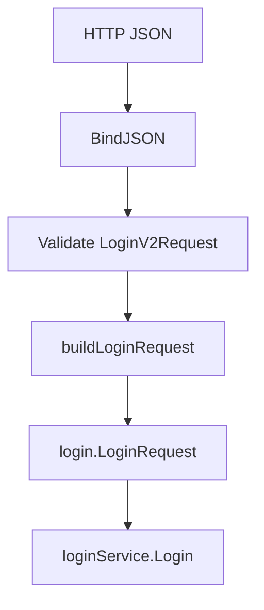

这就是 transport 层的正确边界：  
**REST handler 只把 wire contract 转成 application request。**

核心源码：

- [../../internal/apiserver/transport/rest/authn/handler/auth_login.go](../../internal/apiserver/transport/rest/authn/handler/auth_login.go)

---

## 3. LoginRequest：application 的统一输入

REST handler 最终生成的是 application 层 `LoginRequest`。  
`LoginRequest` 是 `SignInCommand` 的别名。

关键字段：

| 字段 | 用途 |
| --- | --- |
| `AuthType` | 登录方式：password、phone_otp、wechat、wecom、jwt_token |
| `SelectionMode` | v2 显式登录使用 `SignInSelectionExplicit` |
| `TenantID` | 密码登录可带租户 |
| `Username / Password` | password |
| `PhoneE164 / OTPCode` | phone_otp |
| `WechatAppID / WechatJSCode` | wechat |
| `WecomCorpID / WecomCode` | wecom |
| `JWTToken` | internal bearer reauthentication |

REST v2 登录都会设置：

```text
SelectionMode = explicit
```

这意味着：  
application 不再根据字段猜测登录方式，而是信任 `AuthType` 并只读取对应 payload。

核心源码：

- [../../internal/apiserver/application/authn/login/services.go](../../internal/apiserver/application/authn/login/services.go)
- [../../internal/apiserver/transport/rest/authn/handler/auth_login.go](../../internal/apiserver/transport/rest/authn/handler/auth_login.go)

---

## 4. LoginApplicationService 的装配

AuthN module 在 application builder 中创建登录服务。

核心依赖包括：

| 依赖 | 用途 |
| --- | --- |
| `tokenIssuer` | 登录成功后签发 session/access/refresh |
| `tokenRefresher` | logout/refresh 相关能力 |
| `authenticator` | 领域认证入口 |
| `tokenVerifier` | bearer adapter / verify 能力 |
| `wechatAppQuerier` | adapter 查询 IDP 微信应用配置 |
| `secretVault` | adapter 解密 app secret/corp secret |
| `WecomConfig.AgentID` | 企业微信登录 server-side agent id |

`NewLoginApplicationService` 内部会创建：

```text
SignInAdapterCatalog
SignIn
SignOut
```

并把 `SignIn` 注入：

```text
tokenIssuer
methodSelector
domainAuthenticator
failureTranslator
```

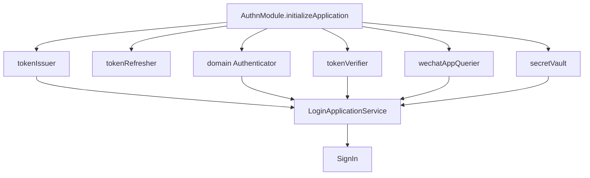

当前 Authenticator 注入了四个 domain strategies：

```text
PasswordAuthStrategy
PhoneOTPAuthStrategy
OAuthWechatMinipAuthStrategy
OAuthWeChatComAuthStrategy
```

核心源码：

- [../../internal/apiserver/container/assembler/authn_application_builder.go](../../internal/apiserver/container/assembler/authn_application_builder.go)
- [../../internal/apiserver/application/authn/login/services_impl.go](../../internal/apiserver/application/authn/login/services_impl.go)

---

## 5. SignIn：登录用例编排器

`SignIn.Execute` 是登录主编排器。

它的步骤是：

```text
selectMethod
  -> authenticate
  -> translate failure if decision not OK
  -> ensurePrincipalTenantID
  -> tokenIssuer.IssueToken
  -> return SignInResult
```

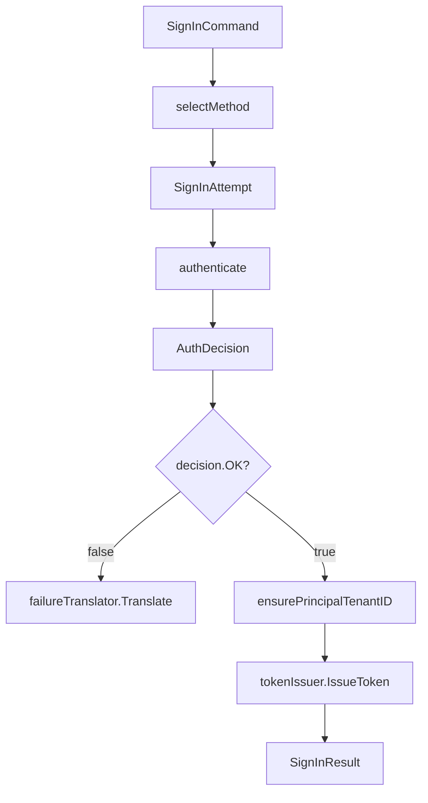

### 5.1 SignIn 不直接认证

SignIn 自己不关心密码、OTP、微信、企微怎么认证。  
它只知道：

```text
我拿到一个 attempt
我让 adapter 准备 proof
我让 domain authenticator 认证 proof
我拿到 principal 后签发 token
```

### 5.2 业务失败和系统异常分开

domain strategy 返回：

```text
AuthDecision{OK: false, ErrCode: ...}
```

表示业务认证失败，例如密码错、OTP 过期、未绑定、账号禁用。

如果 strategy 返回 `error`，表示系统异常或不可继续的错误，例如 repository 查询错误、IDP 交换异常等。  
SignIn 会把 `OK=false` 交给 `AuthFailureTranslator` 转成应用错误。

核心源码：

- [../../internal/apiserver/application/authn/login/sign_in.go](../../internal/apiserver/application/authn/login/sign_in.go)
- [../../internal/apiserver/domain/authn/authentication/input.go](../../internal/apiserver/domain/authn/authentication/input.go)

---

## 6. SignInAdapterCatalog：登录方式扩展点

`SignInAdapterCatalog` 负责维护登录 adapter。

默认注册：

```text
password
phone_otp
wechat
wecom
jwt_token
```

其中：

| Adapter | REST v2 是否公开 | 类型 |
| --- | ---: | --- |
| password | 是 | DomainProofAdapter |
| phone_otp | 是 | DomainProofAdapter |
| wechat | 是 | DomainProofAdapter |
| wecom | 是 | DomainProofAdapter |
| jwt_token | 否 | BearerCompatibilityAdapter |

Catalog 约束：

- adapter 不能为空；
- `Kind()` 不能为空；
- `AuthType()` 不能为空；
- `Kind()` 不能重复；
- `AuthType()` 不能重复。

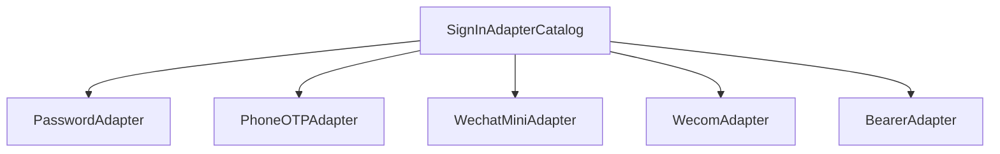

### 为什么需要 Adapter Catalog

因为登录方式变化点不止一个：

1. REST payload 不同；
2. application payload 不同；
3. domain proof 不同；
4. 某些方式需要 IDP 配置或 SecretVault；
5. bearer 复认证不走 domain strategy，而是 token verifier。

如果没有 adapter，handler 或 SignIn 中会出现大量分支：

```text
if password ...
else if phone_otp ...
else if wechat ...
else if wecom ...
```

Adapter Catalog 把登录方式变化点收敛在 adapter 内。

核心源码：

- [../../internal/apiserver/application/authn/login/adapter_catalog.go](../../internal/apiserver/application/authn/login/adapter_catalog.go)

---

## 7. MethodSelector：显式选择登录方式

REST v2 使用：

```text
SelectionMode = explicit
```

因此 `defaultMethodSelector` 会走：

```text
explicitMethodSelector.Select
```

显式选择流程：

```text
AuthType
  -> catalog.findAuthType(AuthType)
  -> adapter.BuildExplicit
  -> SignInAttempt
```

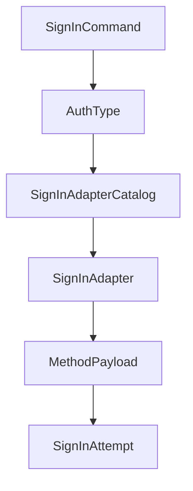

这保证 v2 登录不会再通过字段存在性猜测登录方式。  
例如 `auth_method=password` 时，只会构造 password payload，不会因为请求里混入 phone/wechat 字段改变登录路径。

核心源码：

- [../../internal/apiserver/application/authn/login/method_selector.go](../../internal/apiserver/application/authn/login/method_selector.go)
- [../../internal/apiserver/application/authn/login/method_selector_explicit.go](../../internal/apiserver/application/authn/login/method_selector_explicit.go)

---

## 8. Adapter 如何构造 Domain Proof

### 8.1 password adapter

password adapter 做两件事：

1. 校验 username/password；
2. 构造 `authentication.PasswordCredential`。

```text
Username + Password + TenantID
  -> PasswordPayload
  -> PasswordCredential
```

Proof 字段包括：

```text
TenantID
RemoteIP
UserAgent
Username
Password
```

核心源码：

- [../../internal/apiserver/application/authn/login/adapter_password.go](../../internal/apiserver/application/authn/login/adapter_password.go)

### 8.2 phone_otp adapter

phone_otp adapter 做两件事：

1. 校验 phone/otp_code；
2. 构造 `authentication.PhoneOTPCredential`。

```text
PhoneE164 + OTP
  -> PhoneOTPPayload
  -> PhoneOTPCredential
```

Proof 字段包括：

```text
TenantID
RemoteIP
UserAgent
PhoneE164
OTP
```

核心源码：

- [../../internal/apiserver/application/authn/login/adapter_phone_otp.go](../../internal/apiserver/application/authn/login/adapter_phone_otp.go)

### 8.3 wechat adapter

wechat adapter 不只是把 `app_id/code` 包装成 proof。  
它还会：

1. 通过 IDP repository 查询 WeChat app；
2. 检查 app 是否存在；
3. 检查 app 是否启用；
4. 检查 auth credential 是否存在；
5. 通过 SecretVault 解密 AppSecret；
6. 构造 `WechatMinipCredential`。

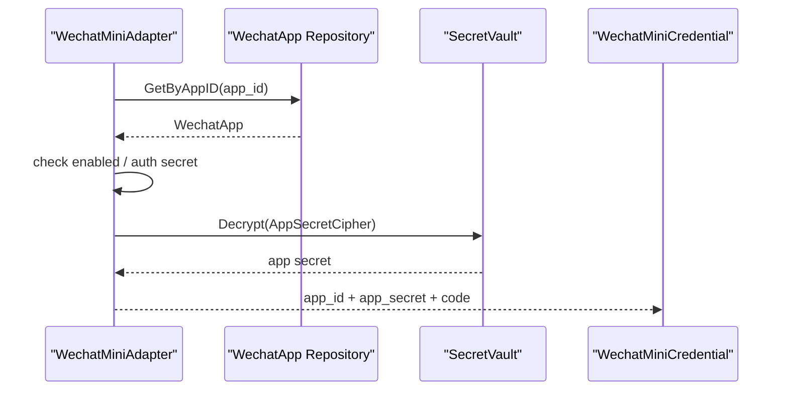

这里的关键边界是：  
REST 请求只传 `app_id` 和 `code`，不传 AppSecret。AppSecret 是 server-side secret，由 IDP 模块保存和解密。

核心源码：

- [../../internal/apiserver/application/authn/login/adapter_wechat_mini.go](../../internal/apiserver/application/authn/login/adapter_wechat_mini.go)

### 8.4 wecom adapter

wecom adapter 会：

1. 校验 `corp_id/auth_code`；
2. 读取 server-side `agent_id` 配置；
3. 通过 IDP repository 查询企业微信 app；
4. 检查 app 是否存在、启用、凭据是否存在；
5. 通过 SecretVault 解密 CorpSecret；
6. 构造 `WecomCredential`。

```text
corp_id + auth_code
  -> server-side agent_id
  -> IDP app config
  -> SecretVault decrypt corp secret
  -> WecomCredential
```

这保证企微登录请求不需要、也不应该携带 `agent_id/corp_secret`。

核心源码：

- [../../internal/apiserver/application/authn/login/adapter_wecom.go](../../internal/apiserver/application/authn/login/adapter_wecom.go)

### 8.5 bearer adapter

bearer adapter 是内部兼容能力。  
它不构造 domain proof，而是直接调用 token verifier 重新认证已存在的 access token：

```text
jwt_token
  -> tokenVerifier.VerifyAccessToken
  -> AuthDecision
```

它实现的是 `BearerCompatibilityAdapter`，不是 `DomainProofAdapter`。

REST v2 `LoginV2Request.Validate()` 当前不允许 `jwt_token` 作为公开 `auth_method`。

核心源码：

- [../../internal/apiserver/application/authn/login/adapter_bearer.go](../../internal/apiserver/application/authn/login/adapter_bearer.go)
- [../../internal/apiserver/transport/rest/authn/request/auth.go](../../internal/apiserver/transport/rest/authn/request/auth.go)

---

## 9. Domain Authenticator：统一认证入口

`Authenticator.Authenticate(ctx, proof)` 是领域层认证入口。

它的流程是：

```text
proof.CredentialType()
  -> strategyFor(credentialType)
  -> strategy.Authenticate(ctx, proof)
  -> AuthDecision
```

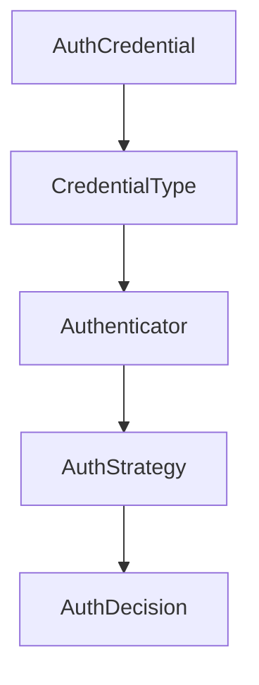

如果找不到 strategy，返回 unsupported credential type 错误。  
如果 strategy 返回 `OK=false`，表示认证不通过，但不是系统异常。

核心源码：

- [../../internal/apiserver/domain/authn/authentication/authenticater.go](../../internal/apiserver/domain/authn/authentication/authenticater.go)
- [../../internal/apiserver/domain/authn/authentication/input.go](../../internal/apiserver/domain/authn/authentication/input.go)

---

## 10. Password 认证策略

Password strategy 的核心步骤：

1. 根据 username 查找账户；
2. 根据账户类型处理 tenant 边界；
3. 检查账户 enabled/locked；
4. 查找密码凭据；
5. 使用 hasher + pepper 验证密码；
6. 判断是否需要 rehash；
7. 构造 Principal。

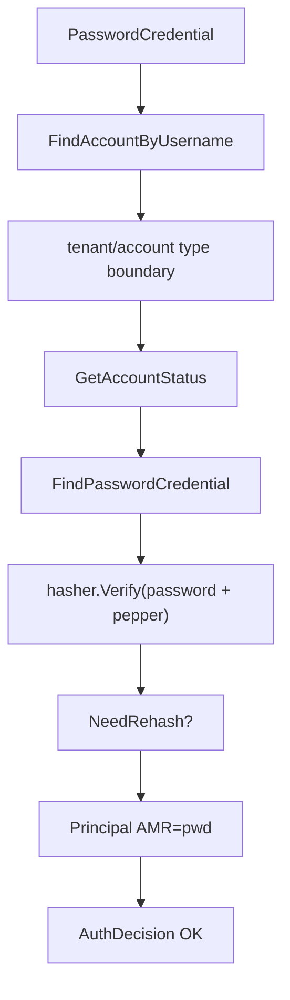

失败边界：

| 场景 | AuthDecision |
| --- | --- |
| 账户不存在 | `ErrInvalidCredential` |
| 运营账号 tenant 不匹配 | `ErrInvalidCredential` |
| 账户禁用 | `ErrDisabled` |
| 账户锁定 | `ErrLocked` |
| 未设置密码 | `ErrInvalidCredential` |
| 密码错误 | `ErrInvalidCredential`，携带 CredentialID |

当前 password strategy 会返回 `ShouldRotate` 和 `NewMaterial` 表示密码哈希需要升级。  
但 `SignIn.Execute` 当前只记录 `should_rotate`，本文不声称登录链路已经在 SignIn 中持久化 rehash。

核心源码：

- [../../internal/apiserver/domain/authn/authentication/auth-password.go](../../internal/apiserver/domain/authn/authentication/auth-password.go)
- [../../internal/apiserver/application/authn/login/sign_in.go](../../internal/apiserver/application/authn/login/sign_in.go)

---

## 11. Phone OTP 认证策略

Phone OTP strategy 的核心步骤：

1. 验证并消费 OTP；
2. 根据手机号查找凭据绑定；
3. 检查账户 enabled/locked；
4. 构造 Principal。

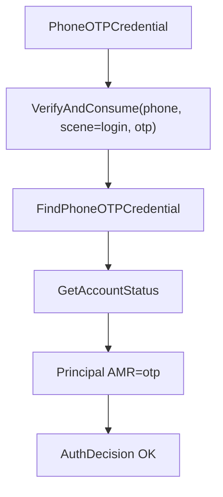

这里最关键的是：

```text
VerifyAndConsume
```

OTP 校验成功后即消费，避免同一个验证码重放。

失败边界：

| 场景 | AuthDecision |
| --- | --- |
| OTP 缺失、无效或过期 | `ErrOTPMissingOrExpiry` |
| 手机号未绑定账户 | `ErrNoBinding` |
| 账户禁用 | `ErrDisabled` |
| 账户锁定 | `ErrLocked` |

核心源码：

- [../../internal/apiserver/domain/authn/authentication/auth-phone-otp.go](../../internal/apiserver/domain/authn/authentication/auth-phone-otp.go)

---

## 12. WeChat 小程序认证策略

WeChat 小程序登录分成 application adapter 和 domain strategy 两段。

### 12.1 Adapter 阶段

Adapter 负责 server-side 配置准备：

```text
app_id + code
  -> query WechatApp
  -> check enabled / credential
  -> decrypt AppSecret
  -> WechatMiniCredential
```

### 12.2 Domain strategy 阶段

Domain strategy 负责外部身份认证与绑定检查：

1. 调用微信 API 用 code 换 openID/unionID；
2. 优先使用 unionID，回退 openID；
3. 根据 app_id + idpIdentifier 查 OAuth credential；
4. 检查账户 enabled/locked；
5. 构造 Principal。

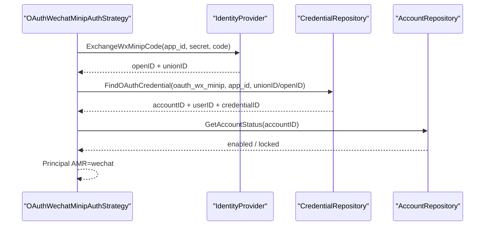

失败边界：

| 场景 | AuthDecision |
| --- | --- |
| code exchange 失败 | `ErrIDPExchangeFailed` |
| 没有 OAuth 绑定 | `ErrNoBinding` |
| 账户禁用 | `ErrDisabled` |
| 账户锁定 | `ErrLocked` |

核心源码：

- [../../internal/apiserver/application/authn/login/adapter_wechat_mini.go](../../internal/apiserver/application/authn/login/adapter_wechat_mini.go)
- [../../internal/apiserver/domain/authn/authentication/auth-wechat-mini.go](../../internal/apiserver/domain/authn/authentication/auth-wechat-mini.go)

---

## 13. WeCom 企业微信认证策略

企微登录同样分成 adapter 和 domain strategy。

### 13.1 Adapter 阶段

Adapter 负责：

```text
corp_id + auth_code
  -> server-side agent_id
  -> query WechatApp by corp_id
  -> check enabled / credential
  -> decrypt corp secret
  -> WecomCredential
```

### 13.2 Domain strategy 阶段

Domain strategy 负责：

1. 调用企业微信 API 用 code 换 openUserID/userID；
2. 优先使用 userID，回退 openUserID；
3. 根据 corp_id + idpIdentifier 查 OAuth credential；
4. 检查账户 enabled/locked；
5. 构造 Principal。

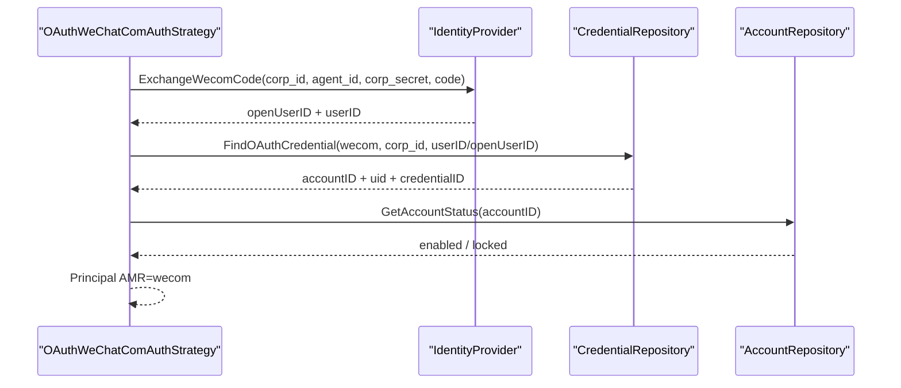

失败边界：

| 场景 | AuthDecision |
| --- | --- |
| agent_id 未配置 | application adapter 返回 invalid argument |
| code exchange 失败 | `ErrIDPExchangeFailed` |
| 没有 OAuth 绑定 | `ErrNoBinding` |
| 账户禁用 | `ErrDisabled` |
| 账户锁定 | `ErrLocked` |

核心源码：

- [../../internal/apiserver/application/authn/login/adapter_wecom.go](../../internal/apiserver/application/authn/login/adapter_wecom.go)
- [../../internal/apiserver/domain/authn/authentication/auth-wechat-com.go](../../internal/apiserver/domain/authn/authentication/auth-wechat-com.go)

---

## 14. Principal：认证成功后的统一主体

领域认证成功后返回：

```text
authentication.Principal
```

字段包括：

| 字段 | 含义 |
| --- | --- |
| `AccountID` | 账号 ID |
| `UserID` | 用户 ID |
| `TenantID` | 租户 ID |
| `SessionID` | 认证阶段通常为空，token issue 后补入 |
| `AMR` | Authentication Methods References |
| `Claims` | 附加认证信息 |

AMR 当前包括：

| 登录方式 | AMR |
| --- | --- |
| password | `pwd` |
| phone_otp | `otp` |
| wechat | `wechat` |
| wecom | `wecom` |

如果 Principal 的 TenantID 为空，`SignIn.Execute` 会调用 `ensurePrincipalTenantID`，补齐默认 tenant。

核心源码：

- [../../internal/apiserver/domain/authn/authentication/types.go](../../internal/apiserver/domain/authn/authentication/types.go)
- [../../internal/apiserver/application/authn/login/sign_in.go](../../internal/apiserver/application/authn/login/sign_in.go)

---

## 15. TokenIssuer：从 Principal 到 Session 与 TokenPair

认证成功后，SignIn 调用：

```text
tokenIssuer.IssueToken(ctx, principal)
```

它的步骤是：

1. 校验 principal；
2. 计算 session 过期时间：`now + refreshTTL`；
3. 调用 `SessionManager.Create` 创建 session；
4. 用 sessionID 构造 token principal；
5. 调用 `AccessTokenCodec.IssueAccessToken` 签发 access token；
6. 生成 refresh token value；
7. 构造 refresh token；
8. 保存 refresh token；
9. 返回 TokenPair。

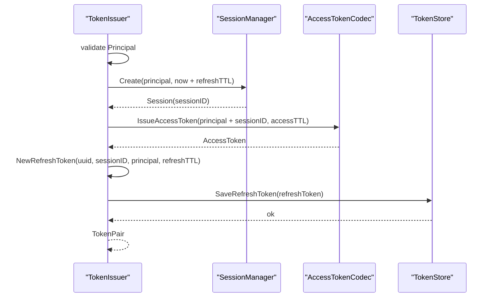

### 15.1 Session

Session 由 domain session manager 创建：

```text
SessionID
UserID
AccountID
TenantID
AMR
Claims
ExpiresAt
```

session 过期时间使用 refresh token TTL。  
这意味着 session 生命周期和 refresh token 生命周期绑定得更紧，而不是和短期 access token TTL 绑定。

### 15.2 Access Token

Access token 由 `AccessTokenCodec` 签发。  
JWT 只是当前 infra 实现之一，application 层只依赖 codec 端口。

Access token 包含 sessionID，使后续 verify/revoke 能关联在线 session 状态。

### 15.3 Refresh Token

Refresh token 不是 JWT 签名 token，而是：

```text
uuid value
```

并保存到 token store 中，包含：

```text
sessionID
userID
accountID
tenantID
AMR
session claims
expiresAt
```

核心源码：

- [../../internal/apiserver/application/authn/token/issuer.go](../../internal/apiserver/application/authn/token/issuer.go)
- [../../internal/apiserver/application/authn/token/ports.go](../../internal/apiserver/application/authn/token/ports.go)
- [../../internal/apiserver/application/authn/token/types.go](../../internal/apiserver/application/authn/token/types.go)
- [../../internal/apiserver/domain/authn/session/manager.go](../../internal/apiserver/domain/authn/session/manager.go)

---

## 16. REST TokenPair 响应

TokenIssuer 返回 application `TokenPair` 后，REST handler 会转换为 HTTP response：

```json
{
  "token_type": "Bearer",
  "access_token": "...",
  "expires_in": 900,
  "refresh_token": "..."
}
```

转换规则：

| response 字段 | 来源 |
| --- | --- |
| `token_type` | 固定 `Bearer` |
| `access_token` | `tokenPair.AccessToken.Value` |
| `expires_in` | 当前时间到 `AccessToken.ExpiresAt` 的剩余秒数 |
| `refresh_token` | `tokenPair.RefreshToken.Value` |

核心源码：

- [../../internal/apiserver/transport/rest/authn/handler/auth_token.go](../../internal/apiserver/transport/rest/authn/handler/auth_token.go)

---

## 17. 失败边界

| 阶段 | 失败点 | 当前边界 |
| --- | --- | --- |
| REST bind | JSON 不合法 | handler 返回 bind error |
| REST validate | auth_method 非法 | 返回 invalid argument |
| REST build request | method_payload 解析失败 | 返回 bind/invalid argument |
| method selection | AuthType 找不到 adapter | 返回 unsupported authentication method |
| adapter explicit build | 必填字段缺失 | 返回 invalid argument |
| adapter proof | payload 类型不匹配 | 返回 invalid argument |
| wechat/wecom adapter | IDP repo 或 SecretVault 不可用 | 返回 invalid argument |
| wechat/wecom adapter | app 不存在、禁用、凭据缺失、解密失败 | 返回 invalid argument |
| domain authenticator | 未初始化 | 返回 invalid argument |
| domain authenticator | strategy 不存在 | 返回 unsupported credential type |
| domain strategy | 认证失败 | 返回 `AuthDecision{OK:false, ErrCode}` |
| SignIn | `OK=false` | failure translator 转成应用错误 |
| token issue | session 创建失败 | 返回 internal error |
| token issue | access token 生成失败 | 返回 internal error |
| token issue | refresh token 保存失败 | 返回 internal error |
| REST response | tokenPair nil | 返回空 Bearer response，不应作为成功登录的正常预期 |

---

## 18. 设计模式

| 模式 | 为什么用 | IAM 落地 | 代价和边界 |
| --- | --- | --- | --- |
| Adapter Catalog | 登录方式多，payload 和 proof 不同 | `SignInAdapterCatalog` | 新增方式要注册 adapter，并维护 AuthType/Kind 唯一 |
| Strategy | 不同凭据类型认证算法不同 | `Authenticator + AuthStrategy` | strategy 只认证，不签 token |
| Ports & Adapters | 认证依赖仓储、OTP、IDP、JWT、Redis | domain/application 依赖端口，infra 实现 | 端口缺失时必须 fail closed |
| DTO Mapper | REST v2 wire schema 与 application command 不同 | `buildLoginRequest` | mapper 必须和 OpenAPI 同步 |
| Session Token Issuer | 登录成功不只是签 JWT | session + access token + refresh token | issue 失败时整个登录失败 |
| Failure Translation | 业务失败和系统异常分开 | `AuthDecision.ErrCode` + translator | 需要确保 ErrCode 到错误响应的映射稳定 |

---

## 19. 当前边界与后续问题

### 19.1 bearer adapter 不是 REST v2 公开登录方式

Application 内部支持 `jwt_token` bearer adapter，但 REST v2 `LoginV2Request` 当前只允许：

```text
password
phone_otp
wechat
wecom
```

因此文档中不要把 `jwt_token` 写成公开登录方式。

### 19.2 device_id 当前未进入应用层

REST `LoginV2Request` 有 `device_id`，但当前 handler 没有传入 `LoginRequest`。  
如果未来要支持设备级 session、设备撤销、设备审计，需要扩展 application/domain/session/token claim 链路。

### 19.3 密码 rehash 当前没有在 SignIn 中持久化

Password strategy 可以返回：

```text
ShouldRotate
NewMaterial
```

但当前 SignIn 只是记录 `should_rotate` 并继续签发 token。  
如果要完成密码 hash 参数升级闭环，需要补充应用层持久化逻辑。

### 19.4 微信/企微登录要求先有绑定

微信/企微 strategy 当前认证成功的前提是 OAuth credential 已经绑定账户。  
未绑定会返回 `ErrNoBinding`，不会自动创建用户或账号。  
账号注册/绑定属于 onboarding/account 能力，不在本文展开。

---

## 20. 推荐源码阅读路线

### 第一轮：REST 登录入口

```text
internal/apiserver/transport/rest/authn/router.go
internal/apiserver/transport/rest/authn/request/auth.go
internal/apiserver/transport/rest/authn/handler/auth_login.go
internal/apiserver/transport/rest/authn/handler/auth_token.go
```

目标：看清 REST v2 request 如何转成 application request，以及 token response 如何返回。

### 第二轮：登录应用服务

```text
internal/apiserver/application/authn/login/services.go
internal/apiserver/application/authn/login/services_impl.go
internal/apiserver/application/authn/login/sign_in.go
internal/apiserver/application/authn/login/method_selector.go
internal/apiserver/application/authn/login/method_selector_explicit.go
internal/apiserver/application/authn/login/adapter_catalog.go
```

目标：看清 application 如何选择登录方式、构造 attempt、调用 domain authenticator。

### 第三轮：各登录 adapter

```text
internal/apiserver/application/authn/login/adapter_password.go
internal/apiserver/application/authn/login/adapter_phone_otp.go
internal/apiserver/application/authn/login/adapter_wechat_mini.go
internal/apiserver/application/authn/login/adapter_wecom.go
internal/apiserver/application/authn/login/adapter_bearer.go
```

目标：看清不同登录方式如何把 application payload 转成 domain proof。

### 第四轮：领域认证

```text
internal/apiserver/domain/authn/authentication/authenticater.go
internal/apiserver/domain/authn/authentication/input.go
internal/apiserver/domain/authn/authentication/types.go
internal/apiserver/domain/authn/authentication/auth-password.go
internal/apiserver/domain/authn/authentication/auth-phone-otp.go
internal/apiserver/domain/authn/authentication/auth-wechat-mini.go
internal/apiserver/domain/authn/authentication/auth-wechat-com.go
```

目标：看清 Authenticator、AuthStrategy、AuthDecision、Principal。

### 第五轮：Token issue

```text
internal/apiserver/application/authn/token/issuer.go
internal/apiserver/application/authn/token/ports.go
internal/apiserver/application/authn/token/types.go
internal/apiserver/domain/authn/session/manager.go
```

目标：看清 session、access token、refresh token 如何被创建。

### 第六轮：模块装配

```text
internal/apiserver/container/assembler/authn.go
internal/apiserver/container/assembler/authn_application_builder.go
internal/apiserver/container/rest_deps.go
```

目标：看清 LoginApplicationService、TokenService、REST AuthHandler 如何被装配。

---

## 21. 验证建议

```bash
go test ./internal/apiserver/application/authn/login \
  ./internal/apiserver/domain/authn/authentication \
  ./internal/apiserver/application/authn/token \
  ./internal/apiserver/transport/rest/authn \
  ./internal/apiserver/container

make docs-hygiene
```

建议重点测试方向：

| 测试方向 | 目的 |
| --- | --- |
| LoginV2 auth_method validate | 确认 REST v2 只允许公开方式 |
| buildLoginRequest | 确认 method_payload 映射正确 |
| adapter catalog duplicate check | 防止重复 AuthType/Kind |
| explicit method selector | 确认 v2 不走 legacy field inference |
| password strategy | 账户状态、密码错误、锁定/禁用、tenant 边界 |
| phone OTP strategy | OTP consume、手机号绑定、账户状态 |
| wechat/wecom strategy | IDP exchange、绑定查询、账户状态 |
| token issuer | session 创建、access token 签发、refresh token 保存 |
| REST response | token_type、expires_in、refresh_token 映射 |

---

## 本文总结

IAM 登录链路可以压缩成一句话：

> REST handler 只做协议适配，application SignIn 负责编排登录方式与 token issue，domain Authenticator 负责认证判决，TokenIssuer 负责把 Principal 变成 Session、Access Token 和 Refresh Token。

核心链路是：

```text
LoginV2Request
  -> LoginRequest
  -> SignInCommand
  -> SignInAttempt
  -> AuthCredential
  -> AuthDecision
  -> Principal
  -> Session
  -> AccessToken
  -> RefreshToken
  -> TokenPair response
```

这条链路的设计价值在于：

- 新增登录方式时，优先扩展 adapter 和 strategy；
- handler 不污染业务规则；
- domain 不知道 REST/gRPC；
- token issue 不等同于简单 JWT 签名，而是包含 session 和 refresh token 管理；
- 在线认证、离线验签、session/revoke 边界可以在后续文档中继续拆开。
