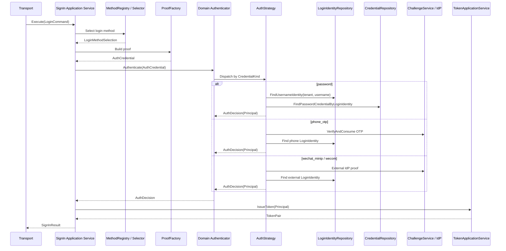

# 02-Login 链路：从登录请求到 Principal 与 Token

## 1. 本文解决什么问题

本文说明 IAM AuthN 模块中的 **Login（登录认证）链路**。

Login 的职责不是创建 User，也不是绑定新的 LoginIdentity，而是：

```text
证明请求者控制某个 LoginIdentity，认证成功后构造 Principal，并签发 Token。
```

Login 链路承接前置模型：

```text
User
  └── LoginIdentity
        └── Credential(optional)
```

不同登录方式的证明材料不同：

| 登录方式 | 定位主体的对象 | 证明方式 | 是否使用 Credential |
| --- | --- | --- | ---: |
| username/password | LoginIdentity(username) | password hash 校验 | 是 |
| phone_otp | LoginIdentity(phone) | Challenge 校验 | 否 |
| wechat_minip | LoginIdentity(wechat_minip) | 微信 code2session | 否 |
| wecom | LoginIdentity(wecom) | 企业微信身份解析 | 否 |

本文重点说明：

1. Login 与 Onboarding、Linking 的边界；
2. 登录请求如何选择认证方式；
3. ProofFactory 如何把请求转成领域认证凭据；
4. Authenticator 如何选择领域认证策略；
5. 不同认证策略如何查找 LoginIdentity 与 Credential；
6. 认证成功后如何构造 Principal；
7. TokenApplicationService 如何签发 Token；
8. Application、Domain、Infra 三层在 Login 链路中的职责。

---

## 2. 核心结论

### 2.1 Login 是认证链路，不是开通链路

Login 不负责创建 User。

Login 不负责绑定新的 LoginIdentity。

Login 只做一件事：

```text
验证请求者是否能证明某个 LoginIdentity 属于自己。
```

如果验证成功：

```text
LoginIdentity -> User -> Principal -> Token
```

如果验证失败：

```text
返回认证失败，不创建任何身份结构。
```

---

### 2.2 Login 的 subject 是 User，认证入口是 LoginIdentity

登录成功后，系统最终识别出的主体是 `User`。

但本次登录使用的入口是 `LoginIdentity`。

因此 Principal 中应同时包含：

```text
UserID
LoginIdentityID
AuthMethod
Realm
AMR
Claims
```

其中：

| 字段 | 语义 |
| --- | --- |
| `UserID` | IAM 认证主体，Token subject |
| `LoginIdentityID` | 本次认证使用的登录身份 |
| `AuthMethod` | 本次认证方式，例如 password、phone_otp、wechat_minip、wecom |
| `Realm` | Provider 所在命名空间，例如 tenant_id、global、appid、corp_id |
| `AMR` | Authentication Method References |
| `Claims` | 用于 Token 的扩展声明 |

---

### 2.3 Credential 只在需要长期认证材料时参与 Login

Password 登录需要 Credential：

```text
username + password
  -> LoginIdentity(username)
  -> Credential(password)
  -> verify password hash
```

Phone OTP 不需要长期 Credential：

```text
phone + otp
  -> Challenge verify
  -> LoginIdentity(phone)
```

WeChat / WeCom 不需要长期 Credential：

```text
external code
  -> external IdP proof
  -> LoginIdentity(wechat_minip / wecom)
```

这与 AuthN 总模型保持一致：

```text
LoginIdentity 0..N Credential
```

---

### 2.4 Token 不是领域模型，Token 是认证结果的安全表达

Login 领域层产出的是：

```text
AuthDecision
Principal
```

应用层再把 Principal 交给 Token 服务，签发：

```text
Access Token
Refresh Token
Session
```

JWT 是一种紧凑的 claims 表达格式；当 JWT 作为 JWS payload 时，claims 会被签名或完整性保护。本文不把 JWT 当作领域模型，而是把它作为 Principal 的安全表达形式。

---

## 3. 总体链路图



---

## 4. Application 层：SignIn 编排

Login 应用层入口位于：

```text
internal/apiserver/application/authn/login
```

核心服务是 `SignIn`。

它负责编排一次登录：

```text
1. 选择登录方式
2. 构造领域认证凭据 proof
3. 调用领域认证器 Authenticator
4. 判断认证结果
5. 构造 Principal 后签发 Token
6. 返回 SignInResult
```

典型流程：

```text
LoginCommand
  -> methodRegistry.Select
  -> proofFactory.Build
  -> domainAuthenticator.Authenticate
  -> tokenService.IssueToken
  -> SignInResult
```

Application 层不直接校验密码、不直接查询 MySQL、不直接拼 JWT。

它只编排：

```text
method selection
proof build
domain authentication
token issue
```

---

## 5. LoginCommand：登录请求输入

LoginCommand 表达一次登录请求。

它通常包含：

```text
auth method
method payload
remote ip
user agent
tenant / realm context
```

不同登录方式的 payload 不同：

| AuthMethod | Payload |
| --- | --- |
| password | username、password、tenant_id |
| phone_otp | phone、otp |
| wechat | appid、js_code |
| wecom | corp_id、oauth_code |

Transport 层负责把 REST/gRPC 请求转换为 LoginCommand。

Application 层不应该直接依赖 HTTP request body。

---

## 6. MethodRegistry：登录方式选择

`MethodRegistry` 或 `MethodSelector` 负责根据 LoginCommand 选择认证方式。

它解决的问题是：

```text
这次请求到底走 password、phone_otp、wechat_minip 还是 wecom？
```

选择结果通常包括：

```text
AuthMethod
CredentialKind
Payload
```

这样后续 ProofFactory 就可以根据选择结果构造领域层的 `AuthCredential`。

---

## 7. ProofFactory：从应用请求到领域凭据

`ProofFactory` 负责把应用层请求转换成领域层认证凭据。

例如：

```text
PasswordPayload -> PasswordCredential
PhoneOTPPayload -> PhoneOTPCredential
WechatMiniPayload -> WechatMinipCredential
WecomPayload -> WecomCredential
```

这里的“Credential”是认证证明输入，不等同于持久化领域模型 `domain/authn/credential.Credential`。

需要区分：

| 名称 | 所在层 | 语义 |
| --- | --- | --- |
| `AuthCredential` | authentication 领域认证输入 | 本次认证请求携带的证明材料 |
| `Credential` | credential 领域模型 | IAM 长期保存的认证材料 |

例如 password 登录：

```text
AuthCredential = 本次输入的 username + password
Credential = 数据库里保存的 password hash
```

---

## 8. Domain Authenticator：领域认证器

`Authenticator` 是领域层认证策略调度器。

它根据 `AuthCredential.CredentialKind()` 选择具体认证策略：

```text
CredentialKindPassword -> PasswordAuthStrategy
CredentialKindPhoneOTP -> PhoneOTPAuthStrategy
CredentialKindWechatMinip -> OAuthWechatMinipAuthStrategy
CredentialKindWecom -> OAuthWeComAuthStrategy
```

认证策略返回：

```text
AuthDecision
```

`AuthDecision` 表达：

```text
认证是否成功
失败原因 code
认证成功后的 Principal
本次使用的 LoginIdentityID
本次使用的 CredentialID(optional)
是否需要轮换认证材料
新认证材料(optional)
```

---

## 9. Password 登录链路

## 9.1 输入

```text
tenant_id / realm
username
password
remote_ip
user_agent
```

## 9.2 领域凭据

```text
PasswordCredential
```

它是本次登录请求携带的证明材料。

## 9.3 认证流程

```text
1. 根据 tenant_id + username 查找 LoginIdentity(username)。
2. 检查 LoginIdentity 是否存在。
3. 检查 LoginIdentity 状态是否 active。
4. 根据 LoginIdentityID 查找 password Credential。
5. 检查 Credential 是否存在。
6. 校验 password hash。
7. 判断是否需要 rehash / rotate material。
8. 构造 Principal。
9. 返回 AuthDecision。
```

## 9.4 Password 登录的关键边界

```text
username 是 LoginIdentity.Identifier。
password hash 是 Credential.Material。
tenant_id 或 default realm 是 LoginIdentity.Realm。
```

不要把 username/password 整体当成一个账号。

正确结构是：

```text
User
  └── LoginIdentity(username / realm / identifier)
        └── Credential(password hash)
```

---

## 10. Phone OTP 登录链路

## 10.1 输入

```text
phone
otp
remote_ip
user_agent
```

## 10.2 领域凭据

```text
PhoneOTPCredential
```

它表达本次请求携带的手机号和验证码。

## 10.3 认证流程

```text
1. 校验并消费 Challenge(scene=login, target=phone)。
2. 根据 provider=phone, realm=global, identifier=phone 查找 LoginIdentity。
3. 检查 LoginIdentity 是否存在。
4. 检查 LoginIdentity 状态是否 active。
5. 构造 Principal。
6. 返回 AuthDecision。
```

## 10.4 Phone OTP 的关键边界

```text
phone 是 LoginIdentity。
otp 是 Challenge。
phone_otp 不创建长期 Credential。
```

如果 OTP 校验失败，不应该创建 User，也不应该创建 LoginIdentity。

---

## 11. WeChat Mini 登录链路

## 11.1 输入

```text
appid
js_code
remote_ip
user_agent
```

## 11.2 领域凭据

```text
WechatMinipCredential
```

它表达本次登录请求携带的外部 IdP proof 所需信息。

## 11.3 认证流程

```text
1. 使用 appid + js_code 调用微信 code2session。
2. 得到 openid / unionid。
3. 优先根据 provider=wechat_minip, realm=appid, identifier=openid 查找 LoginIdentity。
4. 如果 openid 未命中且 unionid 存在，则根据 GlobalIdentifier 查找 LoginIdentity。
5. 检查 LoginIdentity 状态是否 active。
6. 构造 Principal。
7. 返回 AuthDecision。
```

## 11.4 WeChat 登录的关键边界

```text
openid 是 LoginIdentity.Identifier。
appid 是 LoginIdentity.Realm。
unionid 是 LoginIdentity.GlobalIdentifier。
微信 code2session 是外部 IdP proof。
微信登录不创建长期 Credential。
```

---

## 12. WeCom 登录链路

## 12.1 输入

```text
corp_id
oauth_code
agent_id(optional)
remote_ip
user_agent
```

## 12.2 领域凭据

```text
WecomCredential
```

## 12.3 认证流程

```text
1. 使用企业微信 OAuth code 解析 userid。
2. 根据 provider=wecom, realm=corp_id, identifier=userid 查找 LoginIdentity。
3. 检查 LoginIdentity 状态是否 active。
4. 构造 Principal。
5. 返回 AuthDecision。
```

## 12.4 WeCom 登录的关键边界

```text
corp_id 是 LoginIdentity.Realm。
userid 是 LoginIdentity.Identifier。
企业微信完成外部身份认证。
IAM 不保存企业微信 Credential。
```

---

## 13. LoginIdentity 状态检查

不论哪种登录方式，只要解析到 LoginIdentity，都必须检查身份状态。

核心规则：

```text
active -> 可以继续认证
 disabled / archived / deleted -> 认证失败
```

这样可以支持：

```text
禁用某个登录方式，而不是禁用整个 User。
```

例如：

```text
禁用 wechat_minip 登录身份，但保留 password 登录。
禁用 phone 登录身份，但保留 wecom 登录。
```

这正是 LoginIdentity 与 User 解耦的价值。

---

## 14. Credential 状态检查

Password 登录除了检查 LoginIdentity，还必须检查 password Credential。

Credential 需要考虑：

```text
是否存在
是否 enabled
是否被 locked_until 锁定
失败次数
最近成功时间
最近失败时间
```

认证失败时应记录：

```text
FailedAttempts + 1
LastFailureAt = now
必要时 LockedUntil = now + lock duration
```

认证成功时应记录：

```text
LastSuccessAt = now
FailedAttempts = 0
LockedUntil = nil
```

如果 password hash 算法需要升级，应通过 `ShouldRotate / NewMaterial` 等机制触发 material rotation。

---

## 15. Principal 构造

认证成功后，领域层构造 `Principal`。

Principal 应包含：

```text
UserID
LoginIdentityID
TenantID
AuthMethod
Realm
AMR
Claims
```

示例：password 登录成功：

```text
UserID = U1
LoginIdentityID = L1
TenantID = tenant-A
AuthMethod = password
Realm = tenant-A
AMR = [pwd]
Claims = {
  login_identity_id: L1,
  auth_method: password,
  realm: tenant-A,
  auth_time: now
}
```

示例：phone OTP 登录成功：

```text
UserID = U1
LoginIdentityID = L2
AuthMethod = phone_otp
Realm = global
AMR = [otp]
Claims = {
  phone_number: +8613811112222,
  login_identity_id: L2,
  auth_method: phone_otp,
  realm: global,
  auth_time: now
}
```

Principal 是 Token 签发的输入。

---

## 16. Token 签发

Application 层在认证成功后调用：

```text
TokenApplicationService.IssueToken(ctx, principal)
```

Token 服务负责：

```text
1. 将 Principal 映射为 JWT claims。
2. 签发 Access Token。
3. 签发 Refresh Token。
4. 写入 TokenStore / SessionManager。
5. 返回 TokenPair。
```

Login 链路本身不直接拼 JWT。

JWT / JWS / JWKS 细节由后续文档展开：

```text
06-JWT-JWS-JWKS与KeyRotation.md
```

---

## 17. 返回结果 SignInResult

登录成功后，应用层返回：

```text
Principal
TokenPair
UserID
LoginIdentityID
TenantID
```

这说明 Login 的结果既包含认证主体，也包含本次登录上下文。

外部响应通常应包含：

```text
access_token
refresh_token
expires_in
user_id
login_identity_id
auth_method
```

是否直接暴露完整 Principal，应由接口契约决定。

---

## 18. 分层职责

## 18.1 Application 层职责

| 组件 | 职责 |
| --- | --- |
| `SignIn` | 编排登录流程 |
| `MethodRegistry` | 选择登录方式 |
| `ProofFactory` | 构造领域认证凭据 |
| `TokenApplicationService` | 签发 Token |
| `ReAuthenticator` | 二次认证或重新认证 |

Application 层不负责：

```text
校验 password hash
执行 code2session 的领域判定
判断 LoginIdentity 状态规则
维护 Credential 状态规则
直接操作 JWT 私钥
```

---

## 18.2 Domain 层职责

| 组件 | 职责 |
| --- | --- |
| `Authenticator` | 策略调度 |
| `PasswordAuthStrategy` | 密码认证 |
| `PhoneOTPAuthStrategy` | 手机验证码认证 |
| `OAuthWechatMinipAuthStrategy` | 微信小程序认证 |
| `OAuthWeComAuthStrategy` | 企业微信认证 |
| `Principal` | 认证成功后的主体表达 |
| `AuthDecision` | 认证决策结果 |

Domain 层负责认证规则：

```text
LoginIdentity 是否存在
LoginIdentity 是否 active
Credential 是否存在
Credential 是否可用
外部身份是否已绑定
密码是否匹配
OTP 是否有效
```

---

## 18.3 Infra 层职责

| 能力 | Infra 实现 |
| --- | --- |
| LoginIdentity 查询 | `infra/mysql/loginidentity` |
| Credential 查询与更新 | `infra/mysql/credential` |
| Challenge 存储与消费 | `infra/cache/redis/challenge_repository.go` |
| Token 存储 | Redis TokenStore |
| JWT 签发 | JWT generator / token codec |
| 微信/企微外部身份解析 | IDP adapter |
| AppSecret 解密 | SecretVault |

Infra 层提供技术实现，不决定认证语义。

---

## 19. 错误与失败语义

Login 常见失败包括：

| 场景 | 语义 |
| --- | --- |
| unsupported auth method | 不支持的登录方式 |
| proof build failed | 请求无法构造认证凭据 |
| login identity not found | 登录身份不存在或未绑定 |
| login identity disabled | 登录身份不可用 |
| credential not found | 需要 Credential 但不存在 |
| credential locked | 凭据被临时锁定 |
| invalid credentials | 密码错误或外部 proof 无效 |
| otp invalid | 验证码无效或已过期 |
| token issue failed | 认证成功但 Token 签发失败 |

注意：

```text
认证失败不应该创建 User。
认证失败不应该创建 LoginIdentity。
认证失败不应该创建 Credential。
```

这些属于 Onboarding 或 Linking 的职责。

---

## 20. Login 与其他链路的关系

## 20.1 与 Onboarding 的关系

Onboarding 建立登录所需模型：

```text
User + LoginIdentity + Credential(optional)
```

Login 使用这些模型完成认证。

---

## 20.2 与 Linking 的关系

Linking 为已认证 User 增加更多 LoginIdentity。

Login 可以使用任意 active LoginIdentity 完成认证。

---

## 20.3 与 Challenge 的关系

Phone OTP Login 依赖 Challenge。

```text
SendSMSOTP(scene=login)
VerifyAndConsumeSMSOTP(scene=login)
```

Challenge 校验成功后，Login 再根据 phone LoginIdentity 构造 Principal。

---

## 20.4 与 Session / Token 的关系

Login 认证成功后，通过 Token 服务创建 Token 与 Session。

Session/Token 不是 LoginIdentity，也不是 Credential。

它们是认证后的访问上下文。

---

## 20.5 与 AuthZ 的关系

Login 不做授权决策。

Login 只产生 Principal。

AuthZ 使用 Principal 中的 `UserID`、`TenantID`、claims 等信息进行权限判断。

---

## 21. 代码事实源索引

| 主题 | 代码位置 |
| --- | --- |
| Login 应用服务 | `internal/apiserver/application/authn/login` |
| SignIn 编排 | `internal/apiserver/application/authn/login/sign_in.go` |
| Login 类型定义 | `internal/apiserver/application/authn/login/types.go` |
| Method 选择 | `internal/apiserver/application/authn/login/method` |
| ProofFactory | `internal/apiserver/application/authn/login/proof` |
| ReAuthenticate | `internal/apiserver/application/authn/login/reauth` |
| Authenticator | `internal/apiserver/domain/authn/authentication` |
| Password 策略 | `internal/apiserver/domain/authn/authentication/auth-password.go` |
| Phone OTP 策略 | `internal/apiserver/domain/authn/authentication/auth-phone-otp.go` |
| WeChat 策略 | `internal/apiserver/domain/authn/authentication/auth-wechat-mini.go` |
| WeCom 策略 | `internal/apiserver/domain/authn/authentication/auth-wechat-com.go` |
| Principal | `internal/apiserver/domain/authn/authentication/principal.go` |
| LoginIdentity 模型 | `internal/apiserver/domain/authn/loginidentity` |
| Credential 模型 | `internal/apiserver/domain/authn/credential` |
| Challenge 服务 | `internal/apiserver/application/authn/challenge` |
| Token 应用服务 | `internal/apiserver/application/authn/token` |
| Session 模型 | `internal/apiserver/domain/authn/session` |
| JWT / Token Codec | `internal/apiserver/infra/token` |

---

## 22. 面试与项目讲解口径

可以这样讲：

> IAM 的 Login 链路不是创建用户，而是验证某个 LoginIdentity 的控制权。应用层先根据请求选择登录方式，再通过 ProofFactory 构造领域认证凭据，交给领域层 Authenticator。不同策略分别处理 password、phone_otp、wechat_minip、wecom。认证成功后领域层返回 Principal，应用层再用 TokenApplicationService 签发 Token。这样 Login 链路把“认证语义”和“Token 技术实现”解耦开了。

进一步可以补充：

> 在这个模型中，User 是最终主体，LoginIdentity 是本次认证入口，Credential 只在 password 等长期认证材料场景参与。手机号验证码不走 Credential，而是 Challenge；微信和企业微信通过外部 IdP 完成证明，IAM 只根据解析出的外部身份查找 LoginIdentity。

---

## 23. 后续文档入口

本文说明 Login。

后续应继续阅读：

```text
03-Linking链路-登录身份绑定解绑与安全边界.md
04-Challenge链路-短信验证码与短期认证挑战.md
05-Session与Token边界-Principal-Session-JWT-RefreshToken.md
06-JWT-JWS-JWKS与KeyRotation.md
```

其中：

```text
Linking 说明已认证 User 如何绑定更多 LoginIdentity。
Challenge 说明 OTP 等短期认证挑战如何创建、校验与消费。
Session 与 Token 文档说明 Principal 如何变成访问上下文。
JWT/JWS/JWKS 文档说明 Token 的签名和密钥轮换机制。
```