# 认证语义：用户状态、会话与 Token 边界

## 本文回答

本文回答：IAM 登录成功后，用户、账号、会话、Access Token、Refresh Token 分别代表什么；在线 Verify 和 Refresh 为什么还要重新检查 session、撤销标记、user/account 状态；离线 JWT/JWKS 验签和在线 Verify 的边界在哪里；封禁用户、禁用账号、撤销 session、撤销 access token、撤销 refresh token 分别会影响什么。

读完本文，你应该能回答：

- User、Account、Session、Access Token、Refresh Token 各自是什么；
- 用户状态和账号状态在认证体系里分别起什么作用；
- 登录时检查了哪些状态；
- 登录成功后 session、access token、refresh token 如何关联；
- Access Token 为什么不能只看 JWT 签名；
- Refresh Token 刷新时为什么还要检查 session 和 subject access；
- 用户被 block、账号被 disabled、session 被 revoke 后，旧 token 会怎样；
- 在线 Verify 和离线 JWKS 验签有什么本质区别；
- Revoke access token 与 Revoke refresh token 的影响范围有什么不同；
- User 状态变更和 AuthN session 管理之间的跨模块边界是什么。

---

## 30 秒结论

IAM 的认证语义不是“登录成功后拿到一个 JWT 就结束”。

当前认证体系分成五层状态：

```text
User 状态
  -> Account 状态
  -> Session 状态
  -> Access Token 状态
  -> Refresh Token 状态
```

它们的职责不同：

| 对象 | 代表什么 | 主要用途 |
| --- | --- | --- |
| User | IAM 内部用户身份锚点 | 判断用户是否 active / inactive / blocked |
| Account | 登录账号或外部身份账号 | 判断账号是否 active / disabled / archived / deleted |
| Session | 一次登录会话 | 在线管理登录态、批量撤销、关联 refresh token |
| Access Token | 短期访问凭证，当前由 JWT 承载 | 请求认证和服务间传递身份 |
| Refresh Token | 长期续期凭证，Redis 中保存 | 刷新 access token、维持 session 生命周期 |

在线 Verify 的链路是：

```text
JWT parse/verify
  -> access token expiry
  -> service token short-circuit
  -> revoked access marker
  -> session exists and active
  -> user/account subject access
```

Refresh 的链路是：

```text
load refresh token
  -> session exists and active
  -> user/account subject access
  -> refresh token not expired
  -> issue new access/refresh pair
  -> delete old refresh token
  -> extend session
```

离线 JWKS 验签只能证明 token 的签名、时间、issuer/audience 等静态条件；它看不到 Redis 中的 access revoke marker、refresh token、session 状态，也看不到 User/Account 的最新状态。因此，只要需要撤销、封禁、禁用、会话终止立即生效，就必须走在线 Verify。

核心源码入口：

- [../../internal/apiserver/application/authn/token/issuer.go](../../internal/apiserver/application/authn/token/issuer.go)
- [../../internal/apiserver/application/authn/token/verifier.go](../../internal/apiserver/application/authn/token/verifier.go)
- [../../internal/apiserver/application/authn/token/refresher.go](../../internal/apiserver/application/authn/token/refresher.go)
- [../../internal/apiserver/domain/authn/session/session.go](../../internal/apiserver/domain/authn/session/session.go)
- [../../internal/apiserver/domain/authn/session/manager.go](../../internal/apiserver/domain/authn/session/manager.go)
- [../../internal/apiserver/domain/authn/session/subject_access.go](../../internal/apiserver/domain/authn/session/subject_access.go)
- [../../internal/apiserver/domain/authn/session/evaluator.go](../../internal/apiserver/domain/authn/session/evaluator.go)
- [../../internal/apiserver/domain/authn/account/account.go](../../internal/apiserver/domain/authn/account/account.go)
- [../../internal/apiserver/domain/uc/user/user.go](../../internal/apiserver/domain/uc/user/user.go)
- [../../internal/apiserver/infra/redis/token-store.go](../../internal/apiserver/infra/redis/token-store.go)
- [../../internal/apiserver/infra/redis/session_store.go](../../internal/apiserver/infra/redis/session_store.go)

---

## 主图：认证状态分层

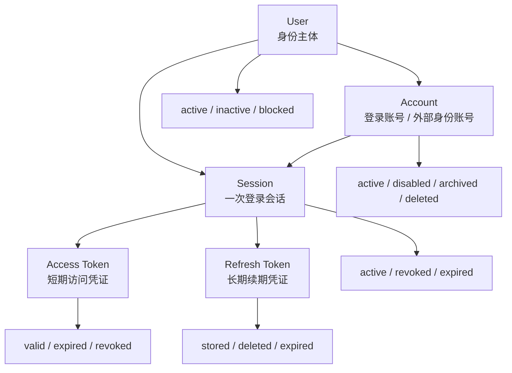

---

## 重点速查

| 问题 | 当前答案 | 代码证据 |
| --- | --- | --- |
| User 状态有哪些 | `active`、`inactive`、`blocked`。 | [../../internal/apiserver/domain/uc/user/types.go](../../internal/apiserver/domain/uc/user/types.go)、[../../internal/apiserver/domain/uc/user/user.go](../../internal/apiserver/domain/uc/user/user.go) |
| Account 状态有哪些 | active、disabled、archived、deleted 等。 | [../../internal/apiserver/domain/authn/account/account.go](../../internal/apiserver/domain/authn/account/account.go) |
| Session 状态有哪些 | `active`、`revoked`、`expired`。 | [../../internal/apiserver/domain/authn/session/session.go](../../internal/apiserver/domain/authn/session/session.go) |
| Session 何时创建 | 登录成功后 `TokenIssuer.IssueToken` 调用 `SessionManager.Create`。 | [../../internal/apiserver/application/authn/token/issuer.go](../../internal/apiserver/application/authn/token/issuer.go) |
| Access Token 如何创建 | `AccessTokenCodec.IssueAccessToken`，当前 infra 是 JWT/JWS。 | [../../internal/apiserver/application/authn/token/issuer.go](../../internal/apiserver/application/authn/token/issuer.go)、[../../internal/apiserver/infra/token/jwt/generator.go](../../internal/apiserver/infra/token/jwt/generator.go) |
| Refresh Token 如何创建 | `uuid` value + Redis store，关联 session/user/account/tenant/amr/claims。 | [../../internal/apiserver/application/authn/token/issuer.go](../../internal/apiserver/application/authn/token/issuer.go)、[../../internal/apiserver/application/authn/token/types.go](../../internal/apiserver/application/authn/token/types.go) |
| 在线 Verify 检查什么 | JWT、过期、撤销标记、session active、user/account access。 | [../../internal/apiserver/application/authn/token/verifier.go](../../internal/apiserver/application/authn/token/verifier.go) |
| Refresh 检查什么 | refresh token、session active、user/account access、refresh token expiry。 | [../../internal/apiserver/application/authn/token/refresher.go](../../internal/apiserver/application/authn/token/refresher.go) |
| User/Account 访问状态在哪里汇总 | `SubjectAccessEvaluator`。 | [../../internal/apiserver/domain/authn/session/evaluator.go](../../internal/apiserver/domain/authn/session/evaluator.go) |
| Access revoke marker 保存在哪里 | Redis token store 的 revoked access token marker。 | [../../internal/apiserver/infra/redis/token-store.go](../../internal/apiserver/infra/redis/token-store.go) |
| Session 保存在哪里 | Redis SessionStore，含 user/account session index。 | [../../internal/apiserver/infra/redis/session_store.go](../../internal/apiserver/infra/redis/session_store.go) |
| Block 用户是否撤销 session | User `Block` 成功后调用 `sessionManager.RevokeByUser`。 | [../../internal/apiserver/application/uc/user/service_status.go](../../internal/apiserver/application/uc/user/service_status.go) |

---

## 1. 为什么要拆认证语义

很多系统会把认证简化成：

```text
登录成功
  -> 签 JWT
  -> 后续只验 JWT
```

IAM 不是这个模型。

IAM 需要支持：

- access token 短期访问；
- refresh token 续期；
- 用户封禁后旧 token 失效；
- 账号禁用后旧 token 失效；
- 单 session 撤销；
- 按用户/账号批量撤销 session；
- access token 单独撤销；
- refresh token 撤销并终止 session；
- 离线 JWKS 验签；
- 在线 Verify 强一致语义。

因此必须把状态拆开：

```text
User / Account 是主体状态
Session 是登录态状态
Access Token 是访问凭证状态
Refresh Token 是续期凭证状态
```

只有拆开，才能解释不同操作的影响范围。

---

## 2. User：身份主体状态

User 是 IAM 内部身份锚点。

当前 User 状态：

| 状态 | 语义 |
| --- | --- |
| `active` | 用户可用 |
| `inactive` | 用户非活跃 |
| `blocked` | 用户被封禁 |

User 实体提供：

```text
Activate()
Deactivate()
Block()
IsUsable()
IsBlocked()
IsInactive()
```

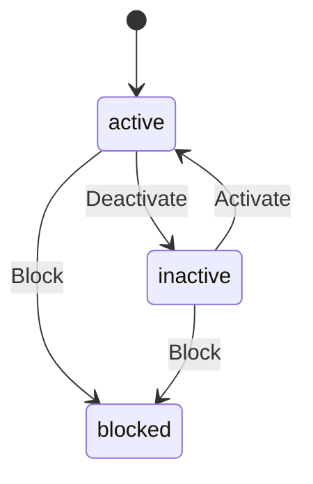

### User 状态如何影响 token

User 状态不是 JWT 静态 claim 的唯一依据。  
在线 Verify / Refresh 会通过 `SubjectAccessEvaluator` 重新加载 User。

当前规则：

| User 状态 | SubjectAccessStatus | 在线 Verify / Refresh |
| --- | --- | --- |
| User 不存在 | blocked | 拒绝 |
| blocked | blocked | 拒绝 |
| inactive | disabled | 拒绝 |
| active | 继续检查 account | 可能允许 |

核心源码：

- [../../internal/apiserver/domain/uc/user/types.go](../../internal/apiserver/domain/uc/user/types.go)
- [../../internal/apiserver/domain/uc/user/user.go](../../internal/apiserver/domain/uc/user/user.go)
- [../../internal/apiserver/domain/authn/session/evaluator.go](../../internal/apiserver/domain/authn/session/evaluator.go)

---

## 3. Account：登录账号状态

Account 表达登录账号或外部身份账号。  
它可以是运营后台账号、微信小程序账号、企业微信账号等。

Account 状态方法包括：

```text
IsActive()
IsDisabled()
IsArchived()
IsDeleted()
```

Account 状态转换方法包括：

```text
Activate()
Disable()
Archive()
Delete()
```

### Account 状态如何影响登录

登录阶段的 domain strategy 会检查账号状态。

例如 password strategy：

1. 根据 username 找 account；
2. 检查 account enabled/locked；
3. 再查 credential 和校验密码。

phone_otp、wechat、wecom strategy 在找到绑定账号后，也会检查 account status。

### Account 状态如何影响旧 token

在线 Verify / Refresh 会通过 `SubjectAccessEvaluator` 重新加载 Account。

当前规则：

| Account 状态 | SubjectAccessStatus | 在线 Verify / Refresh |
| --- | --- | --- |
| Account 不存在 | disabled | 拒绝 |
| disabled | disabled | 拒绝 |
| archived | disabled | 拒绝 |
| deleted | disabled | 拒绝 |
| active | 继续检查 User | 可能允许 |

核心源码：

- [../../internal/apiserver/domain/authn/account/account.go](../../internal/apiserver/domain/authn/account/account.go)
- [../../internal/apiserver/domain/authn/session/evaluator.go](../../internal/apiserver/domain/authn/session/evaluator.go)

---

## 4. SubjectAccessEvaluator：User 与 Account 的统一访问判定

`SubjectAccessEvaluator` 负责把 User 和 Account 状态合并成一个认证主体访问判定。

接口：

```go
Evaluate(ctx, userID, accountID) (SubjectAccessDecision, error)
```

返回状态：

| SubjectAccessStatus | 语义 |
| --- | --- |
| `active` | 允许继续访问 |
| `blocked` | 用户被封禁或不存在 |
| `disabled` | 账号不可用或用户非活跃 |
| `locked` | 账号锁定，当前 verifier 预留了错误映射 |

当前 evaluator 的判断顺序：

```text
load account
  -> if account nil/disabled/archived/deleted: disabled
  -> load user
  -> if user nil/blocked: blocked
  -> if user inactive: disabled
  -> active
```

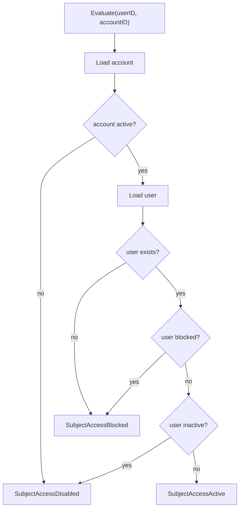

这个 evaluator 是在线 Verify 和 Refresh 的关键，因为它让旧 token 可以受最新用户/账号状态影响。

核心源码：

- [../../internal/apiserver/domain/authn/session/subject_access.go](../../internal/apiserver/domain/authn/session/subject_access.go)
- [../../internal/apiserver/domain/authn/session/evaluator.go](../../internal/apiserver/domain/authn/session/evaluator.go)

---

## 5. Session：一次登录会话

Session 表示一次登录会话。

字段包括：

| 字段 | 含义 |
| --- | --- |
| `SessionID` | 会话 ID |
| `UserID` | 用户 ID |
| `AccountID` | 账号 ID |
| `TenantID` | 租户 ID |
| `Status` | active / revoked / expired |
| `AMR` | 登录方式 |
| `SessionClaims` | 会话级附加信息 |
| `CreatedAt` | 创建时间 |
| `ExpiresAt` | 过期时间 |
| `RevokedAt` | 撤销时间 |
| `RevokeReason` | 撤销原因 |
| `RevokedBy` | 撤销操作方 |

Session 状态：

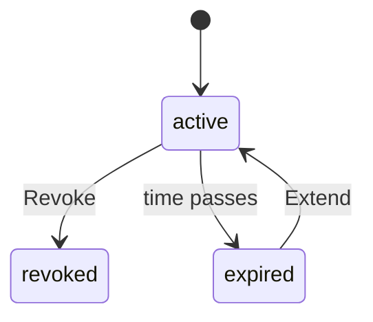

### Session 什么时候创建

登录成功后，TokenIssuer 调用：

```text
SessionManager.Create(ctx, principal, now + refreshTTL)
```

session 过期时间使用 refresh token TTL，而不是 access token TTL。  
这说明 session 是“可续期登录态”的生命周期锚点。

### Session 如何保存

Redis SessionStore 保存：

- session 主对象：Redis String(JSON)；
- user session index：Redis ZSet；
- account session index：Redis ZSet。

这让系统可以按 sessionID 撤销，也可以按 user/account 批量撤销。

核心源码：

- [../../internal/apiserver/domain/authn/session/session.go](../../internal/apiserver/domain/authn/session/session.go)
- [../../internal/apiserver/domain/authn/session/manager.go](../../internal/apiserver/domain/authn/session/manager.go)
- [../../internal/apiserver/application/authn/token/issuer.go](../../internal/apiserver/application/authn/token/issuer.go)
- [../../internal/apiserver/infra/redis/session_store.go](../../internal/apiserver/infra/redis/session_store.go)

---

## 6. Access Token：短期访问凭证

Access Token 是短期访问凭证。  
当前 infra 使用 JWS compact JWT 编码。

JWT claims 当前包括：

| Claim | 来源 |
| --- | --- |
| `jti` | tokenID |
| `sub` | userID |
| `iss` | issuer |
| `aud` | access token audience |
| `iat` | issued at |
| `exp` | expires at |
| `nbf` | not before |
| `token_type` | access / service |
| `sid` | sessionID |
| `user_id` | userID |
| `account_id` | accountID |
| `tenant_id` | tenantID |
| `amr` | 认证方式 |
| `attributes` | 附加属性 |

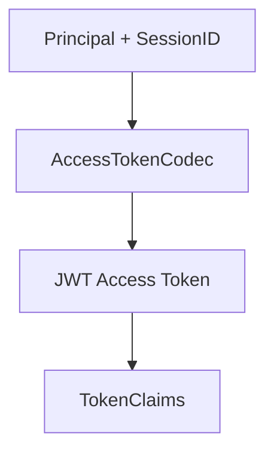

### Access Token 为什么仍然需要在线校验

JWT 自身可以离线验签，但在线 Verify 还会检查：

- token 是否已过期；
- access token 是否被 revoke marker 标记；
- session 是否存在且 active；
- user/account 是否仍允许访问。

因此 access token 是“短期访问凭证”，不是不可撤销的永久授权。

核心源码：

- [../../internal/apiserver/application/authn/token/issuer.go](../../internal/apiserver/application/authn/token/issuer.go)
- [../../internal/apiserver/application/authn/token/types.go](../../internal/apiserver/application/authn/token/types.go)
- [../../internal/apiserver/infra/token/jwt/generator.go](../../internal/apiserver/infra/token/jwt/generator.go)
- [../../internal/apiserver/application/authn/token/verifier.go](../../internal/apiserver/application/authn/token/verifier.go)

---

## 7. Refresh Token：长期续期凭证

Refresh Token 是长期续期凭证。  
当前不是 JWT，而是随机 UUID value，并保存到 Redis。

Refresh Token 数据包括：

| 字段 | 含义 |
| --- | --- |
| `TokenID` | refresh token ID |
| `Value` | refresh token value |
| `SessionID` | 关联 session |
| `UserID` | 用户 ID |
| `AccountID` | 账号 ID |
| `TenantID` | 租户 ID |
| `AMR` | 登录方式 |
| `SessionClaims` | 会话 claims |
| `ExpiresAt` | 过期时间 |

Refresh Token 的 Redis key 基于 token value，TTL 为 refresh token 剩余有效期。

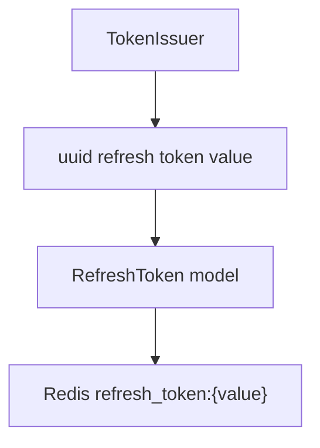

### Refresh Token 与 Session 的关系

Refresh Token 绑定 session。  
刷新时会：

1. 读取 refresh token；
2. 读取 session；
3. 要求 session active；
4. 检查 subject access；
5. 确认 refresh token 未过期；
6. 签发新 token pair；
7. 删除旧 refresh token；
8. 延长 session 到新 refresh token 过期时间。

核心源码：

- [../../internal/apiserver/application/authn/token/types.go](../../internal/apiserver/application/authn/token/types.go)
- [../../internal/apiserver/infra/redis/token-store.go](../../internal/apiserver/infra/redis/token-store.go)
- [../../internal/apiserver/application/authn/token/refresher.go](../../internal/apiserver/application/authn/token/refresher.go)

---

## 8. 登录成功后的状态关系

登录成功时，TokenIssuer 做三件事：

```text
create session
issue access token
save refresh token
```

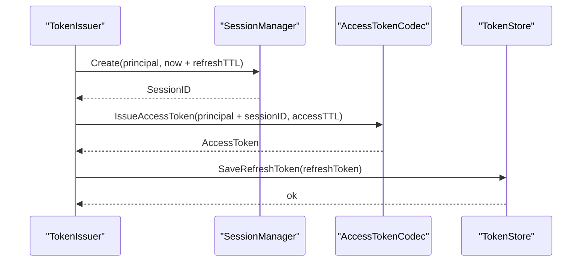

结果是：

```text
sessionID 同时存在于：
- Session
- Access Token claims
- Refresh Token store
```

这使得后续在线 Verify 和 Refresh 都能回到同一个 session 锚点。

---

## 9. 在线 Verify 语义

`VerifyAccessToken` 的检查顺序：

```text
tokenCodec.VerifyAccessToken
  -> claims.IsExpired
  -> if service token: return claims
  -> tokenStore.IsAccessTokenRevoked
  -> claims.SessionID exists
  -> sessionManager.Get
  -> session.IsActive
  -> accessChecker.Evaluate(userID, accountID)
  -> return claims
```

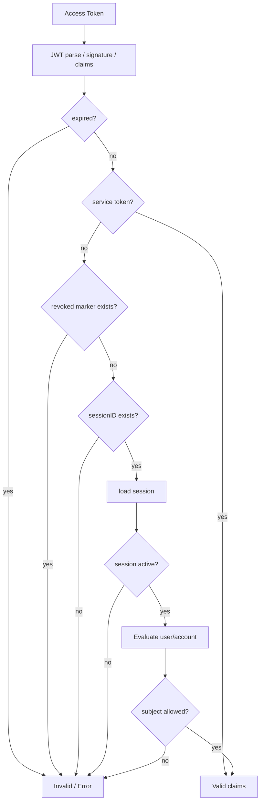

### Service Token 特殊边界

如果 `claims.TokenType == service`，当前 verifier 在过期检查之后直接返回 claims，不检查 access revoke marker、session、user/account 状态。

这说明 service token 是另一类凭证，不属于用户登录 session 语义。它应该在服务间认证文档中单独展开。

核心源码：

- [../../internal/apiserver/application/authn/token/verifier.go](../../internal/apiserver/application/authn/token/verifier.go)
- [../../internal/apiserver/application/authn/token/services.go](../../internal/apiserver/application/authn/token/services.go)
- [../../internal/apiserver/application/authn/token/service_verify.go](../../internal/apiserver/application/authn/token/service_verify.go)

---

## 10. Refresh 语义

Refresh Token 刷新流程：

```text
load refresh token
  -> load session
  -> session active
  -> subject access allowed
  -> refresh token not expired
  -> build principal
  -> issue new token pair
  -> delete old refresh token
  -> extend session
```

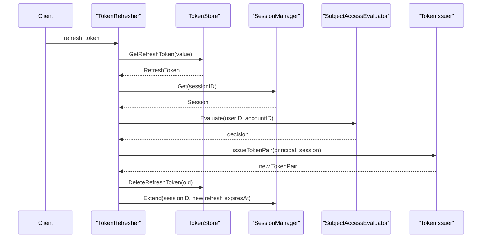

### Refresh 是轮换语义

旧 refresh token 在刷新成功后会被删除：

```text
DeleteRefreshToken(old refresh token)
```

因此 refresh token 是轮换凭证，不应长期复用同一个值。

### Refresh 与 Session Extend

刷新成功后，会把 session 延长到新 refresh token 的过期时间：

```text
sessionManager.Extend(sessionID, newTokenPair.RefreshToken.ExpiresAt)
```

这使 session 生命周期随 refresh token 滚动续期。

核心源码：

- [../../internal/apiserver/application/authn/token/refresher.go](../../internal/apiserver/application/authn/token/refresher.go)
- [../../internal/apiserver/infra/redis/token-store.go](../../internal/apiserver/infra/redis/token-store.go)
- [../../internal/apiserver/domain/authn/session/manager.go](../../internal/apiserver/domain/authn/session/manager.go)

---

## 11. Revoke Access Token

撤销 access token 的流程：

```text
parse token
  -> if expired: no-op
  -> write revoked marker with remaining TTL
  -> if sessionID exists: revoke session
```

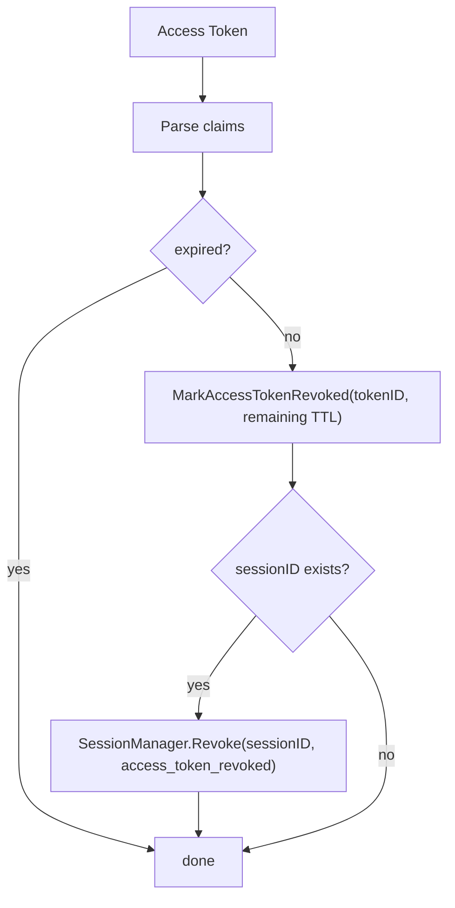

影响范围：

| 影响对象 | 结果 |
| --- | --- |
| 当前 access token | 被 revoke marker 拒绝 |
| 当前 session | 如果 claims 有 sessionID，会被 revoke |
| 当前 refresh token | 不直接删除 |
| 同 session 的后续 refresh | 因 session revoked 而失败 |

这点很关键：  
撤销 access token 当前会撤销关联 session，因此比“只拉黑一个 JWT jti”影响更大。

核心源码：

- [../../internal/apiserver/application/authn/token/issuer.go](../../internal/apiserver/application/authn/token/issuer.go)
- [../../internal/apiserver/infra/redis/token-store.go](../../internal/apiserver/infra/redis/token-store.go)

---

## 12. Revoke Refresh Token

撤销 refresh token 的流程：

```text
load refresh token
  -> if has sessionID: revoke session
  -> delete refresh token
```

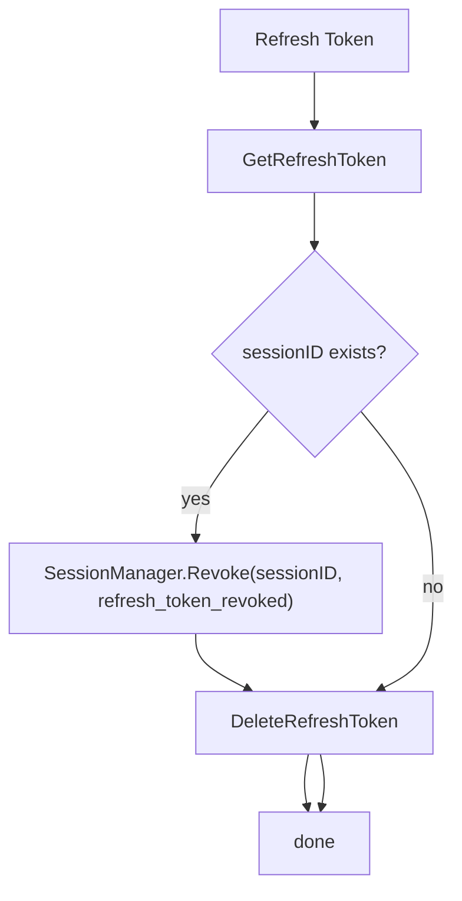

影响范围：

| 影响对象 | 结果 |
| --- | --- |
| 当前 refresh token | 删除 |
| 关联 session | revoked |
| 旧 access token | 不直接写 revoke marker |
| 旧 access token 在线 Verify | 因 session revoked 而失败 |

这说明 refresh token revoke 是终止 session 的主要手段之一。

核心源码：

- [../../internal/apiserver/application/authn/token/refresher.go](../../internal/apiserver/application/authn/token/refresher.go)

---

## 13. User Block 与 Session 撤销

User 状态改变属于 Identity/User 模块，但会影响 AuthN session。

当前 User `Block` 用例：

1. 在 UC UoW 事务中把用户状态改为 blocked；
2. 持久化成功后；
3. 如果 `sessionManager` 存在，则调用：

```text
sessionManager.RevokeByUser(ctx, userID, "user_blocked", userID)
```

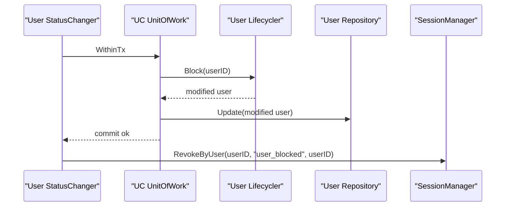

影响：

| 对象 | 结果 |
| --- | --- |
| User | blocked |
| 活跃 sessions | 按 user session index 批量 revoke |
| Access token 在线 Verify | session revoked 或 subject blocked，失败 |
| Refresh token refresh | session revoked 或 subject blocked，失败 |
| 离线 JWT 验签 | 仍可能通过签名验证，但看不到 user blocked |

核心源码：

- [../../internal/apiserver/application/uc/user/service_status.go](../../internal/apiserver/application/uc/user/service_status.go)
- [../../internal/apiserver/infra/redis/session_store.go](../../internal/apiserver/infra/redis/session_store.go)

---

## 14. 在线 Verify 与离线 JWKS 验签

### 14.1 离线 JWKS 验签能证明什么

离线验签可以证明：

```text
token 由 IAM 私钥签出
签名未被篡改
kid 能找到公钥
exp / nbf / iss / aud 等静态 claim 满足要求
```

### 14.2 离线 JWKS 验签不能证明什么

离线验签看不到：

```text
access token revoke marker
refresh token 是否存在
session 是否 revoked / expired
user 是否 blocked / inactive
account 是否 disabled / archived / deleted
```

### 14.3 在线 Verify 多做什么

在线 Verify 在 JWT 验签后继续检查：

```text
revoked access marker
session active
subject access
```

因此：

| 场景 | 离线 JWKS 验签 | 在线 Verify |
| --- | --- | --- |
| JWT 签名有效且未过期 | 可能通过 | 继续检查 |
| access token 被 revoke | 看不到 | 失败 |
| session 被 revoke | 看不到 | 失败 |
| user 被 blocked | 看不到 | 失败 |
| account 被 disabled | 看不到 | 失败 |
| service token | 可验签 | 在线 verifier 当前也不走 session/user/account 检查 |

结论：

```text
离线验签适合低风险、本地快速判断签名有效性
在线 Verify 适合需要撤销、封禁、禁用立即生效的业务边界
```

核心源码：

- [../../internal/apiserver/infra/token/jwt/generator.go](../../internal/apiserver/infra/token/jwt/generator.go)
- [../../internal/apiserver/application/authn/token/verifier.go](../../internal/apiserver/application/authn/token/verifier.go)
- [../../internal/apiserver/application/authn/token/service_verify.go](../../internal/apiserver/application/authn/token/service_verify.go)

---

## 15. 状态变化影响矩阵

| 操作 | User | Account | Session | Access Token | Refresh Token |
| --- | --- | --- | --- | --- | --- |
| 用户 deactivate | inactive | 不变 | 不自动 revoke | 在线 Verify 失败 | Refresh 失败 |
| 用户 block | blocked | 不变 | `RevokeByUser` | 在线 Verify 失败 | Refresh 失败 |
| 账号 disable | 不变 | disabled | 不一定自动 revoke | 在线 Verify 失败 | Refresh 失败 |
| session revoke | 不变 | 不变 | revoked | 在线 Verify 失败 | Refresh 失败 |
| access token revoke | 不变 | 不变 | 当前实现会 revoke session | 当前 access token 失败 | Refresh 因 session revoked 失败 |
| refresh token revoke | 不变 | 不变 | revoke session | 旧 access token 在线 Verify 因 session revoked 失败 | refresh token 删除 |
| refresh token expired | 不变 | 不变 | Refresh 时失败，并删除旧 token | 旧 access token 到期后失效 | 无法刷新 |
| access token expired | 不变 | 不变 | 不变 | Verify 失败 | 可用 refresh token 刷新，前提 session/subject 仍允许 |

注意：  
“账号 disable 是否自动 revoke session”要看具体账号状态修改用例是否调用 session revoke。当前文档只从 online Verify/Refresh 角度说明：即使不主动 revoke，旧 token 在线校验也会因为 subject access disabled 而失败。

---

## 16. 错误语义

在线 Verify 中 subject access 状态映射：

| SubjectAccessStatus | 错误 |
| --- | --- |
| `blocked` | user is blocked |
| `disabled` | account is disabled / subject inactive |
| `locked` | account is locked |
| 其他非 active | user inactive |

Refresh 中也有类似映射：

| SubjectAccessStatus | 错误 |
| --- | --- |
| `blocked` | user is blocked |
| `disabled` | account is disabled |
| `locked` | account is locked |
| 其他非 active | subject is inactive |

REST `VerifyToken` 的外层行为是：  
`tokenService.VerifyToken` 捕获 verifier 的错误后返回 `Valid=false`，而不是直接把底层 verifier 错误暴露给调用方。

核心源码：

- [../../internal/apiserver/application/authn/token/verifier.go](../../internal/apiserver/application/authn/token/verifier.go)
- [../../internal/apiserver/application/authn/token/refresher.go](../../internal/apiserver/application/authn/token/refresher.go)
- [../../internal/apiserver/application/authn/token/service_verify.go](../../internal/apiserver/application/authn/token/service_verify.go)

---

## 17. 设计模式

| 模式 | 为什么用 | IAM 落地 | 代价和边界 |
| --- | --- | --- | --- |
| Session as Online Anchor | JWT 本身难以撤销和批量失效 | access/refresh 都绑定 sessionID | 需要 Redis session store 在线可用 |
| Revocation Marker | 单个 access token 需要主动撤销 | `revokedAccessToken:{jti}` marker | 只能在线 Verify 看到 |
| Rotating Refresh Token | 降低 refresh token 重放风险 | refresh 成功后删除旧 refresh token | 客户端必须保存新 refresh token |
| Subject Access Evaluator | 用户/账号状态要影响旧 token | Verify/Refresh 重新检查 user/account | 在线校验依赖 DB/repository |
| Layered Credential | Access 和 Refresh 职责不同 | access 短期访问，refresh 长期续期 | 文档和客户端必须区分使用方式 |
| Online/Offline Split | 性能和安全需要平衡 | JWKS 离线验签 + 在线 Verify | 调用方要按风险选择 |

---

## 18. 当前边界与待讨论点

### 18.1 Service Token 不走 session/user/account 检查

当前 verifier 在识别 `TokenTypeService` 后直接返回 claims。  
这意味着 service token 是独立语义，不属于用户登录 session。它应在服务间认证文档中单独展开。

### 18.2 User deactivate 不主动 revoke session

当前 User `Block` 会调用 `RevokeByUser`。  
`Deactivate` 当前只修改用户状态，不主动 revoke session。  
但在线 Verify/Refresh 会通过 `SubjectAccessEvaluator` 看到 inactive 并拒绝。

### 18.3 Account disable 是否主动 revoke session 取决于具体用例

本文只确认 online Verify/Refresh 会重新检查 Account。  
账号禁用是否主动撤销 session，需要在账号状态变更用例中单独核对。

### 18.4 离线验签不是权限判定

JWKS 离线验签只处理认证凭证有效性的一部分。  
它不做 AuthZ 权限判定，也不检查 IAM 在线状态。

---

## 19. 推荐源码阅读路线

### 第一轮：Token application service

```text
internal/apiserver/application/authn/token/services.go
internal/apiserver/application/authn/token/service_verify.go
internal/apiserver/application/authn/token/issuer.go
internal/apiserver/application/authn/token/verifier.go
internal/apiserver/application/authn/token/refresher.go
internal/apiserver/application/authn/token/types.go
```

目标：看清 Issue / Verify / Refresh / Revoke。

### 第二轮：Session domain

```text
internal/apiserver/domain/authn/session/session.go
internal/apiserver/domain/authn/session/manager.go
internal/apiserver/domain/authn/session/subject_access.go
internal/apiserver/domain/authn/session/evaluator.go
```

目标：看清 session 生命周期和 subject access。

### 第三轮：User / Account 状态

```text
internal/apiserver/domain/uc/user/types.go
internal/apiserver/domain/uc/user/user.go
internal/apiserver/application/uc/user/service_status.go
internal/apiserver/domain/authn/account/account.go
```

目标：看清 User/Account 状态如何影响在线认证。

### 第四轮：Redis store

```text
internal/apiserver/infra/redis/token-store.go
internal/apiserver/infra/redis/session_store.go
```

目标：看清 refresh token、revoked access marker、session、user/account session index 如何存储。

### 第五轮：JWT infra

```text
internal/apiserver/infra/token/jwt/generator.go
internal/apiserver/application/authn/jwks
internal/apiserver/infra/token/keyset
```

目标：看清 access token claims、JWT 签名、验证 key source。

---

## 20. 验证建议

```bash
go test ./internal/apiserver/application/authn/token \
  ./internal/apiserver/domain/authn/session \
  ./internal/apiserver/infra/redis \
  ./internal/apiserver/domain/uc/user \
  ./internal/apiserver/application/uc/user

make docs-hygiene
```

建议重点测试方向：

| 测试方向 | 目的 |
| --- | --- |
| Verify revoked access token | 确认 revoke marker 生效 |
| Verify revoked session | 确认 session revoked 后 access token 失败 |
| Verify blocked user | 确认 user blocked 后旧 token 失败 |
| Verify disabled account | 确认 account disabled 后旧 token 失败 |
| Refresh rotation | 确认旧 refresh token 删除，新 token pair 生成 |
| Refresh revoked session | 确认 session revoked 后 refresh 失败 |
| Revoke refresh token | 确认 session revoke + refresh token delete |
| User block | 确认 RevokeByUser 被调用 |
| Offline vs online | 确认离线 JWT 验签不能覆盖在线撤销语义 |

---

## 本文总结

IAM 的认证语义可以压缩成一句话：

> Access Token 负责短期访问，Refresh Token 负责续期，Session 是在线登录态锚点，User/Account 状态决定主体是否还能继续访问。

关键链路是：

```text
Login
  -> Session
  -> Access Token
  -> Refresh Token

Verify
  -> JWT
  -> revoked marker
  -> Session
  -> SubjectAccess

Refresh
  -> RefreshToken
  -> Session
  -> SubjectAccess
  -> rotate TokenPair
```

理解这篇文档后，再看 JWKS、KeyRotation、服务间认证和 AuthZ 权限判定时，就能明确区分：

```text
认证凭证是否有效
登录态是否有效
主体是否允许访问
是否有权限访问某资源
```

这四件事不能混在一起。
