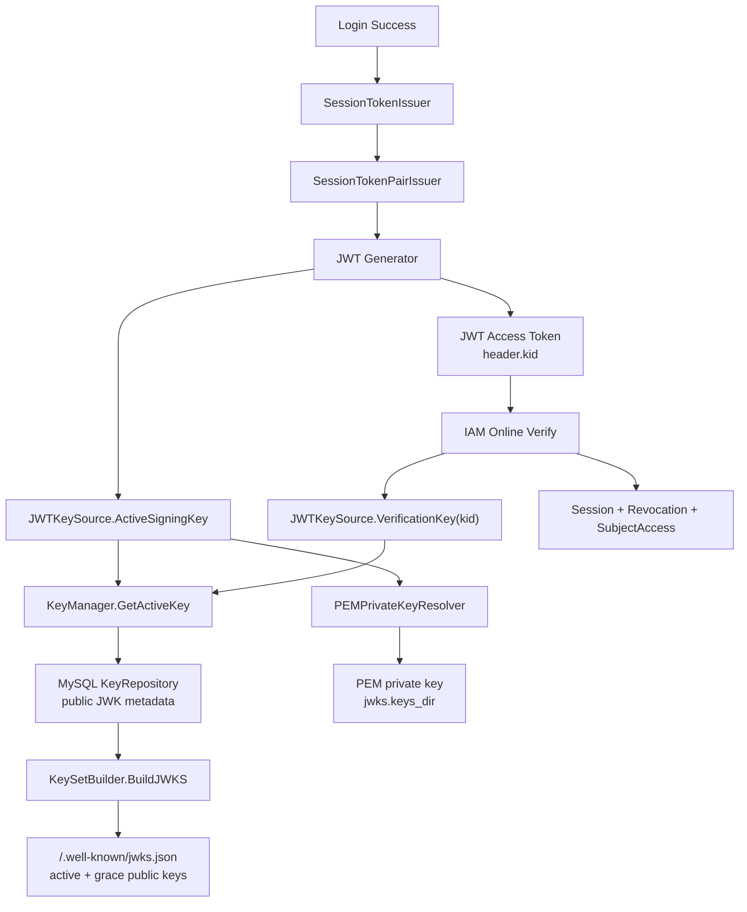
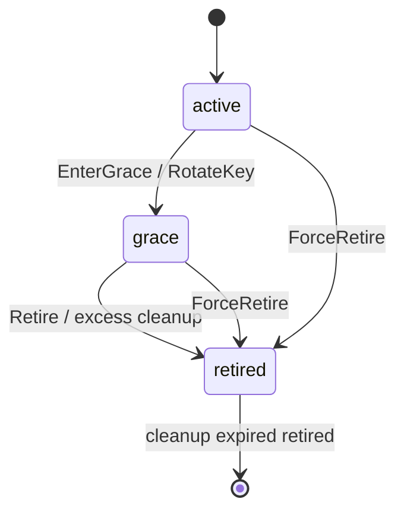
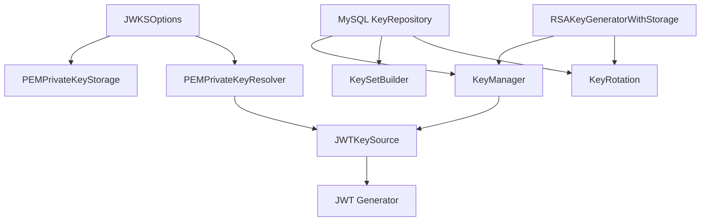
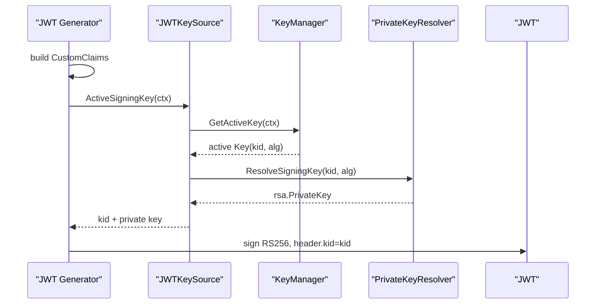
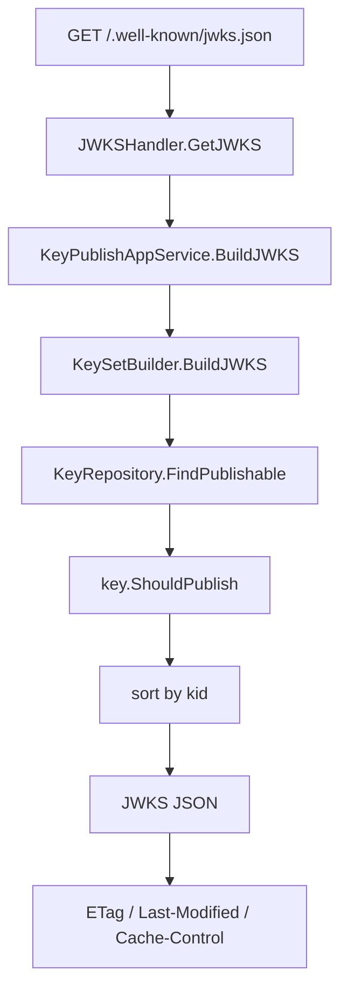
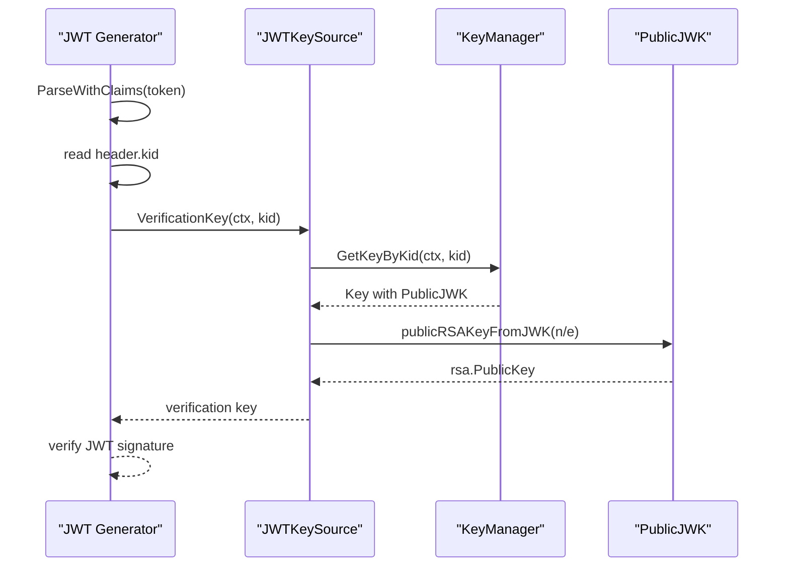
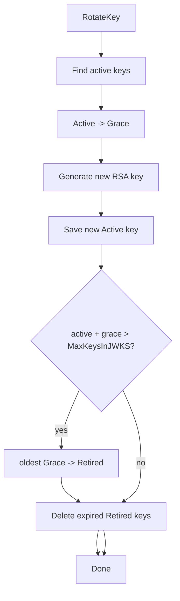
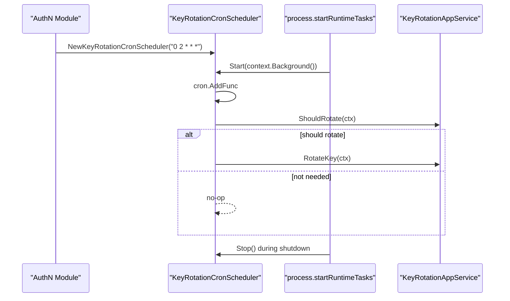

# JWKS 与 KeyRotation

## 本文回答

本文回答：IAM 如何管理 JWT 签名密钥，如何把公钥发布成 JWKS，access token 签发时如何选择 active signing key，JWT 验证时如何根据 `kid` 找到公钥，KeyRotation 如何把密钥从 active 转入 grace 再转入 retired，以及后台 rotation scheduler 如何纳入运行时生命周期。

读完本文，你应该能回答：

- JWKS 是什么，它和 JWT access token 的关系是什么；
- `kid` 在 JWT 签发、验签和 JWKS 发布中的作用是什么；
- private key 和 public JWK 分别存在哪里；
- active / grace / retired 三种 key status 分别代表什么；
- 哪些 key 可以签名，哪些 key 可以发布到 JWKS，哪些 key 可以被在线 Verify 使用；
- `/.well-known/jwks.json` 返回什么；
- JWKS public endpoint 和 admin key management endpoint 的边界是什么；
- `jwks.keys_dir`、`jwks.auto_init` 如何影响启动；
- KeyRotation 的默认策略是什么；
- rotation scheduler 什么时候启动、什么时候停止；
- 强制 retire、手动 grace、自动 rotation 分别会造成什么影响；
- 离线 JWKS 验签与 IAM 在线 Verify 的差异。

---

## 30 秒结论

IAM 当前使用 RSA/JWT/JWKS 体系签发和验证 access token。

核心链路是：

```text
登录成功
  -> SessionTokenIssuer
  -> SessionTokenPairIssuer
  -> AccessTokenCodec
  -> JWT Generator
  -> JWTKeySource.ActiveSigningKey()
  -> active key private key
  -> RS256 JWT with kid

外部服务验签
  -> GET /.well-known/jwks.json
  -> 获取 active/grace public JWK
  -> 根据 JWT header.kid 找 public key
  -> 离线验签

IAM 在线 Verify
  -> JWT Generator.VerifyAccessToken()
  -> JWTKeySource.VerificationKey(kid)
  -> key manager GetKeyByKid()
  -> 继续检查 revoked marker / session / subject access
```

密钥状态语义：

| 状态 | 是否用于签新 token | 是否发布到 JWKS | 主要用途 |
| --- | ---: | ---: | --- |
| `active` | 是 | 是 | 当前签发新 access token |
| `grace` | 否 | 是 | 验证旧 token，等待旧 token 过期 |
| `retired` | 否 | 否 | 不再公开发布，等待清理或保留历史 |

当前默认 rotation policy：

```text
RotationInterval = 30 days
GracePeriod      = 7 days
MaxKeysInJWKS    = 3
```

当前后台 scheduler 使用 cron：

```text
0 2 * * *
```

即每天凌晨 2 点检查一次 `ShouldRotate()`，需要时执行 `RotateKey()`。

核心源码入口：

- [../../internal/apiserver/infra/token/jwt/generator.go](../../internal/apiserver/infra/token/jwt/generator.go)
- [../../internal/apiserver/infra/token/keyset/key.go](../../internal/apiserver/infra/token/keyset/key.go)
- [../../internal/apiserver/infra/token/keyset/key_manager.go](../../internal/apiserver/infra/token/keyset/key_manager.go)
- [../../internal/apiserver/infra/token/keyset/key_rotation.go](../../internal/apiserver/infra/token/keyset/key_rotation.go)
- [../../internal/apiserver/infra/token/keyset/keyset_builder.go](../../internal/apiserver/infra/token/keyset/keyset_builder.go)
- [../../internal/apiserver/infra/token/keyset/jwt_key_source.go](../../internal/apiserver/infra/token/keyset/jwt_key_source.go)
- [../../internal/apiserver/application/authn/jwks/key_management.go](../../internal/apiserver/application/authn/jwks/key_management.go)
- [../../internal/apiserver/application/authn/jwks/key_publish.go](../../internal/apiserver/application/authn/jwks/key_publish.go)
- [../../internal/apiserver/application/authn/jwks/key_rotation.go](../../internal/apiserver/application/authn/jwks/key_rotation.go)
- [../../internal/apiserver/transport/rest/authn/handler/jwks_public.go](../../internal/apiserver/transport/rest/authn/handler/jwks_public.go)
- [../../internal/apiserver/infra/scheduler/key_rotation_cron_scheduler.go](../../internal/apiserver/infra/scheduler/key_rotation_cron_scheduler.go)

---

## 主图：JWT 签发、JWKS 发布与在线 Verify



---

## 重点速查

| 问题 | 当前答案 | 代码证据 |
| --- | --- | --- |
| access token 用什么签发 | `JWT Generator` 使用 active key 的 RSA private key，签出 RS256 JWT。 | [../../internal/apiserver/infra/token/jwt/generator.go](../../internal/apiserver/infra/token/jwt/generator.go)、[../../internal/apiserver/infra/token/keyset/jwt_key_source.go](../../internal/apiserver/infra/token/keyset/jwt_key_source.go) |
| JWT header 里有什么关键字段 | `typ=JWT`、`kid=<active key kid>`。 | [../../internal/apiserver/infra/token/jwt/generator.go](../../internal/apiserver/infra/token/jwt/generator.go) |
| active key 如何取得 | `KeyManager.GetActiveKey()` 返回 active 且可签名的 key。 | [../../internal/apiserver/infra/token/keyset/key_manager.go](../../internal/apiserver/infra/token/keyset/key_manager.go) |
| private key 存在哪里 | 当前开发/简单场景使用 PEM 文件，目录来自 `jwks.keys_dir`。 | [../../internal/apiserver/container/assembler/authn_infra_builder.go](../../internal/apiserver/container/assembler/authn_infra_builder.go)、[../../internal/apiserver/infra/token/keyset/pem_storage.go](../../internal/apiserver/infra/token/keyset/pem_storage.go) |
| public JWK metadata 存在哪里 | MySQL `KeyRepository` 保存 public JWK 和 key status 等元数据。 | [../../internal/apiserver/infra/mysql/jwks/repository.go](../../internal/apiserver/infra/mysql/jwks/repository.go) |
| JWKS 发布哪些 key | active + grace 且未过期的 public JWK。 | [../../internal/apiserver/infra/mysql/jwks/repository.go](../../internal/apiserver/infra/mysql/jwks/repository.go)、[../../internal/apiserver/infra/token/keyset/keyset_builder.go](../../internal/apiserver/infra/token/keyset/keyset_builder.go) |
| JWKS public endpoint | `/.well-known/jwks.json` 和 `/api/v2/.well-known/jwks.json`。 | [../../internal/apiserver/transport/rest/authn/router.go](../../internal/apiserver/transport/rest/authn/router.go) |
| JWKS response 是否支持缓存 | 返回 `ETag`、`Last-Modified`、`Cache-Control`，支持 If-None-Match 304。 | [../../internal/apiserver/transport/rest/authn/handler/jwks_public.go](../../internal/apiserver/transport/rest/authn/handler/jwks_public.go) |
| auto init 规则 | `jwks.auto_init=true` 或 `appMode=development` 时，若无 active key，会自动创建 RS256 active key。 | [../../internal/apiserver/container/assembler/authn_infra_builder.go](../../internal/apiserver/container/assembler/authn_infra_builder.go) |
| rotation 默认策略 | 30 天轮换，7 天 grace，JWKS 最多 3 把 active/grace key。 | [../../internal/apiserver/infra/token/keyset/key.go](../../internal/apiserver/infra/token/keyset/key.go) |
| scheduler cron | 当前 hard-code 为 `0 2 * * *`。 | [../../internal/apiserver/container/assembler/authn_scheduler_builder.go](../../internal/apiserver/container/assembler/authn_scheduler_builder.go) |
| rotation 做什么 | active -> grace，生成新 active，超量 grace -> retired，清理过期 retired。 | [../../internal/apiserver/infra/token/keyset/key_rotation.go](../../internal/apiserver/infra/token/keyset/key_rotation.go) |

---

## 1. JWKS 在 IAM 中解决什么问题

Access Token 当前由 JWT 承载。JWT 的优点是可以被其他服务离线验签，但前提是其他服务能拿到 IAM 的 public key。

JWKS 的作用就是公开当前可用于验证 JWT 签名的公钥集合：

```text
JSON Web Key Set
  -> public keys only
  -> each key has kid
  -> client uses JWT header.kid to select public key
```

IAM 的核心关系：

```text
private key
  -> 只用于 IAM 签名
  -> 不出现在 JWKS

public JWK
  -> 发布到 /.well-known/jwks.json
  -> 给外部服务验签
```

这两个边界必须分清。  
JWKS 不是 token store，也不是 session store，也不包含 refresh token 或用户状态。

---

## 2. Key 数据模型

IAM 的 keyset 里有三个核心模型：

```text
Key
PublicJWK
RotationPolicy
```

### 2.1 PublicJWK

`PublicJWK` 当前字段：

| 字段 | 含义 |
| --- | --- |
| `kty` | key type，例如 RSA |
| `use` | 用途，要求为 `sig` |
| `alg` | 算法，例如 RS256 |
| `kid` | key id |
| `n/e` | RSA public modulus / exponent |
| `crv/x/y` | EC/OKP 预留字段 |

当前签发实现使用 RSA，因此最关键的是：

```text
kty = RSA
use = sig
alg = RS256
kid = <key id>
n/e = RSA public key params
```

### 2.2 Key

`Key` 是 IAM 内部密钥元数据实体：

| 字段 | 含义 |
| --- | --- |
| `Kid` | key id |
| `Status` | active / grace / retired |
| `JWK` | public JWK |
| `NotBefore` | 生效时间 |
| `NotAfter` | 过期时间 |
| `CreatedAt` / `UpdatedAt` | 元数据时间 |

它还定义了几个关键判断：

| 方法 | 当前语义 |
| --- | --- |
| `CanSign()` | active 且未过期 |
| `CanVerify()` | active 或 grace，且未过期 |
| `ShouldPublish()` | active 或 grace，且未过期 |
| `EnterGrace()` | active -> grace |
| `Retire()` | grace -> retired |
| `ForceRetire()` | any -> retired |



### 2.3 RotationPolicy

默认策略：

```text
RotationInterval = 30 days
GracePeriod      = 7 days
MaxKeysInJWKS    = 3
```

约束：

- rotation interval 必须大于 0；
- grace period 必须大于 0；
- max keys 至少为 2；
- grace period 必须短于 rotation interval。

核心源码：

- [../../internal/apiserver/infra/token/keyset/key.go](../../internal/apiserver/infra/token/keyset/key.go)

---

## 3. Private Key 与 Public JWK 的存储边界

IAM 当前把密钥分成两类存储：

```text
public JWK metadata -> MySQL
private signing key -> PEM file
```

### 3.1 Public JWK metadata

MySQL `KeyRepository` 保存 key 元数据和 public JWK。

它实现：

```text
Save
Update
Delete
FindByKid
FindByStatus
FindPublishable
FindExpired
FindAll
CountByStatus
```

`FindPublishable` 的查询条件是：

```text
status in (active, grace)
not_before is null or <= now
not_after is null or > now
```

也就是说，public JWKS 不会发布 retired key，也不会发布尚未生效或已过期的 key。

### 3.2 Private signing key

当前 `PEMPrivateKeyStorage` 把 private key 保存为：

```text
{kid}.pem
```

目录来自：

```text
jwks.keys_dir
```

文件权限默认：

```text
0600
```

`PEMPrivateKeyResolver` 用于签名时按 kid 读取 private key。  
当前注释也明确：PEM 适合开发环境和简单场景，生产建议使用 KMS/HSM。

### 3.3 为什么不能只存 JWKS

JWKS 只包含 public key。  
签 JWT 必须使用 private key。  
因此 IAM 需要：

```text
MySQL: 管 key 状态、公钥、发布时间窗口
PEM/KMS/HSM: 管私钥
```

核心源码：

- [../../internal/apiserver/infra/mysql/jwks/repository.go](../../internal/apiserver/infra/mysql/jwks/repository.go)
- [../../internal/apiserver/infra/token/keyset/repository.go](../../internal/apiserver/infra/token/keyset/repository.go)
- [../../internal/apiserver/infra/token/keyset/pem_storage.go](../../internal/apiserver/infra/token/keyset/pem_storage.go)
- [../../internal/apiserver/infra/token/keyset/pem_resolver.go](../../internal/apiserver/infra/token/keyset/pem_resolver.go)

---

## 4. AuthN 模块中的 JWKS 装配

AuthN infra builder 初始化 JWKS 相关组件：

```text
keyRepo           = MySQL KeyRepository
privateKeyStorage = PEMPrivateKeyStorage(keys_dir)
keyGenerator      = RSAKeyGeneratorWithStorage
privKeyResolver   = PEMPrivateKeyResolver(keys_dir)
keyManager        = KeyManager
keySetBuilder     = KeySetBuilder
keyRotation       = KeyRotation
jwtGenerator      = JWT Generator
```



### autoInitializeJWKS

启动时会调用：

```text
autoInitializeJWKS(keyManager, appMode, jwksOptions)
```

规则：

```text
if jwks.auto_init == false and appMode != development:
    skip

if active key exists:
    skip

else:
    create RS256 active key
    not_before = now
    not_after  = now + 1 year
```

这意味着：

| 场景 | 行为 |
| --- | --- |
| development | 即使 `auto_init=false`，也会尝试自动创建 active key |
| 非 development 且 `auto_init=false` | 不自动创建 |
| `auto_init=true` | 尝试自动创建 |
| active key 已存在 | 跳过 |
| 创建失败 | 只记录 warning |

### 当前边界

auto-init 创建的是 RS256 active key，有效期一年。  
它适合开发和启动兜底，但生产环境密钥生命周期应明确规划，不应把 auto-init 当作完整密钥治理策略。

核心源码：

- [../../internal/apiserver/container/assembler/authn_infra_builder.go](../../internal/apiserver/container/assembler/authn_infra_builder.go)
- [../../internal/apiserver/container/assembler/authn_application_builder.go](../../internal/apiserver/container/assembler/authn_application_builder.go)

---

## 5. JWT 签发：active private key

Access token 签发发生在 `JWT Generator.IssueAccessToken`。

核心步骤：

1. 构造 JWT claims；
2. 调用 `signClaims`；
3. `signClaims` 调用 `keySource.ActiveSigningKey(ctx)`；
4. `JWTKeySource` 调用 `KeyManager.GetActiveKey(ctx)`；
5. 用 active key 的 kid 解析 private key；
6. 使用 RS256 签名；
7. JWT header 写入 `kid`。



### Access token claims

Access token 当前写入：

| Claim | 含义 |
| --- | --- |
| `jti` | token id |
| `sub` | user id |
| `iss` | issuer |
| `aud` | audience |
| `iat` | issued at |
| `exp` | expires at |
| `nbf` | not before |
| `token_type` | access |
| `sid` | session id |
| `user_id` | user id |
| `account_id` | account id |
| `tenant_id` | tenant id |
| `attributes` | session/application attributes |
| `amr` | authentication method references |

### active key 的要求

`KeyManager.GetActiveKey` 会：

1. 查询 active keys；
2. 找到 `CanSign()` 且 `IsValidAt(now)` 的 key；
3. 如果没有，则返回 no active key。

`CanSign()` 的条件是：

```text
status == active
并且未过期
```

因此 grace key 不会被用来签新 token。

核心源码：

- [../../internal/apiserver/infra/token/jwt/generator.go](../../internal/apiserver/infra/token/jwt/generator.go)
- [../../internal/apiserver/infra/token/keyset/jwt_key_source.go](../../internal/apiserver/infra/token/keyset/jwt_key_source.go)
- [../../internal/apiserver/infra/token/keyset/key_manager.go](../../internal/apiserver/infra/token/keyset/key_manager.go)
- [../../internal/apiserver/infra/token/keyset/key.go](../../internal/apiserver/infra/token/keyset/key.go)

---

## 6. JWKS 发布：active + grace public keys

JWKS public endpoint：

```text
GET /.well-known/jwks.json
GET /api/v2/.well-known/jwks.json
```

它调用：

```text
KeyPublishAppService.BuildJWKS
  -> KeySetBuilder.BuildJWKS
  -> keyRepo.FindPublishable
  -> public JWK array
  -> stable sort by kid
  -> JSON marshal
  -> ETag / Last-Modified
```



### JWKS JSON

响应形态：

```json
{
  "keys": [
    {
      "kty": "RSA",
      "use": "sig",
      "alg": "RS256",
      "kid": "...",
      "n": "...",
      "e": "..."
    }
  ]
}
```

### HTTP Cache

`JWKSHandler.GetJWKS` 会：

- 如果客户端 `If-None-Match` 与当前 ETag 相同，返回 `304 Not Modified`；
- 否则返回 `200 application/json`；
- 设置：
  - `Content-Type: application/json`
  - `ETag`
  - `Last-Modified`
  - `Cache-Control: public, max-age=3600`

注意：`KeySetBuilder.GetCacheControl()` 中有 `must-revalidate` 建议值，但当前 HTTP handler 实际写的是 `public, max-age=3600`。

核心源码：

- [../../internal/apiserver/application/authn/jwks/key_publish.go](../../internal/apiserver/application/authn/jwks/key_publish.go)
- [../../internal/apiserver/infra/token/keyset/keyset_builder.go](../../internal/apiserver/infra/token/keyset/keyset_builder.go)
- [../../internal/apiserver/transport/rest/authn/handler/jwks_public.go](../../internal/apiserver/transport/rest/authn/handler/jwks_public.go)
- [../../internal/apiserver/transport/rest/authn/router.go](../../internal/apiserver/transport/rest/authn/router.go)

---

## 7. JWT 验证：kid 到 public key

JWT 在线验证由 `JWT Generator.VerifyAccessToken` 完成第一步。

它会：

1. 解析 JWT；
2. 要求 signing method 是 RSA；
3. 从 JWT header 读取 `kid`；
4. 调用 `keySource.VerificationKey(ctx, kid)`；
5. `JWTKeySource` 调用 `KeyManager.GetKeyByKid(ctx, kid)`；
6. 从 JWK 的 `n/e` 构造 RSA public key；
7. 验证签名并转换成 application `TokenClaims`。



### 当前重要边界：online Verify 不检查 key status

`JWTKeySource.VerificationKey` 当前只根据 `kid` 读取 key 并构造 public key，没有在这里检查：

```text
active / grace / retired
not_before / not_after
ShouldPublish()
```

这意味着：

- 公开 JWKS 只会发布 active/grace 未过期 key；
- 但 IAM 在线 Verify 的 cryptographic verification 当前会按 kid 从 key manager 取 key；
- 如果 retired key 仍在 MySQL 中，在线 JWT parse/verify 仍可能拿到 public key；
- 后续在线 Verify 还会继续检查 token expiry、revocation marker、session、subject access。

这个边界很重要，不能把“retired 不发布到 JWKS”直接等同于“IAM 在线 Verify 完全不能用这个 kid 验签”。

如果未来希望在线 Verify 也拒绝 retired/expired key，需要在 `JWTKeySource.VerificationKey` 或 `KeyManager.GetKeyByKid` 使用路径上显式加入状态和时间窗口校验。

核心源码：

- [../../internal/apiserver/infra/token/jwt/generator.go](../../internal/apiserver/infra/token/jwt/generator.go)
- [../../internal/apiserver/infra/token/keyset/jwt_key_source.go](../../internal/apiserver/infra/token/keyset/jwt_key_source.go)
- [../../internal/apiserver/infra/token/keyset/key_manager.go](../../internal/apiserver/infra/token/keyset/key_manager.go)

---

## 8. KeyRotation：active -> grace -> retired

KeyRotation 的目标是：

```text
新 token 用新 key 签
旧 token 在 grace 期间还能验签
过旧 key 不再发布
最终清理过期 retired key
```

`RotateKey` 当前流程：

1. 查找所有 active keys；
2. 把 active keys 转为 grace；
3. 生成新 key；
4. 新 key 状态为 active；
5. 保存新 key；
6. 如果 active + grace 数量超过 `MaxKeysInJWKS`，将最老的 grace key 转为 retired；
7. 删除已过期 retired key。



### ShouldRotate

`ShouldRotate` 的判断：

| 场景 | 是否轮换 |
| --- | --- |
| 没有 active key | true |
| active key 的 age >= RotationInterval | true |
| active key 未到轮换时间 | false |

age 依据：

```text
now - key.NotBefore
```

### 为什么需要 grace

如果旧 active key 直接 retired，不再发布到 JWKS，外部服务会无法验证仍未过期的旧 token。  
grace 的作用是：

```text
不再签新 token
但继续发布 public key
直到旧 token 过期或超出策略
```

核心源码：

- [../../internal/apiserver/infra/token/keyset/key_rotation.go](../../internal/apiserver/infra/token/keyset/key_rotation.go)
- [../../internal/apiserver/application/authn/jwks/key_rotation.go](../../internal/apiserver/application/authn/jwks/key_rotation.go)

---

## 9. Rotation Scheduler

AuthN module 初始化 scheduler：

```text
KeyRotationCronScheduler(
  keyRotationApp,
  "0 2 * * *"
)
```

process 在 runtime task stage 启动：

```text
scheduler.Start(context.Background())
```

关闭时注册 shutdown hook：

```text
if scheduler.IsRunning() {
    scheduler.Stop()
}
```



### 当前边界

| 项 | 当前事实 |
| --- | --- |
| cron spec | hard-code 为 `0 2 * * *` |
| 是否随配置变化 | 当前没有从 `jwks` options 读取 cron |
| 启动失败影响 | scheduler start 在 goroutine 中执行，失败记录日志，不阻断 HTTP/gRPC |
| Stop 语义 | cron stop 等待正在执行的任务完成，再 cancel context |

核心源码：

- [../../internal/apiserver/container/assembler/authn_scheduler_builder.go](../../internal/apiserver/container/assembler/authn_scheduler_builder.go)
- [../../internal/apiserver/infra/scheduler/key_rotation_cron_scheduler.go](../../internal/apiserver/infra/scheduler/key_rotation_cron_scheduler.go)
- [../../internal/apiserver/process/shutdown_lifecycle.go](../../internal/apiserver/process/shutdown_lifecycle.go)

---

## 10. Public Endpoint 与 Admin Endpoint

### 10.1 Public JWKS

公开 endpoint：

```text
GET /.well-known/jwks.json
GET /api/v2/.well-known/jwks.json
```

特点：

- 不需要 JWT；
- 只发布 public key；
- 支持 ETag；
- 给外部服务离线验签使用。

### 10.2 Admin JWKS

Admin endpoint 在：

```text
/api/v2/authn/admin/jwks
```

当前注册的管理能力包括：

| 路由 | 作用 |
| --- | --- |
| `POST /keys` | 创建新 key |
| `GET /keys` | 列出 key |
| `GET /keys/:kid` | 查询 key |
| `POST /keys/:kid/retire` | grace -> retired |
| `POST /keys/:kid/force-retire` | any -> retired |
| `POST /keys/:kid/grace` | active -> grace |
| `POST /keys/cleanup` | 清理过期 retired key |
| `GET /keys/publishable` | 查看当前会发布到 JWKS 的 keys |

Admin JWKS routes 需要 admin middlewares。  
如果 admin middleware 不可用，这些管理路由不会注册。

核心源码：

- [../../internal/apiserver/transport/rest/authn/router.go](../../internal/apiserver/transport/rest/authn/router.go)
- [../../internal/apiserver/transport/rest/authn/handler/jwks_admin_keys.go](../../internal/apiserver/transport/rest/authn/handler/jwks_admin_keys.go)
- [../../internal/apiserver/transport/rest/authn/handler/jwks_admin_lifecycle.go](../../internal/apiserver/transport/rest/authn/handler/jwks_admin_lifecycle.go)

---

## 11. 离线 JWKS 验签与在线 Verify 的边界

离线 JWKS 验签检查的是：

```text
JWT 签名
kid 是否能在 JWKS 中找到
exp / nbf / iss / aud 等静态 claims
```

在线 Verify 还会检查：

```text
access token 是否撤销
session 是否 active
user/account 是否仍允许访问
```

| 场景 | 离线 JWKS 验签 | IAM 在线 Verify |
| --- | --- | --- |
| token 签名有效 | 通过 | 继续检查在线状态 |
| access token 被撤销 | 看不到 | 失败 |
| session 被撤销 | 看不到 | 失败 |
| user blocked | 看不到 | 失败 |
| account disabled | 看不到 | 失败 |
| key 进入 grace | 仍可验旧 token | 可验，继续在线状态检查 |
| key retired 且不在 JWKS | 外部离线通常无法验 | 当前在线 Verify 可能仍可按 kid 取 key，前提 key 未被删除 |

结论：

```text
JWKS 是离线签名验证能力
Verify 是在线认证状态验证能力
二者不能互相替代
```

---

## 12. Force Retire 的影响范围

`ForceRetireKey` 会把任意状态 key 置为 retired。

当前影响：

| 能力 | 影响 |
| --- | --- |
| 新 token 签发 | 如果 force retire 当前 active key，且没有其他 active key，后续签发会失败 |
| Public JWKS | retired key 不再发布 |
| 外部离线验签 | 依赖该 kid 的旧 token 可能无法再被外部验签 |
| IAM 在线 Verify | 当前 `VerificationKey(kid)` 不检查 status，若 key 仍在 DB，可能仍能解析公钥 |
| 清理 | expired retired key 可被 cleanup 删除 |

这说明 force retire 是高风险操作。  
如果用于密钥泄露应急，只 force retire 还不够，还要考虑：

```text
revoke affected sessions / tokens
create new active key
刷新 JWKS cache
通知依赖方重新拉取 JWKS
必要时删除或隔离 compromised private key
```

---

## 13. 常见误区

### 误区一：JWKS 里有私钥

不对。JWKS 只发布 public JWK。  
私钥在 IAM 内部，用于签名。

### 误区二：Active key 和 Grace key 都能签新 token

不对。当前 `CanSign()` 只允许 active key。  
Grace key 的用途是验旧 token 和继续公开发布。

### 误区三：Retired key 一定无法被 IAM 在线 Verify 使用

当前不一定。  
公开 JWKS 不发布 retired key，但 `JWTKeySource.VerificationKey` 当前按 kid 查 key，不额外检查 key status。

### 误区四：JWKS 离线验签能判断用户是否被封禁

不对。用户封禁、账号禁用、session 撤销、access token revoke marker 都是在线状态，JWKS 看不到。

### 误区五：auto-init 是生产密钥治理方案

不对。auto-init 适合开发和兜底。  
生产应有明确的 key lifecycle、私钥存储、rotation、应急 retire 和外部依赖通知策略。

### 误区六：rotation scheduler 是可配置 cron

当前不是。  
当前 cron spec 在 AuthN assembler 中 hard-code 为 `0 2 * * *`。

---

## 14. 失败边界

| 阶段 | 失败点 | 当前行为 |
| --- | --- | --- |
| auto-init | active key 已存在 | 跳过 |
| auto-init | create key 失败 | 记录 warning，不直接中断 |
| token signing | 没有 active key | 签发 access token 失败 |
| token signing | private key 文件不存在 | 签发失败 |
| token signing | private key 类型不是 RSA | 签发失败 |
| JWKS build | MySQL 查询 publishable key 失败 | public endpoint 返回错误 |
| JWKS build | 没有 publishable key | 返回空 JWKS `{ "keys": [] }` |
| JWKS public | If-None-Match 命中 | 返回 304 |
| rotation check | 没有 active key | ShouldRotate=true |
| rotation | 生成新 key 失败 | RotateKey 失败 |
| rotation | cleanup excess/expired 失败 | 记录 warning，rotation 主流程不一定失败 |
| admin retire | active 直接 retire | 普通 RetireKey 不允许，必须先 grace 或 force-retire |
| force retire | active key 被强制 retired | 可能导致后续签发失败，且 public JWKS 不再发布该 key |

---

## 15. 设计模式

| 模式 | 为什么用 | IAM 落地 | 代价和边界 |
| --- | --- | --- | --- |
| Key Lifecycle State | 密钥不能简单创建/删除 | active / grace / retired | 状态语义必须和 JWKS 发布、签名、验签一致 |
| Public/Private Split | JWKS 只能公开公钥 | public JWK in MySQL，private key in PEM/KMS/HSM | 两边必须通过 kid 对齐 |
| Key Source Abstraction | JWT generator 不应知道 key 存储细节 | `JWTKeySource` | 当前 VerificationKey 不检查 status，需要明确边界 |
| Publisher Port | JWKS 构建和 HTTP handler 解耦 | `KeyPublishAppService` + `KeySetBuilder` | cache header 行为要和 handler 保持一致 |
| Rotation Policy | 定期换 key，给旧 token 宽限 | 30d rotation，7d grace，max 3 | 当前 cron 不可配置 |
| Admin Lifecycle API | 应急操作需要人工控制 | create/list/grace/retire/force-retire/cleanup | 误操作影响 token 验签和签发 |

---

## 16. 推荐源码阅读路线

### 第一轮：JWT 签发和验证

```text
internal/apiserver/infra/token/jwt/generator.go
internal/apiserver/infra/token/keyset/jwt_key_source.go
internal/apiserver/application/authn/token/session_issuer.go
internal/apiserver/application/authn/token/pair_issuer.go
internal/apiserver/application/authn/token/verifier.go
```

目标：搞清 active private key 如何签 token，kid 如何用于验证。

### 第二轮：Key 模型和状态

```text
internal/apiserver/infra/token/keyset/key.go
internal/apiserver/infra/token/keyset/interfaces.go
internal/apiserver/infra/token/keyset/repository.go
```

目标：搞清 active/grace/retired、CanSign、ShouldPublish、RotationPolicy。

### 第三轮：Key 存储

```text
internal/apiserver/infra/mysql/jwks/repository.go
internal/apiserver/infra/token/keyset/pem_storage.go
internal/apiserver/infra/token/keyset/pem_resolver.go
internal/apiserver/infra/token/keyset/rsa_generator_with_storage.go
```

目标：搞清 public JWK metadata 和 private key 如何分别保存。

### 第四轮：JWKS 发布

```text
internal/apiserver/application/authn/jwks/key_publish.go
internal/apiserver/infra/token/keyset/keyset_builder.go
internal/apiserver/transport/rest/authn/handler/jwks_public.go
internal/apiserver/transport/rest/authn/router.go
```

目标：搞清 public JWKS 只发布哪些 key，缓存头如何设置。

### 第五轮：Key 管理和轮换

```text
internal/apiserver/application/authn/jwks/key_management.go
internal/apiserver/application/authn/jwks/key_rotation.go
internal/apiserver/infra/token/keyset/key_manager.go
internal/apiserver/infra/token/keyset/key_rotation.go
```

目标：搞清 create/list/grace/retire/force-retire/cleanup/rotation。

### 第六轮：运行时 scheduler

```text
internal/apiserver/container/assembler/authn_infra_builder.go
internal/apiserver/container/assembler/authn_application_builder.go
internal/apiserver/container/assembler/authn_scheduler_builder.go
internal/apiserver/infra/scheduler/key_rotation_cron_scheduler.go
internal/apiserver/process/shutdown_lifecycle.go
```

目标：搞清 auto-init、scheduler、runtime task 和 graceful shutdown。

---

## 17. 验证建议

```bash
go test ./internal/apiserver/application/authn/jwks \
  ./internal/apiserver/infra/token/jwt \
  ./internal/apiserver/infra/token/keyset \
  ./internal/apiserver/infra/mysql/jwks \
  ./internal/apiserver/transport/rest/authn/handler \
  ./internal/apiserver/infra/scheduler

make docs-hygiene
```

建议重点测试方向：

| 测试方向 | 目的 |
| --- | --- |
| active key signing | 确认只有 active key 用于签发 |
| JWKS publishable keys | 确认 active/grace 未过期 key 被发布，retired 不发布 |
| ETag / 304 | 确认 public JWKS HTTP cache 行为 |
| auto-init | 确认 development 或 auto_init 会创建初始 active key |
| rotation should rotate | 无 active key / active key 过期到轮换时间 |
| rotation state transition | active -> grace，新 key -> active |
| excess cleanup | 超出 MaxKeysInJWKS 时 grace -> retired |
| retired cleanup | 过期 retired key 删除 |
| force retire | 任意状态 -> retired |
| online verification boundary | 明确 VerificationKey 是否检查 key status |
| PEM storage | private key 文件生成、权限、解析 |

---

## 本文总结

JWKS 与 KeyRotation 的核心可以压缩成一句话：

> IAM 用 active private key 签发 JWT，用 active/grace public key 发布 JWKS，用 rotation 把旧 active key 转入 grace 以支持旧 token 验签，再把过旧 key 退役和清理。

关键链路是：

```text
Sign:
  active key -> private key -> JWT header.kid

Publish:
  active/grace public JWK -> /.well-known/jwks.json

Rotate:
  active -> grace
  new key -> active
  excess grace -> retired
  expired retired -> delete

Verify:
  kid -> public key -> JWT claims -> online session / subject checks
```

理解这篇文档后，再看“离线 JWKS 验签”“在线 Verify”“session revoke”“user/account 状态变更”时，就能清楚地区分：

```text
签名是否可信
key 是否仍公开发布
token 是否仍在线有效
用户是否仍允许访问
```

这四件事不能混为一谈。
