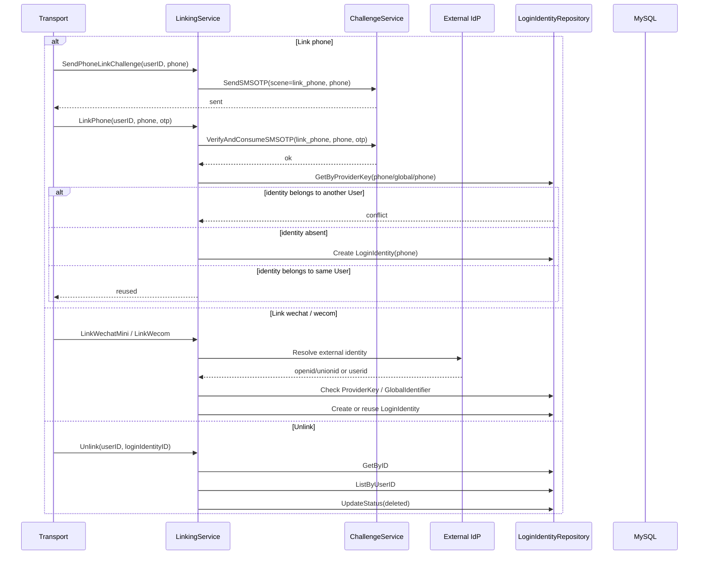

# 03-Linking 链路：登录身份绑定解绑与安全边界

## 1. 本文解决什么问题

本文说明 IAM AuthN 模块中的 **Linking（登录身份绑定/解绑）链路**。

Linking 的职责是：

```text
在 User 已经完成认证的前提下，为该 User 绑定、查看、解绑更多 LoginIdentity。
```

它解决的是“一个 IAM User 可以拥有多个登录身份”的问题：

```text
User U1
  ├── LoginIdentity username / tenant-A / zhangsan
  │     └── Credential password
  ├── LoginIdentity phone / global / +8613811112222
  ├── LoginIdentity wechat_minip / wx-appid / openid
  └── LoginIdentity wecom / corp-id / userid
```

Linking 与 Onboarding、Login 的边界不同：

| 链路 | 目标 | 典型场景 |
| --- | --- | --- |
| Onboarding | 首次建立 User 与初始 LoginIdentity | 微信小程序首次注册、mock consumer 初始化 |
| Login | 证明请求者控制某个 LoginIdentity 并签发 Token | password 登录、phone_otp 登录、wechat 登录 |
| Linking | 已认证 User 绑定、解绑、查看更多 LoginIdentity | 绑定手机号、绑定微信、绑定企微、解绑登录身份 |

本文重点说明：

1. Linking 在 AuthN 中的定位；
2. `linking.Service` 的应用层能力；
3. 手机号、微信、企微绑定链路；
4. 登录身份解绑链路；
5. 跨 User 绑定保护、最后一个 active identity 保护；
6. Linking 与 Challenge、IDP、Credential、Token 的边界；
7. 当前实现的安全边界与后续增强点。

---

## 2. 核心结论

### 2.1 Linking 必须基于已认证 User

Linking 不应该允许匿名请求直接绑定登录身份。

正确前提是：

```text
请求者已经通过 Login 链路完成认证；
系统已经知道当前 UserID；
绑定操作只能发生在这个 UserID 名下。
```

因此所有 Linking 命令都必须携带或从上下文中解析出：

```text
UserID
```

如果 `UserID` 为空，应直接拒绝。

---

### 2.2 Linking 绑定的是 LoginIdentity，不是业务 Account

Linking 的目标对象是：

```text
LoginIdentity
```

不是：

```text
运营账号
客户账号
医生账号
家长账号
```

业务身份属于业务系统或 AuthZ scope/role，不应在 Linking 中建模。

---

### 2.3 一个 LoginIdentity 只能属于一个 User

Linking 必须保证：

```text
Provider + Realm + Identifier 全局唯一；
同一个 LoginIdentity 不能被多个 User 绑定；
```

如果某个 ProviderKey 已经属于 User A，那么 User B 不能绑定它。

这条规则是防止账号接管的核心边界。

---

### 2.4 绑定外部身份前必须完成身份证明

不同 provider 的绑定证明方式不同：

| Provider | 绑定前证明方式 |
| --- | --- |
| phone | `link_phone` scene 的 SMS OTP Challenge |
| wechat_minip | 微信 code2session 或等价外部证明 |
| wecom | 企业微信 OAuth code 或等价外部证明 |
| username/password | 通常由 Onboarding 或 Credential 管理链路处理 |

这与成熟身份系统中的账号链接安全原则一致：手动链接账号前应要求对相关账号完成认证，避免恶意用户把别人的身份链接到自己的主体上。

---

### 2.5 解绑不能让 User 失去最后一个 active 登录身份

如果一个 User 只有一个 active LoginIdentity，则不能解绑它。

否则用户会进入：

```text
User 仍存在，但没有任何可用登录入口。
```

因此 Unlink 链路必须检查：

```text
active LoginIdentity count > 1
```

才能解绑当前 active identity。

---

## 3. Linking 应用服务总览

Linking 应用层入口位于：

```text
internal/apiserver/application/authn/linking
```

核心 Driving Port：

```go
// Service 管理已认证用户的登录身份绑定。
type Service interface {
    List(ctx context.Context, userID meta.ID) ([]LoginIdentityView, error)
    SendPhoneLinkChallenge(ctx context.Context, userID meta.ID, phone string) error
    LinkPhone(ctx context.Context, cmd LinkPhoneCommand) (*LinkResult, error)
    LinkWechatMini(ctx context.Context, cmd LinkWechatMiniCommand) (*LinkResult, error)
    LinkWecom(ctx context.Context, cmd LinkWecomCommand) (*LinkResult, error)
    Unlink(ctx context.Context, cmd UnlinkCommand) error
}
```

当前能力：

| 方法 | 职责 |
| --- | --- |
| `List` | 列出 User 已绑定的 LoginIdentity |
| `SendPhoneLinkChallenge` | 发送手机号绑定验证码 |
| `LinkPhone` | 校验手机号绑定验证码并绑定 phone LoginIdentity |
| `LinkWechatMini` | 通过微信身份证明绑定 wechat_minip LoginIdentity |
| `LinkWecom` | 通过企业微信身份证明绑定 wecom LoginIdentity |
| `Unlink` | 解绑某个 LoginIdentity |

---

## 4. 总体链路图



---

## 5. Dependencies：Linking 依赖说明

`linking.Service` 依赖：

```go
type Dependencies struct {
    LoginIdentities loginidentity.Repository
    Challenge       challengeapp.Service
    IDP             authentication.IdentityProvider
    WechatApps      idpPort.Repository
    SecretVault     idpPort.SecretVault
    WecomAgentID    string
    Now             func() time.Time
}
```

各依赖职责：

| 依赖 | 职责 |
| --- | --- |
| `LoginIdentities` | 查询、创建、更新 LoginIdentity |
| `Challenge` | 发送和校验手机号绑定验证码 |
| `IDP` | 与微信、企业微信等外部身份源交互 |
| `WechatApps` | 查询微信/企微应用配置 |
| `SecretVault` | 解密 AppSecret 等敏感配置 |
| `WecomAgentID` | 企业微信链路所需 agent 配置 |
| `Now` | 注入当前时间，便于测试 |

---

## 6. ensureProviderKey：绑定身份的核心保护

`ensureProviderKey` 是 Linking 的核心复用/创建逻辑。

它处理：

```text
1. ProviderKey 是否有效。
2. ProviderKey 是否已经存在。
3. 已存在 identity 是否属于当前 User。
4. 已存在 identity 是否 active。
5. 不存在时创建新的 LoginIdentity。
```

伪代码：

```text
if !key.IsValid():
    return invalid argument

existing = repo.GetByProviderKey(provider, realm, identifier)

if existing != nil:
    if existing.UserID != currentUserID:
        return ErrLoginIdentityExists
    if !existing.IsActive():
        return ErrLoginIdentityDisabled
    return reused existing identity

identity = build()
repo.Create(identity)
return created identity
```

它保证了最重要的不变量：

```text
同一个 LoginIdentity 只能属于一个 User。
```

---

## 7. GlobalIdentifier 保护

部分外部身份源存在跨 realm 的稳定标识。

典型例子：

```text
wechat_minip:
  Realm = appid
  Identifier = openid
  GlobalIdentifier = unionid
```

`Provider + Realm + Identifier` 是主唯一键。

`GlobalIdentifier` 用于识别不同 App 下是否是同一外部用户。

Linking 应检查：

```text
如果 GlobalIdentifier 已经属于其他 User，则禁止绑定。
```

这样可以避免：

```text
同一个微信 unionid 被绑定到多个 IAM User。
```

注意：

```text
GlobalIdentifier 不是所有 provider 都有。
```

例如 phone、wecom 通常可以没有 GlobalIdentifier。

---

## 8. List：列出用户登录身份

`List(ctx, userID)` 用于列出当前 User 绑定的登录身份。

它应返回视图对象，而不是直接暴露领域实体。

建议视图包含：

```text
LoginIdentityID
Provider
Realm
Identifier(masked if necessary)
GlobalIdentifier(masked if necessary)
Status
VerifiedAt
LinkedAt
```

注意：

```text
手机号、openid、userid 等 identifier 可能属于敏感信息；
Transport 层输出时应考虑脱敏。
```

---

## 9. SendPhoneLinkChallenge：发送手机号绑定验证码

手机号绑定不能直接创建 LoginIdentity。

必须先证明请求者控制该手机号。

流程：

```text
1. 检查 userID 是否有效。
2. 检查 Challenge service 是否配置。
3. 调用 Challenge.SendSMSOTP(scene=link_phone, phone)。
4. Challenge 创建短信验证码并发送。
```

这里的 scene 必须是：

```text
link_phone
```

它和登录验证码 scene 不同：

```text
login
```

这样可以避免登录验证码被复用于绑定手机号。

---

## 10. LinkPhone：绑定手机号登录身份

`LinkPhone` 的目标是创建：

```text
LoginIdentity(provider=phone, realm=global, identifier=+E164)
```

流程：

```text
1. 检查 UserID。
2. 校验 phone 格式。
3. 调用 Challenge.VerifyAndConsumeSMSOTP(scene=link_phone, phone, otp)。
4. 如果验证码无效，拒绝绑定。
5. 构造 PhoneProviderKey。
6. 调用 ensureProviderKey。
7. 创建或复用 phone LoginIdentity。
```

模型结果：

```text
User U1
  └── LoginIdentity phone / global / +8613811112222
        no Credential
```

关键边界：

```text
手机号是 LoginIdentity。
短信验证码是 Challenge。
手机号绑定不创建 Credential。
```

---

## 11. LinkWechatMini：绑定微信小程序登录身份

`LinkWechatMini` 的目标是创建：

```text
LoginIdentity(provider=wechat_minip, realm=appid, identifier=openid, globalIdentifier=unionid)
```

流程：

```text
1. 检查 UserID。
2. 根据 appid 查询微信应用配置。
3. 使用 SecretVault 解密 AppSecret。
4. 使用 appid + js_code 调用微信 code2session。
5. 得到 openid / unionid。
6. 构造 WechatMinipProviderKey。
7. 检查 GlobalIdentifier 是否已被其他 User 占用。
8. 调用 ensureProviderKey。
9. 创建或复用 wechat_minip LoginIdentity。
```

模型结果：

```text
User U1
  └── LoginIdentity wechat_minip / wx_appid / openid
        GlobalIdentifier = unionid
        no Credential
```

关键边界：

```text
微信完成外部认证。
IAM 只保存 LoginIdentity 绑定关系。
微信绑定不创建 Credential。
微信 access token / refresh token 不应放入 Credential。
```

---

## 12. LinkWecom：绑定企业微信登录身份

`LinkWecom` 的目标是创建：

```text
LoginIdentity(provider=wecom, realm=corp_id, identifier=userid)
```

流程：

```text
1. 检查 UserID。
2. 根据 corp_id 查询企业微信应用配置。
3. 解密 app secret。
4. 使用企业微信 OAuth code 解析 userid。
5. 构造 WecomProviderKey。
6. 调用 ensureProviderKey。
7. 创建或复用 wecom LoginIdentity。
```

模型结果：

```text
User U1
  └── LoginIdentity wecom / corp_id / userid
        no Credential
```

关键边界：

```text
企业微信完成外部认证。
IAM 只保存 wecom LoginIdentity。
企业微信绑定不创建 Credential。
```

---

## 13. Unlink：解绑登录身份

`Unlink` 用于将某个 LoginIdentity 从当前 User 名下删除或禁用。

当前语义是：

```text
将 LoginIdentity 状态更新为 deleted。
```

流程：

```text
1. 检查 UserID。
2. 检查 LoginIdentityID。
3. 根据 ID 加载 LoginIdentity。
4. 如果 identity 不存在或不属于当前 User，返回 not found。
5. 如果 identity 是 active，则列出该 User 的全部 LoginIdentity。
6. 如果 active 数量 <= 1，拒绝解绑。
7. 将该 LoginIdentity 状态更新为 deleted。
```

核心安全规则：

```text
不能解绑最后一个 active LoginIdentity。
```

这可以避免用户失去全部登录入口。

---

## 14. 安全边界

## 14.1 当前已实现的安全边界

当前 Linking 至少应具备以下边界：

```text
1. user_id 必须有效。
2. ProviderKey 必须有效。
3. ProviderKey 已属于其他 User 时禁止绑定。
4. 非 active LoginIdentity 禁止复用。
5. 手机号绑定必须通过 link_phone Challenge。
6. 解绑时禁止删除最后一个 active LoginIdentity。
7. 微信 unionid 等 GlobalIdentifier 不应被多个 User 占用。
```

---

## 14.2 后续建议增强的安全边界

后续建议补充：

```text
1. 解绑当前会话使用的 LoginIdentity 时，需要 recent authentication。
2. 解绑 password / phone 等关键身份时，需要 recent authentication。
3. 绑定新的高风险 provider 时，可要求 recent authentication。
4. 对绑定/解绑操作记录审计事件。
5. 对绑定/解绑操作做频率限制。
6. 对同一目标手机号、openid、userid 的绑定尝试做风控。
```

这里的 recent authentication 指：

```text
用户在较短时间内重新完成一次认证，确认当前会话仍由本人控制。
```

---

## 15. Linking 与 Onboarding 的区别

| 维度 | Onboarding | Linking |
| --- | --- | --- |
| 前提 | 用户可能尚未存在 | 用户必须已认证 |
| 目标 | 建立初始 User + LoginIdentity | 给已有 User 增加或删除 LoginIdentity |
| 是否创建 User | 可能创建 | 不应创建 |
| 是否创建 Credential | 按需 | 通常不创建，除非未来支持绑定 password/passkey |
| 是否签发 Token | 否 | 否 |
| 安全重点 | 幂等、冲突、外部身份解析 | 当前 User 归属、二次证明、防账号接管 |

---

## 16. Linking 与 Login 的区别

| 维度 | Login | Linking |
| --- | --- | --- |
| 目标 | 证明 LoginIdentity 控制权并签发 Token | 为已认证 User 管理 LoginIdentity |
| 是否需要当前 User | 不一定，登录前未知 | 必须已知 |
| 是否创建 LoginIdentity | 否 | 可能创建 |
| 是否消费 Challenge | phone_otp 登录会消费 login scene | phone 绑定会消费 link_phone scene |
| 结果 | Principal + Token | LinkResult / list / unlink result |

---

## 17. Linking 与 Challenge 的关系

手机号绑定必须使用 Challenge。

```text
SendPhoneLinkChallenge
  -> Challenge.SendSMSOTP(scene=link_phone)

LinkPhone
  -> Challenge.VerifyAndConsumeSMSOTP(scene=link_phone)
  -> Create LoginIdentity(phone)
```

注意：

```text
link_phone scene 的验证码不能用于 login scene。
login scene 的验证码不能用于 link_phone scene。
```

scene 是 Challenge 防误用的重要边界。

---

## 18. Linking 与 Credential 的关系

当前 linking 主要绑定：

```text
phone
wechat_minip
wecom
```

这些 provider 通常不创建长期 Credential。

如果未来支持“已登录用户绑定 password 登录”或“注册 passkey”，应走 Credential 管理链路：

```text
link username identity
create password Credential
or
register passkey Credential
```

这类能力不应该混入 phone/wechat/wecom 的绑定流程中。

---

## 19. Linking 与 ExternalAuthorization 的关系

微信、企微绑定只保存 LoginIdentity。

如果未来 IAM 需要保存第三方 access token / refresh token，应单独建模：

```text
ExternalAuthorization / OAuthGrant / ProviderGrant
```

不要将第三方授权 token 放入 Credential。

原因：

```text
Credential 是 IAM 用来认证用户的长期认证材料。
ExternalAuthorization 是 IAM 代表用户访问外部系统的授权材料。
```

二者不是同一类对象。

---

## 20. 代码事实源索引

| 主题 | 代码位置 |
| --- | --- |
| Linking 应用服务接口 | `internal/apiserver/application/authn/linking/service.go` |
| 手机号绑定 | `internal/apiserver/application/authn/linking/link_phone.go` |
| 微信绑定 | `internal/apiserver/application/authn/linking/link_wechat.go` |
| 企业微信绑定 | `internal/apiserver/application/authn/linking/link_wecom.go` |
| 登录身份列表 | `internal/apiserver/application/authn/linking/list_identities.go` |
| 登录身份解绑 | `internal/apiserver/application/authn/linking/unlink_identity.go` |
| Linking 测试 | `internal/apiserver/application/authn/linking/service_test.go` |
| LoginIdentity 模型 | `internal/apiserver/domain/authn/loginidentity` |
| ProviderKey | `internal/apiserver/domain/authn/loginidentity/key.go` |
| Challenge 应用服务 | `internal/apiserver/application/authn/challenge` |
| Challenge Redis 仓储 | `internal/apiserver/infra/cache/redis/challenge_repository.go` |
| 微信应用配置 | `internal/apiserver/domain/idp/wechatapp` |
| 外部身份源接口 | `internal/apiserver/domain/authn/authentication` |

---

## 21. 面试与项目讲解口径

可以这样讲：

> IAM 的 Linking 链路负责已认证用户管理自己的登录身份。它和 Onboarding 不同，Onboarding 用于首次开通 User 和初始 LoginIdentity；Linking 用于已有 User 绑定手机号、微信、企业微信等更多 LoginIdentity。绑定前必须完成对应身份的证明，例如手机号绑定要通过 link_phone 场景的 SMS OTP Challenge，微信绑定要通过 code2session 得到 openid/unionid。绑定时系统会检查 ProviderKey 是否已属于其他 User，防止跨用户抢占身份；解绑时会禁止删除最后一个 active LoginIdentity，避免用户失去全部登录入口。

进一步可以补充：

> Linking 的核心不是创建业务账号，而是维护 User 与 LoginIdentity 的关系。手机号、微信、企业微信都是 LoginIdentity；短信验证码是 Challenge；外部 OAuth proof 是 IdP 协作；这些场景通常都不创建 Credential。Credential 只在 password、passkey、TOTP 等需要 IAM 保存长期认证材料的场景中存在。

---

## 22. 后续文档入口

本文说明 Linking。

后续应继续阅读：

```text
04-Challenge链路-短信验证码与短期认证挑战.md
05-Session与Token边界-Principal-Session-JWT-RefreshToken.md
06-JWT-JWS-JWKS与KeyRotation.md
07-第三方登录与IDP协作-WeChat-WeCom.md
```

其中：

```text
Challenge 文档说明短信验证码如何创建、发送、校验与消费。
第三方登录文档说明微信、企微等外部身份源如何与 IAM 协作。
Session/Token 文档说明认证成功后的访问上下文如何表达。
```
