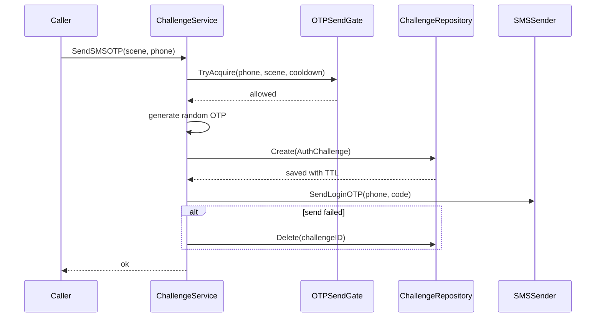
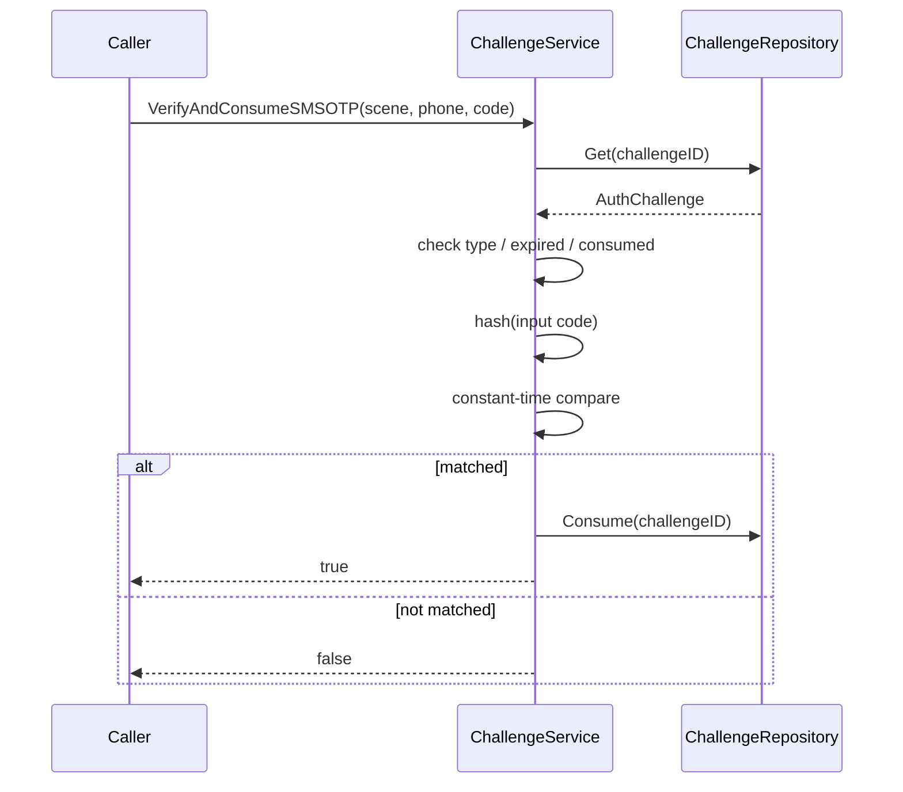

# 04-Challenge 链路：短信验证码与短期认证挑战

## 1. 本文解决什么问题

本文说明 IAM AuthN 模块中的 **Challenge（短期认证挑战）链路**。

Challenge 的职责是：

```text
创建、发送、校验并消费一次短期认证挑战。
```

在当前 IAM 项目中，Challenge 主要服务于 SMS OTP 场景：

```text
手机号验证码登录
手机号登录身份绑定
```

它的核心定位是：

```text
Challenge 是短期认证过程，不是长期 Credential。
```

因此：

```text
手机号本身是 LoginIdentity；
短信验证码是 Challenge；
密码哈希才是 Credential。
```

本文重点说明：

1. Challenge 在 AuthN 模型中的定位；
2. Challenge 与 Credential、LoginIdentity 的边界；
3. SMS OTP 的创建、发送、校验、消费流程；
4. scene、target、secret hash、TTL、consume 的语义；
5. Challenge 在 Login 和 Linking 中的使用；
6. Application、Domain、Infra 三层职责；
7. 防重放、过期、发送冷却、错误处理与安全边界。

---

## 2. 核心结论

### 2.1 Challenge 是短期证明，不是长期凭据

Challenge 表达的是一次短期认证过程：

```text
在某个 scene 下，系统生成一个短期 secret，发送给目标对象，随后验证请求者是否能提交正确 secret。
```

典型场景：

```text
短信登录验证码
手机号绑定验证码
邮箱验证码
OAuth state
找回密码临时 code
```

它和 Credential 的区别是：

| 对象 | 生命周期 | 是否长期保存 | 用途 |
| --- | --- | ---: | --- |
| Credential | 长期 | 是 | 保存 IAM 需要反复校验的认证材料，例如 password hash |
| Challenge | 短期 | 否，通常 Redis TTL | 保存一次性认证挑战，例如短信验证码 |

---

### 2.2 Phone 是 LoginIdentity，OTP 是 Challenge

手机号登录身份应建模为：

```text
LoginIdentity(provider=phone, realm=global, identifier=+E164)
```

短信验证码应建模为：

```text
Challenge(type=sms_otp, scene=login/link_phone, target=+E164)
```

不要创建：

```text
Credential(type=phone_otp)
```

原因：

```text
1. SMS OTP 是一次性短期 secret；
2. 它不应该长期保存在 Credential 表；
3. 它有 TTL、消费、防重放、发送冷却等过程语义；
4. 它不属于 LoginIdentity 的长期认证材料。
```

---

### 2.3 scene 是 Challenge 防误用的关键边界

同一个手机号可以在不同场景下收到验证码：

```text
login
link_phone
reset_password
```

这些验证码不能互相替代。

因此 Challenge 必须包含 `Scene`：

```text
ChallengeID = type + scene + target
```

例如：

```text
sms_otp:login:+8613811112222
sms_otp:link_phone:+8613811112222
```

这样可以避免：

```text
用户用登录验证码完成手机号绑定；
用户用绑定验证码完成登录；
找回密码验证码被用于普通登录。
```

---

### 2.4 Challenge 必须一次性消费

OTP 的安全性依赖：

```text
短时间有效
只能使用一次
校验成功后立即消费
重复使用必须失败
```

这就是 Challenge 和普通缓存值的区别。

Challenge 不是简单的：

```text
phone -> code
```

而是：

```text
scene + target -> hashed secret + expires_at + consumed_at
```

---

## 3. Challenge 模型

领域模型位于：

```text
internal/apiserver/domain/authn/challenge
```

核心实体：

```go
type AuthChallenge struct {
    ID         string
    Type       ChallengeType
    Scene      string
    Target     string
    SecretHash []byte
    ExpiresAt  time.Time
    Attempts   int
    ConsumedAt *time.Time
    CreatedAt  time.Time
}
```

字段语义：

| 字段 | 语义 |
| --- | --- |
| `ID` | Challenge 唯一 ID |
| `Type` | Challenge 类型，例如 `sms_otp` |
| `Scene` | 使用场景，例如 `login`、`link_phone` |
| `Target` | 目标对象，例如手机号 E.164 |
| `SecretHash` | secret hash，不保存明文验证码 |
| `ExpiresAt` | 过期时间 |
| `Attempts` | 尝试次数 |
| `ConsumedAt` | 消费时间 |
| `CreatedAt` | 创建时间 |

领域行为：

```text
IsExpired(now)
IsConsumed()
ConsumeAt(now)
```

---

## 4. ChallengeType 与 Scene

当前主要类型：

```text
sms_otp
```

当前主要 scene：

```text
login
link_phone
```

含义：

| Scene | 用途 |
| --- | --- |
| `login` | 手机号验证码登录 |
| `link_phone` | 已认证 User 绑定手机号登录身份 |

后续可扩展：

```text
reset_password
change_phone
verify_email
oauth_state
```

注意：scene 不是展示文案，而是安全隔离边界。

---

## 5. 应用层 Service 总览

Challenge 应用服务位于：

```text
internal/apiserver/application/authn/challenge
```

核心接口：

```go
type Service interface {
    SendSMSOTP(ctx context.Context, scene, phone string) error
    CreateSMSOTP(ctx context.Context, scene, phone string, opts ...SMSOTPOption) (*SMSOTP, error)
    VerifyAndConsumeSMSOTP(ctx context.Context, scene, phone, code string) (bool, error)
    VerifyAndConsume(ctx context.Context, phoneE164, scene, code string) bool
    DeleteSMSOTP(ctx context.Context, scene, phone string) error
}
```

能力说明：

| 方法 | 职责 |
| --- | --- |
| `SendSMSOTP` | 创建 OTP 并发送短信 |
| `CreateSMSOTP` | 创建 Challenge，不一定发送 |
| `VerifyAndConsumeSMSOTP` | 校验并消费 SMS OTP |
| `VerifyAndConsume` | 适配旧 OTPVerifier 风格的布尔接口 |
| `DeleteSMSOTP` | 删除指定 scene + phone 的 Challenge |

---

## 6. SMSOTPDelivery 依赖

短信验证码发送依赖：

```go
type SMSOTPDelivery struct {
    Gate     authentication.OTPSendGate
    SMS      authentication.SMSSender
    TTL      time.Duration
    Cooldown time.Duration
    CodeLen  int
}
```

各字段职责：

| 字段 | 职责 |
| --- | --- |
| `Gate` | 控制发送频率，防止频繁发送 |
| `SMS` | 实际发送短信 |
| `TTL` | 验证码有效期 |
| `Cooldown` | 同一目标重复发送冷却时间 |
| `CodeLen` | 验证码长度 |

当前默认值：

```text
TTL = 5 minutes
CodeLen = 6
Cooldown = 60 seconds
```

---

## 7. SendSMSOTP 链路

`SendSMSOTP` 用于创建并发送验证码。

流程：

```text
1. 检查 delivery 是否配置。
2. 校验手机号格式。
3. 校验 scene 非空。
4. 通过 Gate.TryAcquire 检查发送冷却。
5. 调用 CreateSMSOTP 创建 Challenge。
6. 调用 SMS.SendLoginOTP 发送验证码。
7. 如果发送失败，则删除刚创建的 Challenge。
```

链路图：



关键点：

```text
发送失败时要删除 Challenge，避免用户收不到验证码但系统保留了一个有效 challenge。
```

---

## 8. CreateSMSOTP 链路

`CreateSMSOTP` 只负责创建验证码 Challenge。

流程：

```text
1. 检查 ChallengeRepository 是否配置。
2. 校验手机号格式。
3. 规范化 TTL、CodeLen、Now。
4. 校验 scene 非空。
5. 使用安全随机数生成数字 OTP。
6. 计算 SecretHash。
7. 构造 AuthChallenge。
8. 保存到 Repository。
9. 返回 SMSOTP，其中包含明文 Code 供发送。
```

注意：

```text
明文验证码只在创建后的发送链路中短暂存在。
Repository 中只保存 SecretHash。
```

Challenge ID 生成规则：

```text
sms_otp:{scene}:{phoneE164}
```

例如：

```text
sms_otp:login:+8613811112222
sms_otp:link_phone:+8613811112222
```

---

## 9. VerifyAndConsumeSMSOTP 链路

`VerifyAndConsumeSMSOTP` 用于校验并消费验证码。

流程：

```text
1. 检查 Repository 是否配置。
2. 校验手机号格式。
3. trim scene 和 otp。
4. 根据 scene + phone 构造 challengeID。
5. 从 Repository 获取 Challenge。
6. 检查 Challenge 是否存在。
7. 检查 Type 是否为 sms_otp。
8. 检查是否已消费。
9. 检查是否过期。
10. 计算请求 OTP 的 SecretHash。
11. 使用 constant-time compare 比较 hash。
12. 校验成功后调用 Repository.Consume。
13. 返回 true。
```

链路图：



核心安全点：

```text
校验成功后必须消费。
重复使用同一个 OTP 必须失败。
```

---

## 10. DeleteSMSOTP 链路

`DeleteSMSOTP` 用于删除某个 scene + phone 的 Challenge。

常见使用场景：

```text
短信发送失败后清理 challenge
管理员或系统主动清理某个 challenge
测试中清理状态
```

删除对象：

```text
sms_otp:{scene}:{phoneE164}
```

---

## 11. Redis Repository

Challenge 通常不适合长期落 MySQL。

它更适合存储在 Redis：

```text
短 TTL
高读写
一次性消费
自动过期
```

当前 Redis 仓储位于：

```text
internal/apiserver/infra/cache/redis/challenge_repository.go
```

Repository 接口：

```go
type Repository interface {
    Create(ctx context.Context, challenge *AuthChallenge) error
    Get(ctx context.Context, id string) (*AuthChallenge, error)
    Consume(ctx context.Context, id string) error
    Delete(ctx context.Context, id string) error
}
```

实现时应保证：

```text
1. Create 设置 TTL。
2. Get 能识别不存在和过期。
3. Consume 是原子或尽量原子操作。
4. Delete 用于主动清理。
```

如果 Redis 中 challenge 已过期，业务层应视为无效验证码。

---

## 12. Challenge 与 Login 的协作

手机号登录链路：

```text
1. 用户请求发送登录验证码。
2. ChallengeService.SendSMSOTP(scene=login, phone)。
3. 用户提交 phone + otp 登录。
4. PhoneOTPAuthStrategy 调用 ChallengeService.VerifyAndConsume(scene=login)。
5. 校验通过后，查找 LoginIdentity(provider=phone, realm=global, identifier=phone)。
6. 构造 Principal。
7. 签发 Token。
```

关键边界：

```text
Challenge 只证明用户控制手机号。
LoginIdentity 才表达手机号属于哪个 User。
```

如果验证码正确但手机号没有绑定 LoginIdentity，应返回未绑定或认证失败，而不是自动创建 User。

---

## 13. Challenge 与 Linking 的协作

手机号绑定链路：

```text
1. 已认证 User 请求绑定手机号。
2. Linking.SendPhoneLinkChallenge(userID, phone)。
3. ChallengeService.SendSMSOTP(scene=link_phone, phone)。
4. 用户提交 phone + otp。
5. Linking.LinkPhone 校验 Challenge(scene=link_phone)。
6. 校验通过后，创建 LoginIdentity(provider=phone)。
```

关键边界：

```text
link_phone 验证码不能用于 login。
login 验证码不能用于 link_phone。
```

scene 是绑定安全边界的一部分。

---

## 14. Challenge 与 Onboarding 的关系

Onboarding 不直接等同 Challenge。

如果某个首次开通场景需要短期证明，可以在进入 Onboarding 前完成 Challenge 校验，或者在 Onboarding 的 prepare 阶段完成证明。

但当前更推荐：

```text
手机号首次登录/绑定由 Login + Linking 处理；
Onboarding 主要处理初始 User + LoginIdentity + optional Credential 创建。
```

不要让 Onboarding 同时承担所有验证码逻辑。

---

## 15. Challenge 与 Credential 的关系

Challenge 与 Credential 的边界必须保持清晰：

| 场景 | 应建模为 |
| --- | --- |
| password hash | Credential |
| passkey public key | Credential |
| TOTP secret | Credential |
| SMS OTP code | Challenge |
| phone link code | Challenge |
| OAuth state | Challenge |
| third-party refresh token | ExternalAuthorization，非 Credential |

原因：

```text
Credential 是长期认证材料；
Challenge 是短期认证过程。
```

---

## 16. 安全规则

## 16.1 不保存明文验证码

Repository 中只保存：

```text
SecretHash
```

不保存：

```text
Plaintext OTP
```

明文 OTP 只在创建后用于短信发送。

---

## 16.2 使用安全随机数生成验证码

验证码应使用安全随机源生成。

当前服务使用随机数字 OTP。

注意：

```text
验证码长度不能过短。
如果验证码低于足够熵，应配合 rate limiting。
```

---

## 16.3 Constant-time compare

校验 OTP hash 时，应使用 constant-time compare。

这可以降低基于比较耗时的侧信道风险。

---

## 16.4 TTL 过期

验证码必须有有效期。

当前默认 TTL：

```text
5 minutes
```

过期后：

```text
Challenge 无效。
```

---

## 16.5 一次性消费

校验成功后必须消费：

```text
ConsumedAt = now
```

重复使用已消费 Challenge 必须失败。

---

## 16.6 发送冷却

同一手机号、同一 scene 不应频繁发送验证码。

当前 `SMSOTPDelivery.Gate` 用于发送冷却控制。

默认 cooldown：

```text
60 seconds
```

---

## 16.7 尝试次数限制

当前模型中有 `Attempts` 字段。

后续应补齐：

```text
错误验证码尝试次数递增
达到阈值后拒绝继续尝试
生成新验证码不应无限重置失败风险
```

这可用于防止暴力猜测 OTP。

---

## 17. 错误与失败语义

常见失败：

| 场景 | 处理 |
| --- | --- |
| phone 格式非法 | 返回 invalid argument |
| scene 为空 | 返回 invalid argument 或 false |
| Challenge 不存在 | 返回 false |
| Challenge 已过期 | 返回 false |
| Challenge 已消费 | 返回 false |
| OTP 不匹配 | 返回 false |
| Consume 失败 | 返回错误 |
| SMS 发送失败 | 删除 Challenge 并返回错误 |
| SendGate 限流 | 返回发送过于频繁 |

注意：

```text
VerifyAndConsumeSMSOTP 返回 false 表示认证挑战不成立；
返回 error 表示系统或依赖异常。
```

二者需要区分。

---

## 18. 分层职责

## 18.1 Application 层职责

| 组件 | 职责 |
| --- | --- |
| `challenge.Service` | 创建、发送、校验、消费 SMS OTP |
| `SMSOTPDelivery` | 聚合 Gate、SMS、TTL、Cooldown、CodeLen |
| `SendSMSOTP` | 创建并发送验证码 |
| `CreateSMSOTP` | 创建 Challenge |
| `VerifyAndConsumeSMSOTP` | 校验并消费 Challenge |

Application 层负责编排 Challenge 用例。

---

## 18.2 Domain 层职责

| 模型 | 职责 |
| --- | --- |
| `AuthChallenge` | Challenge 状态与行为 |
| `ChallengeType` | Challenge 类型 |
| `Repository` | Challenge 存储端口 |

Domain 层表达：

```text
是否过期
是否已消费
如何消费
```

---

## 18.3 Infra 层职责

| 能力 | 实现 |
| --- | --- |
| Challenge 存储 | Redis ChallengeRepository |
| 发送冷却 | Redis Gate 或其他 OTPSendGate 实现 |
| 短信发送 | SMSSender 实现 |
| TTL | Redis key expiration |

Infra 层负责：

```text
Redis 存储
TTL 管理
原子消费
短信发送
发送限流
```

---

## 19. 当前代码事实源索引

| 主题 | 代码位置 |
| --- | --- |
| Challenge 领域模型 | `internal/apiserver/domain/authn/challenge/challenge.go` |
| Challenge 类型 | `internal/apiserver/domain/authn/challenge/type.go` |
| Challenge Repository Port | `internal/apiserver/domain/authn/challenge/repository.go` |
| Challenge 应用服务 | `internal/apiserver/application/authn/challenge/service.go` |
| Challenge 应用测试 | `internal/apiserver/application/authn/challenge/service_test.go` |
| Redis ChallengeRepository | `internal/apiserver/infra/cache/redis/challenge_repository.go` |
| Redis ChallengeRepository 测试 | `internal/apiserver/infra/cache/redis/challenge_repository_test.go` |
| Phone OTP 登录策略 | `internal/apiserver/domain/authn/authentication/auth-phone-otp.go` |
| Phone Linking | `internal/apiserver/application/authn/linking/link_phone.go` |
| SMS sender infra | `internal/apiserver/infra/sms` |

---

## 20. 面试与项目讲解口径

可以这样讲：

> IAM 中没有把短信验证码建模为 Credential。手机号本身是 LoginIdentity，表示某个手机号可以作为登录身份；短信验证码是 Challenge，表示一次短期、可过期、可消费的认证挑战。Challenge 服务负责生成验证码、hash 存储、发送短信、校验并消费验证码。通过 scene 区分 login 和 link_phone，避免登录验证码被用于绑定手机号，或者绑定验证码被用于登录。

进一步可以补充：

> Challenge 使用 Redis 作为短期存储，适合 TTL、一次性消费和高频访问。应用层只保存验证码 hash，不保存明文验证码；校验时使用 constant-time compare；校验成功后立即 consume，从而提供基本的防重放能力。Credential 则只用于 password hash、passkey public key、TOTP secret 等长期认证材料。

---

## 21. 后续增强点

后续建议继续补强：

```text
1. Attempts 递增与最大尝试次数限制。
2. 针对 scene + target 的失败锁定策略。
3. 针对 IP、设备、手机号的发送与验证风控。
4. OAuth state / reset_password / verify_email 等更多 Challenge 类型。
5. 消费操作的 Redis 原子性强化。
6. Challenge 审计事件记录。
```

---

## 22. 后续文档入口

本文说明 Challenge。

后续应继续阅读：

```text
05-Session与Token边界-Principal-Session-JWT-RefreshToken.md
06-JWT-JWS-JWKS与KeyRotation.md
07-第三方登录与IDP协作-WeChat-WeCom.md
```

其中：

```text
Session 与 Token 文档说明 Challenge 校验成功后的 Principal 如何变成访问上下文。
JWT/JWS/JWKS 文档说明 Token 的签名与密钥轮换机制。
第三方登录文档说明 OAuth code / 外部 IdP proof 与 Challenge 的区别。
```
