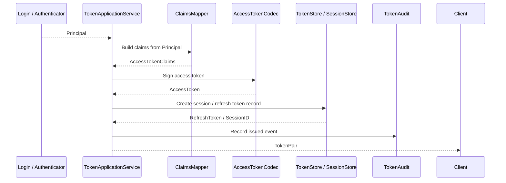

# 04-Token 链路：从 Principal 到 AccessToken 与 RefreshToken

## 1. 本文解决什么问题

本文说明 IAM AuthN 模块中的 **Token 链路**。

第 03 篇 Login 文档的终点是：

```text
LoginRequest -> Proof -> Authenticator -> AuthDecision -> Principal
```

本文从 `Principal` 开始，说明认证成功后的主体表达如何被转换为客户端可携带的访问凭证：

```text
Principal -> TokenApplicationService -> AccessToken / RefreshToken
```

Token 链路解决的是：

```text
认证成功后，客户端后续如何证明自己已经登录？
Access Token 与 Refresh Token 如何拆分风险？
Refresh Token 如何续期？
登出和撤销如何影响后续访问？
服务端如何记录 Token 签发、刷新、撤销的审计信息？
Token 与 Session、JWT、JWKS 的边界是什么？
```

本文只讲 Token 应用链路，不展开 JWT/JWS/JWK/JWKS 的标准细节。JWT/JWS/JWK/JWKS 与 KeyRotation 由第 06 篇展开。

---

## 2. 核心结论

### 2.1 Token 链路从 Principal 开始

Login 链路负责认证。

Token 链路负责访问凭证表达。

边界如下：

```text
Login:
  LoginRequest -> AuthDecision -> Principal

Token:
  Principal -> AccessToken / RefreshToken
```

因此：

```text
Principal 是认证结果。
Access Token / Refresh Token 是认证结果的访问凭证表达。
```

不要把 Token 链路反向塞回 Login 领域模型中。

---

### 2.2 Access Token 是短期访问凭证

Access Token 用于访问受保护资源。

在 IAM 中，Access Token 当前通常以 JWT/JWS 形式表达。

它承载的是认证后的访问上下文，例如：

```text
subject / user_id
tenant_id
login_identity_id
auth_method
realm
amr
session id
issued at
expires at
issuer
audience
jti
```

Access Token 的特点是：

```text
短期有效；
适合被客户端随请求携带；
适合资源服务通过 JWKS 本地验签；
必要时可通过 Online Verify 校验当前服务端状态。
```

---

### 2.3 Refresh Token 是续期凭证

Refresh Token 用于换取新的 Access Token。

OAuth 2.0 对 Refresh Token 的经典定义是：Refresh Token 由授权服务器签发给客户端，用于在当前 Access Token 失效或过期时获取新的 Access Token；Refresh Token intended for use only with authorization servers，不应发送给资源服务器。

在 IAM 中也应保持这个边界：

```text
Access Token -> 给资源服务或 IAM API 做访问认证。
Refresh Token -> 只给 IAM AuthN Token endpoint 做续期。
```

Refresh Token 不应该被资源服务接受为访问凭证。

---

### 2.4 Token 不是 Credential

Credential 表示 IAM 长期保存并校验的认证材料，例如 password hash。

Token 表示认证成功后的访问凭证。

二者生命周期和用途不同：

| 对象 | 用途 | 生命周期 | 是否用于证明长期身份控制权 |
| --- | --- | --- | ---: |
| Credential | 校验登录身份控制权 | 长期 | 是 |
| Access Token | 访问受保护资源 | 短期 | 否 |
| Refresh Token | 换取新的 Access Token | 中长期，可撤销 | 否 |
| Challenge | 一次性短期证明 | 很短 | 否 |

因此：

```text
password hash 是 Credential。
SMS OTP 是 Challenge。
JWT Access Token 是访问凭证。
Refresh Token 是续期凭证。
```

不要把 Access Token / Refresh Token 存入 `auth_credentials`。

---

### 2.5 Token 链路必须有服务端控制点

Access Token 可以是短期 JWT，但 Refresh Token 必须强服务端可控。

服务端控制点包括：

```text
TokenStore / RefreshTokenStore
SessionManager
TokenAudit
Revoke / Logout
Refresh token rotation
风险事件失效
```

原因是：

```text
Access Token 通常短期有效，泄露窗口较短；
Refresh Token 生命周期更长，泄露风险更高；
因此 Refresh Token 需要支持撤销、轮换、复用检测、审计和设备维度控制。
```

OAuth 2.0 Security BCP（RFC 9700）已经更新并扩展 OAuth 2.0 的安全建议，包含 token replay prevention、access token privilege restriction、refresh token 等安全实践。本文的设计边界与这些方向一致。

---

## 3. Token 链路总览



核心流程：

```text
Principal
  -> Build claims
  -> Sign Access Token
  -> Generate Refresh Token
  -> Store refresh/session state
  -> Record audit
  -> Return TokenPair
```

---

## 4. TokenApplicationService 职责

TokenApplicationService 是 Token 链路的应用服务。

它负责把认证成功后的 `Principal` 转换为访问凭证结果。

典型能力包括：

```text
IssueToken
Refresh
Revoke
Verify / Introspect(optional)
Logout(optional)
```

在 IAM 当前文档语义中，核心职责可以拆成：

| 能力 | 说明 |
| --- | --- |
| IssueToken | 基于 Principal 签发 Access Token 与 Refresh Token |
| Refresh | 基于 Refresh Token 换取新的 Access Token，必要时轮换 Refresh Token |
| Revoke | 撤销 Refresh Token、Session 或 Token family |
| Audit | 记录签发、刷新、撤销等事件 |
| Verify boundary | 与本地 JWT 验签、Online Verify 形成边界 |

TokenApplicationService 不负责：

```text
校验 password；
校验 OTP；
调用微信 code2session；
判断 LoginIdentity 是否 active；
做 AuthZ 权限判定；
直接解释业务角色。
```

这些分别属于 Login、Challenge、IDP、AuthZ 或业务系统。

---

## 5. IssueToken：签发 TokenPair

### 5.1 输入

`IssueToken` 的核心输入是：

```text
Principal
client context(optional)
device context(optional)
request metadata(optional)
```

其中 `Principal` 来自 Login 链路。

它至少应包含：

```text
UserID
LoginIdentityID
TenantID
AuthMethod
Realm
AMR
Claims
```

---

### 5.2 输出

`IssueToken` 的输出是：

```text
TokenPair
```

典型字段：

```text
access_token
refresh_token
token_type
expires_in
refresh_expires_in(optional)
session_id(optional)
```

对外响应是否返回 `refresh_expires_in`、`session_id`，以 REST/gRPC/SDK 契约为准。

---

### 5.3 签发流程

```text
1. 从 Principal 构造 AccessTokenClaims。
2. 生成 session_id / sid。
3. 生成 jti。
4. 设置 iss / aud / sub / iat / nbf / exp。
5. 设置 auth_method / amr / login_identity_id / tenant_id / realm 等自定义 claims。
6. 使用当前 active signing key 签发 Access Token。
7. 生成 Refresh Token。
8. 在 TokenStore / SessionStore 中保存 refresh/session 状态。
9. 记录 TokenAudit issued event。
10. 返回 TokenPair。
```

---

## 6. AccessTokenClaims：Principal 到 Claims 的映射

Access Token claims 应从 Principal 和运行时上下文中构造。

推荐映射：

| Claim | 来源 | 说明 |
| --- | --- | --- |
| `sub` | `Principal.UserID` | Token subject |
| `sid` | SessionManager / TokenStore | session id |
| `jti` | token generator | token id |
| `iss` | issuer config | 签发者 |
| `aud` | audience config | 目标受众 |
| `iat` | clock | 签发时间 |
| `nbf` | clock | 生效时间 |
| `exp` | config | 过期时间 |
| `tenant_id` | `Principal.TenantID` | 当前租户上下文 |
| `login_identity_id` | `Principal.LoginIdentityID` | 本次认证入口 |
| `auth_method` | `Principal.AuthMethod` | 本次认证方式 |
| `realm` | `Principal.Realm` | 登录身份命名空间 |
| `amr` | `Principal.AMR` | 认证方式引用 |

不要把 password hash、OTP、AppSecret、Refresh Token 明文等敏感材料放进 Access Token claims。

---

## 7. Access Token 签发

Access Token 当前通常使用 JWT/JWS 表达。

简化流程：

```text
AccessTokenClaims
  -> JSON claims
  -> JWS signing
  -> compact token string
```

其中：

```text
JWT：claims 的紧凑表达。
JWS：对 claims payload 做签名或 MAC 保护。
JWK/JWKS：验签密钥表达与发布。
KeyRotation：签名密钥生命周期治理。
```

Access Token 签发只应使用当前 active signing key。

Access Token 验签侧应通过 `kid` 找到对应公钥。

JWT/JWS/JWK/JWKS 的具体标准边界见：

```text
06-JWT-JWS-JWK-JWKS边界与KeyRotation.md
```

---

## 8. Refresh Token 生成与存储

Refresh Token 应被设计为服务端可控。

推荐边界：

```text
客户端只持有 refresh token 原文；
服务端保存 refresh token hash 或不可逆摘要；
服务端记录 user_id、session_id、login_identity_id、client/device、expires_at、revoked_at、rotated_from 等状态；
每次 refresh 时校验状态并按策略轮换。
```

不要只依赖一个长期不变、不可撤销的 refresh token。

Refresh Token 记录可以支持：

```text
单设备登出；
全设备登出；
异常设备撤销；
refresh token rotation；
reuse detection；
审计追踪；
风险事件强制失效。
```

---

## 9. TokenStore / SessionStore

TokenStore 或 SessionStore 是服务端控制点。

它至少需要支持：

```text
Create refresh/session state
Load by refresh token hash
Mark rotated
Revoke one token
Revoke token family
Revoke all tokens of user
Check session status
```

TokenStore 与 Session 的关系取决于具体实现：

```text
如果 RefreshToken 记录就是 session 的主状态，则 TokenStore 同时承担 session store 职责；
如果 Session 是独立模型，则 RefreshToken 应引用 SessionID；
无论哪种方式，都必须能让服务端撤销 refresh 能力。
```

---

## 10. Refresh：续期链路

### 10.1 输入

Refresh 输入通常是：

```text
refresh_token
client context(optional)
device context(optional)
```

### 10.2 流程

```text
1. 校验 refresh_token 格式。
2. 计算 refresh_token hash。
3. 从 TokenStore 加载 refresh/session 记录。
4. 检查是否存在。
5. 检查是否已过期。
6. 检查是否 revoked。
7. 检查是否已经 rotated。
8. 检查 user / login identity / session 当前状态。
9. 构造新的 Principal 或 TokenSubject。
10. 签发新的 Access Token。
11. 按策略轮换 Refresh Token。
12. 按 Session 领域生命周期截断新的 RefreshToken / Session 过期时间。
13. 更新 TokenStore。
14. 记录 TokenAudit refresh event。
15. 返回新的 TokenPair 或 Access Token。
```

### 10.3 Refresh Token Rotation

Refresh Token rotation 的目标是降低 refresh token 泄露风险。

推荐语义：

```text
每次 refresh 成功后，旧 refresh token 标记为 rotated；
返回新的 refresh token；
如果已 rotated 的旧 token 再次出现，视为可能泄露；
可撤销整个 token family 或当前 session。
```

---

## 11. Revoke / Logout：撤销链路

Revoke 负责撤销 refresh/session 状态。

常见场景：

```text
用户主动登出；
用户在设备管理中踢掉某个设备；
用户修改密码后撤销旧 refresh token；
管理员禁用用户；
风控发现 refresh token reuse；
LoginIdentity 被禁用或解绑。
```

撤销粒度可以包括：

| 粒度 | 说明 |
| --- | --- |
| single refresh token | 只撤销一个 refresh token |
| session | 撤销某个 session 下全部 refresh 能力 |
| token family | 撤销同一轮换链路下全部 token |
| user all sessions | 撤销某个 User 的全部 session |
| login identity sessions | 撤销某个 LoginIdentity 相关 session |

注意：

```text
撤销 refresh/session 后，不一定能立刻让已经签发的短期 Access Token 失效。
```

如果业务要求立即失效，需要 Online Verify、token denylist、短 TTL 或版本号机制配合。

---

## 12. TokenAudit：审计事件

Token 链路应记录关键审计事件。

典型事件：

```text
issued
refreshed
rotated
revoked
logout
reuse_detected
verify_failed(optional)
```

审计字段可以包括：

```text
user_id
login_identity_id
session_id
jti
refresh_token_id/token_hash_id
auth_method
tenant_id
client_id/device_id
remote_ip
user_agent
occurred_at
reason
```

审计的目标不是替代 TokenStore，而是支持：

```text
安全追踪；
异常调查；
风控分析；
用户设备管理；
问题排查。
```

---

## 13. Verify：本地验签与在线验证边界

Token 验证通常分为两类：

```text
Local Verify：资源服务通过 JWKS 本地验签 Access Token。
Online Verify：资源服务或网关调用 IAM 检查当前服务端状态。
```

### 13.1 Local Verify

Local Verify 适合：

```text
高频请求；
资源服务本地判断 token signature / exp / aud / iss；
减少 IAM 中心服务压力。
```

它通常检查：

```text
signature
kid
iss
aud
exp
nbf
iat
```

### 13.2 Online Verify

Online Verify 适合：

```text
高风险操作；
需要确认 User / LoginIdentity / Session 当前状态；
需要立即感知 logout / revoke / disabled；
需要中心化风控判断。
```

它可以检查：

```text
User 是否 active；
LoginIdentity 是否 active；
Session 是否 revoked；
Token jti 是否被 denylist；
Token version 是否仍然有效；
风险策略是否允许。
```

---

## 14. Token 与 Session 的边界

Token 和 Session 容易混淆。

简化理解：

```text
Token 是客户端携带的凭证。
Session 是服务端维护的认证上下文。
```

二者关系可以是：

```text
SessionID -> 写入 Access Token sid claim
RefreshTokenRecord -> 引用 SessionID
SessionStore -> 控制 session 是否有效
```

Access Token 可以短期自包含。

Refresh Token 和 Session 必须服务端可控。

更细的边界由第 05 篇展开：

```text
05-Session与Token边界-Principal-Session-AccessToken-RefreshToken.md
```

---

## 15. Token 与 AuthZ 的边界

Token 只表达认证结果和访问上下文。

Token 不应该直接表达完整权限事实。

不建议把大量权限列表、角色列表、资源规则写入 Access Token。

原因：

```text
权限会变化；
Token 在有效期内不容易立即更新；
权限列表可能过大；
泄露后暴露权限结构；
AuthZ Check 才是授权权威判定。
```

Access Token 可以包含 AuthZ 所需的身份上下文：

```text
sub / user_id
tenant_id
session id
auth method
amr
```

但资源访问判断应进入 AuthZ：

```text
Subject + Tenant + Resource + Action + Scope -> AuthorizationDecision
```

---

## 16. Token 与 LoginIdentity 的边界

Token 可以记录本次认证使用的 `login_identity_id`。

这样可以支持：

```text
审计：这次登录来自哪个 LoginIdentity；
风控：某个 provider 出现异常时定位影响范围；
解绑：解绑当前 LoginIdentity 时判断是否需要 recent authentication；
会话管理：按 LoginIdentity 维度撤销 session。
```

但 Token 不应该把 LoginIdentity 当作授权主体。

授权主体仍应是：

```text
Subject = user:<UserID>
```

LoginIdentity 是认证入口，不是 AuthZ subject。

---

## 17. Token 错误与失败语义

Token 链路常见失败：

| 场景 | 语义 |
| --- | --- |
| principal invalid | Principal 缺少 UserID 或关键字段 |
| signing key unavailable | 当前没有可用 active signing key |
| sign failed | Access Token 签名失败 |
| refresh token generate failed | Refresh Token 生成失败 |
| token store unavailable | TokenStore / Redis 不可用 |
| refresh token not found | Refresh Token 不存在 |
| refresh token expired | Refresh Token 已过期 |
| refresh token revoked | Refresh Token 已撤销 |
| refresh token rotated | Refresh Token 已轮换，不应再次使用 |
| token reuse detected | 旧 Refresh Token 被复用，疑似泄露 |
| audit write failed | 审计写入失败，是否阻断取决于策略 |

建议边界：

```text
IssueToken 失败时，本次登录不应返回半成品 TokenPair。
Refresh 失败时，不应签发新的 Access Token。
Revoke 应尽可能幂等。
Audit 失败是否阻断主流程，应按安全级别和实现策略决定。
```

---

## 18. 分层职责

### 18.1 Application 层

| 组件 | 职责 |
| --- | --- |
| `TokenApplicationService` | Token 签发、刷新、撤销用例编排 |
| `ClaimsMapper` | Principal -> AccessTokenClaims |
| `TokenStore port` | 保存 refresh/session 状态 |
| `TokenAudit port` | 记录 token 事件 |
| `SessionManager port` | 管理 session 生命周期 |

Application 层不应直接操作具体 JWT 私钥或 Redis 命令。

---

### 18.2 Domain 层

Domain 层可以表达：

```text
Token subject
Session
Refresh token status
Token audit event
Token rotation policy
```

Domain 层不应依赖：

```text
具体 JWT 库
Redis client
HTTP request
OpenAPI DTO
```

---

### 18.3 Infra 层

Infra 层负责：

| 能力 | Infra 实现 |
| --- | --- |
| Access Token 签发 | JWT/JWS signer |
| Access Token 验签 | JWT/JWS verifier |
| Key 选择 | active signing key / kid |
| Refresh Token 存储 | Redis / MySQL store |
| Session 存储 | Redis / MySQL store |
| TokenAudit 存储 | MySQL audit table |
| JWKS 发布 | keyset / JWKS builder |

---

## 19. 代码事实源索引

| 主题 | 代码位置 |
| --- | --- |
| Token 应用服务 | `internal/apiserver/application/authn/token` |
| Session 应用服务 | `internal/apiserver/application/authn/session` |
| Principal | `internal/apiserver/domain/authn/authentication/principal.go` |
| Session 领域模型 | `internal/apiserver/domain/authn/session` |
| Token infra | `internal/apiserver/infra/token` |
| Keyset / JWKS infra | `internal/apiserver/infra/token/keyset` |
| Token audit schema | `internal/pkg/migration/migrations/000001_init_schema.up.sql` |
| Token application capability | `internal/apiserver/container/assembler/capabilities.go` |
| Login 到 Token 边界 | `internal/apiserver/application/authn/login/sign_in.go` |
| REST AuthN token endpoint | `internal/apiserver/transport/rest/authn` |
| SDK AuthN token client | `pkg/sdk/authn` |

具体字段、接口、表结构以当前源码、migration、REST/gRPC/SDK 契约为准。

---

## 20. 面试与项目讲解口径

可以这样讲：

> IAM 的 Token 链路从 Login 产出的 Principal 开始。Login 负责证明 LoginIdentity 并构造 Principal；TokenApplicationService 负责把 Principal 转换成 AccessToken 和 RefreshToken。AccessToken 是短期访问凭证，通常用 JWT/JWS 表达，资源服务可以通过 JWKS 本地验签；RefreshToken 是续期凭证，只应发送给 IAM AuthN 的 token endpoint，不能给资源服务直接使用。RefreshToken 需要服务端可控，所以要有 TokenStore、撤销、轮换、复用检测和审计。

进一步可以补充：

> 这个设计把认证结果和访问凭证分开了。Principal 是领域认证结果，AccessToken/RefreshToken 是应用层和基础设施层的访问表达。AccessToken 可以短期自包含，但 RefreshToken 必须服务端可撤销。Token 中可以包含 user_id、tenant_id、login_identity_id、auth_method、amr、sid 等认证上下文，但不应该塞入完整权限列表；资源访问仍然要走 AuthZ Check。

---

## 21. 后续文档入口

本文说明 Token 链路。

后续应继续阅读：

```text
05-Session与Token边界-Principal-Session-AccessToken-RefreshToken.md
06-JWT-JWS-JWK-JWKS边界与KeyRotation.md
07-第三方登录与IDP协作-WeChat-WeCom.md
08-AuthN分层架构与事实源索引.md
```

其中：

```text
Session 文档说明 Principal / Session / AccessToken / RefreshToken 的边界。
JWT/JWS/JWK/JWKS 文档说明 Token 的标准表达、签名、验签和密钥治理。
IDP 文档说明 WeChat / WeCom 如何参与 Onboarding、Linking、Login。
事实源索引说明 AuthN 各层代码入口、表结构和契约入口。
```

---

## 22. 外部标准参考

本文中的 Token 边界参考以下标准和安全实践：

```text
RFC 6749: The OAuth 2.0 Authorization Framework
RFC 7519: JSON Web Token (JWT)
RFC 9700: Best Current Practice for OAuth 2.0 Security
```

用于校准：

```text
Refresh Token 用于获取新的 Access Token，且只应发送给授权服务器。
JWT 是 claims 的紧凑表达，可作为 JWS payload 被签名或完整性保护。
OAuth 2.0 Security BCP 强调 token replay prevention、access token privilege restriction、refresh token 等安全实践。
```
