# 第三方登录与 IDP 协作

## 本文回答

本文回答：IAM 中的第三方登录为什么不直接由 IDP 模块完成；IDP 模块负责哪些外部身份源能力；AuthN 在微信/企业微信登录时如何借用 IDP 的应用配置、SecretVault 和微信 API 适配能力；微信/企微 code 如何变成 AuthN proof，最终又如何变成 IAM 的 Session 和 Token。

读完本文，你应该能回答：

- IDP 模块在 IAM 中的职责是什么；
- IDP 和 AuthN 的边界是什么；
- 为什么微信/企微登录最终仍然走 AuthN；
- WechatApp 是什么，和 User/Account/Token 有什么关系；
- AppSecret 如何被加密存储、轮换和解密使用；
- 微信 access_token 和 IAM access token 为什么不是同一个东西；
- 微信小程序登录如何从 `app_id + code` 变成 AuthN proof；
- 企业微信登录如何从 `corp_id + auth_code` 变成 AuthN proof；
- OAuth credential 绑定缺失时为什么不会自动登录成功；
- IDP Redis cache、AccessTokenCacher、WechatSDKCache 分别解决什么问题；
- IDP 初始化失败会如何影响 AuthN 的第三方登录能力。

---

## 30 秒结论

IAM 中的 IDP 模块不是“登录模块”。  
它是第三方身份源基础设施模块，负责：

```text
WechatApp 配置管理
AppSecret 加密存储
微信 access_token 缓存
微信 / 企业微信 API 适配
向 AuthN 暴露 Repository / SecretVault / AuthProvider
```

真正的登录态仍然由 AuthN 统一完成：

```text
REST LoginV2
  -> auth_method = wechat / wecom
  -> AuthN LoginApplicationService
  -> AuthN SignInAdapter
  -> IDP Repository 查询 WechatApp
  -> IDP SecretVault 解密 AppSecret / CorpSecret
  -> AuthN domain strategy 调用 IdentityProvider code exchange
  -> 根据 OAuth credential 查绑定账号
  -> AuthN 生成 Principal
  -> Session + IAM Access Token + Refresh Token
```

两条核心边界：

1. **IDP 管第三方应用配置和外部 API，不签 IAM token。**
2. **AuthN 管登录判定、账号绑定、Session、IAM Access Token、Refresh Token。**

当前公开登录方式中，微信小程序和企业微信分别对应：

| auth_method | REST payload | AuthN adapter | Domain credential | 外部交换 |
| --- | --- | --- | --- | --- |
| `wechat` | `app_id + code` | `wechatMiniAdapter` | `CredOAuthWxMinip` | code2Session |
| `wecom` | `corp_id + auth_code` | `wecomAdapter` | `CredOAuthWecom` | get user info |

核心源码入口：

- [../../internal/apiserver/container/assembler/idp.go](../../internal/apiserver/container/assembler/idp.go)
- [../../internal/apiserver/container/assembler/idp_infra_builder.go](../../internal/apiserver/container/assembler/idp_infra_builder.go)
- [../../internal/apiserver/container/assembler/idp_domain_builder.go](../../internal/apiserver/container/assembler/idp_domain_builder.go)
- [../../internal/apiserver/container/assembler/idp_application_builder.go](../../internal/apiserver/container/assembler/idp_application_builder.go)
- [../../internal/apiserver/application/idp/wechatapp/services.go](../../internal/apiserver/application/idp/wechatapp/services.go)
- [../../internal/apiserver/application/idp/wechatapp/services_impl.go](../../internal/apiserver/application/idp/wechatapp/services_impl.go)
- [../../internal/apiserver/application/authn/login/adapter_wechat_mini.go](../../internal/apiserver/application/authn/login/adapter_wechat_mini.go)
- [../../internal/apiserver/application/authn/login/adapter_wecom.go](../../internal/apiserver/application/authn/login/adapter_wecom.go)
- [../../internal/apiserver/domain/authn/authentication/auth-wechat-mini.go](../../internal/apiserver/domain/authn/authentication/auth-wechat-mini.go)
- [../../internal/apiserver/domain/authn/authentication/auth-wechat-com.go](../../internal/apiserver/domain/authn/authentication/auth-wechat-com.go)

---

## 主图：IDP 与 AuthN 协作

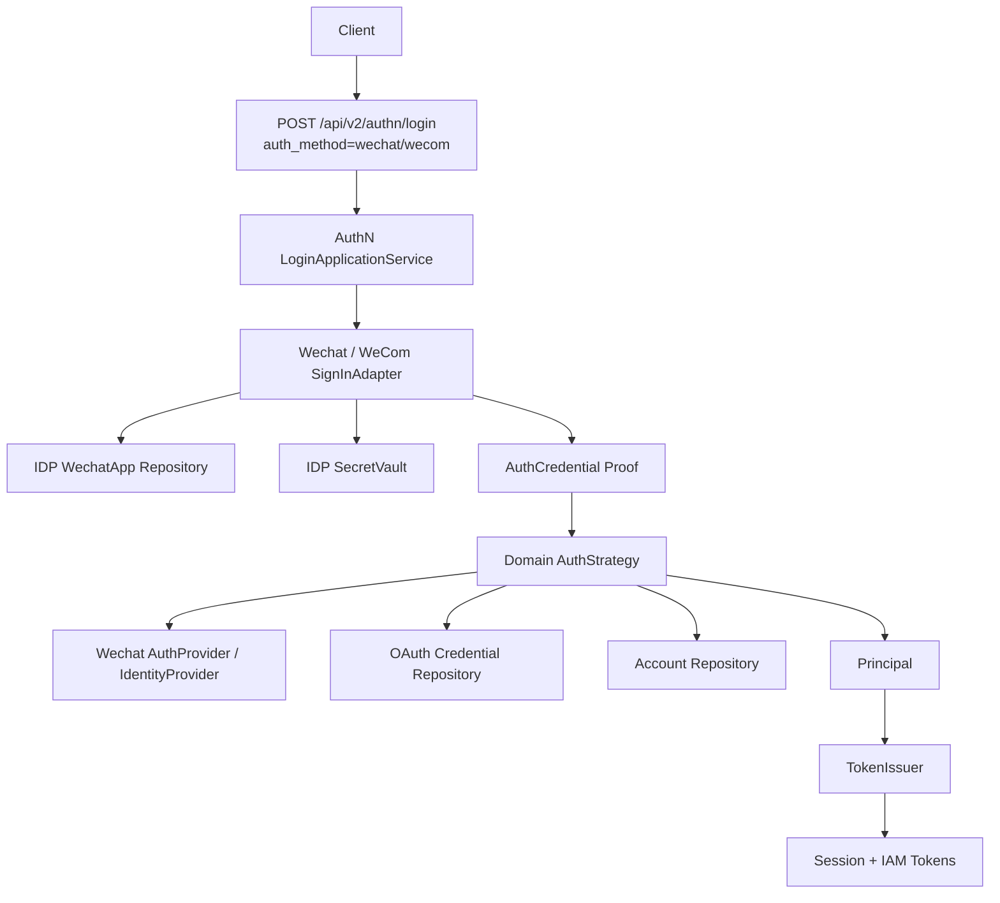

---

## 重点速查

| 问题 | 当前答案 | 代码证据 |
| --- | --- | --- |
| IDP 模块初始化依赖什么 | DB、Redis、32-byte encryption key。 | [../../internal/apiserver/container/assembler/idp.go](../../internal/apiserver/container/assembler/idp.go) |
| IDP infra 初始化了什么 | WechatAppRepository、AccessTokenCache、SecretVault、WechatSDKCache、AuthProvider、TokenProvider。 | [../../internal/apiserver/container/assembler/idp_infra_builder.go](../../internal/apiserver/container/assembler/idp_infra_builder.go) |
| SecretVault 用什么实现 | AES-GCM，本地实现要求 32 字节 master key。 | [../../internal/apiserver/infra/crypto/secret_vault.go](../../internal/apiserver/infra/crypto/secret_vault.go) |
| IDP 向 AuthN 暴露什么 | Repository、SecretVault、WechatAuthProvider。 | [../../internal/apiserver/container/assembler/idp.go](../../internal/apiserver/container/assembler/idp.go) |
| WechatApp 管理服务有哪些 | Create/Get/List/Update/Enable/Disable。 | [../../internal/apiserver/application/idp/wechatapp/services.go](../../internal/apiserver/application/idp/wechatapp/services.go) |
| 凭据服务有哪些 | RotateAuthSecret、RotateMsgSecret。 | [../../internal/apiserver/application/idp/wechatapp/services.go](../../internal/apiserver/application/idp/wechatapp/services.go) |
| 微信 access_token 服务有哪些 | GetAccessToken、RefreshAccessToken。 | [../../internal/apiserver/application/idp/wechatapp/services.go](../../internal/apiserver/application/idp/wechatapp/services.go) |
| IDP REST 管理路由是否公开 | WechatApp 管理路由要求 admin middlewares。 | [../../internal/apiserver/transport/rest/idp/router.go](../../internal/apiserver/transport/rest/idp/router.go) |
| 微信登录请求中是否传 AppSecret | 不传；AuthN adapter 从 IDP 查询并解密 AppSecret。 | [../../internal/apiserver/application/authn/login/adapter_wechat_mini.go](../../internal/apiserver/application/authn/login/adapter_wechat_mini.go) |
| 企业微信登录请求中是否传 CorpSecret | 不传；AuthN adapter 从 IDP 查询并解密 CorpSecret，agent_id 来自 server config。 | [../../internal/apiserver/application/authn/login/adapter_wecom.go](../../internal/apiserver/application/authn/login/adapter_wecom.go) |
| 第三方登录是否自动创建用户 | 当前策略要求已有 OAuth credential 绑定；无绑定返回 `ErrNoBinding`。 | [../../internal/apiserver/domain/authn/authentication/auth-wechat-mini.go](../../internal/apiserver/domain/authn/authentication/auth-wechat-mini.go)、[../../internal/apiserver/domain/authn/authentication/auth-wechat-com.go](../../internal/apiserver/domain/authn/authentication/auth-wechat-com.go) |

---

## 1. IDP 的系统定位

IDP 是 Identity Provider 模块。  
在 IAM 中，它的职责不是“完成登录”，而是管理第三方身份源所需的基础设施。

当前 IDP 主要服务微信生态：

```text
WechatApp 管理
  -> 小程序 / 公众号 / 企业微信应用配置
  -> AppSecret / CorpSecret 加密存储
  -> AccessToken 缓存
  -> 微信 API 调用适配
```

IDP 模块注释已经明确：

```text
认证功能由 authn 模块统一提供
IDP 提供基础设施服务供 authn 模块使用
```

这条边界非常重要。  
如果把 IDP 写成登录模块，会导致登录态、token、session、账号绑定分散到多个模块中。

正确理解是：

```text
IDP = 第三方身份源配置与外部 API 能力
AuthN = 认证判定与 IAM 登录态
```

核心源码：

- [../../internal/apiserver/container/assembler/idp.go](../../internal/apiserver/container/assembler/idp.go)

---

## 2. IDP 模块初始化

IDP module 初始化需要：

```text
DB
Redis
EncryptionKey
```

其中 encryption key 必须是 32 字节，用于 AES-256 SecretVault。

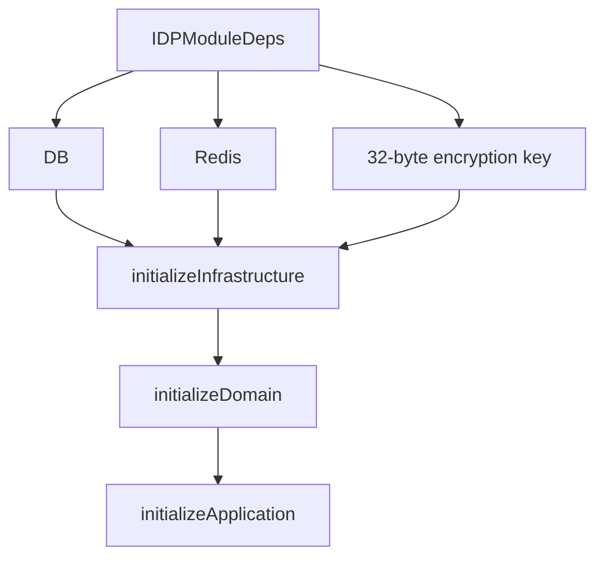

初始化顺序：

1. 校验 DB / Redis / encryption key；
2. 初始化基础设施；
3. 初始化领域服务；
4. 初始化应用服务。

### 初始化失败边界

| 依赖 | 缺失后果 |
| --- | --- |
| DB nil | IDP module 初始化失败 |
| Redis nil | IDP module 初始化失败 |
| EncryptionKey 不是 32 bytes | IDP module 初始化失败 |

在非 degraded 模式下，IDP 是关键模块之一，初始化失败会导致启动失败。  
在 degraded 模式下，服务可能保留诊断面，但第三方登录相关能力不可被视为完整可用。

核心源码：

- [../../internal/apiserver/container/assembler/idp.go](../../internal/apiserver/container/assembler/idp.go)

---

## 3. IDP 基础设施层

IDP infrastructure 初始化了以下组件：

| 组件 | 当前实现 | 用途 |
| --- | --- | --- |
| WechatAppRepository | MySQL | 保存 WechatApp 配置、状态、凭据密文 |
| AccessTokenCache | Redis | 缓存微信 access_token |
| SecretVault | AES-GCM | 加密/解密 AppSecret、EncodingAESKey 等 |
| WechatSDKCache | Redis | silenceper wechat SDK cache |
| WechatAuthProvider | wechatapi | 微信小程序 code2Session |
| WechatTokenProvider | wechatapi | 微信 access_token 获取 |

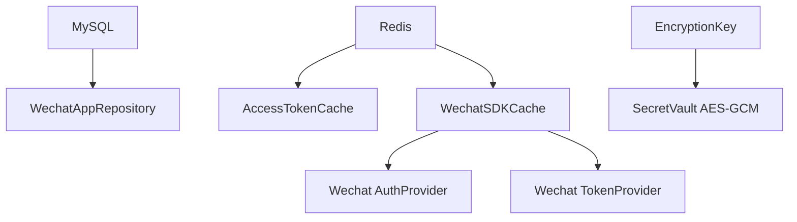

### SecretVault

当前本地实现是 AES-GCM：

```text
Encrypt: nonce || ciphertext
Decrypt: split nonce and ciphertext, then GCM open
```

要求：

```text
master key must be 32 bytes
```

`Sign` 当前不实现，提示应使用 KMS 做托管签名。  
这也暗示生产环境更理想的方向是 KMS/HSM，而不是长期依赖本地 AES-GCM master key。

核心源码：

- [../../internal/apiserver/container/assembler/idp_infra_builder.go](../../internal/apiserver/container/assembler/idp_infra_builder.go)
- [../../internal/apiserver/infra/crypto/secret_vault.go](../../internal/apiserver/infra/crypto/secret_vault.go)

---

## 4. WechatApp 领域模型

WechatApp 是 IDP 领域对象。

核心字段：

| 字段 | 含义 |
| --- | --- |
| `ID` | IAM 内部 ID |
| `AppID` | 微信应用 ID，小程序 appid / 公众号 appid / 企业微信 corpid |
| `Name` | 应用名称 |
| `Type` | 应用类型 |
| `Status` | Enabled / Disabled / Archived |
| `Cred` | 凭据集合 |

状态方法：

```text
IsEnabled()
IsDisabled()
IsArchived()

Enable()
Disable()
Archive()
```

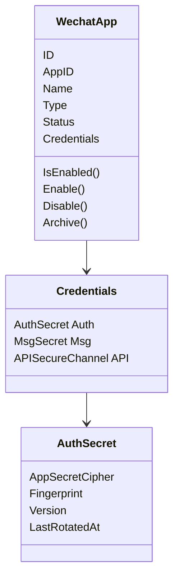

### Credentials

当前凭据集合包括：

| 凭据 | 用途 |
| --- | --- |
| `AuthSecret` | 登录 / access_token 获取所需 AppSecret |
| `MsgSecret` | 微信消息推送安全模式 |
| `APISecureChannel` | 接口层安全，当前预留 |

`AuthSecret` 保存：

```text
AppSecretCipher
Fingerprint
Version
LastRotatedAt
```

Fingerprint 是明文 secret 的 SHA-256 十六进制摘要，用于幂等判断。  
明文 AppSecret 不进入数据库。

核心源码：

- [../../internal/apiserver/domain/idp/wechatapp/wechatapp.go](../../internal/apiserver/domain/idp/wechatapp/wechatapp.go)
- [../../internal/apiserver/domain/idp/wechatapp/credential.go](../../internal/apiserver/domain/idp/wechatapp/credential.go)

---

## 5. AppSecret 轮换与加密存储

WechatApp 的 AppSecret 由 `CredentialRotater` 负责轮换。

`RotateAuthSecret` 流程：

1. 检查 app 不为空；
2. 检查 new secret 非空且长度 >= 16；
3. 不允许 archived app 修改凭据；
4. 如果 fingerprint 相同，直接返回，保持幂等；
5. 使用 SecretVault 加密新 secret；
6. 写入 `AppSecretCipher`；
7. 更新 fingerprint；
8. version + 1；
9. 写入 `LastRotatedAt`。

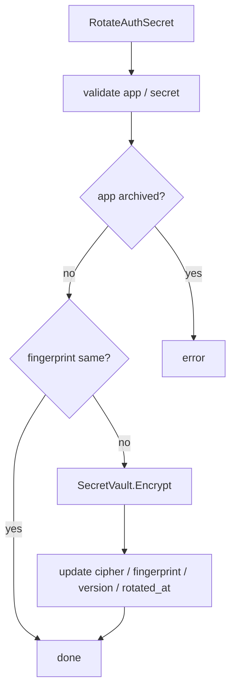

### 为什么要保存 fingerprint

因为 AppSecret 密文每次加密都会因为 nonce 不同而不同。  
如果要判断“新明文是否和旧明文一致”，不能直接比较密文。  
Fingerprint 解决的是幂等轮换问题。

### 明文生命周期

当前代码中，AuthN adapter 解密后会把 `[]byte` 转成 string 传给 proof。  
IDP app token provider 在获取微信 access_token 时会在使用后调用 `zeroBytes(secretBytes)` 清理字节数组，但一旦转成 string，Go 字符串本身无法显式清零。这是当前实现的现实边界，生产级私钥管理仍建议走 KMS/HSM 或更严格的 secret handling。

核心源码：

- [../../internal/apiserver/domain/idp/wechatapp/rotater.go](../../internal/apiserver/domain/idp/wechatapp/rotater.go)
- [../../internal/apiserver/infra/crypto/secret_vault.go](../../internal/apiserver/infra/crypto/secret_vault.go)
- [../../internal/apiserver/container/assembler/idp_app_token_provider.go](../../internal/apiserver/container/assembler/idp_app_token_provider.go)

---

## 6. IDP 应用服务

IDP application 暴露三组服务：

```text
WechatAppApplicationService
WechatAppCredentialApplicationService
WechatAppTokenApplicationService
```

### 6.1 WechatAppApplicationService

负责应用管理：

```text
CreateApp
GetApp
ListApps
UpdateApp
EnableApp
DisableApp
```

创建时，如果提供 AppSecret，会调用 `CredentialRotater.RotateAuthSecret` 加密并保存。

### 6.2 WechatAppCredentialApplicationService

负责凭据轮换：

```text
RotateAuthSecret
RotateMsgSecret
```

### 6.3 WechatAppTokenApplicationService

负责微信 access_token：

```text
GetAccessToken
RefreshAccessToken
```

注意这里的 access token 是微信平台的 access_token，不是 IAM 的 JWT access token。

核心源码：

- [../../internal/apiserver/application/idp/wechatapp/services.go](../../internal/apiserver/application/idp/wechatapp/services.go)
- [../../internal/apiserver/application/idp/wechatapp/services_impl.go](../../internal/apiserver/application/idp/wechatapp/services_impl.go)
- [../../internal/apiserver/container/assembler/idp_application_builder.go](../../internal/apiserver/container/assembler/idp_application_builder.go)

---

## 7. 微信 access_token 缓存

IDP 负责微信平台 access_token 的缓存和刷新。

`AccessTokenCacher.EnsureToken` 流程：

1. 读取缓存；
2. 如果缓存 token 存在且在 skew 窗口外仍有效，直接返回；
3. 尝试获取刷新锁；
4. 拿到锁的一方调用 provider fetch；
5. 计算 TTL：`expiresAt - now - skew`；
6. TTL 小于最小值时使用最小 60s；
7. 写入缓存；
8. 没拿到锁的一方再读一次缓存；
9. 仍没有时返回 retry 错误。

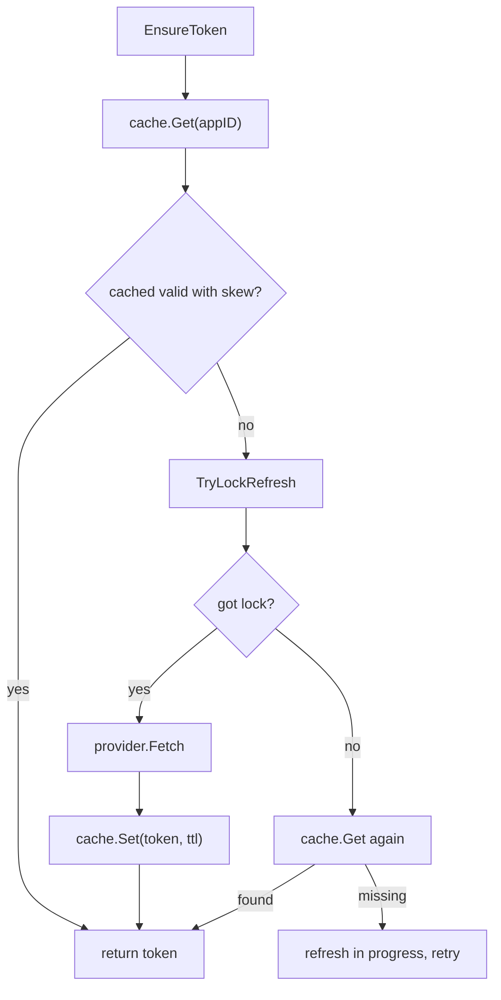

默认参数：

| 参数 | 值 |
| --- | --- |
| refreshSkew | 120s |
| cacheTTLMin | 60s |
| lock TTL | 10s |

### 微信 access_token 与 IAM access token

这两个名字容易混淆：

| Token | 来源 | 用途 |
| --- | --- | --- |
| 微信 access_token | 微信平台 | 调用微信 API |
| IAM access token | IAM AuthN | 访问业务系统 / IAM protected routes |

IDP 只管理微信 access_token。  
IAM access token 由 AuthN TokenIssuer 签发。

核心源码：

- [../../internal/apiserver/domain/idp/wechatapp/accesstoken-cacher.go](../../internal/apiserver/domain/idp/wechatapp/accesstoken-cacher.go)
- [../../internal/apiserver/application/idp/wechatapp/services_impl.go](../../internal/apiserver/application/idp/wechatapp/services_impl.go)
- [../../internal/apiserver/container/assembler/idp_app_token_provider.go](../../internal/apiserver/container/assembler/idp_app_token_provider.go)

---

## 8. IDP REST 管理面

IDP REST routes 位于：

```text
/api/v2/idp
```

基础 health：

```text
GET /api/v2/idp/health
```

WechatApp 管理路由：

```text
GET    /api/v2/idp/wechat-apps
POST   /api/v2/idp/wechat-apps
GET    /api/v2/idp/wechat-apps/:app_id
PATCH  /api/v2/idp/wechat-apps/:app_id
POST   /api/v2/idp/wechat-apps/:app_id/enable
POST   /api/v2/idp/wechat-apps/:app_id/disable
GET    /api/v2/idp/wechat-apps/:app_id/access-token
POST   /api/v2/idp/wechat-apps/rotate-auth-secret
POST   /api/v2/idp/wechat-apps/rotate-msg-secret
POST   /api/v2/idp/wechat-apps/refresh-access-token
```

这些管理路由只有在 admin middlewares 可用时才注册。  
如果 admin middleware 不可用，IDP 只保留 health，不暴露 WechatApp 管理面。

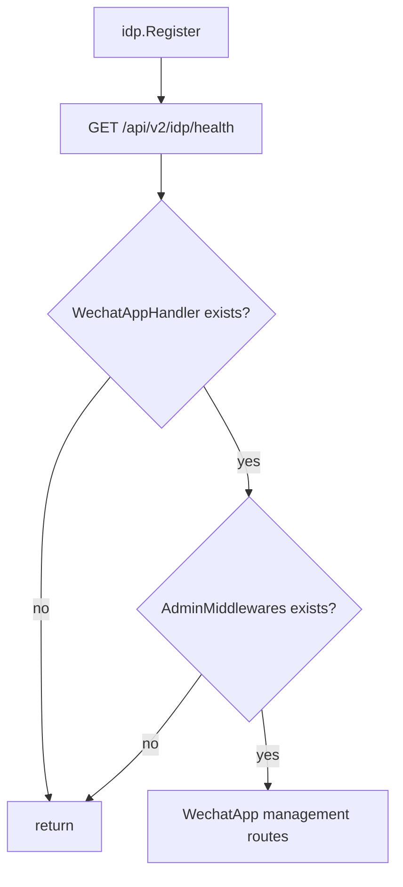

### 当前文档边界

IDP router 源码注释里仍有一段旧式示例，提到 `/api/v2/auth/login` 和 `method: wx:minip`。当前重建文档不沿用这段旧示例。  
当前 REST v2 登录事实以 AuthN 文档为准：

```text
POST /api/v2/authn/login
auth_method = wechat / wecom
```

核心源码：

- [../../internal/apiserver/transport/rest/idp/router.go](../../internal/apiserver/transport/rest/idp/router.go)
- [../../internal/apiserver/transport/rest/idp/handler/wechatapp.go](../../internal/apiserver/transport/rest/idp/handler/wechatapp.go)
- [../../internal/apiserver/transport/rest/authn/handler/auth_login.go](../../internal/apiserver/transport/rest/authn/handler/auth_login.go)

---

## 9. AuthN 如何接入 IDP

AuthN module 初始化时，如果 IDP module 存在，会从 IDP 取三个能力：

```text
WechatAppRepository
SecretVault
WechatAuthProvider
```

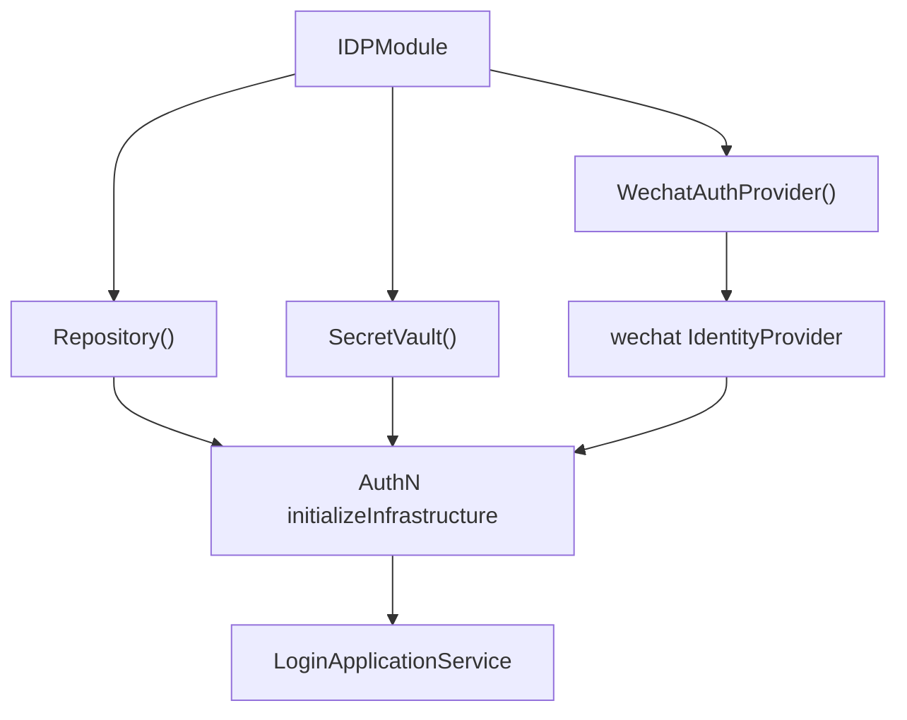

AuthN 使用这些能力做三件事：

1. adapter 查询微信/企微应用配置；
2. adapter 解密 AppSecret/CorpSecret；
3. domain strategy 调用 IdentityProvider 与微信/企微交换身份。

如果 IDP 不存在，AuthN 仍会创建一个空的 WeChat IdentityProvider，但第三方登录会因为配置或 provider 缺失而失败。  
这意味着 IDP 缺失不会让 password login 的概念消失，但会破坏微信/企微登录链路。

核心源码：

- [../../internal/apiserver/container/assembler/authn_infra_builder.go](../../internal/apiserver/container/assembler/authn_infra_builder.go)
- [../../internal/apiserver/container/assembler/authn_application_builder.go](../../internal/apiserver/container/assembler/authn_application_builder.go)
- [../../internal/apiserver/container/assembler/idp.go](../../internal/apiserver/container/assembler/idp.go)

---

## 10. 微信小程序登录链路

REST 请求：

```json
{
  "auth_method": "wechat",
  "method_payload": {
    "app_id": "wx_xxx",
    "code": "code_from_wx_login"
  }
}
```

### 10.1 Adapter 阶段

`wechatMiniAdapter.PrepareProof` 会：

1. 校验 payload 类型；
2. 查询 WechatApp；
3. 检查 app 是否存在；
4. 检查 app 是否启用；
5. 检查 app credential 是否存在；
6. 解密 AppSecret；
7. 构造 `WechatMiniCredential`。

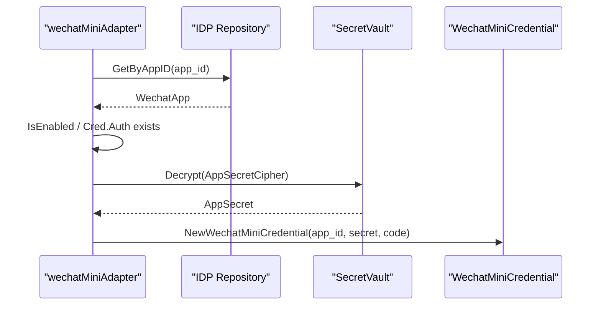

### 10.2 Domain strategy 阶段

`OAuthWechatMinipAuthStrategy.Authenticate` 会：

1. 调用 `IdentityProvider.ExchangeWxMinipCode(appID, appSecret, code)`；
2. 得到 openID / unionID；
3. 优先使用 unionID，回退 openID；
4. 根据 `CredOAuthWxMinip + appID + idpIdentifier` 查询 OAuth credential；
5. 检查账号状态；
6. 构造 Principal；
7. 返回 AuthDecision。

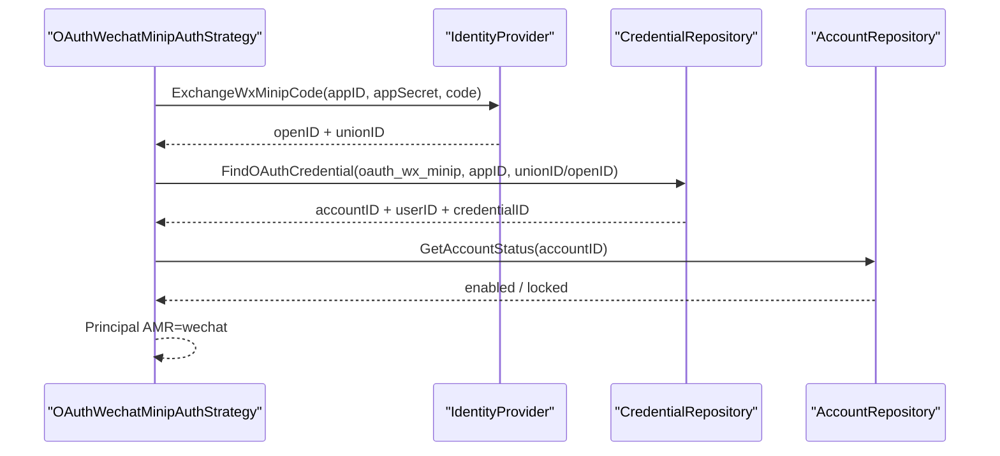

### 10.3 登录成功条件

微信登录成功需要同时满足：

```text
WechatApp 存在
WechatApp enabled
AppSecret 可解密
code2Session 成功
OAuth credential 已绑定 IAM account/user
Account enabled 且未 locked
```

如果 OAuth credential 不存在，返回 `ErrNoBinding`。  
不会在登录链路中自动创建用户或账号。

核心源码：

- [../../internal/apiserver/application/authn/login/adapter_wechat_mini.go](../../internal/apiserver/application/authn/login/adapter_wechat_mini.go)
- [../../internal/apiserver/domain/authn/authentication/auth-wechat-mini.go](../../internal/apiserver/domain/authn/authentication/auth-wechat-mini.go)
- [../../internal/apiserver/infra/wechat/identity_provider.go](../../internal/apiserver/infra/wechat/identity_provider.go)

---

## 11. 企业微信登录链路

REST 请求：

```json
{
  "auth_method": "wecom",
  "method_payload": {
    "corp_id": "ww_xxx",
    "auth_code": "code_from_wecom"
  }
}
```

### 11.1 Adapter 阶段

`wecomAdapter.PrepareProof` 会：

1. 校验 payload 类型；
2. 检查 server-side `agent_id` 是否配置；
3. 通过 corp_id 查询 WechatApp；
4. 检查 app 是否存在；
5. 检查 app 是否启用；
6. 检查凭据是否存在；
7. 通过 SecretVault 解密 CorpSecret；
8. 构造 `WecomCredential`。

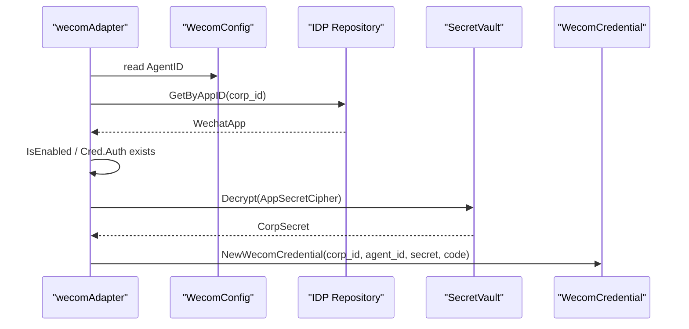

### 11.2 Domain strategy 阶段

`OAuthWeChatComAuthStrategy.Authenticate` 会：

1. 调用 `IdentityProvider.ExchangeWecomCode(corpID, agentID, corpSecret, code)`；
2. 得到 openUserID / userID；
3. 优先使用 userID，回退 openUserID；
4. 根据 `wecom + corpID + idpIdentifier` 查询 OAuth credential；
5. 检查账号状态；
6. 构造 Principal；
7. 返回 AuthDecision。

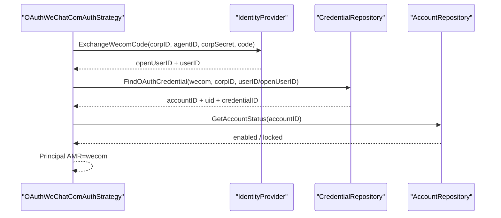

### 11.3 登录成功条件

企业微信登录成功需要同时满足：

```text
idp.wecom.agent_id 已配置
WechatApp(corp_id) 存在
WechatApp enabled
CorpSecret 可解密
ExchangeWecomCode 成功
OAuth credential 已绑定 IAM account/user
Account enabled 且未 locked
```

核心源码：

- [../../internal/apiserver/application/authn/login/adapter_wecom.go](../../internal/apiserver/application/authn/login/adapter_wecom.go)
- [../../internal/apiserver/domain/authn/authentication/auth-wechat-com.go](../../internal/apiserver/domain/authn/authentication/auth-wechat-com.go)
- [../../internal/apiserver/infra/wechat/identity_provider.go](../../internal/apiserver/infra/wechat/identity_provider.go)

---

## 12. 第三方身份与 IAM 账号绑定

微信/企微 code exchange 只能证明：

```text
调用方在微信/企微侧拥有某个 openid / unionid / userid
```

它不能直接证明：

```text
这个外部身份在 IAM 中是谁
这个用户是否已经注册
这个账号是否允许登录
应该签发哪个 IAM token
```

因此 AuthN domain strategy 还会查询 OAuth credential 绑定：

```text
FindOAuthCredential(credential_type, app_id/corp_id, idp_identifier)
```

如果找不到绑定：

```text
ErrNoBinding
```

这意味着当前第三方登录是：

```text
先绑定
再登录
```

不是：

```text
首次扫码自动创建 IAM 用户并登录
```

用户创建、账号绑定、微信身份解析属于 onboarding/account 能力，不属于本文的登录主链路。

核心源码：

- [../../internal/apiserver/domain/authn/authentication/auth-wechat-mini.go](../../internal/apiserver/domain/authn/authentication/auth-wechat-mini.go)
- [../../internal/apiserver/domain/authn/authentication/auth-wechat-com.go](../../internal/apiserver/domain/authn/authentication/auth-wechat-com.go)
- [../../internal/apiserver/application/authn/onboarding/wechat_identity_resolver.go](../../internal/apiserver/application/authn/onboarding/wechat_identity_resolver.go)

---

## 13. IDP Token 与 IAM Token 的区别

这里最容易混淆的是两个 token。

### 13.1 微信 access_token

微信 access_token 来自微信平台，用于：

```text
调用微信 API
获取/刷新微信平台接口能力
```

它由 IDP 的 `WechatAppTokenApplicationService` 管理，并缓存在 Redis 中。

### 13.2 IAM access token

IAM access token 来自 AuthN，用于：

```text
访问 IAM protected routes
访问业务服务
携带 IAM user/account/tenant/session claims
```

它由 AuthN `TokenIssuer` 签发，当前编码为 JWT。

| Token | 管理模块 | 来源 | 用途 |
| --- | --- | --- | --- |
| 微信 access_token | IDP | 微信平台 | 调微信 API |
| IAM access token | AuthN | IAM | 业务认证 |
| IAM refresh token | AuthN | IAM | 刷新 IAM access token |

不要把微信 access_token 返回给业务前端当 IAM 凭证。  
也不要把 IAM access token 用于调用微信平台 API。

---

## 14. IDP 与 CacheGovernance

IDP 暴露缓存族状态读取器：

```text
AccessTokenCacheInspectors
WechatSDKCacheInspectors
```

这些能力会进入 CacheGovernance，用于 debug/cache governance 读模型。

这说明 IDP 的缓存不是黑盒。  
它至少可以在 debug 面被观测到：

```text
微信 access_token cache
wechat SDK cache
```

但 CacheGovernance 是只读诊断面，不是刷新或删除缓存的业务操作入口。

核心源码：

- [../../internal/apiserver/container/assembler/idp.go](../../internal/apiserver/container/assembler/idp.go)

---

## 15. 失败边界

| 阶段 | 失败点 | 当前行为 |
| --- | --- | --- |
| IDP 初始化 | DB nil | IDP 初始化失败 |
| IDP 初始化 | Redis nil | IDP 初始化失败 |
| IDP 初始化 | encryption key 不是 32 bytes | IDP 初始化失败 |
| SecretVault | plaintext 空 | 加密失败 |
| SecretVault | ciphertext 空或太短 | 解密失败 |
| WechatApp 创建 | AppSecret 提供但轮换失败 | 创建失败 |
| AppSecret 轮换 | app archived | 轮换失败 |
| AppSecret 轮换 | new secret 与旧 secret 指纹相同 | 幂等返回 |
| 微信登录 adapter | IDP repo 或 vault 不可用 | 返回配置服务不可用 |
| 微信登录 adapter | app 不存在 | 返回 app not found |
| 微信登录 adapter | app disabled | 返回 app disabled |
| 微信登录 adapter | app credential 缺失 | 返回 credentials not found |
| 微信登录 strategy | code2Session 失败 | `ErrIDPExchangeFailed` |
| 微信登录 strategy | OAuth credential 未绑定 | `ErrNoBinding` |
| 企微 adapter | agent_id 未配置 | 返回 invalid argument |
| 企微 strategy | get user info 失败 | `ErrIDPExchangeFailed` |
| AccessTokenCacher | 刷新锁未拿到且缓存仍为空 | 返回 refresh in progress |
| IDP REST 管理 | admin middleware 不可用 | WechatApp 管理路由不注册 |

---

## 16. 设计模式

| 模式 | 为什么用 | IAM 落地 | 代价和边界 |
| --- | --- | --- | --- |
| Capability Exposure | AuthN 需要 IDP 能力，但不应知道 IDP 内部实现 | `Repository()`、`SecretVault()`、`WechatAuthProvider()` | IDP 缺失会影响第三方登录 |
| Secret Vault | AppSecret 不能明文落库 | AES-GCM SecretVault | 本地 vault 依赖 32-byte master key，生产建议 KMS/HSM |
| Adapter + Strategy | 外部登录方式差异大 | AuthN adapter 准备 proof，domain strategy 认证 | adapter 和 strategy 都要随登录方式扩展 |
| Token Split | 微信 token 和 IAM token 语义不同 | IDP 管微信 access_token，AuthN 管 IAM token | 文档和命名必须反复强调 |
| Pre-bound OAuth Identity | 外部身份不能自动等同 IAM 用户 | `FindOAuthCredential` 找绑定 | 首次绑定/注册需要 onboarding 流程 |
| Single-flight Cache | 微信 access_token 刷新不能并发打爆外部 API | `TryLockRefresh` + skew | 拿不到锁且缓存空时调用方需重试 |

---

## 17. 当前边界与待讨论点

### 17.1 IDP Router 注释中存在旧登录示例

`transport/rest/idp/router.go` 注释中仍出现旧式 `/api/v2/auth/login` 和 `method: wx:minip` 示例。  
当前文档不沿用该旧示例。当前 REST v2 登录入口以 AuthN 为准：

```text
POST /api/v2/authn/login
auth_method = wechat / wecom
```

### 17.2 IDP 管理接口返回微信 access_token

`GET /api/v2/idp/wechat-apps/:app_id/access-token` 返回的是微信平台 access_token。  
这是管理/调试性质能力，不是 IAM 用户登录凭证。

### 17.3 企微 agent_id 来自服务端配置

企微登录 payload 只带 `corp_id/auth_code`。  
`agent_id` 来自 `idp.wecom.agent_id`，`corp_secret` 来自 IDP WechatApp 凭据解密。

### 17.4 微信/企微未绑定不自动登录

第三方 code exchange 成功后，如果找不到 IAM OAuth credential 绑定，仍然不会签发 IAM token。  
这避免了“外部身份存在”直接变成“IAM 用户存在”的安全问题。

---

## 18. 推荐源码阅读路线

### 第一轮：IDP 模块装配

```text
internal/apiserver/container/assembler/idp.go
internal/apiserver/container/assembler/idp_infra_builder.go
internal/apiserver/container/assembler/idp_domain_builder.go
internal/apiserver/container/assembler/idp_application_builder.go
internal/apiserver/container/assembler/idp_app_token_provider.go
```

目标：看清 IDP 如何初始化 repo、cache、vault、provider，并向 AuthN 暴露能力。

### 第二轮：WechatApp 领域模型

```text
internal/apiserver/domain/idp/wechatapp/wechatapp.go
internal/apiserver/domain/idp/wechatapp/credential.go
internal/apiserver/domain/idp/wechatapp/rotater.go
internal/apiserver/domain/idp/wechatapp/interfaces.go
internal/apiserver/domain/idp/wechatapp/external.go
internal/apiserver/domain/idp/wechatapp/accesstoken-cacher.go
```

目标：看清 app、secret、access token cache 的领域语义。

### 第三轮：IDP 应用服务与 REST 管理面

```text
internal/apiserver/application/idp/wechatapp/services.go
internal/apiserver/application/idp/wechatapp/services_impl.go
internal/apiserver/transport/rest/idp/router.go
internal/apiserver/transport/rest/idp/handler/wechatapp.go
```

目标：看清 WechatApp 管理、凭据轮换、微信 access_token 管理。

### 第四轮：AuthN 第三方登录 adapter

```text
internal/apiserver/application/authn/login/adapter_wechat_mini.go
internal/apiserver/application/authn/login/adapter_wecom.go
internal/apiserver/application/authn/login/adapter_catalog.go
internal/apiserver/application/authn/login/services_impl.go
```

目标：看清 AuthN 如何借用 IDP repo/vault/config 准备 proof。

### 第五轮：Domain strategy 与微信 API

```text
internal/apiserver/domain/authn/authentication/auth-wechat-mini.go
internal/apiserver/domain/authn/authentication/auth-wechat-com.go
internal/apiserver/domain/authn/authentication/external.go
internal/apiserver/infra/wechat/identity_provider.go
```

目标：看清 code exchange、OAuth credential 绑定、account status 检查。

### 第六轮：Onboarding / 绑定能力

```text
internal/apiserver/application/authn/onboarding
internal/apiserver/domain/authn/account
internal/apiserver/domain/authn/credential
```

目标：看清未绑定第三方身份如何进入 IAM 用户/账号体系。

---

## 19. 验证建议

```bash
go test ./internal/apiserver/container/assembler \
  ./internal/apiserver/application/idp/wechatapp \
  ./internal/apiserver/domain/idp/wechatapp \
  ./internal/apiserver/application/authn/login \
  ./internal/apiserver/domain/authn/authentication \
  ./internal/apiserver/infra/crypto \
  ./internal/apiserver/infra/wechat

make docs-hygiene
```

建议重点测试方向：

| 测试方向 | 目的 |
| --- | --- |
| IDP init deps | DB/Redis/encryption key 缺失时失败 |
| SecretVault | AES-GCM 加解密、错误 key、短密文 |
| RotateAuthSecret | 指纹幂等、version 增加、archived app 禁止 |
| AccessTokenCacher | cache hit、single-flight refresh、lock miss retry |
| wechat adapter | app not found / disabled / secret decrypt failure |
| wecom adapter | agent_id 缺失 / corp secret decrypt failure |
| code exchange strategy | exchange failed -> ErrIDPExchangeFailed |
| no binding | OAuth credential missing -> ErrNoBinding |
| IDP routes | admin middleware 缺失时管理路由不注册 |
| token distinction | 微信 access_token 不进入 IAM TokenIssuer |

---

## 本文总结

第三方登录与 IDP 协作可以压缩成一句话：

> IDP 提供第三方身份源配置、SecretVault、微信 API 和平台 access_token 缓存；AuthN 使用这些能力完成第三方 proof 准备、账号绑定验证，并统一签发 IAM Session、Access Token 和 Refresh Token。

核心链路是：

```text
IDP:
  WechatApp + AppSecret + AccessTokenCache + AuthProvider

AuthN:
  LoginV2
    -> wechat/wecom adapter
    -> IDP repo + vault
    -> domain strategy code exchange
    -> OAuth credential binding
    -> Principal
    -> IAM session/token
```

理解这篇文档后，要始终区分四件事：

```text
第三方平台身份
第三方应用配置
IAM 账号绑定
IAM 登录态和 token
```

这四个概念不能混在一起。IDP 解决前两件事，AuthN 解决后两件事。
