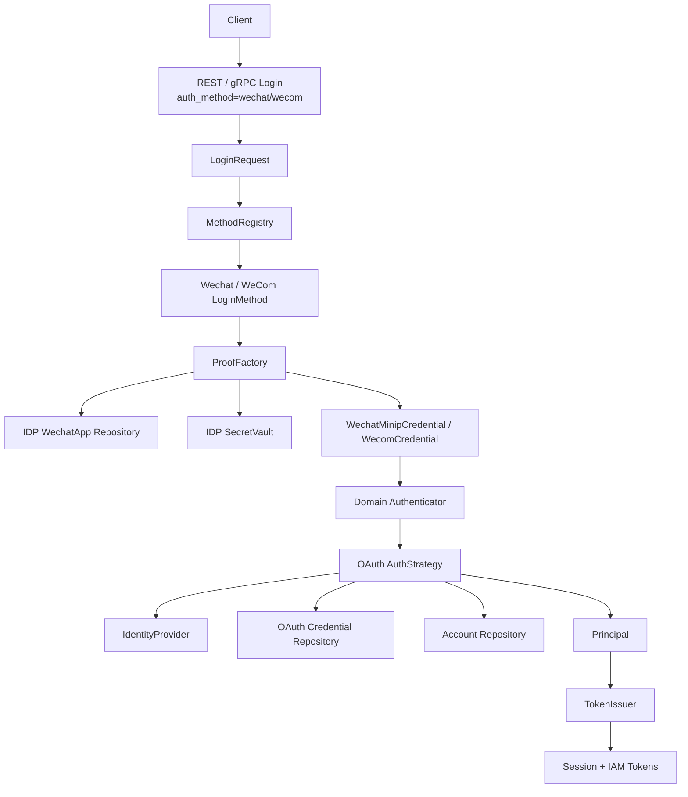
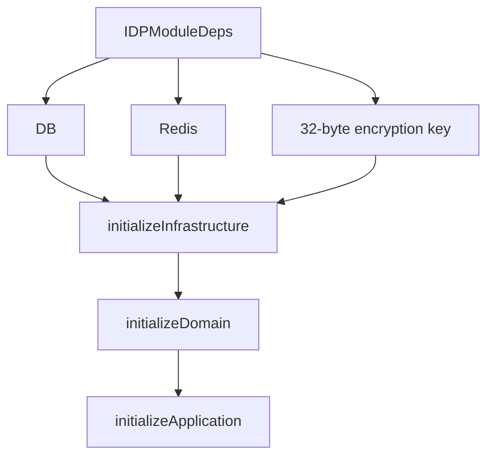
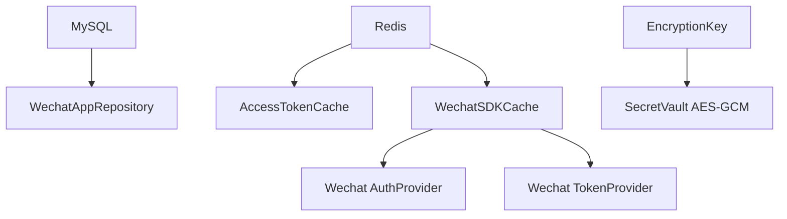
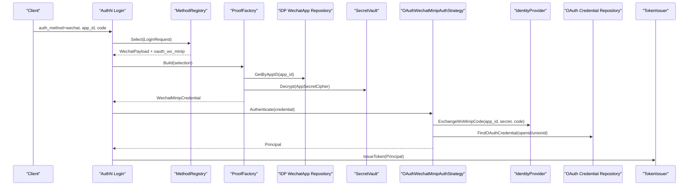
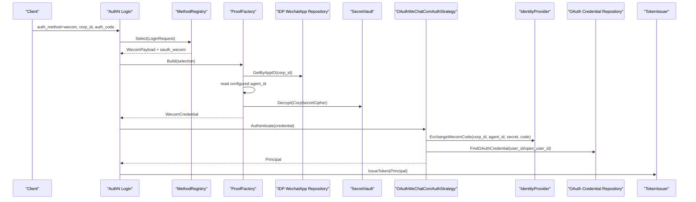

# 第三方登录与 IDP 协作

## 本文回答

本文回答：IAM 中的第三方登录为什么不直接由 IDP 模块完成；IDP 模块负责哪些外部身份源能力；AuthN 在微信/企业微信登录时如何借用 IDP 的应用配置、SecretVault 和微信 API provider；微信/企微 code 如何变成 AuthN proof，最终又如何变成 IAM 的 Session 和 Token。

读完本文，你应该能回答：

- IDP 模块在 IAM 中的职责是什么；
- IDP 和 AuthN 的边界是什么；
- 为什么微信/企微登录最终仍然走 AuthN；
- WechatApp 是什么，和 User/Account/Token 有什么关系；
- AppSecret 或 CorpSecret 如何被加密存储、轮换和解密使用；
- 微信 access_token 和 IAM access token 为什么不是同一个东西；
- 微信小程序登录如何从 `app_id + code` 变成 AuthN proof；
- 企业微信登录如何从 `corp_id + auth_code` 变成 AuthN proof；
- OAuth credential 绑定缺失时为什么不会自动登录成功；
- IDP Redis cache、AccessTokenCacher、WechatSDKCache 分别解决什么问题；
- IDP 初始化失败会如何影响 AuthN 的第三方登录能力。

---

## 30 秒结论

IAM 中的 IDP 模块不是“登录模块”。它是第三方身份源基础设施模块，负责：

```text
WechatApp 配置管理
AppSecret / CorpSecret 加密存储
微信 access_token 缓存
微信 / 企业微信 API provider
向 AuthN 暴露 Repository / SecretVault / IdentityProvider
```

真正的登录态仍然由 AuthN 统一完成：

```text
REST / gRPC Login
  -> auth_method = wechat / wecom
  -> LoginRequest
  -> MethodRegistry.Select
  -> Wechat / WeCom LoginMethod
  -> ProofFactory.Build
  -> WechatMinipCredential / WecomCredential
  -> Authenticator.Authenticate
  -> OAuth AuthStrategy
  -> IdentityProvider code exchange
  -> OAuth credential binding lookup
  -> Principal
  -> TokenIssuer
  -> Session + IAM Access Token + Refresh Token
```

两条核心边界：

1. **IDP 管第三方应用配置、密钥和外部 API provider，不签 IAM token。**
2. **AuthN 管登录判定、账号绑定、Session、IAM Access Token、Refresh Token。**

当前公开登录方式中，微信小程序和企业微信分别对应：

| auth_method | REST payload | LoginMethod | Domain credential | 外部交换 |
| --- | --- | --- | --- | --- |
| `wechat` | `app_id + code` | `NewWechatMethod()` | `WechatMinipCredential` | `ExchangeWxMinipCode` |
| `wecom` | `corp_id + auth_code` | `NewWecomMethod()` | `WecomCredential` | `ExchangeWecomCode` |

核心源码入口：

- [../../internal/apiserver/container/assembler/idp.go](../../internal/apiserver/container/assembler/idp.go)
- [../../internal/apiserver/container/assembler/idp_infra_builder.go](../../internal/apiserver/container/assembler/idp_infra_builder.go)
- [../../internal/apiserver/container/assembler/idp_domain_builder.go](../../internal/apiserver/container/assembler/idp_domain_builder.go)
- [../../internal/apiserver/container/assembler/idp_application_builder.go](../../internal/apiserver/container/assembler/idp_application_builder.go)
- [../../internal/apiserver/application/idp/wechatapp/services.go](../../internal/apiserver/application/idp/wechatapp/services.go)
- [../../internal/apiserver/application/idp/wechatapp/service_credentials.go](../../internal/apiserver/application/idp/wechatapp/service_credentials.go)
- [../../internal/apiserver/application/idp/wechatapp/service_token.go](../../internal/apiserver/application/idp/wechatapp/service_token.go)
- [../../internal/apiserver/application/authn/login/method/wechat.go](../../internal/apiserver/application/authn/login/method/wechat.go)
- [../../internal/apiserver/application/authn/login/method/wecom.go](../../internal/apiserver/application/authn/login/method/wecom.go)
- [../../internal/apiserver/application/authn/login/proof/oauth.go](../../internal/apiserver/application/authn/login/proof/oauth.go)
- [../../internal/apiserver/domain/authn/authentication/auth-wechat-mini.go](../../internal/apiserver/domain/authn/authentication/auth-wechat-mini.go)
- [../../internal/apiserver/domain/authn/authentication/auth-wechat-com.go](../../internal/apiserver/domain/authn/authentication/auth-wechat-com.go)

---

## 主图：IDP 与 AuthN 协作



---

## 重点速查

| 问题 | 当前答案 | 代码证据 |
| --- | --- | --- |
| IDP 模块初始化依赖什么 | DB、Redis、32-byte encryption key。 | [../../internal/apiserver/container/assembler/idp.go](../../internal/apiserver/container/assembler/idp.go) |
| IDP infra 初始化了什么 | WechatAppRepository、AccessTokenCache、SecretVault、WechatSDKCache、AuthProvider、TokenProvider。 | [../../internal/apiserver/container/assembler/idp_infra_builder.go](../../internal/apiserver/container/assembler/idp_infra_builder.go) |
| SecretVault 用什么实现 | AES-GCM，本地实现要求 32 字节 master key。 | [../../internal/apiserver/infra/crypto/secret_vault.go](../../internal/apiserver/infra/crypto/secret_vault.go) |
| IDP 向 AuthN 暴露什么 | Repository、SecretVault、IdentityProvider。 | [../../internal/apiserver/container/assembler/idp.go](../../internal/apiserver/container/assembler/idp.go) |
| WechatApp 管理服务有哪些 | Create/Get/List/Update/Enable/Disable。 | [../../internal/apiserver/application/idp/wechatapp/services.go](../../internal/apiserver/application/idp/wechatapp/services.go) |
| 凭据服务有哪些 | RotateAuthSecret、RotateMsgSecret。 | [../../internal/apiserver/application/idp/wechatapp/service_credentials.go](../../internal/apiserver/application/idp/wechatapp/service_credentials.go) |
| 微信 access_token 服务有哪些 | GetAccessToken、RefreshAccessToken。 | [../../internal/apiserver/application/idp/wechatapp/service_token.go](../../internal/apiserver/application/idp/wechatapp/service_token.go) |
| IDP REST 管理路由是否公开 | WechatApp 管理路由要求 admin middlewares。 | [../../internal/apiserver/transport/rest/idp/router.go](../../internal/apiserver/transport/rest/idp/router.go) |
| 微信登录请求中是否传 AppSecret | 不传；ProofFactory 从 IDP 查询并解密 AppSecret。 | [../../internal/apiserver/application/authn/login/proof/oauth.go](../../internal/apiserver/application/authn/login/proof/oauth.go) |
| 企业微信登录请求中是否传 CorpSecret | 不传；ProofFactory 从 IDP 查询并解密 CorpSecret，agent_id 来自 server config。 | [../../internal/apiserver/application/authn/login/proof/oauth.go](../../internal/apiserver/application/authn/login/proof/oauth.go) |
| 第三方登录是否自动创建用户 | 当前策略要求已有 OAuth credential 绑定；无绑定返回 `ErrNoBinding`。 | [../../internal/apiserver/domain/authn/authentication/auth-wechat-mini.go](../../internal/apiserver/domain/authn/authentication/auth-wechat-mini.go)、[../../internal/apiserver/domain/authn/authentication/auth-wechat-com.go](../../internal/apiserver/domain/authn/authentication/auth-wechat-com.go) |

---

## 1. IDP 的系统定位

IDP 是 Identity Provider 模块。它的职责不是“完成登录”，而是管理第三方身份源所需的基础设施。

当前 IDP 主要服务微信生态：

```text
WechatApp 管理
  -> 小程序 / 公众号 / 企业微信应用配置
  -> AppSecret / CorpSecret 加密存储
  -> AccessToken 缓存
  -> 微信 API 调用 provider
```

这条边界非常重要。如果把 IDP 写成登录模块，会导致登录态、token、session、账号绑定分散到多个模块中。

正确理解是：

```text
IDP = 第三方身份源配置、密钥、外部 API 能力
AuthN = 认证判定、账号绑定、IAM 登录态
```

---

## 2. IDP 模块初始化

IDP module 初始化需要：

```text
DB
Redis
EncryptionKey
```

其中 encryption key 必须是 32 字节，用于 AES-256 SecretVault。



初始化失败边界：

| 依赖 | 缺失后果 |
| --- | --- |
| DB nil | IDP module 初始化失败 |
| Redis nil | IDP module 初始化失败 |
| EncryptionKey 不是 32 bytes | IDP module 初始化失败 |

在非 degraded 模式下，IDP 是关键模块之一，初始化失败会导致启动失败。在 degraded 模式下，服务可能保留诊断面，但第三方登录相关能力不可被视为完整可用。

---

## 3. IDP 基础设施层

IDP infrastructure 初始化了以下组件：

| 组件 | 当前实现 | 用途 |
| --- | --- | --- |
| WechatAppRepository | MySQL | 保存 WechatApp 配置、状态、凭据密文 |
| AccessTokenCache | Redis | 缓存微信 access_token |
| SecretVault | AES-GCM | 加密/解密 AppSecret、EncodingAESKey 等 |
| WechatSDKCache | Redis | 微信 SDK 缓存 |
| WechatAuthProvider | wechatapi | 微信小程序 code2Session |
| WechatTokenProvider | wechatapi | 微信 access_token 获取 |



SecretVault 当前本地实现是 AES-GCM：

```text
Encrypt: nonce || ciphertext
Decrypt: split nonce and ciphertext, then GCM open
```

要求：

```text
master key must be 32 bytes
```

---

## 4. WechatApp 与 IAM 身份的关系

WechatApp 是 IDP 领域对象，不是 AuthN account，也不是 IAM user。

核心字段：

| 字段 | 含义 |
| --- | --- |
| `ID` | IAM 内部 ID |
| `AppID` | 微信应用 ID，小程序 appid / 公众号 appid / 企业微信 corpid |
| `Name` | 应用名称 |
| `Type` | 应用类型 |
| `Status` | Enabled / Disabled / Archived |
| `Cred` | 凭据集合 |

它和 AuthN 的关系是：

```text
WechatApp
  -> 提供 app_id/corp_id 对应的密钥和状态
  -> ProofFactory 使用这些信息构造 AuthCredential
  -> AuthStrategy 使用外部身份标识查 OAuth credential binding
  -> binding 命中后才能得到 Account/User/Principal
```

因此：

- WechatApp 不是登录账号；
- AppSecret 不是 IAM credential；
- 微信 openid/unionid/userid 不是 IAM user id；
- OAuth credential binding 才是第三方身份和 IAM account/user 的连接点。

---

## 5. 微信小程序登录链路

微信小程序登录输入：

```json
{
  "auth_method": "wechat",
  "method_payload": {
    "app_id": "wx_xxx",
    "code": "wx.login returned code"
  }
}
```

完整链路：

```text
BuildExplicitLoginRequest
  -> LoginRequest{AuthMethod: wechat, Payload: WechatPayload}
  -> MethodRegistry.Select
  -> NewWechatMethod().BuildPayload
  -> LoginMethodSelection{CredentialKind: oauth_wx_minip}
  -> ProofFactory.Build
  -> query WechatApp by app_id
  -> decrypt AppSecret
  -> NewWechatMiniCredential
  -> Authenticator.Authenticate
  -> OAuthWechatMinipAuthStrategy
  -> IdentityProvider.ExchangeWxMinipCode
  -> CredentialRepository.FindOAuthCredential
  -> account status check
  -> Principal
  -> TokenIssuer.IssueToken
```



关键点：

- `LoginMethod` 只校验 `app_id` 和 `code` 是否存在；
- `ProofFactory` 查询 WechatApp 并解密 AppSecret；
- `OAuthWechatMinipAuthStrategy` 调用外部 `IdentityProvider` 做 code exchange；
- OAuth binding 缺失时返回 `ErrNoBinding`，不会自动创建用户；
- AuthN 最终统一签发 IAM Session 和 tokens。

---

## 6. 企业微信登录链路

企业微信登录输入：

```json
{
  "auth_method": "wecom",
  "method_payload": {
    "corp_id": "ww_xxx",
    "auth_code": "wecom auth code"
  }
}
```

完整链路：

```text
BuildExplicitLoginRequest
  -> LoginRequest{AuthMethod: wecom, Payload: WecomPayload}
  -> MethodRegistry.Select
  -> NewWecomMethod().BuildPayload
  -> LoginMethodSelection{CredentialKind: oauth_wecom}
  -> ProofFactory.Build
  -> query WechatApp by corp_id
  -> read agent_id from server config
  -> decrypt CorpSecret
  -> NewWecomCredential
  -> Authenticator.Authenticate
  -> OAuthWeChatComAuthStrategy
  -> IdentityProvider.ExchangeWecomCode
  -> CredentialRepository.FindOAuthCredential
  -> account status check
  -> Principal
  -> TokenIssuer.IssueToken
```



关键点：

- 客户端不传 CorpSecret；
- `agent_id` 来自服务端配置；
- `ProofFactory` 负责准备 `corp_id + agent_id + corp_secret + code`；
- `OAuthWeChatComAuthStrategy` 调用企业微信 code exchange；
- OAuth binding 缺失时返回 `ErrNoBinding`；
- AuthN 仍然统一创建 Session 和 IAM tokens。

---

## 7. 微信 access_token 与 IAM access token

这两个 token 完全不同：

| 对象 | 属于 | 用途 | 持有方 |
| --- | --- | --- | --- |
| 微信 access_token | IDP / 微信 API | 调用微信服务端 API | IAM 服务端 |
| IAM access token | AuthN | 访问 FangcunMount 业务服务 | Client / 调用方 |

微信 access_token：

- 由 IDP token provider 获取；
- 缓存在 Redis；
- 用于调用微信 API；
- 不代表 IAM 登录态；
- 不返回给业务 client。

IAM access token：

- 由 AuthN `TokenIssuer` 签发；
- 当前实现为 JWT/JWS；
- 携带 IAM user/account/session 信息；
- 可通过 JWKS 本地验签；
- 在线 Verify 还会检查 revoked marker、session、subject access。

---

## 8. 失败语义

| 阶段 | 失败条件 | 典型结果 |
| --- | --- | --- |
| request validation | `auth_method` 不支持 | unsupported auth method |
| method payload | `app_id/code/corp_id/auth_code` 缺失 | payload invalid |
| proof build | IDP repo 或 SecretVault 不可用 | proof build failed |
| proof build | WechatApp 不存在或被禁用 | proof build failed |
| proof build | AppSecret/CorpSecret 缺失或解密失败 | proof build failed |
| proof build | wecom `agent_id` 未配置 | proof build failed |
| domain strategy | 外部 code exchange 失败 | authentication error |
| domain strategy | OAuth credential binding 不存在 | `ErrNoBinding` |
| domain strategy | Account disabled/locked/deleted | 对应认证失败 code |
| token issue | session/token store/JWT issue 失败 | 登录失败，不返回 token pair |

这些失败边界体现了分层：

- payload 字段问题由 method 层处理；
- IDP 配置和密钥问题由 proof 层处理；
- 外部身份交换、账号绑定和账号状态由 domain strategy 处理；
- session 和 token 持久化由 token application 层处理。

---

## 9. IDP 不负责什么

IDP 不应该负责：

- 判断 IAM account 是否可登录；
- 查 OAuth credential binding 后生成 `Principal`；
- 创建 AuthN session；
- 签 IAM access token；
- 保存 IAM refresh token；
- 做 AuthZ 权限判定。

这些能力都属于 AuthN 或 AuthZ。

反过来，AuthN 也不应该直接拥有：

- WechatApp 管理 API；
- AppSecret/CorpSecret 加密轮换命令；
- 微信 access_token 缓存策略；
- 微信 SDK cache；
- 外部 provider 的基础设施生命周期。

这些能力属于 IDP。

---

## 10. 推荐读源码顺序

### 第一轮：IDP module 入口和装配

```text
internal/apiserver/container/assembler/idp.go
internal/apiserver/container/assembler/idp_infra_builder.go
internal/apiserver/container/assembler/idp_domain_builder.go
internal/apiserver/container/assembler/idp_application_builder.go
```

目标：理解 IDP 暴露给 AuthN 的基础设施能力。

### 第二轮：WechatApp 与 SecretVault

```text
internal/apiserver/domain/idp/wechatapp/wechatapp.go
internal/apiserver/domain/idp/wechatapp/credential.go
internal/apiserver/domain/idp/wechatapp/repository.go
internal/apiserver/infra/mysql/wechatapp/repository.go
internal/apiserver/infra/crypto/secret_vault.go
```

目标：理解应用配置和密钥如何存储。

### 第三轮：AuthN 第三方登录入口

```text
internal/apiserver/application/authn/login/method/wechat.go
internal/apiserver/application/authn/login/method/wecom.go
internal/apiserver/application/authn/login/proof/oauth.go
internal/apiserver/container/assembler/authn_application_builder.go
```

目标：理解 AuthMethod、LoginMethod、ProofFactory 和 IDP 依赖如何连接。

### 第四轮：领域认证策略

```text
internal/apiserver/domain/authn/authentication/auth-wechat-mini.go
internal/apiserver/domain/authn/authentication/auth-wechat-com.go
internal/apiserver/domain/authn/authentication/external.go
```

目标：理解 code exchange、OAuth binding、account 状态和 Principal 构造。

### 第五轮：登录态签发

```text
internal/apiserver/application/authn/token/issuer.go
internal/apiserver/application/authn/token/verifier.go
internal/apiserver/application/authn/token/refresher.go
```

目标：理解第三方登录成功后仍然回到统一 Session / Token 模型。

---

## 11. 判断文档是否过时的检查点

第三方登录文档应始终满足：

1. 登录入口只描述 `auth_method=wechat/wecom`；
2. application 层只描述 `MethodRegistry`、`LoginMethod`、`ProofFactory`；
3. code exchange 写在 domain strategy；
4. IDP 只写基础设施能力；
5. IAM token 只由 AuthN `TokenIssuer` 签发；
6. OAuth binding 缺失不自动登录成功；
7. Mermaid 图中不出现已移除的旧应用层组件。
