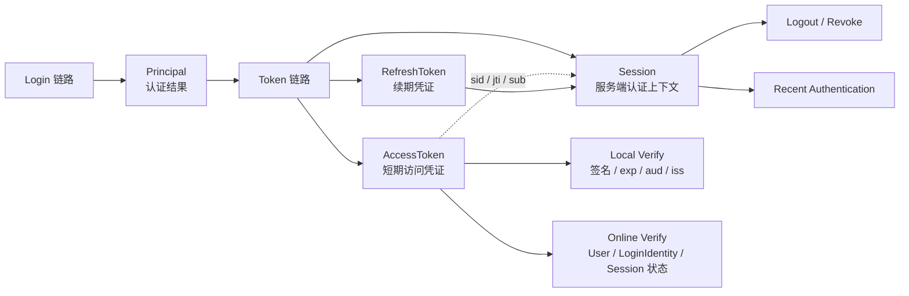

# 05-Session 与 Token 边界：Principal、Session、AccessToken、RefreshToken

## 1. 本文解决什么问题

本文说明 IAM AuthN 模块中认证成功之后的状态边界。

前几篇文档已经完成以下职责拆分：

```text
Onboarding：首次建立 User + LoginIdentity + Credential(optional)。
Linking：已认证 User 绑定、解绑、查看更多 LoginIdentity。
Login：证明请求者控制某个 LoginIdentity，并产出 Principal。
Token：将 Principal 转换为 AccessToken / RefreshToken。
```

本文不再重复 Token 签发、刷新、撤销的完整流程，也不展开 JWT/JWS/JWK/JWKS 的标准细节。

本文只回答：

```text
Principal 是什么？
Session 是什么？
AccessToken 是什么？
RefreshToken 是什么？
它们之间有什么关系？
Local Verify 和 Online Verify 对 Session 有什么影响？
Logout / Revoke 与 Session 有什么关系？
ReAuthenticate / Recent Authentication 与 Session 有什么关系？
Session / Token 与 AuthZ 的边界是什么？
```

文档职责边界：

```text
04-Token链路
  讲 Principal 如何转换为 AccessToken / RefreshToken，以及 refresh / revoke / audit 等应用链路。

05-Session与Token边界
  讲 Principal / Session / AccessToken / RefreshToken 的概念边界和状态模型。

06-JWT-JWS-JWK-JWKS边界与KeyRotation
  讲 JWT/JWS/JWK/JWKS 标准概念、签名验签、KeyRotation。
```

---

## 2. 核心结论

### 2.1 Principal 是认证结果

`Principal` 是 Login 链路认证成功后的主体表达。

它回答：

```text
这次请求认证成功后，系统识别出的主体是谁？
通过哪个 LoginIdentity 认证？
使用了什么 AuthMethod？
处在哪个 Realm / Tenant 上下文？
```

它通常包含：

```text
UserID
LoginIdentityID
TenantID
AuthMethod
Realm
AMR
Claims
```

`Principal` 不是 JWT，不是 Session，也不是 TokenStore 记录。

它是后续 Token 链路的输入。

---

### 2.2 Session 是服务端认证上下文

`Session` 表示服务端维护的一段认证上下文。

它回答：

```text
这个 Principal 完成认证之后，服务端如何管理这段登录状态？
```

Session 服务于：

```text
Refresh Token 生命周期管理；
Logout / Revoke；
多端登录管理；
Session 查询；
风险控制；
Recent Authentication；
服务端主动失效认证上下文。
```

Session 不是 AccessToken。

Session 是服务端状态；AccessToken 是客户端携带的短期访问凭证。

---

### 2.3 AccessToken 是短期访问凭证

`AccessToken` 用于访问受保护资源。

它回答：

```text
当前请求是否携带了一个短期有效、可验证的访问凭证？
```

AccessToken 可以包含：

```text
sub / user_id
sid
jti
tenant_id
login_identity_id
auth_method
realm
amr
iss
aud
iat
nbf
exp
```

AccessToken 不应该包含：

```text
password hash
OTP
RefreshToken
private key
AppSecret
完整用户资料
完整权限列表
```

---

### 2.4 RefreshToken 是续期凭证

`RefreshToken` 用于换取新的 AccessToken。

它回答：

```text
AccessToken 过期后，客户端是否仍然可以获得新的访问凭证？
```

RefreshToken 的关键边界是：

```text
它只应发送给 IAM AuthN 的 token endpoint；
它不应该发送给普通资源服务；
它应绑定 Session 或 TokenStore 状态；
它必须可撤销、可过期、可轮换；
它不应该作为资源访问凭证使用。
```

OAuth 2.0 对 Refresh Token 的边界也是如此：Refresh Token 用于获取新的 Access Token，并且只应发送给授权服务器，不应发送给资源服务器。

---

### 2.5 JWT/JWS/JWK/JWKS 归第 06 篇

JWT/JWS/JWK/JWKS 是 Token 的安全表达与密钥发布机制。

本文只说明它们在边界上的位置：

```text
Principal -> claims -> AccessToken
AccessToken 可使用 JWT/JWS 表达
资源服务可通过 JWKS 本地验签
KeyRotation 管理签名密钥生命周期
```

具体标准概念、claims 设计、签名验签、`kid`、`alg`、KeyRotation 由第 06 篇展开。

---

### 2.6 Token 链路细节归第 04 篇

本文不重复以下内容：

```text
IssueToken 签发流程；
Refresh Token 生成与存储；
Refresh 链路；
Revoke / Logout 链路；
TokenAudit；
Refresh Token rotation；
TokenStore 具体操作。
```

这些由第 04 篇负责。

本文只保留它们与 Session / AccessToken / RefreshToken 的边界关系。

---

## 3. 总体边界图



这张图表达的是：

```text
Principal 是认证结果；
Token 链路把 Principal 转换为 AccessToken / RefreshToken；
Session 是服务端认证上下文；
AccessToken 可以携带 sid / jti / sub 等上下文引用；
RefreshToken 应绑定服务端 Session 或 TokenStore 状态；
Local Verify 不一定查询 Session；
Online Verify 可以检查 Session 当前状态。
```

---

## 4. Principal：认证成功后的主体表达

### 4.1 Principal 的职责

`Principal` 是领域认证结果。

它表达：

```text
谁通过了认证？
通过哪个登录身份？
用什么认证方式？
处在哪个 realm / tenant 上下文？
有哪些认证方法引用 AMR？
哪些认证上下文可以进入 Token claims？
```

它不负责：

```text
JWT 签名；
Refresh Token 存储；
Session TTL；
权限判定；
Credential 持久化；
Logout / Revoke。
```

---

### 4.2 Principal 的核心字段

| 字段 | 语义 |
| --- | --- |
| `UserID` | IAM 主体 ID，通常映射为 Token subject |
| `LoginIdentityID` | 本次认证使用的登录身份 |
| `TenantID` | 当前租户上下文，可为空或 default |
| `AuthMethod` | 本次认证方式，例如 password、phone_otp、wechat_minip |
| `Realm` | LoginIdentity 所在 realm |
| `AMR` | Authentication Method References |
| `Claims` | 额外 claims 来源 |

---

### 4.3 Principal 与 User 的关系

`User` 是稳定主体。

`Principal` 是一次认证成功后的主体视图。

```text
User 是持久化身份主体；
Principal 是认证成功后的运行时主体表达。
```

同一个 User 可以通过不同 LoginIdentity 登录，因此会产生不同的 Principal 上下文：

```text
User U1 via password -> Principal(auth_method=password, login_identity_id=L1)
User U1 via phone_otp -> Principal(auth_method=phone_otp, login_identity_id=L2)
User U1 via wechat_minip -> Principal(auth_method=wechat_minip, login_identity_id=L3)
```

---

## 5. Session：服务端认证上下文

### 5.1 Session 的职责

Session 表达一段服务端认证状态。

它服务于：

```text
Refresh Token 生命周期管理；
Logout / Revoke；
Session 查询；
多端登录管理；
风控与审计；
Recent Authentication；
服务端主动失效认证上下文。
```

如果系统只有无状态 AccessToken，而没有任何服务端 Session 或 RefreshToken 状态，则很难完成：

```text
强制下线；
撤销 RefreshToken；
查看当前登录设备；
全局 logout；
密码修改后撤销旧会话；
敏感操作 recent authentication 检查。
```

---

### 5.2 Session 与 Token 的区别

| 对象 | 保存位置 | 用途 |
| --- | --- | --- |
| Session | 服务端，通常 Redis / DB | 管理认证上下文 |
| AccessToken | 客户端持有，服务端或资源服务验证 | 访问受保护资源 |
| RefreshToken | 客户端持有，服务端校验 | 换取新的 AccessToken |

简化理解：

```text
Session 是服务端状态。
Token 是客户端携带的凭证。
```

---

### 5.3 Session 应包含的信息

Session 可包含：

```text
SessionID
UserID
LoginIdentityID
TenantID
AuthMethod
IssuedAt
ExpiresAt
LastSeenAt
LastReAuthAt
UserAgent
IPAddress
DeviceID
Status
```

这些信息用于：

```text
展示当前登录设备；
撤销某一端登录；
RefreshToken 校验；
风控判断；
审计追踪；
recent authentication 判断。
```

---

### 5.4 Session 与 AccessToken 的关系

AccessToken 可以携带：

```text
sid
jti
sub
```

其中：

| 字段 | 作用 |
| --- | --- |
| `sid` | 引用服务端 Session |
| `jti` | 标识当前 AccessToken |
| `sub` | 标识 User subject |

如果资源服务只做 Local Verify，则通常只校验：

```text
签名；
iss；
aud；
exp；
nbf；
iat；
```

如果资源服务或网关做 Online Verify，则可以进一步校验：

```text
sid 对应 Session 是否仍 active；
User 是否仍 active；
LoginIdentity 是否仍 active；
jti 是否被 denylist；
TokenVersion 是否仍有效。
```

---

### 5.5 Session 与 RefreshToken 的关系

RefreshToken 应绑定服务端状态。

常见方式：

```text
RefreshTokenRecord -> SessionID
Session -> UserID / LoginIdentityID / Device / Status
```

这样可以支持：

```text
单设备 logout；
全设备 logout；
按 Session 撤销 RefreshToken；
检测 RefreshToken reuse 后撤销整个 Session；
根据 User / LoginIdentity 状态使 refresh 失效。
```

---

## 6. AccessToken：短期访问凭证

### 6.1 AccessToken 的职责

AccessToken 用于访问受保护资源。

它表达：

```text
当前请求携带了一个短期有效、可验证的认证上下文。
```

它应该短期有效。

原因：

```text
一旦泄露，攻击窗口有限；
权限或身份状态变化可以较快收敛；
RefreshToken 可以用于换取新的 AccessToken。
```

---

### 6.2 AccessToken 应包含的信息

AccessToken 可以包含：

```text
sub / user_id
sid
jti
tenant_id
login_identity_id
auth_method
realm
amr
iss
aud
iat
nbf
exp
```

这些信息用于表达：

```text
主体是谁；
认证上下文是什么；
Token 何时签发、何时过期；
Token 面向哪个受众；
必要时如何回到 Session。
```

JWT 标准 claims 细节由第 06 篇展开。

---

### 6.3 AccessToken 不应包含的信息

AccessToken 不应包含：

```text
password hash；
OTP code；
RefreshToken；
private key；
AppSecret；
过多个人隐私信息；
完整 Profile；
完整权限列表；
业务资料大包。
```

AccessToken 不是用户资料缓存。

AccessToken 是访问上下文证明。

---

### 6.4 AccessToken 不等于 Session

AccessToken 可以在短期内自包含。

但 Session 是服务端控制点。

因此：

```text
AccessToken 过期前，如果只做 Local Verify，服务端 Session 变化不一定能被立即感知；
AccessToken 过期前，如果走 Online Verify，可以额外检查 Session 状态；
是否需要 Online Verify，取决于风险等级和系统设计。
```

---

## 7. RefreshToken：续期凭证

### 7.1 RefreshToken 的职责

RefreshToken 用于换取新的 AccessToken。

它不是资源访问凭证。

它只应该发送给 IAM 的 token endpoint。

典型关系：

```text
RefreshToken
  -> TokenStore / SessionManager 校验
  -> 生成新的 AccessToken
  -> 可选：轮换 RefreshToken
```

---

### 7.2 RefreshToken 生命周期

RefreshToken 通常比 AccessToken 生命周期更长。

但它必须支持：

```text
撤销；
过期；
轮换；
与 Session 绑定；
与设备/客户端绑定；
异常使用检测。
```

如果 RefreshToken 泄露，攻击者可以持续换取新的 AccessToken，因此它的保护等级高于 AccessToken。

---

### 7.3 RefreshToken 与 Session 的关系

RefreshToken 不应该只是一个长期不变的字符串。

它应当能回到服务端状态：

```text
refresh_token hash -> RefreshTokenRecord -> SessionID -> Session
```

这样才能支持：

```text
RefreshToken revoke；
RefreshToken rotation；
Session revoke；
设备级 logout；
异常复用检测。
```

---

### 7.4 RefreshToken 不应发送给资源服务

资源服务不应该接受 RefreshToken。

正确边界：

```text
AccessToken -> Resource Server
RefreshToken -> IAM AuthN Token Endpoint
```

如果资源服务接受 RefreshToken，会导致：

```text
长生命周期凭证暴露面扩大；
资源服务被迫理解 refresh 语义；
撤销和轮换边界混乱；
泄露风险显著上升。
```

---

## 8. 四者关系：Principal / Session / AccessToken / RefreshToken

| 对象 | 产生位置 | 保存位置 | 主要用途 | 生命周期 |
| --- | --- | --- | --- | --- |
| Principal | Login 领域认证成功后 | 内存 / 应用返回对象 | 表达认证主体 | 单次认证结果 |
| Session | Token / Session 链路 | 服务端 | 管理认证上下文 | 中长期，可撤销 |
| AccessToken | Token 链路 | 客户端 | 访问受保护资源 | 短期 |
| RefreshToken | Token 链路 | 客户端持有，服务端保存状态或 hash | 换取新的 AccessToken | 中长期，可撤销、可轮换 |

可以这样理解：

```text
Principal 是“认证成功后的主体表达”。
Session 是“服务端记住这段认证上下文”。
AccessToken 是“客户端拿去访问资源的短期凭证”。
RefreshToken 是“客户端拿去续期的长期凭证”。
```

---

## 9. Local Verify 与 Online Verify 对 Session 的影响

### 9.1 Local Verify

Local Verify 指资源服务本地验证 AccessToken。

通常检查：

```text
签名；
kid；
iss；
aud；
exp；
nbf；
iat；
```

优点：

```text
性能高；
IAM 中心服务压力小；
资源服务可以独立验签。
```

限制：

```text
不一定立即感知 Session revoke；
不一定立即感知 User disabled；
不一定立即感知 LoginIdentity disabled；
不一定立即感知 logout。
```

因此 AccessToken 应短期有效。

---

### 9.2 Online Verify

Online Verify 指调用 IAM 检查 AccessToken 或认证上下文的当前服务端状态。

它可以检查：

```text
签名和 claims；
Session 是否 active；
User 是否 active；
LoginIdentity 是否 active；
jti 是否被 denylist；
TokenVersion 是否仍有效；
风险策略是否允许。
```

适用场景：

```text
高风险 API；
管理后台敏感操作；
资源服务不想自行维护 JWKS；
需要立即感知 logout / revoke / disabled；
需要中心化风控。
```

---

## 10. Logout / Revoke 与 Session 的关系

### 10.1 Logout

Logout 表示当前客户端主动退出。

典型动作：

```text
撤销当前 RefreshToken；
标记当前 Session 为 revoked / logged_out；
可选：将 AccessToken jti 加入短期 denylist 直到自然过期。
```

如果 AccessToken 生命周期短，可以只撤销 RefreshToken 和 Session。

如果系统要求 AccessToken 立即失效，则需要：

```text
Online Verify；
AccessToken denylist；
TokenVersion；
更短的 AccessToken TTL。
```

---

### 10.2 Revoke

Revoke 表示服务端主动撤销认证上下文或续期能力。

典型场景：

```text
用户修改密码后撤销旧会话；
管理员强制下线；
检测到 RefreshToken 泄露；
用户解绑关键 LoginIdentity；
用户被禁用；
风控发现异常设备。
```

Revoke 的目标通常是：

```text
Session；
RefreshToken；
Token family；
User 的全部 Session；
某个 LoginIdentity 相关 Session。
```

---

## 11. ReAuthenticate / Recent Authentication 与 Session 的关系

ReAuthenticate 用于敏感操作前的近期认证。

典型场景：

```text
修改密码；
解绑当前登录身份；
解绑 username / phone；
绑定高风险登录身份；
查看敏感资料；
关闭 MFA。
```

ReAuthenticate 不一定创建新的长期 Session，也不一定签发新的 Token。

它可以只证明：

```text
当前用户在最近一段时间内重新完成过认证。
```

常见实现：

```text
session 上记录 last_reauth_at；
签发短期 reauth token；
要求再次输入 password / OTP / passkey。
```

在当前 AuthN Linking 文档中，敏感解绑已经使用 recent authentication 边界：

```text
解绑当前会话使用的 LoginIdentity；
解绑 username；
解绑 phone。
```

这类检查关注的是“认证事件的新鲜度”，不等同于普通 Session 仍然 active。

---

## 12. Session / Token 与 AuthZ 的关系

AuthZ 不应该直接依赖 LoginIdentity。

AuthZ 应关注：

```text
Subject = user:<UserID>
Tenant / Scope
Resource
Action
Role / Permission
```

Token 中的 `login_identity_id` 主要用于：

```text
审计；
风控；
会话展示；
安全策略；
解绑当前登录身份判断。
```

不应把权限绑定到某个 LoginIdentity。

例如：

```text
错误：wechat 登录身份拥有 admin 权限。
正确：User U1 在 tenant-A scope 下拥有 admin 角色。
```

AccessToken 可以提供 AuthZ 所需的身份上下文，例如：

```text
sub / user_id
tenant_id
sid
auth_method
amr
```

但资源访问判定应进入 AuthZ Check。

---

## 13. 常见误区

### 13.1 误区：Principal 就是 JWT

不对。

Principal 是领域认证结果。

JWT 是 Token 层对 Principal 的安全表达之一。

---

### 13.2 误区：Session 就是 AccessToken

不对。

Session 是服务端认证上下文。

AccessToken 是客户端访问资源时携带的短期凭证。

---

### 13.3 误区：RefreshToken 可以访问资源

不对。

RefreshToken 只用于换取新的 AccessToken。

资源服务不应该接受 RefreshToken。

---

### 13.4 误区：Token 里应该放所有用户信息

不对。

Token 不是用户资料缓存。

Token 只应放必要认证上下文。

---

### 13.5 误区：Logout 一定能立即让所有 AccessToken 失效

不一定。

如果资源服务只做 Local Verify，短期 AccessToken 可能在自然过期前仍可通过本地验签。

如果要求立即失效，需要 Online Verify、denylist、TokenVersion 或更短 TTL 等机制配合。

---

### 13.6 误区：Recent authentication 等于 Session active

不对。

Session active 只能说明会话仍有效。

Recent authentication 说明用户在较近时间内重新完成过认证。

敏感操作更关心认证事件的新鲜度。

---

## 14. 代码事实源索引

| 主题 | 代码位置 |
| --- | --- |
| SignIn 编排 | `internal/apiserver/application/authn/login/sign_in.go` |
| ReAuthenticate | `internal/apiserver/application/authn/login/re_authenticate.go` |
| Linking recent authentication | `internal/apiserver/application/authn/linking/unlink_identity.go` |
| Principal | `internal/apiserver/domain/authn/authentication/principal.go` |
| AuthDecision | `internal/apiserver/domain/authn/authentication` |
| Token 应用服务 | `internal/apiserver/application/authn/token` |
| Session 应用服务 | `internal/apiserver/application/authn/session` |
| Session 领域模型 | `internal/apiserver/domain/authn/session` |
| Token infra | `internal/apiserver/infra/token` |
| JWKS 应用服务 | `internal/apiserver/application/authn/jwks` |
| Keyset infra | `internal/apiserver/infra/token/keyset` |
| Token 审计表 | `auth_token_audit` in migration schema |
| AuthN capabilities | `internal/apiserver/container/assembler/capabilities.go` |

具体接口、字段、表结构以当前源码、migration、REST/gRPC/SDK 契约为准。

---

## 15. 面试与项目讲解口径

可以这样讲：

> IAM 的 Login 链路在领域层产出的是 Principal，而不是直接产出 JWT。Principal 表达本次认证成功后的主体上下文，包括 UserID、LoginIdentityID、AuthMethod、Realm、AMR 等。Token 链路把 Principal 转换成 AccessToken 和 RefreshToken；Session 则是服务端维护的认证上下文，用于 refresh、logout、revoke、多端管理和 recent authentication。

进一步可以补充：

> AccessToken 是短期访问凭证，适合资源服务本地验签；RefreshToken 是续期凭证，只应发送给 IAM 的 token endpoint，不应该给资源服务使用。Session 是服务端控制点，它让系统可以撤销 RefreshToken、强制下线、管理设备、检查 recent authentication。AccessToken 如果只做本地验签，不一定能立即感知 Session revoke，所以高风险操作可以走 Online Verify。

如果面试官追问 AuthZ，可以这样回答：

> Token 只提供认证上下文，不应该塞入完整权限列表。AuthZ 仍然以 Subject、Tenant、Resource、Action、Scope 做权威判断。Token 中的 user_id、tenant_id、sid、auth_method 等只是给 AuthZ 或网关提供上下文，不替代 AuthZ Check。

---

## 16. 后续文档入口

本文说明 Principal、Session、AccessToken、RefreshToken 的边界。

后续继续阅读：

```text
06-JWT-JWS-JWK-JWKS边界与KeyRotation.md
07-第三方登录与IDP协作-WeChat-WeCom.md
08-AuthN分层架构与事实源索引.md
```

其中：

```text
JWT/JWS/JWK/JWKS 文档说明 Token 如何被签名、验签与密钥轮换。
第三方登录文档说明外部 IDP proof 如何进入 Login / Linking / Onboarding。
分层架构文档统一索引 AuthN 的应用层、领域层、Infra 层事实源。
```

---

## 17. 外部标准参考

本文中的 Session 与 Token 边界参考以下标准和安全实践：

```text
RFC 6749: The OAuth 2.0 Authorization Framework
RFC 7519: JSON Web Token (JWT)
NIST SP 800-63B: Digital Identity Guidelines - Authentication and Lifecycle Management
```

用于校准：

```text
RefreshToken 用于获取新的 AccessToken，并且不应发送给资源服务器。
JWT 是 claims 的紧凑表达，可以被签名或完整性保护。
认证会话连续性依赖 verifier 在认证时签发的 session secret；敏感场景需要 reauthentication 以确认用户仍然在场。
```
