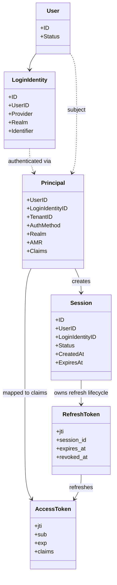
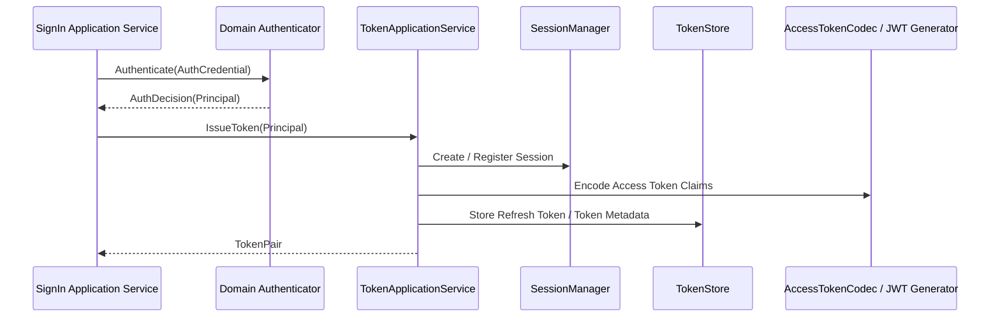
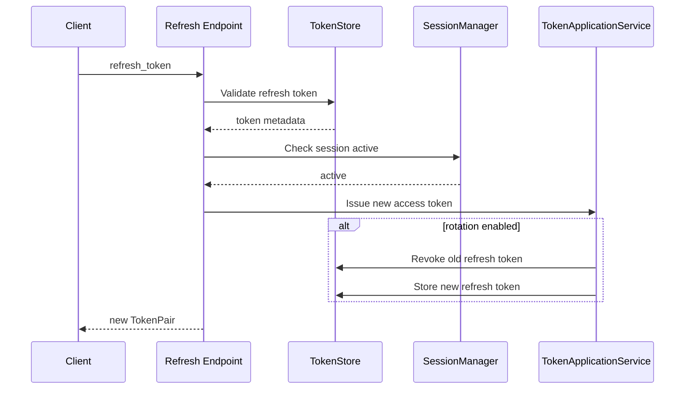

# 05-Session 与 Token 边界：Principal、Session、JWT、RefreshToken

## 1. 本文解决什么问题

本文说明 IAM AuthN 模块中 **认证成功之后的状态表达与访问上下文管理**。

前几篇文档已经说明：

```text
Onboarding：建立 User + LoginIdentity + Credential(optional)
Login：证明请求者控制某个 LoginIdentity
Linking：已认证 User 管理更多 LoginIdentity
Challenge：承载短期认证挑战
```

本文继续说明 Login 成功之后发生什么：

```text
AuthDecision
  -> Principal
  -> Session
  -> Access Token
  -> Refresh Token
```

本文要回答：

1. `Principal` 是什么？
2. `Session` 是什么？
3. `Access Token` 与 `Refresh Token` 的边界是什么？
4. JWT claims 应该表达什么？
5. TokenStore 与 SessionManager 分别负责什么？
6. Logout、ReAuthenticate、Refresh、Revoke 应该如何理解？
7. Token/JWT 是技术表达，为什么不应该污染领域模型？

---

## 2. 核心结论

### 2.1 Principal 是领域认证结果，不是 Token

`Principal` 是领域层认证成功后得到的主体表达。

它回答：

```text
这次请求认证成功后，系统识别出的主体是谁？
通过哪个 LoginIdentity 认证？
使用了什么 AuthMethod？
属于哪个 Realm / Tenant 上下文？
```

它通常包含：

```text
UserID
LoginIdentityID
TenantID
AuthMethod
Realm
AMR
Claims
```

`Principal` 不是 JWT。

JWT 是后续 Token 层对 Principal 的安全表达。

---

### 2.2 Session 是服务端会话上下文

`Session` 表达：

```text
某个 Principal 完成认证之后，在服务端建立的一段认证会话上下文。
```

它服务于：

```text
Token refresh
Token revoke
logout
session query
session invalidation
risk control
```

Session 不等于 Access Token。

Access Token 是请求资源时携带的访问凭证；Session 是服务端用于管理认证状态和 refresh 生命周期的上下文。

---

### 2.3 Access Token 是短期访问凭证

Access Token 用于访问受保护资源。

它通常应该：

```text
生命周期较短
可被资源服务验证
携带必要 claims
不保存敏感认证材料
不携带 password hash / OTP / refresh token
```

当前 IAM 中，Access Token 可以使用 JWT/JWS 表达。

JWT 标准中，JWT 是一种紧凑、URL-safe 的 claims 表达方式；这些 claims 可以作为 JWS 的 payload 被签名或完整性保护。

---

### 2.4 Refresh Token 是换取新 Access Token 的凭证

Refresh Token 用于在 Access Token 过期后换取新的 Access Token。

它通常应该：

```text
生命周期长于 Access Token
只发送给 IAM / Authorization Server
不发送给普通资源服务
可以被撤销
可以轮换
应绑定 Session 或 TokenStore 记录
```

OAuth 2.0 中也明确区分 access token 与 refresh token：refresh token 用于获取新的 access token，而不是直接访问资源。

---

### 2.5 Token 不是 Credential

Token 不属于 `Credential` 模型。

区别如下：

| 对象 | 语义 | 生命周期 |
| --- | --- | --- |
| Credential | 长期认证材料，例如 password hash | 长期 |
| Challenge | 短期认证挑战，例如 SMS OTP | 短期，一次性 |
| Access Token | 认证成功后的访问凭证 | 短期 |
| Refresh Token | 换取新 Access Token 的凭证 | 中长期，可撤销 |
| Session | 服务端认证上下文 | 与 refresh/token 生命周期相关 |

Token 是认证结果的表达，不是登录身份，也不是认证材料。

---

## 3. 总体关系图



---

## 4. Login 成功后的链路

Login 成功后，整体链路为：

```text
AuthStrategy
  -> AuthDecision(OK=true, Principal)
  -> SignIn Application Service
  -> TokenApplicationService.IssueToken(Principal)
  -> SessionManager
  -> TokenStore
  -> TokenPair(access_token, refresh_token)
```

链路图：



---

## 5. Principal：认证主体表达

## 5.1 Principal 的职责

`Principal` 是领域认证结果。

它表达：

```text
谁通过了认证？
通过哪个登录身份？
用什么认证方式？
处在哪个 realm / tenant 上下文？
有哪些认证方法引用 AMR？
需要写入 Token 的 claims 有哪些？
```

它不负责：

```text
JWT 签名
Refresh Token 存储
Session TTL
权限判定
Credential 持久化
```

---

## 5.2 Principal 的核心字段

| 字段 | 语义 |
| --- | --- |
| `UserID` | IAM 主体 ID，通常映射为 JWT `sub` |
| `LoginIdentityID` | 本次认证使用的登录身份 |
| `TenantID` | 当前租户上下文，可为空或 default |
| `AuthMethod` | 本次认证方式，例如 password、phone_otp、wechat_minip |
| `Realm` | LoginIdentity 所在 realm |
| `AMR` | Authentication Method References |
| `Claims` | 额外 claims 来源 |

---

## 5.3 Principal 与 User 的关系

`User` 是稳定主体。

`Principal` 是一次认证成功后的主体视图。

```text
User 是持久化身份主体；
Principal 是认证成功后的运行时主体表达。
```

同一个 User 可以通过不同 LoginIdentity 登录，因此会产生不同的 Principal 上下文：

```text
User U1 via password -> Principal(auth_method=password, login_identity_id=L1)
User U1 via phone_otp -> Principal(auth_method=phone_otp, login_identity_id=L2)
User U1 via wechat_minip -> Principal(auth_method=wechat_minip, login_identity_id=L3)
```

---

## 6. Session：服务端认证上下文

## 6.1 Session 的职责

Session 表达一段服务端认证状态。

它服务于：

```text
1. Refresh Token 生命周期管理。
2. Logout / revoke。
3. Session 查询。
4. 多端登录管理。
5. 风控与审计。
6. 服务端主动失效认证上下文。
```

如果系统只使用无状态 Access Token，而没有服务端 Session，则很难完成：

```text
强制下线
撤销 Refresh Token
查看当前登录设备
全局 logout
密码修改后撤销旧会话
```

---

## 6.2 Session 与 Token 的区别

| 对象 | 保存位置 | 用途 |
| --- | --- | --- |
| Session | 服务端，通常 Redis / DB | 管理认证上下文 |
| Access Token | 客户端持有，服务端验证 | 访问受保护资源 |
| Refresh Token | 客户端持有，服务端校验 | 换取新的 Access Token |

Session 是服务端状态。

Token 是客户端携带的凭证。

---

## 6.3 Session 应包含的信息

Session 可包含：

```text
SessionID
UserID
LoginIdentityID
TenantID
AuthMethod
IssuedAt
ExpiresAt
LastSeenAt
UserAgent
IPAddress
DeviceID
Status
```

这些信息用于：

```text
展示当前登录设备
撤销某一端登录
Refresh Token 校验
风控判断
审计追踪
```

---

## 7. Access Token

## 7.1 Access Token 的职责

Access Token 用于访问受保护资源。

它表达：

```text
这个请求当前被认为来自哪个 Principal。
```

它应该短期有效。

典型内容：

```text
iss
sub
aud
exp
nbf
iat
jti
user_id
login_identity_id
tenant_id
auth_method
realm
amr
```

其中 JWT 标准注册了 `iss`、`sub`、`aud`、`exp`、`nbf`、`iat`、`jti` 等常见 claims。

---

## 7.2 Access Token 不应包含的信息

Access Token 不应包含：

```text
password hash
OTP code
refresh token
private key
AppSecret
过多个人隐私信息
完整权限明细快照（除非有明确设计）
```

Access Token 的 claims 应保持：

```text
足够表达主体与认证上下文；
不要承载敏感认证材料；
不要变成业务资料大包。
```

---

## 7.3 Access Token 的生命周期

Access Token 应短期有效。

原因：

```text
1. 一旦泄露，攻击窗口有限。
2. 权限变化可以在较短时间内收敛。
3. Refresh Token 可以用于换取新的 Access Token。
```

Access Token 到期后，不应该直接延长原 token。

应该通过 Refresh Token 走 refresh 流程。

---

## 8. Refresh Token

## 8.1 Refresh Token 的职责

Refresh Token 用于换取新的 Access Token。

它不是普通资源访问凭证。

它只应该发送给 IAM 的 refresh endpoint。

典型流程：

```text
RefreshToken
  -> TokenStore / SessionManager 校验
  -> 生成新的 Access Token
  -> 可选：轮换 Refresh Token
```

OAuth 2.0 中，Refresh Token 的语义就是用于获取新的 Access Token，而不是直接访问受保护资源。

---

## 8.2 Refresh Token 的生命周期

Refresh Token 通常比 Access Token 有更长生命周期。

但它必须支持：

```text
撤销
过期
轮换
与 Session 绑定
与设备/客户端绑定
异常使用检测
```

如果 Refresh Token 泄露，攻击者可以持续换取新的 Access Token，因此它的保护等级高于 Access Token。

---

## 8.3 Refresh Token 轮换

推荐支持 Refresh Token rotation：

```text
每次 refresh 成功后，旧 refresh token 作废，签发新的 refresh token。
```

好处：

```text
降低 refresh token 泄露后的长期风险；
可以检测旧 token 被重复使用；
为异常会话撤销提供依据。
```

如果当前项目尚未完全实现 rotation，也应在文档中保留该安全目标。

---

## 9. TokenStore

TokenStore 负责保存 Token 相关状态。

它可以用于：

```text
refresh token 校验
refresh token 撤销
access token jti 黑名单或状态记录
token 元数据存储
logout
全局撤销
```

TokenStore 通常使用 Redis。

原因：

```text
高频访问
TTL 管理
快速撤销
短中期状态存储
```

---

## 10. TokenPair

登录成功后通常返回：

```text
AccessToken
RefreshToken
AccessTokenExpiresAt / ExpiresIn
RefreshTokenExpiresAt
TokenType = Bearer
```

Access Token 用于资源访问。

Refresh Token 用于刷新 Access Token。

二者不应混用。

---

## 11. JWT 与 JWS 的边界

## 11.1 JWT 是 claims 表达

JWT 关注的是：

```text
claims set
```

例如：

```json
{
  "iss": "iam",
  "sub": "10001",
  "aud": "qs-server",
  "exp": 1730000000,
  "iat": 1729990000,
  "jti": "token-id",
  "login_identity_id": "20001",
  "auth_method": "password",
  "realm": "tenant-A"
}
```

---

## 11.2 JWS 是签名保护

JWS 关注的是：

```text
对 payload 进行数字签名或 MAC 保护。
```

JWS Compact Serialization 通常长这样：

```text
BASE64URL(header).BASE64URL(payload).BASE64URL(signature)
```

在 IAM 中，Access Token 可以是 JWT claims 经 JWS 签名后的字符串。

---

## 11.3 JWT/JWS 不属于领域层

JWT/JWS 是 Token infra 层的实现细节。

领域层不应该依赖：

```text
JWT library
JWS header
kid
alg
private key
```

领域层只产出 Principal。

Token infra 负责把 Principal 映射为 claims 并签名。

---

## 12. Claims 设计

## 12.1 标准 claims

常见标准 claims：

| Claim | 语义 |
| --- | --- |
| `iss` | Issuer，签发者 |
| `sub` | Subject，主体 |
| `aud` | Audience，受众 |
| `exp` | Expiration Time，过期时间 |
| `nbf` | Not Before，生效时间 |
| `iat` | Issued At，签发时间 |
| `jti` | JWT ID，Token 唯一 ID |

---

## 12.2 IAM 自定义 claims

建议 IAM 自定义 claims：

| Claim | 语义 |
| --- | --- |
| `user_id` 或 `sub` | IAM User ID |
| `login_identity_id` | 本次认证使用的 LoginIdentity |
| `tenant_id` | 当前租户上下文 |
| `auth_method` | password / phone_otp / wechat_minip / wecom |
| `realm` | LoginIdentity realm |
| `amr` | Authentication Method References |
| `sid` | Session ID |

注意：

```text
如果 sub 已经使用 UserID，则 user_id 可选。
如果需要兼容多系统，可以同时保留 sub 和 user_id。
```

---

## 12.3 不建议放入 claims 的信息

不建议放入：

```text
password hash
OTP
refresh token
AppSecret
openid 原文（除非业务明确需要且有隐私评估）
完整 profile
完整权限列表
```

Token 不是用户资料缓存。

Token 是访问上下文证明。

---

## 13. Logout 与 Revoke

## 13.1 Logout

Logout 表示当前客户端主动退出。

典型动作：

```text
1. 撤销当前 refresh token。
2. 标记当前 session 为 revoked / logged_out。
3. 可选：将 access token jti 加入短期黑名单直到其自然过期。
```

Access Token 生命周期短时，可以只撤销 Refresh Token 和 Session。

如果系统要求立即失效 Access Token，则需要 access token denylist / introspection / session check。

---

## 13.2 Revoke

Revoke 表示服务端主动撤销。

典型场景：

```text
用户修改密码后撤销旧会话
管理员强制下线
检测到 refresh token 泄露
用户解绑关键 LoginIdentity
用户禁用
```

OAuth 2.0 Token Revocation 标准也定义了客户端请求授权服务器撤销 access token 或 refresh token 的机制。

---

## 14. Refresh 流程

典型 refresh 流程：



关键检查：

```text
refresh token 是否存在
refresh token 是否过期
refresh token 是否被撤销
session 是否 active
user / login identity 是否仍有效
是否触发 refresh token rotation
```

---

## 15. ReAuthenticate

ReAuthenticate 用于敏感操作前的近期认证。

典型场景：

```text
修改密码
解绑当前登录身份
绑定高风险登录身份
查看敏感资料
关闭 MFA
```

ReAuthenticate 不一定签发新的长期会话。

它可以只证明：

```text
当前用户在最近一段时间内重新完成过认证。
```

常见实现：

```text
短期 reauth token
session 上记录 last_reauth_at
要求再次输入 password / OTP / passkey
```

---

## 16. Session / Token 与 AuthZ 的关系

AuthZ 不应该直接依赖 LoginIdentity。

AuthZ 应关注：

```text
UserID
TenantID / Scope
Role / Permission
```

Token 中的 `login_identity_id` 主要用于：

```text
审计
风控
会话展示
安全策略
```

不应把权限绑定到某个 LoginIdentity。

例如：

```text
错误：wechat 登录身份拥有 admin 权限
正确：User U1 在 tenant-A scope 下拥有 admin 角色
```

---

## 17. 分层职责

## 17.1 Domain 层

| 模块 | 职责 |
| --- | --- |
| `authentication` | Principal、AuthDecision、认证策略 |
| `session` | Session 模型、SessionManager 领域语义 |
| `loginidentity` | 本次认证使用的登录身份 |
| `credential` | password 等长期认证材料 |

Domain 层不关心 JWT 签名细节。

---

## 17.2 Application 层

| 模块 | 职责 |
| --- | --- |
| `login` | SignIn、SignOut、ReAuthenticate |
| `token` | Token 签发、刷新、撤销 |
| `session` | Session 查询与管理 |
| `jwks` | Key 管理与 JWKS 发布应用编排 |

Application 层负责编排认证成功后的状态管理。

---

## 17.3 Infra 层

| 能力 | 实现 |
| --- | --- |
| JWT 编码 | JWT generator / AccessTokenCodec |
| JWS 签名 | 私钥签名、kid、alg |
| Token 存储 | Redis TokenStore |
| Session 存储 | Redis / MySQL，按当前实现 |
| Key 管理 | keyset / JWKS infra |
| Token 审计 | MySQL audit table |

Infra 层负责技术细节：

```text
签名
验签
Redis TTL
jti 存储
refresh token hash
key rotation
```

---

## 18. 常见错误理解

## 18.1 误区：Principal 就是 JWT

不对。

Principal 是领域认证结果。

JWT 是 Token 层对 Principal 的安全表达。

---

## 18.2 误区：Session 就是 Access Token

不对。

Session 是服务端认证上下文。

Access Token 是客户端访问资源时携带的凭证。

---

## 18.3 误区：Refresh Token 可以访问资源

不对。

Refresh Token 只用于换取新的 Access Token。

资源服务不应该接受 Refresh Token。

---

## 18.4 误区：Token 里应该放所有用户信息

不对。

Token 不是用户资料缓存。

Token 只应放必要认证上下文。

---

## 19. 代码事实源索引

| 主题 | 代码位置 |
| --- | --- |
| SignIn 编排 | `internal/apiserver/application/authn/login/sign_in.go` |
| SignOut | `internal/apiserver/application/authn/login/sign_out.go` |
| ReAuthenticate | `internal/apiserver/application/authn/login/re_authenticate.go` |
| ReAuth 支持 | `internal/apiserver/application/authn/login/reauth` |
| Login 类型 | `internal/apiserver/application/authn/login/types.go` |
| Principal | `internal/apiserver/domain/authn/authentication/principal.go` |
| AuthDecision | `internal/apiserver/domain/authn/authentication` |
| Token 应用服务 | `internal/apiserver/application/authn/token` |
| Session 应用服务 | `internal/apiserver/application/authn/session` |
| Session 领域模型 | `internal/apiserver/domain/authn/session` |
| Token infra | `internal/apiserver/infra/token` |
| JWKS 应用服务 | `internal/apiserver/application/authn/jwks` |
| Keyset infra | `internal/apiserver/infra/token/keyset` |
| Token 审计表 | `auth_token_audit` in migration schema |

---

## 20. 面试与项目讲解口径

可以这样讲：

> IAM 的 Login 链路在领域层产出的是 Principal，而不是直接产出 JWT。Principal 表达本次认证成功后的主体上下文，包括 UserID、LoginIdentityID、AuthMethod、Realm、AMR 等。应用层把 Principal 交给 TokenApplicationService，由 Token 层签发 Access Token 和 Refresh Token，并通过 SessionManager / TokenStore 管理服务端会话和 refresh 生命周期。这样可以把认证语义和 JWT/JWS 的技术实现解耦。

进一步可以补充：

> Access Token 是短期访问凭证，Refresh Token 用于换取新的 Access Token，Session 是服务端认证上下文。Token 不是 Credential，Session 也不是 LoginIdentity。Credential 保存的是长期认证材料；Challenge 保存的是短期认证挑战；Token 保存的是认证结果的访问表达。

---

## 21. 后续文档入口

本文说明 Principal、Session 与 Token 的边界。

后续继续阅读：

```text
06-JWT-JWS-JWKS与KeyRotation.md
07-第三方登录与IDP协作-WeChat-WeCom.md
08-AuthN分层架构与事实源索引.md
```

其中：

```text
JWT/JWS/JWKS 文档说明 Token 如何被签名、验签与密钥轮换。
第三方登录文档说明外部 IdP proof 如何进入 Principal 构造。
分层架构文档统一索引 AuthN 的应用层、领域层、Infra 层事实源。
```
