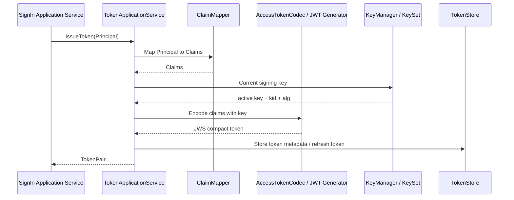
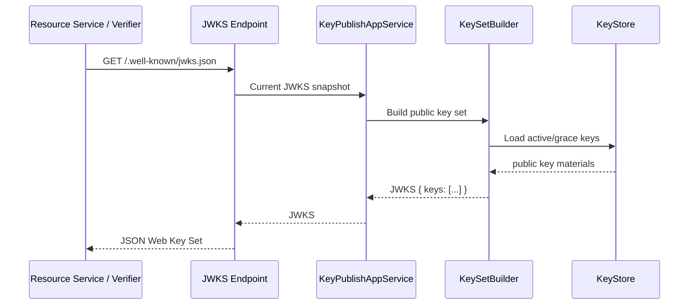
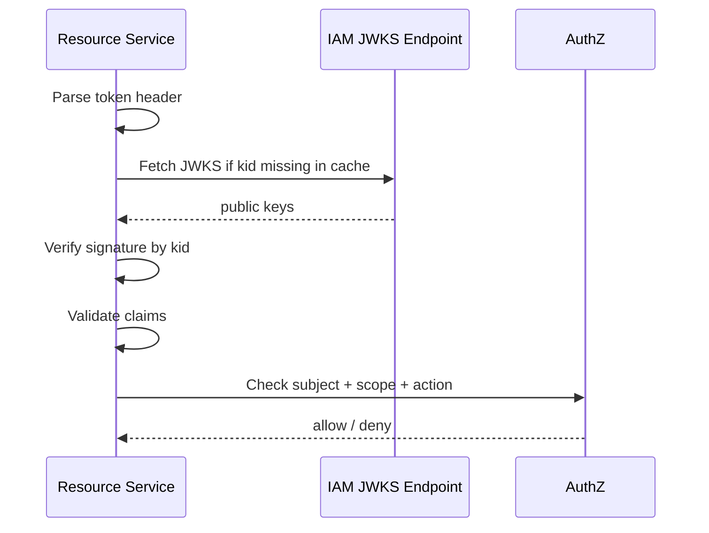
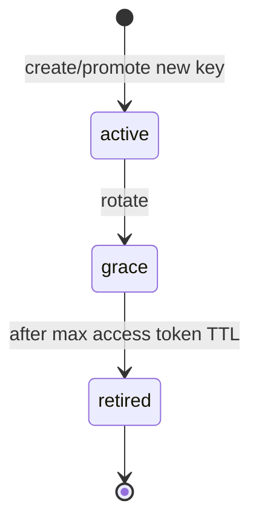

# 06-JWT、JWS、JWKS 与 KeyRotation

## 1. 本文解决什么问题

本文说明 IAM AuthN 模块中 **JWT / JWS / JWK / JWKS / KeyRotation** 的模型边界与实现职责。

前几篇文档已经说明：

```text
Login 成功后，领域层产出 Principal。
TokenApplicationService 基于 Principal 签发 Token。
Access Token 可以使用 JWT/JWS 表达。
JWKS 用于发布验签所需的公钥集合。
KeyRotation 用于管理签名密钥生命周期。
```

本文要回答：

1. JWT、JWS、JWK、JWKS 分别是什么？
2. IAM 中 Access Token 与 JWT/JWS 的关系是什么？
3. `kid`、`alg`、`typ`、`claims` 的职责是什么？
4. JWKS 为什么只能发布公钥？
5. KeyRotation 为什么需要 active / grace / retired 状态？
6. 资源服务如何通过 JWKS 验签？
7. 应用层、领域层、Infra 层在 JWT/JWKS 中各自负责什么？

---

## 2. 核心结论

### 2.1 JWT 是 Claims 表达，不等于签名

JWT 是一种紧凑的 claims 表达格式。

它关注的是：

```text
Claims Set
```

例如：

```json
{
  "iss": "iam",
  "sub": "10001",
  "aud": "qs-server",
  "exp": 1730000000,
  "iat": 1729990000,
  "jti": "token-id",
  "login_identity_id": "20001",
  "auth_method": "password",
  "realm": "tenant-A"
}
```

JWT 本身是 claims 的容器。它可以作为 JWS payload 被签名，也可以作为 JWE plaintext 被加密。

在当前 IAM 中，Access Token 的主要形式是：

```text
JWT claims + JWS signature
```

---

### 2.2 JWS 是签名或 MAC 保护结构

JWS 表达的是：

```text
对一段 payload 进行数字签名或 MAC 保护。
```

在 JWT 场景中：

```text
JWS Payload = JWT Claims Set
```

JWS Compact Serialization 形态为：

```text
BASE64URL(ProtectedHeader).BASE64URL(Payload).BASE64URL(Signature)
```

也就是常见的三段式 Token：

```text
header.payload.signature
```

---

### 2.3 JWK 是 JSON 密钥对象，JWKS 是密钥集合

JWK 表达一个 JSON 格式的密钥对象。

JWKS 表达一组 JWK。

JWKS 的 JSON 结构必须包含：

```json
{
  "keys": [
    { "kty": "RSA", "kid": "...", "use": "sig", "alg": "RS256", "n": "...", "e": "..." }
  ]
}
```

IAM 的 JWKS endpoint 只应该发布：

```text
可公开的验签公钥
```

不能发布：

```text
私钥
对称签名密钥
AppSecret
refresh token secret
```

---

### 2.4 KeyRotation 是签名密钥生命周期治理

KeyRotation 解决的问题是：

```text
如何安全地启用新签名密钥，同时允许旧 Token 在有效期内继续被验证。
```

典型状态：

```text
active  -> 当前用于签发新 Token
grace   -> 不再签发新 Token，但仍允许验签旧 Token
retired -> 不再签发，也不再验签
```

如果没有 grace 状态，密钥一轮换，旧 Token 会立刻全部失效。

如果 retired 密钥长期保留在 JWKS 中，会扩大验签密钥暴露面和管理复杂度。

---

## 3. 标准术语边界

## 3.1 JWT

JWT 是 claims 的紧凑表示。

标准注册 claims 包括：

| Claim | 语义 |
| --- | --- |
| `iss` | Issuer，签发者 |
| `sub` | Subject，主体 |
| `aud` | Audience，受众 |
| `exp` | Expiration Time，过期时间 |
| `nbf` | Not Before，生效时间 |
| `iat` | Issued At，签发时间 |
| `jti` | JWT ID，Token 唯一 ID |

在 IAM 中，JWT claims 来自 `Principal`、Token 策略和应用配置。

---

## 3.2 JWS

JWS 包含：

```text
JOSE Header
Payload
Signature / MAC
```

在 Compact Serialization 中：

```text
BASE64URL(UTF8(JWS Protected Header)) || '.' ||
BASE64URL(JWS Payload) || '.' ||
BASE64URL(JWS Signature)
```

Header 中常见字段：

| Header | 语义 |
| --- | --- |
| `alg` | 签名算法，例如 RS256、ES256、EdDSA |
| `kid` | Key ID，用于找到验签密钥 |
| `typ` | Token 类型，常见为 JWT |

---

## 3.3 JWK

JWK 是 JSON 格式的密钥对象。

常见字段：

| 字段 | 语义 |
| --- | --- |
| `kty` | Key Type，例如 RSA、EC、OKP、oct |
| `use` | 用途，例如 sig |
| `kid` | Key ID |
| `alg` | 建议算法 |
| `n` / `e` | RSA 公钥参数 |
| `crv` / `x` / `y` | EC 公钥参数 |
| `x` | OKP 公钥参数 |

---

## 3.4 JWKS

JWKS 是 JWK Set。

结构：

```json
{
  "keys": []
}
```

IAM 的 JWKS endpoint 用于让资源服务或其他验证方获取当前可用于验签的公钥集合。

---

## 4. IAM 中的 Token 签发链路

Login 成功后，Token 签发链路如下：



关键步骤：

```text
1. Principal 转 claims。
2. 选择当前 active 签名密钥。
3. 在 JWS header 中写入 alg、kid、typ。
4. 使用私钥签名 claims。
5. 返回 Access Token。
6. 保存 Refresh Token / Token metadata。
```

---

## 5. Principal 到 Claims 的映射

`Principal` 是领域认证结果。

JWT claims 是 Token 层表达。

映射关系：

| Principal 字段 | JWT Claim |
| --- | --- |
| `UserID` | `sub` 或 `user_id` |
| `LoginIdentityID` | `login_identity_id` |
| `TenantID` | `tenant_id` |
| `AuthMethod` | `auth_method` |
| `Realm` | `realm` |
| `AMR` | `amr` |
| `Claims` | 合并到扩展 claims |

标准 claims 由 Token 层补齐：

```text
iss
aud
exp
nbf
iat
jti
```

注意：

```text
领域层不应该知道 JWT header、kid、alg、私钥。
```

领域层只需要产出 Principal。

---

## 6. Access Token Header 设计

JWS header 建议包含：

```json
{
  "typ": "JWT",
  "alg": "RS256",
  "kid": "2026-05-key-01"
}
```

字段说明：

| 字段 | 语义 |
| --- | --- |
| `typ` | 表示 payload 是 JWT |
| `alg` | 签名算法 |
| `kid` | 签名密钥 ID |

`kid` 很关键。

资源服务验签时会使用：

```text
token.header.kid -> JWKS.keys[kid] -> public key -> verify signature
```

如果没有 `kid`，多密钥轮换时验签方很难确定应该使用哪把公钥。

---

## 7. JWKS 发布链路

JWKS 发布链路：



JWKS 应包含：

```text
active key public material
grace key public material
```

JWKS 不应包含：

```text
retired key
private key material
symmetric signing secret
```

---

## 8. 资源服务验签流程

资源服务收到 Access Token 后：

```text
1. 解析 JWS header。
2. 读取 alg、kid。
3. 根据 kid 从 JWKS 查找公钥。
4. 校验 alg 是否允许。
5. 使用公钥验证 JWS signature。
6. 验证 claims：iss、aud、exp、nbf、iat、jti。
7. 提取 sub / user_id / tenant_id / login_identity_id / auth_method。
8. 执行 AuthZ 判定。
```

验签流程图：



---

## 9. Key 状态模型

推荐密钥状态：

```text
active
grace
retired
```

| 状态 | 是否签发新 Token | 是否允许验签旧 Token | 是否发布到 JWKS |
| --- | ---: | ---: | ---: |
| active | 是 | 是 | 是 |
| grace | 否 | 是 | 是 |
| retired | 否 | 否 | 否 |

### 9.1 active

当前活跃签名密钥。

用于：

```text
签发新的 Access Token。
```

系统通常只应有一个 active signing key。

---

### 9.2 grace

宽限期密钥。

用于：

```text
验证旧 Token。
```

不再用于签发新 Token。

保留到旧 Access Token 全部过期后，可以进入 retired。

---

### 9.3 retired

退役密钥。

不再用于：

```text
签发新 Token
验签旧 Token
JWKS 发布
```

退役密钥可以保留在安全存储中用于审计，但不应对外发布。

---

## 10. KeyRotation 流程

典型轮换流程：

```text
1. 生成新 key。
2. 新 key 进入 active。
3. 旧 active key 进入 grace。
4. 新 Access Token 使用新 key 签发。
5. 旧 Token 仍可通过 grace key 验签。
6. 等待 Access Token 最大 TTL 后，旧 key 进入 retired。
7. JWKS 不再发布 retired key。
```

流程图：



---

## 11. 为什么需要 grace

如果直接把旧 key 从 active 改为 retired，会导致：

```text
旧 Access Token 立刻无法验签。
所有已登录用户可能瞬间失效。
资源服务缓存的 JWKS 也可能不一致。
```

所以必须有 grace：

```text
旧 key 不再签发新 Token，但继续发布到 JWKS 用于验签旧 Token。
```

保留时间至少应覆盖：

```text
Access Token 最大有效期 + JWKS 缓存时间 + 时钟偏移容忍
```

---

## 12. JWKS 缓存策略

资源服务通常会缓存 JWKS。

IAM 发布 JWKS 时可以设置合理缓存头：

```text
Cache-Control
ETag
Last-Modified
```

设计原则：

```text
1. 缓存时间不能长于 key rotation 的安全窗口。
2. 资源服务遇到未知 kid 时，应主动刷新 JWKS。
3. grace key 保留时间要覆盖 JWKS cache TTL。
4. retired key 不应继续出现在 JWKS 中。
```

---

## 13. 算法选择与 alg 安全

### 13.1 只允许白名单算法

验签方不应完全信任 token header 中的 `alg`。

应该配置允许算法：

```text
RS256
ES256
EdDSA
```

根据项目实际选择。

不应接受：

```text
none
不在白名单中的 alg
与 key type 不匹配的 alg
```

---

### 13.2 防止算法混淆

常见风险：

```text
攻击者把 RS256 token 改成 HS256，并诱导系统把 RSA public key 当作 HMAC secret 使用。
```

因此验签必须同时检查：

```text
alg 是否在白名单
kid 对应 key 的 kty 是否匹配 alg
key.use 是否为 sig
key.alg 是否匹配 header.alg（如果设置）
```

---

## 14. kid 设计

`kid` 用于密钥匹配。

建议：

```text
1. kid 全局唯一。
2. kid 不包含私钥材料。
3. kid 不应泄露敏感信息。
4. kid 可以包含日期或版本信息，但不要依赖日期作为唯一安全属性。
5. 每次新 key 都应该生成新的 kid。
```

示例：

```text
2026-05-rs256-01
sig-rs256-20260510-a1b2c3
```

---

## 15. 私钥保护

签名私钥必须严格保护。

要求：

```text
1. 私钥不出现在 JWKS 中。
2. 私钥不写入日志。
3. 私钥不直接暴露给业务服务。
4. 私钥应存放在安全配置、KMS、Vault 或加密数据库中。
5. 只有 Token 签发组件可以使用私钥签名。
```

如果使用对称算法，例如 HS256，则 JWKS 发布会变得危险，因为验证方需要共享同一个 secret。对多服务资源验证场景，更推荐非对称签名：

```text
IAM 持有私钥签发；
资源服务通过 JWKS 获取公钥验签。
```

---

## 16. Token claims 与权限的边界

Access Token 中可以放：

```text
sub / user_id
login_identity_id
tenant_id
auth_method
realm
amr
jti
exp / iat / nbf
```

不建议放：

```text
完整权限列表
完整角色树
完整用户 profile
Credential 信息
Challenge 信息
```

权限应由 AuthZ 判断。

Token 只提供主体和认证上下文。

---

## 17. KeyRotation 与 Refresh Token 的关系

KeyRotation 主要影响：

```text
Access Token 的签名与验签。
```

Refresh Token 如果是随机 opaque token，则不一定受 JWKS 影响。

如果 Refresh Token 也是 JWT，则同样需要签名密钥轮换策略。

建议原则：

```text
1. Access Token 可以用 JWT/JWS。
2. Refresh Token 更适合 opaque token + TokenStore。
3. 如果 Refresh Token 使用 JWT，也必须纳入 KeyRotation。
4. Password change / logout / revoke 应通过 TokenStore / SessionManager 撤销 refresh 能力。
```

---

## 18. Application 层职责

| 模块 | 职责 |
| --- | --- |
| `application/authn/token` | Token 签发、刷新、撤销应用编排 |
| `application/authn/jwks` | JWKS 发布、Key 管理、KeyRotation 应用编排 |
| `application/authn/login` | 登录成功后调用 Token 服务 |
| `application/authn/session` | Session 查询与管理 |

Application 层负责组织流程。

不负责具体签名算法实现。

---

## 19. Domain 层职责

| 模块 | 职责 |
| --- | --- |
| `domain/authn/authentication` | Principal / AuthDecision |
| `domain/authn/session` | Session 领域模型与生命周期 |

Domain 层不应该依赖：

```text
JWT library
JWK parser
JWS signer
KMS client
```

Domain 层只表达：

```text
认证主体是谁
认证方式是什么
认证结果是否成功
会话状态如何变化
```

---

## 20. Infra 层职责

| 能力 | Infra 实现 |
| --- | --- |
| JWT/JWS 编码 | `infra/token` |
| ClaimMapper | JWT claims 映射 |
| Signing Key 管理 | `infra/token/keyset` |
| JWKS 构造 | keyset builder / publisher |
| TokenStore | Redis token store |
| SessionStore | Redis / DB session store |
| Key 持久化 | `jwks_keys` 表或安全存储 |

Infra 层负责：

```text
签名
验签
密钥格式转换
JWK/JWKS 序列化
Redis TTL
Key 状态持久化
```

---

## 21. 错误与失败语义

常见失败：

| 场景 | 处理 |
| --- | --- |
| token header 缺少 kid | 拒绝或按兼容策略处理 |
| kid 未找到 | 刷新 JWKS 后仍未找到则拒绝 |
| alg 不在白名单 | 拒绝 |
| alg 与 key type 不匹配 | 拒绝 |
| signature 无效 | 拒绝 |
| exp 过期 | 拒绝 |
| nbf 未生效 | 拒绝 |
| iss 不匹配 | 拒绝 |
| aud 不匹配 | 拒绝 |
| jti 被撤销 | 拒绝 |
| key retired | 拒绝 |

注意：

```text
验签失败是认证失败，不应进入 AuthZ。
```

---

## 22. 常见误区

## 22.1 误区：JWT 就等于 JWS

不对。

JWT 是 claims 表达。

JWS 是签名/MAC 保护结构。

JWT 可以作为 JWS payload。

---

## 22.2 误区：JWKS 可以发布所有密钥

不对。

JWKS 只应发布可公开的验签公钥。

私钥不能发布。

---

## 22.3 误区：KeyRotation 就是换一个 kid

不对。

KeyRotation 是密钥生命周期管理：

```text
生成新 key
promote active
旧 key grace
旧 key retired
JWKS 发布变化
资源服务缓存收敛
```

---

## 22.4 误区：Refresh Token 也应该给资源服务验签

通常不应该。

Refresh Token 应只给 IAM refresh endpoint 使用。

资源服务只应接受 Access Token。

---

## 23. 代码事实源索引

| 主题 | 代码位置 |
| --- | --- |
| Token 应用服务 | `internal/apiserver/application/authn/token` |
| JWKS 应用服务 | `internal/apiserver/application/authn/jwks` |
| Key 管理 app | `application/authn/jwks` |
| Principal | `internal/apiserver/domain/authn/authentication/principal.go` |
| Session 领域模型 | `internal/apiserver/domain/authn/session` |
| Token infra | `internal/apiserver/infra/token` |
| Keyset infra | `internal/apiserver/infra/token/keyset` |
| JWKS keys 表 | `jwks_keys` in migration schema |
| Token audit 表 | `auth_token_audit` in migration schema |
| Login 调用 Token | `internal/apiserver/application/authn/login/sign_in.go` |
| Container 装配 | `internal/apiserver/container/assembler/authn_application_builder.go` |

---

## 24. 面试与项目讲解口径

可以这样讲：

> IAM 登录成功后，领域层产出 Principal，Principal 表达 UserID、LoginIdentityID、AuthMethod、Realm 等认证上下文。Token 应用层再把 Principal 映射为 JWT claims，并通过 JWS 使用当前 active signing key 签名。Token header 中的 kid 用于资源服务从 JWKS 中找到对应公钥验签。JWKS 只发布公钥，不发布私钥。KeyRotation 通过 active、grace、retired 三个状态实现平滑轮换：新 key 签发新 Token，旧 key 在 grace 期继续验签旧 Token，等旧 Token 全部过期后 retired。

进一步可以补充：

> JWT/JWS/JWKS 属于 Token 与 Infra 层，不属于领域认证模型。领域层不关心 alg、kid、私钥、JWK 序列化；领域层只负责 Principal 和 AuthDecision。这样可以把认证语义和加密签名实现解耦，便于后续更换签名算法、做密钥轮换、扩展 JWKS 发布。

---

## 25. 标准参考

本文术语参考：

```text
RFC 7519: JSON Web Token (JWT)
RFC 7515: JSON Web Signature (JWS)
RFC 7517: JSON Web Key (JWK)
RFC 8725: JSON Web Token Best Current Practices
RFC 6749: OAuth 2.0 Framework
RFC 7009: OAuth 2.0 Token Revocation
```

这些标准用于校准术语边界：

```text
JWT = claims representation
JWS = signed / MACed payload structure
JWK = JSON key object
JWKS = JWK set with keys array
KeyRotation = application-specific key lifecycle management
```

---

## 26. 后续文档入口

本文说明 JWT/JWS/JWKS 与 KeyRotation。

后续继续阅读：

```text
07-第三方登录与IDP协作-WeChat-WeCom.md
08-AuthN分层架构与事实源索引.md
```

其中：

```text
第三方登录文档说明外部 IdP proof 如何进入 LoginIdentity 与 Principal。
分层架构文档统一索引 AuthN 的 Application、Domain、Infra、Transport 事实源。
```
