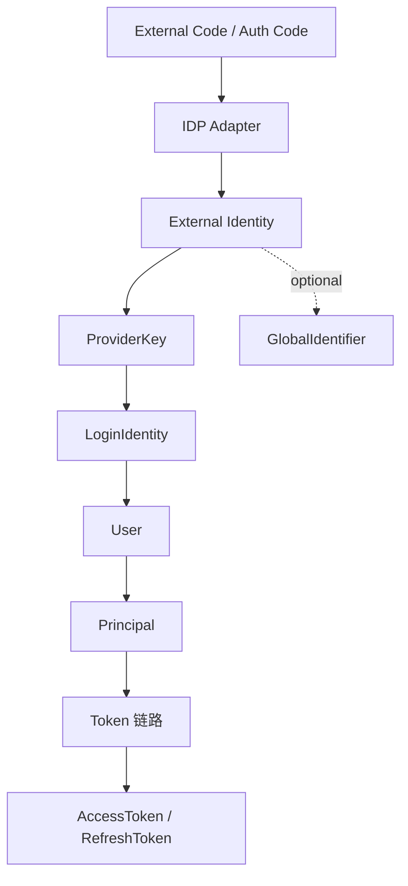

# 07-第三方登录与 IDP 协作：WeChat / WeCom

## 1. 本文解决什么问题

本文说明 IAM AuthN 模块中 **第三方登录与外部身份源（IDP）协作** 的模型边界和链路实现。

当前重点场景：

```text
微信小程序登录 / 绑定
企业微信登录 / 绑定
```

在 IAM 中，第三方登录不是“创建第三方 Credential”，而是：

```text
通过外部 IDP 完成身份证明，解析出外部身份标识，然后映射到 IAM 的 LoginIdentity。
```

因此，微信和企业微信场景的核心模型是：

```text
User
  └── LoginIdentity(provider=wechat_minip / wecom)
        └── no Credential
```

本文要回答：

1. 第三方登录在 IAM AuthN 中的定位是什么？
2. 微信小程序 code2session 如何映射为 LoginIdentity？
3. 企业微信 OAuth code / auth_code 如何映射为 LoginIdentity？
4. Onboarding、Login、Linking 三条链路如何使用 IDP？
5. 为什么微信 / 企业微信不创建长期 Credential？
6. AppSecret、AccessToken、RefreshToken 与 Credential 的边界是什么？
7. IDP 配置、SecretVault、外部接口调用分别属于哪一层？
8. 外部 proof、IAM Challenge、Credential、ExternalAuthorization 的边界是什么？

---

## 2. 核心结论

### 2.1 第三方登录证明的是外部身份，不是 IAM Credential

微信、企业微信等外部身份源已经完成了一次外部身份认证。

IAM 要做的是：

```text
1. 使用外部 IDP 的 code / auth_code 换取外部身份标识；
2. 将外部身份标识归一化为 ProviderKey；
3. 通过 ProviderKey 查找 IAM LoginIdentity；
4. 认证成功后构造 Principal；
5. Token 链路再将 Principal 转换为 AccessToken / RefreshToken。
```

因此，第三方登录不应该创建：

```text
Credential(type=wechat)
Credential(type=wecom)
```

因为 IAM 并没有保存微信或企业微信的长期认证材料。

---

### 2.2 微信小程序身份映射为 LoginIdentity

微信小程序登录通过 `code2session` 将临时 `js_code` 换成：

```text
openid
session_key
unionid(optional)
```

在 IAM 中映射为：

```text
Provider = wechat_minip
Realm = appid
Identifier = openid
GlobalIdentifier = unionid(optional)
```

其中：

| 外部字段 | IAM 字段 | 说明 |
| --- | --- | --- |
| `appid` | `Realm` | 小程序应用 ID，作为 provider namespace |
| `openid` | `Identifier` | 用户在该小程序下的唯一标识 |
| `unionid` | `GlobalIdentifier` | 用户在开放平台维度的稳定标识，可用于跨 App 归并 |
| `session_key` | 不进入 LoginIdentity / Credential | 微信会话密钥，不应下发客户端，也不应当作 IAM Credential |

---

### 2.3 企业微信身份映射为 LoginIdentity

企业微信登录通过 OAuth code / auth_code 换取企业微信用户身份，例如：

```text
corpid
userid
open_userid(optional)
```

在 IAM 中映射为：

```text
Provider = wecom
Realm = corp_id
Identifier = userid 或 open_userid
GlobalIdentifier = optional stable subject
```

当前更直接的模型是：

```text
Provider = wecom
Realm = corp_id
Identifier = userid
```

如果未来扩展第三方服务商模式，可以进一步明确：

```text
自建应用内部身份：corp_id + userid
第三方应用跨企业身份：corp_id + open_userid 或 provider-specific stable subject
```

---

### 2.4 第三方 AccessToken 不属于 Credential

如果未来 IAM 要保存第三方授权 token，例如：

```text
微信 access_token / refresh_token
企业微信 access_token
GitHub access_token
Google refresh_token
```

这些不应该放入 `Credential`。

它们应单独建模为：

```text
ExternalAuthorization / OAuthGrant / ProviderGrant
```

原因：

```text
Credential 是 IAM 用来认证用户的长期认证材料；
第三方 access token 是 IAM 代表用户访问外部系统的授权材料。
```

---

## 3. 外部 IDP 与 IAM 模型的关系



核心转换：

```text
外部 proof -> 外部身份标识 -> ProviderKey -> LoginIdentity -> User -> Principal -> Token 链路
```

IAM 不信任前端直接传来的 openid / userid 作为最终认证结果。

更安全的流程是：

```text
前端传 code；
服务端使用 AppSecret / access_token 与 IDP 交互；
服务端解析 openid / userid；
服务端查 LoginIdentity；
Login 产出 Principal；
Token 链路签发 AccessToken / RefreshToken。
```

---

## 4. 微信小程序：code2session 链路

### 4.1 外部接口语义

微信小程序登录通常是：

```text
wx.login() -> js_code
开发者服务端调用 code2session
code2session -> openid / session_key / unionid(optional)
```

请求参数通常包括：

```text
appid
secret
js_code
grant_type=authorization_code
```

返回结果通常包括：

```text
openid
session_key
unionid(optional)
errcode
errmsg
```

`js_code` 是临时登录凭证，应该只用于换取微信侧身份信息。

`session_key` 是微信用于用户数据加解密/签名校验的会话密钥，不应该下发给客户端，也不应该作为 IAM Credential。

---

### 4.2 IAM ProviderKey 映射

微信小程序身份映射：

```text
WechatMinipProviderKey(appID, openID, unionID)
```

结果：

```text
Provider = wechat_minip
Realm = appID
Identifier = openID
GlobalIdentifier = unionID
```

示例：

```text
appid = wx_app_001
openid = oa_user_123
unionid = union_abc
```

映射为：

```text
LoginIdentity:
  Provider = wechat_minip
  Realm = wx_app_001
  Identifier = oa_user_123
  GlobalIdentifier = union_abc
```

---

### 4.3 unionid 的作用

`openid` 是用户在某个小程序 appid 下的标识。

`unionid` 是在满足微信开放平台条件下返回的跨应用稳定标识。

IAM 中的推荐策略：

```text
1. 优先使用 appid + openid 精确匹配当前小程序 LoginIdentity。
2. 如果未命中，且 unionid 存在，则使用 GlobalIdentifier 查找已有 LoginIdentity。
3. 如果 unionid 命中已有 User，可为同一 User 创建当前 appid + openid 的新 LoginIdentity。
4. 如果 unionid 已属于其他 User，则禁止绑定到当前 User。
```

这样可以支持：

```text
同一个微信用户在多个小程序或多个 App 下归并到同一个 IAM User。
```

---

### 4.4 微信小程序不创建 Credential

微信小程序场景中：

```text
IAM 没有保存 password hash；
IAM 没有保存 passkey public key；
IAM 没有保存 TOTP secret；
IAM 只是通过微信 code2session 得到了外部身份。
```

所以它只创建或使用：

```text
LoginIdentity(provider=wechat_minip)
```

不创建：

```text
Credential(type=wechat)
```

---

## 5. 企业微信：OAuth code / auth_code 链路

### 5.1 外部接口语义

企业微信常见身份解析链路包括：

```text
构造 OAuth 授权链接；
用户在企业微信环境中授权；
企业微信回调 code / auth_code；
服务端使用 access_token / provider token 查询用户身份；
返回 userid / open_userid / corpid 等信息。
```

不同企业微信应用类型可能使用不同接口：

```text
自建应用：根据 code 获取成员信息；
第三方应用：根据 code 获取访问用户身份；
扫码登录：根据 auth_code 获取登录用户信息。
```

但对 IAM 来说，核心都是：

```text
code / auth_code -> external wecom identity -> ProviderKey
```

---

### 5.2 IAM ProviderKey 映射

企业微信身份映射：

```text
WecomProviderKey(corpID, userIDInWecom)
```

结果：

```text
Provider = wecom
Realm = corpID
Identifier = userIDInWecom
```

示例：

```text
corp_id = ww_corp_001
userid = zhangsan
```

映射为：

```text
LoginIdentity:
  Provider = wecom
  Realm = ww_corp_001
  Identifier = zhangsan
```

---

### 5.3 userid 与 open_userid

企业微信可能返回：

```text
UserId / userid
open_userid
CorpId / corpid
```

不同接入模式下字段含义不同。

IAM 需要确定统一策略：

```text
自建应用内部身份：可以使用 corp_id + userid。
第三方应用跨企业场景：可考虑 corp_id + open_userid。
```

当前如果项目使用：

```text
Provider = wecom
Realm = corp_id
Identifier = userid
```

则文档和代码应保持一致。

如果后续扩展第三方服务商模式，应明确是否改用 `open_userid` 或增加 provider 子类型。

---

### 5.4 企业微信不创建 Credential

企业微信场景中：

```text
企业微信完成外部身份认证；
IAM 通过 code 换取 userid；
IAM 使用 corp_id + userid 查 LoginIdentity。
```

IAM 不保存企业微信密码，也不保存可用于本系统反复校验的长期认证材料。

因此不创建：

```text
Credential(type=wecom)
```

---

## 6. IDP 配置与 SecretVault

### 6.1 为什么 AppSecret 必须服务端保存

微信 code2session 需要：

```text
appid
secret
js_code
```

`secret` 是服务端敏感凭据，不应由客户端传入。

正确流程：

```text
1. 客户端提交 appid + js_code。
2. 服务端根据 appid 查询微信应用配置。
3. 服务端通过 SecretVault 解密 AppSecret。
4. 服务端调用微信 code2session。
```

---

### 6.2 IDP 配置模型

微信/企微应用配置通常包括：

```text
AppID / CorpID
AppSecret encrypted material
Status enabled / disabled
Secret version
RotatedAt
```

这些属于 IDP 配置域。

代码事实源：

```text
internal/apiserver/domain/idp/wechatapp
```

---

### 6.3 SecretVault 职责

`SecretVault` 负责：

```text
加密保存 AppSecret；
解密 AppSecret；
避免明文 secret 散落在应用层。
```

应用层可以请求解密，但不应该记录明文 secret。

Infra 层可以实现具体加解密策略。

SecretVault 是 IDP 相关 port / adapter 能力，具体路径以当前源码为准。

---

## 7. Onboarding 中的 IDP 协作

Onboarding 负责首次建立：

```text
User + LoginIdentity + Credential(optional)
```

微信小程序 Onboarding：

```text
1. Transport 接收 appid + js_code。
2. requestPreparer 查询 AppSecret 并调用 code2session。
3. 得到 openid / unionid。
4. 构造 WechatMinipProviderKey。
5. userResolver 根据 ProviderKey / GlobalIdentifier 查找已有 User。
6. loginIdentityEnsurer 创建或复用 LoginIdentity。
7. credentialEnsurer 返回 CredentialNotRequired。
```

最终结果：

```text
User U1
  └── LoginIdentity wechat_minip / appid / openid
        GlobalIdentifier = unionid
        no Credential
```

企业微信首次开通也遵循相同结构：

```text
external proof -> userid -> WecomProviderKey -> User / LoginIdentity -> CredentialNotRequired
```

---

## 8. Login 中的 IDP 协作

Login 负责证明请求者控制某个 LoginIdentity，并产出 Principal。

微信小程序 Login：

```text
1. 请求携带 appid + js_code。
2. ProofFactory 构造 WeChat Mini proof。
3. OAuthWechatMinipAuthStrategy 调用 code2session。
4. 得到 openid / unionid。
5. 根据 appid + openid 查 LoginIdentity。
6. 必要时根据 unionid 查 GlobalIdentifier。
7. 检查 LoginIdentity 状态。
8. 构造 Principal。
9. Token 链路再基于 Principal 签发 AccessToken / RefreshToken。
```

当前代码中的 `WechatMinipCredential` / `WecomCredential` 属于 authentication proof 类型名，不等于 `domain/authn/credential.Credential`，不进入 `auth_credentials` 表。

企业微信 Login 类似：

```text
code / auth_code -> userid -> LoginIdentity(wecom) -> Principal -> Token 链路
```

---

## 9. Linking 中的 IDP 协作

Linking 负责已认证 User 绑定更多 LoginIdentity。

微信小程序 Linking：

```text
1. 当前 User 已认证。
2. 用户提交 appid + js_code。
3. LinkingService 查询 AppSecret 并调用 code2session。
4. 得到 openid / unionid。
5. 检查 unionid 是否已属于其他 User。
6. 检查 appid + openid 是否已属于其他 User。
7. 创建或复用当前 User 的 wechat_minip LoginIdentity。
```

企业微信 Linking：

```text
1. 当前 User 已认证。
2. 用户提交 corp_id + code。
3. LinkingService 调用企业微信身份解析。
4. 得到 userid。
5. 检查 corp_id + userid 是否已属于其他 User。
6. 创建或复用当前 User 的 wecom LoginIdentity。
```

Linking 不签发 Token。

Linking 的结果是：

```text
LinkResult / LoginIdentity
```

---

## 10. Onboarding / Login / Linking / Token 的 IDP 差异

| 链路 | 是否已知 User | 是否创建 LoginIdentity | 主要产物 | IDP 作用 |
| --- | ---: | ---: | --- | --- |
| Onboarding | 不一定 | 是 | User / LoginIdentity | 解析外部身份，建立初始绑定 |
| Login | 否 | 否 | Principal | 证明请求者控制外部身份 |
| Linking | 是 | 是 | LinkResult / LoginIdentity | 证明当前 User 控制要绑定的外部身份 |
| Token | 是，来自 Principal | 否 | AccessToken / RefreshToken | 不直接参与 IDP proof |

同样是：

```text
appid + js_code -> openid / unionid
```

三条链路的目的不同：

```text
Onboarding：第一次把外部身份接入 IAM。
Login：用外部身份证明自己，并产出 Principal。
Linking：已认证用户绑定新的外部身份。
```

---

## 11. Third-party Proof 与 AuthCredential 的命名边界

代码中可能存在类似：

```text
WechatMinipCredential
WecomCredential
```

它们表示的是：

```text
本次认证请求携带的外部证明材料。
```

不表示持久化的：

```text
domain/authn/credential.Credential
```

更准确的语义是：

```text
WechatMinipCredential / WecomCredential 是 authentication proof，
不是 persisted Credential。
```

对照：

| 名称 | 层次 | 语义 |
| --- | --- | --- |
| `WechatMinipCredential` | authentication proof | 本次登录请求携带的 appid + code 等 proof 输入 |
| `WecomCredential` | authentication proof | 本次登录请求携带的 corp_id + code/auth_code 等 proof 输入 |
| `Credential` | credential domain | IAM 保存的长期认证材料，例如 password hash |

因此：

```text
WechatMinipCredential / WecomCredential 不进入 auth_credentials 表；
不表示 IAM 保存了微信/企微长期认证材料；
不应与 domain/authn/credential.Credential 混用。
```

---

## 12. 第三方登录与 Credential 的边界

微信 / 企业微信登录不创建 Credential。

原因：

```text
1. IAM 没有保存微信密码；
2. IAM 没有保存企业微信密码；
3. IAM 没有保存可反复校验用户身份的长期 secret；
4. 每次认证依赖外部 IDP 的 code exchange；
5. IAM 保存的是 LoginIdentity 绑定关系。
```

如果未来要保存第三方 token：

```text
access_token
refresh_token
scope
expires_at
```

应该进入：

```text
ExternalAuthorization / OAuthGrant / ProviderGrant
```

不要进入 Credential。

---

## 13. 第三方登录与 Challenge 的边界

OAuth code、js_code、auth_code 在广义上也是短期 proof。

但在当前模型中：

```text
SMS OTP 使用 Challenge 模块承载；
微信/企微 code 由 IDP adapter 直接处理；
OAuth state 可以作为 Challenge 扩展方向。
```

也就是说：

```text
js_code / auth_code 是外部 IDP proof；
SMS OTP 是 IAM 自己生成和验证的 Challenge。
```

两者都不是 Credential。

Challenge 不再单独成篇。

SMS OTP Challenge 在以下文档中展开：

```text
02-Linking链路-登录身份绑定解绑与安全边界.md
03-Login链路-从登录请求到Principal.md
08-AuthN分层架构与事实源索引.md
```

---

## 14. 分层职责

### 14.1 Application 层

| 模块 | 职责 |
| --- | --- |
| `signup` | 首次解析第三方身份并创建 LoginIdentity |
| `login` | 使用第三方 proof 完成认证并产出 Principal；Token 签发由 token 链路承担 |
| `linking` | 已认证 User 绑定第三方 LoginIdentity |
| `token` | 基于 Principal 签发 AccessToken / RefreshToken |
| `challenge` | 处理 IAM 自己生成的短期验证码 |

Application 层负责：

```text
编排外部身份解析；
构造 ProviderKey；
调用领域仓储；
处理冲突与幂等；
把外部 proof 转换为 IAM Principal。
```

---

### 14.2 Domain 层

| 模块 | 职责 |
| --- | --- |
| `loginidentity` | 表达外部身份绑定 |
| `authentication` | 外部登录认证策略、Principal、AuthDecision |
| `idp/wechatapp` | 微信/企微应用配置与密钥状态 |
| `credential` | 长期认证材料，不承载微信/企微身份 |

Domain 层不直接关心 HTTP 接口细节。

Domain 层不保存 AppSecret 明文。

---

### 14.3 Infra 层

| 能力 | 实现 |
| --- | --- |
| 微信 code2session | IDP adapter |
| 企业微信身份解析 | IDP adapter |
| AppSecret 解密 | SecretVault adapter |
| IDP app 配置持久化 | MySQL repository |
| LoginIdentity 持久化 | MySQL loginidentity repository |

Infra 层负责：

```text
调用外部 API；
处理 access_token / app_secret 技术细节；
加解密 secret；
网络错误重试或上报；
把外部响应转换为应用层可用的外部身份结果。
```

---

## 15. 错误与失败语义

常见失败：

| 场景 | 语义 |
| --- | --- |
| appid/corp_id 为空 | 请求非法 |
| js_code/auth_code 为空 | 请求非法 |
| app 配置不存在 | IDP 配置不可用 |
| app 被禁用 | IDP 配置不可用 |
| AppSecret 解密失败 | 系统配置错误 |
| code2session 失败 | 外部身份验证失败 |
| code 无效或已使用 | 外部 proof 无效 |
| openid/userid 为空 | 外部身份异常 |
| LoginIdentity 不存在 | 未绑定，登录失败 |
| LoginIdentity 属于其他 User | 绑定冲突 |
| LoginIdentity disabled | 身份不可用 |
| unionid 已属于其他 User | 全局身份冲突 |

注意：

```text
第三方登录失败不应该创建 Credential。
第三方 Login 链路不应该自动创建 LoginIdentity。
第三方 Linking 链路必须基于当前已认证 User。
```

如果产品要支持“首次第三方登录即注册”，应显式进入 Onboarding 或 SignUp flow，而不是让 Login strategy 静默创建 User / LoginIdentity。

---

## 16. 安全边界

### 16.1 不信任前端直接传 openid / userid

前端可以传：

```text
js_code
auth_code
```

服务端通过外部 IDP 换取：

```text
openid
unionid
userid
```

如果允许前端直接提交 openid/userid 并据此登录，会存在冒充风险。

测试、seed、内部工具可以有例外，但必须与正式登录链路隔离。

---

### 16.2 AppSecret 不能下发客户端

AppSecret 只能在服务端保存和使用。

正确边界：

```text
客户端：wx.login / 企业微信授权，拿 code；
服务端：查 AppSecret，调用 IDP API。
```

---

### 16.3 session_key 不能作为 IAM Credential

微信 `session_key` 是微信侧会话密钥，用于微信用户数据加解密和签名校验。

IAM 不应把它作为：

```text
Credential.Material
Token secret
Refresh Token
业务 Session ID
```

---

### 16.4 unionid / global identifier 需要归属保护

如果 unionid 已经绑定到 User A，User B 不应再绑定同一个 unionid。

这可以防止：

```text
同一个微信自然人身份被错误拆成多个 IAM User；
或者被恶意绑定到其他 User。
```

---

### 16.5 外部 token 不进入 Credential

第三方 access_token / refresh_token 如果需要保存，应加密后进入独立授权模型。

不要进入：

```text
Credential
LoginIdentity.Meta
Token claims
日志
```

---

### 16.6 code / auth_code 只能作为一次性外部 proof 使用

`js_code` / `auth_code` 是短期外部 proof。

不应：

```text
持久化到 LoginIdentity.Meta；
写入 Token claims；
作为 Credential；
记录到业务日志；
跨场景复用。
```

失败重试时，应重新发起外部授权或重新获取 code。

---

## 17. 代码事实源索引

| 主题 | 代码位置 |
| --- | --- |
| 微信 Signup 身份解析 | `internal/apiserver/application/authn/signup/wechat_signup.go` |
| Signup prepare | `internal/apiserver/application/authn/signup/step_prepare.go` |
| WeChat Login 策略 | `internal/apiserver/domain/authn/authentication` |
| WeCom Login 策略 | `internal/apiserver/domain/authn/authentication` |
| WeChat Linking | `internal/apiserver/application/authn/linking/link_wechat.go` |
| WeCom Linking | `internal/apiserver/application/authn/linking/link_wecom.go` |
| Linking Service | `internal/apiserver/application/authn/linking/service.go` |
| LoginIdentity 模型 | `internal/apiserver/domain/authn/loginidentity` |
| ProviderKey | `internal/apiserver/domain/authn/loginidentity/key.go` |
| IDP 应用配置 | `internal/apiserver/domain/idp/wechatapp` |
| SecretVault | IDP application/domain port，以当前源码为准 |
| IDP adapter | `internal/apiserver/infra/idp` 或实际 IDP infra 包 |
| Token 链路 | `internal/apiserver/application/authn/token` |

---

## 18. 面试与项目讲解口径

可以这样讲：

> IAM 的第三方登录没有把微信或企业微信建模为 Credential，而是把它们建模为 LoginIdentity。微信小程序通过 code2session 得到 openid 和 unionid，映射为 provider=wechat_minip、realm=appid、identifier=openid、global_identifier=unionid；企业微信通过 OAuth code 得到 userid，映射为 provider=wecom、realm=corp_id、identifier=userid。登录时外部 IDP proof 用于证明用户控制该外部身份，IAM 再根据 ProviderKey 查找 LoginIdentity 并构造 Principal。Token 链路再基于 Principal 签发 AccessToken / RefreshToken。

进一步可以补充：

> 这套设计区分了外部身份绑定和长期认证材料。Password hash 属于 Credential；SMS OTP 属于 Challenge；微信 openid / 企业微信 userid 属于 LoginIdentity；第三方 access token 如果未来保存，应进入 ExternalAuthorization，而不是 Credential。这样可以避免把外部登录、凭据材料、授权 token 混在一张表里。

---

## 19. 外部参考

本文涉及的外部接口语义参考：

```text
微信小程序 code2Session：js_code -> openid / session_key / unionid(optional)
企业微信获取访问用户身份：code / auth_code -> userid / open_userid / corpid 等身份信息
OAuth 2.0 Refresh Token：用于换取新的 Access Token，不应发送给资源服务器
```

这些接口返回的外部身份信息只用于构造 IAM 的 ProviderKey，不直接作为 IAM Token 或 Credential。

---

## 20. 后续文档入口

本文说明第三方 IDP 协作。

后续继续阅读：

```text
08-AuthN分层架构与事实源索引.md
```

也可以回看：

```text
01-Onboarding链路-从身份开通到LoginIdentity与Credential.md
02-Linking链路-登录身份绑定解绑与安全边界.md
03-Login链路-从登录请求到Principal.md
04-Token链路-从Principal到AccessToken与RefreshToken.md
05-Session与Token边界-Principal-Session-AccessToken-RefreshToken.md
06-JWT-JWS-JWK-JWKS边界与KeyRotation.md
```

这些文档分别说明第三方身份在开通、绑定、登录、Token、Session、JWT/JWKS 中的不同位置。

Challenge 不再单独成篇；SMS OTP Challenge 在 Login / Linking 中作为支撑机制展开。
