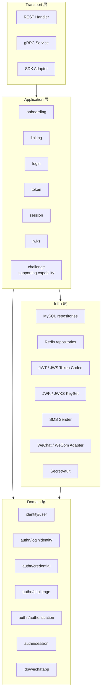

# 08-AuthN 分层架构与事实源索引

## 1. 本文解决什么问题

本文是 `02-认证AuthN` 文档组的收口文档。

前面几篇文档分别说明了：

```text
00-AuthN模型总览-User-LoginIdentity-Credential-Challenge.md
01-Onboarding链路-从身份开通到LoginIdentity与Credential.md
02-Linking链路-登录身份绑定解绑与安全边界.md
03-Login链路-从登录请求到Principal.md
04-Token链路-从Principal到AccessToken与RefreshToken.md
05-Session与Token边界-Principal-Session-AccessToken-RefreshToken.md
06-JWT-JWS-JWK-JWKS边界与KeyRotation.md
07-第三方登录与IDP协作-WeChat-WeCom.md
```

本文不再展开单条链路，而是从 **分层架构** 和 **代码事实源** 的角度统一说明：

1. AuthN 模块整体分层是什么；
2. 每一层负责什么、不负责什么；
3. User、LoginIdentity、Credential、Challenge、Principal、Session、AccessToken、RefreshToken、JWT/JWS/JWK/JWKS 分别落在哪一层；
4. Onboarding、Linking、Login、Token、Session、JWT/JWKS、IDP 的事实源文件在哪里；
5. Challenge 作为短期认证挑战，如何作为 Login / Linking 的支撑能力存在；
6. 读代码、写文档、面试讲解时应如何定位事实源；
7. 如何避免领域模型、应用编排、Infra 实现互相污染。

---

## 2. 核心结论

### 2.1 AuthN 采用“应用层编排 + 领域层建模 + Infra 适配”的分层思路

AuthN 模块的核心不是按 HTTP 接口组织，也不是按数据库表组织，而是按认证语义组织：

```text
User / Principal
LoginIdentity
Credential
Challenge
Session
AccessToken / RefreshToken
JWT / JWS / JWK / JWKS
KeyRotation
```

在代码分层上，推荐理解为：

```text
Transport 层：协议适配
Application 层：用例编排
Domain 层：领域模型与规则
Infra 层：技术实现与外部系统适配
Container / Assembler：依赖装配与能力暴露
```

这与 Ports & Adapters / Hexagonal Architecture 的思想一致：应用核心通过 port 与外部 adapter 通信，从而避免直接依赖 UI、数据库、Redis、JWT library、第三方 IDP SDK 等技术细节。

---

### 2.2 Domain 层是模型事实源

AuthN 的模型事实源主要在 Domain 层：

```text
internal/apiserver/domain/authn/loginidentity
internal/apiserver/domain/authn/credential
internal/apiserver/domain/authn/challenge
internal/apiserver/domain/authn/authentication
internal/apiserver/domain/authn/session
```

Domain 层回答：

```text
这个对象是什么？
这个对象有哪些状态？
这个对象有哪些不变量？
这个认证策略如何判定成功或失败？
Principal 如何表达认证成功后的主体？
Session 如何表达服务端认证上下文？
```

Domain 层不应该关心：

```text
HTTP 请求体
Gin Context
gRPC proto
GORM
Redis
JWT library
JWK / JWKS serialization
微信 / 企业微信 HTTP API 细节
```

---

### 2.3 Application 层是用例事实源

AuthN 的用例事实源在 Application 层：

```text
internal/apiserver/application/authn/onboarding
internal/apiserver/application/authn/linking
internal/apiserver/application/authn/login
internal/apiserver/application/authn/token
internal/apiserver/application/authn/session
internal/apiserver/application/authn/jwks
internal/apiserver/application/authn/challenge
```

Application 层回答：

```text
这条业务用例如何编排？
哪些步骤在事务外执行？
哪些步骤在事务内执行？
调用哪些领域服务或仓储端口？
返回什么应用结果？
失败如何向上表达？
```

Application 层不应该直接承载：

```text
领域对象的不变量
SQL 细节
Redis key 编码细节
JWT 私钥管理
HTTP 参数绑定
```

---

### 2.4 Infra 层是技术事实源

AuthN 的技术事实源在 Infra 层：

```text
internal/apiserver/infra/mysql/loginidentity
internal/apiserver/infra/mysql/credential
internal/apiserver/infra/cache/redis/challenge_repository.go
internal/apiserver/infra/token
internal/apiserver/infra/token/keyset
internal/apiserver/infra/sms
internal/apiserver/infra/idp
```

Infra 层回答：

```text
如何落 MySQL？
如何使用 Redis TTL？
如何签发 JWT/JWS？
如何构造 JWK/JWKS？
如何调用微信 / 企业微信？
如何发送短信？
如何加解密 AppSecret？
```

Infra 层不应该决定：

```text
LoginIdentity 是否属于某个 User
Credential 是否应创建
Challenge 是否代表长期认证材料
AuthZ 是否允许访问资源
```

---

### 2.5 Transport 层只是协议适配层

Transport 层负责：

```text
REST / gRPC request -> Application request / command
Application result -> REST / gRPC response
```

Transport 层不应该绕过 Application 层直接操作 Domain 或 Infra。

---

### 2.6 Challenge 是一级模型，但不是独立主链路文档

Challenge 仍然是 AuthN 的一级模型对象：

```text
internal/apiserver/domain/authn/challenge
```

但在新版 AuthN 文档体系中，Challenge 不再单独作为主链路文档。

它作为短期认证挑战机制，支撑：

```text
Login.phone_otp scene
Linking.link_phone scene
```

因此：

```text
Challenge 是模型事实源；
Challenge 是支撑能力；
Challenge 不是与 Onboarding / Linking / Login / Token 并列的主业务链路文档。
```

---

## 3. AuthN 总体分层图



注意：

```text
Transport 可以依赖 Application；
Application 可以依赖 Domain port 和应用依赖；
Infra 实现 Domain/Application 需要的 port；
Domain 不反向依赖 Application、Transport、Infra。
```

---

## 4. 核心模型事实源

### 4.1 User

| 项 | 内容 |
| --- | --- |
| 模型 | IAM 中的稳定主体 |
| 代码事实源 | `internal/apiserver/domain/identity/user` |
| 主要职责 | 表达主体基本信息与状态 |
| 不负责 | 登录身份、密码哈希、Token、权限 |

User 是 AuthN 的最终主体，但 User 本身属于 Identity 域。

AuthN 使用 User，但不应该把 User 变成登录方式容器。

---

### 4.2 LoginIdentity

| 项 | 内容 |
| --- | --- |
| 模型 | User 绑定的登录身份 |
| 代码事实源 | `internal/apiserver/domain/authn/loginidentity` |
| ProviderKey | `Provider + Realm + Identifier + GlobalIdentifier(optional)` |
| 持久化 | `internal/apiserver/infra/mysql/loginidentity` |
| 数据表 | `auth_login_identities` |

核心规则：

```text
1. Provider + Realm + Identifier 全局唯一。
2. LoginIdentity 只能属于一个 User。
3. 非 active LoginIdentity 不能作为可登录身份使用。
4. GlobalIdentifier 可用于跨 realm 归并外部身份。
```

---

### 4.3 Credential

| 项 | 内容 |
| --- | --- |
| 模型 | IAM 需要保存并校验的长期认证材料 |
| 代码事实源 | `internal/apiserver/domain/authn/credential` |
| 当前主要类型 | password |
| 持久化 | `internal/apiserver/infra/mysql/credential` |
| 数据表 | `auth_credentials` |

核心规则：

```text
1. Credential 必须归属于 LoginIdentity。
2. Credential 不保存 Provider / Realm / Identifier。
3. Credential 不保存 openid / unionid / userid。
4. SMS OTP 不属于 Credential。
5. 第三方 access token 不属于 Credential。
```

---

### 4.4 Challenge

| 项 | 内容 |
| --- | --- |
| 模型 | 短期认证挑战 |
| 代码事实源 | `internal/apiserver/domain/authn/challenge` |
| 应用服务 | `internal/apiserver/application/authn/challenge` |
| 存储实现 | `internal/apiserver/infra/cache/redis/challenge_repository.go` |
| 当前主要类型 | sms_otp |

核心规则：

```text
1. Challenge 有 scene。
2. Challenge 有 target。
3. Challenge 只保存 secret hash。
4. Challenge 有 TTL。
5. Challenge 校验成功后必须 consume。
```

---

### 4.5 Principal

| 项 | 内容 |
| --- | --- |
| 模型 | 认证成功后的运行时主体表达 |
| 代码事实源 | `internal/apiserver/domain/authn/authentication/principal.go` |
| 产生位置 | AuthStrategy / Authenticator |
| 使用位置 | TokenApplicationService |

Principal 应表达：

```text
UserID
LoginIdentityID
TenantID
AuthMethod
Realm
AMR
Claims
```

Principal 不是 JWT。

JWT 是 Token 层对 Principal 的安全表达。

---

### 4.6 Session

| 项 | 内容 |
| --- | --- |
| 模型 | 服务端认证会话上下文 |
| 代码事实源 | `internal/apiserver/domain/authn/session` |
| 应用服务 | `internal/apiserver/application/authn/session` |
| 主要职责 | 管理认证状态、refresh 生命周期、logout、revoke、recent authentication |

Session 不是 AccessToken。

Session 是服务端状态。

---

### 4.7 Token / Session / JWT / JWK / JWKS

| 项 | 内容 |
| --- | --- |
| Token 应用服务 | `internal/apiserver/application/authn/token` |
| Session 应用服务 | `internal/apiserver/application/authn/session` |
| JWKS 应用服务 | `internal/apiserver/application/authn/jwks` |
| Token Infra | `internal/apiserver/infra/token` |
| KeySet Infra | `internal/apiserver/infra/token/keyset` |
| 数据表 | `auth_token_audit`, `jwks_keys` |

核心规则：

```text
1. Login 产出 Principal。
2. Token 链路把 Principal 转换为 AccessToken / RefreshToken。
3. Session 是服务端认证上下文。
4. AccessToken 通常使用 JWT claims + JWS signature 表达。
5. JWK 是 JSON 密钥对象。
6. JWKS 是公开验签 JWK 集合。
7. KeyRotation 管理 active / grace / retired。
```

公开 JWKS endpoint 是内部 KeyStore 的公钥投影，不是内部 KeyStore 全量导出。

---

## 5. 核心链路事实源

### 5.1 Onboarding

| 项 | 内容 |
| --- | --- |
| 职责 | 首次建立 User + LoginIdentity + Credential(optional) |
| 应用目录 | `internal/apiserver/application/authn/onboarding` |
| 入口 | `LoginIdentityOnboarder.Onboard` |
| 事务边界 | `UnitOfWork.WithinTx` |

关键文件：

| 文件 | 职责 |
| --- | --- |
| `port.go` | Driving Port、request/result 类型 |
| `service.go` | 主编排流程 |
| `request_preparer.go` | 事务外输入准备、外部身份解析 |
| `user_resolver.go` | 解析或创建 User |
| `login_identity_ensurer.go` | 确保 LoginIdentity 存在 |
| `credential_ensurer.go` | 按需确保 Credential |
| `wechat_identity_resolver.go` | 微信小程序身份解析 |

流程：

```text
Prepare -> Resolve User -> Ensure LoginIdentity -> Ensure Credential -> OnboardingResult
```

---

### 5.2 Linking

| 项 | 内容 |
| --- | --- |
| 职责 | 已认证 User 绑定、解绑、查看 LoginIdentity |
| 应用目录 | `internal/apiserver/application/authn/linking` |
| 入口 | `linking.Service` |

关键文件：

| 文件 | 职责 |
| --- | --- |
| `service.go` | Service 接口、依赖、核心 ensureProviderKey |
| `link_phone.go` | 手机号绑定 |
| `link_wechat.go` | 微信小程序绑定 |
| `link_wecom.go` | 企业微信绑定 |
| `list_identities.go` | 登录身份列表 |
| `unlink_identity.go` | 登录身份解绑、最后一个 active identity 保护、recent authentication |
| `service_test.go` | 应用层测试 |

流程：

```text
已认证 User -> prove new identity -> ensure ProviderKey -> create/reuse LoginIdentity
```

解绑流程：

```text
Unlink -> check last active LoginIdentity -> check recent authentication if sensitive -> UpdateStatus(deleted)
```

---

### 5.3 Login

| 项 | 内容 |
| --- | --- |
| 职责 | 认证 LoginIdentity 控制权并产出 Principal |
| 应用目录 | `internal/apiserver/application/authn/login` |
| 入口 | `SignIn.Execute` |
| 领域入口 | `domain/authn/authentication.Authenticator` |

关键文件/目录：

| 文件/目录 | 职责 |
| --- | --- |
| `sign_in.go` | 登录主编排 |
| `types.go` | LoginCommand / SignInResult 等类型 |
| `application/authn/login` | Method 选择、ProofFactory、CredentialRecorder、ReAuthenticate 等登录应用能力 |
| `domain/authn/authentication` | Password / Phone OTP / WeChat / WeCom 等认证策略 |
| `domain/authn/authentication/principal.go` | Principal 模型 |

流程：

```text
LoginCommand -> MethodSelector -> ProofFactory -> Authenticator -> AuthDecision -> CredentialRecorder(optional) -> Principal
```

Token 边界：

```text
Principal -> TokenApplicationService -> TokenPair
```

---

### 5.4 Token

| 项 | 内容 |
| --- | --- |
| 职责 | 将 Principal 转换为 AccessToken / RefreshToken |
| 应用目录 | `internal/apiserver/application/authn/token` |
| Infra | `internal/apiserver/infra/token` |

核心流程：

```text
Principal
  -> Claims mapping
  -> AccessToken signing
  -> RefreshToken generation/store
  -> TokenAudit(optional)
  -> TokenPair
```

重点边界：

```text
Token 是认证结果的访问凭证表达。
Token 不是 Credential。
RefreshToken 不是资源访问凭证。
```

---

### 5.5 Session

| 项 | 内容 |
| --- | --- |
| 职责 | 服务端认证上下文、refresh 生命周期、logout/revoke、recent authentication |
| 应用目录 | `internal/apiserver/application/authn/session` |
| 领域目录 | `internal/apiserver/domain/authn/session` |

核心边界：

```text
Principal 是认证结果。
Session 是服务端认证上下文。
AccessToken 是短期访问凭证。
RefreshToken 是续期凭证。
```

---

### 5.6 JWT / JWS / JWK / JWKS / KeyRotation

| 能力 | 事实源 |
| --- | --- |
| JWKS 应用服务 | `internal/apiserver/application/authn/jwks` |
| Token infra | `internal/apiserver/infra/token` |
| Keyset infra | `internal/apiserver/infra/token/keyset` |
| Key records | `jwks_keys` in migration schema |

核心规则：

```text
JWT = claims representation。
JWS = signed / MACed payload structure。
JWK = JSON key object。
JWKS = JWK set with keys array。
KeyRotation = active / grace / retired lifecycle。
```

验签方必须使用自己的算法白名单，并校验 `alg / kid / kty / use / key_ops` 等边界。

---

### 5.7 Challenge 支撑能力

| 项 | 内容 |
| --- | --- |
| 职责 | 短期认证挑战创建、发送、校验、消费 |
| 应用目录 | `internal/apiserver/application/authn/challenge` |
| 领域目录 | `internal/apiserver/domain/authn/challenge` |
| Redis 实现 | `internal/apiserver/infra/cache/redis/challenge_repository.go` |

关键文件：

| 文件 | 职责 |
| --- | --- |
| `domain/authn/challenge/challenge.go` | Challenge 领域模型 |
| `domain/authn/challenge/type.go` | Challenge 类型 |
| `domain/authn/challenge/repository.go` | Repository Port |
| `application/authn/challenge/service.go` | SMS OTP 应用服务 |
| `infra/cache/redis/challenge_repository.go` | Redis 存储实现 |

流程：

```text
SendSMSOTP -> Create Challenge -> Send SMS -> VerifyAndConsume -> Consume
```

Challenge 支撑：

```text
Login.phone_otp scene
Linking.link_phone scene
```

---

### 5.8 IDP 协作

| 项 | 内容 |
| --- | --- |
| 职责 | 外部身份源 proof 解析与 LoginIdentity 映射 |
| Onboarding | `internal/apiserver/application/authn/onboarding/wechat_identity_resolver.go` |
| Linking | `internal/apiserver/application/authn/linking/link_wechat.go`, `link_wecom.go` |
| Login | `internal/apiserver/domain/authn/authentication` |
| IDP 配置 | `internal/apiserver/domain/idp/wechatapp` |
| IDP adapter | `internal/apiserver/infra/idp` |

核心流程：

```text
external code / auth_code -> IDP adapter -> external identity -> ProviderKey -> LoginIdentity -> Principal
```

---

## 6. Repository / Port 索引

### 6.1 LoginIdentity Repository

Domain Port：

```text
internal/apiserver/domain/authn/loginidentity/repository.go
```

Infra Adapter：

```text
internal/apiserver/infra/mysql/loginidentity
```

核心方法：

```text
Create
GetByID
GetByProviderKey
GetByGlobalIdentifier
ListByUserID
UpdateStatus
```

---

### 6.2 Credential Repository

Domain Port：

```text
internal/apiserver/domain/authn/credential/repository.go
```

Infra Adapter：

```text
internal/apiserver/infra/mysql/credential
```

核心方法：

```text
Create
GetByID
GetByLoginIdentityIDAndType
FindPasswordCredentialByLoginIdentity
UpdateMaterial
UpdateStatus
UpdateAuthState
```

---

### 6.3 Challenge Repository

Domain Port：

```text
internal/apiserver/domain/authn/challenge/repository.go
```

Infra Adapter：

```text
internal/apiserver/infra/cache/redis/challenge_repository.go
```

核心方法：

```text
Create
Get
Consume
Delete
```

---

### 6.4 UnitOfWork

Application Port：

```text
internal/apiserver/application/authn/uow/uow.go
```

用途：

```text
为 Onboarding 等需要多仓储一致写入的用例提供事务边界。
```

当前事务仓储集合包括：

```text
Users
LoginIdentities
Credentials
Profiles
ProfileLinks
```

---

## 7. 数据表事实源

Schema 事实源：

```text
internal/pkg/migration/migrations/000001_init_schema.up.sql
```

AuthN 关键表：

| 表 | 语义 |
| --- | --- |
| `users` | IAM User 主体，属于 Identity 事实源，但 AuthN 会引用 |
| `auth_login_identities` | User -> LoginIdentity 绑定 |
| `auth_credentials` | LoginIdentity -> Credential |
| `auth_token_audit` | Token 审计记录 |
| `jwks_keys` | JWKS / 签名密钥记录 |
| `idp_wechat_apps` | 微信/企微应用配置与 secret 密文 |

注意：

```text
authz_* 表和 casbin_rule 属于 AuthZ 事实源，不属于 AuthN 事实源。
AuthN 文档不应把 authz_roles / authz_assignments / casbin_rule 当作认证模块数据表索引。
```

---

## 8. Transport 层事实源

Transport 层负责协议适配。

常见位置：

```text
internal/apiserver/transport/rest/authn
internal/apiserver/transport/grpc
```

Transport 层职责：

```text
1. 绑定 HTTP / gRPC 请求。
2. 校验基础请求格式。
3. 转换为 Application command / request。
4. 调用 Application service。
5. 将 Application result 转换为 response DTO。
```

Transport 层不应该：

```text
直接操作 Repository。
直接构造 Credential。
直接签发 JWT。
直接调用外部 IDP 绕过 Application。
```

---

## 9. Container / Assembler 事实源

模块装配通常位于：

```text
internal/apiserver/container/assembler
```

关键事实源：

```text
internal/apiserver/container/assembler/capabilities.go
```

AuthN 装配重点：

```text
1. 创建 Infra 组件：repositories、Redis、IDP adapter、SecretVault、TokenStore。
2. 创建 Domain 组件：Authenticator、SessionManager、PasswordHasher。
3. 创建 Application 服务：Onboarding、Linking、Login、Challenge、Token、Session、JWKS。
4. 暴露 AuthN application capabilities。
5. 暴露 AuthN runtime capabilities，例如 key rotation scheduler。
6. 注入 Transport Handler。
```

装配层是理解依赖关系的重要事实源。

如果不知道某个应用服务实际使用哪个实现，应先查 assembler。

---

## 10. 分层边界规则

### 10.1 Transport 不越过 Application

错误：

```text
REST handler -> MySQL repository
REST handler -> JWT generator
REST handler -> IDP adapter
```

正确：

```text
REST handler -> Application service -> Domain / Infra ports
```

---

### 10.2 Application 不承载领域不变量

Application 可以编排：

```text
先做 A，再做 B，然后事务提交。
```

但领域不变量应在 Domain 中表达：

```text
ProviderKey 是否合法
Credential 是否 locked
LoginIdentity 是否 active
Challenge 是否 consumed / expired
Principal 如何表达认证结果
Session 状态如何变化
```

---

### 10.3 Domain 不依赖 Infra

Domain 不应 import：

```text
gorm
redis
gin
grpc
jwt library
wechat sdk
```

Domain 可以定义 port/interface。

Infra 实现这些 port。

---

### 10.4 Infra 不决定业务语义

Infra 可以处理：

```text
SQL
Redis key
JWK/JWKS serialization
JWT/JWS signing
HTTP client
加解密
```

Infra 不应决定：

```text
LoginIdentity 是否可以绑定
Credential 是否应创建
Challenge 是否代表 Credential
User 是否应被创建
Principal 是否有效
```

这些应由 Application + Domain 决定。

---

## 11. AuthN 与其他模块边界

### 11.1 AuthN 与 Identity

Identity 负责：

```text
User
Profile
ProfileLink
```

AuthN 负责：

```text
LoginIdentity
Credential
Challenge
Login
Principal
Session
Token
JWT/JWKS
```

AuthN 可以使用 User，但不应把 User 变成登录方式容器。

---

### 11.2 AuthN 与 AuthZ

AuthN 负责：

```text
认证主体是谁？
如何证明？
```

AuthZ 负责：

```text
这个主体能访问什么？
```

推荐边界：

```text
AuthN 产出 Principal。
Token 携带认证上下文。
AuthZ 使用 UserID / Subject + Scope + Role / Permission 做授权判断。
```

不要把权限绑定到 LoginIdentity。

---

### 11.3 AuthN 与 IDP

IDP 模块负责：

```text
微信/企微应用配置
AppSecret 加密材料
外部身份源配置
```

AuthN 使用 IDP：

```text
code2session
企业微信 code 解析
外部身份 proof
```

IDP 不负责签发 IAM Token。

AuthN 不应该把 AppSecret 暴露到 Transport 层。

---

### 11.4 AuthN 与业务系统

IAM 不建业务 Account。

业务系统可以通过：

```text
user_id
tenant_id
role binding
business profile
```

表达业务身份。

例如：

```text
TenantMember(user_id=U1, tenant_id=T1, member_type=operator)
```

不应该在 AuthN 中建：

```text
OperatorAccount
CustomerAccount
DoctorAccount
```

---

## 12. 文档事实源索引

当前 AuthN 文档体系：

| 文档 | 主题 |
| --- | --- |
| `00-AuthN模型总览-User-LoginIdentity-Credential-Challenge.md` | AuthN 总模型 |
| `01-Onboarding链路-从身份开通到LoginIdentity与Credential.md` | 身份首次开通 |
| `02-Linking链路-登录身份绑定解绑与安全边界.md` | 已认证 User 绑定/解绑 LoginIdentity |
| `03-Login链路-从登录请求到Principal.md` | 登录认证与 Principal 生成 |
| `04-Token链路-从Principal到AccessToken与RefreshToken.md` | Principal 到 AccessToken / RefreshToken |
| `05-Session与Token边界-Principal-Session-AccessToken-RefreshToken.md` | Principal、Session、AccessToken、RefreshToken 边界 |
| `06-JWT-JWS-JWK-JWKS边界与KeyRotation.md` | JWT/JWS/JWK/JWKS 与密钥轮换 |
| `07-第三方登录与IDP协作-WeChat-WeCom.md` | 微信/企微外部身份源协作 |
| `08-AuthN分层架构与事实源索引.md` | 分层架构与事实源索引 |

阅读顺序建议：

```text
先读 00，建立 AuthN 总模型；
再读 01/02，理解 LoginIdentity 如何开通、绑定、解绑；
再读 03，理解 Login 如何产出 Principal；
再读 04，理解 Principal 如何转换为 AccessToken / RefreshToken；
再读 05，理解 Principal / Session / AccessToken / RefreshToken 边界；
再读 06，理解 JWT/JWS/JWK/JWKS 与 KeyRotation；
再读 07，理解 WeChat / WeCom 外部 IDP；
最后读 08，回到代码事实源。
```

---

## 13. 代码阅读路线

### 13.1 想理解模型

```text
internal/apiserver/domain/authn/loginidentity
internal/apiserver/domain/authn/credential
internal/apiserver/domain/authn/challenge
internal/apiserver/domain/authn/authentication
internal/apiserver/domain/authn/session
```

---

### 13.2 想理解 Onboarding

```text
internal/apiserver/application/authn/onboarding/port.go
internal/apiserver/application/authn/onboarding/service.go
internal/apiserver/application/authn/onboarding/request_preparer.go
internal/apiserver/application/authn/onboarding/user_resolver.go
internal/apiserver/application/authn/onboarding/login_identity_ensurer.go
internal/apiserver/application/authn/onboarding/credential_ensurer.go
```

---

### 13.3 想理解 Linking

```text
internal/apiserver/application/authn/linking/service.go
internal/apiserver/application/authn/linking/link_phone.go
internal/apiserver/application/authn/linking/link_wechat.go
internal/apiserver/application/authn/linking/link_wecom.go
internal/apiserver/application/authn/linking/unlink_identity.go
internal/apiserver/application/authn/linking/list_identities.go
```

---

### 13.4 想理解 Login

```text
internal/apiserver/application/authn/login/sign_in.go
internal/apiserver/application/authn/login/types.go
internal/apiserver/application/authn/login
internal/apiserver/domain/authn/authentication
internal/apiserver/domain/authn/authentication/principal.go
```

---

### 13.5 想理解 Token

```text
internal/apiserver/application/authn/token
internal/apiserver/infra/token
internal/apiserver/domain/authn/session
```

---

### 13.6 想理解 Session

```text
internal/apiserver/application/authn/session
internal/apiserver/domain/authn/session
```

---

### 13.7 想理解 JWT / JWKS / KeyRotation

```text
internal/apiserver/application/authn/jwks
internal/apiserver/infra/token
internal/apiserver/infra/token/keyset
```

---

### 13.8 想理解 Challenge

```text
internal/apiserver/domain/authn/challenge
internal/apiserver/application/authn/challenge/service.go
internal/apiserver/infra/cache/redis/challenge_repository.go
```

---

### 13.9 想理解 IDP 协作

```text
internal/apiserver/application/authn/onboarding/wechat_identity_resolver.go
internal/apiserver/application/authn/linking/link_wechat.go
internal/apiserver/application/authn/linking/link_wecom.go
internal/apiserver/domain/idp/wechatapp
internal/apiserver/infra/idp
```

---

### 13.10 想理解装配

```text
internal/apiserver/container/assembler
internal/apiserver/container/assembler/capabilities.go
```

---

## 14. 测试事实源索引

测试应覆盖：

```text
领域模型不变量；
应用层链路编排；
Repository 持久化行为；
Redis Challenge 行为；
Token/JWKS 行为；
Assembler 装配行为。
```

建议重点查看：

```text
internal/apiserver/domain/authn/loginidentity/*_test.go
internal/apiserver/application/authn/onboarding/*_test.go
internal/apiserver/application/authn/login/*_test.go
internal/apiserver/application/authn/linking/*_test.go
internal/apiserver/application/authn/challenge/*_test.go
internal/apiserver/application/authn/token/*_test.go
internal/apiserver/application/authn/session/*_test.go
internal/apiserver/application/authn/jwks/*_test.go
internal/apiserver/infra/cache/redis/*challenge*_test.go
internal/apiserver/infra/mysql/credential/*_test.go
internal/apiserver/infra/mysql/uow/authn/*_test.go
```

测试也应该遵循分层：

```text
Domain test 不依赖数据库；
Application test 使用 fake/mock port；
Infra test 验证真实 MySQL/Redis adapter；
Integration test 验证 UoW 和装配链路。
```

---

## 15. 常见坏味道

### 15.1 Transport 直接操作 Repository

坏味道：

```text
handler 直接调用 repo.Create
handler 直接查 LoginIdentity
handler 直接签发 JWT
```

应改为：

```text
handler -> application service
```

---

### 15.2 Domain import Infra

坏味道：

```text
domain/authn/loginidentity import gorm
domain/authn/authentication import redis
domain/authn/credential import jwt library
```

应改为：

```text
Domain 定义 port；Infra 实现 port。
```

---

### 15.3 Credential 重新混入外部身份字段

坏味道：

```text
Credential.Provider
Credential.OpenID
Credential.AppID
Credential.UnionID
```

应改为：

```text
Provider / Realm / Identifier 属于 LoginIdentity。
```

---

### 15.4 Challenge 被当成 Credential

坏味道：

```text
Credential(type=phone_otp)
Credential.Material=短信验证码
```

应改为：

```text
Challenge(type=sms_otp, scene=login/link_phone)
```

---

### 15.5 Token claims 承载过多业务信息

坏味道：

```text
Token 中塞入完整用户资料
Token 中塞入完整权限树
Token 中塞入 Credential 信息
```

应改为：

```text
Token 只承载主体和认证上下文；
业务资料由业务服务查询；
权限由 AuthZ 判断。
```

---

### 15.6 Login 重新吞回 Token 主链路

坏味道：

```text
SignIn 中展开 Refresh / Revoke / TokenAudit / SessionStore 主逻辑；
Login 文档重新写成 Principal + Token + Session 全流程。
```

应改为：

```text
Login 到 Principal 为止；
Token 链路从 Principal 开始。
```

---

### 15.7 Challenge 重新独立成主链路文档

坏味道：

```text
把 Challenge 当成和 Onboarding / Linking / Login / Token 并列的主文档。
```

应改为：

```text
Challenge 是一级模型和支撑能力，服务 Login.phone_otp 与 Linking.link_phone。
```

---

### 15.8 JWKS 直接导出内部 KeyStore

坏味道：

```text
公开 JWKS 返回 private key / symmetric secret；
直接把内部 KeyStore 序列化为 JWKS endpoint 响应。
```

应改为：

```text
JWKS 是 public verification key set 的公开投影。
```

---

## 16. 维护原则

### 16.1 文档跟随代码事实源

如果文档与代码冲突：

```text
优先检查代码事实源；
再修正文档；
必要时补充测试防止语义漂移。
```

---

### 16.2 新增 AuthN 能力时先定位层级

新增能力前先回答：

```text
这是模型能力？ -> Domain
这是用例编排？ -> Application
这是协议适配？ -> Transport
这是技术实现？ -> Infra
这是依赖装配？ -> Container / Assembler
```

例如新增 passkey：

```text
Credential 类型与实体行为 -> Domain
注册 passkey 用例 -> Application
WebAuthn adapter / crypto verify -> Infra
REST/gRPC 接口 -> Transport
依赖注入与能力暴露 -> Container / Assembler
```

---

### 16.3 不把业务账号带回 AuthN

每次出现“账号”一词时要问：

```text
这是业务账号，还是 IAM 登录身份？
```

如果是登录身份，使用：

```text
LoginIdentity
```

如果是业务账号，应放在业务系统、Identity/ProfileLink 或 AuthZ scope/role 中。

---

### 16.4 不把 AuthZ 表当作 AuthN 事实源

AuthN 文档只索引认证相关表。

如果需要讨论 Role、Permission、RoleBinding、PolicyVersion、Casbin runtime facts，应进入：

```text
docs/03-授权AuthZ/*
```

---

## 17. 面试与项目讲解口径

可以这样讲：

> IAM 的 AuthN 模块采用分层架构组织：Transport 层只做 REST/gRPC 协议适配，Application 层负责编排 Onboarding、Linking、Login、Token、Session、JWKS/KeyRotation、Challenge 支撑能力等用例，Domain 层表达 User、LoginIdentity、Credential、Challenge、Principal、Session 等认证模型，Infra 层实现 MySQL、Redis、JWT/JWS、JWK/JWKS、短信、微信/企微 IDP 等技术细节。这样可以把认证语义和技术实现解耦，避免 Handler 直接操作数据库，也避免领域模型依赖 JWT、GORM 或 Redis。

进一步可以补充：

> 这个分层最重要的收益是模型稳定。LoginIdentity 是登录身份绑定，Credential 是长期认证材料，Challenge 是短期认证挑战，Principal 是认证成功后的主体表达。Login 的领域终点是 Principal；Token 链路把 Principal 转换为 AccessToken / RefreshToken；Session 是服务端认证上下文；JWT/JWS/JWK/JWKS 是 Token infra 的安全表达与密钥治理；Challenge 支撑 phone_otp login 和 link_phone linking，但不再作为独立主链路文档。

---

## 18. 外部架构参考

本文采用的分层与依赖边界，与 Ports & Adapters / Hexagonal Architecture 的思想一致：

```text
应用核心通过 port 与外部世界交互；
外部数据库、UI、HTTP、Redis、第三方 API 都是 adapter；
核心逻辑应尽量独立于具体技术实现。
```

这不是为了追求形式，而是为了：

```text
1. 让 AuthN 领域模型不依赖 GORM / Redis / JWT library；
2. 让应用用例可以通过 fake port 测试；
3. 让 MySQL、Redis、JWT/JWS、JWK/JWKS、IDP adapter 可以替换；
4. 让文档和代码都能围绕事实源维护。
```

JWT / JWK / JWKS 相关术语参考 RFC 7517 和 RFC 8725：JWK 是 JSON 格式的密钥对象，JWK Set 是包含 `keys` 数组的一组 JWK；JWT BCP 要求实现方执行算法验证，并确保密钥与算法绑定检查。
