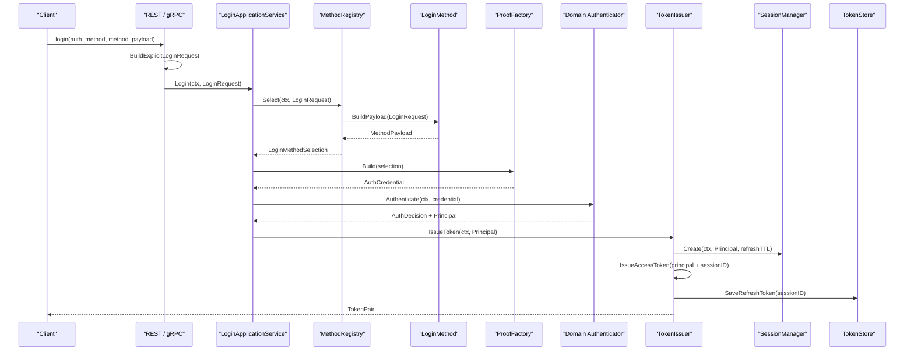
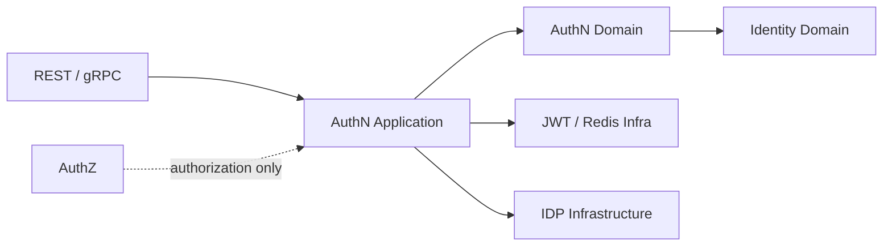

# 02-认证 AuthN

## 本文回答

`02-认证AuthN/` 解释 IAM 的认证体系和登录态管理。

它回答：

1. IAM 如何把 password、phone_otp、wechat、wecom 统一成一次登录；
2. 登录请求如何从 wire payload 变成 application `LoginRequest`；
3. `LoginApplicationService` 如何编排 method 选择、proof 构造、领域认证和 token 签发；
4. `Principal` 如何变成 Session、Access Token、Refresh Token；
5. bearer access token 如何通过 `Reauthenticate` 或 `TokenVerifier` 做在线再验证；
6. User / Account / Session / Token 的边界是什么；
7. JWKS、KeyRotation、本地验签和在线 Verify 如何协作；
8. 微信/企微等第三方登录为什么仍然回到 AuthN 的统一登录态。

本目录只解释认证与登录态。资源权限判定属于 `03-授权AuthZ/`；User/Profile/ProfileLink 建模属于 `04-身份Identity/`；REST/gRPC/SDK 接入方式属于 `05-接入与契约/`。

---

## 30 秒结论

AuthN 负责回答两个问题：

```text
你如何证明你是谁？
这次登录态和 token 当前是否仍然有效？
```

IAM 的登录不是：

```text
查用户表 -> 发 JWT
```

当前登录主链路是：

```text
Login request
  -> LoginRequest
  -> LoginApplicationService.Login
  -> MethodRegistry.Select
  -> ProofFactory.Build
  -> Authenticator.Authenticate
  -> TokenIssuer.IssueToken
  -> Session + Access Token + Refresh Token
```

bearer access token 再验证不再混入登录方式选择：

```text
Access Token
  -> LoginApplicationService.Reauthenticate
  -> ReAuthenticator
  -> TokenVerifier.VerifyAccessToken
  -> AuthResult
```

其中：

| 概念 | 职责 |
| --- | --- |
| LoginRequest | application 登录用例的统一输入，包含 `AuthMethod`、公共上下文和方法专属 payload |
| LoginMethod | 某一种公开登录方式的 payload 校验和规范化 |
| MethodRegistry | 按 `AuthMethod` 选择 `LoginMethod` |
| ProofFactory | 把 method selection 转成领域 `AuthCredential` |
| Authenticator | 按 credential type 调用领域 `AuthStrategy` |
| Principal | 认证成功后的主体快照 |
| TokenIssuer | 创建 Session，签发 access token，保存 refresh token |
| TokenVerifier | 在线验证 access token 的签名、撤销、session 和 subject access |
| IDP | 第三方身份源基础设施，不直接签发 IAM token |

一句话：

> **AuthN 把多种登录方式统一成 Principal，并通过 Session、Access Token、Refresh Token、JWKS 和在线 Verify 管理登录态生命周期。**

---

## 本目录文档

```text
02-认证AuthN/
├── README.md
├── 01-登录链路-从Login请求到Session与Token.md
├── 02-认证语义-用户状态&会话&Token边界.md
├── 03-JWKS与KeyRotation.md
└── 04-第三方登录与IDP协作.md
```

| 文档 | 作用 | 读完后应该能回答 |
| --- | --- | --- |
| `01-登录链路-从Login请求到Session与Token.md` | 解释一次登录如何被编排 | Login request 如何经过 MethodRegistry、ProofFactory、Authenticator、TokenIssuer |
| `02-认证语义-用户状态&会话&Token边界.md` | 解释认证对象边界 | Account/User/Session/Access Token/Refresh Token 的职责和状态变化 |
| `03-JWKS与KeyRotation.md` | 解释 JWT 验签和密钥轮换 | JWKS、本地验签、`kid`、active/grace/retired key 如何工作 |
| `04-第三方登录与IDP协作.md` | 解释微信/企微登录如何融入 AuthN | IDP 为什么只提供身份源基础设施，IAM token 为什么仍由 AuthN 签发 |

---

## AuthN 知识地图

```mermaid
flowchart TD
    AuthN["02-认证 AuthN"]

    Login["01 登录链路"]
    Semantics["02 认证语义"]
    JWKS["03 JWKS 与 KeyRotation"]
    IDPDoc["04 第三方登录与 IDP 协作"]

    AuthN --> Login
    AuthN --> Semantics
    AuthN --> JWKS
    AuthN --> IDPDoc

    Login --> Request["LoginRequest"]
    Login --> Method["MethodRegistry / LoginMethod"]
    Login --> Proof["ProofFactory / AuthCredential"]
    Login --> Principal["Principal"]
    Login --> Issuer["TokenIssuer"]
    Login --> Reauth["Reauthenticate"]

    Semantics --> Account["Account"]
    Semantics --> User["User"]
    Semantics --> Session["Session"]
    Semantics --> Token["Access / Refresh Token"]
    Semantics --> Verify["TokenVerifier"]

    JWKS --> JWT["JWT / kid"]
    JWKS --> KeySet["active / grace / retired"]
    JWKS --> LocalVerify["Local Verify"]

    IDPDoc --> Wechat["Wechat Mini"]
    IDPDoc --> Wecom["WeCom"]
    IDPDoc --> SecretVault["SecretVault"]
    IDPDoc --> Binding["OAuth Credential Binding"]
```



---

## AuthN 主链路



这条链路表达的是：

```text
不同登录方式
  -> 统一 LoginRequest
  -> 统一 AuthCredential
  -> 统一 Principal
  -> 统一 Session/Token
```

登录用例只负责编排，不负责：

- 解析 REST/gRPC wire payload；
- 保存账号或用户；
- 直接签 JWT；
- 直接访问 Redis；
- 处理资源授权。

---

## 推荐阅读顺序

### 标准顺序

```text
01-登录链路-从Login请求到Session与Token
  -> 02-认证语义-用户状态&会话&Token边界
  -> 03-JWKS与KeyRotation
  -> 04-第三方登录与IDP协作
```

原因：

1. 先看一次登录如何走完；
2. 再理解 Account、User、Session、Token 的语义边界；
3. 再看 JWT/JWKS/KeyRotation 如何支撑跨服务验签；
4. 最后看微信/企微这种第三方身份源如何接入统一 AuthN。

### 如果你只想理解“登录为什么不是发 JWT”

```text
01-登录链路-从Login请求到Session与Token.md
  -> 02-认证语义-用户状态&会话&Token边界.md
  -> ../07-专题分析/03-为什么AuthN需要Session与RefreshToken.md
```

重点关注：

```text
Principal
Session
Access Token
Refresh Token
Verify
Revoke
```

### 如果你只想理解“业务服务如何验 token”

```text
03-JWKS与KeyRotation.md
  -> 02-认证语义-用户状态&会话&Token边界.md
  -> ../05-接入与契约/03-SDK接入模型.md
  -> ../07-专题分析/04-为什么JWKS与在线Verify要并存.md
```

重点关注：

```text
JWKS local verify
Online Verify
kid
active/grace/retired
revoked marker
session active
user/account status
```

### 如果你只想理解“微信/企微登录”

```text
04-第三方登录与IDP协作.md
  -> 01-登录链路-从Login请求到Session与Token.md
  -> ../07-专题分析/08-为什么IDP只做身份源基础设施.md
```

重点关注：

```text
IDP Repository
SecretVault
IdentityProvider
code exchange
OAuth credential binding
Principal
Session / Token
```

---

## 当前源码入口

| 主题 | 源码入口 |
| --- | --- |
| REST 登录入口 | `internal/apiserver/transport/rest/authn/handler/auth_login.go` |
| REST 请求 DTO | `internal/apiserver/transport/rest/authn/request/auth.go` |
| gRPC 登录入口 | `internal/apiserver/transport/grpc/service/authn/auth_login_service.go` |
| wire payload 兼容映射 | `internal/apiserver/application/authn/login/compatibility/explicit_payload.go` |
| Login application service | `internal/apiserver/application/authn/login/service.go` |
| 登录编排 | `internal/apiserver/application/authn/login/sign_in.go` |
| bearer token 再验证 | `internal/apiserver/application/authn/login/re_authenticate.go` |
| 登录方式注册与选择 | `internal/apiserver/application/authn/login/method/selector.go` |
| 登录方式 payload | `internal/apiserver/application/authn/login/method/` |
| proof 构造工厂 | `internal/apiserver/application/authn/login/proof/factory.go` |
| proof 构造实现 | `internal/apiserver/application/authn/login/proof/` |
| 领域认证入口 | `internal/apiserver/domain/authn/authentication/authenticater.go` |
| token 签发 | `internal/apiserver/application/authn/token/issuer.go` |
| token 在线验证 | `internal/apiserver/application/authn/token/verifier.go` |
| refresh token 轮换 | `internal/apiserver/application/authn/token/refresher.go` |
| AuthN 应用装配 | `internal/apiserver/container/assembler/authn_application_builder.go` |

---

## AuthN 与周边模块边界



边界规则：

| 模块 | 属于 AuthN 吗 | 说明 |
| --- | --- | --- |
| Account | 是 | 登录账号和凭据归属 |
| Credential | 是 | password、phone OTP、OAuth credential 等 |
| Session | 是 | 在线登录态锚点 |
| Access / Refresh Token | 是 | AuthN 登录态凭证 |
| JWKS / KeyRotation | 是 | access token 验签基础设施 |
| User | 否，属于 Identity | AuthN 引用 user 状态，但不拥有 User 生命周期 |
| Profile/ProfileLink | 否，属于 Identity | 解释用户身份归属和当前身份 |
| Role/Permission/Policy | 否，属于 AuthZ | 资源授权不属于 AuthN |
| WechatApp/SecretVault | 否，属于 IDP | AuthN 登录时使用这些基础设施 |

---

## 维护原则

更新 AuthN 文档时，以代码为准：

1. 登录方式入口看 `login/method/`；
2. proof 构造看 `login/proof/`；
3. 登录编排看 `login/sign_in.go`；
4. bearer token 再验证看 `login/re_authenticate.go` 和 `token/verifier.go`；
5. Session、refresh token、access token 生命周期看 `application/authn/token/`；
6. 微信/企微 code exchange 的业务认证判定看 `domain/authn/authentication/auth-wechat-*.go`；
7. IDP 配置、SecretVault、外部 provider 装配看 `container/assembler/idp*.go`。
