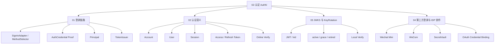
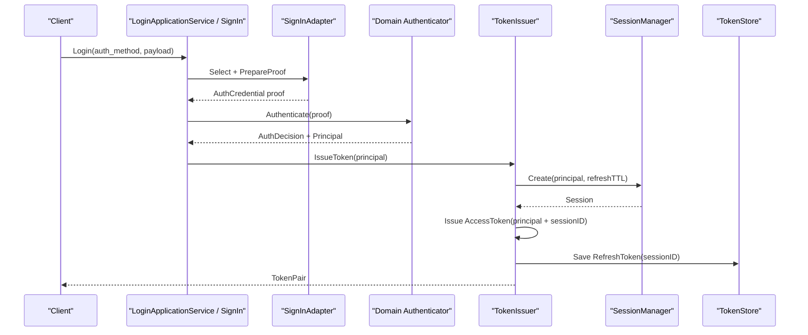
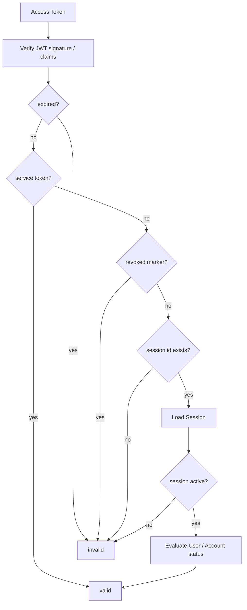

# 02-认证 AuthN

## 本文回答

`02-认证AuthN/` 是 IAM 文档体系中解释 **认证体系与登录态管理** 的模块。

它回答：

1. IAM 如何把不同登录方式统一成一次 SignIn；
2. 登录请求如何从 method payload 变成领域 proof；
3. 认证成功后如何生成 Principal；
4. Principal 如何变成 Session、Access Token、Refresh Token；
5. User / Account / Session / Token 的边界是什么；
6. JWKS、KeyRotation、本地验签和在线 Verify 如何协作；
7. 微信/企微等第三方登录为什么仍然回到 AuthN 的统一登录态；
8. AuthN 与 Identity、IDP、AuthZ、SDK 的边界分别是什么。

本目录只解释 **认证与登录态**。  
资源权限判定属于 `03-授权AuthZ/`；User/Profile/ProfileLink 建模属于 `04-身份Identity/`；REST/gRPC/SDK 接入方式属于 `05-接入与契约/`。

---

## 30 秒结论

AuthN 负责回答两个问题：

```text
你如何证明你是谁？
这次登录态和 token 当前是否仍然有效？
```

IAM 的 AuthN 不是简单：

```text
查用户表 -> 发 JWT
```

而是：

```text
Login request
  -> SignInAdapter / MethodSelector
  -> AuthCredential proof
  -> Authenticator / AuthStrategy
  -> Principal
  -> Session
  -> Access Token
  -> Refresh Token
  -> JWKS / Verify / Revoke / Refresh
```

其中：

| 概念 | 职责 |
| --- | --- |
| Account | 登录账号与凭据归属 |
| User | IAM 内部身份锚点 |
| Principal | 认证成功后的主体快照 |
| Session | 在线登录态锚点 |
| Access Token | 短期访问凭证，当前实现为 JWT |
| Refresh Token | 服务端可控的续期凭证 |
| JWKS | 公钥发布机制，支持业务服务本地验签 |
| Online Verify | 在线状态检查，验证 revoked/session/user/account 状态 |
| IDP | 第三方身份源基础设施，不直接签发 IAM token |

一句话：

> **AuthN 把多种登录方式统一成 Principal，并通过 Session、Access Token、Refresh Token、JWKS 和在线 Verify 管理登录态生命周期。**

---

## 本目录文档

当前 `02-认证AuthN/` 建议包含 4 篇正文文档：

```text
02-认证AuthN/
├── README.md
├── 01-登录链路--从Login请求到Session与Token.md
├── 02-认证语义--用户状态&会话&Token边界.md
├── 03-JWKS与KeyRotation.md
└── 04-第三方登录与IDP协作.md
```

| 文档 | 作用 | 读完后应该能回答 |
| --- | --- | --- |
| `01-登录链路--从Login请求到Session与Token.md` | 解释一次登录如何被编排 | Login request 如何经过 adapter、proof、Authenticator、Principal、TokenIssuer |
| `02-认证语义--用户状态&会话&Token边界.md` | 解释认证对象边界 | Account/User/Session/Access Token/Refresh Token 的职责和状态变化 |
| `03-JWKS与KeyRotation.md` | 解释 JWT 验签和密钥轮换 | JWKS、本地验签、`kid`、active/grace/retired key 如何工作 |
| `04-第三方登录与IDP协作.md` | 解释微信/企微登录如何融入 AuthN | IDP 为什么只提供身份源基础设施，IAM token 为什么仍由 AuthN 签发 |

---

## AuthN 知识地图



---

## 推荐阅读顺序

### 标准顺序

```text
01-登录链路--从Login请求到Session与Token
  -> 02-认证语义--用户状态&会话&Token边界
  -> 03-JWKS与KeyRotation
  -> 04-第三方登录与IDP协作
```

原因：

1. 先看一次登录如何走完；
2. 再理解 Account、User、Session、Token 的语义边界；
3. 再看 JWT/JWKS/KeyRotation 如何支撑跨服务验签；
4. 最后看微信/企微这种第三方身份源如何接入统一 AuthN。

---

### 如果你只想理解“登录为什么不是发 JWT”

推荐路径：

```text
01-登录链路--从Login请求到Session与Token.md
  -> 02-认证语义--用户状态&会话&Token边界.md
  -> ../07-专题分析/03-为什么AuthN需要Session与RefreshToken.md
```

重点关注：

```text
Principal
Session
Access Token
Refresh Token
Verify
Revoke
```

---

### 如果你只想理解“业务服务如何验 token”

推荐路径：

```text
03-JWKS与KeyRotation.md
  -> 02-认证语义--用户状态&会话&Token边界.md
  -> ../05-接入与契约/03-SDK接入模型.md
  -> ../07-专题分析/04-为什么JWKS与在线Verify要并存.md
```

重点关注：

```text
JWKS local verify
Online Verify
kid
active/grace/retired
revoked marker
session active
user/account status
```

---

### 如果你只想理解“微信/企微登录”

推荐路径：

```text
04-第三方登录与IDP协作.md
  -> 01-登录链路--从Login请求到Session与Token.md
  -> ../07-专题分析/08-为什么IDP只做身份源基础设施.md
```

重点关注：

```text
IDP Repository
SecretVault
WechatAuthProvider
code2Session
OAuth credential binding
Principal
Session / Token
```

---

## AuthN 主链路



这条链路表达的是：

```text
不同登录方式
  -> 统一 proof
  -> 统一 Principal
  -> 统一 Session/Token
```

而不是：

```text
每种登录方式各自签一套 token
```

---

## 在线 Verify 主链路



这条链路表达的是：

```text
JWT 验签只是第一步
完整在线 Verify 还要检查 token 是否撤销、session 是否 active、user/account 是否允许访问
```

---

## AuthN 核心概念

| 概念 | 当前职责 | 常见误解 |
| --- | --- | --- |
| Account | 登录账号与凭据归属，例如运营账号、微信账号、企微账号 | 误以为 Account 等于 User |
| User | IAM 内部身份锚点，参与 Principal、Session、AuthZ subject | 误以为 User 直接承载所有登录凭据 |
| Principal | 认证成功后的主体快照，包含 UserID、AccountID、TenantID、AMR、claims | 误以为 Principal 是数据库实体 |
| Session | 在线登录态锚点，Access/Refresh 都绑定 Session | 误以为 JWT 自己就是完整登录态 |
| Access Token | 短期访问凭证，当前实现为 JWT | 误以为它应该长期有效 |
| Refresh Token | 服务端保存、可撤销、可轮换的续期凭证 | 误以为它也是无状态 JWT |
| JWKS | 公钥集合发布，用于业务服务本地验签 | 误以为 JWKS 能证明用户当前仍有效 |
| Online Verify | 在线认证状态判断 | 误以为只是远程 parse JWT |
| Service Token | 服务身份凭证 | 误以为它和用户 token 一样走 user session |
| IDP | 外部身份源基础设施 | 误以为 IDP 直接登录并发 IAM token |

---

## AuthN 与其他模块的关系

| 模块 | 关系 |
| --- | --- |
| Identity | AuthN 使用 UserID 作为身份锚点；Verify 会检查 User 状态；User block 可影响 Session |
| IDP | AuthN 借用 IDP 的 WechatApp、SecretVault、WechatAuthProvider 完成第三方 proof 准备 |
| AuthZ | AuthN 证明“你是谁”，AuthZ 判断“你能做什么” |
| REST | REST 提供 Login、Refresh、Logout、Verify、JWKS、Account 等 HTTP 接入 |
| gRPC | gRPC 提供 VerifyToken、RefreshToken、RevokeToken、IssueServiceToken、JWKS 等服务间能力 |
| SDK | SDK 封装 LoginV2、Auth client、JWKSManager、TokenVerifier、ServiceAuthHelper |
| CacheGovernance | AuthN 暴露 token/session/OTP/JWKS cache inspectors |
| Outbox/EventBus | AuthN 可通过 EventPublisher/EventBus 参与认证相关事件或未来扩展 |

---

## 代码证据入口

| 主题 | 代码入口 |
| --- | --- |
| AuthN module 装配 | `internal/apiserver/container/assembler/authn.go` |
| AuthN infra builder | `internal/apiserver/container/assembler/authn_infra_builder.go` |
| AuthN domain builder | `internal/apiserver/container/assembler/authn_domain_builder.go` |
| AuthN application builder | `internal/apiserver/container/assembler/authn_application_builder.go` |
| Login application service | `internal/apiserver/application/authn/login/services_impl.go` |
| SignIn 编排 | `internal/apiserver/application/authn/login/sign_in.go` |
| SignIn adapters | `internal/apiserver/application/authn/login/adapter_*.go` |
| Authenticator / strategy | `internal/apiserver/domain/authn/authentication` |
| Token issuer | `internal/apiserver/application/authn/token/issuer.go` |
| Token verifier | `internal/apiserver/application/authn/token/verifier.go` |
| Token refresher | `internal/apiserver/application/authn/token/refresher.go` |
| Session domain | `internal/apiserver/domain/authn/session` |
| Redis token/session store | `internal/apiserver/infra/cache/redis` |
| JWT generator | `internal/apiserver/infra/token/jwt` |
| JWKS / keyset | `internal/apiserver/infra/token/keyset` |
| JWKS REST handler | `internal/apiserver/transport/rest/authn/handler/jwks_public.go` |
| WeChat Mini adapter | `internal/apiserver/application/authn/login/adapter_wechat_mini.go` |
| WeCom adapter | `internal/apiserver/application/authn/login/adapter_wecom.go` |
| IDP module | `internal/apiserver/container/assembler/idp.go` |
| SDK auth | `pkg/sdk/auth` |

---

## 事实源优先级

AuthN 相关事实冲突时，按以下顺序判断：

1. **源码运行行为**  
   `internal/apiserver/application/authn`、`domain/authn`、`infra/token`、`infra/cache/redis`。

2. **REST/gRPC/SDK 机器契约**  
   `api/rest/authn.v2.yaml`、`api/grpc/iam/authn/v2/authn.proto`、`pkg/sdk/auth`。

3. **架构与契约测试**  
   `internal/pkg/architecture`、REST/gRPC contract tests、SDK public API compile test。

4. **当前维护文档**  
   `docs/02-认证AuthN`、`docs/05-接入与契约`、`docs/07-专题分析`、`docs/08-宣讲`。

5. **历史归档材料**  
   `_archive/` 只用于历史追溯，不作为当前事实源。

---

## 与专题分析、宣讲文档的关系

### 事实层

`02-认证AuthN/` 是事实层，回答：

```text
当前源码如何实现 AuthN
当前链路如何运行
当前边界是什么
```

### 专题分析层

`07-专题分析/` 回答：

```text
为什么 AuthN 需要 Session 与 RefreshToken
为什么 JWKS 与在线 Verify 要并存
为什么 IDP 只做身份源基础设施
```

推荐阅读：

```text
../07-专题分析/03-为什么AuthN需要Session与RefreshToken.md
../07-专题分析/04-为什么JWKS与在线Verify要并存.md
../07-专题分析/08-为什么IDP只做身份源基础设施.md
```

### 宣讲层

`08-宣讲/` 回答：

```text
如何把 AuthN 讲给别人听
如何准备面试追问
如何组织 30 分钟技术分享
```

推荐阅读：

```text
../08-宣讲/03-AuthN认证体系讲法.md
../08-宣讲/07-JWKS与Token安全讲法.md
../08-宣讲/06-IDP与第三方登录讲法.md
../08-宣讲/13-面试追问证据索引.md
```

---

## 常见误区

### 误区一：AuthN = JWT 登录

错误。  
JWT 只是 Access Token 的实现方式。完整 AuthN 包括：

```text
登录方式选择
proof 准备
Authenticator
Principal
Session
Access Token
Refresh Token
Verify
Revoke
JWKS
KeyRotation
```

---

### 误区二：Refresh Token 也是长期 JWT

当前不是。  
Refresh Token 是服务端保存的随机凭证，绑定 Session，可删除、可轮换、可撤销。

---

### 误区三：JWKS 验签通过 = 用户当前有效

错误。  
JWKS 只证明 token 签名可信。  
用户是否被 block、账号是否 disabled、Session 是否 revoked，需要在线 Verify 判断。

---

### 误区四：IDP 登录成功就等于 IAM 登录成功

错误。  
微信 `code2Session` 只能证明外部身份源身份。  
IAM 登录成功还需要账号绑定、Principal、Session、TokenIssuer。

---

### 误区五：AuthN 应该判断用户能不能访问资源

错误。  
AuthN 证明身份，AuthZ 判断访问权。  
资源级权限判定应该进入 `03-授权AuthZ/`。

---

## 验证建议

修改 AuthN 文档或相关代码后，建议运行：

```bash
make docs-hygiene
```

AuthN 应用与领域测试：

```bash
go test ./internal/apiserver/application/authn/... \
  ./internal/apiserver/domain/authn/...
```

Token / Redis / JWKS 相关：

```bash
go test ./internal/apiserver/infra/token/... \
  ./internal/apiserver/infra/cache/redis
```

REST/gRPC 接入相关：

```bash
go test ./internal/apiserver/transport/rest/authn \
  ./internal/apiserver/transport/grpc/service/authn
```

SDK 认证接入相关：

```bash
go test ./pkg/sdk/auth/...
```

架构边界相关：

```bash
go test ./internal/pkg/architecture
```

---

## 维护规则

### 1. README 只做 AuthN 模块入口

本 README 负责：

```text
说明 AuthN 模块回答什么
列出四篇正文
提供阅读路径
提供术语表和证据入口
说明和专题/宣讲/接入文档的关系
```

详细链路放到对应正文。

---

### 2. 不把 AuthZ 问题写进 AuthN

AuthN 不负责：

```text
Role
Resource
Permission
RoleBinding
AuthZ Check
PolicyVersion
Outbox 授权版本传播
```

这些属于 `03-授权AuthZ/`。

---

### 3. 不把 IDP 写成登录态所有者

IDP 负责：

```text
WechatApp
SecretVault
WeChat / WeCom API
provider token
```

AuthN 负责：

```text
Account binding
Principal
Session
Access Token
Refresh Token
Verify/Revoke
```

---

### 4. 不把 JWKS 写成完整在线认证

JWKS 是公钥分发和本地验签。  
在线认证状态必须回到 Verify。

---

### 5. 不恢复旧路径和旧术语

当前 token/JWKS 相关路径以当前源码为准，例如：

```text
internal/apiserver/application/authn/token
internal/apiserver/application/authn/jwks
internal/apiserver/infra/token/jwt
internal/apiserver/infra/token/keyset
```

不要恢复旧的：

```text
internal/apiserver/domain/authn/token
internal/apiserver/domain/authn/jwks
internal/apiserver/infra/jwt
```

---

## 本文总结

`02-认证AuthN/` 解释的是 IAM 如何处理认证和登录态。

核心心智是：

```text
AuthN 不只是登录接口
AuthN 不只是 JWT
AuthN 不直接判断资源权限
AuthN 不让 IDP 直接签发 IAM token
```

它的主线是：

```text
Login request
  -> SignInAdapter
  -> AuthCredential proof
  -> Authenticator
  -> Principal
  -> Session
  -> Access Token
  -> Refresh Token
  -> JWKS / Verify / Revoke / Refresh
```

读完本目录后，读者应该能回答：

```text
一次登录如何完成？
为什么需要 Session？
为什么需要 Refresh Token？
为什么 JWKS 与在线 Verify 要并存？
User/Account/Session/Token 边界是什么？
微信/企微登录如何接入 AuthN？
业务服务应该如何验证 token？
```

如果只记一句话：

> **AuthN 负责把多种登录方式统一成 Principal，并用 Session、Access Token、Refresh Token、JWKS 和在线 Verify 管理登录态生命周期。**
