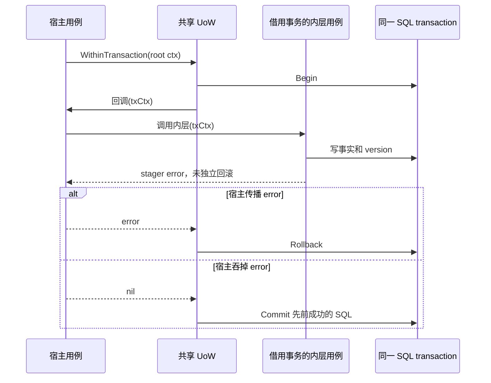

# MySQL 事务与迁移：提交者、连接传播和失败断点

> 状态：已实现 · 按当前组合根、GORM 1.30.0 与 golang-migrate 4.19.1 核对。仓库有 38 对 up/down 脚本，版本区间 000001–000040，缺号 000004/000010；最新版本为 40。目标库的版本、物理结构与执行结果须独立取证。

## 1. 先确定哪一次提交由谁负责

IAM 的本地事务覆盖**使用同一个 SQL transaction 的写入**。应用用例决定把哪些事实放进去，模块 UoW 提供所需仓储，数据库约束或锁裁决并发。普通顶层调用由共享 UoW 提交；携带共享 `txCtx` 的调用借用宿主事务，返回成功只表示回调成功，最终提交仍属于宿主。

例如注册写 User、LoginIdentity、Credential；授权写事实、PolicyVersion、标准 Outbox 意图；停用用户写 status 与 Session 吊销任务。这些组合有明确的本地提交边界。外部证明消费、Redis Session、私钥文件、进程内快照及消息投递有各自生命周期，不能从本地 commit 推导它们也已完成。

本文拥有事务传播、仓储连接选择、数据库保护与迁移执行机制。具体业务规则由 [SignUp](../02-业务模块/02-AuthN/02-注册登录与身份绑定.md)、[AuthZ 写入](../02-业务模块/03-AuthZ/03-关键链路-授权写入与受管Assignment.md)、[Identity 协作](../02-业务模块/01-Identity/04-模块边界-Identity与AuthN-AuthZ-Suggest.md)维护；部署、备份、停写和恢复操作归 [数据库运维](../05-工程质量与运维/03-迁移发布与数据库运维.md)。

## 2. 共享 UoW 有两条执行分支

[`pkg/uow/gorm/uow.go`](../../pkg/uow/gorm/uow.go)提供 `WithinTransaction`、`TxFromContext`、`RequireTx`、`AfterCommit`。IAM 内部包是其别名与适配入口。

| 输入 | 实际执行 | 返回的含义 |
| --- | --- | --- |
| 根 DB，ctx 无共享事务 | `db.WithContext(ctx).Transaction`，把 tx/state 放进新 txCtx | 回调与 GORM 提交都成功时返回 nil |
| ctx 已携带共享事务 | 直接 `fn(ctx)`，Required 传播 | 没有新 commit/rollback、保存点或 rollback-only 标记；宿主决定结算 |
| 非空回调、UoW/基础 DB 不可用 | 返回 unavailable，不执行回调 | 即使 ctx 有事务，也先经过基础 DB 检查 |
| nil 回调 | 直接返回 nil | 没有验证可用数据库或执行提交 |

顶层仅采用第一份 `TxOptions` 的 ReadOnly/Isolation；Name 未进入 SQL 选项。Required 分支不重新应用内层选项。当前实现不验证 carrier 与该 UoW 的 DB 是否属于同一数据库，也不探测其中的 tx 是否已经结束；`RequireTx` 成功只是取得句柄。已结束的事务会在实际 SQL 操作处失败。因此 txCtx 应限于同步用例调用栈，不能作为可跨请求保存的事务凭据。

### 2.1 内层错误必须交回提交者

设内层授权回调已经写 Assignment、递增 version，随后 stager 报错。Required 原样返回这个错误；若宿主忽略错误并最终返回 nil，先前成功的 SQL 仍可能被提交，已注册 hook 也仍留在共享 state。共享 UoW 没有替宿主撤销内层部分修改。

下面是现有传播合同的源码推演，当前测试没有覆盖宿主吞错情形：

若某个内层动作必须允许失败后继续，需显式设计保存点或独立事务及其不变量。仅把调用套进另一层 `WithinTx` 不会获得这种隔离。

### 2.2 AfterCommit 的适用条件

在标准“根 DB + 共享 carrier 嵌套”路径，hooks 在顶层 GORM Transaction 成功返回之后按登记顺序同步执行。hook 收到原外层 ctx，可能已被取消；普通 hook error 只记 warning，后续 hooks 继续，UoW 仍返回 nil。没有持久重试、超时或 panic 隔离；进程在 commit 与 hook 间退出也会丢失该次执行。需要可恢复的传播意图应写同事务 Outbox。

还有一个通用能力的限制：若调用者把**裸 GORM 外层事务**作为 `NewUnitOfWork(db)` 的基础 DB，却未提供共享 carrier，GORM 1.30.0 会识别已有 SQL transaction；默认创建保存点，DisableNestedTransaction=true时省略保存点。两种情况下它返回 nil 时物理 commit 仍属于裸外层，但共享 UoW 已开始执行 hooks。因此名称不能独立证明“最外层实际提交”。标准组合根使用根 DB；当前生产应用没有注册这些 hooks。裸事务基座、hook 失败/取消及提交结果未知均未由本篇回归验证。

## 3. 仓储通过两种机制加入事务

| 实例 | 没有 carrier 时 | 有 txCtx 时 | 需要审查的地方 |
| --- | --- | --- | --- |
| module UoW 中 `NewRepository(tx)` | 构造时句柄已经是 tx | Base 优先选 carrier 中的 tx | 误传外层ctx会丢失carrier，后续根DB仓储或新UoW无法据此复用；该实例仍可能使用tx |
| 组合根中 `NewRepository(rootDB)`，方法经过 Base.WithContext | 使用根 DB | 改用 carrier 中的 tx | 这类共享实例需沿用 txCtx |
| 直接调用 `r.db.WithContext` 的仓储方法 | 使用构造时句柄 | 仍使用构造时句柄 | context 本身不会让 GORM 自动认识 IAM carrier |
| StandardStager | 缺少共享 tx 则拒绝 | RequireTx 后借用原 SQL transaction | txCtx、MySQL dialect 与支持的 transaction wrapper 都必须满足 |

[`BaseRepository.WithContext`](../../internal/pkg/database/mysql/base.go)优先使用 carrier，否则使用 `r.db`。所以“误传外层 context 一定退回普通连接”过于绝对。真实逃逸案例是：在共享事务内重新使用根 DB 构造的普通仓储，却传入原 ctx；或者调用直接使用根 `r.db`、未读取 carrier 的方法。

AuthZ 的四类仓储与 PolicyVersions 明确绑定 tx；SubjectResolver 和 Events 复用原实例，前者需检查真实仓储路由，后者需 txCtx。PolicyVersion 仓储直接使用 `r.db.WithContext`，它的事务参与依靠构造绑定。模块 UoW 的端口集合收窄了用例依赖，但没有创建跨数据库协调能力。

`CreateAndSync` 等方法在 SQL 成功后立即回填实体 ID/时间；后续事务回滚不会回滚 Go 对象。调用方应先检查整笔事务结果再交付这些对象。GORM 顶层 Transaction 在回调 error、panic 或 commit error 时尝试 rollback；panic 继续传播，rollback 的返回错误未在该包装中合并。遇到 commit error 时应核对持久事实，不能据错误推定一定未提交，也不能无条件重放会消费外部证明的用例。

## 4. 三个模块分别组合哪些持久事实

| 模块 | 事务端口 | 当前组合与边界 |
| --- | --- | --- |
| Identity | Users / Profiles / ProfileLinks / SessionRevocations | User 状态与撤销任务可同事务写入；Profile 与关系组合按实际用例编排，不以端口列表推定每次都修改全部对象 |
| AuthN | Users / LoginIdentities / Credentials / Profiles / ProfileLinks | 当前 SignUp 使用前三个；先 Prepare 外部证明，再进入自身 WithinTx；借用外层时 Prepare 仍可能发生在宿主事务期间 |
| AuthZ | Roles / Resources / Assignments / PermissionGrants / PolicyVersions / SubjectResolver / Events | 修改管理事实、version 与事件意图；无变化分支和依赖拒绝按各用例处理 |

停用 User 的事务成功保存**清理意图**后，worker 才尝试 Redis 撤销。在线 Admission 与后台清理的时序、旧任务去重和重新激活限制见 [Identity 边界](../02-业务模块/01-Identity/04-模块边界-Identity与AuthN-AuthZ-Suggest.md)。同库事务不提供对在途请求的持续 fencing。

AuthZ 标准装配使用 `StandardStager`，其 `Stage` 从 txCtx 取得原 GORM/SQL transaction，追加业务库中的 `rm_outbox`，不另开、提交或回滚事务。宿主负责在 Append 失败时传播错误。内存 stager 或历史 `BootstrapStager` 的通过结果不能证明这条标准表路径，详见 [事件机制](03-事件与Transactional-Outbox.md)。

Role、Resource、PermissionGrant、Assignment 写服务均在 WithinTx 返回成功后直接尝试 runtime reload，没有注册 AfterCommit。普通顶层此时已提交；Required 借用时，reload 可先于宿主 commit，当前 MySQLSource 从根 DB 另开只读 Repeatable Read 事务，可能读取旧事实。reload 最多尝试三次后吞掉普通错误，授权事实不随之回滚。数据库提交、本机快照覆盖和其他实例覆盖应分别报告。

## 5. 不变量必须写出数据库实际谓词

两次预检查可以都读到“未占用”。友好错误检查与最终并发裁决需要分别定位；名为 active 的列尤其不能直接解释成 `status=active`。

| 数据库保护 | 精确范围 | 不能据此推导 |
| --- | --- | --- |
| 000017 `users.active_phone` 生成列 + unique | deleted_at IS NULL 且 phone 非 NULL/非空；不检查 User status | blocked/deactivated 仍占号；它不等于“可登录用户手机号唯一” |
| 000007 `profile_links.self_key` nullable 普通列 + unique | 索引约束非 NULL 的 self_key；mapper 按 self 且未 revoked 设置 UserID | 原始 SQL 改 Type/RevokedAt 不会自动重算；没有 Profile 方向独占认领 |
| 000016 `jwks_keys.active_guard` 生成列 + unique | status=1 时 guard=1，其余 NULL | 只保证至多一个 active；不保证一定有一个、时间有效或 PEM 可用 |
| 000036 Assignment composite unique | subject_type / subject_id / role_id / org_id / active_guard | 构造器不查重复；跨公司允许；列不保证组织或门店业务归属 |
| LoginIdentity provider key / global identifier 索引 | 登录入口键与 canonical 键按迁移定义裁决 | status 删除不等于释放全部历史键；冲突复用还需检查 owner |

ProfileLink 的 self_key 依赖 writer/mapper 维护；000007 首段历史归一 SQL 的被更新行也未限定 active self，不能把注释当作精确数据范围。当前建立、恢复和撤销规则由 [ProfileLink 主文](../02-业务模块/01-Identity/03-关键链路-建立与撤销ProfileLink.md)维护。

Base 的 duplicate translator 仅在对应 helper/显式调用处生效，不覆盖任意 raw Updates/Exec、读取、死锁或 commit error。`IsDuplicateError`识别驱动 1062 等，也有宽泛的错误文本匹配；它不精确区分每个索引。User 的通用重复映射可能把手机号冲突报成 UserAlreadyExists，SignUp 步骤还会包装为 ErrDatabase；repository 分类和底层 cause 保留需继续追踪应用 caller，不能承诺所有约束都有专属、稳定的领域分类。

## 6. 仓储原子动作与用例事务各有责任

“不可解绑最后一个 active 登录入口”是集合不变量。`UnlinkOwnedUnlessLastActive`在 MySQL 对该 User 的身份集合按固定顺序 `FOR UPDATE`，计数、canonical 转移及目标 status 更新在同一仓储事务中执行。它统计 status=active，不核验每个剩余入口的 Credential、provider 或 User 可用性，也没有锁住 User 的停用事实。详细失败分支归 [Linking](../02-业务模块/02-AuthN/03-关键链路-Linking登录身份绑定.md)。

原子仓储方法可以自行开事务来保护一个端口动作，跨仓储用例则由应用 UoW 编排。这两种边界同时存在。Credential 失败计数和 Unlink 直接使用构造时的 `r.db.Transaction`；如果实例已绑定 tx，GORM可走保存点；如果是根 DB，就不因 ctx 有 IAM carrier 自动加入它。JWKS Activate 也直接使用根 `DB().Transaction`，标准路径的激活独立提交，而普通 CRUD 可以识别 carrier。调用这些方法前需查实例来源与方法体，不能把所有 repository 都当作同一种 Required 传播。

删除合同也按操作区分：AuditFields.DeletedAt 是普通 `*time.Time`，不会自动启用 GORM 软删过滤。普通 Assignment Delete 产生物理 DELETE；runtime 加载显式过滤 deleted_at；Scope 维护补偿显式更新 deleted_at/deleted_by；Grant/ProfileLink 撤销另有 RevokedAt。字段存在、唯一 guard、审计历史和读取过滤分别核对。

## 7. 启动迁移还包含首次空库准备

`DatabaseManager.Initialize`初始化业务 GORM/Redis registry 后执行 runMigrations。迁移关闭、MySQL 获取失败或 nil 时，下层直接跳过，没有读取 release/degraded 条件；完整标准 Prepare 后续还有可靠消息和模块门禁。初始化阶段的 nil 返回不能独立证明服务可用，详见 [启动组合根](../01-运行时/01-启动与组合根.md)。

可执行迁移时，先 ensureDatabase，再创建独立 `sql.DB`、Ping、运行嵌入脚本，避免 migrator.Close 关闭业务 GORM pool。迁移连接启用 multiStatements、固定 UTC+8，会单独占用连接额度；Run/RunTo不接收ctx，IAM未设置driver StatementTimeout，脚本使用Background。pool数量、连接寿命和GET_LOCK的10秒等待都没有提供整条迁移的截止时间。

创建migrate driver时会先ensureVersionTable，可能创建schema_migrations，随后才进入IAM的dirty/no-change判断，所以一次“没有新migration”调用也不能概括为只读。正常Close会关闭传入sql.DB，这不是借用宿主pool的接口。driver从pool借到专用Conn后若初始化失败，锁定版本未在该失败支路显式归还Conn，createMigrate也没有成功实例可Close；外层DB.Close不能替代该借用Conn的归还合同。本篇只登记源码资源窗口，未故障注入。

这里有两个数据库名称输入：DSN 使用 `mysql.database`；ensureDatabase 与驱动 DatabaseName/迁移 advisory lock 使用 `migration.database`。MigrationOptions.Validate 没有相等校验，驱动也不据非空 DatabaseName 切换连接的默认库。因此需先核对两者及实际 `DATABASE()` 一致，不能靠 typed config 或日志中的名称确认目标。

| 起点 | Run 的路径 | 准备事实 |
| --- | --- | --- |
| version=0，配置 FreshStages，除 journal 外无表 | Migrate(31) → prepare；Migrate(33) → prepare；Migrate(35) → prepare；Up 最新 | 空库证明只在这次 Run 开始做；31准备旧授权租户基线，33独立角色/bootstrap DML，35条件退役准备 |
| version=0，但存在其他表且配置 stages | 拒绝 fresh bootstrap | 不按“没有 journal”猜测是新库 |
| 已有非零 version | 跳过全部 FreshStages，直接 Up | 既有环境需事先完成相应维护/回执条件 |
| clean 最新版本 | ErrNoChange 后重新读当前 version | 只表示源中没有更高 migration，未重新验证全部表/数据 |

`configs/mysql/bootstrap.sql`含基线 DML，不含 DDL。手工重放要求当前完整链，但真实空库启动已在33阶段执行它；重放也会覆盖固定 User 的资料/status并清除 deleted_at，幂等不能理解为无副作用。历史物理起点的覆盖缺口见 [Identity 迁移索引](../02-业务模块/01-Identity/05-分层架构与代码索引.md#52-一个未被当前-fixture-覆盖的历史起点)。

## 8. Dirty、准备失败与返回值是三个问题

锁与 journal 合同以锁定的 golang-migrate 4.19.1 为准：MySQL driver 以 DatabaseName/表名生成 advisory lock key，`GET_LOCK(...,10)`尝试互斥；每次 Up/Migrate 在该锁中检查 version/dirty、执行选定脚本。它不锁住一般业务 writer，也不替发布控制旧实例写入。

单版本执行顺序是“写目标 version+dirty → 执行整份 SQL → 写 clean”。前后 journal 更新各有自己的 SQL transaction；脚本体是一次 multiStatements ExecContext，没有被 driver 包成一份覆盖所有 DDL/DML 的事务。已完成的前序版本、DDL 或某条 DML 可能保留。

| 失败位置 | 可能保留什么 | 下一步依据 |
| --- | --- | --- |
| SQL body / clean journal 更新失败 | 目标 dirty、此前版本与部分物理变化；clean 标记失败时 body 也可能已执行完 | 保存 journal/结构/数据/错误，再选择完成前进或恢复 |
| FreshStage 的 prepare 失败 | 该 stage 的 schema 已 clean；准备事务按自身合同结算 | 重启时非零起点跳过 stages，需核对准备/receipt 断点 |
| Up 成功后读取新 version 失败 | schema 可能已推进，Run 返回错误 | 重读实际目标，不猜回滚 |
| 事务 commit 或命令交付失败 | 持久事实与返回结果可能不一致 | 用已绑定目标的事实/receipt 判定，避免盲目重跑 |

FreshStage 的 prepare 在 `Migrate(stage)`返回并释放该次 advisory lock后运行，使用业务 GORM 连接；不同 stage 调用也各有锁边界。它们没有共用整条 fresh 链的事务或排他锁。标准启动应由单一迁移 owner 执行。这里有三个具体源码窗口，本篇均未做故障/并发实验：

- 31阶段 `PrepareBootstrapTenant` 虽写在 GORM Transaction 内，却先做 DML，再执行普通 `CREATE TABLE`，最后写 marker。MySQL 的[隐式提交规则](https://dev.mysql.com/doc/refman/8.0/en/implicit-commit.html)使前序变更可能在 marker/最终提交失败时已持久化，不能套用纯 DML 用例的全回滚合同。
- 33阶段先提交独立角色数据、事件与 applied receipt，再调用 ArchiveInheritance。归档失败可留下 clean33和applied事实；重启跳过准备，到34的archive gate仍可能失败并留下dirty34。
- 两个runner都先在锁外看到version0/空库，A已推进40，B随后调用通用 `Migrate(31)`。该接口在锁内读取当前版本后允许向下走；38–40空表条件允许时可先执行部分down，再在不可逆步骤拒绝。单次锁并未将“空库判定＋整条准备链”串行化。

`Run`在普通 Up error 分支返回 `(versionBefore, false, error)`，即使前面已成功应用若干版本；因此 `applied=false`不能证明零写入。dirty记录的是migration的TargetVersion：向上尝试19会记dirty19，向下执行19脚本、目标18时会先记dirty18。它不能单独定位失败SQL或已完成物理结构。IAM没有提供自动Force或显式Down入口；RunTo的方向检查和FreshStages仍调用可双向Migrate，不能据封装名称推导并发下绝不退回。具体处置步骤归 [Dirty 运维](../05-工程质量与运维/03-迁移发布与数据库运维.md#3-dirty-处置)。

## 9. 最新版本、维护回执与可逆性分开维护

38对脚本按已有编号排序前进，缺号不需要补空脚本。当前 schema 的演进顺序归嵌入 migration SQL；目标库还需核对 journal、物理结构、约束及维护回执。仅有 version=40 不能证明历史数据已满足全部当前规则。

| 脚本/入口 | 具体合同 | 恢复含义 |
| --- | --- | --- |
| 000030 username default realm | 对所有 username 身份检查同名冲突，包括 disabled/deleted；无冲突再改 realm，加 CHECK 阻止旧命名空间 writer | Down只删 CHECK，无法从 default 重建旧 Realm |
| 000033–000035 独立角色/条件退役 | 准备、apply/verify、归档与回执决定后续删除条件 | 回执和 hash 是阶段证据，不能仅把 schema down 当业务补偿 |
| 000036–000037 Assignment Scope | 加范围列及维护回执，不把旧 binding 自动升级为全门店 | 数据范围转换有独立 fingerprint、停写与补偿合同 |
| 000038/000039标准 Outbox | Down要求 rm_outbox 全表为空，published行也阻止删除/退列 | 回退应用时保留标准表、恢复所有权及证据 |
| 000040 NSQ失败审计 | Down要求失败审计表为空 | 不能通过回退丢掉已记录终态失败 |
| authorization-migrate 的 RunTo | 锁外检查目标低于当前version则拒绝，随后调用可双向Migrate；不执行FreshStages | 顺序调用拒绝倒退；其他runner在检查后推进时仍有窗口，要求单一owner |
| Database Operations/status | 当前脚本接受 clean38/39/40并核对对应对象 | status是结构检查，workflow已经没有 migrate动作 |

000030同名冲突触发断言时尚未修改持久用户名，但这项局部前置不意味着所有迁移失败都无持久副作用。SQL注释、up/down配对与成功退出都不足以证明数据可逆。已发布脚本原则上保持不可变，以新 forward migration修复；历史000029补丁作为有记录的例外保留。执行入口与历史证据见 [数据库运维](../05-工程质量与运维/03-迁移发布与数据库运维.md)。

## 10. 改进应针对哪一种边界

以下是设计候选，均未在本轮实现：

| 要解决的问题 | 可选设计 | 需要同时承担的代价 |
| --- | --- | --- |
| Required 内层失败后宿主仍继续 | 显式保存点，或共享 rollback-only 状态；统一错误传播合同 | 保存点允许局部失败；rollback-only拒绝整笔提交，需明确调用方预期 |
| carrier误用或裸事务基座提前hook | 显式事务owner/作用域，校验基础DB与状态，或限定仅接收根DB | 扩大端口与测试面；不能只增加一次 RequireTx 判断 |
| 授权提交后快照滞后 | 提交者登记after-commit唤醒 + durable版本事件；必要时返回/等待已加载版本 | hook只能降低本机延迟，持久重试和请求级版本屏障仍各有代价 |
| FreshStages断点和方向窗口 | 用持久stage receipt与后置断言恢复；在完整准备期间控制单runner与业务停写，同一锁内重判方向 | 已完成准备的识别、重入与锁范围必须显式设计；拆出prepare中的DDL |
| 自动启动DDL与滚动代码耦合 | 独立受控migration runner，按expand/backfill/cutover/contract发布 | 需要release orchestration与所有活跃writer的兼容矩阵 |
| database名称与执行预算不明确 | 启动校验实际目标一致，为连接/锁/脚本/准备分别设置预算 | 超时不等于零副作用；仍需断点证据和恢复策略 |

领域判断适合实体/服务，数据库唯一性适合约束，集合竞争适合行锁/条件更新；应用 UoW 组合已有端口。把每个仓储事务替换成巨型 UoW、把本地双写换成分布式锁或直接上 Saga，都需先证明它解决了哪条当前不变量，避免扩大资源所有权。

## 11. 证据与验证边界

| 读什么 | 源码入口 | 当前已有测试能证明的范围 |
| --- | --- | --- |
| owner/carrier/hook | `pkg/uow/gorm/uow.go`及测试；内部mysql别名 | SQLite commit/rollback、Required同句柄、顺序hooks、缺DB/carrier拒绝 |
| 路由/错误分类 | `internal/pkg/database/mysql/base.go`、`translator.go` | 驱动/文本重复分类；不覆盖任意仓储方法与提交错误 |
| 模块装配 | `internal/apiserver/infra/mysql/uow/{identity,authn,authz}/uow.go` | AuthN注册SQLite、AuthZ集合原子性/跨公司/no-op和stager拒绝回滚；Identity UoW仅nilDB拒绝 |
| 授权写后动作 | AuthZ四类command/service；`policychange/reloader.go`；runtime `mysql_source.go` | SQLite依赖拒绝/历史或内存stager；测试名不代替版本/标准Outbox实际断言 |
| 迁移与准备 | `internal/pkg/migration/migrate.go`；`process/database.go`；38对SQL | 21项顶层源码合同测试，包含两子项；不执行真实SQL、journal或锁 |
| 外部实现 | go.mod锁定的GORM/migrate/可靠消息SDK | 本篇按对应版本源码核对保存点、journal、advisory lock与原tx借用 |

本篇运行10个既有包的竞态回归，8包完整、2包选择离线用例，共57个pass事件，零skip/fail；移除数据库/消息/维护环境变量并关闭依赖下载。记录见 [逐篇复核台账](../_data/reviews/2026-10-06-docs-refactor.md)。没有新增业务测试或执行真实MySQL迁移、锁竞争、dirty恢复、FreshStage重入、标准Outbox端到端或生产操作。

真实MySQL专项应另报目标、物理起点、脚本/依赖SHA和断言。当前 `independent_roles_mysql_test.go`的Run会前进到40，测试仍断言35；无环境时会跳过，本篇只登记源码偏移，未执行或修改该测试。`full_chain_mysql_test.go`当前断言40，但其成功也仅能覆盖实际fixture起点。全局回归、源码合同、真实数据库和业务验收分别取证。
