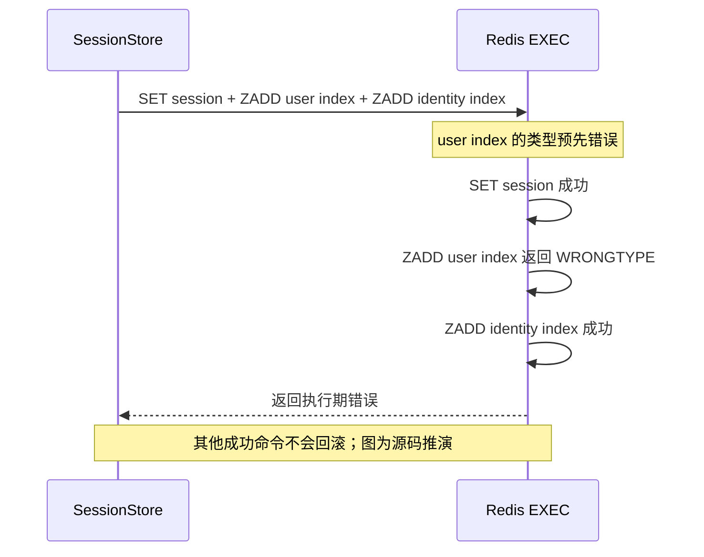

# Redis 状态、原子边界与缓存治理

> 状态：已实现 · 依据当前组合根、Redis adapters、治理目录、维护入口及锁定依赖；候选改造另行标明。真实 Redis 部署、持久化和故障切换不在本轮证据内。

## 1. Redis 丢失后，哪些事实不能重建

IAM 把 Redis 同时用于认证状态、短期竞争标记和远端凭据缓存，不能把它们统称为“数据库的加速层”。

- **Session、Refresh、Challenge 是当前认证流程依赖的在线状态**。MySQL 没有自动恢复这些记录的镜像。丢失 Session/Refresh 会拒绝相应后续请求；丢失 Challenge 会使该次验证无法继续。
- **撤销标记、发送 gate 和配额也是有安全含义的状态**。丢失它们可能遗忘此前撤销或放宽发送限制，不能一概描述为“缓存丢失只会登出”。
- **User/LoginIdentity Session 索引负责定位批量撤销目标**。主对象存在不等于索引完整；索引缺成员会缩小撤销覆盖范围。
- **微信 AppToken 与 SDK 缓存可以重新请求 provider**，但回源仍有凭据、限额、时延和未知结果约束；JWKS 发布快照由数据库中 Key.JWK 重建，PEM 属于 signer/启动匹配检查边界。

Redis 操作不参加 MySQL UoW。本文拥有键、TTL、客户端、竞争原语和治理探针的合同；认证业务决策由 [Session 合同](../02-业务模块/02-AuthN/03-Session-Token与JWKS.md)、[Token 链路](../02-业务模块/02-AuthN/05-关键链路-Token签发刷新吊销.md)、[Login](../02-业务模块/02-AuthN/04-关键链路-Login登录认证.md)拥有，远端凭据由 [IDP 主文](../02-业务模块/04-IDP/01-应用凭据与AppToken缓存.md)拥有。

## 2. 目录、实际装配和数据健康是三个问题

`cache/catalog.go` 登记 **14 个 family：12 个 Redis、2 个 memory**。标准完整装配至多注册 AuthN 10、IDP 2、Suggest 1，共 13 个 inspector；Suggest 两个后端互斥，关闭该模块时两项均未装配。

治理 Overview 始终遍历全部 14 项。未选中的 Optional 项仍返回 `Configured=false/Healthy=false`，仅在后端健康聚合时忽略它，不能据此说 API 只返回启用项。目录也不是全部缓存库存：Challenge attempts、IDP refresh lock 是辅助键，Suggest visibility 的进程内 CachedReader 和消费方 SDK 本地缓存未各自登记 family。

下表的尖括号是文档占位符，**不是实际 key 字符，也不是 Cluster hash tag**。调用者提供的 scene、AppID 等没有统一环境前缀或自动转义。

| family | 物理布局与结构 | TTL / 清理责任 |
| --- | --- | --- |
| authn.refresh_token | `refresh_token:<raw-token>`，JSON String | 剩余有效期；显式删除或轮换 |
| authn.consumed_refresh_token | `consumed_refresh_token:<sha256-token>`，JSON String | 轮换时旧 token 的剩余 PTTL |
| authn.revoked_access_token | `revoked_access_token:<token-id>`，String 标记 | 调用者传入 access 剩余期 |
| authn.session | `session:<sid>`，JSON String | Session 剩余期；终态仍可保留到期 |
| authn.user_session_index | `user_session_index:<uid>`，SID ZSet | 无 key TTL；按 expiry score 清理成员 |
| authn.login_identity_session_index | `login_identity_session_index:<liid>`，SID ZSet | 同上，独立于 User 索引 |
| authn.challenge | `authn:challenge:<id>`，JSON String | ExpiresAt 剩余期；成功消费/次数耗尽删除 |
| authn.login_otp_send_gate | `otp:sendgate:<scene>:<phone>`，String 标记 | 发送冷却时间，SET NX |
| authn.login_otp_send_quota | `otp:quota:<scene>:<phone>:hourly/daily`，ZSet | 每个窗口独立计数，窗口长度 TTL |
| idp.wechat_access_token | `idp:wechat:token:<appid>`，JSON String | IAM 层估计有效期及安全余量 |
| idp.wechat_sdk | SDK 提供的原始 key，String | SDK 调用者传入，不由 IAM 统一前缀 |
| authn.jwks_publish_snapshot | 进程内对象 | BuildJWKS 每次重建；GetCurrentCacheTag 一分钟标签复用 |
| suggest.redis_rate_limit | `iam:suggest:rl:<kind>:<operatorID>`，String 计数 | 首次 INCR 后一秒 EXPIRE |
| suggest.memory_rate_limit | 两类进程内 operator bucket | 容量淘汰/进程退出，按时间补 token |

静态 DataRole 是治理分类：例如 Challenge、配额归为 marker，并不意味着丢失可以无损恢复。catalog 对 JWKS 的 TTLSource 仍写 BuildJWKS 一分钟复用，实际只复用标签读取，详见 [JWKS](../02-业务模块/02-AuthN/06-关键链路-JWKS与本地验签.md)。当前 String 整对象更新与 key TTL 对应单对象生命周期；两个 Session 索引和配额需要成员排序/清理，采用 ZSet。这里没有“Redis 比 MySQL 快多少”的测量证据。

## 3. 谁建立连接，实际支持什么部署

标准 DatabaseManager 只构造 default cache registry，各模块借用同一 `*redis.Client`；生命周期由 DatabaseManager/registry 持有并关闭，AuthN、IDP、Suggest adapters 不关闭借用连接。维护 CLI 则建立自己的短期 client，并自行关闭。

实际配置与能力有以下边界：

1. `initSingleRedis` 以 Host 非空为门槛，Host 为空即跳过，即使 Addrs 有值。普通模式若 Addrs 非空，锁定 Foundation 依赖选择第一个地址。
2. Foundation 可以创建 ClusterClient，但 IAM getter 强制要求 `*redis.Client`。标准严格启动取资源时会拒绝 Cluster 类型；配置里存在 Cluster 开关不证明当前装配兼容 Cluster。
3. 即使改为 UniversalClient，Session 的三键事务、Refresh 的三键 Lua、Challenge 的两键 Lua 仍需同 slot 设计。按 SID 加 tag 不能同时解决跨 User/LoginIdentity 索引的归组。
4. `redis.cache.timeout` 映射的是 ConnMaxIdleTime。标准 client 未开启 ContextTimeoutEnabled，request ctx 不等于所有 socket 阶段的总 deadline，具体配置/关闭事实见 [配置与传输](../01-运行时/02-配置与传输装配.md) 和 [后台与关闭](../01-运行时/03-后台任务就绪与优雅关闭.md)。

固定 key 前缀不提供环境隔离。两个部署共用 endpoint 和 DB，相同 uid 的索引、相同 AppID 的 token/lease、相同 operator 的限额会相遇。隔离可选择独立资源，或覆盖所有写路径、辅助键和 SDK 原始键的显式 namespace；后者还需要旧键读取、索引迁移及运维范围合同，不能只改 Session 前缀。

Redis 初始化失败在 DatabaseManager 层记 warning，标准非降级启动随后由资源门禁拒绝，见 [启动主文](../01-运行时/01-启动与组合根.md)。锁定 Foundation handle 首次 PING 失败时，已创建 client 尚未存入 handle，也未被 Close；这是源码可见的失败清理窗口，未量测真实资源泄漏。

## 4. 原子竞争不等于失败回滚

| 原语 | 当前用途 | 能保证什么 | 仍可能留下什么 |
| --- | --- | --- | --- |
| TxPipelined / MULTI-EXEC | Save、Extend、Revoke 的主对象和索引动作 | EXEC 执行期间无其他客户端插入 | 执行期单条命令出错，其余命令仍可成功 |
| WATCH + TxPipelined | Extend/Revoke 读当前 Session 后更新 | 主 key 在读后变化则提交冲突 | 不监控索引 key；非冲突错误不自动修复 |
| Lua | Refresh 交换、Challenge 消费、单维配额 | 一次执行中指定条件判断与动作不被其他请求插入 | 脚本错误没有通用撤销；响应丢失仍可能已经执行 |
| SET NX | OTP gate、IDP lease | 同 key 首个写入者获准 | 不与后续发送/回源/数据库写入组成事务 |

[Redis 事务合同](https://redis.io/docs/latest/develop/using-commands/transactions/)明确区分入队错误和执行期错误。以下是 **源码条件推演，未做本轮故障实验**：若 User 索引被误写为 String，Save 的结果可能是“返回错误，但主对象和另一索引已经写入”。

Session retry 最多 **5 次 WATCH 尝试、4 次冲突重试**，backoff 依次 5/10/15/20ms。50ms 是等待之和，不含读取、队列、连接和执行时间；非 TxFailedErr 直接返回。把这组操作改为 Lua 也需先校验所有类型和前提，再写入，不能仅以“换脚本”承诺失败全撤销。

## 5. Session 主对象与索引的真实合同

### 5.1 Save 依赖 SID 不重新归属

Save 验证剩余有效期并编码 payload，然后整体 SET 主对象、向两个索引 ZADD；没有 NX、旧 owner、状态或 generation 的 CAS，也不删除旧主体索引。标准 Creator 生成新 UUID，这个调用合同承担了“不会复用 SID”的前提。

若低层调用者把同 SID 从 A/LI1 改成 B/LI2，旧 A/LI1 的成员仍在，`RevokeByUser(A)` 又不核对 payload owner，可能撤销 B 的 Session；Save 也能覆盖 revoked payload。该例没有正常重分配 SID 的公开 caller 证据，不能写成已复现漏洞。候选是 create-only、主体不可变、显式修复接口和撤销前 owner 复核。

### 5.2 物理 TTL、逻辑 expiry 和索引精度不同

Save/Extend 用 Go 时钟计算相对 TTL，Redis 从执行 SET 时开始倒计时，排队/网络延迟使物理 expiry 与 payload ExpiresAt 不严格一致。Get 不读取 PTTL；若 payload 原状态 active 且已逻辑到期，只把返回对象设为 expired，不重写主对象或修复索引，revoked 保持终态。schema_version 是存储编码标记，不是实体 CAS 版本，恢复细节归 [Session 合同](../02-业务模块/02-AuthN/03-Session-Token与JWKS.md)。

索引 score 使用 `ExpiresAt.Unix()`，清理条件是 `score <= now.Unix()`。例如 expiry 为 12:00:10.900，在 12:00:10.100 清理时成员已被移除，主对象仍可能 active 约 800ms；随后批量撤销不再枚举该 SID。更细 score 只缩小提前删除窗口；按主对象确认到期或采用保守清理界限才能避免提前移除，仍不能解决撤销期间新建 Session 的截止线。

### 5.3 WATCH 更新与批量遍历各有边界

Extend 缺主对象时返回 nil，不重建；已撤销状态拒绝延期。Revoke 在剩余期内保留终态 payload 并移除索引，到期则删除。该保护适用于更新路径，不把普通 Save 变成单调状态机。

批量撤销先清理该索引的到期成员，再 ZRange 全部 SID，逐个 Get/Revoke；没有分页、创建截止线或全局 fencing。主对象缺失时只清理当前查询的索引，不能保证另一索引同步修复。途中失败已完成项保留；重跑能否覆盖剩余目标依赖索引完整性，当前没有扫描主对象重建全部索引的机制。

## 6. Refresh 交换：一次竞争与一次请求不是同一回事

Rotate 的 Lua 读取旧值、decode JSON、比较 expected token ID、确认旧 PTTL > 0，再写新 refresh、写 consumed marker、删除旧 refresh。新记录 TTL 来自候选 token 的剩余期；marker 只保存 session_id/user_id，TTL 来自旧记录 PTTL，key 使用旧原值的 SHA-256。

脚本不读取 Session，也不验证旧/新 User、SID 一致；候选 key 存在时会覆盖，旧/新 key 相同会在末尾删除。标准 minter 的随机新值承担不碰撞前提，业务验证、先延长 Session 的顺序和输家处置见 [Token 链路](../02-业务模块/02-AuthN/05-关键链路-Token签发刷新吊销.md)。

三个边界需要显式保留：

- **false 不等于已证明消费过**：旧值缺失、ID 不符、PTTL 非正都可返回 false；Refresher 按重放处置撤销 SID。
- **库重试可改变一次请求的观察结果**：锁定 go-redis 默认重试 3 次，普通 EVALSHA 的 EOF/读超时可重发。首次交换成功但响应丢失，自动重发可能读不到旧值，最后返回 false,nil，使 Refresher 撤 SID；不要求用户再点击一次。这是未做丢回复实验的源码推论。TxPipelined 的读阶段错误不自动重试，也不能据错误反推零执行。
- **编码和时间精度不是 Lua 自动解决的**：Rotate 直接取 TTL.Milliseconds，不足 1ms 的正值会变成 PX 0；普通 SET 的 go-redis 路径会将不足 1ms 的正 TTL 提升到 1ms。MarkBearerTokenRevoked 直接传零 TTL 可写永久标记，标准 Revoker 已过滤非正剩余期。

UserID 在 wire JSON 中是 uint64 number，marker 经 cjson decode/encode。作为指定实现参考，[Redis 7.2 CJSON 源码](https://raw.githubusercontent.com/redis/redis/7.2/deps/lua/src/lua_cjson.c)使用 double，默认编码精度 14；大 ID 可能舍入或变成 Go uint64 解码拒绝的科学计数法。marker 解码错误时，Refresher 返回 Internal，未进入 SID 撤销动作。当前测试只用小 ID，miniredis 的 Go JSON 实现不能证明真实 CJSON 行为；目标部署版本和实际结果未知。字符串 ID、只存 SID 或可恢复结果回执是候选协议，尚未实施。

## 7. Challenge 与 OTP：限定比较对象，逐段承担失败

### 7.1 Challenge 比较的是当前序列化 SecretHash

Consume/失败计数 Lua 在当前 JSON String 中查找紧凑的 `"SecretHash":"<base64>"` 片段；成功消费删除主 key 和对应 attempts key，失败脚本按 hash 派生计数 key，次数耗尽时删除二者。脚本没有完整 JSON/用途/时效验证，业务 verifier 负责逻辑期限。

现有标准 payload 与专项测试中的不同 hash 替换会拒绝旧 hash；Lua 查找整个 JSON，不提供任意 payload 下的顶层字段绑定，例如低层 Payload 含同名旧 SecretHash 片段时仍可能匹配，标准 creator 未写该键。**同 ID、同 hash 的新签发没有独立 generation**，Create 又是整体 SET、不重置 attempts，同 hash 可继承计数或被旧请求消费。Delete 只删主对象，attempts 自行到期。合法但改变 JSON 空格的外部写入也可能让 Get 可读、Lua 片段比较失败。消费脚本不检查 PTTL，而失败计数检查正 PTTL；不能把底层消费当作完整有效性门禁。

### 7.2 OTP 配额按维度原子，发送链路按步骤补偿

每个 hourly/daily ZSet 单独执行 Lua：按应用 now 毫秒清理窗口、数成员、比较 limit、加入本次 UUID、设置窗口 TTL。顺序是 gate → 小时配额 → 日配额 → Challenge → SMS，两个配额不在同一脚本或事务。limit/window 非正时该维度直接放行；时间来自实例时钟，当前没有 Redis TIME 或跨实例偏差校验。

补偿只 ZREM 自己的 reservation；其余成员存在时重新延长窗口 TTL，因此“重复删除同成员不影响成员集合”不等于 TTL 全同。发送失败的 Delete/Quota Rollback 使用原请求 ctx；Quota Rollback 失败记 warning，Delete 错误直接忽略，不能承诺全部撤销；gate 不回滚。

例如 SMS 已被 provider 接受但返回超时，补偿失败可能留下仍可消费的 Challenge；或旧发送慢到下一次冷却结束、新 Challenge 已覆盖同 ID，旧失败的无条件 Delete 可删除新对象。日配额执行成功却丢回复时，上层没有该维度 lease receipt，也无法按本次成员精确补偿。这些是源码条件，不是已观测的短信事故。代次条件删除、持久结果判定与取消后的补偿责任需另定合同，具体业务顺序归 [Login](../02-业务模块/02-AuthN/04-关键链路-Login登录认证.md)。

## 8. 可回源缓存也需要有效期、lease 和失败合同

IDP 有 IAM 外层 AppToken 与 SDK 内层 token 两层。外层 key/十秒 refresh lock 只含 AppID，没有 SecretVersion；SDK adapter 透传类似 `gowechat_miniprogram__access_token_<appid>` 的原始 key。锁定 SDK 默认路径用 provider expires_in 减 1500 秒缓存，IAM 外层另估计 7200 秒有效期；Refresh 仍调用可能命中内层的 Fetch，不能承诺强制回源或凭据轮换立即失效两层缓存。

外层 lease 只协调抢占：调用者没有续租、写入 fencing 或 acquired 后二次读取；释放用 Background，错误忽略。慢 provider 超过十秒后，新 holder 可进入，旧 holder 后到的无条件 Set 仍可覆盖。SDK 缓存/HTTP 路径也未完整传递请求 ctx，标准 HTTP client 没有总 Timeout 配置；Set 失败会使已经取得的结果不能正常返回。TTL、过期 reread、Secret 轮换和验证缺口由 [IDP 主文](../02-业务模块/04-IDP/01-应用凭据与AppToken缓存.md)展开，本篇不把 lease 称作跨资源锁。

Suggest Redis 以 Burst 限制约一秒计数窗口，memory 按 QPS 补 token，两个后端并不等价。构造时 client nil 可回退 memory；运行期 Redis 错误 fail-open，不动态切后端。其独立 50ms context 不证明 socket 总耗时有 50ms 上限，详见 [Suggest 查询](../02-业务模块/05-Suggest/03-关键链路-SuggestProfile查询.md)。

## 9. 治理检查与维护删除拥有不同权限、证据

Redis inspector 每个 family 执行 PING，不扫描 key，不验证类型、TTL、Lua 权限、索引覆盖或 payload。JWKS reporter 存在时即使尚无快照也可 Healthy；memory limiter 没有数据探针。inspector error 被转为不健康状态/Notes，Overview/Family 仍能正常成功返回。因此“PING 允许而 EVAL 被 ACL 拒绝”可使治理 Healthy 与业务失败并存，这是源码推论。

ReadService 构造将 inspectors 放入 map，同 family 后者覆盖，未知项不参与目录遍历；拒绝重复/未知项是 smoke test helper 的检查，不是生产构造门禁。只读治理面避免直接改状态，并非无访问控制：开发默认注册、不要求管理员；生产默认不注册，显式开启时强制 JWT 和 cache-governance/read，保护组件不足则不注册。

现行维护 CLI 有两个不同范围的 Redis 清理入口：

| 入口 | 固定范围 | 不能据此推导 |
| --- | --- | --- |
| purge-refresh-tokens | 仅 refresh_token:* | 不删除 Session、索引或撤销/consumed marker；不等于即时全量登出 |
| purge-login-state | Session、两个索引、refresh、consumed、revoked 共六族 | 不清 Challenge/OTP/IDP/Suggest；没有跨全部 key 的事务 |

apply 需要各自精确确认，默认 dry-run；停签发/会话写入是调用前提，CLI 没有验证服务已停写。SCAN COUNT 是工作量提示、不是返回数量上限，遍历可能重复，helper 对返回数量求和且整批 UNLINK，不构成严格 batch-size 上限或一致快照，见 [SCAN 合同](https://redis.io/docs/latest/commands/scan/)。后续批次失败不会恢复此前删除；CLI 错误路径不输出 helper 的部分计数。本轮未运行实际维护清理，操作由 [日志与凭据处置](../05-工程质量与运维/04-安全日志与凭据处置.md)及相关手册拥有。

Refresh 原值位于物理 key，治理面不返回 key/value，也不应把扫描原值复制到故障记录。日志脱敏测试只证明指定入口/字段，不自动覆盖所有底层错误或自定义调用。

## 10. 候选改造应先选要保护的不变量

| 需要保护的事实 | 候选设计及其代价 |
| --- | --- |
| 多环境、Cluster 与资源责任 | 统一 namespace/迁移范围；再设计同 slot。不能用配置开关替代 adapter/多键设计 |
| 主对象与索引在异常类型下完整 | 写前完整校验、create-only/修复分离、owner 复核、索引重建证据；Lua 本身不提供通用回滚 |
| 逻辑到期与批量撤销覆盖 | 更细 score、按主对象裁决；另定义新增 Session 截止线及在途请求边界 |
| Refresh 丢回复后可恢复 | 请求/结果回执与秘密存留期限，或限制非幂等命令自动重试并承担人工恢复；兼容大整数 wire 编码 |
| OTP 替换和发送未知结果 | generation 条件消费/删除、按 reservation 补偿、独立取消责任和 provider 接受判定 |
| IDP 慢回源和凭据更新 | 代次绑定、续租/条件写、两层失效合同、HTTP 总期限；lease 不能撤销已经发出的远端请求 |

以上均未实施。AOF、复制、failover、恢复后的标记完整性由部署事实决定，当前源码与本轮测试不能提供这些运行证明。User 状态的 MySQL 提交、撤销 Outbox、worker 和在线 Admission 是不同边界；在线读取能拒绝已看到的停用状态，不提供在途请求 fencing 或全局瞬时屏障，见 [事务缓存与事件专题](../06-专题设计/02-事务缓存与事件一致性.md)。

## 11. 代码定位与验证边界

| 修改/复核对象 | 入口 |
| --- | --- |
| 治理目录、聚合与传输 | cache/catalog.go；application/cachegovernance；transport/rest/debug_routes.go |
| 连接构造/借用/关闭 | process/database.go、bootstrap.go；container/module_graph.go；锁定 component-base Redis runtime |
| Session/Refresh/Challenge/OTP | infra/cache/redis 的 session_store、token-store、challenge_repository、otp_verifier；对应 AuthN domain/application |
| SDK 缓存与 AppToken | infra/cache/redis/accesstoken_cache、wechatsdk_cache；domain/idp/wechatapp；锁定 silenceper/wechat |
| Suggest 限流 | infra/suggest/ratelimit；container/suggest 的装配与 inspector |
| 维护范围 | cmd/iam-maintenance/main.go、login_state.go；两个 Redis maintenance helper |

现有离线测试覆盖：catalog 14 项及拷贝、治理 stub 聚合；正常 Session 编解码/索引维护、单次并发 Extend/Revoke；小 ID 的 Refresh 唯一交换/不符拒绝/日志脱敏；不同 hash Challenge 替换和计数；单维 quota 的窗口/成员补偿；AppToken stub、SDK adapter 的临时 key；SQLite/miniredis 装配、PING、限流共享及维护范围。

本轮以race/count=1运行11包：6包全量、5包按入口选测，共101个pass、0skip/fail；Redis adapter包39个。CLI选测只匹配三个Refresh用例，没有LoginState CLI专门确认/输出测试，六族范围证据来自helper测试。原始日志、逐包选择和源码绑定保存在重构台账。miniredis、SQLite、stub 和 race 不证明真实 Redis CJSON、执行期 WRONGTYPE 部分结果、丢回复重试、同 SID 换主体、亚秒索引清理、同 hash generation、取消补偿、真实短信/微信接受、Cluster/TLS、持久化或故障切换；没有新增业务测试、修改业务行为或执行外部操作。
