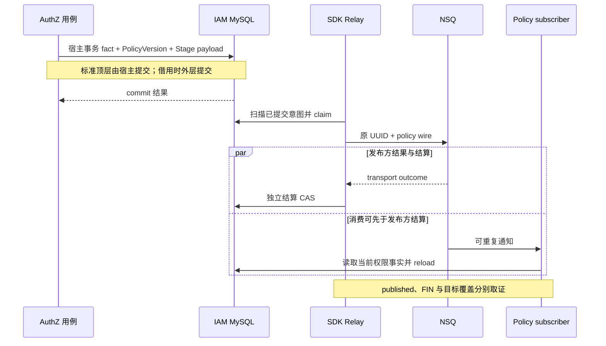
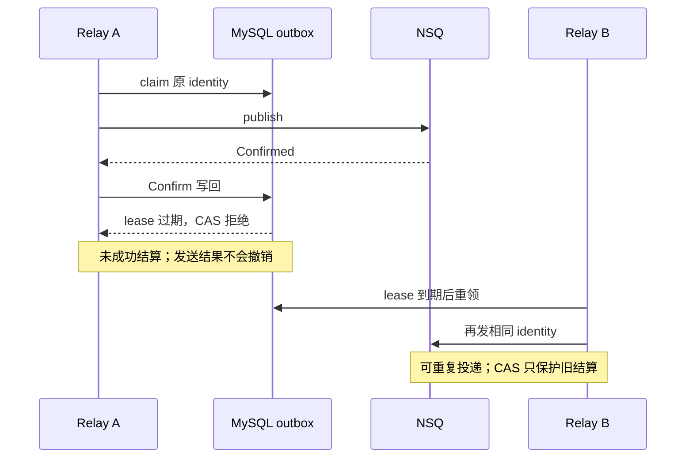

# 事件、Outbox 交接与投递结果

> 状态：已实现 · 依据 IAM 当前装配及锁定 reliable-messaging v0.3.0-m6.1 / go-nsq v1.1.0；源码条件、离线测试和运行接受分别标明。

## 1. 当前设计先保护哪一个窗口

AuthZ 的标准写入把授权事实、PolicyVersion 和待发通知放入 **同一个 IAM MySQL 事务**。SDK 借用该事务暂存，再由 Relay 扫描已提交记录发布；它不拥有业务事务，也不关闭宿主连接池。

这关闭的是“业务提交了，但没有留下通知意图”的双写窗口。Broker 接受、Outbox 结算、消费者 FIN、失败审计和实例策略覆盖是后续独立结果。它们不能互相代替，当前没有请求级或全实例 loaded-version barrier。

当前有三条不同链路：

| 链路 | 当前责任与恢复 |
| --- | --- |
| AuthZ version 通知 | 标准 rm_outbox → SDK Relay → NSQ → 各实例读取 MySQL / reload；重复通知依版本收敛 |
| 登录 OTP 的 mq sender | DirectEventPublisher → NSQ；不写 Outbox，没有 durable direct 回执 |
| Identity 状态到 Session 撤销 | 独立 identity_session_revocation_outbox 与 worker，不由标准消息 Relay 接管；见 [Identity 边界](../02-业务模块/01-Identity/04-模块边界-Identity与AuthN-AuthZ-Suggest.md) |

旧 domain_event_outbox 自有 Store/Relay 不在当前运行装配中；FreshStages 的 BootstrapStager 仍会写旧表，只有插入能力，没有发布/恢复能力。回滚和首次 bootstrap 的交接必须有旧工作拥有者，不能用“旧链退役”省略该边界。

## 2. 消息身份、版本和传输 ID 不互换

| 标识 | 裁决什么 | 不裁决什么 |
| --- | --- | --- |
| EventID / application UUID | 一次领域通知；BaseEvent 新建时生成 UUID | 不等于 PolicyVersion；重建相同 version 可产生另一通知 |
| (producer, message_id, destination) | SDK 持久 identity，同身份比较完整 fingerprint | 不按 version 或 scope 单独去重 |
| rm_outbox.id / claim_token / version | Outbox状态的CAS代次；claim携带当次版本，结算也推进version | 不等于业务 PolicyVersion，也不能撤销 Broker 副作用 |
| PolicyVersion | 消费方观察/加载权限事实的版本 | 不证明每条通知恰好消费一次 |
| physical NSQ message ID | 一次 Broker 交付身份 | 不能代替 application UUID 或持久 staging identity |
| failed-handoff group | 跨实例保留终态失败通知 | 不是策略应用成功或自动重放队列 |

StandardStager 将 policy payload 编码为原始业务 JSON，建立 producer=iam、schema_version=v2、scope=scope:global、content_type=application/json 的 immutable intent。fingerprint 包含全部 Input 字段和原始 payload 字节；JSON 空白不同也不等价。

SDK Append 遇重复键后锁定同三元组读取 fingerprint：相同则 nil，**不重置 published/quarantined/调度状态**；不同返回 ErrConflict。重试应保留原事件身份、OccurredAt 和内容；重新构造事件会生成新 UUID，属于另一条意图。这与消费者按版本跳过重载是两套幂等合同。

数据库保存业务 payload，而 PolicyWirePublisher 在发布边界构造 revision-one envelope：保留 UUID/raw payload，生成固定 PolicyVersion/aggregate_id/source=iam-outbox-relay metadata，再把编码后的副本交给 transport，不修改持久 intent。

## 3. 事件目录声明什么，哪些绑定仍在代码里

当前 configs/events.yaml 有两项：

| event type | catalog topic | delivery | 当前实际路径 |
| --- | --- | --- | --- |
| iam.authz.version_changed.v2 | iam.authz.version.v2 | durable_outbox | StandardStager / PolicyWirePublisher；subscriber 读取代码固定 topic |
| iam.login_otp_sms | iam.notify.sms | best_effort | 仅 SMS provider=mq 时调用 DirectEventPublisher |

Load 校验 topic 引用、delivery 枚举及 handler 非空，不验证真实 consumer 是否存在、aggregate/domain 与实现是否一致，也不把 handler 字段解析成运行注册。比如 sms-dispatcher 声明不证明本仓已运行短信下游。

StandardStager 与 Relay route 取 catalog；policy subscriber 固定 `policypublication.Topic`。只改 YAML 的 authz topic，可使发布者和消费者路由错位，当前没有运行时相等门禁；周期 DB Reconcile 仍可能收敛，不能据此推导权限必然永久不更新。process 只预建 catalog 的 durable topics，SMS topic/下游 channel 不在这一步准备范围。

目前 StandardStager 仅接受 policy version event，未来新增 durable 事件不能只补一行 YAML。要同时定义领域事实、事务入口、身份/内容、wire、消费和恢复责任；目录不创建这些能力。

## 4. 同事务由真实绑定和错误传播成立

标准 AuthZ UoW 构造 tx-bound 仓储，同时把含 carrier 的 callback context 传给 stager。StandardStager 先 RequireTx，再要求 MySQL，SDK BindGORM 还核验实际 `*sql.Tx`，支持 PreparedStmtTX、拒绝普通句柄/未知包装；只有 tx-bound 仓储却传普通 ctx，Stage 仍不成立。

Stage 校验类型、聚合类型、非零 OccurredAt、payload 正版本和 AggregateID 对应，不查数据库当前 PolicyVersion，也不拒绝额外 payload 字段。应用 StagePolicyVersionChanged 使用仓储返回版本，version=nil 为 no-op；事实和通知对应由应用事务协作负责。低层 caller 写格式合法的 version=999，stager 不会自行证明库里确有该版本。

Stage 逐项 Append，后项失败不由 adapter 自行回滚前项；Required 借用也不设置 rollback-only。若宿主吞掉错误再提交，可能保留先前写入。应传播错误，由实际提交者处理，完整连接/保存点/吞错边界归 [MySQL 主文](01-MySQL事务与迁移.md)。

当前 IAM 没有把 SDK Wake 接入 stager 的提交后 hook，恢复依赖周期扫描；默认 poll 为 2s，固定 retry 为 10s。这是调度间隔，不是端到端传播时限。Relay 也不提供每个聚合的严格 FIFO；due/id 排序及并发领取不等于业务版本发布顺序。

## 5. Claim、租约和结算保护什么

SDK MySQL ClaimDue 使用 READ COMMITTED 事务、数据库 UTC 取时及 FOR UPDATE SKIP LOCKED，领取 pending/retry_wait 的 due 行或过期 publishing 行。lease 从本次数据库取时加 Lease，**不从 Publish 开始计时**；Claim 耗时已经消耗租约。

Store 只有 ClaimDue、Confirm、Retry、Quarantine，没有 Renew。Relay 发布前不再验证 LeaseUntil；结算必须匹配 id、claim_token、version、publishing 状态及未过期 lease，影响行数为 1，否则旧执行者不能完成结算。

默认参数为 concurrency=1、lease=30s、publish_timeout=5s、write_timeout=5s、restart_delay=2s、shutdown_timeout=20s。参数校验要求 lease/shutdown 大于 publish+write，但不能证明 SQL Claim、连接、driver 或关闭都按这些预算完成：

- Claim 使用长跑 ctx，没有单次 WriteTimeout。
- 已准入交付使用 WithoutCancel，随后分别建立发布和结算 timeout；runtime 停止不直接取消这些写回。
- ManagedPublisher 超时返回 Unknown，实际 driver 调用可继续并保留槽，直至真正结束；等待槽超时也可 Unknown，即使尚未发送。
- Stage 的初次 due 来自宿主 time.Now，lease/retry 来自数据库 UTC；统一时区不消除主机时钟偏差。

以下也是 **源码条件推演，未在本轮真实 SQL/NSQ 复现**：

同样，第一次超时返回 Unknown、旧 driver 稍后发送成功，retry 又可发送成功。SQL写回丢回复也可能已经完成，返回错误不能证明零转换；需读取当前状态后裁决是否仍待租约恢复。保留 identity 让消费有机会幂等，不意味着 Broker 仅接受一次。

## 6. 状态转换、重试和两个 Unknown

| 条件 | 成功持久化的结果 | 恢复责任 |
| --- | --- | --- |
| transport.Confirmed + Confirm 成功 | published，记录 transport_confirmed_at | 该 Outbox 意图终态；消费者另行处理 |
| transport.Unknown + Retry 成功 | retry_wait，固定延迟后 due | 重试原身份/内容，可产生重复 |
| transport.Rejected + Quarantine 成功 | quarantined | 人工核查本地消息/路由/协议等原因 |
| 发布后的结算错误、过期或 stale | 调用未确认转换；网络错误下写回也可能已完成 | 读取当前状态；仍publishing才等待租约回收，错误不证明零发送/零写回 |
| Claim 解码或 immutable fingerprint 不符 | Claim 内直接隔离 | 修复数据/协议问题后按恢复合同处理 |
| 数据库出现未识别 state | 治理归 standard_unknown；Relay 不领取 | 人工干预，不能套用普通 Unknown retry |

**transport.Unknown 不会写成 standard_unknown**。前者是结果不确定，通常进入 retry_wait；后者是未知持久状态。Confirmed 目前对应 go-nsq Publish 返回 nil；Rejected 多为本地路由/intent/wire 校验拒绝，普通 driver 错误保守归 Unknown。[NSQ 协议](https://nsq.io/clients/tcp_protocol_spec.html)分别定义 PUB 的成功响应与消费 FIN，两者也不是同一个确认点。

IAM Relay Retry 不读取 Attempts/FailureCount：Unknown 固定延迟，Rejected 隔离，当前没有指数退避或发布尝试次数上限。attempt_count随有效claim/reclaim增加；failure_count随成功重试或隔离转换增加，包含Claim内无效immutable内容的直接隔离，单纯reclaim/Confirm不增加。不能从后者反推真实发送次数。消费者MaxAttempts属于下一段，不能套用到Outbox发布。published不再领取，也没有consumer回执驱动的重发；若Broker随后丢失已确认通知，Outbox不自动回放，Policy仍需DB Reconcile的独立恢复。

Observe 只在事件 Err 非 nil 时 warning；Unknown 发布本身没有该 Err，Retry 成功也不因此 warning。不能承诺每个 Unknown 都即时日志或使 readiness 失败。

## 7. Policy 通知、FIN 和覆盖目标

每实例 business channel 由 hostname/pid 派生并带 #ephemeral。部署身份相同可能共享 channel，离线实例也不保留该 channel 的历史通知；缺失通知的恢复依赖 DB Reconcile。当前 sanitization 不完整保护 Unicode/64字节限制，注册失败会周期重试，正常样本测试不证明任意部署名称都合法。

handler 先忽略非空的异类 event_type；空 event_type 仍可接受合法 version payload。有效通知先推进观察目标，再比较本条 version 是否 loaded；若跳过或 reload 返回成功，handler 返回 nil。reload 内部最多三次、失败间隔 100ms；成功后没有再次断言覆盖本条 version 或最高观察目标。

SDK 对未显式 settlement 且 handler 返回 nil 的消息调用 Ack/FIN。这可以表示异类忽略、版本跳过或 reload 调用成功，**不等于目标覆盖、新鲜度续期或集群收敛**。go-nsq Finish 无返回错误，本地调用成功不能证明 NSQD 收到了 FIN；网络断开还可能再次交付。

handler 错误按消费者配置重入队。标准装配把nsq.max-attempts经RuntimeOptions.NSQMaxAttempts传给SDK；IAM Options默认5，实际值取解析后配置，SDK对零值拒绝。“5”表示最多五次业务尝试，不是初试加五次重试；达到上限后先转交失败通知，只有 Confirmed 才 FIN 原消息。超过上限的再次交付跳过 business handler、继续 handoff；复制的driver MaxAttempts被SDK设为0，避免默认poison cutoff擅自FIN，这与SDK业务次数上限是两个字段。

标准回调取消绑定 runCtx，但 failed audit 默认 DeliveryContext=Background，不自动继承业务 runCtx。取消和关闭不能概括为所有 callback 同时结束，完整 [多实例策略收敛](../02-业务模块/03-AuthZ/04-关键链路-多实例策略收敛.md) 与 [后台关闭](../01-运行时/03-后台任务就绪与优雅关闭.md)拥有该合同。

## 8. Failed-handoff 保留的是失败事实

Stable group=iam-policy-sync；SDK 对业务 topic/group 派生固定 failed-handoff topic，failure channel 为 cb-failed-handler。不同实例竞争处理这些失败通知，不是每实例都再审计一份；它不自动重放 policy 或证明权限已经应用。Unknown handoff 可能已经发送，原消息重入队又可生成重复失败交付。

IAM Audit.Record 用 topic + 原 business channel + application UUID 的 SHA-256 去重，不用 physical NSQ ID。首次 INSERT 成功返回；重复 1062 则在事务中锁定旧行，核对身份、payloadHash、metadataHash，再更新 seen_count/最后 transport 与 cause 后提交；同 UUID 内容冲突返回错误并继续重入队，不静默 FIN。

失败消费者仅在 Record 成功后调用 FIN。DB 已写成功但 FIN 丢失仍可重复；不同原 business channel 也有不同审计身份。这是失败持久化合同，不能把审计行叫作 policy 成功回执。本仓没有独立离线 SQL audit 分支测试，SDK callback stub 不证明这些 MySQL 分支已执行。

## 9. Direct SMS 的成功与补偿边界

当前非测试 DirectEventPublisher caller 只有 mq_sender；OAuth state 使用 Challenge，不产生此 MQ 事件。SMS provider=log/mq/aliyun 中只有 mq 走该路径。DirectPublisher 拒绝 catalog 的 durable_outbox 事件，未知 event 拒绝，nil 为 no-op；PublishAll 顺序发送，前项成功后后项失败没有回滚或自动重试。

MQ sender 的成功是 publish Confirmed，不能证明短信下游、provider 或手机已接受。Unknown 时实际发送仍可能继续，应用删除 Challenge/回退配额不会撤回已发消息。重新发送会生成新 UUID，没有持久 direct 去重回执；OTP 补偿窗口由 [Redis 主文](02-Redis与缓存一致性.md) 和 [Login](../02-业务模块/02-AuthN/04-关键链路-Login登录认证.md)拥有。

mq payload 固定 scene=login，即使上层走 PhoneLink 发送；link proof 的场景隔离仍由 Challenge 维护，不能把消息 scene 当作绑定证明。MQ wire含phone/code；当前IAM policy失败审计保存收到的原payload/metadata/cause，不承担SMS失败审计。开发LogSender明确记录phone/code。日志/状态摘要的约束与测试覆盖需分别核验，不能宣称所有消息或日志均无敏感材料，见 [凭据处置](../05-工程质量与运维/04-安全日志与凭据处置.md)。

## 10. 启动、首次 bootstrap 与只读交接检查

标准 process 先要求 reliable messaging enabled 和 ConsumerSDKEnabled，再经 HTTP provisioner 准备 durable topics；平台随后校验 MySQL/参数、schema、legacy unfinished，创建并 PING 专用 producer。该 producer 由 DirectPublisher 和 PolicyWirePublisher **共享**，MaxInFlight=Concurrency；SMS 发送可与 Relay 竞争槽，不能称 policy 独享连接。

prepareMessaging 或可靠模式 Container 初始化错误阻止启动，开发 degraded 不能绕过。但以下门禁各有范围：

| 检查 | 当前实际证明 | 仍未证明 |
| --- | --- | --- |
| CheckReliableSchema | MySQL、journal 一行/clean/version≥39、必需 rm_outbox 列可解析 | 类型/默认值/engine、identity_key及索引定义、audit 表、全部数据正确 |
| CheckLegacyDrained | 查询时旧表无 BINARY status 非 published 行 | 所有旧 writer 已停、今后不会再写 |
| 独立 preflight | 一致只读事务、总行预算、intent/fingerprint/metadata 和计数报告 | writer 排他、consumer 收敛、生产切换授权 |
| migration 38 / 39 / 40 | 38 建 rm_outbox；39 加 failure_count/updated_at；40 建失败审计表 | 迁移成功不等于消息交接已完成 |

标准process启用迁移、迁移前version=0且应用表为空、FreshStages成功提交且期间无外部drain时，33/35的BootstrapStager会写旧pending；38–40不复制/排空它们，当前维护也没有旧consumer/bridge。现行隔离proof脚本针对这条标准fresh链预期两条旧通知并拒绝SDK preflight；标准启动也受同一legacy gate阻止，这是源码/脚本合同，本轮未执行完整新库链。该首次上线场景需reviewed旧链drain/handoff，不能推广为任意新库或任意迁移入口都必然留下两条通知。

维护写入要求显式 outbox-mode=standard，先 schema/legacy 检查，再在宿主事务 Stage。独立 CLI 只读 preflight 的 SDKDataReady 可与 RecoveryRequired 同为 true：合法 pending/retry_wait/publishing仍需 SDK 恢复。published 内容异常只报告、不阻止该数据 ready；schema-down目标的“表可移除”只检查 rm_outbox 空/读取不截断，不覆盖 migration40 的审计表。WriterExclusionVerified 与 CutoverAuthorized 始终 false，不能以数据报告代替人工操作证据。

操作合同归 [条件退役维护](../02-业务模块/03-AuthZ/08-条件授权退役维护手册.md)、[Scope 迁移](../operations/assignment-scope-migration.md) 和 [迁移发布](../05-工程质量与运维/03-迁移发布与数据库运维.md)；本轮没有执行交接或维护写入。

## 11. Readiness、监督和关闭分别取证

StatusReader 不输出 published，输出标准 pending/retry_wait/publishing/quarantined/unknown 及旧 pending/failed/publishing/quarantined/unknown，各带 standard_/legacy_ 前缀；终态比较使用 BINARY，不把大小写/附加字节当作 published。

任何非空 legacy、standard_unknown、standard_quarantined 立即要求干预；其他 unfinished 按 created_at 最大年龄判断，严格超过阈值才阻止 ready。标准时间按 UTC 解码、legacy按固定UTC+8，未来时间 age clamp 为零。这是数据库积压检查，不 PING NSQ，也不检查 runtime 首次扫描/监督进展；启动成功或队列暂空不能证明恢复链健康。

ReliableRuntime 对 Run 错误或意外 nil 串行等待 RestartDelay 重启，没有 panic recovery。Stop 取消新准入、join Relay 已准入写回，再 Drain 共享 producer 的真实 driver 调用；producer Close 超时保留 ownership，可再次 Close，正常 Stop 没有自动 Interrupt。只有装配失败的清理分支会在 Close 失败后 Interrupt 再 Close。

宿主关闭先停 policy subscriber，再 Stop ReliableRuntime，两道门禁成功才继续关闭 DB；门禁失败保留后续依赖并以可靠模式错误退出。其后普通 cleanup/DB Close 错误只记录，不能把“任一关闭错误”写成均失败退出。完整顺序、独立预算和请求尾部边界归 [运行时](../01-运行时/03-后台任务就绪与优雅关闭.md)。

## 12. 候选演化先定责任，不能只换一个组件

| 要解决的问题 | 候选设计与代价 |
| --- | --- |
| 目录与实际 consumer 路由错位 | 启动等值校验或统一生成绑定；仍需协议、handler能力与下游存在性验收 |
| Claim 耗时/发布越过 lease | 单次claim预算、续租或条件取消；CAS/fencing只保护写回，不撤销远端发送 |
| Unknown重复及无限重试 | 保留原回执/身份、分类恢复与预算；人工隔离需保留重新接管路径，不能直接丢弃 |
| 全实例覆盖或成功回执 | 明确观察目标、覆盖证明、实例集合及过期策略；不能用 Broker Confirm/FIN 代替 |
| 首次 bootstrap 的旧意图交接 | 明确旧 owner、冻结/排空、桥接是否保留ID与内容、失败恢复及回滚证据 |
| 更换 Broker / 独立 Relay | Outbox仍与业务库同事务；独立Relay借用指定库/权限/生命周期，另验Broker存储与确认合同 |

这些是候选，未实施。把通知写到独立中央数据库会重新引入双写窗口；同步 MQ、CDC、XA 或事务消息均需另定义数据库与发布时序，不能由模式名称推出当前合同。policy version 可重载幂等，也不能据此授权任意外部副作用在 Unknown 后重试。

## 13. 代码定位与已有证明

| 复核对象 | 当前入口 |
| --- | --- |
| 事件声明、payload 与身份 | configs/events.yaml；pkg/event、eventcatalog、eventcodec |
| 同事务、mapper 与启动检查 | application/authz/policychange/version_event；infra/mysql/eventoutbox；AuthZ UoW；migration38–40 |
| Relay/producer/宿主监督 | container/platform/reliable_eventing；infra/messaging；process/event_bus、reliable_messaging |
| 消费、失败审计与readiness | container/authz/policy_sync、channel；application/authz/policypublication；infra/mysql/messagefailure；container/readiness |
| 锁定 SDK / driver | reliable-messaging 的 message、storage/mysql、relay、transport/nsq、wire/legacy；go-nsq Finish/conn/protocol |
| 条件集成与首次交接 | reliable_messaging tag测试、scripts/testing/reliable-messaging-proof.sh、m6 subscriber workflow |

本轮以race/count=1选测14包，8包全量/6包选测，73个pass、0skip/fail；SDK Relay含11个pass事件（含子用例）、NSQ替身26个。证据包括golden历史wire、BootstrapStager SQLite提交/回滚、HTTP topic替身、真实SDK配假store/driver的时限/槽/关闭、handler/registration/Reconcile替身与SMS capturing publisher。

没有运行真实 MySQL Stage/schema/preflight、SQL lease/晚归CAS、失败审计重复/冲突、NSQ崩溃/FIN、历史binary切换、真实短信或生产。普通go test不执行reliable_messaging/integration条件专项；缺环境Skip或只编译不算通过。现行m6 workflow的PlatformWiring选测也不等于全部专项执行；OriginalUoW的隔离双写比较不表示当前runtime双写。源摘要、逐包选择和未覆盖项见重构台账，文档/图示验证不能替代运行接受。
