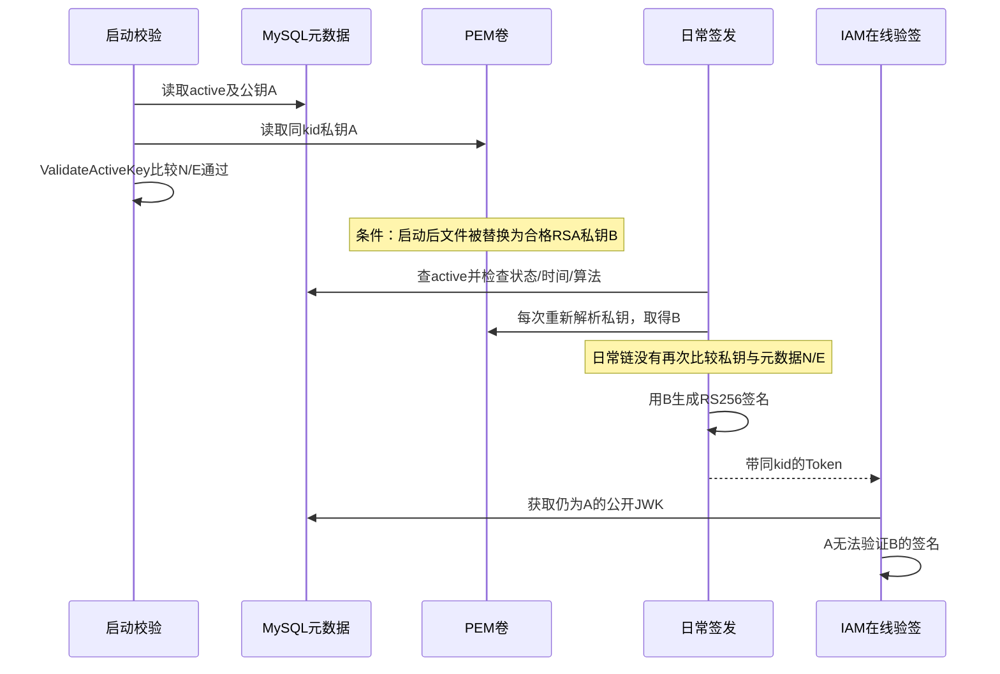

# 密码材料、密钥存储与令牌验签

> 状态：已实现 · 以 `95141ea2` 核对标准装配、Argon2id/AES-GCM、PEM、密钥生命周期、服务端 Codec 和 SDK 锁定依赖。本文区分已实现控制、既有测试、源码条件推演及未实施候选；不代表生产安全验收。

## 1. 先确定每种材料要完成什么任务

密码核验、取回微信秘密、签发 Access Token 是三个不同合同。它们共享密码学基础设施，却没有共同的轮换、所有权或可用性保证。

| 材料 | 当前实现与保存位置 | 为什么这样选择 | 仍由谁负责 |
| --- | --- | --- | --- |
| 用户密码 | Argon2id PHC 字符串存入 Credential | 登录只需比较；内存和计算成本提高离线猜测成本，无需还原原密码 | AuthN 策略发起核验/轮换，应用层记录失败与持久化；准入另判 |
| 微信 AppSecret、消息 AESKey | AES-256-GCM 密文存 MySQL，32-byte 主密钥由进程配置解析 | 调用 provider 或处理消息需要原值；认证加密同时检查包完整性 | IDP 管理材料及解密出口，部署方保管主密钥与恢复材料 |
| Access Token 签名私钥 | RSA 私钥存未加密 PEM，公钥及状态/时间窗存 MySQL | 验证方只取得公钥；生命周期事务不必读取私钥 | AuthN 管理元数据和签发，部署方保证匹配的卷、权限与备份 |

这里的分工有实际后果：主密钥不能靠密码 rehash 迁移；数据库 active 唯一不能证明 PEM 可签名；JWKS 返回成功也不能证明在线 Session 允许请求。业务链路分别由 [Login](../02-业务模块/02-AuthN/04-关键链路-Login登录认证.md)、[IDP 凭据](../02-业务模块/04-IDP/01-应用凭据与AppToken缓存.md)、[Token 生命周期](../02-业务模块/02-AuthN/05-关键链路-Token签发刷新吊销.md)和 [JWKS 链路](../02-业务模块/02-AuthN/06-关键链路-JWKS与本地验签.md)维护。

## 2. 密码材料：输出格式固定，读取校验并不完整

### 2.1 默认成本与调用责任

[Argon2Hasher](../../internal/apiserver/infra/crypto/argon2_hasher.go) 每次 Hash 生成 16-byte 随机 salt，使用 `m=65536 KiB`（64 MiB）、`t=3`、`p=4`、32-byte 输出。salt/digest 使用不带 padding 的标准 Base64，输出如下：

```text
$argon2id$v=19$m=65536,t=3,p=4$<salt>$<digest>
```

Argon2 是内存成本可调的密码散列；[RFC 9106](https://www.rfc-editor.org/rfc/rfc9106)描述算法与参数选择。固定参数不是本项目硬件上的吞吐或登录延迟证据。Hasher 的 Hash/Verify 不自行拼接 pepper，调用方负责传入处理后的明文；[密码策略](../../internal/apiserver/domain/authn/authentication/password.go)使用 `password + Pepper()`。标准模块与两个账户维护 CLI 均构造 `NewArgon2Hasher("")`，当前配置没有非空 pepper 接线，不能把可注入端口写成生产已采用。

随机 salt 使同一密码的输出通常不同，概率性质不应写成永不碰撞。最后的 `ConstantTimeCompare` 比较派生字节；它不使 PHC 解析、仓储查找、错误路径或不同成本参数的整条登录耗时恒定。本轮 Go 1.25.12 的 `crypto/rand.Read` 在随机源失败时不可恢复退出，源码中的 error 分支不能证明该运行时会返回普通可捕获错误。

### 2.2 损坏数据库材料时会发生什么

公开 Login 提交密码，不提交 PHC。下面讨论数据库材料损坏或受信导入材料异常，不能推成任意远端客户端直接设置成本参数。

| 持久化材料情境 | 当前读取行为 | 对登录的影响/证明边界 |
| --- | --- | --- |
| 分段数不为 6、算法名不是 argon2id、参数扫描或 Base64 解码失败 | Verify 返回 false | 密码策略按失败记录；不能由同一 false 区分密码错误和这类损坏 |
| 首段或 `v=19` 改写，其他字段仍可用 | 只检查 `parts[1]`，忽略首段和版本段 | 用当前 Argon2id 实现计算，未按持久化版本选择算法；源码事实 |
| `t=0` 或 `p=0` | 应用未先验证范围，参数送入锁定 x/crypto | 依赖会 panic；不是统一返回 false，属源码推演，未专项执行 |
| digest 解码为空 | 输出长度取自已存 digest，而非固定 32 | 锁定依赖可沿零输出长度路径 panic；未专项执行 |
| 内存/迭代成本非常大、salt/digest 长度异常 | 无应用成本上界或固定长度检查 | 计算成本由材料驱动；无压力实验，不能量化资源耗尽程度 |

[Credential Issuer](../../internal/apiserver/domain/authn/credential/password_issuer.go) 的预散列入口只要求 Algo 非空，不解析 PHC；公开 SignUp 走 PlainPassword，未找到生产预散列调用者。[登录仓储投影](../../internal/apiserver/infra/mysql/credential/repo.go)不读取 Algo，策略用全局 hasher。因此 Algo 是持久化标签，当前不是多算法分派器。若增加导入或算法迁移，应在材料进入核验前定义接受格式与成本边界，而不能只增加一个 Algo 值。

### 2.3 NeedRehash 是参数对齐，不能承担秘密迁移

NeedRehash 仅比较 `m/t/p` 与默认值，不检查 PHC 版本、salt/digest 长度、输出长度或 pepper 代次。已有成本比默认更高时也会返回 true；这是一种参数归一化，不是只升不降的策略。

策略先 Verify 成功，才考虑 rehash 和 Rotation。直接把 pepper P1 换成 P2，会让旧材料在第一步核验失败，不能借 NeedRehash 自动迁移。标准装配当前为空 pepper；将来采用非空值，需要先决定旧代次识别、受控兼容窗口和重置密码路径。自定义 hasher 的 rehash error 可被策略忽略，但已产生 Rotation 的数据库写入失败会阻止登录；轮换发生在 User 准入前，也不等于整次登录成功。

## 3. 可逆秘密：完整性、归属和主密钥代次要分开

### 3.1 AES-GCM 当前包格式

[SecretVault](../../internal/apiserver/infra/crypto/secret_vault.go)只接受恰好 32-byte 主密钥，调用 `aes.NewCipher` 和 `cipher.NewGCM`。当前格式为：

```text
12-byte random nonce || ciphertext || 16-byte authentication tag
AAD = nil
```

Go [AEAD 合同](https://pkg.go.dev/crypto/cipher#AEAD)要求同一 key 下 nonce 唯一，Open 使用与 Seal 相同的附加数据。当前随机 nonce 提供概率性的重复控制，没有按 key 记录 nonce 使用量/重复的账本。Encrypt 拒绝空明文；Decrypt 拒绝空包与短于 nonce 的包，12–27-byte 包在 Open 认证失败，但没有“解密明文必须非空”的对称检查。认证有效的空明文包仍可解出空值；这是包级源码边界，不是现行 Encrypt 会生成该包。

GCM 认证能判断包是否通过当前 key 的完整性校验，不能判断它属于哪个 App、用于 Auth 还是 Msg、是否最新，或来自哪个主密钥代次。当前 AAD=nil，若有权限将同一 key 下的完整有效包搬到另一行，Vault 不会识别归属变化；重放旧有效包也没有版本检查。实际写权限和业务校验仍是前提，这里没有生产攻击复现。

错误 key、篡改和损坏都可表现为 Open 失败，错误文案不承担根因分类。Encrypt/Decrypt 接收 ctx 但不检查取消；Rotater 使用 Background。Vault 保留输入主密钥 slice 的别名，没有复制/清零合同，AES 构造时已展开密钥；改动原 slice 不是主密钥轮换。

### 3.2 为什么只改配置不能轮换主密钥

[主密钥解析](../../internal/apiserver/process/idp_key.go)在 Prepare 资源阶段进行，不在 Options.Validate：先 TrimSpace，再尝试 Base64/Base64url/Hex，最后接受裸 32-byte 字符串。长度正确不证明随机熵；不得在文档或日志保存实际值。

当前包没有版本、key ID、旧 key 路由或 rewrap。用配置 K2 重新装配的实例读取 K1 生成的旧包时，会按 K2 解密，原有数据库密文无法据包选择 K1；修改配置文件不会动态换掉已构造的 Vault。再次提交相同 AppSecret 也不能修复：Auth fingerprint 是明文 SHA-256，[Rotater](../../internal/apiserver/domain/idp/wechatapp/rotater.go)先按相同 fingerprint 返回 no-op，不重新加密。Auth/Msg.Version 是材料计数，整体 Update 无 CAS，不能把它解释成主密钥代次或并发写保护。

消息 AESKey 目前检查 43-byte 长度及 TrimSpace 非空，不解 Base64；CallbackToken 明文保存。gRPC GetWechatApp 会解密导出 AppSecret，且该方法不检查 Enabled；外部身份 Resolver 的类型/Enabled 门禁是另一条链路。Vault.Sign 始终未实现，API credential rotater 当前是返回 nil 的空操作。密文落库不能扩展为“秘密没有明文出口”或“已接入 KMS 签名”。

## 4. JOSE 对象与 IAM Profile 是两层定义

通用定义应来自协议，再说明本项目约束：[JWS](https://www.rfc-editor.org/rfc/rfc7515)用签名或 MAC 保护内容；JWT 是声明集合的载体，可置于签名或加密容器；[JWK/JWKS](https://www.rfc-editor.org/rfc/rfc7517)分别是 key 的 JSON 表示及其集合，通用格式可表达公钥、私钥或对称 key。不能把通用 JWK 定义成公钥；IAM 公共 JWKS 才限定为公钥输出。

标准 IAM Access Token 是 `RS256 + kid + JWS Compact`，由三段 Base64url 文本组成，未加密 payload。签名输入是原始编码后的 `header + "." + payload`，使用 SHA-256 与 RSA PKCS#1 v1.5；不能解码再重排 JSON 后验原签名。`kid` 只定位受信 key，并不赋予信任；当前 Codec 不使用 header 的 jku/x5u/jwk 动态选择密钥源，也没有完整 header 白名单、crit 或 typ 校验合同。写入 `typ=JWT` 不等于验证时必需该字段，payload 的 token_type 是另一项。

标准 [Key.Validate](../../internal/apiserver/infra/token/keyset/key.go)、[JWSKeySourceAdapter](../../internal/apiserver/infra/token/keyset/jws_key_source_adapter.go)与 [SignedJWTCodec](../../internal/apiserver/infra/token/jwt/signed_jwt_codec.go)分别约束元数据、当前时间资格和签名算法；显式绑定 kid、算法与 RSA/RS256。PublicJWK profile 要求 `use=sig` 与非空 N/E，但非空不证明 Base64url 或 RSA 数值/强度合格；实际构造 RSA 公钥是后续步骤。自定义 KeySource 必须履行自己的端口合同，不能继承标准适配器的全部检查。

## 5. 服务端与 SDK 的验签合同为何不同

| 控制 | 标准服务端 | SDK 本地策略及锁定 jwx v2.1.6 |
| --- | --- | --- |
| 格式与算法 | Codec 要求 Compact；header.alg、返回 key 算法与 RS256 一致 | 配置/受保护 header 限制 RS256；jws.Parse 可解析 Compact 或 JSON serialization，并要求单个受保护签名 |
| KeySet | 元数据 mapper/profile 及适配器约束标准 key | jwk.Parse 为通用解析；不额外强制只含公钥、无重复 kid 或完整 IAM profile |
| 已选 key 与 header | 标准链显式核对算法绑定 | 预查 header 后由 jwx 按所选 JWK.alg 建 verifier，没有再次显式对齐两者 |
| 声明与时间 | 领域 Access Claims 要求 jti、sub、iss、aud、iat/nbf/exp、sid、非零 User/入口 ID及规范化 sub，且 exp>nbf | RequiredClaims 检查存在；普通时间值由 jwx 校验，Unix()==0 有特殊跳过分支，不执行 IAM 身份不变量 |
| 受众与类型 | 应用指定 expected audience/type，领域验证另按顺序检查 | 按配置和 VerifyOptions 检查；受众为任一精确交集，不要求全部匹配 |
| 当前在线状态 | 受众之后查撤销、active Session、Admission | 本地验签不读取这些状态；仍是声明快照 |

算法边界须限定异常受信 KeySet 前提。例如 KeySet 的某个 kid 标为 RS384，Token protected header 写 RS256，实际却按 RS384 签名，锁定 jwx 的选择路径按 JWK.alg 构造 verifier。这个条件组合暴露缺少重绑定的合同，属于源码推演；普通 RS256 签名配 RS384 key 仍会失败，不能说“任何算法错配都能通过”。标准 IAM 生成的 RS256 公钥集降低异常前提的出现机会，header 也不能据此指定任意网络 key。

时间存在检查同样不是有效截止保证：`RequireExpirationTime` 添加 exp 的必需项，但锁定依赖对 `Expiration().Unix()==0` 直接返回 nil。具有有效签名和 exp=0 的特殊输入可能同时满足存在检查并跳过该时间验证；本轮未加专项测试，也未证明生产出现。服务端会按正常截止/领域不变量拒绝该类值。SDK 现有用例还接受 sub=`user:1`、user_id=`1`而无 sid/iat/nbf/jti，不能借绿色测试声称两端合同等价。

服务端缺失/空 token_type 按 access 兼容，显式 refresh/service/未知类型拒绝。Codec 的 Attributes 是整 map 拷贝，敏感信息收敛由上游投影负责；现有 OmitsSensitive 测试没放入任意敏感字段，不能证明 Codec 通用过滤。auth_time 可缺省且不承担认证新鲜度判断，顶层正 Unix 值优先、attributes RFC3339 回退，冲突旧 attributes 未强制改写；身份来源与兼容策略由 [Session 合同](../02-业务模块/02-AuthN/03-Session-Token与JWKS.md)维护。

## 6. 私钥材料与元数据：启动验证不是持续配对保证

### 6.1 当前存储合同

MySQL 保存 kid/public JWK/status/NotBefore/NotAfter；PEM 保存未加密 PKCS#8 PRIVATE KEY。标准 generator 默认 RSA 2048/RS256；可表达 EC/OKP 字段不代表生成器已接入。低层 PEM 存储/解析可接受 RS384/RS512 标签，标准 Manager/Codec 仍只支持 RS256。带 size 的生成器构造不统一调用大小校验；标准 Resolver 检查 2048–8192 且为 1024 的倍数，不能把所有低层构造都写成同一边界。

[PEM Storage](../../internal/apiserver/infra/token/keyset/pem_storage.go)设置目录 0700、文件 0600，以临时文件写入、file Sync、Close、Rename、directory Sync 发布。它降低读到半文件的风险，不构成 MySQL+文件事务；目录 Open 失败被忽略，Rename 后目录 Sync 失败可返回 error 而最终 PEM 已存在。权限位也不证明挂载所有者、symlink/path 安全或备份加密。标准 kid 为 `key-<UUID>`，私钥路径来自元数据，不是直接把未受信 JWT kid 当私钥文件路径。

Resolver 每次读取/解析 PKCS#1 或 PKCS#8 文件，没有私钥缓存；其 ctx 未参与读取取消，Save 只在入口检查 ctx。存储的保密性依赖 OS/卷/备份与进程权限，不能从 0600 推导不可导出能力。

### 6.2 启动后替换同 kid 材料的条件推演



图示限定两把不同合格 RSA、文件可被替换、active 时间/算法仍有效，属于源码时序推演。现有 lifecycle 测试在替换后再次主动调用 ValidateActiveKey 发现失配，没有执行该日常签发序列；不能写成持续检测已被证明。

启动阶段会比较 RSA N/E；日常适配器重新检查元数据与资格，解析 `*rsa.PrivateKey` 后交给 SignedString，没有再配对。若数据库已有有效 active，而新 Pod 的卷为空，即使 auto_init=true 也不自动修复：自动初始化只用于无 active 或允许替换的过期 active，后续私钥校验失败。公共 JWKS Build 不读取 PEM，JWKS200 与 active 唯一均无法替代 signer 检查。

## 7. 状态、时间资格、清理是三个变化

| 元数据与时刻 | 当前可签发 | 当前可在线验签/公开发布 | 存储会怎样 |
| --- | --- | --- | --- |
| active 且时间有效 | 可以，仍需实际匹配私钥 | 可以 | 一行 active 不证明各实例卷可用 |
| grace 且时间有效 | 不可签发 | 可以 | 旧私钥未必已删除，状态限制签发 |
| active/grace 时间到期 | 不可签发 | 不可验签/发布 | 时间推进不会自动改行状态或删文件 |
| retired | 不可签发 | 不可验签/发布 | DB 行及 PEM 可留到后续清理 |

轮换把旧 active 改 grace，新 key 成为 active；[迁移 000016](../../internal/pkg/migration/migrations/000016_jwks_single_active_guard.up.sql)保证 DB 最多一行 active，不保证至少一个、时间有效、PEM 匹配或每个并发请求成功。实际激活后的 cleanup 或显式 cleanup 才处理过期非 active；RotateIfDue 的 noop 分支直接返回，过期 grace 可仍计入状态统计。

EnterGrace 直接将旧 NotAfter 覆盖为捕获时间加 grace，不取旧截止的最小值。启动替换过期 active 时，旧 key 可能重新进入 grace 的有效时间窗；这是当前转换语义，不是事故记录。自定义日期也只要求 NotBefore 不在未来、NotAfter>NotBefore：传 `now-2h` 和 `now-1h` 可通过 Manager 日期检查而激活已不可签名的候选，未有专项测试。

### 7.1 TTL 与宽限相等为何仍可能差几秒

配置校验要求 `access_token_ttl <= grace_period < rotation_interval`，这是预算约束。Manager 在生成 RSA 前捕获 T0，用 `T0 + grace` 作为旧 key 截止；生成和提交期间其他请求仍可用旧 active。

以假设值说明：TTL=grace=15 分钟，T1=T0+2 秒签发一个旧 key Token，T2=T0+3 秒提交新 active。该 Token 在 T1+15 分钟到期，但旧 key 资格在 T0+15 分钟结束，差 2 秒。数字用于展示时序，不是 RSA 性能测量。严格覆盖还需纳入在途签发、提交耗时和消费者 ClockSkew；只有配置不等式并不证明最后一个旧 Token 始终可验。

## 8. 双介质操作：事务与补偿各保证到哪里

候选创建顺序是生成 UUID/RSA、构造公钥、保存 PEM，再调用 MySQL AtomicActivator。仓储独立事务处理 bootstrap/if-due/force、旧 active→grace及候选插入；它不借用 AuthZ UoW。若 competing if-due 请求观察胜者新 NotBefore 足够新，输家可 noop并清候选，但判断前已经生成 RSA/写文件；force 管理请求可能连续激活。

| 操作窗口 | 当前结果 | 不能扩大成的保证 |
| --- | --- | --- |
| PEM Rename 后 directory Sync 报错 | 保存返回失败，最终文件可已经存在；候选尚未调用 Activate | 所有保存错误都无遗留文件 |
| Activate 明确失败或 noop | 尝试删除候选，失败记指标/警告 | 补偿必定完成 |
| DB 提交实际成功但调用方收到模糊错误 | Manager 按 error 补偿删候选，可能删除实际 active 私钥 | error 一定等于未提交；本窗口未做故障实验 |
| 清理逐项 Update/Delete 失败 | 跳过该项并继续，最后可返回部分计数和 nil | 全批清理成功、计数必等于 DB 实删行数 |
| DB 删成功而 PEM 删除失败 | 记 post-commit 失败，文件可遗留 | 下一次 expired DB 扫描会再次找到并重试文件 |

清理数是 repository Delete 返回 nil 的次数，Delete 没有检查 RowsAffected。DB 和卷分离的收益是私钥隔离与事务管理简单，代价是这些跨介质窗口需要独立对账与恢复设计，不能仅用“原子写文件”“原子激活”盖住。

公开 Publisher 由状态/时间筛选；坏 JSON、列与 JWK/profile 不一致会让 mapper 读取失败，当前不是跳过坏行。有效空集合可以输出。ETag 为内容 hash，Last-Modified 是构建时间；公共请求先查 DB/Build，再精确比较 If-None-Match，304 在写缓存头前返回且不处理 If-Modified-Since。其他实例、SDK cache/seed和紧急退役的接受窗口由 [JWKS 主文](../02-业务模块/02-AuthN/06-关键链路-JWKS与本地验签.md)统一维护，没有全消费者发布确认屏障。

## 9. 后续设计要先补哪个合同

以下是针对上述窗口的候选，尚未实施；是否采用需独立实现任务和对应验证。

| 触发条件/负责边界 | 候选设计与不变量 | 收益及成本 |
| --- | --- | --- |
| 引入预散列导入、参数演进或 pepper；AuthN 材料边界 | 完整解析版本/长度及 m/t/p 上下界，再分派明确代次；pepper 单独识别旧代次与迁移期限；把当前Verify(bool)扩为分类材料错误/不匹配的返回合同，由调用方分别处理 | 异常材料在计算前可控，减少损坏材料被误计为密码失败；需定义旧材料兼容、吞吐预算及密码重置策略 |
| 主密钥迁移或跨行归属；IDP Vault/持久化边界 | 带 format/key ID 的包，AAD绑定稳定App ID与用途；迁移单独rewrap并以版本/CAS落库，不走相同secret no-op | 包可路由旧key且核对归属；AAD 不自动防旧包重放，仍要可信版本门禁、旧格式过渡和回滚保管 |
| PEM失配、模糊提交及卷遗留；signer与生命周期边界 | 签发前配对或固定受控signer身份；补偿前核对候选是否已active，对DB/PEM分别记可恢复状态并对账 | 降低删错和失配窗口；跨检查仍可能竞速，需要定义材料不可变性、对账权限和故障注入证明 |
| 不可导出私钥；Token签名端口 | 新增以受控key reference、固定RS256签名输入为合同的Signer能力，并改适配器/Codec；保留元数据生命周期 | 当前要求 `*rsa.PrivateKey` 和 SignedString，仅替换 Resolver 无法接入不可导出 KMS/HSM；外部Signer另引入延迟、可用性与取消/重试结果合同 |
| 消费者与服务端合同需一致；SDK验证边界 | 检查已选JWK与header算法/用途/public profile绑定，验证有效截止与必要身份不变量，明确仅接受的serialization | 缩小泛型依赖与IAM Profile差异；需为既有消费者/seed兼容建立fixture，升级依赖也须重核选择路径 |

部署恢复是另一项责任：数据库元数据与密钥卷要作为同批匹配材料取证，恢复前只读核对 active/public N/E与各实例 signer，再验真实签发和消费者接受。当前部署备份仅覆盖 configs/logs，不包含密钥目录/数据库；本篇不执行备份恢复。readyz/JWKS200、源码及临时密钥测试不能证明该流程已完成。

## 10. 证据与验证边界

| 已有测试范围 | 当前能够支持 | 当前缺口 |
| --- | --- | --- |
| signingkey domain/application、keyset 全包 | 生命周期、发布、临时RSA/PEM读写与主动配对、候选普通失败/竞争替身 | 日常材料替换、保存最终状态不明、模糊提交补偿、全部清理失败时序 |
| JWT Codec、领域token选测 | 正常RS256/身份声明及现有拒绝样本、受众/类型/撤销的提前拒绝分支 | 完整撤销→active Session→Admission顺序由源码核对，未有正常在线链顺序断言；部分算法拒绝fixture同时缺其他claims且仅断言error，不能当单因素证明 |
| SDK verifier/JWKS 全包 | 临时签名、配置校验、缓存及本机HTTP/明文gRPC | 异常KeySet算法绑定、epoch=0、JSON JWS、私钥/对称集、重复kid未专项覆盖；不证明生产mTLS |
| MySQL JWKS 映射/SQLite选测 | 映射、查询、同事务active→grace、if-due noop | SQLite不包含generated唯一guard，不证明真实MySQL锁、并发与迁移DDL |
| 密码Issuer/策略、IDP Rotater/装配/错误映射选测 | stub hasher/vault编排、Rotation/版本及公共错误收敛 | infra/crypto没有测试文件；不证明真实PHC异常成本/panic、AES篡改/AAD或主密钥迁移 |
| 参数与auto-init选测 | TTL/grace约束、允许初始化条件、Options.String秘密省略 | 生产实际配置/熵、卷权限/备份、provider接受、所有日志无秘密仍未知 |

本篇使用 Go 1.25.12、x/crypto v0.47.0、golang-jwt/v4 v4.5.2、jwx/v2 v2.1.6 核对依赖行为。包选择、实际运行/Skip和摘要由 [阶段复核记录](../_data/reviews/2026-10-06-docs-refactor.md)保存；源摘要绑定是可复核性，不表示每个文件都被行为测试覆盖。

本地验证在清除外部数据库/消息及特殊测试环境变量后执行既有测试，使用临时RSA/目录、SQLite/miniredis、替身及loopback服务。真实MySQL并发/迁移用例、读取ACCOUNT_PROVISION_MYSQL_DSN的账户测试、生产秘密/provider/KMS均排除。不能把整个 crypto 包的“无测试文件”报告成密码学行为已通过。

```bash
make docs-hygiene docs-facts
# 既有离线全包；选测范围及完整执行记录见阶段台账
go test -race -count=1 ./internal/apiserver/domain/authn/signingkey \
  ./internal/apiserver/application/authn/signingkey \
  ./internal/apiserver/infra/token/keyset ./internal/apiserver/infra/token/jwt \
  ./pkg/sdk/auth/verifier ./pkg/sdk/auth/jwks
```

代码修改定位：密码格式/成本在 [Hasher](../../internal/apiserver/infra/crypto/argon2_hasher.go)，主密钥包在 [Vault](../../internal/apiserver/infra/crypto/secret_vault.go)，候选/配对/清理在 [KeyManager](../../internal/apiserver/infra/token/keyset/key_manager.go)，转换在 [领域 Key](../../internal/apiserver/domain/authn/signingkey/key.go)，DB激活在 [JWKS Repository](../../internal/apiserver/infra/mysql/jwks/repository.go)，SDK边界在 [policy](../../pkg/sdk/auth/verifier/policy.go)/[local strategy](../../pkg/sdk/auth/verifier/local_strategy.go)。业务准入、日志出口和线上验收各有自己的控制，不能从密码学原语名称反推已满足。
