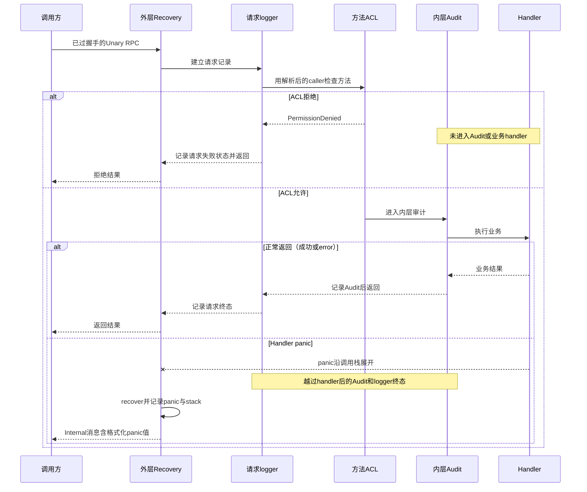

# REST/gRPC 入口、连接身份与服务间安全

> 状态：已实现 · 以 `95141ea2` 核对标准装配、HTTP/Gin、gRPC 拦截器及 SDK；component-base v0.8.0、grpc v1.80.0、Gin v1.11.0 与 Go 1.25.12 的依赖行为单列。源码条件推演不代表事故复现，生产链路仍需独立取证。

## 1. 请求经过哪些信任边界

IAM 在同一进程提供 REST 与 gRPC，两套适配器主要共享 application capabilities，却不共享认证上下文、监听加密、错误出口或客户端配置。先确定每一层认证的是谁，再讨论能否执行操作。

| 层/输入 | 当前可信化方式 | 不能由此证明 |
| --- | --- | --- |
| REST 网络连接 | 可由 Nginx 终止 TLS，也可由 IAM HTTPS 监听；内网 HTTP 为另一段链路 | 已验证用户、可信转发 IP、后端这段也被加密 |
| REST 用户证明 | JWT middleware 在线验 Token，查撤销、Session 与准入，投影请求用户/actor | 该用户拥有任意动作或任意 Profile 的访问关系 |
| gRPC 连接对端 | mTLS 校验证书后，从 leaf 中解析 ServiceName | 被请求的 Subject 已登录、证书 namespace 是业务 Org |
| caller→RPC 方法 | 已加载的 ServiceACL 按 ServiceName 与 FullMethod 判定 | 请求里的 Subject/AppName/Role/Org 自动可信 |
| 请求内容与业务动作 | 各用例的 AuthZ、Assignment 内容准入、ProfileLink/其他关系规则 | 所有 RPC 执行同一套门禁；已准入请求的副作用可因取消自动撤销 |

[TLS 配置合同](https://pkg.go.dev/crypto/tls#Config)与 [gRPC 认证机制](https://grpc.io/docs/guides/auth/)说明通道与凭据的不同作用；IAM 的具体权限仍由真实注册、caller 解析和用例决定。REST/gRPC 并列依赖业务端口可减少规则分叉，但双协议的 DTO、错误、身份来源和机器契约仍需分别维护。IDP GetWechatApp 还直接通过 repository/Vault 解密导出 AppSecret，是现行分层例外，见 [IDP 接口](../02-业务模块/04-IDP/04-模块边界与代码索引.md)。

本文拥有传输信任与失败窗口；[配置主文](../01-运行时/02-配置与传输装配.md)拥有输入合并/转换，[启动](../01-运行时/01-启动与组合根.md)与 [后台/关闭](../01-运行时/03-后台任务就绪与优雅关闭.md)拥有进程任务责任，[AuthZ gRPC](../02-业务模块/03-AuthZ/06-关键链路-gRPC服务间授权与SDK.md)拥有请求内容准入，[密码学](04-密码学密钥与令牌.md)拥有 JWT/Profile 验签差异，避免复制整条业务链路。

## 2. HTTP、HTTPS、gRPC 和探针不是一个入口

[GenericAPIServer](../../internal/pkg/server/genericapiserver.go)将同一 Gin handler 交给 HTTP 与可选 HTTPS：HTTP 总会启动，HTTPS 才有 `BindPort>0` 条件。`insecure.bind-port=0` 仍进入 ListenAndServe，不是禁用开关；HTTP 与 HTTPS 路由门禁相同，HTTPS 不自动增加 JWT，HTTP 也不会免认证。

生产 YAML 模板为 `0.0.0.0:9080` HTTP、HTTPS port=0；仓库 [Nginx 模板](../../configs/nginx/conf.d/iam.fangcunmount.cn.conf)终止公网 TLS 后 proxy_pass HTTP。模板证明分段方案，不能证明生产防火墙、端口暴露或实际 TLS 终止位置。IAM 未装 HTTP→HTTPS 重定向，Secure 只在 `Request.TLS != nil` 时加 HSTS，不读取 X-Forwarded-Proto；模板的 HSTS/80重定向由 Nginx 单独负责。

| 入口 | 构造/可用性事实 | 安全验证还缺什么 |
| --- | --- | --- |
| IAM HTTP/HTTPS | 只设置 http.Server Addr/Handler，读头、读、写、idle timeout 为零；旧 read/write-timeout 配置已退役 | 实际监听与代理/宿主预算；关闭 timeout 不等于请求处理 deadline |
| gRPC 单向 TLS | 非 mTLS 时，完整 cert/key pair 才安装 credentials | `Insecure=false`而无 pair/半套路径可仍无 TLS credentials；完整条件归配置主文 |
| gRPC mTLS | 标准路径加载 cert/key/CA，构造失败返回错误；NewServer硬编码 RequireClientCert=true | 中间映射保留 false 不代表可关闭握手要求，仍需正反握手验证 |
| 主 REST `/readyz` | 聚合 required 组件检查 | 不替代实际用户、方法权限或签发接受 |
| gRPC Health、独立HTTP health端口 | Registry注册后标 SERVING；模板独立端口9091无客户端证书要求 | 不查询 AuthZ freshness；SERVING不是全部方法业务就绪 |

模块状态/端口是否注册与实际监听是不同事实。Suggest 只有 REST，无 gRPC/SDK；受保护路由缺 JWT 等必需依赖时按注册条件跳过，不以无保护方式补齐。进程 RunGroup 并行运行两种 server，不提供 peer 自动取消/join保证，HTTP 的 log.Fatal 也可能直接退出；不能把“某 server 返回 error”写成已经完成全进程清理。

## 3. 代理头与浏览器能力：先看真实中间件顺序

### 3.1 OPTIONS 提前结束，不证明目标路由或认证成功

固定链为 `Secure → Options → Tracing → APILogger → Context → 可选动态 middleware → 路由 middleware → handler`。Options 对 OPTIONS 全路径返回200并 abort，包括不存在路径，不进入追踪、访问日志、JWT、权限或 handler。该行为没有本轮专项实验；顺序与分支来自源码。

Gin OPTIONS 写 `Allow-Origin:*`和固定 allow-headers，但普通响应的 Secure 不写 CORS；Nginx 模板则提供来源白名单、OPTIONS204与普通响应 CORS。`cors.*`模板键没有对应 IAM Options/运行消费路径，不能只改该键就承诺应用行为变化。两份 allow-headers 都未包含 X-Trace-Id、X-Request-ID、X-IAM-Seed-Secret，也没有 expose-headers；浏览器跨域使用/读取这些 header 需要独立契约。

CORS 控制浏览器跨域请求/读响应，不是业务授权。当实际请求能够到达服务端且通过其门禁，缺 Allow-Origin 不能被当作服务端拒绝或副作用未发生的证据。直接到 IAM HTTP、经过 Nginx 与非浏览器调用应分别验收。

### 3.2 ClientIP 当前是元数据，不能直接用作可信身份

IAM 使用 gin.New()，没有 SetTrustedProxies；锁定 Gin 默认信任所有 IPv4/IPv6 peer，优先 X-Forwarded-For，其次 X-Real-IP。Nginx 模板用 proxy_add_x_forwarded_for追加地址。若客户端预先送 `X-Forwarded-For:203.0.113.7`，代理追加真实地址后，当前 Gin 的可信链解析可能取最左伪造项。这是条件推演，未做代理网络复现。

结果进入 APILogger.client_ip 与 LoginRequest.RemoteIP；当前登录 proof builders不消费该 Common.RemoteIP，不能据此认定已经绕过授权、OTP或IP限速。[Gin 官方代理信任说明](https://gin-gonic.com/en/docs/server-config/trusted-proxies/)与锁定源码的默认行为应一起核对。候选必须同时界定可信代理 CIDR及边缘清洗/覆盖头；仅增加 X-Real-IP 而保留 XFF优先关系不能实现该不变量。

Tracing 接受调用方非空 trace/request ID，没有单独格式或长度约束，每次新建 span；这些值用于关联，不认证用户或caller。proxy头、trace metadata、Observability.ServiceName都不应成为权限依据。

## 4. REST 路由各自认证什么

| 路由族 | 当前入口门禁/身份来源 | 后续责任 |
| --- | --- | --- |
| Login、注册、refresh/logout/verify、公共JWKS | 各自解析密码/provider proof/请求Token或公开材料，不统经JWT middleware | AuthN具体用例验证，不把公开路径误标成用户已认证 |
| Identity/current Linking | JWT在线验证后注入用户、原认证时间和当前入口 | 应用关系/所有权与敏感操作规则；没有通用全资源Permission门禁 |
| AuthZ/IDP/JWKS管理 | JWT＋按实际注册的resource/action权限门禁 | AuthZ管理写在应用复核动作；IDP/JWKS由路由检查动作，应用执行各自业务与材料规则 |
| Suggest查询 | 必需JWT，路由Permission另有AuthZ装配条件 | 应用ScopeResolver/范围检查拥有独立职责 |
| Seed mock | Enabled＋非空共享秘密才注册，trim后恒时比较header；不走JWT/AuthZ | 无IP/环境禁止门禁；秘密注入与调用范围由宿主负责 |
| `/debug/routes`、`/debug/modules` | 所有模式注册，无JWT/AuthZ | 不应把cache-governance在release下的管理保护推广到它们 |

JWT提取顺序为非空 Authorization、query token、access_token Cookie；非空坏 header 不向后回退。AuthRequired将验证error/无效响应统一折叠为401/ErrTokenInvalid，包括底层故障与取消，不是所有失败都表示密码/Token确实错误。AuthZ middleware则对policy unavailable给503，普通checker error给500，明确拒绝给403；两端不能仅凭“都是鉴权失败”统一重试或提示。

这些责任由 [Linking](../02-业务模块/02-AuthN/03-关键链路-Linking登录身份绑定.md)、[REST管理](../02-业务模块/03-AuthZ/05-关键链路-REST管理与路由授权.md)及 [Suggest查询](../02-业务模块/05-Suggest/03-关键链路-SuggestProfile查询.md)具体维护。OpenAPI仍存在AuthZ管理缺security声明、微信注册继承全局bearer的偏移；真实门禁与schema需分别查 [契约治理](../04-接口与SDK/01-REST-gRPC与契约治理.md)。

标准request context经Tracing/APILogger/JWT的WithContext继续传递，大部分handler使用`c.Request.Context()`。Suggest实传`*gin.Context`且ContextWithFallback=false，其Done/Err/Deadline不回退标准request context；不能宣称取消到达所有应用。即使ctx到达，下游仍需合作；取消不撤销已提交事务，详见 [MySQL提交边界](01-MySQL事务与迁移.md)。

## 5. mTLS 证书可信，解析后的服务名仍需单独约束

额外证书白名单对CN、OU、DNS SAN分别检查：非空类别都需通过，每类内任一命中即可；allowed-sans不涵盖URI/IP等全部SAN类型。DNS的`*.example.com`使用后缀匹配，也可接受a.b.example.com，不等同于单层DNS名称校验。生产模板只配置OU白名单，非实际部署证明。

IAM实际使用component-base的interceptors/mtls身份解析器：从peer.TLSInfo leaf取身份，SPIFFE URI中的sa服务名优先，没有URI服务名才回退CN。含`.svc.`的长CN取第一个点前名称；`qs-apiserver.svc`原样保留。当前未增加trust-domain/namespace绑定或CN/URI一致性validator，多URI/重复路径段还可覆盖先前解析值；同依赖目录下另一套identity helper不能被当成已装配代码。

例如受信CA签发、OU合格，CN=`qs-apiserver.svc`而URI的sa=`admin`：证书附加限制可能通过，最终ACL使用`admin`，不使用CN；是否允许继续取决于方法规则。例子不证明调用方能自行取得这种证书，也没有本轮变体实测。证书签发规则、规范化ServiceName和ACL key必须共同审核，不能把“CA受信”解释成caller只能来自CN。

mTLS连接仍须完成握手，即使后续方法被identity/ACL skip。当前默认skip为Health Check/Watch与reflection v1alpha，不能扩大为全部reflection版本；grpc注册的stable reflection与v1alpha需要分别验证。独立HTTP health端口不经该握手。

gRPC caller、请求Subject与用户Actor是不同输入。Check/Snapshot不把caller绑定Subject/AppName，也不查目标用户Session/准入；AuthN LoginIdentityService用户Actor来自protobuf，由获准服务断言UserID、认证时间和可空当前入口ID。REST Linking从在线Claims构造Actor，两条路径不能混写。Assignment内容限制与通知AppID allowlist又是方法级责任，具体合同保留业务主文回链。

## 6. 方法 ACL、凭据扩展与拦截器顺序

### 6.1 ACL 是加载后的规则，开关不等于所有门禁已存在

通用Server只有ACL.Enabled且ConfigFile非空才加载，只有非nil ACL才挂拦截器；加载失败返回错误。标准AuthZ在ACL启用时还用LoadWithACL拒绝空/不可读路径并核对部分Assignment写方法，因此不能从通用分支推成正常AuthZ启动可静默省略ACL。显式关闭ACL时，不执行该方法门禁，内容准入及特定方法caller限制仍保留。

规则为deny优先、exact或末尾`*`前缀匹配；default_policy=allow影响未知服务，已登记服务仍须命中allowed。当前模板default deny，文件在启动读取，没有IAM热更新调用。新增/重命名方法、证书解析后的caller变化均须同步规则。Assignment交叉校验枚举Grant/Revoke/Managed Replace，当前漏Scoped，不能据绿色loader测试承诺全部写方法已覆盖。

### 6.2 配置字段存在，不证明可用应用凭据

标准服务身份使用mTLS/ACL，ServiceToken机制已退役。Auth.Enabled分支构造空CompositeValidator，未注册Bearer/HMAC/APIKey验证器，普通凭据会因unsupported映射Unauthenticated；不能只切开关就启用组件文档里的机制。

即便以后注册validator，require_identity_match只在mTLS身份存在且已验证Credential.Subject非空时比较服务名，缺一项就跳过；它不要求两份身份必然存在。Unary映射false为WithoutIdentityMatch，stream没有对应映射，仍保留组件缺省true。组件HMAC签名覆盖access key/timestamp/nonce，不绑定RPC method/body；timestamp仅限制时间窗，nonce可空、store可缺省，Exists/Store分开且Store error被忽略。因此这项未装配能力不是IAM已有请求签名或严格防重放合同。

### 6.3 Unary 与 stream 不完全相同

| 顺序/能力 | Unary | Stream |
| --- | --- | --- |
| 最外层恢复/专用ID | Recovery→RequestID→request logger | 无Recovery与专用RequestID，stream logger自行生成追踪/ID并包装context |
| 身份/凭据/方法门禁 | mTLS（启用）→Credential（启用）→ACL（启用且已加载） | 有对应链，但identity-match映射和拒绝日志与Unary不同 |
| Audit（启用） | 在handler正常返回后记一次 | 流结束时记一次，不按每条消息重新授权/审计 |

现行IAM proto无业务streaming RPC，Health Watch/reflection仍是stream；差异是新增业务流前必须明确的合同，不能据此称已证明某业务流漏洞。

## 7. 拒绝、业务错误与 panic 分别留下什么证据



图中省略可选Credential及身份提取以突出控制流；握手失败尚未进入图中RPC。ACL/凭据/mTLS身份拒绝可由外层请求logger记录状态，却未进入更内层Audit；handler panic时Audit/logger尾部没有defer，均被跳过。IAM未配置Audit RequestIDExtractor，默认Audit无request ID，默认logger也不输出StatusMsg/CertCN/CertOU；不能据Audit.Enabled承诺完整拒绝审计或同一ID关联原cause。

[ToStatusError](../../internal/pkg/grpc/error_mapper.go)显式被调用时，普通Go error以及Internal/Unknown/DataLoss等status输入会归一安全文案；注册coder保留其静态String。没有全局自动转换所有handler返回值。更具体地，当前Unary Recovery直接调用锁定组件，返回`Internal + 格式化panic值`，不再经IAM mapper；若panic值含内部路径，可能进入wire消息。这是源码条件推演，未做panic网络实验，也不是本轮已修复的能力。

REST Core/BaseHandler使用注册coder静态String，BaseHandler只记safelog分类元数据，APILogger不读header/query/body/handler error；原cause可能被刻意省略。动态middleware默认空，Gin Recovery不是默认挂载：普通panic可由net/http记录原panic/stack并中断连接或HTTP/2流；显式recovery对尚未提交响应的普通panic返回裸500，brokenPipe或已提交响应时不保证500，均非Core JSON合同，debug/brokenPipe请求dump仅遮Authorization，Cookie/query/Seed头不在该遮罩内。显式dump使用gin-dump默认headers/body/response输出stdout，release没有拒绝该选项的门禁。

所以“详细error只进入安全日志”“日志必保留root cause”都不是全链路保证。静态架构护栏检查选定IAM logger/service/mapper源码，未覆盖锁定依赖Recovery、可选dump、代理或所有日志。公开错误、内部分类、受控细节和拒绝审计需要分别设计，具体处置回链 [日志手册](../05-工程质量与运维/04-安全日志与凭据处置.md)。

## 8. 换证文件、新握手与旧连接是三个时刻

reload重建builder配置，而已安装credentials持初始clone，没有动态交接；当前不能由“文件重读成功”承诺新握手使用新cert/CA。任务启动/停止的所有权归后台主文，这里关心身份的接受窗口。

旧HTTP/2连接的AuthInfo来自最初握手，每次RPC提取leaf身份，但没有每RPC检查NotAfter。若证书在连接建立后到期，不能保证下一次RPC拒绝；已有expired测试是握手前已到期，二者不同。MaxConnectionAge默认2h、grace10s，grpc有±10% jitter，这是连接年龄策略，不是证书到期触发器。Go恢复握手仍有证书期限/信任检查，不能将已建立连接的持续身份扩成“恢复握手也不检查”。

TLS材料切换、ACL变更与业务撤权有不同响应路径：配置文件无热更不等于规则已经改变；即使将来动态交接新配置，也不自动关闭旧连接或终止在途业务。PKI/部署、IAM transport与宿主client需明确新连接代次、旧连接drain、恢复会话和最大撤销窗口，再用真实新旧连接验收。

## 9. SDK 的不同请求路径拥有不同信任配置

| SDK入口 | 当前材料/连接owner | 不能从统一Config推导 |
| --- | --- | --- |
| NewClient gRPC | WithDefaults→构造credentials→非阻塞Dial；Client复用并Close共享连接 | 构造成功不证明握手、方法ACL、业务就绪；构造ctx不拥有后续连接寿命 |
| JWKS借AuthClient | 复用宿主已创建Client | 借用者不另关闭共享连接，信任配置取决于该Client实际选项 |
| 独立JWKS GRPCEndpoint | 固定insecure，不继承Client.TLS | 填统一TLS并不能保护这条新连接 |
| AuthN REST子客户端 | 默认http.DefaultClient或宿主显式HTTPClient，请求有ctx | 不继承gRPC TLS/Timeout/Retry；URL只要求scheme/host，无https allowlist或自定义redirect门禁 |
| HTTP JWKS fetcher | 独立HTTPClient，来源与刷新预算另配 | 公钥可公开不等于来源完整性可忽略；当前无https/redirect或ReadAll大小上限 |

### 9.1 被加载的开关与实际构造的开关

EnvLoader的TLS_ENABLED=false、Viper getter得到布尔false时返回nil TLS；Retry关闭同理。NewClient再WithDefaults把nil填成Enabled=true，因而这些加载器的“关闭”在标准构造时可能恢复默认。程序传非nil `TLSConfig{Enabled:false}`或`RetryConfig{Enabled:false}`才保留false；低层BuildTLSCredentials(nil)则直接明文，不能混成一个入口。该链属源码推演，现有loader正向测试未覆盖false→NewClient。

### 9.2 材料来源不是逐字段自由混配

| TLS输入 | 当前选择 |
| --- | --- |
| CA内存PEM与文件都提供 | PEM优先，失败不回退；显式CA创建新pool替换系统根，未提供CA才用系统根 |
| 完整cert/key PEM对，或完整文件对 | 先由“完整PEM对 OR 完整文件对”决定是否加载，再按ClientCertPEM非空选PEM，否则文件 |
| 完整文件对＋只有CertPEM | 进入加载，但选缺KeyPEM的PEM路径，可失败；不是回退完整文件 |
| 完整文件对＋只有KeyPEM | 选文件，忽略单独KeyPEM |
| CertPEM＋只有Key文件，无完整对 | 不加载客户端证书，也不以半套配置直接报错 |

ServerName用于服务端名称验证与SNI；为空可由grpc authority/target补校验名，不能写成自动关闭验证。InsecureSkipVerify直接透传，跳过服务端链/名称验证，标准TLS构造没有环境门禁或替代验证hook；它不禁止发送客户端cert，也不阻止服务端校验客户端。MinVersion仅对0填TLS1.2，统一Validate主要检查Endpoint。证书/CA在构造时加载，无客户端文件重读任务。

公开WithDialOptions追加在自动选项之后，自定义WithTransportCredentials/WithDefaultServiceConfig可覆盖先前配置；Config.TLS.Enabled不是所有公开构造的实际安全证明。默认RPC Timeout字段未设置方法deadline，调用方仍需请求ctx截止；重试策略不证明写入幂等或提交结果，详见 [SDK接入](../04-接口与SDK/02-Go-SDK与业务系统接入.md)。metadata仅透传且已有context值优先，stream无默认metadata链；x-service等声明不改变服务端从证书解析caller。

### 9.3 307重定向能跨过初始URL的信任判断

AuthN REST默认http.DefaultClient未由SDK设置总超时，也没有自定义CheckRedirect；JWKS的独立HTTP预算由RequestTimeout或自定义HTTPClient决定。Go默认301/302/303可将POST改GET；307/308在可重建body时重发原body，SDK用bytes.Reader构造请求具备该能力。若已配置登录URL返回307到另一origin或HTTP地址，password/code body可能被发送到新址；这是源码条件推演，未做重定向实验。

不能扩大成“所有认证头都会跨任意origin泄露”：Go对Authorization/Cookie等按host/子域规则限制，但同host的HTTPS→HTTP没有独立scheme门禁；SeedMock自定义秘密头不在该名单，也可能复制到新址。TLS/Origin/redirect/body预算必须由HTTP构造和宿主接入共同定义，填gRPC TLS不会解决这条链路。

## 10. 哪些候选才能补上这些具体合同

以下均未实施，不能通过只改模板开关获得。

| 问题与owner | 候选不变量/实现边界 | 收益、迁移成本与验收 |
| --- | --- | --- |
| 安全输入分散；服务端/SDK构造 | 规范化Plain/TLS/mTLS模式，拒绝缺/半套pair；loader保留显式disabled；区分材料源，约束覆盖credentials的公开选项 | 让最终有效配置可判定；会改变旧输入接受范围，需各输入模式、真实CA/SAN/客户端cert正反握手 |
| 代理IP与浏览器；边缘/IAM路由 | 边缘清洗头＋IAM可信CIDR，明确直连策略；单一CORS owner，按请求类别定义allow/expose headers | 可信元数据与浏览器能力一致；部署拓扑变动要复核，CORS仍不承担业务授权 |
| 证书名/换证/旧连接；PKI与transport | 规范化单义ServiceName并绑定trust-domain/namespace；动态凭据交接有代次，定义旧连接/恢复/drain与到期预算 | caller/ACL key迁移需协调；文件更新成功之外，要验证新旧连接、在途请求与失败保留旧配置 |
| 拒绝/panic缺证据；IAM公共错误/审计 | 恢复器固定安全文案；明确握手、认证、ACL、业务error、panic各记录owner与公共ID，分类代替无条件原cause | 仅外移Audit拿不到下游派生身份；需拒绝分支结构化记录/受信peer读取及defer收尾，验证完整wire而非字符串护栏 |
| HTTP新址/无预算；SDK HTTP与宿主 | 默认HTTPS、同origin且禁止降级或禁redirect，显式loopback例外；为HTTP JWKS补读取上限，REST明确现有4MiB LimitReader截断及超限错误合同，配置HTTPClient/请求deadline | 初始URL信任延伸到全部跳转；兼容本地测试及旧HTTP需独立迁移，验证302/307、秘密头和总预算 |
| 引入凭据或业务stream；组件协议/IAM装配 | 显式注册validator，要求两份身份存在后比较；请求签名绑定method/body并原子防重放；stream明确恢复/逐消息准入 | 不能借通用接口声明现行能力；协议/存储/取消与重试均需新fixture，不只开Auth开关 |

生产接入证据至少绑定服务SHA、实际生效配置与方法：正确证书、错误CA/名称/缺证书/已过期证书、新旧连接换证、允许/拒绝caller、受信用户输入/错误Subject及内容准入分别验证。日志与Audit的拒绝证据也要检查实际输出。源代码、模板、SERVING或构造成功都不能代替这组接受证据；本篇未执行生产操作。

## 11. 现有证明与修改定位

| 本轮既有测试 | 能支持的结论 | 未覆盖的边界 |
| --- | --- | --- |
| REST路由/JWT/AuthZ/Seed、Core/requestctx/safelog | 显式依赖下注册/跳过、部分身份映射、动作与status、先认证后DTO、固定安全分类 | 真实监听/代理、OPTIONS/CORS、trace输入、dump/Recovery、Suggest取消无专项 |
| gRPC mapper/映射/Registry/架构选测 | 局部错误转换、字段映射、注册描述及固定源码护栏 | 配置已映射不证明握手；静态守卫不覆盖组件Recovery和全部handler |
| AuthZ两项、通知一项本机mTLS测试 | 临时CA/cert的证书正反与方法/特定caller/AppID门禁；Bearer不改变caller | 业务用替身；URI/CN变体、运行后到期、reload新旧连接、Audit/panic/stream均未专项 |
| Assignment LoadWithACL选测 | 当前枚举方法的配置覆盖检查 | 不证明漏枚举Scoped已覆盖或每个RPC运行校验 |
| SDK配置/transport/typed客户端/HTTP/JWKS | 正向默认、service config可被grpc构造接受、httptest路径/header/body/envelope、loopback获取 | 未测试TLS builder材料矩阵、loader false恢复、自定义Dial覆盖、307降级/异源、真实重试副作用；部分只是构造后Close |

本轮选择的测试只使用临时材料、httptest、loopback TLS/HTTP/gRPC、stub与内存对象；不读取真实证书、不访问外部数据库/Redis/provider/PKI。执行选择、pass/Skip和源摘要见 [阶段台账](../_data/reviews/2026-10-06-docs-refactor.md)，摘要绑定不是逐文件行为覆盖。根middleware包没有测试，不能将compile-only计为安全行为已通过。

```bash
make docs-hygiene docs-facts
# gRPC构造/错误及真实本机mTLS测试均为既有用例，完整REST/SDK选择见台账
go test -race -count=1 ./internal/pkg/grpc
go test -race -count=1 ./internal/apiserver/transport/grpc/service/authz \
  -run '^Test(MTLSAuthorizationWithoutServiceToken|CommittedPolicyVersionRequiresQSServiceCertificate)$'
go test -race -count=1 ./internal/apiserver/transport/grpc/service/authn \
  -run '^TestMiniProgramRecipientLookupRequiresMTLSACLAndAppAllowlist$'
```

代码入口：[HTTP server](../../internal/pkg/server/genericapiserver.go)/[middleware](../../internal/pkg/middleware/middleware.go)、[REST注册](../../internal/apiserver/transport/rest/module_routes.go)、[JWT](../../internal/pkg/middleware/authn/jwt_middleware.go)/[AuthZ](../../internal/pkg/middleware/authz/middleware.go)、[gRPC Server](../../internal/pkg/grpc/server.go)/[error mapper](../../internal/pkg/grpc/error_mapper.go)、[SDK TLS](../../pkg/sdk/internal/transport/tls.go)/[dial options](../../pkg/sdk/internal/transport/dial_options.go)、[HTTP子客户端](../../pkg/sdk/auth/internal/restclient/client.go)。跨协议schema、业务权限和生产PKI各有owner，修改时按实际信任链检查caller、用户、内容和错误出口。
