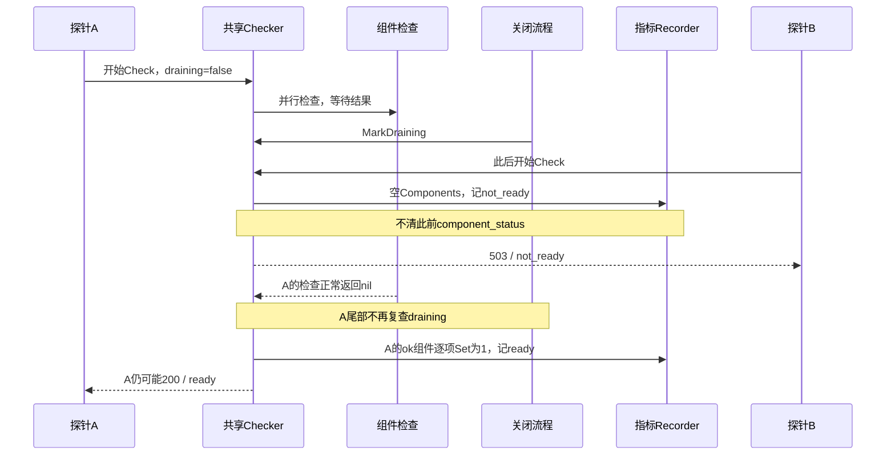

# 观测信号、采样时效与故障定位

> 状态：已实现 · 以 `95141ea2` 核对装配、更新点与发布脚本；component-base v0.8.0、go-gin-prometheus v0.1.0、client_golang v1.22.0、Zap v1.27.0 按锁定源码解释。失败时序是条件推演，外部采集、报警与生产结果仍需独立证据。

## 1. 先确定观察的是哪个对象、哪个时刻

IAM提供进程探针、组件采样、Prometheus端点、结构化日志与自定义关联ID，分别回答进程是否响应、本次是否允许接流量、代码是否走到计数点、请求如何关联。它们没有共同的业务提交版本，也不构成完整请求或消息账本。

| 观察对象 | 当前信号/owner | 仍需另取的事实 |
| --- | --- | --- |
| 镜像与进程 | image tag、`/version`、process start time；构建/发布拥有绑定责任 | digest、有效配置、迁移状态、业务接受 |
| 接流量资格 | 主REST `/readyz`；Checker聚合组件，进程标draining | 已发探针/在途请求、代理摘流与下游取消 |
| 本实例业务能力 | AuthZ freshness/版本、Suggest刷新、JWKS元数据、撤销worker指标 | 其他实例、持久事实与具体用例结果 |
| 请求与失败 | REST/gRPC logger、业务计数及自定义ID | 未进入计数点、前置拒绝/panic、缺失或被采样记录 |
| 采集与通知 | 本仓有端点和一次性巡检 | 外部scraper、存储、dashboard、报警路由与持续可达性：`unknown` |

本文拥有信号语义、采样时效和排障推理；[后台、就绪与关闭](../01-运行时/03-后台任务就绪与优雅关闭.md)拥有八项检查、任务及完整关闭顺序，[传输安全](05-传输层与服务间安全.md)拥有身份与拒绝/panic控制流，[日志处置](../05-工程质量与运维/04-安全日志与凭据处置.md)拥有凭据和副本处置。避免为“有监控”再复制三套运行合同。

## 2. 同名探针必须带地址和响应合同

| 标准入口 | 实际读取/返回 | 不能推导 |
| --- | --- | --- |
| 主HTTP9080 `/healthz` | 通用Server固定成功envelope，无外部依赖检查 | DB、模块、业务或readiness成功 |
| 主REST `/readyz` | Checker Snapshot：ready=200，否则503；仅组件status/checked_at，不含原error | 失败原因、耗时、全部任务已停止 |
| 主REST `/health` | 注册时模块Available的兼容摘要；degraded仍HTTP200 | 当前依赖健康；Nginx公开`/health`也不是readyz |
| `/debug/modules`、`/version` | 装配状态与构建信息 | 动态健康、可信镜像来源或用例通过 |
| 主REST `/metrics` | 默认注册表的当前exposition，无JWT/AuthZ | 持续抓取、全部series已创建或业务源最新值 |
| gRPC Health Check/Watch | 已写入health server的service状态 | 主REST组件矩阵；客户端已启用健康策略 |
| gRPC独立HTTP health端口，模板9091 | `/healthz`和`/readyz`读整体SERVING；`/livez`固定200 | 主HTTP同名路径含义、mTLS或业务RPC可调用 |

端口为模板值，实际可改。标准通用配置沿用EnableMetrics=true；ServerRunOptions没有对应YAML开关，低层GenericConfig可程序化置false。EnableProfiling字段虽存在，pprof安装代码目前注释，不能据字段宣称有诊断端点。

gRPC注册后整体及已注册service被标SERVING，不逐次执行freshness/数据库检查。标准beginDrain标主Checker draining并将gRPC整体空service名设NOT_SERVING；各命名service到后续Close才改变。因此按空名、具体service或主REST采样可不同。[gRPC健康协议](https://grpc.io/docs/guides/health-checking/)要求应用更新服务状态；IAM更新点与客户端配置分别查代码，Health存在不证明自动摘流。

## 3. 指标定义、注册和导出是三个动作

### 3.1 默认注册不保证每个标签已有series

多数业务指标在包初始化经promauto注册到默认registry，HTTP端点使用默认Gatherer；模块停用不自动注销。无标签Counter/Gauge可先导出零；Vec首次WithLabelValues才创建特定series。“没有failed行”可能只是没有触发该标签，标量零也不证明worker运行。Counter跨重启归零，窗口应绑定实例/进程起点，不能把重建后小值当改善。

重复注册不是自动复用：promauto的MustRegister冲突会panic；go-gin-prometheus冲突仅log，却继续持有新collector，第二个Server可能往未注册对象计数。这是同进程多次构造的源码条件，未做重复注册实验；测试关闭EnableMetrics不能证明这条实际接线。

### 3.2 通用HTTP指标的url/host没有低基数保护

锁定go-gin-prometheus用`c.Request.URL.String()`作url标签，含query；host取请求Host。IAM未装URL映射、模板替换、Host归一化或UseWithAuth。APILogger只读URL.Path的安全约束不覆盖指标。

例如无Authorization时，已注册受保护的`GET /api/v2/identity/me?token=T`可由JWT middleware读取query token；正常返回后，`gin_requests_total`的url标签仍可含`?token=T`，无论T被允许或拒绝。任意query、动态404路径与Host也可扩大series。这是源码推演，未发送真实Token或做泄露实验；不能将“全部标签是稳定枚举、不含credential”写成当前保证。[Prometheus标签指导](https://prometheus.io/docs/practices/instrumentation/#do-not-overuse-labels)说明每个labelset的成本；修复须先定义安全维度，再决定统计哪些请求。

| 请求类别 | 当前gin HTTP计数 | 原因 |
| --- | --- | --- |
| `/healthz` | 不覆盖 | 在安装指标middleware前已注册 |
| exact `/metrics` | 不覆盖gin计数 | 按完整URL等于metrics path跳过；promhttp仍有scrape指标 |
| `/metrics?x=1` | 可覆盖 | 完整URL不等于`/metrics` |
| `/readyz`、后注册业务、普通404 | 正常返回时覆盖 | 包括探针，不等于用户请求量 |
| OPTIONS | 不覆盖后续链 | Options在Tracing、logger和指标前abort |
| panic | 不保证终态计数 | c.Next后的更新可能被异常展开越过 |

未经修复的url维度不能被直接当作无敏感材料的看板输入；既有采集副本的处置又是独立责任。

## 4. 高信号指标按更新点解释

下表是诊断入口而非穷尽清单。Help文本、名称或数值不能替代调用点；业务合同回链各模块。

| 实际指标/标签 | 更新者与含义 | 重要缺口 |
| --- | --- | --- |
| `iam_readiness_checks_total{result}`、`iam_readiness_component_status{component}` | Checker返回前计数/逐组件Set，result为ready/not_ready | scrape不触发检查；空draining Snapshot不清旧组件 |
| `iam_authz_native_checks_total{result}`、`expired_checks_total`、`freshness_age_seconds` | 判定/查询与Reconcile更新本实例信号 | age按调用时Set，不随scrape增加；Snapshot/角色名查询不都进入checks_total |
| `iam_authz_native_loaded_policy_version_max`、`policy_version_lag_max`、`subscription_registered` | 加载最大版本、已观察lag与订阅注册 | lag只含已观察target；registered不是Broker连通/全实例接受 |
| `iam_authz_native_reloads_total{result}`、`reload_duration_seconds`、`version_check_failures_total` | 部分reload尾部与Reconcile错误 | gate等待取消不计reload/latency；version失败计数含其他Reconcile错误 |
| `iam_identity_session_revocation_tasks{status}`、`oldest_seconds` | worker.runBatch尾部两次SQL成功后更新 | SQL/ctx错误保留旧值，读取非同一快照；readyz另查age，不刷新Gauge |
| `iam_suggest_refresh_total{kind,result}`、`last_success_timestamp_seconds{kind}`、`refresh_items_total{kind,operation}` | 正常刷新结果、成功时间、输入upsert/tombstone规模 | 空Delta也成功；不是变化行数/召回完整性；早退/panic不同于普通failed |
| `iam_suggest_queries_total{strategy}`、`rate_limited_total{kind}` | 策略选择后的计数、handler识别的限流拒绝 | DTO/JWT/范围等前置失败不全计入；不是全部请求/拒绝 |
| `iam_jwks_rotation_attempts_total{result}`、`keys{state}`、`post_commit_failures_total{stage}` | 成功Bootstrap激活、创建/轮换结果及状态统计 | Bootstrap失败/未激活早退不计；success与尾部失败可并存，state_count失败保留旧Gauge，初始化也用post_commit名 |
| `iam_authz_http_authorization_total{resource,action,result}` | 动作检查在c.Next前的结果 | allowed不是业务完成；JWT前置拒绝不计，resource/action主要由固定注册点提供 |
| `iam_grpc_assignment_authorization_total{service,operation,result}` | 内容准入，service来自证书caller | replace还包含读取Assignment facts；非空service未归一固定集合，依赖PKI/ACL边界 |
| `iam_authn_otp_verification_total{scene,result}`、JWT兼容及audience失败计数 | 有界scene或走到的兼容/当前必需验证分支 | OTP未知scene折叠unknown；audience失败不是历史fallback，计数不是送达/最终登录或全部Token错误 |

同前缀的短名均延续该组前缀，例如`oldest_seconds`完整名为`iam_identity_session_revocation_oldest_seconds`。AuthZ授权allowed计数与后续业务失败可同时出现；JWKS activation success与post_commit failure并存说明激活后尾部失败。active keys=1不证明PEM日常仍匹配，见[密钥与令牌](04-密码学密钥与令牌.md)。Outbox bucket、published、FIN/失败审计与业务回执分别判断，见[事件交接](03-事件与Transactional-Outbox.md)。

## 5. Readiness响应和Gauge各有时间窗口

标准组件预算500ms、聚合2s，生产drain delay模板5s；不是curl或关闭总期限。标准Checker非nil且未draining时启动八个组件goroutine，draining入口直接早退；context只要求合作，忽略ctx的检查可在Snapshot返回后继续运行。Observer同步执行，结束前不复查draining；checked_at是开始构造Snapshot的时间，不是检查全部完成时间。



图是条件时序，不是新并发测试。drain前已开始的A不会因B收到503自动拒绝，组件Gauge可仍为1。无drain时并行探针也按完成先后覆写，scrape读各Gauge不拥有共同业务版本。optional失败可整体ready；Suggest禁用时检查返回nil也记组件1，不能据它证明索引运行。

Snapshot不公开原cause，但目前也没有每组件耗时/失败分类、样本代次或最近成功时间。仅status时先定位组件，再检查独立依赖与持久事实；不要凭not_ready重复purge/migration/revoke来制造“修复”。八项阈值、nil/required/optional与超时分支由[运行时矩阵](../01-运行时/03-后台任务就绪与优雅关闭.md#3-八项组件检查存在性证明与积压分开)维护。

AuthZ还要分请求freshness、`ReloadHealth=fresh && syncReady`与完整readyz。例如v41仍在确认预算内，v42撤权reload失败：lag/degraded可出现，某些读仍按v41判定；同期MySQL Ping失败则完整readyz失败。不能把lag当立即拒绝，也不能凭未degraded宣告全进程可用。

## 6. 后台成功与实时完整性不能混为一谈

Suggest的last_success为正常成功结束的Unix时间，空Delta也更新；HasSuccessfulRefresh一次成功后保持true，后续失败不清除。首次Full前的Delta调用/缺source早退可不记录，overlap有结果但无duration；panic的duration defer仍执行，但runErr不因此成为failed。新鲜时间不证明游标无漏晚提交，failed=0也不排除这些异常，见[刷新主文](../02-业务模块/05-Suggest/02-关键链路-索引刷新Full-Delta.md)。

撤销Gauge也不是在线源：T0 worker记录oldest=0，T1 DB读取失败、任务仍待撤销，Gauge可继续为0；readyz独立读age失败则503。先看worker、读取成功与持久任务状态，不能只盯旧零值；本轮未做该SQL故障实验。

下面按现有名称写诊断表达式，**不是已部署的规则**；job/instance与series出现情况由采集端决定，各式只观察一层。

```promql
# 完成的探针，不是持续可用时间比例
sum by (instance, result) (rate(iam_readiness_checks_total[5m]))
# 成功刷新后的时间，不代表完整性；kind series可能尚不存在
time() - iam_suggest_last_success_timestamp_seconds
# 已观察版本lag；0不能排除未知target
iam_authz_native_policy_version_lag_max
```

[Prometheus时间戳指导](https://prometheus.io/docs/practices/instrumentation/#timestamps-not-time-since)解释为何最近成功时间比停更age更可判定；IAM尚未为全部后台源提供相同成功时间/读取失败合同。报警窗口需结合运行代次、缺series、停用与预期空闲，不能直接把上述值转成统一可用性SLO。

## 7. 关联ID、日志和真正的Trace分别具备什么

REST读`X-Trace-Id`，gRPC读incoming `x-trace-id`，缺失则生成；每次新建span_id。标准路径未抽取W3C traceparent、父span/baggage，没有server span/provider/exporter装配。[OTel传播合同](https://opentelemetry.io/docs/concepts/context-propagation/)说明跨进程因果关系需发送端注入/接收端抽取；相同字符串支持日志关联，不证明有分布式Trace。

| 记录路径 | 当前字段/等级 | 留白或分裂 |
| --- | --- | --- |
| REST APILogger | 开始Info，4xx结束Warn、5xx结束Error，成功结束Debug；path不读query/body | 默认Info下无成功结束行；health/ready/metrics跳过，OPTIONS更早短路 |
| 请求logger.L(ctx) | 显式注入的logger/trace字段 | 普通log.Infow/Errorw不自动提取ctx，不保证每条应用日志有三种ID |
| gRPC专用RequestID→IAM logger | 前者生成组件ID B，后者从metadata取A或再生成，写log typed key | component accessor可仍B，请求日志A；Audit未配置ID extractor |
| 安全错误出口 | Core/BaseHandler静态文案/分类，显式gRPC mapper转换 | cause可省略；Recovery/dump/前置拒绝并非统一受控细节流 |

传入`x-request-id=A`不阻止前一interceptor生成B，仅按A搜不能承诺找到全部组件记录。这是源码路径，未专项字段传播实验。当前ID只承担关联用途，未定义幂等合同，不能仅凭其值证明身份或请求唯一性；候选客户端键还需与可信主体、方法和请求指纹共同绑定。拒绝/panic尾部是否执行及公共消息边界，保留[传输控制流](05-传输层与服务间安全.md#7-拒绝业务错误与-panic-分别留下什么证据)的具体结论。

## 8. 日志输出分支决定采样和保留

锁定component-base先选分级Core，再选时间轮转Core，最后才是普通Zap配置。普通分支按同级别/同message每秒100:100采样，不按字段request ID分桶，高频不同请求可能缺行。生产模板启用分级输出/时间轮转，自定义Core没有该sampler；不能笼统称生产日志已采样或完整日志永远可用。

生产模板向stdout/stderr及配置基名`/var/log/iam/{app,warn,error}.log`重复输出；时间writer实际首次写入/换日才打开`app.YYYY-MM-DD.log`等文件，初始化成功不证明文件可写。compose挂至宿主`/data/logs/iam`，Docker json-file另有10m×3策略。同条错误多sink不能累加成请求失败次数。YAML写100MB/10备份不等于各分支都消费：时间轮转writer使用日期、MaxAge/compress，未用MaxSize/MaxBackups；普通路径也不自动提供同样轮转。文件、Docker、外部平台和离线副本各有保留域。

开发compose将宿主相对目录logs挂至容器`/var/log/iam`，dev YAML却使用相对`logs/iam-*.log`，Docker WORKDIR=/app，按配置会落`/app/logs`而非该挂载。这是路径推演，未起容器验证；不能让操作者按`logs/apiserver.log`寻找全部部署日志。

初始化可panic，Flush忽略Sync error；app的defer Flush不覆盖Fatal/os.Exit。条数不是完整审计账本，退出日志也不证明全部sink已持久化。GORM Silent测试证明不求值/输出SQL callback，不证明所有logger、panic/dump、消息payload、URL指标或外部副本都脱敏；约束与处置由[日志手册](../05-工程质量与运维/04-安全日志与凭据处置.md)分别落实。

## 9. 发布、巡检与关闭回执怎样读

| 路径 | 当前判定/动作 | 结论范围 |
| --- | --- | --- |
| remote-deploy | 每轮health200后才取ready，必须双200，最多30次，失败间隔5s | curl无connect/max-time；145s最大sleep不是总预算，双200非同时快照 |
| 发布期间曾观察到live，最终门禁失败 | 以liveness_seen历史值归类readiness失败，不重启；重新取readyz筛固定组件status | 最后可能已不live；漏required domain_event_outbox，outbox单独失败可诊断全ok，也非原失败Snapshot |
| server-check每30分钟/手动 | health非200硬失败，ready非200只WARNING；job8min | 其他硬门禁成功可打印All health checks passed，不等于ready成功 |
| 同一巡检Docker unhealthy | 原始logs后restart一次，等15s检查 | 有运维副作用，不是只读监控；不能为本轮取证自动触发 |
| version/metrics | image tag末尾40位小写SHA与gitCommit文本比较，metrics有process_start_time_seconds行 | 不证明digest/来源、指标值、业务series、持续采集/报警 |
| TCP/磁盘 | 空host/无nc可跳过，磁盘>80%只WARNING | 连通不证明认证/Ping，warning不证明通知发送 |
| 标准信号关闭 | 可靠停止门禁失败阻止后续关闭，普通hook/cleanup error只日志 | shutdown complete可与普通错误并存，无逐阶段结构化成功回执 |

发布失败先保存原响应的地址/时间/status，再看完整outbox bucket与依赖；诊断重新采样全ok不否定原失败。关闭失败绑定exit code、门禁与资源保留，按[关闭合同](../01-运行时/03-后台任务就绪与优雅关闭.md#5-信号关闭固定局部顺序与两道资源门禁)恢复；两道各自timeout、无界hook和HTTP/gRPC尾部仍分别取证。

仓库未检索到scrape_configs、dashboard、报警规则/路由或collector部署；Docker README推荐清单不构成接线。外部环境有无采集是unknown，本篇未触发巡检、部署、重启或通知。

## 10. SDK观测属于宿主，不继承服务端接线

DefaultConfig/WithDefaults不补Observability；nil时即使传hook/collector也不装默认观测链。Tracing还要求EnableTracing与非nil hook，DefaultObservabilityConfig的Tracing=false。ServiceName配置当前未被默认追踪消费，RPC service/method来自FullMethod。

默认Prometheus collector只构造/累加、不自动Register，公开Client只保留Conn，不导出内部collector或建HTTP端点。EnableMetrics=true不证明进入宿主registry/IAM的metrics。公共接入应由宿主实现并注入MetricsCollector/TracingHook，拥有注册、exporter、预算和关闭。

默认链主要为unary；metrics在熔断外层、tracing在内层，本地熔断拒绝可被计数却不产生该hook span。SDK自有typed key/outgoing metadata与服务端log key/incoming metadata非自动互转，跨服务须桥接。内部OTel抽象/两种hook的context差异也不是标准exporter已配置的证明。接入示例归[SDK手册](../04-接口与SDK/02-Go-SDK与业务系统接入.md)及[配置参考](../../pkg/sdk/docs/02-configuration.md)。

## 11. 候选设计怎样补齐具体证据链

以下均未实施，不把规范要求当现有能力。

| 问题/owner | 候选合同与范围 | 取舍和验收 |
| --- | --- | --- |
| HTTP标签；transport/metrics | url用route模板、404固定unknown，Host固定部署身份或有界映射，禁query/credential；注入registry/明确重复注册 | 旧series/看板要迁移；不同Token/query/Host与重复构造须验证无秘密、series数量和对象归属 |
| 时效；Checker/后台适配器 | draining优先复核、Probe代次/观测时间、读源成功时间/失败类，避免旧值被当当前健康 | 不承诺ctx强制终止；测并发晚写、空drain、源失败、Observer阻塞，公共body不输出原cause |
| 后台完整性；各用例/reader | Suggest分空进展/变化及游标，撤销绑定统计代次，AuthZ分来源/阶段失败 | 多指标不自动发现漏提交；需持久版本/游标对照，避免实体label |
| 关联/公开错误；transport/日志 | 单一request ID，W3C收发策略/受控字段；采样排障与完整拒绝审计分开 | 覆盖前置拒绝/panic/流并界定可信边界，不能直接记录全部原error |
| 采集/发布/关闭；宿主/运维 | scraper身份/地址、规则版本、缺series政策；保存原失败Snapshot、完整组件诊断、总请求预算及阶段回执 | 实验采集失败/通知送达、disk/sink失败、SIGTERM；重启是独立运维策略 |
| SDK；公共API/宿主 | 在已有collector/hook注入上补对象检查、注册归属/生命周期、重复Client政策及context桥接 | 不关闭借用资源；验证宿主scrape与span Start/attributes/error/End，不只stub回调 |

## 12. 现有验证和修改定位

本轮14包既有离线测试，7包全量、7包选测，99个run/pass事件（含子用例）、0skip/fail，无新增测试。readiness、Server/REST、requestctx/safelog、Suggest Recorder、SDK观测用内存/httptest/stub；process选测用closures、受控子进程和GORM callback；scripts/cd为源文本/本地shell判定，不发SSH或真实curl。源绑定及逐包选择见[阶段台账](../_data/reviews/2026-10-06-docs-refactor.md)。

| 已有证明 | 能支持 | 不能扩大为 |
| --- | --- | --- |
| Checker/Container选测 | required/optional、合作ctx、先draining、受控outbox age/status | 在途drain、Observer阻塞、Gauge乱序/真实源故障 |
| Suggest Recorder五项 | 标签映射、部分Counter增长、index_terms=42与触发后的名称存在 | 未断言last-success时间、刷新条数或histogram观测值；也不证明刷新panic/早退、晚提交完整性 |
| AuthZ Runtime/注册选测 | 替身freshness、失败保留、取消、注册重试/停止 | 全指标分母/实时age、真实MQ/SQL连通 |
| SDK观测三项 | stub method/code、hook回调、熔断短路 | Register/exposition、真实Trace传播/exporter |
| GORM/架构/发布选测 | SQL callback不求值，固定源守卫，双200/SHA helper | 全链日志/指标脱敏、真实脚本、诊断完整/通知送达 |

URL标签、重复注册、ID分裂、采样/sink故障、Gauge读源失败与生产采集未专项实验。根middleware无测试，compile-only不计日志/Trace证明。门禁和一张离线图只验证表达/引用；未读真实秘密或访问DB/Redis/NSQ/provider/collector。

```bash
make docs-hygiene docs-facts
go test -race -count=1 ./internal/apiserver/application/readiness ./internal/apiserver/infra/suggest/metrics ./pkg/sdk/internal/observability
go test -race -count=1 ./scripts/cd \
  -run '^Test(DeliveryProbeContracts|RuntimeProvenanceContracts|RuntimeProvenanceSHAValidationMatrix|DeliveryProbeGateMatrix)$'
```

修改入口：[HTTP](../../internal/pkg/server/genericapiserver.go)、[Checker](../../internal/apiserver/application/readiness/checker.go)/[Recorder](../../internal/apiserver/infra/observability/readiness/metrics.go)、[AuthZ](../../internal/apiserver/infra/authz/runtime/metrics.go)、[撤销](../../internal/apiserver/infra/mysql/sessionrevocation/metrics.go)、[Suggest](../../internal/apiserver/infra/suggest/metrics/metrics.go)、[Tracing](../../internal/pkg/middleware/tracing.go)/[APILogger](../../internal/pkg/middleware/api_logger.go)、[SDK链](../../pkg/sdk/internal/transport/default_interceptors.go)、[发布](../../scripts/cd/remote-deploy.sh)/[巡检](../../.github/workflows/server-check.yml)。先确认调用点与owner，再选择行为测试或环境验收，不以一条日志/一个绿色值结束分析。
