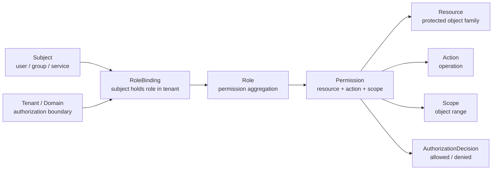

# 00-AuthZ 模型总览：Subject、Role、Resource、Permission、RoleBinding

## 1. 本文定位

本文是 `03-授权AuthZ/` 文档组的模型总览文档。本篇先回答一个基础的问题：

```text
IAM 的 AuthZ 模块到底在建模什么？
```

在当前 IAM 项目中，AuthZ 关注的是：

```text
某个 Subject，在某个 Tenant / Authorization Domain 下，
能不能对某个 Resource 执行某个 Action，
并且满足某个 Scope？
```

AuthZ 的核心模型：

```text
Subject
  -> RoleBinding
  -> Role
  -> Permission
  -> Resource / Action / Scope
  -> AuthorizationDecision
```

本文负责建立这条主线，并为后续文档提供统一领域语言。

后续文档会在本文基础上继续展开：

```text
01-资源模型-ResourceKey-ResourcePattern-Action-Scope.md
02-角色模型-Role-RoleBinding-Subject.md
03-授权写入链路-PolicyAdministration-PolicyChange-PolicyChangeCommitter.md
04-授权版本与事件传播链路-PolicyVersion-Outbox-RuntimeReload.md
05-权限检查链路-Check-Snapshot.md
06-Casbin运行时模型-pgFacts与四段Matcher.md
07-AuthZ分层架构与事实源索引.md
```

---

## 2. 30 秒结论

AuthZ 负责回答：

```text
谁，在什么授权域下，能不能对什么资源，执行什么动作，以及作用范围是什么？
```

对应到模型是：

```text
Subject：谁
Tenant / Authorization Domain：在哪个授权域下
Resource：什么资源
Action：什么动作
Scope：什么作用范围
Role：权限聚合点
Permission：Role 对 Resource / Action / Scope 的能力声明
RoleBinding：Subject 在 Tenant 下持有某个 Role
AuthorizationDecision：一次授权判定的结果
PolicyChange：一次授权事实变更意图
PolicyVersion：授权事实版本
```

核心关系是：

```text
Subject
  -> RoleBinding
  -> Role
  -> Permission
  -> Resource / Action / Scope
  -> AuthorizationDecision
```

一句话：

> AuthZ 不是把权限直接挂在 User 上，而是让 Subject 通过 RoleBinding 持有 Role，再由 Role 持有 Permission，最终通过 Resource / Action / Scope 完成资源级访问判定。

---

## 3. 为什么 AuthZ 不能只是 `user.role`

如果只做一个简单后台系统，很多人会把权限设计成：

```text
users.role = admin / normal
```

这种方式能解决非常简单的问题，但无法支撑 IAM 当前的目标。

因为 IAM 需要表达的不只是：

```text
这个人是不是管理员？
```

而是：

```text
这个主体能不能访问某类资源？
能不能访问某个业务域里的资源？
能不能执行某个具体动作？
能不能只访问自己创建的对象？
能不能在某个 tenant 下生效？
权限变更后其他服务如何感知？
运行时授权事实如何可靠刷新？
```

`user.role` 至少有这些问题：

| 问题 | 为什么不够 |
| --- | --- |
| 不能表达资源 | 只能知道用户角色，无法知道角色能访问哪些资源 |
| 不能表达动作 | 无法区分 read、update、delete、approve、export 等动作 |
| 不能表达范围 | 无法表达 all、origin、自有数据、某类对象范围 |
| 不能表达租户 | 多 tenant 场景下角色是否跨 tenant 生效不清楚 |
| 不能表达非用户主体 | group、service account、机器主体扩展困难 |
| 不能版本化 | 权限变更后无法给 SDK / 下游服务提供版本感知 |
| 不能治理运行时事实 | 无法检查 stale permission、missing resource、unsupported action |

因此 IAM 的 AuthZ 采用的是 RBAC 语义：

```text
Subject 通过 RoleBinding 持有 Role
Role 通过 Permission 获得 Resource / Action / Scope 能力
```

这也是 RBAC 的核心思想：
> **访问权通过角色进行中介，而不是把权限逐条直接散落到用户身上。**

在 Casbin 的 RBAC with domains 模型中，运行时也会把 user-role-domain 关系表达为三元 `g = _, _, _`，从而支持同一用户在不同 domain / tenant 下持有不同角色；但这属于 infra runtime 表达，不应该替代 AuthZ 的领域模型语言。

---

## 4. AuthZ 核心模型总图



这张图表达的是：

```text
Subject 不直接拥有 Permission。
Subject 先在 Tenant / Domain 下通过 RoleBinding 持有 Role。
Role 再通过 Permission 声明 Resource / Action / Scope 能力。
最终一次 Check 返回 AuthorizationDecision。
```

---

## 5. 核心模型一句话

### 5.1 Subject

`Subject` 是被授权主体。

它回答：

```text
谁在请求访问资源？
```

当前模型预留三类主体：

```text
user
group
service
```

其中当前写入侧主要开放 `user`，`group/service` 是模型和 resolver 层面的扩展方向。

Subject 不是 User 本身，而是授权系统中的主体引用。

例如：

```text
user:123
service:456
group:789
```

这使 AuthZ 可以在不改变核心模型的情况下，扩展到用户、用户组、服务账号、机器主体等场景。

---

### 5.2 Tenant / Authorization Domain

`Tenant` 或 `Authorization Domain` 是授权域边界。

它回答：

```text
这条授权事实在哪个 domain / tenant 下生效？
```

同一个 Subject 可以在不同 tenant 下持有不同 Role。

例如：

```text
user:1001 在 tenant-a 下是 admin
user:1001 在 tenant-b 下只是 viewer
```

因此，AuthZ 的核心问题是：

```text
user:1001 在 tenant-a 下是否持有某个能访问目标资源的 role？
```

Tenant / Domain 是隔离授权事实的关键维度。

---

### 5.3 Resource

`Resource` 是被保护资源。

它回答：

```text
系统中哪些对象或对象族需要被授权保护？
```

IAM 当前使用四段式 ResourceKey：

```text
<app>:<domain>:<type>:<name-or-*>
```

例如：

```text
iam:identity:user:*
iam:authz:role:*
qs:survey:questionnaire:*
qs:evaluation:report:*
```

Resource 是授权语义：

```text
iam:identity:user:*
```

而不是 HTTP path，HTTP path 是接入层协议细节：

```text
GET /api/v1/users/:id
```

这样做的好处是：

```text
REST / gRPC / SDK 可以共享同一套资源授权模型
资源授权不被具体协议路径绑死
业务对象、动作、scope 可以稳定建模
```

---

### 5.4 Action

`Action` 是对 Resource 执行的操作。

它回答：

```text
Subject 想对资源做什么？
```

例如：

```text
create
read
read_all
read_own
update
delete
approve
export
```

在当前模型中，需要区分：

```text
Action：请求侧的具体动作
ActionPattern：授权事实中的动作表达式
```

例如：

```text
Action: read
ActionPattern: read|list
ActionPattern: .*
```

这个区分很重要：

```text
请求侧必须是具体动作
授权事实可以是可匹配的动作模式
```

因此，`Check` 请求中的 action 应该是具体 operation，而 Permission fact 中可以保存 action pattern。

---

### 5.5 Scope

`Scope` 是权限作用范围。

它回答：

```text
这个权限能作用于哪些对象范围？
```

当前模型支持：

```text
all:*
origin:<value>
```

其中：

```text
all:*          表示全范围
origin:<id>    表示某个来源 / 所属范围
```

Scope 解决的问题是：

```text
同样是 read report，是否能读所有 report？
还是只能读自己创建 / 归属范围内的 report？
```

Resource 负责表达“什么资源类型”，Scope 负责表达“资源对象范围”。

不要把对象范围强行塞进 ResourceKey 的第五段。

---

### 5.6 Role

`Role` 是权限聚合点。

它回答：

```text
一组权限应该以什么业务角色被管理？
```

在 IAM 中，Role 是独立领域对象，通常具有：

```text
RoleName
DisplayName
TenantID
Description
```

Role 的职责是承载一组 Permission。

例如：

```text
iam:admin
iam:viewer
qs:evaluator
qs:operator
```

Role 的稳定性通常高于用户和权限明细：

```text
用户会频繁加入/离开角色
资源和动作会逐步演进
但业务角色本身相对稳定
```

这也是使用 RBAC 的主要原因之一。

---

### 5.7 Permission

`Permission` 是 Role 对 Resource / Action / Scope 的能力声明。

它回答：

```text
某个 Role 能对哪些资源执行哪些动作，并且作用范围是什么？
```

Permission 不是直接挂在 Subject 上，而是挂在 Role 上。

它的核心结构是：

```text
RoleName
TenantID
ResourcePattern
ActionPattern
Scope
```

例如：

```text
role: iam:admin
tenant: default
resource: iam:identity:user:*
action: read|update|delete
scope: all:*
```

这条 Permission 表达的是：

```text
iam:admin 在 default tenant 下，可以对 iam:identity:user:* 资源执行 read/update/delete，并且作用范围是 all:*
```

在运行时，Permission 会被转换为 Casbin `p` fact。

但在领域语言中，应该优先叫 Permission，而不是 p rule。

---

### 5.8 RoleBinding

`RoleBinding` 是 Subject 在 Tenant 下持有 Role 的授权事实。

它回答：

```text
谁在某个 tenant 下被授予了什么 role？
```

例如：

```text
user:1001 在 tenant-a 下持有 iam:admin
user:1002 在 tenant-a 下持有 iam:viewer
service:2001 在 tenant-a 下持有 qs:worker
```

RoleBinding 的核心结构是：

```text
Subject
RoleName
TenantID
GrantedBy
```

在管理面，还会有 `Binding` 记录用于：

```text
后台查询
按 ID 撤销
审计授权人
展示授权列表
```

在运行时，会被映射为 Casbin `g` fact。

但在领域语言中，应该优先叫 RoleBinding，而不是 assignment。

---

### 5.9 AuthorizationRequest

`AuthorizationRequest` 是一次授权判定的领域请求。

它回答：

```text
这次访问请求到底在问什么授权问题？
```

它包含：

```text
Subject
TenantID
ResourcePattern / ResourceKey
Action
ObjectScope
```

一次典型问题是：

```text
user:1001 在 tenant-a 下，能否对 iam:identity:user:* 执行 read，并且作用范围是 all:*？
```

注意：AuthorizationRequest 不是 HTTP request。

HTTP request 是协议层对象。

AuthorizationRequest 是 AuthZ 领域请求。

---

### 5.10 AuthorizationDecision

`AuthorizationDecision` 是一次授权判定结果。

它回答：

```text
允许还是拒绝？为什么？基于哪个授权版本？
```

当前模型不只是返回布尔值，而是包含：

```text
Allowed
Reason
DenyCode
MatchedRole
MatchedPermission
PolicyVersion
EvaluatedAt
```

这使授权结果具备基本可解释性。

例如：

```text
Allowed: false
Reason: not_matched
DenyCode: policy_not_matched
PolicyVersion: 17
```

这比单纯返回：

```text
false
```

更适合排查问题。

---

### 5.11 PolicyChange / PolicyVersion

`PolicyChange` 表示一次授权事实变更意图。

它回答：

```text
这次管理面操作要改变哪些授权事实？
```

例如：

```text
GrantPermission
RevokePermission
BindRole
UnbindRole
```

`PolicyVersion` 表示授权事实版本。

它回答：

```text
当前运行时授权事实处于哪个版本？
下游实例或 SDK 是否已经感知到最新授权变更？
```

PolicyChange 和 PolicyVersion 不属于 Check 请求模型，但它们是 AuthZ 写入、传播、RuntimeReload 的关键模型。

---

## 6. 模型关系详解

### 6.1 Subject 不直接拥有 Permission

不要建模成：

```text
Subject -> Permission
```

正确模型是：

```text
Subject -> RoleBinding -> Role -> Permission
```

原因是：

```text
权限直接挂在 Subject 上会导致权限碎片化
用户变更时需要逐条维护 Permission
审计时难以看出业务角色语义
跨服务接入时难以沉淀稳定权限模型
```

Role 是权限聚合点。

Subject 通过 RoleBinding 获得 Role。

Role 通过 Permission 获得资源访问能力。

---

### 6.2 Role 不等于 Permission

Role 是权限集合的业务命名。

Permission 是具体资源能力。

例如：

```text
Role: qs:evaluator

Permissions:
  qs:evaluation:report:* read_all all:*
  qs:evaluation:report:* export all:*
  qs:survey:questionnaire:* read_all all:*
```

Role 可以被理解为：

```text
业务岗位 / 访问职责 / 权限包
```

Permission 可以被理解为：

```text
资源 + 动作 + 范围
```

---

### 6.3 Resource 不等于接口路径

不要把 Resource 直接建模成：

```text
GET /api/v1/users/:id
POST /api/v1/users
```

更稳定的建模是：

```text
iam:identity:user:*
```

然后用 Action 区分：

```text
read
create
update
delete
```

这样同一个 Resource 可以被 REST、gRPC、SDK、后台任务共享。

协议路径可以变化，授权资源语义不应该频繁变化。

---

### 6.4 Scope 不等于 ResourceKey

不要把 Scope 塞进 ResourceKey。

错误倾向：

```text
iam:identity:user:owner:1001
```

更好的拆法：

```text
ResourcePattern: iam:identity:user:*
Action: read
Scope: origin:1001
```

ResourceKey 负责说明资源类型或资源族。

Scope 负责说明对象范围。

这让模型更稳定，也让 matcher 更清晰。

---

### 6.5 Assignment 是外部术语，RoleBinding 是内部术语

当前约定是：

```text
assignment = REST / proto 对外 wire term
rolebinding = 内部 application / domain 标准术语
```

为什么要这样分？

因为对外用户更容易理解：

```text
grant assignment
revoke assignment
```

但内部领域模型更准确的术语是：

```text
RoleBinding
```

它表达的是：

```text
Subject 在 Tenant 下持有 Role
```

因此文档和代码中要保持边界：

| 层次 | 推荐术语 | 说明 |
| --- | --- | --- |
| REST / proto | Assignment | 对外表示“角色分配” |
| Application / Domain | RoleBinding | 内部授权领域术语 |
| Management DB | Binding | 管理面记录，用于查询、撤销、审计 |
| Runtime Casbin | g fact | 运行时判定事实 |

---

### 6.6 Casbin p/g fact 是运行时术语，不是领域术语

在领域模型中，应该表示：

```text
BindRole
GrantPermission
```

Runtime 层再转换：

```text
RoleBinding -> g fact
Permission -> p fact
```

这样可以避免领域层被 Casbin 的存储格式绑死。

---

## 7. AuthZ 链路总览

新版 AuthZ 文档按授权系统生命周期组织：

```text
模型
  -> 资源模型
  -> 角色模型
  -> 授权写入
  -> 版本与事件传播
  -> 权限检查
  -> Casbin Runtime
  -> 分层架构与事实源
```

### 7.1 授权写入链路

授权写入链路回答：

```text
如何改变授权事实？
```

典型命令：

```text
GrantPermission
RevokePermission
BindRole
UnbindRole
```

主线：

```text
PolicyAdministration
  -> PolicyChange
  -> PolicyChangeCommitter
  -> AuthZ UoW
  -> AuthorizationFacts
  -> PolicyVersion
```

它不应该直接操作 Casbin Enforcer。

它也不应该让业务 Handler 直接 insert/delete `casbin_rule`。

---

### 7.2 授权版本与事件传播链路

授权传播链路回答：

```text
授权事实改变后，运行时如何感知？
多实例如何最终一致？
```

主线：

```text
PolicyChangeCommitter
  -> PolicyVersion
  -> Outbox Event
  -> OutboxRelay
  -> RuntimeReload / AuthzPolicySync
  -> Casbin LoadPolicy
```

其中：

```text
PolicyVersion 表示授权事实版本；
Outbox Event 用于可靠发布授权变更；
RuntimeReload 让本地运行时策略重新加载；
AuthzPolicySync / Relay 让多实例最终感知策略变更。
```

---

### 7.3 权限检查链路

权限检查链路回答：

```text
当前请求是否允许访问？
当前 Subject 的授权快照是什么？
```

主线：

```text
CheckCommand
  -> AuthorizationRequest
  -> DecisionEngine
  -> AuthorizationDecision
```

Snapshot 主线：

```text
SnapshotQuery
  -> SnapshotReader
  -> AuthorizationSnapshot
  -> AuthzVersion
```

Check / Snapshot 是 Application 能力。

Casbin 是底层 runtime adapter。

业务代码不应该直接调用 Casbin `Enforce`。

---

### 7.4 Casbin Runtime 链路

Casbin Runtime 链路回答：

```text
领域授权事实如何转换为运行时 matcher 可判定的 p/g facts？
```

映射关系：

```text
Permission   -> p fact
RoleBinding  -> g fact
Check Request -> r request
```

四段 ResourceKey 与 Action / Scope 会进入 matcher：

```text
ResourcePattern match ResourceKey
ActionPattern match Action
Scope match ObjectScope
Domain/Tenant match Tenant
```

Casbin Runtime 文档只讲 infra 层事实，不替代领域模型文档。

---

## 8. AuthZ 与 Casbin 的关系

Casbin 是 AuthZ 的 infra runtime engine。

领域语言是：

```text
Subject
Tenant
Role
Resource
Action
Scope
Permission
RoleBinding
AuthorizationRequest
AuthorizationDecision
PolicyChange
PolicyVersion
```

Casbin 技术语言是：

```text
p
g
sub
dom
obj
act
scope
matcher
```

两者关系是：

```text
Permission   -> Casbin p fact
RoleBinding  -> Casbin g fact
Check Request -> Casbin r request
```

但是这些映射应该只出现在 infra/casbin 层。

Domain 和 Application 不应该直接依赖 Casbin 的 `p/g` 术语。

Transport 也不应该直接调用：

```text
Enforce
GetRolesForUser
```

这些边界应由架构测试保护。

---

## 9. AuthZ 与 AuthN、Identity、业务系统的关系

### 9.1 AuthN 与 AuthZ

AuthN 回答：

```text
你是谁？
你如何证明你是谁？
认证成功后如何表达 Principal？
```

AuthZ 回答：

```text
你能做什么？
你能访问哪个资源？
你能执行哪个动作？
你的权限范围是什么？
```

所以：

```text
AuthN 产生 Principal
AuthZ 使用 Subject 做授权判定
```

不要把登录态、Token 签发、Session 管理写进 AuthZ 模型。

---

### 9.2 Identity 与 AuthZ

Identity 负责：

```text
User
Profile
ProfileLink
身份关系
```

AuthZ 负责：

```text
Subject
Role
Permission
Resource access
```

ProfileLink 不是 Permission。

如果某个 Profile 操作需要授权，应该把它建模成：

```text
Resource: iam:identity:profile:*
Action: read / update
Scope: origin:<profile-or-owner>
```

然后通过 AuthZ Check 判定。

---

### 9.3 业务系统与 AuthZ

业务系统不应该把权限判断硬编码成：

```text
if user.Role == "admin"
```

更合理的方式是：

```text
AuthZ Check(subject, tenant, resource, action, scope)
```

业务系统负责提供资源语义和对象上下文。

AuthZ 负责判定是否允许访问。

---

## 10. 当前模型的阶段性边界

当前 AuthZ 已经完成：

```text
Subject / Tenant / Role / Resource / Permission / RoleBinding 建模
ResourceKey 四段结构
ResourcePattern 与 ResourceKey 分离
Action 与 ActionPattern 分离
Application Command VO 化
Check / Snapshot 读链路
PolicyAdministration 写链路
PolicyChangeCommitter + UoW
Casbin p/g facts runtime mapping
PolicyVersion
PolicyLinter
REST/gRPC/SDK 接入基础
```

仍然属于后续扩展的能力：

```text
group / service subject 写入开放
PolicyReconciler 自动治理
多实例 outbox-driven runtime reload 闭环
更复杂的 scope hierarchy
更复杂的 condition / ABAC 模型
```

因此，当前模型应明确：

```text
模型预留 group/service，但写入侧当前主要开放 user。
PolicyLinter 是授权事实治理能力，用于诊断 ResourceCatalog 与 PermissionFacts 之间的不一致。
PolicyLinter 是 read-only diagnosis，不是自动修复器。
自动修复属于未来 PolicyReconciler，且必须通过 PolicyChangeCommitter。
ResourceCatalog 变更不自动删除已有 PermissionFacts。
Runtime reload 当前以本实例 best-effort 为主，多实例闭环属于后续生产化增强。
```

---

## 11. 常见误区

### 11.1 AuthZ = AuthN

错误。

AuthN 是认证，回答“你是谁”。

AuthZ 是授权，回答“你能不能访问资源”。

---

### 11.2 AuthZ = Casbin

错误。

Casbin 是 infra runtime engine。

AuthZ 的领域模型是 Role、Resource、Permission、RoleBinding、Scope 等业务概念。

---

### 11.3 Role = User 表上的 role 字段

错误。

Role 是独立领域对象，是权限聚合点。

User 通过 RoleBinding 持有 Role。

---

### 11.4 Permission 直接挂在 User 上

错误。

当前模型中，Permission 挂在 Role 上。

Subject 通过 RoleBinding 间接获得 Permission。

---

### 11.5 Resource = HTTP path

错误。

HTTP path 是协议层对象。

Resource 是授权语义对象。

---

### 11.6 Scope 可以随便拼进 ResourceKey

错误。

ResourceKey 表达资源类型或资源族。

Scope 表达对象范围。

这两个概念应该分开。

---

### 11.7 PolicyLinter 会自动修复权限

错误。

PolicyLinter 是只读诊断工具。

自动修复属于未来 PolicyReconciler 的职责，而且必须走 PolicyChangeCommitter。

---

### 11.8 p/g fact 就是领域模型

错误。

p/g fact 是 Casbin runtime 事实。

领域模型应该使用 Permission 和 RoleBinding。

---

## 12. 代码事实源

本文只列总入口，详细路径由第 07 篇统一维护。

核心事实源包括：

```text
internal/apiserver/domain/authz
internal/apiserver/application/authz
internal/apiserver/infra/casbin
configs/casbin_model.conf
```

建议阅读方向：

```text
想理解领域模型：读 internal/apiserver/domain/authz
想理解写入链路：读 internal/apiserver/application/authz 下的 policy / role / resource / rolebinding 相关用例
想理解检查链路：读 internal/apiserver/application/authz 下的 authorization / checker / snapshot 相关用例
想理解运行时：读 internal/apiserver/infra/casbin 与 configs/casbin_model.conf
想理解事实源索引：读 07-AuthZ分层架构与事实源索引.md
```

如果本文与代码不一致，以代码事实源为准，并同步更新本文档。

---

## 13. 后续文档入口

理解本文模型后，继续阅读：

```text
01-资源模型-ResourceKey-ResourcePattern-Action-Scope.md
02-角色模型-Role-RoleBinding-Subject.md
03-授权写入链路-PolicyAdministration-PolicyChange-PolicyChangeCommitter.md
04-授权版本与事件传播链路-PolicyVersion-Outbox-RuntimeReload.md
05-权限检查链路-Check-Snapshot.md
06-Casbin运行时模型-pgFacts与四段Matcher.md
07-AuthZ分层架构与事实源索引.md
```

阅读顺序建议：

```text
00 建立总模型；
01 讲 Resource / Action / Scope；
02 讲 Subject / Role / RoleBinding；
03 讲授权事实如何写入；
04 讲授权版本如何传播并触发 RuntimeReload；
05 讲权限如何检查、Snapshot 如何读取；
06 讲领域事实如何映射为 Casbin p/g facts；
07 统一收口分层架构、代码路径、表结构、坏味道和维护原则。
```

---

## 14. 本文总结

AuthZ 的核心模型可以压缩成一句话：

```text
Subject 通过 RoleBinding 在 Tenant 下持有 Role，Role 通过 Permission 声明 Resource / Action / Scope 能力，Check 最终返回 AuthorizationDecision。
```

也可以画成：

```text
Subject
  -> RoleBinding
  -> Role
  -> Permission
  -> Resource / Action / Scope
  -> AuthorizationDecision
```

理解这条链路后，再看后续文档就会清晰很多：

```text
资源模型讲 ResourceKey / ResourcePattern / Action / Scope；
角色模型讲 Role / RoleBinding / Subject；
授权写入链路讲 PolicyAdministration / PolicyChange / PolicyChangeCommitter；
授权版本与事件传播链路讲 PolicyVersion / Outbox / RuntimeReload；
权限检查链路讲 Check / Snapshot；
Casbin 运行时模型讲 p/g facts 与四段 matcher；
分层架构与事实源索引统一收口代码、表结构、运行时和坏味道。
```

如果只记住一句话：

> AuthZ 不负责证明你是谁，AuthZ 负责判断你在某个授权域下能不能访问某个资源；它用 RoleBinding 连接 Subject 和 Role，用 Permission 连接 Role 与 Resource / Action / Scope。
