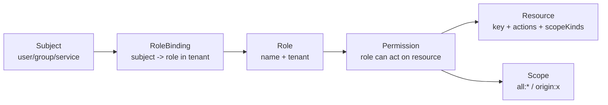
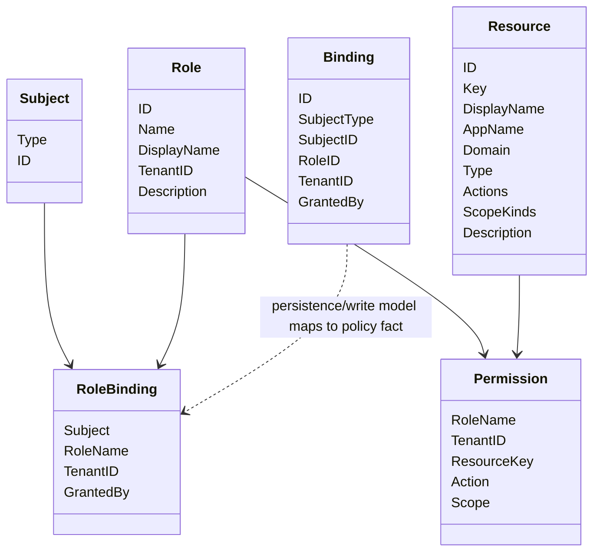
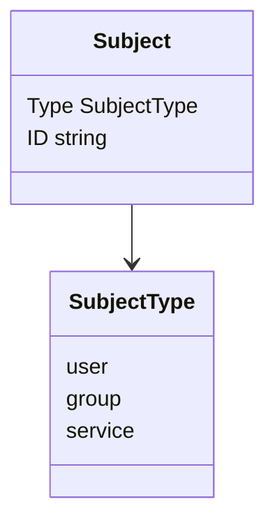
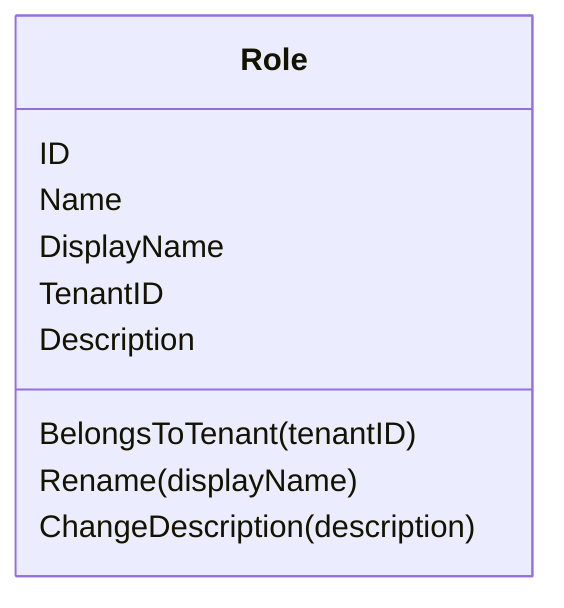
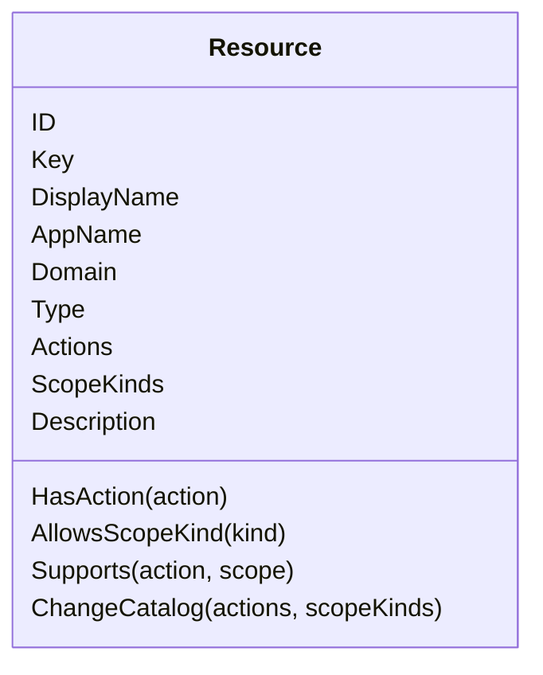
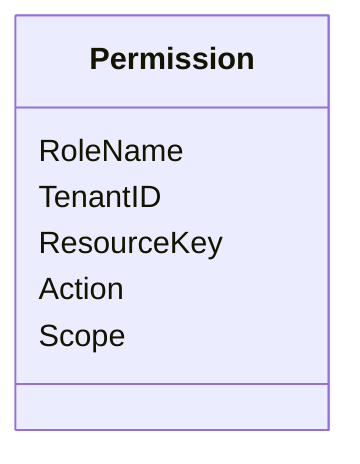
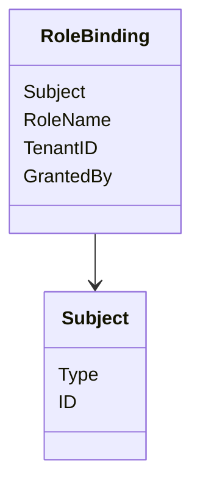
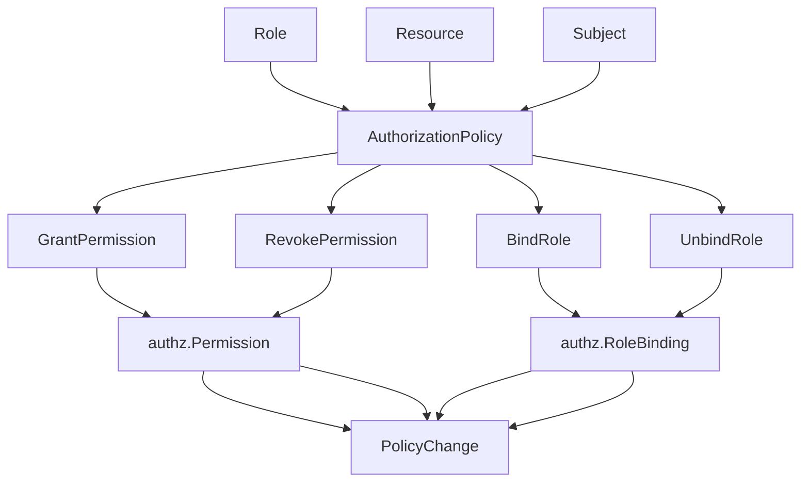
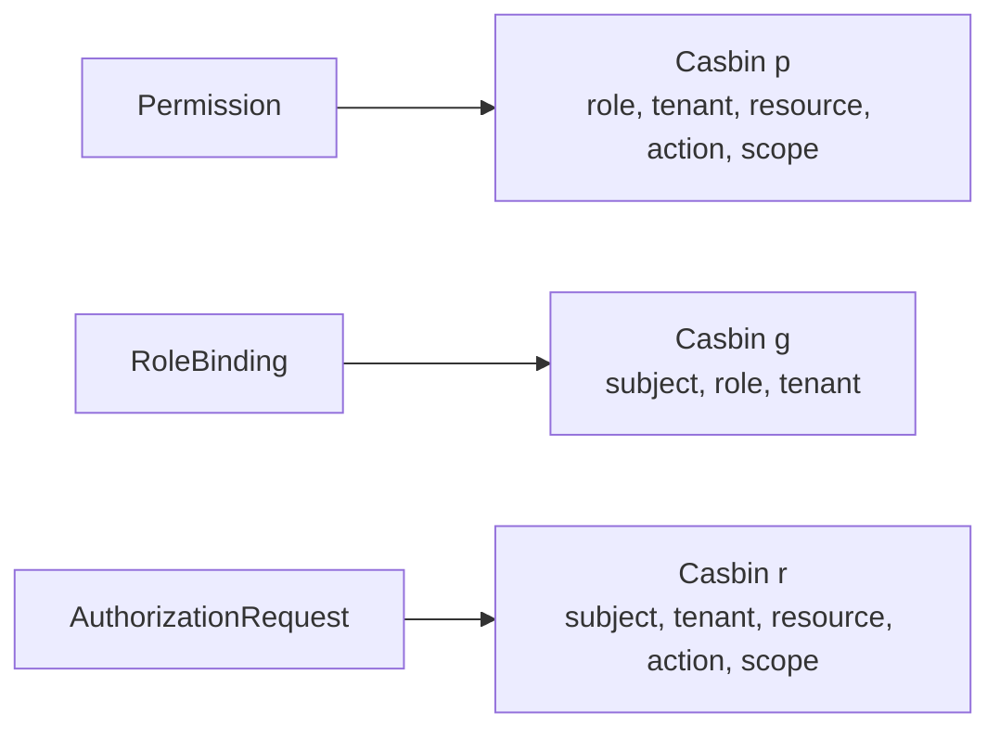
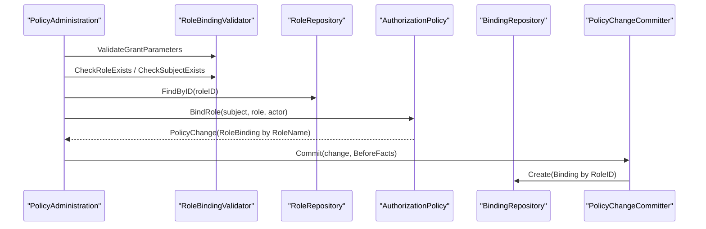

# 授权模型：Role、Resource、Permission 与 RoleBinding

## 本文回答

本文回答：IAM AuthZ 模块中的授权模型如何组织；Role、Resource、Permission、RoleBinding 分别表达什么；Subject、Tenant、Scope 如何参与授权语义；为什么 REST 对外仍使用 assignment，而内部领域语言要统一为 rolebinding；为什么 Casbin 只是运行时授权事实适配器，而不是 IAM 的业务语言。

读完本文，你应该能回答：

- Role 是什么，为什么它要归属于 tenant；
- Resource 是什么，为什么它要定义 actions 和 scope kinds；
- Permission 是什么，为什么它使用 role name + resource key，而不是 role id + resource id；
- RoleBinding 是什么，和 REST 对外 assignment 是什么关系；
- Subject 当前支持哪些类型，当前写操作实际支持到什么范围；
- Scope 的 `all:*` 和 `origin:<value>` 分别表达什么；
- RoleID / RoleName、ResourceID / ResourceKey 在模型中各自承担什么职责；
- 授权模型如何最终被转换成 Casbin policy/grouping facts；
- 为什么 AuthZ 的模型不是“用户直接拥有权限”；
- 这一篇和后续“授权判定链路”“PolicyChangeCommitter 与 UoW”“授权版本事件与 Outbox”之间是什么关系。

---

## 30 秒结论

IAM 的 AuthZ 模型是一个基于 RBAC 的授权模型，并带有 tenant 和 scope 维度。

核心关系是：

```text
Subject
  -> RoleBinding
  -> Role
  -> Permission
  -> Resource + Action + Scope
```

换句话说：

> Subject 不直接拥有 Permission。Subject 通过 RoleBinding 拥有 Role，Role 再通过 Permission 获得对 Resource 执行 Action 的能力。

当前 AuthZ 的核心业务对象可以压缩为：

| 模型 | 作用 |
| --- | --- |
| `Role` | 租户内的角色目录，例如 `teacher`、`school_admin` |
| `Resource` | 可被保护的资源目录，例如 `scale:form:template:*` |
| `Permission` | 某个 role 在某个 tenant 下，可以对某个 resource 执行某个 action，且限定 scope |
| `RoleBinding` | 某个 subject 在某个 tenant 下持有某个 role |
| `Subject` | 被授权主体，类型包括 user/group/service；当前 REST 写操作只支持 user |
| `Scope` | 授权对象范围，当前支持 `all:*` 和 `origin:<value>` |

需要特别注意两个术语边界：

```text
assignment = 对外 REST/proto wire term
rolebinding = 内部 application/domain 领域术语
```

REST 路由仍叫：

```text
/api/v2/authz/assignments
```

但内部应用服务和领域模型应统一使用：

```text
rolebinding
```

另一个关键边界是：

```text
Casbin facts 不是业务模型
```

业务层说 Role、Resource、Permission、RoleBinding；Casbin infra 层才把它们转换为：

```text
p = role, tenant, resource, action, scope
g = subject, role, tenant
```

核心源码入口：

- [../../internal/apiserver/domain/authz/model.go](../../internal/apiserver/domain/authz/model.go)
- [../../internal/apiserver/domain/authz/role/role.go](../../internal/apiserver/domain/authz/role/role.go)
- [../../internal/apiserver/domain/authz/resource/resource.go](../../internal/apiserver/domain/authz/resource/resource.go)
- [../../internal/apiserver/domain/authz/rolebinding/binding.go](../../internal/apiserver/domain/authz/rolebinding/binding.go)
- [../../internal/apiserver/domain/authz/policy/authorization_policy.go](../../internal/apiserver/domain/authz/policy/authorization_policy.go)
- [../../internal/apiserver/infra/casbin/facts.go](../../internal/apiserver/infra/casbin/facts.go)
- [../../internal/apiserver/transport/rest/authz/dto/assignment.go](../../internal/apiserver/transport/rest/authz/dto/assignment.go)
- [../../internal/apiserver/transport/rest/authz/handler/rolebinding.go](../../internal/apiserver/transport/rest/authz/handler/rolebinding.go)

---

## 主图：授权模型关系



更贴近代码的关系是：



---

## 重点速查

| 问题 | 当前答案 | 代码证据 |
| --- | --- | --- |
| 通用授权模型在哪里 | `internal/apiserver/domain/authz/model.go` 定义 Subject、Scope、Permission、RoleBinding、AuthorizationRequest。 | [../../internal/apiserver/domain/authz/model.go](../../internal/apiserver/domain/authz/model.go) |
| Role 领域对象在哪里 | `domain/authz/role/role.go`。 | [../../internal/apiserver/domain/authz/role/role.go](../../internal/apiserver/domain/authz/role/role.go) |
| Role 名称唯一性和租户隔离在哪里校验 | `domain/authz/role/validator.go`。 | [../../internal/apiserver/domain/authz/role/validator.go](../../internal/apiserver/domain/authz/role/validator.go) |
| Resource 领域对象在哪里 | `domain/authz/resource/resource.go`。 | [../../internal/apiserver/domain/authz/resource/resource.go](../../internal/apiserver/domain/authz/resource/resource.go) |
| Resource 是否支持某个 action/scope 怎么判断 | `HasAction`、`AllowsScopeKind`、`Supports`。 | [../../internal/apiserver/domain/authz/resource/resource.go](../../internal/apiserver/domain/authz/resource/resource.go) |
| Permission 如何创建 | `authz.NewPermission(roleName, tenantID, resourceKey, action, scope)`。 | [../../internal/apiserver/domain/authz/model.go](../../internal/apiserver/domain/authz/model.go) |
| RoleBinding 通用授权事实如何创建 | `authz.NewRoleBinding(subject, roleName, tenantID, grantedBy)`。 | [../../internal/apiserver/domain/authz/model.go](../../internal/apiserver/domain/authz/model.go) |
| 持久化用的 Binding 在哪里 | `domain/authz/rolebinding/binding.go`，使用 `RoleID`。 | [../../internal/apiserver/domain/authz/rolebinding/binding.go](../../internal/apiserver/domain/authz/rolebinding/binding.go) |
| REST 对外为什么叫 assignment | DTO 和 routes 使用 assignment wire term，但 handler 调用的是 rolebinding application service。 | [../../internal/apiserver/transport/rest/authz/dto/assignment.go](../../internal/apiserver/transport/rest/authz/dto/assignment.go)、[../../internal/apiserver/transport/rest/authz/handler/rolebinding.go](../../internal/apiserver/transport/rest/authz/handler/rolebinding.go) |
| Casbin facts 如何生成 | `PolicyRuleFromPermission` 和 `GroupingRuleFromRoleBinding`。 | [../../internal/apiserver/infra/casbin/facts.go](../../internal/apiserver/infra/casbin/facts.go) |
| PolicyChange 如何生成 Permission / RoleBinding | `AuthorizationPolicy.GrantPermission / BindRole`。 | [../../internal/apiserver/domain/authz/policy/authorization_policy.go](../../internal/apiserver/domain/authz/policy/authorization_policy.go) |

---

## 1. AuthZ 模型的核心问题

AuthZ 回答的是：

> 某个 subject，在某个 tenant 下，能不能对某个 resource 的某个 object scope 执行某个 action？

用代码里的 `AuthorizationRequest` 表达：

```text
Subject
TenantID
ResourceKey
Action
ObjectScope
```

也就是：

```text
(user:123, tenant=school-a, resource=scale:form:template:*, action=read, scope=origin:school-a)
```

这个问题不能简化成“用户有没有某个权限”。  
IAM 当前的模型里，用户不是直接拥有权限，而是：

```text
Subject 绑定 Role
Role 拥有 Permission
Permission 绑定 Resource + Action + Scope
```

这样做的好处是：

- 权限可以按角色复用；
- 角色可以按 tenant 隔离；
- resource/action/scope 有目录和校验；
- runtime engine 可以把模型转换成稳定的 policy facts；
- 后续可以扩展 group/service subject，而不必重写 permission 模型。

---

## 2. Subject：被授权主体

`Subject` 表示被授权的主体。

当前通用模型支持三类：

```text
user
group
service
```

代码定义：

```text
SubjectTypeUser
SubjectTypeGroup
SubjectTypeService
```

`NewSubject(subjectType, id)` 要求：

- subject type 非空；
- subject id 非空；
- id 会 trim。



### 当前写操作边界

虽然通用 `Subject` 支持 user/group/service，但 `domain/authz/rolebinding/validator.go` 当前写操作只允许：

```text
SubjectTypeUser
```

也就是说：

| 层 | 当前范围 |
| --- | --- |
| 通用授权模型 | user / group / service |
| rolebinding 写操作 | 仅 user |
| REST assignment DTO | `subject_type` 当前 `oneof=user` |

这不是冲突，而是分层边界：

```text
模型预留 group/service
当前业务写入口只开放 user
```

核心源码：

- [../../internal/apiserver/domain/authz/model.go](../../internal/apiserver/domain/authz/model.go)
- [../../internal/apiserver/domain/authz/rolebinding/validator.go](../../internal/apiserver/domain/authz/rolebinding/validator.go)
- [../../internal/apiserver/transport/rest/authz/dto/assignment.go](../../internal/apiserver/transport/rest/authz/dto/assignment.go)

---

## 3. TenantScope：授权隔离边界

AuthZ 中几乎所有核心模型都带 tenant：

```text
Role.TenantID
Permission.TenantID
RoleBinding.TenantID
AuthorizationRequest.TenantID
```

Tenant 的作用是授权域隔离。

例如同名角色：

```text
teacher
```

在两个不同 tenant 下不是同一个授权事实：

```text
tenant-a / teacher
tenant-b / teacher
```

Role validator 和 RoleBinding validator 都会做租户隔离检查：

- role name 在 tenant 内唯一；
- 角色只能在所属 tenant 下被操作；
- rolebinding 只能绑定当前 tenant 下的角色；
- revoke by id 时要检查 binding 的 tenant。

核心源码：

- [../../internal/apiserver/domain/authz/role/validator.go](../../internal/apiserver/domain/authz/role/validator.go)
- [../../internal/apiserver/domain/authz/rolebinding/validator.go](../../internal/apiserver/domain/authz/rolebinding/validator.go)
- [../../internal/apiserver/application/authz/policy/administration.go](../../internal/apiserver/application/authz/policy/administration.go)

---

## 4. Scope：授权对象范围

Scope 表达授权覆盖的对象范围。

当前支持：

| ScopeKind | 表达 | 语义 |
| --- | --- | --- |
| `all` | `all:*` | 覆盖全部对象 |
| `origin` | `origin:<value>` | 覆盖某个来源/归属对象范围 |

默认 scope 是：

```text
all:*
```

`Scope.String()` 会规范化成：

```text
<kind>:<value>
```

例如：

```text
all:*
origin:school-a
```

### Scope 的校验规则

`NewScope(kind, value)` 规则：

| 输入 | 结果 |
| --- | --- |
| kind/value 都空 | 默认 `all:*` |
| kind 为空但 value 非空 | 错误 |
| kind=`all` 且 value 空 | value 补成 `*` |
| kind=`all` 且 value 不是 `*` | 错误 |
| kind=`origin` 且 value 为空或 `*` | 错误 |
| kind 不是 all/origin | 错误 |

### Resource 对 Scope 的约束

Resource 有 `ScopeKinds`，表示这个资源允许哪些 scope kind。

例如：

```text
Resource(scale:form:template:*) supports [all, origin]
```

那么对该 resource 授权时，只能使用它支持的 scope kind。  
`AuthorizationPolicy.GrantPermission` 会检查：

```text
targetResource.AllowsScopeKind(scope.Normalized().Kind)
```

核心源码：

- [../../internal/apiserver/domain/authz/model.go](../../internal/apiserver/domain/authz/model.go)
- [../../internal/apiserver/domain/authz/resource/resource.go](../../internal/apiserver/domain/authz/resource/resource.go)
- [../../internal/apiserver/domain/authz/policy/authorization_policy.go](../../internal/apiserver/domain/authz/policy/authorization_policy.go)

---

## 5. Role：租户内的角色目录

Role 是角色目录项，也是角色管理的领域对象。

字段：

| 字段 | 含义 |
| --- | --- |
| `ID` | 内部 ID |
| `Name` | 稳定角色名，用于授权事实 |
| `DisplayName` | 展示名 |
| `TenantID` | 所属租户 |
| `Description` | 描述 |



### RoleID 与 RoleName 的区别

这是 AuthZ 模型里非常关键的点：

| 标识 | 用途 |
| --- | --- |
| `RoleID` | 管理接口、数据库记录、REST grant/revoke 输入 |
| `RoleName` | 授权事实、Casbin policy/grouping rule、Permission/RoleBinding |

为什么 Permission 使用 `RoleName`？

因为授权事实更接近业务语义：

```text
role:teacher
```

而不是数据库内部 ID：

```text
role:123
```

当前流程通常是：

```text
REST 输入 RoleID
  -> application 加载 Role
  -> domain policy 使用 Role.Name 构造 Permission / RoleBinding
  -> infra 转成 Casbin fact
```

### Role 业务规则

Role validator 负责：

- 创建参数不能为空；
- role name 在同一 tenant 内唯一；
- role 必须存在；
- role 必须属于当前 tenant。

核心源码：

- [../../internal/apiserver/domain/authz/role/role.go](../../internal/apiserver/domain/authz/role/role.go)
- [../../internal/apiserver/domain/authz/role/validator.go](../../internal/apiserver/domain/authz/role/validator.go)
- [../../internal/apiserver/application/authz/role/types.go](../../internal/apiserver/application/authz/role/types.go)
- [../../internal/apiserver/application/authz/role/command_service.go](../../internal/apiserver/application/authz/role/command_service.go)

---

## 6. Resource：可保护资源目录

Resource 是可被授权系统保护的资源目录项。

字段：

| 字段 | 含义 |
| --- | --- |
| `ID` | 内部 ID |
| `Key` | 资源键，例如 `scale:form:template:*` |
| `DisplayName` | 展示名 |
| `AppName` | 所属应用 |
| `Domain` | 业务域 |
| `Type` | 对象类型 |
| `Actions` | 支持的动作列表 |
| `ScopeKinds` | 支持的 scope kind |
| `Description` | 描述 |



### ResourceID 与 ResourceKey 的区别

| 标识 | 用途 |
| --- | --- |
| `ResourceID` | 管理接口、数据库记录、REST grant permission 输入 |
| `ResourceKey` | 授权事实、AuthorizationRequest、Casbin policy object |

当前流程通常是：

```text
REST 输入 ResourceID
  -> application 加载 Resource
  -> domain policy 使用 Resource.Key 构造 Permission
  -> infra 转成 Casbin policy rule
```

### Action 与 ScopeKinds

Resource 不只是一个字符串 key。  
它还定义：

```text
这个资源支持哪些 action
这个资源支持哪些 scope kind
```

比如：

```text
Resource:
  key: scale:form:template:*
  actions: [read, write]
  scopeKinds: [all, origin]
```

那么以下 permission 合法：

```text
teacher can read scale:form:template:* in origin:school-a
```

以下 permission 不合法：

```text
teacher can delete scale:form:template:* in origin:school-a
```

因为 `delete` 不在 actions 中。

核心源码：

- [../../internal/apiserver/domain/authz/resource/resource.go](../../internal/apiserver/domain/authz/resource/resource.go)
- [../../internal/apiserver/domain/authz/resource/repository.go](../../internal/apiserver/domain/authz/resource/repository.go)
- [../../internal/apiserver/domain/authz/resource/interfaces.go](../../internal/apiserver/domain/authz/resource/interfaces.go)
- [../../internal/apiserver/application/authz/resource/types.go](../../internal/apiserver/application/authz/resource/types.go)
- [../../internal/apiserver/application/authz/resource/command_service.go](../../internal/apiserver/application/authz/resource/command_service.go)

---

## 7. Permission：角色对资源的操作能力

Permission 表达：

> 某个 role 在某个 tenant 下，可以对某个 resource 执行某个 action，且限定某个 scope。

字段：

| 字段 | 含义 |
| --- | --- |
| `RoleName` | 角色名 |
| `TenantID` | 租户 |
| `ResourceKey` | 资源 key |
| `Action` | 动作 |
| `Scope` | 授权范围 |



创建规则：

```text
RoleName required
TenantID required
ResourceKey required
Action required
Scope defaults to all:*
Scope must be valid
```

### Permission 为什么不是“User + Action”

如果 permission 直接绑定 user，会出现几个问题：

- 同一类用户权限难以复用；
- 权限变更必须逐用户修改；
- tenant 内角色语义丢失；
- 与 Casbin RBAC 模型的 grouping rule 不匹配；
- 难以表达 group/service subject 的扩展空间。

当前设计选择：

```text
RoleBinding: subject -> role
Permission: role -> resource/action/scope
```

这样写入和判定都更稳定。

### Permission 由谁创建

Permission 不应该由 REST handler 直接 new。  
它由 `AuthorizationPolicy.GrantPermission/RevokePermission` 在校验 Role/Resource/Action/Scope 后创建。

`AuthorizationPolicy` 会检查：

```text
role tenant id exists
resource supports action
resource supports scope kind
```

然后调用：

```text
authz.NewPermission(role.Name, role.TenantID, resource.Key, action, scope)
```

核心源码：

- [../../internal/apiserver/domain/authz/model.go](../../internal/apiserver/domain/authz/model.go)
- [../../internal/apiserver/domain/authz/policy/authorization_policy.go](../../internal/apiserver/domain/authz/policy/authorization_policy.go)
- [../../internal/apiserver/domain/authz/policy/validator.go](../../internal/apiserver/domain/authz/policy/validator.go)

---

## 8. RoleBinding：主体持有角色

RoleBinding 表达：

> 某个 subject 在某个 tenant 下持有某个 role。

通用授权事实中的 RoleBinding：

| 字段 | 含义 |
| --- | --- |
| `Subject` | user/group/service + id |
| `RoleName` | 角色名 |
| `TenantID` | 租户 |
| `GrantedBy` | 授权人 |



### Binding 与 RoleBinding 的区别

代码中还有一个 `domain/authz/rolebinding.Binding`：

| 模型 | 所在包 | 字段特点 | 用途 |
| --- | --- | --- | --- |
| `authz.RoleBinding` | `domain/authz/model.go` | `Subject + RoleName + TenantID` | 授权事实模型，用于生成 policy change / Casbin grouping |
| `rolebinding.Binding` | `domain/authz/rolebinding/binding.go` | `SubjectType + SubjectID + RoleID + TenantID` | 持久化/管理模型，用于 REST assignment 写入和查询 |

这个双模型容易混淆，但很有必要：

```text
管理层使用 RoleID，便于数据库和接口操作
授权事实使用 RoleName，便于 runtime policy 和 Casbin 表达
```

### 当前写操作只支持 user

`rolebinding.Validator` 当前会限制写操作：

```text
validateWritableSubjectType(subjectType)
```

只允许：

```text
user
```

因此文档中不能写成“当前 REST 已支持 group/service 赋权”。  
正确说法是：

```text
通用模型预留 group/service
当前写入口只支持 user
```

核心源码：

- [../../internal/apiserver/domain/authz/model.go](../../internal/apiserver/domain/authz/model.go)
- [../../internal/apiserver/domain/authz/rolebinding/binding.go](../../internal/apiserver/domain/authz/rolebinding/binding.go)
- [../../internal/apiserver/domain/authz/rolebinding/validator.go](../../internal/apiserver/domain/authz/rolebinding/validator.go)
- [../../internal/apiserver/application/authz/rolebinding/types.go](../../internal/apiserver/application/authz/rolebinding/types.go)
- [../../internal/apiserver/application/authz/rolebinding/command_service.go](../../internal/apiserver/application/authz/rolebinding/command_service.go)

---

## 9. Assignment：对外 wire term

REST 对外仍然使用 assignment 术语：

```text
/api/v2/authz/assignments/grant
/api/v2/authz/assignments/revoke
/api/v2/authz/assignments/{id}
```

DTO 也叫：

```text
GrantRequest
RevokeRequest
AssignmentResponse
```

字段包括：

```text
subject_type
subject_id
role_id
tenant_id
granted_by
```

但 handler 名称和内部调用已经是：

```text
RoleBindingHandler
rolebinding.GrantCommand
rolebinding.RevokeCommand
```

因此文档统一建议：

```text
对外 API / OpenAPI / REST 文案：assignment
内部 application/domain：rolebinding
```

这能避免历史兼容术语污染内部模型。

核心源码：

- [../../internal/apiserver/transport/rest/authz/dto/assignment.go](../../internal/apiserver/transport/rest/authz/dto/assignment.go)
- [../../internal/apiserver/transport/rest/authz/handler/rolebinding.go](../../internal/apiserver/transport/rest/authz/handler/rolebinding.go)

---

## 10. AuthorizationPolicy：把目录对象变成授权事实

Role、Resource、Binding 还只是目录和管理对象。  
真正把它们变成授权事实的是：

```text
AuthorizationPolicy
```

它提供四种领域操作：

```text
GrantPermission
RevokePermission
BindRole
UnbindRole
```

对应四种 `PolicyChangeKind`：

```text
grant_permission
revoke_permission
bind_role
unbind_role
```



### 为什么需要 AuthorizationPolicy

因为 permission 和 rolebinding fact 不是任意拼字符串。  
在生成授权事实前，必须检查：

- Role 有 tenant；
- Resource 支持目标 action；
- Resource 支持目标 scope kind；
- Subject 合法；
- RoleBinding 能构造成功。

`AuthorizationPolicy` 是这些领域规则的集中点。  
后续 `PolicyChangeCommitter` 会把 `PolicyChange` 写入事实表、递增版本并 stage outbox event。

核心源码：

- [../../internal/apiserver/domain/authz/policy/authorization_policy.go](../../internal/apiserver/domain/authz/policy/authorization_policy.go)
- [../../internal/apiserver/application/authz/policy/administration.go](../../internal/apiserver/application/authz/policy/administration.go)

---

## 11. Casbin facts：运行时适配，不是业务模型

IAM 的业务模型最终会被转换成 Casbin facts。

转换规则：

### 11.1 Permission -> PolicyRule

```text
authz.Permission
  -> p = sub, dom, obj, act, scope
```

对应代码：

```text
PolicyRuleFromPermission
```

字段映射：

| Permission | Casbin PolicyRule |
| --- | --- |
| `RoleName` | `Sub = role:<roleName>` |
| `TenantID` | `Dom` |
| `ResourceKey` | `Obj` |
| `Action` | `Act` |
| `Scope` | `Scope` |

### 11.2 RoleBinding -> GroupingRule

```text
authz.RoleBinding
  -> g = sub, role, dom
```

字段映射：

| RoleBinding | Casbin GroupingRule |
| --- | --- |
| `Subject` | `Sub = <type>:<id>` |
| `RoleName` | `Role = role:<roleName>` |
| `TenantID` | `Dom` |

### 11.3 AuthorizationRequest -> Request

```text
authz.AuthorizationRequest
  -> r = sub, dom, obj, act, scope
```

字段映射：

| AuthorizationRequest | Casbin Request |
| --- | --- |
| `Subject` | `Sub = <type>:<id>` |
| `TenantID` | `Dom` |
| `ResourceKey` | `Obj` |
| `Action` | `Act` |
| `ObjectScope` | `Scope` |



### 为什么强调 Casbin 不是业务语言

如果业务文档直接写：

```text
p rule
g rule
sub/dom/obj/act
```

会让领域模型退化为 Casbin 配置说明。

IAM 的业务语言应该是：

```text
Subject
Role
Resource
Permission
RoleBinding
Scope
Tenant
```

Casbin 只是把这些业务事实转换成运行时可判定的格式。

核心源码：

- [../../internal/apiserver/infra/casbin/facts.go](../../internal/apiserver/infra/casbin/facts.go)

---

## 12. 写入模型与事实模型的关系

一次“给用户授予角色”的写入包含两个层面：

```text
管理记录：
  rolebinding.Binding
  SubjectType + SubjectID + RoleID + TenantID

授权事实：
  authz.RoleBinding
  Subject + RoleName + TenantID
```

`PolicyAdministration.BindRoleToSubject` 会：

1. 校验参数；
2. 校验 role 存在且属于 tenant；
3. 校验 subject 存在；
4. 加载 role；
5. 构造 `authz.Subject`；
6. 调用 `AuthorizationPolicy.BindRole` 生成 `PolicyChange`;
7. 在 before-facts hook 中创建 `rolebinding.Binding`；
8. `PolicyChangeCommitter` 负责后续事实提交和 runtime reload。



这也是为什么要区分：

```text
Binding = 管理记录
RoleBinding = 授权事实
```

核心源码：

- [../../internal/apiserver/application/authz/policy/administration.go](../../internal/apiserver/application/authz/policy/administration.go)
- [../../internal/apiserver/application/authz/rolebinding/command_service.go](../../internal/apiserver/application/authz/rolebinding/command_service.go)
- [../../internal/apiserver/domain/authz/rolebinding/binding.go](../../internal/apiserver/domain/authz/rolebinding/binding.go)
- [../../internal/apiserver/domain/authz/model.go](../../internal/apiserver/domain/authz/model.go)

---

## 13. 模型边界总结

| 概念 | 是什么 | 不是什么 |
| --- | --- | --- |
| Subject | 被授权主体 | 不是 IAM User 的完整资料模型 |
| Role | tenant 内角色目录 | 不是 Casbin g rule 本身 |
| Resource | 可保护资源目录 | 不是具体业务对象实例 |
| Action | 对资源的操作 | 不是 HTTP method 的直接别名 |
| Scope | 授权对象范围 | 不是 tenant 本身 |
| Permission | role 对 resource/action/scope 的能力 | 不是直接赋给 user 的权限 |
| RoleBinding | subject 持有 role 的授权事实 | 不是 REST wire term |
| Assignment | REST/proto 对外兼容术语 | 不应成为内部领域语言 |
| Binding | rolebinding 管理记录 | 不等同于 Casbin grouping rule |
| Casbin PolicyRule | runtime policy fact | 不是业务模型 |
| Casbin GroupingRule | runtime grouping fact | 不是业务模型 |

---

## 14. 常见误区

### 误区一：RoleBinding 等于 Assignment

不准确。  
Assignment 是对外 wire term，RoleBinding 是内部领域术语。

REST 可以继续叫 assignment，但 application/domain 应该叫 rolebinding。

### 误区二：User 直接拥有 Permission

不对。  
当前模型是：

```text
User/Subject -> RoleBinding -> Role -> Permission
```

### 误区三：ResourceKey 和 ResourceID 可以混用

不应该。  
ResourceID 是管理和数据库标识，ResourceKey 是授权事实和判定标识。

### 误区四：RoleID 和 RoleName 可以混用

不应该。  
RoleID 用于管理操作；RoleName 用于授权事实。

### 误区五：Casbin p/g rule 就是业务模型

不对。  
Casbin rule 是 infra runtime fact。业务模型是 Role、Resource、Permission、RoleBinding。

### 误区六：通用模型支持 group/service，所以 REST 已支持 group/service 赋权

不对。  
当前写操作 validator 只允许 user。group/service 是模型预留能力。

### 误区七：Scope 就是 tenant

不对。  
Tenant 是授权域边界；Scope 是资源对象范围。二者可以同时存在。

---

## 15. 当前边界与待讨论点

### 15.1 group/service subject 只是模型预留

`authz.Subject` 支持：

```text
user / group / service
```

但 rolebinding 写操作当前只允许 user。  
如果后续要支持 group/service，需要扩展：

- subject existence validator；
- REST/proto DTO；
- rolebinding write use case；
- runtime policy tests。

### 15.2 Resource 当前是类型目录，不是对象实例目录

Resource key 当前类似：

```text
<app>:<domain>:<type>:*
```

例如：

```text
scale:form:template:*
```

具体某个对象实例范围通过 Scope 表达，而不是在 Resource 中展开。

### 15.3 Permission 使用 RoleName，管理接口使用 RoleID

这会带来一个约束：RoleName 必须足够稳定。  
如果未来允许修改 Role.Name，就必须明确如何迁移既有 policy facts。当前 `Role.Rename` 修改的是 DisplayName，不是 Name。

### 15.4 Scope kind 目前较少

当前 ScopeKind 只有：

```text
all
origin
```

如果未来要支持更复杂范围，例如 owner、department、profile、school，需要先扩展 Scope 模型和 Resource.ScopeKinds，再扩展 Casbin matching 逻辑。

---

## 16. 推荐源码阅读路线

### 第一轮：通用授权模型

```text
internal/apiserver/domain/authz/model.go
```

目标：理解 Subject、Scope、Permission、RoleBinding、AuthorizationRequest。

### 第二轮：Role 目录

```text
internal/apiserver/domain/authz/role/role.go
internal/apiserver/domain/authz/role/validator.go
internal/apiserver/domain/authz/role/repository.go
internal/apiserver/application/authz/role/types.go
internal/apiserver/application/authz/role/command_service.go
```

目标：理解角色目录、tenant 唯一性、RoleID/RoleName 的区别。

### 第三轮：Resource 目录

```text
internal/apiserver/domain/authz/resource/resource.go
internal/apiserver/domain/authz/resource/interfaces.go
internal/apiserver/domain/authz/resource/repository.go
internal/apiserver/application/authz/resource/types.go
internal/apiserver/application/authz/resource/command_service.go
```

目标：理解资源目录、actions、scope kinds、ResourceID/ResourceKey 的区别。

### 第四轮：RoleBinding / Assignment

```text
internal/apiserver/domain/authz/rolebinding/binding.go
internal/apiserver/domain/authz/rolebinding/validator.go
internal/apiserver/application/authz/rolebinding/types.go
internal/apiserver/application/authz/rolebinding/command_service.go
internal/apiserver/transport/rest/authz/dto/assignment.go
internal/apiserver/transport/rest/authz/handler/rolebinding.go
```

目标：理解 assignment wire term 和 rolebinding internal term 的边界。

### 第五轮：PolicyChange

```text
internal/apiserver/domain/authz/policy/authorization_policy.go
internal/apiserver/domain/authz/policy/validator.go
internal/apiserver/application/authz/policy/administration.go
```

目标：理解 Role/Resource/Subject 如何变成 Permission / RoleBinding fact。

### 第六轮：Casbin facts

```text
internal/apiserver/infra/casbin/facts.go
```

目标：理解业务模型如何转成 runtime policy facts。

---

## 17. 验证建议

```bash
go test ./internal/apiserver/domain/authz/... \
  ./internal/apiserver/application/authz/role \
  ./internal/apiserver/application/authz/resource \
  ./internal/apiserver/application/authz/rolebinding \
  ./internal/apiserver/application/authz/policy \
  ./internal/apiserver/infra/casbin \
  ./internal/apiserver/transport/rest/authz/handler

make docs-hygiene
```

建议重点测试方向：

| 测试方向 | 目的 |
| --- | --- |
| Scope normalization | 空 scope 默认 all:*，origin 必须有 value |
| Permission creation | role/resource/action/tenant/scope 必填 |
| Resource supports action | 不支持 action 时拒绝创建 permission |
| Resource supports scope kind | 不支持 scope kind 时拒绝创建 permission |
| Role tenant ownership | 防止跨 tenant 操作 role |
| RoleBinding grant | user subject + roleID + tenant 创建 Binding 和 policy fact |
| RoleBinding writable subject type | 当前只允许 user |
| Assignment DTO mapping | REST assignment -> rolebinding command |
| Casbin facts mapping | Permission/RoleBinding/AuthorizationRequest -> p/g/r |
| RoleName stability | 修改 DisplayName 不应改变授权事实中的 RoleName |

---

## 本文总结

AuthZ 授权模型可以压缩成一句话：

> Subject 通过 RoleBinding 持有 Role，Role 通过 Permission 获得对 Resource 执行 Action 的能力，Tenant 提供授权域边界，Scope 提供对象范围边界。

核心关系是：

```text
Subject
  -> RoleBinding
  -> Role
  -> Permission
  -> Resource + Action + Scope
```

模型里的两个边界必须始终保持清楚：

```text
assignment 是对外 wire term，rolebinding 是内部领域语言
Casbin facts 是 infra runtime 事实，不是业务模型
```

理解这篇后，下一篇《授权判定链路--从Check到Casbin.md》就可以继续回答：

```text
AuthorizationRequest 如何从 REST/gRPC 进入 application
如何转成 Casbin Request
如何使用 p/g facts 判定 Allowed
判定结果如何返回给调用方
```
