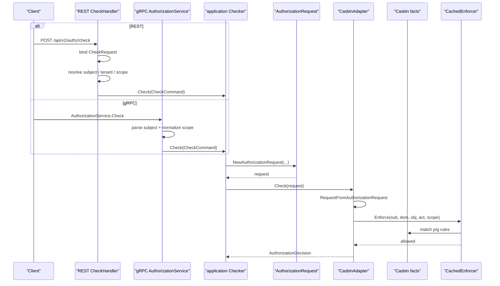
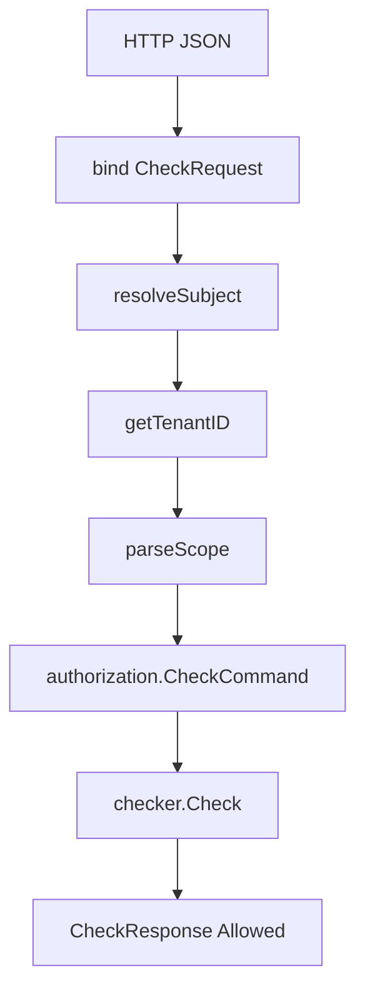
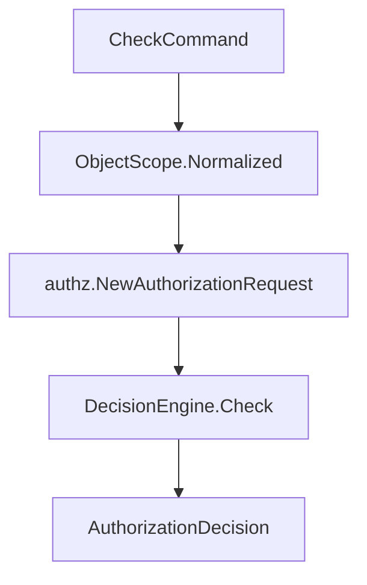
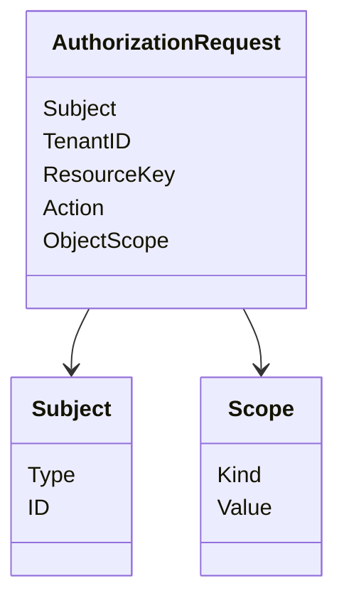
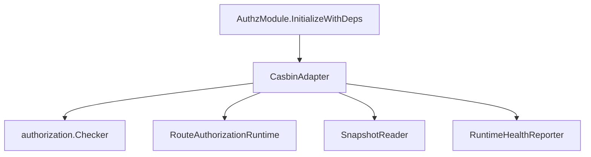
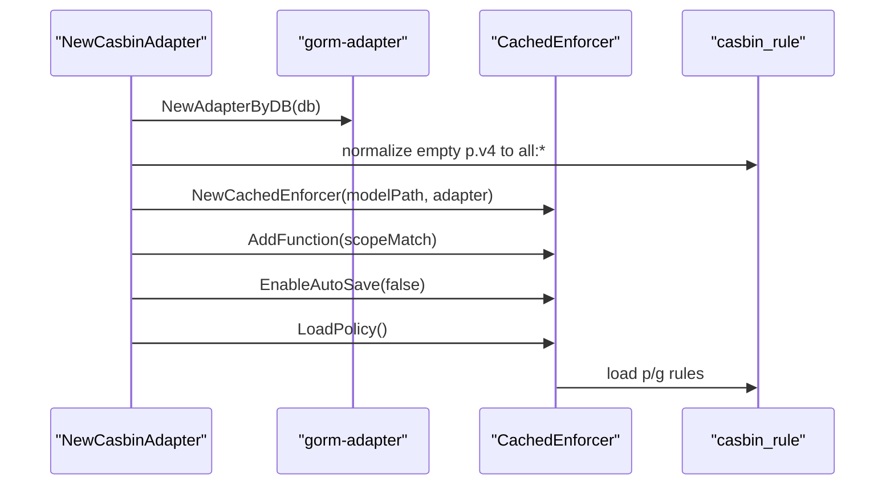
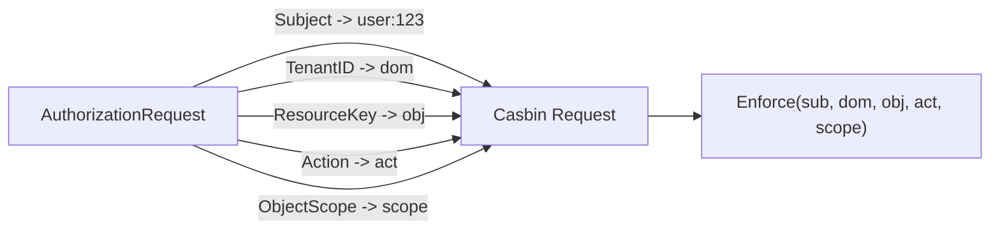
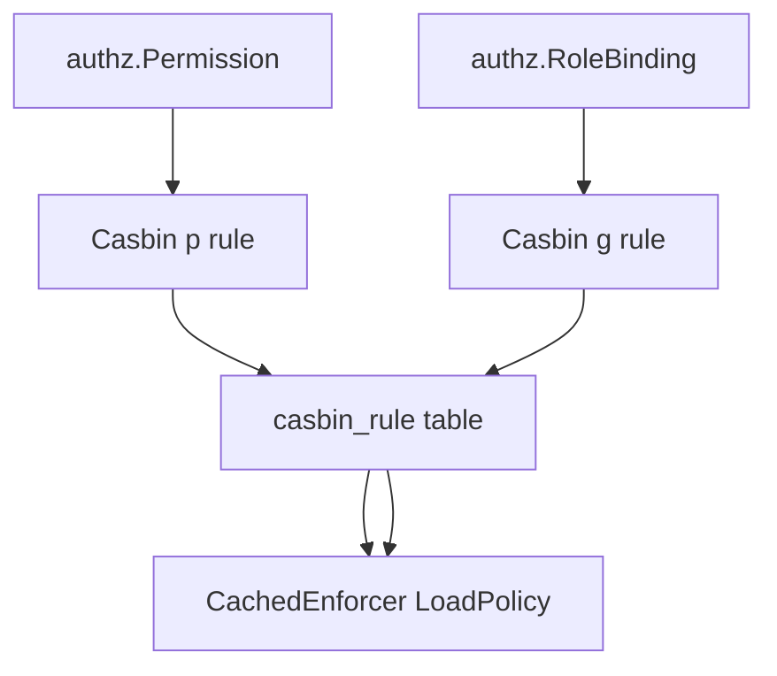

# 授权判定链路：从 Check 到 Casbin

## 本文回答

本文回答：IAM 的一次授权判定请求如何从 REST/gRPC 入口进入 application `Checker`，如何被转换成领域层 `AuthorizationRequest`，再如何由 `CasbinAdapter` 转换成 Casbin request fact，最终通过 Casbin model 和已加载的 policy/grouping facts 得到 `Allowed` 结果。

读完本文，你应该能回答：

- REST `POST /api/v2/authz/check` 的请求如何解析；
- REST Check 中 subject 和 tenant 从哪里来；
- gRPC `AuthorizationService.Check` 与 REST Check 有什么差异；
- `authorization.Checker` 在 application 层做了什么；
- `AuthorizationRequest` 的五个核心字段是什么；
- `CasbinAdapter.Check` 如何把领域请求转换成 Casbin request；
- Casbin model 的 `r/p/g` 分别是什么；
- `scopeMatch` 的规则是什么；
- `keyMatch`、`regexMatch` 在资源和动作判定中分别起什么作用；
- route-level authorization 和 PDP Check 有什么区别；
- 为什么 Casbin 是 infra adapter，不是业务模型；
- 授权事实从哪里来，为什么 Check 不负责写入事实。

本文只讨论“判定链路”。授权写入、PolicyChangeCommitter、UoW、Outbox、policy version 会在后续两篇文档中展开。

---

## 30 秒结论

IAM 的授权判定链路是：

```text
REST / gRPC Check
  -> transport DTO / proto 解析
  -> authorization.CheckCommand
  -> authorization.Checker
  -> domain AuthorizationRequest
  -> CasbinAdapter.Check
  -> RequestFromAuthorizationRequest
  -> Casbin Enforce(sub, dom, obj, act, scope)
  -> AuthorizationDecision{Allowed}
```

核心事实是：

```text
业务层的问题：
  某个 Subject 在某个 Tenant 下，能不能对某个 ResourceKey 的某个 Scope 执行 Action？

Casbin 层的问题：
  Enforce(sub, dom, obj, act, scope) 是否命中 p/g facts？
```

Casbin model 当前是五元组：

```text
r = sub, dom, obj, act, scope
p = sub, dom, obj, act, scope
g = _, _, _
```

matcher 当前是：

```text
g(r.sub, p.sub, r.dom)
&& r.dom == p.dom
&& keyMatch(r.obj, p.obj)
&& regexMatch(r.act, p.act)
&& scopeMatch(r.scope, p.scope)
```

这意味着一次判定必须同时满足：

1. subject 在当前 tenant 下拥有某个 role；
2. 请求 tenant 与 policy tenant 相同；
3. 请求 resource object 能匹配 policy resource object；
4. 请求 action 能匹配 policy action；
5. 请求 scope 能匹配 policy scope。

核心源码入口：

- [../../internal/apiserver/transport/rest/authz/router.go](../../internal/apiserver/transport/rest/authz/router.go)
- [../../internal/apiserver/transport/rest/authz/handler/check.go](../../internal/apiserver/transport/rest/authz/handler/check.go)
- [../../internal/apiserver/transport/rest/authz/dto/check.go](../../internal/apiserver/transport/rest/authz/dto/check.go)
- [../../internal/apiserver/transport/rest/authz/handler/base.go](../../internal/apiserver/transport/rest/authz/handler/base.go)
- [../../internal/apiserver/transport/grpc/service/authz/service.go](../../internal/apiserver/transport/grpc/service/authz/service.go)
- [../../internal/apiserver/application/authz/authorization/service.go](../../internal/apiserver/application/authz/authorization/service.go)
- [../../internal/apiserver/domain/authz/model.go](../../internal/apiserver/domain/authz/model.go)
- [../../internal/apiserver/infra/casbin/facts.go](../../internal/apiserver/infra/casbin/facts.go)
- [../../internal/apiserver/infra/casbin/adapter.go](../../internal/apiserver/infra/casbin/adapter.go)
- [../../configs/casbin_model.conf](../../configs/casbin_model.conf)

---

## 主图：从 Check 到 Casbin Enforce



---

## 重点速查

| 问题 | 当前答案 | 代码证据 |
| --- | --- | --- |
| REST Check 路由 | `POST /api/v2/authz/check`，在 AuthZ protected group 中注册。 | [../../internal/apiserver/transport/rest/authz/router.go](../../internal/apiserver/transport/rest/authz/router.go) |
| REST Check request 字段 | `object`、`action` 必填；`scope_type/scope_value` 可选；`subject_type/subject_id` 可选。 | [../../internal/apiserver/transport/rest/authz/dto/check.go](../../internal/apiserver/transport/rest/authz/dto/check.go) |
| REST subject 从哪里来 | 请求显式传 `subject_type/subject_id` 时使用请求 subject；否则使用当前 JWT user。 | [../../internal/apiserver/transport/rest/authz/handler/check.go](../../internal/apiserver/transport/rest/authz/handler/check.go) |
| REST tenant 从哪里来 | 从 Gin context 的 `tenant_id` 读取，通常由 JWT middleware 写入。 | [../../internal/apiserver/transport/rest/authz/handler/base.go](../../internal/apiserver/transport/rest/authz/handler/base.go) |
| REST scope 如何解析 | `parseScope` 调用 `authz.NormalizeScope(scope_type, scope_value)`。 | [../../internal/apiserver/transport/rest/authz/handler/base.go](../../internal/apiserver/transport/rest/authz/handler/base.go) |
| gRPC Check request 字段 | `subject`、`domain`、`object`、`action` 必填；scope 可选。 | [../../api/grpc/iam/authz/v2/authz.proto](../../api/grpc/iam/authz/v2/authz.proto) |
| gRPC subject 格式 | 必须是 `<type>:<id>`，例如 `user:123`。 | [../../internal/apiserver/transport/grpc/service/authz/service.go](../../internal/apiserver/transport/grpc/service/authz/service.go) |
| application Checker 做什么 | 构造领域 `AuthorizationRequest`，再调用 `DecisionEngine.Check`。 | [../../internal/apiserver/application/authz/authorization/service.go](../../internal/apiserver/application/authz/authorization/service.go) |
| DecisionEngine 当前是谁 | AuthZ module 初始化时把 `CasbinAdapter` 注入 `authorization.NewChecker`。 | [../../internal/apiserver/container/assembler/authz.go](../../internal/apiserver/container/assembler/authz.go) |
| Casbin request 如何生成 | `RequestFromAuthorizationRequest` 把领域请求转成 `sub/dom/obj/act/scope`。 | [../../internal/apiserver/infra/casbin/facts.go](../../internal/apiserver/infra/casbin/facts.go) |
| Casbin matcher 是什么 | role grouping + tenant equality + keyMatch + regexMatch + scopeMatch。 | [../../configs/casbin_model.conf](../../configs/casbin_model.conf) |
| scopeMatch 规则 | policy scope 为 `all:*` 时放行所有 request scope，否则要求 request scope 和 policy scope 完全相同。 | [../../internal/apiserver/infra/casbin/adapter.go](../../internal/apiserver/infra/casbin/adapter.go) |

---

## 1. 判定链路的系统定位

授权系统中通常有两个角色：

```text
PEP = Policy Enforcement Point，负责拦截请求并发起判定
PDP = Policy Decision Point，负责返回 allow / deny
```

在 IAM 中：

| 场景 | PEP | PDP |
| --- | --- | --- |
| REST protected route | JWT middleware / route guard | `RouteAuthorizationRuntime` / CasbinAdapter |
| REST `/authz/check` | AuthZ CheckHandler | application Checker + CasbinAdapter |
| gRPC `AuthorizationService.Check` | 调用方服务或 gRPC handler | application Checker + CasbinAdapter |
| 外部业务系统接入 | SDK / 服务代码 | IAM AuthZ Check API |

这篇文档主要讲 PDP Check：

```text
输入一个授权问题
返回 allowed true/false
```

不是讲授权事实如何写入。  
授权事实写入在后续 `PolicyChangeCommitter 与 UoW` 文档中展开。

---

## 2. REST Check 入口

REST Check 路由：

```text
POST /api/v2/authz/check
```

该路由只在以下条件满足时注册：

```text
AuthZ handlers 存在
JWT AuthMiddleware 存在
CheckHandler 存在
```

AuthZ router 先注册 `/api/v2/authz/health`，然后检查 `RoleHandler` 和 `AuthMiddleware`。如果 `AuthMiddleware` 为空，受保护路由包括 `/check` 都不会注册。

这意味着 REST Check 是受保护接口。  
没有 AuthN TokenService/JWT middleware 时，不会暴露 `/api/v2/authz/check`。

核心源码：

- [../../internal/apiserver/transport/rest/authz/router.go](../../internal/apiserver/transport/rest/authz/router.go)

---

## 3. REST Check Request

REST request：

```json
{
  "object": "scale:form:*",
  "action": "read",
  "scope_type": "origin",
  "scope_value": "school-a",
  "subject_type": "user",
  "subject_id": "123"
}
```

字段含义：

| 字段 | 是否必填 | 含义 |
| --- | ---: | --- |
| `object` | 是 | ResourceKey，例如 `scale:form:*` |
| `action` | 是 | 操作，例如 `read` |
| `scope_type` | 否 | scope kind，例如 `all` / `origin` |
| `scope_value` | 否 | scope value，例如 `*` / `school-a` |
| `subject_type` | 否 | 显式指定 subject type |
| `subject_id` | 否 | 显式指定 subject id |

如果没有显式传 `subject_type/subject_id`，REST handler 会使用当前 JWT 用户作为 subject：

```text
SubjectTypeUser + current user_id
```

tenant 不来自 request body，而来自当前请求上下文：

```text
getTenantID(c)
```

这个上下文通常由 JWT middleware 从 token claims 中写入。

核心源码：

- [../../internal/apiserver/transport/rest/authz/dto/check.go](../../internal/apiserver/transport/rest/authz/dto/check.go)
- [../../internal/apiserver/transport/rest/authz/handler/check.go](../../internal/apiserver/transport/rest/authz/handler/check.go)
- [../../internal/apiserver/transport/rest/authz/handler/base.go](../../internal/apiserver/transport/rest/authz/handler/base.go)
- [../../internal/pkg/middleware/authn/jwt_middleware.go](../../internal/pkg/middleware/authn/jwt_middleware.go)

---

## 4. REST Check Handler 的职责

`CheckHandler.Check` 做的事情是：

1. 确认 checker 可用；
2. bind JSON 到 `dto.CheckRequest`；
3. 解析 subject；
4. 解析 tenant；
5. 解析 scope；
6. 调用 application `checker.Check`;
7. 返回 `{ "allowed": true/false }`。



它不做：

- 不直接调用 Casbin；
- 不读取 casbin_rule；
- 不读取 Role/Permission/RoleBinding；
- 不做 JWT verify，JWT verify 由 AuthMiddleware 之前完成；
- 不做业务权限解释，只返回 allowed。

这保持了 transport 层的边界：  
**handler 只做协议适配和上下文解析。**

核心源码：

- [../../internal/apiserver/transport/rest/authz/handler/check.go](../../internal/apiserver/transport/rest/authz/handler/check.go)

---

## 5. Subject 解析规则

REST 中 subject 有两种来源。

### 5.1 显式 subject

如果请求中同时提供：

```text
subject_type
subject_id
```

handler 会调用：

```text
authz.NewSubject(subject_type, subject_id)
```

示例：

```json
{
  "subject_type": "user",
  "subject_id": "123",
  "object": "scale:form:*",
  "action": "read"
}
```

这适合管理员或服务端代理判断“某个主体是否有权限”。

### 5.2 当前用户 subject

如果请求没有提供 subject，handler 会从 JWT context 读取当前用户：

```text
getUserID(c)
```

然后构造：

```text
Subject{Type: user, ID: <current user id>}
```

这适合“判断当前登录用户是否有权限”。

### 5.3 失败边界

如果既没有显式 subject，也拿不到当前 user id，返回 unauthorized：

```text
subject required: authenticate or pass subject_type and subject_id
```

核心源码：

- [../../internal/apiserver/transport/rest/authz/handler/check.go](../../internal/apiserver/transport/rest/authz/handler/check.go)

---

## 6. Tenant 与 Scope 解析规则

### 6.1 Tenant

REST Check 的 tenant 来自 Gin context：

```text
tenant_id
```

不是 request body 字段。

这意味着 REST Check 默认以当前 token 所属 tenant 作为判定 domain。

### 6.2 Scope

REST scope 来自：

```text
scope_type
scope_value
```

然后调用：

```text
authz.NormalizeScope(scopeType, scopeValue)
```

规则在领域模型中定义：

| 输入 | 结果 |
| --- | --- |
| scope_type/scope_value 都空 | 默认 `all:*` |
| `all` + 空 value | 规范化为 `all:*` |
| `all` + 非 `*` | 错误 |
| `origin` + 非空非 `*` value | 合法 |
| `origin` + 空或 `*` | 错误 |

### 6.3 为什么 scope 不能只当普通字符串

scope 是授权模型的一部分。  
如果不规范化，以下几种输入可能产生不一致：

```text
空 scope
all:*
all + empty
origin + *
origin + empty
```

因此 handler 只做解析，真正规则由 domain `Scope` 统一维护。

核心源码：

- [../../internal/apiserver/transport/rest/authz/handler/base.go](../../internal/apiserver/transport/rest/authz/handler/base.go)
- [../../internal/apiserver/domain/authz/model.go](../../internal/apiserver/domain/authz/model.go)

---

## 7. gRPC Check 入口

gRPC AuthZ Check 定义在：

```text
AuthorizationService.Check
```

proto request：

```protobuf
message CheckRequest {
  string subject = 1;
  string domain = 2;
  string object = 3;
  string action = 4;
  string scope_type = 5;
  string scope_value = 6;
}
```

与 REST 的差异：

| 维度 | REST Check | gRPC Check |
| --- | --- | --- |
| subject | 可选；缺省用当前 JWT user | 必填 |
| tenant/domain | 从 JWT context 取 tenant_id | request.domain 必填 |
| subject 格式 | `subject_type + subject_id` | `<type>:<id>` |
| scope | `scope_type/scope_value` | `scope_type/scope_value` |
| 结果 | JSON `{allowed}` | proto `CheckResponse{allowed}` |

gRPC Check 会校验：

```text
subject/domain/object/action 必填
subject 必须是 <type>:<id>
scope 必须能 NormalizeScope
```

然后同样调用 application `Checker.Check`。

核心源码：

- [../../api/grpc/iam/authz/v2/authz.proto](../../api/grpc/iam/authz/v2/authz.proto)
- [../../internal/apiserver/transport/grpc/service/authz/service.go](../../internal/apiserver/transport/grpc/service/authz/service.go)

---

## 8. Application Checker

REST 和 gRPC 最终都会进入：

```text
authorization.Checker
```

接口：

```go
type DecisionEngine interface {
    Check(ctx context.Context, request authz.AuthorizationRequest) (authz.AuthorizationDecision, error)
}
```

`Checker.Check` 做两件事：

1. 规范化 scope；
2. 构造领域层 `AuthorizationRequest`；
3. 调用 `DecisionEngine.Check`。



如果 checker 或 engine 不存在，会返回：

```text
authorization engine not available
```

这也是运行时降级或 AuthZ 初始化失败时的重要错误边界。

核心源码：

- [../../internal/apiserver/application/authz/authorization/service.go](../../internal/apiserver/application/authz/authorization/service.go)

---

## 9. AuthorizationRequest：领域授权问题

领域层 `AuthorizationRequest` 是判定的统一业务输入。

字段：

| 字段 | 含义 |
| --- | --- |
| `Subject` | 被授权主体 |
| `TenantID` | 租户 / domain |
| `ResourceKey` | 资源 key |
| `Action` | 动作 |
| `ObjectScope` | 对象范围 |

构造规则：

```text
subject required
tenant required
resourceKey required
action required
scope defaults to all:*
scope must be valid
```



这一步的意义是：  
无论 REST/gRPC 怎么传参，进入判定引擎前都必须变成统一的领域授权问题。

核心源码：

- [../../internal/apiserver/domain/authz/model.go](../../internal/apiserver/domain/authz/model.go)

---

## 10. AuthZ module 如何装配判定引擎

AuthZ module 初始化时会创建 Casbin adapter：

```text
casbinInfra.NewCasbinAdapter(db, modelPath)
```

如果 `ModelPath` 为空，默认使用：

```text
configs/casbin_model.conf
```

然后注入：

```text
m.routeAuthorization = casbinAdapter
m.roleNames = casbinAdapter
m.runtimeHealth = casbinAdapter
authorizationChecker = authorization.NewChecker(casbinAdapter)
authorizationSnapshotReader = authorization.NewSnapshotReader(casbinAdapter, policyVersionRepository)
```



这说明 CasbinAdapter 在当前 AuthZ 运行时有多重角色：

| 能力 | 用途 |
| --- | --- |
| `DecisionEngine.Check` | PDP Check |
| `RouteAuthorizationRuntime.AuthorizeRoute` | REST middleware route-level guard |
| `DirectRoleKeys` | admin / role check |
| `SnapshotStore` | 授权快照读取 |
| `RuntimeHealthReporter` | `/health` 中的 AuthZ runtime health |

核心源码：

- [../../internal/apiserver/container/assembler/authz.go](../../internal/apiserver/container/assembler/authz.go)
- [../../internal/apiserver/application/authz/authorization/service.go](../../internal/apiserver/application/authz/authorization/service.go)
- [../../internal/apiserver/infra/casbin/adapter.go](../../internal/apiserver/infra/casbin/adapter.go)

---

## 11. CasbinAdapter 初始化

`NewCasbinAdapter` 做的事情：

1. 创建 gorm-adapter；
2. normalize persisted policy scope；
3. 创建 `casbin.NewCachedEnforcer(modelPath, adapter)`；
4. 注册自定义函数 `scopeMatch`；
5. 关闭 AutoSave；
6. `LoadPolicy()` 从 DB 加载 policy；
7. 返回 adapter。



### 为什么关闭 AutoSave

源码注释写得很清楚：

```text
DB 是授权事实源；运行时 Enforcer 只负责内存加载与判定。
```

也就是说，写入事实不应该由 Casbin runtime 判定器随手保存。  
授权事实写入应由 UoW / PolicyChangeCommitter 统一处理，保证事务、版本和事件传播一致。

核心源码：

- [../../internal/apiserver/infra/casbin/adapter.go](../../internal/apiserver/infra/casbin/adapter.go)

---

## 12. 领域请求如何变成 Casbin Request

`CasbinAdapter.Check` 调用：

```text
RequestFromAuthorizationRequest(request)
```

映射规则：

| AuthorizationRequest | Casbin Request |
| --- | --- |
| `Subject` | `Sub = SubjectKey(subject)` |
| `TenantID` | `Dom` |
| `ResourceKey` | `Obj` |
| `Action` | `Act` |
| `ObjectScope` | `Scope = ScopeKey(scope)` |

`SubjectKey` 规则：

```text
<subject_type>:<subject_id>
```

例如：

```text
user:123
service:qs-server
```

`ScopeKey` 规则：

```text
empty scope -> all:*
valid scope -> scope.Normalized().String()
```



核心源码：

- [../../internal/apiserver/infra/casbin/facts.go](../../internal/apiserver/infra/casbin/facts.go)

---

## 13. Casbin model

当前 Casbin model：

```ini
[request_definition]
r = sub, dom, obj, act, scope

[policy_definition]
p = sub, dom, obj, act, scope

[role_definition]
g = _, _, _

[policy_effect]
e = some(where (p.eft == allow))

[matchers]
m = g(r.sub, p.sub, r.dom)
    && r.dom == p.dom
    && keyMatch(r.obj, p.obj)
    && regexMatch(r.act, p.act)
    && scopeMatch(r.scope, p.scope)
```

### 13.1 request_definition

请求五元组：

```text
r.sub   subject
r.dom   tenant/domain
r.obj   resource object
r.act   action
r.scope object scope
```

### 13.2 policy_definition

策略五元组：

```text
p.sub   role key
p.dom   tenant/domain
p.obj   resource pattern
p.act   action pattern
p.scope policy scope
```

### 13.3 role_definition

三元组 role binding：

```text
g = subject, role, domain
```

也就是：

```text
g(user:123, role:teacher, school-a)
```

### 13.4 matcher

一次请求允许的条件：

```text
subject 在当前 domain 下拥有 policy role
domain 相等
resource 匹配
action 匹配
scope 匹配
```

核心源码：

- [../../configs/casbin_model.conf](../../configs/casbin_model.conf)

---

## 14. Permission / RoleBinding facts 从哪里来

Check 不负责写入 facts。  
Check 只读取已加载到 Casbin enforcer 的 facts。

facts 来自前面的授权写入流程：

```text
GrantPermission / RevokePermission
BindRole / UnbindRole
  -> AuthorizationPolicy
  -> PolicyChange
  -> PolicyChangeCommitter
  -> UoW
  -> casbin_rule facts
  -> runtime LoadPolicy / reload
```

在 infra 层，业务模型会被转换成 Casbin facts：

### 14.1 Permission -> PolicyRule

```text
Permission(RoleName, TenantID, ResourceKey, Action, Scope)
  -> p(role:<roleName>, tenant, resourceKey, action, scope)
```

### 14.2 RoleBinding -> GroupingRule

```text
RoleBinding(Subject, RoleName, TenantID)
  -> g(<type>:<id>, role:<roleName>, tenant)
```



核心源码：

- [../../internal/apiserver/infra/casbin/facts.go](../../internal/apiserver/infra/casbin/facts.go)
- [../../internal/apiserver/domain/authz/policy/authorization_policy.go](../../internal/apiserver/domain/authz/policy/authorization_policy.go)
- [../../internal/apiserver/application/authz/policy/administration.go](../../internal/apiserver/application/authz/policy/administration.go)

---

## 15. scopeMatch 规则

IAM 自定义了 `scopeMatch`。

当前规则：

```text
normalize requestScope
normalize policyScope

if policyScope == all:*:
    return true

return requestScope == policyScope
```

因此：

| Request Scope | Policy Scope | 结果 |
| --- | --- | ---: |
| `all:*` | `all:*` | true |
| `origin:school-a` | `all:*` | true |
| `origin:school-a` | `origin:school-a` | true |
| `origin:school-a` | `origin:school-b` | false |
| `all:*` | `origin:school-a` | false |

这表达的是：

```text
policy all:* 可以覆盖任意对象范围
policy origin:x 只覆盖 request origin:x
```

### 为什么是 policy scope 覆盖 request scope

判定逻辑看的是：

```text
请求的对象范围 是否被 policy 授权范围覆盖
```

因此 policy scope 是更高一级的授权边界。

核心源码：

- [../../internal/apiserver/infra/casbin/adapter.go](../../internal/apiserver/infra/casbin/adapter.go)

---

## 16. Resource keyMatch 与 Action regexMatch

Casbin matcher 中还有两个匹配：

```text
keyMatch(r.obj, p.obj)
regexMatch(r.act, p.act)
```

### 16.1 Resource keyMatch

`keyMatch` 允许 policy object 使用模式匹配。

例如，假设 policy resource 是：

```text
scale:form:*
```

请求 resource 是：

```text
scale:form:123
```

就可以通过 keyMatch 的模式语义匹配。

这让 ResourceKey 可以表达资源族，而不是只能精确匹配单个对象。

### 16.2 Action regexMatch

`regexMatch` 允许 policy action 使用正则表达式。

例如 policy action 可以表达：

```text
read|list
```

从而匹配多个 action。

### 16.3 当前边界

Resource 目录本身仍会定义合法 actions。  
写入 permission 时，domain validator 会检查资源是否支持该 action。  
运行时 Casbin 的 regexMatch 是判定表达能力，不应该绕过 Resource catalog 的业务校验。

核心源码：

- [../../configs/casbin_model.conf](../../configs/casbin_model.conf)
- [../../internal/apiserver/domain/authz/resource/resource.go](../../internal/apiserver/domain/authz/resource/resource.go)
- [../../internal/apiserver/domain/authz/policy/validator.go](../../internal/apiserver/domain/authz/policy/validator.go)

---

## 17. Route-level Authorization 与 PDP Check

IAM 里还有一类授权：REST route-level authorization。

它在 JWT middleware 中提供：

```text
RequireRole
RequirePlatformAdmin
RequirePermission
```

这些不是 `/authz/check` API，但也使用同一个 `RouteAuthorizationRuntime`，当前实现也是 CasbinAdapter。

### 17.1 RequirePermission

`RequirePermission(resourceObj, action)` 会：

1. 从 Gin context 取当前 user_id；
2. 构造 subject key：`user:<id>`；
3. 从 Gin context 取 tenant；
4. 调用 `routeAuth.AuthorizeRoute(ctx, sub, tenantID, resourceKey, action)`。

`CasbinAdapter.AuthorizeRoute` 固定使用：

```text
scope = all:*
```

这说明 route guard 只做租户内粗粒度路由授权，不做对象级 scope 判定。

### 17.2 RequireRole / RequirePlatformAdmin

这两个能力调用：

```text
DirectRoleKeys(sub, tenantID)
```

判断用户是否直接拥有某些 role key。

### 17.3 和 PDP Check 的区别

| 维度 | Route-level Authorization | PDP Check |
| --- | --- | --- |
| 入口 | middleware | REST/gRPC Check API |
| subject | 当前 JWT user | REST 可显式 subject；gRPC 必填 subject |
| scope | 当前固定 `all:*` | 可传 `scope_type/scope_value` |
| 用途 | 保护 IAM 自己的管理路由 | 给业务系统做权限判定 |
| 返回 | 直接放行 / 403 | `{allowed}` |

核心源码：

- [../../internal/pkg/middleware/authn/jwt_middleware.go](../../internal/pkg/middleware/authn/jwt_middleware.go)
- [../../internal/apiserver/infra/casbin/adapter.go](../../internal/apiserver/infra/casbin/adapter.go)

---

## 18. 授权快照与 Check 的区别

gRPC AuthZ 还提供：

```text
GetAuthorizationSnapshot
```

它和 Check 不一样。

| 能力 | 目的 |
| --- | --- |
| `Check` | 回答某一次操作是否 allowed |
| `GetAuthorizationSnapshot` | 返回 subject 在某个 tenant/app 下的 roles、permissions、authz version |

SnapshotReader 会：

1. 读取 subject 的 role names；
2. 读取 subject 的 permissions；
3. 读取当前 policy version；
4. 按 app_name 过滤 role 和 permission；
5. 返回 snapshot。

它适合业务服务缓存或展示授权快照。  
但最终是否允许某次操作，仍然应以 Check 或本地等价判定为准。

核心源码：

- [../../internal/apiserver/application/authz/authorization/service.go](../../internal/apiserver/application/authz/authorization/service.go)
- [../../internal/apiserver/transport/grpc/service/authz/service.go](../../internal/apiserver/transport/grpc/service/authz/service.go)

---

## 19. 失败边界

| 阶段 | 失败点 | 当前行为 |
| --- | --- | --- |
| REST router | AuthMiddleware nil | 不注册 `/api/v2/authz/check` |
| REST Check | checker nil | 返回 internal error |
| REST Check | request bind 失败 | 返回 bind error |
| REST Check | subject 缺失且 JWT user 不存在 | 返回 unauthorized |
| REST Check | tenant_id 不在 context | 返回 token invalid |
| REST Check | scope 非法 | 返回 invalid argument |
| gRPC Check | checker nil | `Unavailable` |
| gRPC Check | subject/domain/object/action 缺失 | `InvalidArgument` |
| gRPC Check | subject 不是 `<type>:<id>` | `InvalidArgument` |
| application Checker | engine nil | internal error |
| domain request | subject/tenant/resource/action 缺失 | invalid argument |
| CasbinAdapter | Enforce 出错 | 返回 error |
| Casbin policy 未 reload | 使用当前 enforcer 内存策略 | 可能与 DB 最新事实短暂不一致 |
| route guard | RouteAuthorizationRuntime nil | middleware 返回 internal error 或相关 routes 不注册 |
| route guard | `RequirePermission` scope | 固定 `all:*`，不做对象级 scope 判定 |

---

## 20. 常见误区

### 误区一：Check API 直接查数据库权限表

不对。  
Check 进入 application Checker 后，由 CasbinAdapter 使用内存 enforcer 判定。Casbin enforcer 的 policy 来自启动或 reload 时从 DB 加载的 facts。

### 误区二：Check 会写入 policy

不对。  
Check 只读判定，不写入任何 policy/grouping facts。

### 误区三：REST Check 的 tenant 来自请求 body

不对。  
REST tenant 来自 JWT context 中的 `tenant_id`。gRPC Check 才显式传 `domain`。

### 误区四：Route RequirePermission 等同于完整 PDP Check

不对。  
Route RequirePermission 当前固定 scope 为 `all:*`，主要用于保护 IAM 管理路由。PDP Check 可以传对象 scope。

### 误区五：Casbin 的 sub/dom/obj/act/scope 就是业务语言

不对。  
业务语言是 Subject、Tenant、Resource、Action、Scope、Role、Permission、RoleBinding。Casbin 五元组只是运行时事实适配。

### 误区六：scopeMatch 是双向匹配

不对。  
当前规则是 policy `all:*` 覆盖任意 request scope；否则必须精确相等。请求 `all:*` 不会自动覆盖 policy `origin:x`。

### 误区七：gRPC Check 可以省略 subject

不对。  
gRPC subject 必填，且必须是 `<type>:<id>` 格式。

---

## 21. 当前边界与待讨论点

### 21.1 REST Check 的显式 subject 需要谨慎使用

REST Check 允许传 `subject_type/subject_id`，否则默认当前用户。  
这意味着拥有 Check API 调用权限的客户端理论上可以判断其他 subject 的权限。是否允许这种行为，应由上层调用方、路由授权和业务使用约束共同决定。

### 21.2 Route-level authorization 当前是粗粒度

`AuthorizeRoute` 固定使用：

```text
all:*
```

因此适合保护接口级别能力，不适合判断具体业务对象归属。  
对象级判定应走 PDP Check 并携带 `scope_type/scope_value`。

### 21.3 Casbin runtime 和 DB facts 之间依赖 reload

`NewCasbinAdapter` 启动时会 `LoadPolicy()`。  
后续写入事实后，需要 runtime reload 才能让内存 enforcer 看到最新 policy。这个机制会在后续 `PolicyChangeCommitter 与 UoW` 文档中详细说明。

### 21.4 action 使用 regexMatch，需避免滥用

Casbin matcher 支持 action regex。  
这提供了灵活性，但也意味着 policy action 如果写得过宽，可能扩大授权范围。Resource catalog 的 action 校验应作为写入侧护栏。

---

## 22. 推荐源码阅读路线

### 第一轮：REST Check 入口

```text
internal/apiserver/transport/rest/authz/router.go
internal/apiserver/transport/rest/authz/dto/check.go
internal/apiserver/transport/rest/authz/handler/check.go
internal/apiserver/transport/rest/authz/handler/base.go
```

目标：搞清 REST request 如何变成 CheckCommand。

### 第二轮：gRPC Check 入口

```text
api/grpc/iam/authz/v2/authz.proto
internal/apiserver/transport/grpc/service/authz/service.go
```

目标：搞清 gRPC subject/domain/object/action 如何进入 application。

### 第三轮：application Checker

```text
internal/apiserver/application/authz/authorization/service.go
```

目标：搞清 Checker 如何构造 AuthorizationRequest。

### 第四轮：领域授权模型

```text
internal/apiserver/domain/authz/model.go
```

目标：搞清 AuthorizationRequest、Subject、Scope、AuthorizationDecision。

### 第五轮：Casbin facts 和 adapter

```text
internal/apiserver/infra/casbin/facts.go
internal/apiserver/infra/casbin/adapter.go
configs/casbin_model.conf
```

目标：搞清业务模型如何转成 Casbin r/p/g，并如何 Enforce。

### 第六轮：AuthZ 装配

```text
internal/apiserver/container/assembler/authz.go
internal/pkg/middleware/authn/jwt_middleware.go
```

目标：搞清 CasbinAdapter 如何被同时注入 Checker、routeAuth、SnapshotReader、RuntimeHealth。

---

## 23. 验证建议

```bash
go test ./internal/apiserver/application/authz/authorization \
  ./internal/apiserver/domain/authz \
  ./internal/apiserver/infra/casbin \
  ./internal/apiserver/transport/rest/authz/handler \
  ./internal/apiserver/transport/grpc/service/authz \
  ./internal/apiserver/container

make docs-hygiene
```

建议重点测试方向：

| 测试方向 | 目的 |
| --- | --- |
| REST Check 当前用户 subject | 不传 subject 时使用 JWT user |
| REST Check 显式 subject | 传 subject_type/subject_id 时使用显式 subject |
| REST Check tenant context | tenant_id 缺失时失败 |
| Scope normalization | 空 scope 默认 all:*，非法 scope 返回错误 |
| gRPC subject parse | `<type>:<id>` 正常，非法格式失败 |
| AuthorizationRequest validation | subject/tenant/resource/action 缺失失败 |
| Casbin request mapping | AuthorizationRequest -> sub/dom/obj/act/scope |
| scopeMatch | policy all:* 覆盖 request origin:x，反向不成立 |
| keyMatch | resource pattern 能匹配请求 object |
| regexMatch | action pattern 能匹配请求 action |
| route authorization | RequirePermission 使用 all:* |
| policy reload boundary | 写入后 reload 前后 Check 结果变化 |

---

## 本文总结

授权判定链路可以压缩成一句话：

> REST/gRPC Check 先把协议输入转换成领域 AuthorizationRequest，再由 CasbinAdapter 转成 Casbin 五元组 request，最终用已加载的 p/g facts 执行 Enforce，返回 Allowed。

核心链路是：

```text
CheckRequest
  -> CheckCommand
  -> AuthorizationRequest
  -> Casbin Request
  -> Enforce(sub, dom, obj, act, scope)
  -> AuthorizationDecision
```

判定成功必须满足：

```text
subject 在 tenant 下拥有 role
role 在 tenant 下拥有 permission
resource 匹配
action 匹配
scope 匹配
```

理解这篇后，下一篇《PolicyChangeCommitter 与 UoW》会继续解释：

```text
p/g facts 是如何被写入的
为什么需要 UoW
为什么写入后要 reload runtime policy
为什么授权写入不是简单 CRUD
```
