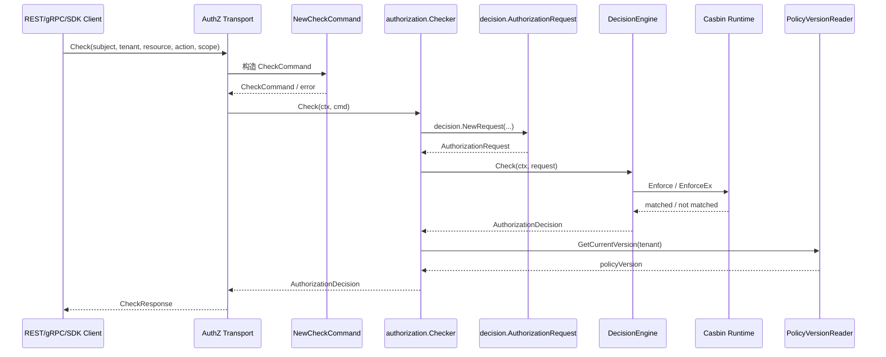
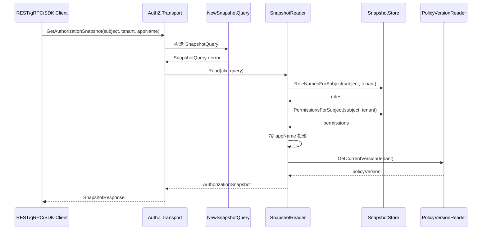

# 03-Check 与 Snapshot 读链路

## 1. 本文定位

本文是 `03-授权AuthZ/` 文档组中关于 **授权读链路** 的文档。

前面几篇文档已经完成了 AuthZ 核心模型铺垫：

```text
00-AuthZ模型总览：Subject -> RoleBinding -> Role -> Permission -> Resource / Action / Scope
01-授权资源与动作模型：ResourceKey / ResourcePattern / Action / Scope
02-授权角色与绑定模型：Role / RoleBinding / Subject
```

本文开始进入链路层，重点回答两个问题：

```text
一次权限判定 Check 是如何从请求进入 AuthZ，并返回 AuthorizationDecision 的？
一次授权快照 Snapshot 是如何读取 Subject 在 Tenant / App 下的角色与权限集合的？
```

AuthZ 的读链路主要有两类：

```text
Check：单次授权判定，回答“能不能访问？”
Snapshot：授权快照读取，回答“当前有哪些角色和权限？”
```

本文只讲读链路。

授权写入链路、PolicyChange、UoW、Outbox、RuntimeReload 等内容会放到后续文档：

```text
04-授权写入链路-PolicyAdministration与PolicyChange.md
05-PolicyChangeCommitter与AuthZUoW.md
07-PolicyVersion-Outbox与RuntimeReload.md
```

---

## 2. 30 秒结论

AuthZ 的读链路分为：

```text
Check
Snapshot
```

它们的职责不同：

| 链路 | 回答的问题 | 典型场景 |
| --- | --- | --- |
| Check | 某个 Subject 能不能访问某个 Resource？ | API 请求准入、业务操作前置校验 |
| Snapshot | 某个 Subject 当前拥有哪些 Role / Permission？ | SDK 缓存、前端菜单、权限展示、批量判断 |

Check 的核心链路是：

```text
REST / gRPC / SDK
  -> NewCheckCommand
  -> Checker.Check
  -> AuthorizationRequest
  -> DecisionEngine
  -> Casbin Runtime
  -> AuthorizationDecision
```

Snapshot 的核心链路是：

```text
REST / gRPC / SDK
  -> NewSnapshotQuery
  -> SnapshotReader.Read
  -> SnapshotStore
  -> Role / Permission Projection
  -> AuthorizationSnapshot
```

一句话：

> Check 是“实时 PDP 判定”，Snapshot 是“授权事实投影”；两者共用 AuthZ 模型和 PolicyVersion，但服务于不同读场景。

---

## 3. 为什么需要两条读链路

如果只有 Check，会遇到这些问题：

```text
前端菜单需要知道当前用户有哪些功能入口
后台页面需要展示当前用户有哪些角色和权限
业务服务可能需要一次性缓存当前主体的权限集合
批量操作前可能需要提前判断多个资源动作
```

这些场景不是简单问：

```text
allowed = true / false
```

而是需要拿到：

```text
roles
permissions
policy_version
```

所以需要 Snapshot。

反过来，如果只有 Snapshot，也会有问题：

```text
业务请求准入不能只依赖调用方自己解释权限快照
Snapshot 缓存可能过期
复杂 scope/action/resource matcher 不应该散落到业务服务里
最终是否允许访问应由 AuthZ 的判定链路负责
```

所以 Check 仍然是权威判定入口。

两条链路的关系是：

```text
Check 是权威判定。
Snapshot 是授权事实视图。
```

---

## 4. Check 链路总览

### 4.1 Check 要回答什么

Check 回答的是：

```text
某个 Subject，在某个 Tenant 下，能不能对某个 Resource 执行某个 Action，并且满足某个 Scope？
```

例如：

```text
user:1001 在 tenant-a 下，能否对 iam:identity:user:* 执行 read，作用范围是 all:*？
```

对应到领域模型是：

```text
AuthorizationRequest(
  Subject,
  TenantID,
  ResourcePattern,
  Action,
  ObjectScope,
)
```

Check 的输出是：

```text
AuthorizationDecision(
  Allowed,
  Reason,
  DenyCode,
  MatchedRole,
  MatchedPermission,
  PolicyVersion,
  EvaluatedAt,
)
```

---

### 4.2 Check 链路图



---

## 5. CheckCommand：Transport 到 Application 的边界

### 5.1 为什么需要 CheckCommand

Transport 层接收到的是协议数据。

例如 REST 请求可能是：

```json
{
  "subject_type": "user",
  "subject_id": "1001",
  "tenant_id": "tenant-a",
  "object": "iam:identity:user:*",
  "action": "read",
  "scope": "all:*"
}
```

这些都是 wire format。

它们不能直接进入领域层。

需要先转换为应用层命令：

```text
CheckCommand
```

CheckCommand 的职责是：

```text
校验 subject 是否是合法 SubjectRef
校验 tenantID 是否是合法 tenant.ID
校验 resource 是否是合法 resource.Pattern
校验 action 是否是合法 resource.Action
校验 scope 是否是合法 scope.Scope
```

因此，Transport 不应该直接拼结构体字段。

它应该通过：

```text
NewCheckCommand
```

进入 application boundary。

---

### 5.2 CheckCommand 的语义字段

CheckCommand 应该表达领域语义，而不是裸字符串：

```text
Subject     subject.Ref
TenantID    tenant.ID
ResourceKey resource.Pattern
Action      resource.Action
ObjectScope scope.Scope
```

这样做有几个好处：

```text
非法输入在 application boundary 之前被拦截
Checker 内部不需要反复解释字符串
Transport 与 Domain 之间有清晰边界
测试可以直接针对 NewCheckCommand 覆盖边界条件
```

---

### 5.3 CheckCommand 不做什么

CheckCommand 只负责参数语义化。

它不负责：

```text
查询用户是否存在
查询角色绑定
查询 Permission
访问 Casbin
读取 PolicyVersion
```

这些分别属于：

```text
SubjectResolver / RoleBinding 写入校验
DecisionEngine
SnapshotStore
PolicyVersionReader
```

不要把 CheckCommand 做成“半个授权服务”。

---

## 6. AuthorizationRequest：领域判定请求

### 6.1 AuthorizationRequest 是什么

`AuthorizationRequest` 是领域层的一次授权请求。

它不是 HTTP request。

它也不是 gRPC request。

它是 AuthZ 领域语言中的问题：

```text
Subject 在 Tenant 下，能不能对 ResourcePattern 执行 Action，并且满足 ObjectScope？
```

它包含：

```text
Subject
TenantID
ResourcePattern
Action
ObjectScope
```

---

### 6.2 为什么 Resource 是 Pattern

Check 请求里使用的是：

```text
ResourcePattern
```

不是 ResourceKey。

原因是，判定请求本质上也要进入 matcher。

例如业务侧可能问：

```text
iam:identity:user:*
```

也可能问：

```text
qs:evaluation:report:abc
```

只要它符合四段资源模式，就可以由运行时 matcher 判断是否被 policy resource pattern 覆盖。

但要注意：

```text
Check 请求中的 resource 不应该是 HTTP path。
Check 请求中的 resource 应该是授权资源语义。
```

---

### 6.3 为什么 Action 是具体动作

Check 请求中的 Action 必须是具体动作。

例如：

```text
read
list
update
export
```

不应该是：

```text
read|list
.*
```

因为：

```text
Action 是请求侧动作。
ActionPattern 是 policy 侧匹配表达式。
```

如果请求侧传入 `.*`，就相当于让调用方扩大了判定问题，会破坏授权语义。

---

### 6.4 ObjectScope 的语义

`ObjectScope` 表示本次请求涉及的对象范围。

例如：

```text
all:*
origin:1001
```

如果业务请求访问的是全局列表，可以使用：

```text
all:*
```

如果业务请求访问的是某个归属对象，可以使用：

```text
origin:<owner-or-origin-id>
```

运行时判定会检查：

```text
policy scope 是否覆盖 request object scope
```

典型规则是：

```text
all:* 可以覆盖 origin:x
origin:x 只能覆盖 origin:x
origin:x 不能覆盖 all:*
```

---

## 7. Checker：Check 用例编排器

### 7.1 Checker 的职责

`Checker` 是应用层读服务。

它负责用例编排：

```text
接收 CheckCommand
构造 AuthorizationRequest
调用 DecisionEngine
补充 PolicyVersion
返回 AuthorizationDecision
```

它不负责：

```text
直接查询 casbin_rule
直接解释 p/g facts
直接操作 Casbin Enforcer
直接修改授权事实
```

---

### 7.2 Checker 为什么要补充 PolicyVersion

PolicyVersion 表示某个 Tenant 下授权策略的版本。

每次授权写入成功后，PolicyVersion 会递增。

Check 返回时带上 PolicyVersion，有几个作用：

```text
调用方可以知道本次判定基于哪个授权版本
SDK 可以基于版本做缓存失效
排查权限问题时可以对齐策略变更时间线
Snapshot 与 Check 可以使用同一套版本概念
```

例如：

```json
{
  "allowed": false,
  "reason": "not_matched",
  "deny_code": "policy_not_matched",
  "policy_version": 17
}
```

这比只返回：

```json
{
  "allowed": false
}
```

更适合工程排障。

---

## 8. DecisionEngine：授权判定端口

### 8.1 DecisionEngine 是什么

`DecisionEngine` 是 application/domain 与 runtime infra 之间的端口。

它的输入是领域请求：

```text
AuthorizationRequest
```

它的输出是领域结果：

```text
AuthorizationDecision
```

它屏蔽了运行时实现细节。

当前运行时可以由 Casbin 实现，但 application 不应该依赖 Casbin 的 API。

---

### 8.2 为什么需要端口隔离

如果 Checker 直接调用 Casbin：

```text
Enforce(sub, dom, obj, act, scope)
```

那么 application 层就会被 infra 细节污染。

后续一旦 matcher、runtime、缓存策略、错误处理发生变化，就会牵连应用层。

因此更好的方式是：

```text
Checker -> DecisionEngine -> infra/casbin runtime
```

这样 Checker 只知道：

```text
我提交一个 AuthorizationRequest
我得到一个 AuthorizationDecision
```

而不知道底层怎么匹配。

---

### 8.3 DecisionEngine 返回的不只是 bool

简单授权系统可能只返回：

```text
true / false
```

但当前 AuthZ 返回的是：

```text
Allowed
Reason
DenyCode
MatchedRole
MatchedPermission
PolicyVersion
EvaluatedAt
```

这些字段分别服务于：

```text
业务准入
错误解释
日志排查
权限审计
SDK 缓存
权限版本追踪
```

这也是 AuthZ 模块相对普通 RBAC CRUD 的工程价值之一。

---

## 9. Casbin Runtime 在 Check 中的角色

Casbin Runtime 负责执行最终匹配。

但它不是领域模型。

在 Check 中，Casbin 接收到的是从领域请求转换来的运行时元组：

```text
sub
 dom
 obj
 act
 scope
```

其中：

```text
sub   <- Subject
 dom   <- TenantID
 obj   <- ResourcePattern
 act   <- Action
 scope <- ObjectScope
```

然后 matcher 检查：

```text
Subject 是否通过 g fact 持有 Role
Tenant 是否一致
Resource 是否被 Permission.ResourcePattern 覆盖
Action 是否被 Permission.ActionPattern 覆盖
Scope 是否被 Permission.Scope 覆盖
```

可以抽象为：

```text
g(subject, role, tenant)
&& tenantMatch
&& resourceMatch(request.obj, policy.obj)
&& actionMatch(request.act, policy.act)
&& scopeMatch(request.scope, policy.scope)
```

这些细节会在：

```text
06-Casbin运行时模型-pgFacts与四段Matcher.md
```

中详细展开。

本文只需要记住：

```text
Check 的领域入口是 AuthorizationRequest。
Casbin Runtime 只是 DecisionEngine 的 infra 实现。
```

---

## 10. CheckResponse：对外返回模型

### 10.1 REST / gRPC 返回什么

对外 CheckResponse 通常返回：

```text
allowed
reason
deny_code
policy_version
```

其中：

| 字段 | 含义 |
| --- | --- |
| allowed | 是否允许 |
| reason | 判定原因 |
| deny_code | 拒绝码 |
| policy_version | 本次判定基于的授权版本 |

内部 Decision 中的 `MatchedRole`、`MatchedPermission`、`EvaluatedAt` 等字段可以用于日志、审计或调试接口，但不一定全部暴露给普通业务调用方。

---

### 10.2 为什么 reason / deny_code 很重要

如果只有：

```text
allowed = false
```

业务方无法知道失败原因。

常见原因可能是：

```text
subject 不存在
tenant 不匹配
没有任何 rolebinding
有 role 但没有对应 permission
resource 不匹配
action 不匹配
scope 不覆盖
runtime policy 未刷新
```

reason / deny_code 至少能帮助区分：

```text
参数非法
策略未命中
运行时错误
权限版本问题
```

这对排查生产问题非常关键。

---

## 11. Snapshot 链路总览

### 11.1 Snapshot 要回答什么

Snapshot 回答的是：

```text
某个 Subject 在某个 Tenant / App 下，当前拥有哪些 Role 和 Permission？
```

它不是单次判定。

它是授权事实的读取视图。

典型返回内容包括：

```text
roles
permissions
policy_version
```

---

### 11.2 Snapshot 链路图



---

## 12. SnapshotQuery：快照读取边界

### 12.1 SnapshotQuery 是什么

`SnapshotQuery` 是应用层查询对象。

它包含：

```text
Subject
TenantID
AppName
```

其中：

```text
Subject  表示要读取谁的权限快照
TenantID 表示读取哪个授权域下的快照
AppName  表示只读取哪个 app 下的角色与权限
```

---

### 12.2 为什么 Snapshot 需要 appName

IAM 可能同时服务多个业务系统或应用：

```text
iam
qs
profile
```

如果不指定 appName，返回结果可能包含大量不相关权限。

例如：

```text
iam:admin
qs:evaluator
profile:operator
```

业务服务通常只关心自己所属 app 的权限。

因此 SnapshotQuery 支持 appName 投影：

```text
只返回 appName = qs 的 roles / permissions
```

这样 SDK 或业务服务可以获得更小、更明确的授权视图。

---

## 13. SnapshotReader：快照用例编排器

### 13.1 SnapshotReader 的职责

`SnapshotReader` 是应用层读服务。

它负责：

```text
接收 SnapshotQuery
读取 Subject 在 Tenant 下的 RoleNames
读取 Subject 在 Tenant 下的 Permissions
按 appName 投影
读取当前 PolicyVersion
组装 AuthorizationSnapshot
```

它不负责：

```text
执行单次权限判定
修改 rolebinding
修改 permission
写 casbin_rule
触发 runtime reload
```

---

### 13.2 SnapshotStore 是什么

`SnapshotStore` 是 SnapshotReader 依赖的读端口。

它隐藏运行时或存储实现。

当前可以由 Casbin runtime adapter 提供：

```text
RoleNamesForSubject
PermissionsForSubject
```

也可以未来换成：

```text
缓存读模型
数据库投影表
分布式权限快照服务
```

因为 SnapshotReader 只依赖端口，所以不会被底层实现绑死。

---

## 14. Snapshot 的投影规则

### 14.1 Role 投影

角色通常通过 RoleName 的 app namespace 投影。

例如：

```text
iam:admin
qs:evaluator
profile:operator
```

如果 SnapshotQuery 指定：

```text
appName = qs
```

则只返回：

```text
qs:evaluator
```

不应该简单用 `strings.HasPrefix` 做粗糙判断。

更稳妥的方式是通过 RoleName 值对象解析 app 段。

---

### 14.2 Permission 投影

Permission 通常通过 ResourcePattern 的 app 段投影。

例如：

```text
iam:identity:user:*
qs:evaluation:report:*
profile:insight:card:*
```

如果 appName 是：

```text
qs
```

则只返回：

```text
qs:evaluation:report:*
```

这样业务服务只拿到自己关心的权限集合。

---

### 14.3 全局权限如何处理

如果某些 Permission 使用：

```text
*:*:*:*
```

它代表全局资源模式。

这类权限是否应该出现在某个 app 的 Snapshot 中，需要根据当前实现和业务策略确定。

一般有两种策略：

```text
策略一：只按 resource app 精确投影，全局权限不进入 app snapshot
策略二：全局权限对所有 app 可见，snapshot 中保留 *:*:*:*
```

如果项目中已经明确采用某种策略，文档和测试需要保持一致。

否则容易出现：

```text
Check 允许，但 Snapshot 中看不到对应权限
```

或：

```text
Snapshot 中展示过宽权限，业务方误用
```

---

## 15. Snapshot 与 Check 的边界

### 15.1 Snapshot 不能替代 Check

Snapshot 返回的是权限事实视图。

它不是最终判定结果。

业务方不应该长期依赖本地 Snapshot 自己实现完整 matcher。

原因是：

```text
Snapshot 可能缓存过期
业务方可能错误实现 resource/action/scope 匹配
AuthZ matcher 语义可能演进
PolicyVersion 可能已经更新
```

最终准入仍然应该以 Check 为准。

---

### 15.2 Snapshot 可以做什么

Snapshot 适合：

```text
前端菜单展示
按钮显示 / 隐藏
权限管理页面展示
SDK 本地缓存
批量操作前的粗粒度预检查
调试当前主体拥有哪些权限
```

但对安全敏感操作，仍建议最终调用 Check。

---

### 15.3 SDK 中的典型使用方式

SDK 可以提供两类能力：

```text
Check / Allow
GetAuthorizationSnapshot
```

其中：

```text
Allow 是 Check 的便捷封装，只返回 bool。
Check 返回更完整的判定响应。
GetAuthorizationSnapshot 返回主体在指定租户 / 应用下的授权快照。
```

业务侧可以这样使用：

```text
简单准入：Allow(ctx, subject, tenant, object, action)
需要错误原因：Check(ctx, request)
需要展示权限：GetAuthorizationSnapshot(ctx, request)
```

---

## 16. PolicyVersion 在读链路中的作用

### 16.1 为什么读链路需要版本号

授权事实会变化：

```text
新增 RoleBinding
撤销 RoleBinding
新增 Permission
撤销 Permission
ResourceCatalog 发生变化
```

如果读链路没有版本号，调用方很难判断：

```text
当前看到的权限是不是最新？
缓存什么时候失效？
一次拒绝是否发生在权限变更之前还是之后？
```

因此 Check 和 Snapshot 都应该携带 PolicyVersion。

---

### 16.2 Check 中的 PolicyVersion

Check 返回：

```text
policy_version
```

它表示：

```text
本次判定基于当前租户的哪个授权版本。
```

如果调用方在短时间内看到：

```text
policy_version 从 17 变成 18
```

说明授权事实已经发生变化。

---

### 16.3 Snapshot 中的 PolicyVersion

Snapshot 返回的版本号表示：

```text
这份快照对应的授权版本。
```

SDK 或业务服务可以基于它做缓存：

```text
如果本地 snapshot.version == server.version，可以继续使用
如果版本变化，需要刷新 snapshot
```

但这属于优化策略。

不能因为有 Snapshot，就完全跳过关键操作前的 Check。

---

## 17. 错误处理与拒绝语义

### 17.1 参数错误与授权拒绝要区分

读链路有两类失败：

```text
请求非法
授权拒绝
```

请求非法包括：

```text
subject type 非法
tenantID 为空
resource pattern 非四段
action 不是具体动作
scope 格式非法
```

这类错误应该在 command/query constructor 或领域对象构造阶段失败。

授权拒绝则是合法请求未命中授权策略：

```text
没有 rolebinding
role 没有 permission
resource 不匹配
action 不匹配
scope 不覆盖
```

这类情况应该返回：

```text
allowed = false
reason / deny_code = policy_not_matched 等
```

不要把授权拒绝伪装成系统错误。

---

### 17.2 Runtime 错误与拒绝也要区分

如果 Casbin runtime、存储、PolicyVersionReader 出现异常，这是系统错误。

例如：

```text
runtime policy 未加载
数据库读取失败
PolicyVersion 查询失败
```

这类错误不应该被包装成：

```text
allowed = false
```

因为这会把系统故障误判成正常权限拒绝。

---

## 18. 读链路与写链路的一致性边界

Check 和 Snapshot 都是读链路。

它们不会修改授权事实。

授权事实变更必须走写链路：

```text
PolicyAdministration
  -> AuthorizationPolicy
  -> PolicyChange
  -> PolicyChangeCommitter
```

读链路依赖写链路产出的事实：

```text
RoleBinding facts
Permission facts
PolicyVersion
Runtime policy cache
```

因此，读链路的一致性依赖：

```text
写入事务提交成功
PolicyVersion 正确递增
Runtime policy 被加载或刷新
SnapshotStore 能读取到最新事实
```

如果写入后 runtime reload 失败，可能出现短暂现象：

```text
DB facts 已更新
PolicyVersion 已递增
当前实例 runtime 仍使用旧 policy
```

这属于 runtime reload 治理问题，会在：

```text
07-PolicyVersion-Outbox与RuntimeReload.md
```

中展开。

---

## 19. 常见误区

### 19.1 Check 和 Snapshot 是一回事

错误。

Check 返回单次判定结果。

Snapshot 返回授权事实视图。

---

### 19.2 Snapshot 可以完全替代 Check

错误。

Snapshot 可以辅助展示和缓存，但安全敏感操作仍应该调用 Check。

---

### 19.3 Check 请求可以传 ActionPattern

错误。

Check 请求应该传具体 Action。

ActionPattern 是 Permission 侧授权事实表达式。

---

### 19.4 Check 请求可以传 HTTP path 当 object

错误。

Check 请求中的 object 应该是授权 ResourcePattern，而不是 HTTP path。

---

### 19.5 allowed=false 就一定是系统错误

错误。

`allowed=false` 通常表示合法请求未命中策略。

系统错误应该通过 error 返回，而不是伪装成拒绝。

---

### 19.6 Snapshot 中没有某权限，就一定 Check 不通过

不一定。

如果 Snapshot 做了 app 投影，而权限是全局 pattern 或属于其他 app，可能出现展示视图与最终判定视图不完全相同。

应以 Check 为最终判定。

---

## 20. 代码事实源

本文涉及的主要代码事实源：

```text
internal/apiserver/application/authz/authorization
internal/apiserver/domain/authz/decision
internal/apiserver/domain/authz/resource
internal/apiserver/domain/authz/scope
internal/apiserver/domain/authz/subject
internal/apiserver/domain/authz/tenant

internal/apiserver/transport/rest/authz
internal/apiserver/transport/grpc/service/authz
internal/apiserver/infra/casbin
internal/apiserver/infra/mysql/policy
```

重点关注：

| 主题 | 事实源 |
| --- | --- |
| CheckCommand | `application/authz/authorization` |
| SnapshotQuery | `application/authz/authorization` |
| Checker | `application/authz/authorization` |
| SnapshotReader | `application/authz/authorization` |
| AuthorizationRequest | `domain/authz/decision` |
| AuthorizationDecision | `domain/authz/decision` |
| ResourcePattern / Action | `domain/authz/resource` |
| Scope | `domain/authz/scope` |
| DecisionEngine | `domain/authz/policy` 或 application port |
| Casbin Runtime | `infra/casbin` |
| REST Check | `transport/rest/authz` |
| gRPC Check / Snapshot | `transport/grpc/service/authz` |
| PolicyVersionReader | `application/authz/policy`、`infra/mysql/policy` |

如果本文与代码不一致，以代码事实源为准。

---

## 21. 本文总结

AuthZ 的读链路包括：

```text
Check
Snapshot
```

Check 的核心是：

```text
REST / gRPC / SDK
  -> NewCheckCommand
  -> Checker.Check
  -> AuthorizationRequest
  -> DecisionEngine
  -> AuthorizationDecision
```

Snapshot 的核心是：

```text
REST / gRPC / SDK
  -> NewSnapshotQuery
  -> SnapshotReader.Read
  -> SnapshotStore
  -> AuthorizationSnapshot
```

它们的区别是：

```text
Check 是权威实时判定。
Snapshot 是授权事实投影。
```

如果只记住一句话：

> Check 用来回答“能不能访问”，Snapshot 用来回答“当前有哪些角色和权限”；二者都基于同一套 AuthZ 模型和 PolicyVersion，但 Check 是最终准入判定，Snapshot 是权限视图与缓存基础。