# PolicyChangeCommitter 与 UoW

## 本文回答

本文回答：IAM AuthZ 的授权写入为什么不是简单 CRUD；一次授权策略变更如何通过 `PolicyAdministration` 生成 `PolicyChange`；`PolicyChangeCommitter` 如何在 AuthZ Unit of Work 中统一写入管理记录、授权 facts、policy version 和版本事件；为什么 runtime policy reload 要放在事务提交之后；`BeforeFacts` / `AfterFacts` hooks 分别解决什么问题。

读完本文，你应该能回答：

- 为什么授权写入不能直接由 REST handler 或 application service 调 repository；
- `PolicyChange` 表达的是什么；
- `PolicyChangeCommitter` 在授权写入链路中负责什么；
- AuthZ UoW 里有哪些事务仓储；
- `BeforeFacts` 和 `AfterFacts` 的区别是什么；
- grant permission、revoke permission、bind role、unbind role 如何写入 facts；
- rolebinding 管理记录和 Casbin grouping fact 为什么要分开写；
- policy version 为什么要在同一个事务内递增；
- 授权版本事件为什么要在同一个 UoW 回调内 stage；
- runtime policy reload 为什么是事务之后的动作；
- reload 失败时，数据库事实是否会回滚；
- 这一篇和下一篇 “授权版本事件与 Outbox” 的边界是什么。

---

## 30 秒结论

AuthZ 写入链路不是：

```text
handler
  -> repository create/delete
```

而是：

```text
Application Command
  -> PolicyAdministration
  -> AuthorizationPolicy
  -> PolicyChange
  -> PolicyChangeCommitter
  -> UnitOfWork transaction
      -> optional beforeFacts mutations
      -> write authorization facts
      -> optional afterFacts mutations
      -> increment policy version
      -> stage policy version changed event
  -> transaction commit
  -> reload runtime policy
```

也就是说，`PolicyChangeCommitter` 是授权策略变更的应用事务所有者。

它把四类变更统一纳入一条事务链路：

| 变更 | PolicyChangeKind | 写入动作 |
| --- | --- | --- |
| 授予权限 | `grant_permission` | 添加 Casbin `p` fact |
| 撤销权限 | `revoke_permission` | 删除 Casbin `p` fact |
| 绑定角色 | `bind_role` | 添加 Casbin `g` fact |
| 解绑角色 | `unbind_role` | 删除 Casbin `g` fact |

与此同时，rolebinding 的管理记录、policy version 和授权版本事件也通过 UoW 统一处理。  
runtime reload 在数据库事务成功之后执行；reload 失败不会回滚已经提交的授权事实，这一点有测试保护。

核心源码入口：

- [../../internal/apiserver/application/authz/policy/administration.go](../../internal/apiserver/application/authz/policy/administration.go)
- [../../internal/apiserver/application/authz/policy/committer.go](../../internal/apiserver/application/authz/policy/committer.go)
- [../../internal/apiserver/application/authz/uow/uow.go](../../internal/apiserver/application/authz/uow/uow.go)
- [../../internal/apiserver/infra/mysql/uow/authz/uow.go](../../internal/apiserver/infra/mysql/uow/authz/uow.go)
- [../../internal/apiserver/infra/mysql/casbinrule/repo.go](../../internal/apiserver/infra/mysql/casbinrule/repo.go)
- [../../internal/apiserver/infra/mysql/policy/repo.go](../../internal/apiserver/infra/mysql/policy/repo.go)
- [../../internal/apiserver/application/authz/shared/version_event.go](../../internal/apiserver/application/authz/shared/version_event.go)
- [../../internal/apiserver/application/authz/shared/reloader.go](../../internal/apiserver/application/authz/shared/reloader.go)

---

## 主图：授权写入事务链路

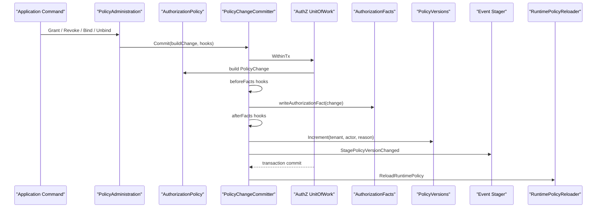

---

## 重点速查

| 问题 | 当前答案 | 代码证据 |
| --- | --- | --- |
| PolicyChangeCommitter 在哪里 | `application/authz/policy/committer.go`。 | [../../internal/apiserver/application/authz/policy/committer.go](../../internal/apiserver/application/authz/policy/committer.go) |
| Commit 的事务边界是什么 | `c.uow.WithinTx(ctx, fn)`。 | [../../internal/apiserver/application/authz/policy/committer.go](../../internal/apiserver/application/authz/policy/committer.go) |
| AuthZ UoW 接口包含什么 | Bindings、Roles、Resources、PolicyVersions、Users、AuthorizationFacts、Events。 | [../../internal/apiserver/application/authz/uow/uow.go](../../internal/apiserver/application/authz/uow/uow.go) |
| MySQL UoW 如何创建事务仓储 | 在 GORM transaction 中重新创建 role/resource/binding/policyVersion/user/casbinrule repos。 | [../../internal/apiserver/infra/mysql/uow/authz/uow.go](../../internal/apiserver/infra/mysql/uow/authz/uow.go) |
| 授权 facts 写到哪里 | `casbin_rule` 表，`p` 表示 permission，`g` 表示 rolebinding。 | [../../internal/apiserver/infra/mysql/casbinrule/repo.go](../../internal/apiserver/infra/mysql/casbinrule/repo.go) |
| policy version 如何递增 | `tx.PolicyVersions.Increment(tenantID, changedBy, reason)`。 | [../../internal/apiserver/application/authz/policy/committer.go](../../internal/apiserver/application/authz/policy/committer.go)、[../../internal/apiserver/infra/mysql/policy/repo.go](../../internal/apiserver/infra/mysql/policy/repo.go) |
| 版本事件在哪里 stage | `StagePolicyVersionChanged(txCtx, tx.Events, tenantID, version)`。 | [../../internal/apiserver/application/authz/policy/committer.go](../../internal/apiserver/application/authz/policy/committer.go)、[../../internal/apiserver/application/authz/shared/version_event.go](../../internal/apiserver/application/authz/shared/version_event.go) |
| runtime reload 在哪里执行 | UoW 成功之后调用 `ReloadRuntimePolicy`。 | [../../internal/apiserver/application/authz/policy/committer.go](../../internal/apiserver/application/authz/policy/committer.go)、[../../internal/apiserver/application/authz/shared/reloader.go](../../internal/apiserver/application/authz/shared/reloader.go) |
| reload 失败会不会回滚 facts | 不会；测试确认 reload 失败时 facts、version、event 已提交，reload 重试 3 次。 | [../../internal/apiserver/application/authz/policy/committer_test.go](../../internal/apiserver/application/authz/policy/committer_test.go) |

---

## 1. 为什么授权写入不是简单 CRUD

授权写入至少同时影响四类状态：

```text
管理记录
授权事实
授权版本
授权事件
```

例如“给用户授予 teacher 角色”并不只是：

```text
insert role_bindings
```

还要同时产生：

```text
g(user:123, role:teacher, tenant-a)
policy version + 1
authz.version.changed event
runtime policy reload
```

同理，“给 role 增加 permission”也不只是：

```text
insert permission
```

而是：

```text
p(role:teacher, tenant-a, scale:form:*, read, origin:school-a)
policy version + 1
authz.version.changed event
runtime policy reload
```

如果这些动作散落在 handler、service、repository 中，就会出现：

- 管理记录写了，但 Casbin fact 没写；
- fact 写了，但 version 没变；
- version 变了，但 event 没发；
- event 发了，但事务回滚；
- DB 事实更新了，但 runtime policy 没 reload；
- reload 失败后错误地回滚已提交事实。

`PolicyChangeCommitter` 的价值就是把这些动作收敛成一个明确的事务流程。

---

## 2. PolicyChange：授权策略变更的领域结果

`AuthorizationPolicy` 不直接写数据库。  
它根据业务对象生成一个领域结果：

```text
PolicyChange
```

四种类型：

```text
grant_permission
revoke_permission
bind_role
unbind_role
```

结构：

| 字段 | 含义 |
| --- | --- |
| `Kind` | 变更类型 |
| `TenantID` | 变更所属 tenant |
| `Actor` | 操作者 |
| `Reason` | 变更原因 |
| `Permission` | permission 变更时存在 |
| `RoleBinding` | role binding 变更时存在 |

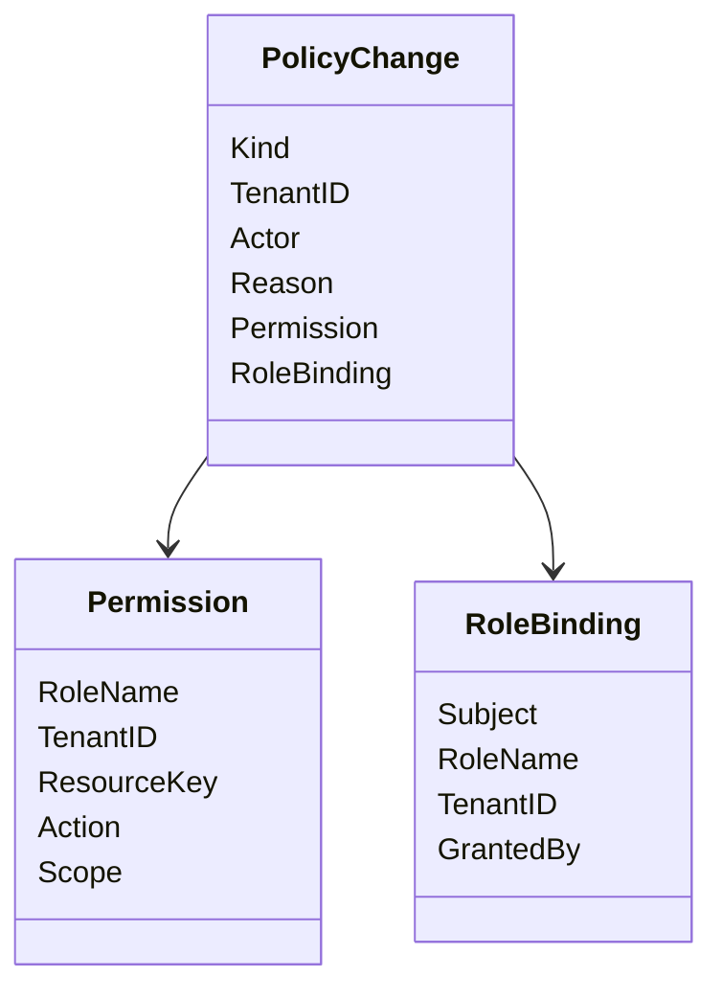

### 为什么需要 PolicyChange

因为授权写入的核心不是“存哪张表”，而是：

```text
这次业务授权变更是什么？
它应该产生哪类授权事实？
它属于哪个 tenant？
谁改的？
为什么改？
```

`PolicyChange` 把这些语义打包，交给 committer 统一提交。

核心源码：

- [../../internal/apiserver/domain/authz/policy/authorization_policy.go](../../internal/apiserver/domain/authz/policy/authorization_policy.go)

---

## 3. PolicyAdministration：写入用例入口

`PolicyAdministration` 是授权写入的 application use case。

它处理四类写入：

```text
GrantPermissionToRole
RevokePermissionFromRole
BindRoleToSubject
UnbindRoleFromSubject
UnbindRoleBindingByID
```

它的职责是：

1. 校验命令参数；
2. 在事务内加载 Role / Resource / Binding / User；
3. 调用 `AuthorizationPolicy` 生成 `PolicyChange`；
4. 对需要额外管理记录的场景提供 `BeforeFacts` 或 `AfterFacts` hook；
5. 交给 `PolicyChangeCommitter.Commit`。

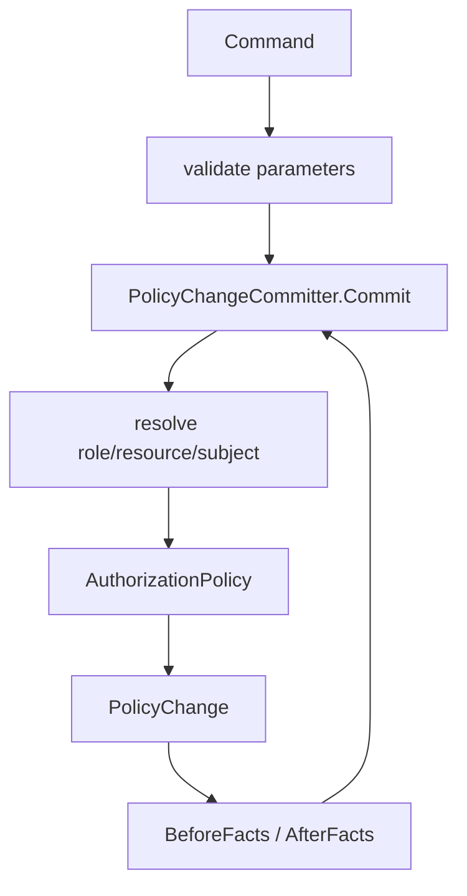

### 3.1 Permission 写入

`GrantPermissionToRole` / `RevokePermissionFromRole`：

- 校验 roleID、resourceID、action、tenantID、changedBy；
- 规范化 scope；
- 创建 actor；
- 在 UoW 内 resolve role/resource；
- 调用 `AuthorizationPolicy.GrantPermission/RevokePermission`；
- 交给 committer 写入 Casbin `p` fact。

它没有额外的 management record hook，因为 permission 的事实本身就是 `casbin_rule p`。

### 3.2 RoleBinding 写入

`BindRoleToSubject` 需要同时写两类东西：

```text
rolebinding.Binding 管理记录
authz.RoleBinding 授权 fact
```

因此它使用 `BeforeFacts`：

```text
BeforeFacts:
  tx.Bindings.Create(Binding by RoleID)
writeAuthorizationFact:
  AddRoleBinding(authz.RoleBinding by RoleName)
```

`UnbindRoleFromSubject` 也使用 `BeforeFacts`：

```text
BeforeFacts:
  tx.Bindings.DeleteBySubjectAndRole(...)
writeAuthorizationFact:
  RemoveRoleBinding(...)
```

`UnbindRoleBindingByID` 使用 `AfterFacts`：

```text
build:
  load target binding and target role
  create PolicyChange.UnbindRole(...)
writeAuthorizationFact:
  RemoveRoleBinding(...)
AfterFacts:
  tx.Bindings.Delete(bindingID)
```

这个顺序的原因是：按 ID 撤销时，需要先读取 binding 以构造 rolebinding fact；删除管理记录要等 fact 构造并移除之后再做。

核心源码：

- [../../internal/apiserver/application/authz/policy/administration.go](../../internal/apiserver/application/authz/policy/administration.go)
- [../../internal/apiserver/application/authz/rolebinding/command_service.go](../../internal/apiserver/application/authz/rolebinding/command_service.go)
- [../../internal/apiserver/application/authz/policy/command_service.go](../../internal/apiserver/application/authz/policy/command_service.go)

---

## 4. PolicyChangeCommitter 的职责

`PolicyChangeCommitter.Commit` 是授权策略变更的核心提交函数。

它接收：

```go
PolicyChangeBuilder
CommitOption...
```

其中：

```text
PolicyChangeBuilder:
  在事务内构造 PolicyChange

CommitOption:
  BeforeFacts / AfterFacts hooks
```

Commit 的执行顺序是：

```text
validate committer
collect options
uow.WithinTx
  -> build PolicyChange
  -> run beforeFacts
  -> writeAuthorizationFact
  -> run afterFacts
  -> increment policy version
  -> stage policy version changed event
after tx success
  -> ReloadRuntimePolicy
```

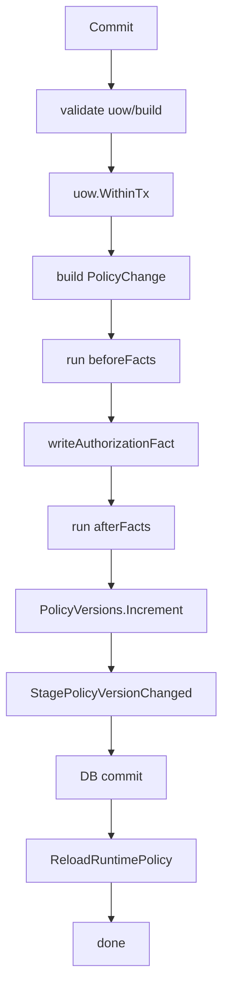

### 为什么 committer 不直接接收 Permission / RoleBinding

如果 committer 只接收 Permission 或 RoleBinding，它就丢失了：

- 变更类型；
- actor；
- reason；
- tenant；
- 这次变更是否是 grant/revoke/bind/unbind；
- 是否需要触发版本事件；
- 应该写入还是删除 fact。

`PolicyChange` 是更完整的业务变更表达。

核心源码：

- [../../internal/apiserver/application/authz/policy/committer.go](../../internal/apiserver/application/authz/policy/committer.go)

---

## 5. AuthZ Unit of Work

AuthZ UoW 接口定义：

```go
type UnitOfWork interface {
    WithinTx(ctx context.Context, fn func(txCtx context.Context, tx TxRepositories) error) error
}
```

事务仓储集合：

```go
type TxRepositories struct {
    Bindings
    Roles
    Resources
    PolicyVersions
    Users
    AuthorizationFacts
    Events
}
```

各字段职责：

| TxRepository | 用途 |
| --- | --- |
| `Bindings` | rolebinding 管理记录 |
| `Roles` | 查询 Role，做 tenant 校验 |
| `Resources` | 查询 Resource，校验 action/scope |
| `PolicyVersions` | 递增 tenant policy version |
| `Users` | 校验 subject 是否存在 |
| `AuthorizationFacts` | 写入/删除 Casbin p/g facts |
| `Events` | stage authorization version changed event |

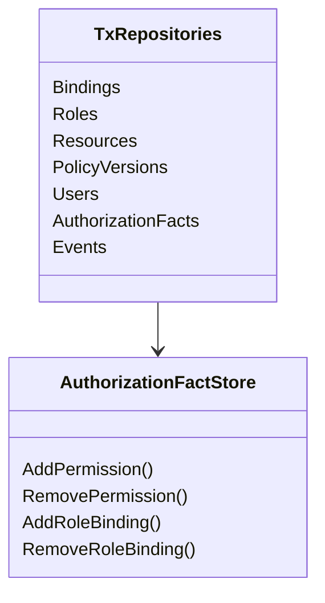

### 为什么 UoW 传 TxRepositories

授权写入需要多个 repository 协同，而且必须在同一个事务里。

如果每个 service 自己拿全局 repo，就无法保证：

```text
rolebinding record
casbin facts
policy version
outbox event
```

是否同时提交或同时回滚。

UoW 把“这次事务里的所有仓储”作为一个对象传给 application callback，避免跨事务写入。

核心源码：

- [../../internal/apiserver/application/authz/uow/uow.go](../../internal/apiserver/application/authz/uow/uow.go)

---

## 6. MySQL UoW 实现

MySQL AuthZ UoW 基于通用 GORM UoW。

`NewUnitOfWork(db, stager)` 保存：

```text
base GORM UnitOfWork
event stager
```

`WithinTx` 运行时：

1. 调用 `base.WithinTransaction`；
2. 从 context 中提取 active transaction；
3. 用 transaction handle 创建所有 repository；
4. 把 repository 集合传给 callback。

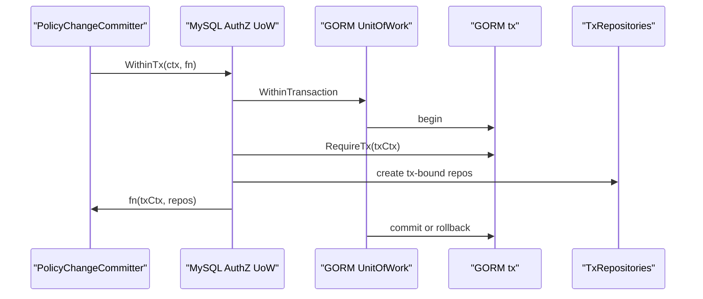

事务内创建的仓储：

```text
BindingRepository(tx)
RoleRepository(tx)
ResourceRepository(tx)
PolicyVersionRepository(tx)
UserRepository(tx)
CasbinRuleRepository(tx)
Events = injected stager
```

### 嵌套事务边界

底层 GORM UoW 如果 context 已经有 active transaction，会复用它，而不是打开新的嵌套事务。  
这让上层未来可以组合更大的事务边界。

核心源码：

- [../../internal/apiserver/infra/mysql/uow/authz/uow.go](../../internal/apiserver/infra/mysql/uow/authz/uow.go)
- [../../internal/pkg/database/mysql/uow.go](../../internal/pkg/database/mysql/uow.go)
- [../../pkg/uow/gorm/uow.go](../../pkg/uow/gorm/uow.go)

---

## 7. writeAuthorizationFact

`writeAuthorizationFact` 根据 `PolicyChange.Kind` 分派：

| Kind | 要求字段 | AuthorizationFacts 调用 |
| --- | --- | --- |
| `grant_permission` | `Permission != nil` | `AddPermission` |
| `revoke_permission` | `Permission != nil` | `RemovePermission` |
| `bind_role` | `RoleBinding != nil` | `AddRoleBinding` |
| `unbind_role` | `RoleBinding != nil` | `RemoveRoleBinding` |

如果 required field 缺失，会返回 internal error。  
如果 kind 不支持，会返回 invalid argument。

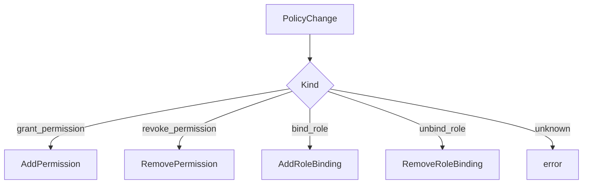

这个函数是把领域变更转成授权事实写入的中心点。

核心源码：

- [../../internal/apiserver/application/authz/policy/committer.go](../../internal/apiserver/application/authz/policy/committer.go)

---

## 8. AuthorizationFacts：Casbin rule repository

AuthZ UoW 中的 `AuthorizationFacts` 当前由 MySQL `casbinrule.Repository` 实现。

它写入的是 Casbin 的 `casbin_rule` 表。

### 8.1 AddPermission

`AddPermission` 流程：

```text
authz.Permission
  -> PolicyRuleFromPermission
  -> rulePO{ptype="p", v0..v4}
  -> INSERT ON CONFLICT DO NOTHING
```

字段映射：

| Permission | casbin_rule |
| --- | --- |
| `RoleName` | `v0 = role:<roleName>` |
| `TenantID` | `v1` |
| `ResourceKey` | `v2` |
| `Action` | `v3` |
| `Scope` | `v4` |

### 8.2 RemovePermission

`RemovePermission` 根据：

```text
ptype = p
v0 = role key
v1 = tenant
v2 = resource
v3 = action
v4 = scope
```

删除。

如果 scope 是默认 scope，删除条件兼容：

```text
v4 = all:* OR v4 IS NULL OR v4 = ''
```

这兼容历史空 scope 数据。

### 8.3 AddRoleBinding

`AddRoleBinding` 流程：

```text
authz.RoleBinding
  -> GroupingRuleFromRoleBinding
  -> rulePO{ptype="g", v0..v2}
  -> INSERT ON CONFLICT DO NOTHING
```

字段映射：

| RoleBinding | casbin_rule |
| --- | --- |
| `Subject` | `v0 = <type>:<id>` |
| `RoleName` | `v1 = role:<roleName>` |
| `TenantID` | `v2` |

### 8.4 RemoveRoleBinding

根据：

```text
ptype = g
v0 = subject key
v1 = role key
v2 = tenant
```

删除。

核心源码：

- [../../internal/apiserver/infra/mysql/casbinrule/repo.go](../../internal/apiserver/infra/mysql/casbinrule/repo.go)
- [../../internal/apiserver/infra/casbin/facts.go](../../internal/apiserver/infra/casbin/facts.go)

---

## 9. BeforeFacts 与 AfterFacts

`PolicyChangeCommitter` 支持两类 hook：

```text
BeforeFacts
AfterFacts
```

它们都运行在同一个 UoW transaction 内。

### 9.1 BeforeFacts

顺序：

```text
build change
  -> beforeFacts
  -> writeAuthorizationFact
```

适合在写授权 fact 之前先写或删管理记录。

当前用例：

| 操作 | BeforeFacts 做什么 |
| --- | --- |
| `BindRoleToSubject` | 创建 `rolebinding.Binding` 管理记录 |
| `UnbindRoleFromSubject` | 按 subject/role 删除 `rolebinding.Binding` 管理记录 |

### 9.2 AfterFacts

顺序：

```text
build change
  -> writeAuthorizationFact
  -> afterFacts
```

适合必须先用管理记录构造 fact，然后再删除管理记录的场景。

当前用例：

| 操作 | AfterFacts 做什么 |
| --- | --- |
| `UnbindRoleBindingByID` | 根据已读取的 bindingID 删除 `rolebinding.Binding` 管理记录 |

### 9.3 为什么需要两种 hook

以按 ID 撤销 rolebinding 为例：

1. 需要先读取 Binding，知道 subject、roleID、tenant；
2. 需要再读取 Role，得到 RoleName；
3. 使用 RoleName 构造 `authz.RoleBinding` fact；
4. 删除 Casbin g fact；
5. 最后删除 Binding 记录。

如果一开始就删除 Binding，后续构造 fact 会丢失输入。

核心源码：

- [../../internal/apiserver/application/authz/policy/committer.go](../../internal/apiserver/application/authz/policy/committer.go)
- [../../internal/apiserver/application/authz/policy/administration.go](../../internal/apiserver/application/authz/policy/administration.go)

---

## 10. PolicyVersion：授权版本递增

每次成功写入授权 facts 后，committer 都会调用：

```text
tx.PolicyVersions.Increment(
  change.TenantID,
  change.Actor.ID,
  change.Reason,
)
```

`PolicyVersion` 字段：

| 字段 | 含义 |
| --- | --- |
| `TenantID` | 租户 |
| `Version` | 版本号 |
| `ChangedBy` | 变更人 |
| `Reason` | 变更原因 |

`Increment` 会：

1. 查询当前版本号；
2. 新建 `current + 1` 版本记录；
3. 保存 changedBy / reason。

如果租户没有版本记录，当前版本号视为 0，因此第一次 increment 会创建版本 1。

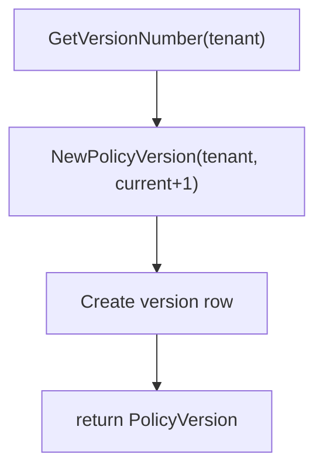

### 为什么版本递增在 facts 之后

当前顺序是：

```text
writeAuthorizationFact
  -> increment policy version
  -> stage version changed event
```

这表达的是：

```text
版本号代表事实已经发生变化
```

如果 facts 写入失败，不应递增版本，也不应发版本事件。

核心源码：

- [../../internal/apiserver/application/authz/policy/committer.go](../../internal/apiserver/application/authz/policy/committer.go)
- [../../internal/apiserver/domain/authz/policy/policy_version.go](../../internal/apiserver/domain/authz/policy/policy_version.go)
- [../../internal/apiserver/infra/mysql/policy/repo.go](../../internal/apiserver/infra/mysql/policy/repo.go)

---

## 11. StagePolicyVersionChanged

版本递增后，committer 调用：

```text
authzshared.StagePolicyVersionChanged(
  txCtx,
  tx.Events,
  change.TenantID,
  version,
)
```

这个函数会创建：

```text
policy.NewVersionChangedEvent(tenantID, version.Version)
```

事件 payload：

```json
{
  "tenant_id": "tenant-a",
  "version": 2
}
```

事件 aggregate：

```text
AggregateType = PolicyVersion
AggregateID   = <tenantID>:<version>
```

### 当前边界

如果 version 为 nil，`StagePolicyVersionChanged` 直接返回 nil。

如果 stager 为 nil，返回错误：

```text
authz policy version event stager is required
```

由于 staging 在 UoW transaction 内执行，stager 缺失会导致整个 Commit 返回错误。  
这说明当前设计把“授权版本事件 staging”视为授权写入成功的必要步骤，而不是可选 side effect。

下一篇《授权版本事件与 Outbox》会继续展开 stager 如何与 transactional outbox 结合。

核心源码：

- [../../internal/apiserver/application/authz/shared/version_event.go](../../internal/apiserver/application/authz/shared/version_event.go)
- [../../internal/apiserver/domain/authz/policy/events.go](../../internal/apiserver/domain/authz/policy/events.go)
- [../../internal/apiserver/application/authz/policy/committer.go](../../internal/apiserver/application/authz/policy/committer.go)

---

## 12. RuntimePolicyReloader：事务后刷新运行时

事务成功后，committer 调用：

```text
ReloadRuntimePolicy(ctx, c.runtimeReloader, string(committed.Kind))
```

`ReloadRuntimePolicy` 会：

1. 如果 adapter nil，直接返回；
2. 最多尝试 3 次；
3. 每次尝试前，如果 adapter 支持 `InvalidateCache()`，先清缓存；
4. 调用 `LoadPolicy(ctx)`；
5. 成功则记录 success 并返回；
6. 失败则记录 error；
7. 每次失败后等待 100ms；
8. 3 次后记录 degraded。

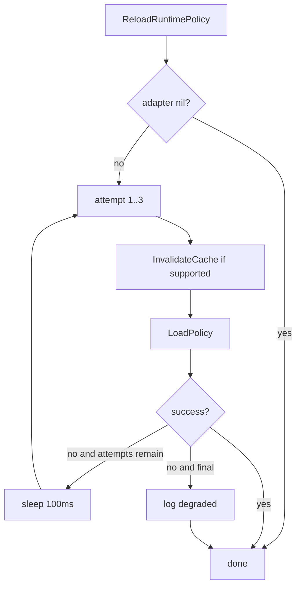

### 为什么 reload 在事务之后

原因很直接：

```text
runtime enforcer 应该加载已经提交的 DB facts
```

如果在事务内 reload：

- 其他连接可能看不到未提交数据；
- reload 成功后事务可能回滚；
- runtime 和 DB 事实可能产生反向不一致。

因此当前实现把 reload 放在 UoW 成功之后。

### reload 失败是否回滚 DB facts

不会。

`PolicyChangeCommitter.Commit` 先完成 UoW，再调用 reload。  
测试 `TestPolicyChangeCommitterCommitsPermissionAndKeepsFactsWhenReloadFails` 明确确认：

- permission fact 已写入；
- policy version 已递增；
- version event 已 stage；
- runtime reload 尝试 3 次；
- Commit 仍返回 no error。

这说明 reload 是事务后 best-effort runtime sync。  
DB 才是授权事实源，runtime policy 可以处于短暂 degraded 状态。

核心源码：

- [../../internal/apiserver/application/authz/shared/reloader.go](../../internal/apiserver/application/authz/shared/reloader.go)
- [../../internal/apiserver/application/authz/policy/committer.go](../../internal/apiserver/application/authz/policy/committer.go)
- [../../internal/apiserver/application/authz/policy/committer_test.go](../../internal/apiserver/application/authz/policy/committer_test.go)
- [../../internal/apiserver/infra/casbin/adapter.go](../../internal/apiserver/infra/casbin/adapter.go)

---

## 13. 四类写入链路

### 13.1 GrantPermissionToRole

```text
ValidateAddPolicyParameters
  -> normalize scope
  -> NewActor
  -> UoW
      -> resolve role/resource
      -> AuthorizationPolicy.GrantPermission
      -> AddPermission p fact
      -> Increment version
      -> Stage event
  -> ReloadRuntimePolicy
```

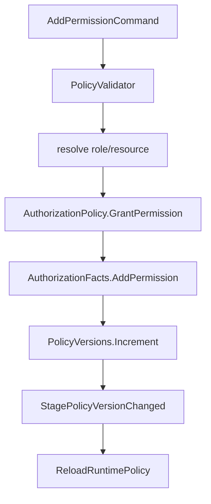

### 13.2 RevokePermissionFromRole

```text
ValidateRemovePolicyParameters
  -> normalize scope
  -> NewActor
  -> UoW
      -> resolve role/resource
      -> AuthorizationPolicy.RevokePermission
      -> RemovePermission p fact
      -> Increment version
      -> Stage event
  -> ReloadRuntimePolicy
```

### 13.3 BindRoleToSubject

```text
ValidateGrantParameters
  -> NewActor
  -> UoW
      -> CheckRoleExists
      -> CheckSubjectExists
      -> load role
      -> AuthorizationPolicy.BindRole
      -> BeforeFacts: create Binding management record
      -> AddRoleBinding g fact
      -> Increment version
      -> Stage event
  -> ReloadRuntimePolicy
```

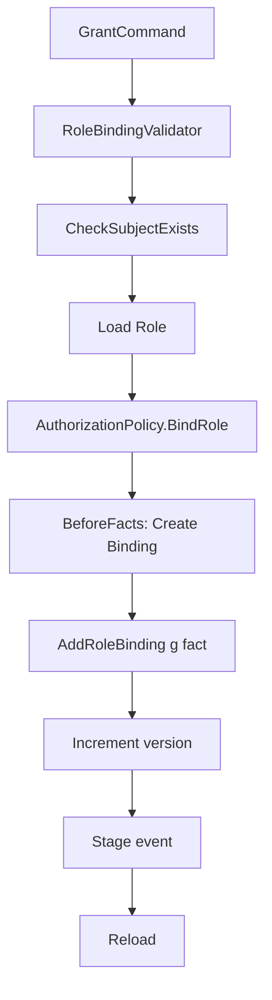

### 13.4 UnbindRoleFromSubject

```text
ValidateRevokeParameters
  -> NewActor(system)
  -> UoW
      -> load role
      -> AuthorizationPolicy.UnbindRole
      -> BeforeFacts: DeleteBySubjectAndRole
      -> RemoveRoleBinding g fact
      -> Increment version
      -> Stage event
  -> ReloadRuntimePolicy
```

### 13.5 UnbindRoleBindingByID

```text
UoW
  -> load binding by id
  -> check tenant
  -> load role by binding.RoleID
  -> AuthorizationPolicy.UnbindRole
  -> RemoveRoleBinding g fact
  -> AfterFacts: Delete binding by id
  -> Increment version
  -> Stage event
-> ReloadRuntimePolicy
```

核心源码：

- [../../internal/apiserver/application/authz/policy/administration.go](../../internal/apiserver/application/authz/policy/administration.go)
- [../../internal/apiserver/application/authz/policy/committer.go](../../internal/apiserver/application/authz/policy/committer.go)

---

## 14. 事务失败边界

因为所有关键写入都在 `uow.WithinTx` 内，以下任一失败都会导致 Commit 返回错误，并触发数据库事务回滚：

| 阶段 | 失败例子 |
| --- | --- |
| build PolicyChange | role 不存在、resource 不存在、action/scope 不合法、subject 不存在 |
| beforeFacts | rolebinding 管理记录创建失败、删除失败 |
| writeAuthorizationFact | Add/Remove permission 或 rolebinding fact 失败 |
| afterFacts | 按 ID 删除 binding 失败 |
| version increment | policy version 创建失败 |
| event stage | stager nil 或 stage 失败 |

事务外的 reload 不参与回滚：

| 阶段 | 失败结果 |
| --- | --- |
| runtime reload | 最多重试 3 次，最终记录 degraded，不回滚 DB facts |

这条边界非常重要：

```text
DB 事实一致性由事务保证
runtime 新鲜度由 reload 尽力保证
跨系统传播由 outbox/event 保证
```

---

## 15. 与 CasbinAdapter 的关系

这里有两个容易混淆的 Casbin 角色：

### 15.1 Casbin rule repository

`infra/mysql/casbinrule.Repository` 是写入 DB facts 的 repository。

它负责：

```text
insert/delete casbin_rule rows
```

它运行在 UoW transaction 内。

### 15.2 CasbinAdapter

`infra/casbin.CasbinAdapter` 是运行时判定器。

它负责：

```text
LoadPolicy
Enforce
DirectRoleKeys
PermissionsForSubject
ReloadHealth
```

它不应该成为事务写入事实的唯一入口。  
当前源码注释也强调：

```text
DB 是授权事实源；运行时 Enforcer 只负责内存加载与判定。
```

这就是为什么写入路径是：

```text
UoW -> casbin_rule repository -> commit -> CasbinAdapter.LoadPolicy
```

而不是：

```text
CasbinAdapter.AddPolicy -> autosave
```

核心源码：

- [../../internal/apiserver/infra/mysql/casbinrule/repo.go](../../internal/apiserver/infra/mysql/casbinrule/repo.go)
- [../../internal/apiserver/infra/casbin/adapter.go](../../internal/apiserver/infra/casbin/adapter.go)

---

## 16. 当前边界与待讨论点

### 16.1 Reload 是 best-effort，不是事务的一部分

reload 失败不会让 Commit 失败。  
这保证了 DB 事实不会因为 runtime 临时 reload 问题而回滚。代价是 runtime 可能短暂使用旧策略。

### 16.2 Event stager 当前是必要依赖

`StagePolicyVersionChanged` 在 stager nil 时返回错误。  
因此如果 AuthZ module 初始化时没有 EventStager，授权写入可能失败。下一篇会继续解释 EventStager 与 Outbox 的设计。

### 16.3 rolebinding Binding 与 Casbin g fact 不是同一张表

管理记录是：

```text
rolebinding.Binding
```

授权运行事实是：

```text
casbin_rule ptype=g
```

两者必须在同一事务内保持一致。

### 16.4 Permission 没有单独管理记录表

当前 permission 写入直接体现为 Casbin `p` fact。  
查询 role permissions 也会从 runtime/snapshot store 转回业务 Permission。这个设计避免额外 permission 表，但也意味着 `casbin_rule` 是 permission facts 的事实表。

### 16.5 version 递增是每次授权变更都会发生

grant/revoke permission、bind/unbind role 都会递增 policy version。  
这让调用方可以通过版本号判断授权快照是否过期。

---

## 17. 常见误区

### 误区一：授权写入就是改 casbin_rule

不完整。  
授权写入还包括管理记录、version、event 和 runtime reload。

### 误区二：PolicyChangeCommitter 是 domain service

不对。  
它属于 application 层，负责应用事务和跨仓储编排。

### 误区三：UoW 只是为了数据库事务

不只是。  
它还统一提供本次事务内的 repositories 和 event stager，让授权事实、版本、事件 staging 保持一致。

### 误区四：runtime reload 失败说明 DB 写入失败

不对。  
reload 在事务成功之后执行。reload 失败只说明 runtime enforcer 没有及时刷新，不说明 DB facts 未提交。

### 误区五：BeforeFacts 和 AfterFacts 可随便用

不对。  
它们表达的是管理记录相对授权事实的写入顺序。按 ID 撤销时尤其不能先删 binding 再构造 fact。

### 误区六：CasbinAdapter 应该直接 AddPolicy

不符合当前设计。  
当前 DB 是授权事实源，CasbinAdapter 是内存运行时判定器，写入通过 UoW 和 casbinrule repository 完成。

---

## 18. 设计模式

| 模式 | 为什么用 | IAM 落地 | 代价和边界 |
| --- | --- | --- | --- |
| Unit of Work | 多仓储写入必须同事务 | AuthZ UoW 统一 Bindings/Roles/Resources/Facts/Versions/Events | service 代码必须在 UoW callback 中使用 tx repos |
| Policy Change Object | 授权变更要先表达业务语义 | `PolicyChange` 封装 kind/tenant/actor/reason/fact | 需要 build 函数明确生成 change |
| Transactional Facts | 管理记录与 Casbin facts 要一致 | `writeAuthorizationFact` 在 UoW 内执行 | runtime reload 仍是事务外动作 |
| Hooks | 有些管理记录需要在 fact 前后执行 | `BeforeFacts` / `AfterFacts` | 使用不当会造成顺序错误 |
| Versioned Policy | 调用方需要知道授权是否变化 | 每次变更 `PolicyVersions.Increment` | version 递增失败会回滚写入 |
| Outbox-ready Event Staging | 版本事件要与事实提交绑定 | `StagePolicyVersionChanged` 在 UoW 内执行 | stager 缺失会导致提交失败 |
| Best-effort Runtime Reload | DB 是事实源，runtime 可重试刷新 | reload 3 次，失败记录 degraded | reload 失败后短时间内判定可能旧 |

---

## 19. 推荐源码阅读路线

### 第一轮：授权写入入口

```text
internal/apiserver/application/authz/policy/command_service.go
internal/apiserver/application/authz/rolebinding/command_service.go
internal/apiserver/application/authz/policy/administration.go
```

目标：搞清 grant/revoke/bind/unbind 如何进入 PolicyAdministration。

### 第二轮：领域变更对象

```text
internal/apiserver/domain/authz/policy/authorization_policy.go
internal/apiserver/domain/authz/model.go
```

目标：搞清 AuthorizationPolicy 如何生成 PolicyChange、Permission、RoleBinding。

### 第三轮：Committer

```text
internal/apiserver/application/authz/policy/committer.go
```

目标：搞清 Commit 顺序、BeforeFacts、AfterFacts、version、event、reload。

### 第四轮：UoW

```text
internal/apiserver/application/authz/uow/uow.go
internal/apiserver/infra/mysql/uow/authz/uow.go
internal/pkg/database/mysql/uow.go
pkg/uow/gorm/uow.go
```

目标：搞清事务 context 和 tx-bound repositories。

### 第五轮：Facts / Version / Event

```text
internal/apiserver/infra/mysql/casbinrule/repo.go
internal/apiserver/infra/mysql/policy/repo.go
internal/apiserver/domain/authz/policy/policy_version.go
internal/apiserver/application/authz/shared/version_event.go
internal/apiserver/domain/authz/policy/events.go
```

目标：搞清 casbin_rule、policy version 和 version changed event。

### 第六轮：Runtime reload

```text
internal/apiserver/application/authz/shared/reloader.go
internal/apiserver/infra/casbin/adapter.go
```

目标：搞清事务提交后如何刷新运行时 policy。

---

## 20. 验证建议

```bash
go test ./internal/apiserver/application/authz/policy \
  ./internal/apiserver/application/authz/rolebinding \
  ./internal/apiserver/application/authz/uow \
  ./internal/apiserver/infra/mysql/uow/authz \
  ./internal/apiserver/infra/mysql/casbinrule \
  ./internal/apiserver/infra/mysql/policy \
  ./internal/apiserver/infra/casbin

make docs-hygiene
```

建议重点测试方向：

| 测试方向 | 目的 |
| --- | --- |
| grant permission commit | p fact 写入、version +1、event staged、reload |
| revoke permission commit | p fact 删除、version +1、event staged |
| bind role commit | Binding 管理记录 + g fact 同事务写入 |
| unbind by subject/role | Binding 删除 + g fact 删除 |
| unbind by id | 先构造 fact，再 AfterFacts 删除 Binding |
| build change failure | 事务回滚，不写 facts/version/event |
| beforeFacts failure | 不写 facts/version/event |
| writeAuthorizationFact failure | 不递增 version，不 stage event |
| version increment failure | facts 回滚 |
| event stage failure | facts 和 version 回滚 |
| runtime reload failure | DB facts 保留，reload 重试 3 次 |
| nil stager | commit 失败，暴露 EventStager 依赖问题 |
| scope delete compatibility | 默认 scope 删除兼容 null/empty/all:* |

---

## 本文总结

PolicyChangeCommitter 与 UoW 的核心可以压缩成一句话：

> 授权写入先被表达成 PolicyChange，再在同一个 AuthZ Unit of Work 中写入管理记录、授权 facts、policy version 和版本事件；事务成功后再尽力 reload runtime policy。

核心链路是：

```text
Command
  -> PolicyAdministration
  -> AuthorizationPolicy
  -> PolicyChange
  -> PolicyChangeCommitter
  -> UoW transaction
      -> beforeFacts
      -> authorization facts
      -> afterFacts
      -> policy version
      -> version event
  -> runtime reload
```

这篇回答了：

```text
授权 facts 如何被事务性写入
为什么授权写入不是简单 CRUD
为什么 DB 是授权事实源
为什么 runtime reload 不能作为事务的一部分
```

下一篇《授权版本事件与 Outbox》会继续回答：

```text
StagePolicyVersionChanged 之后发生什么
版本事件如何进入 outbox
outbox relay 如何发布事件
EventBus 不可用时为什么事件不会丢
```
