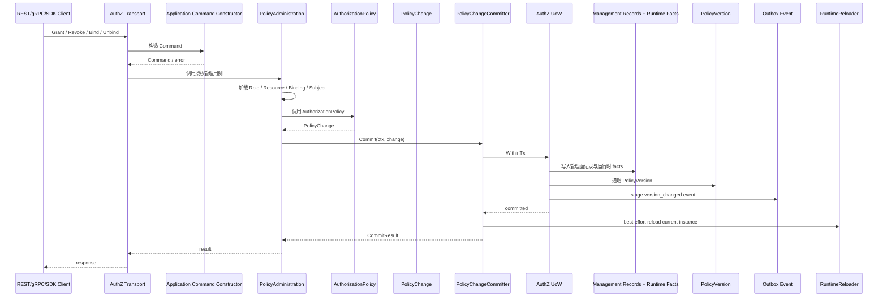
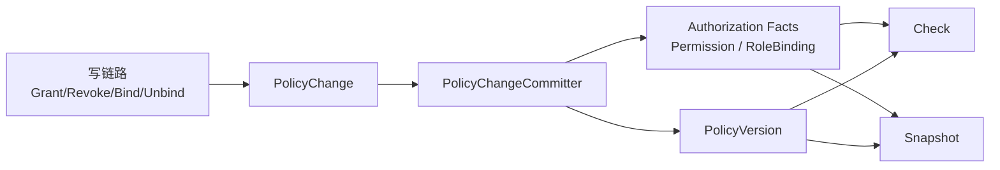

# 03-授权写入链路：PolicyAdministration、PolicyChange、PolicyChangeCommitter

## 1. 本文定位

本文是 `03-授权AuthZ/` 文档组中关于 **授权写入链路** 的文档。

前面几篇文档已经完成了模型铺垫：

```text
00-AuthZ模型总览：Subject -> RoleBinding -> Role -> Permission -> Resource / Action / Scope
01-资源模型：ResourceKey / ResourcePattern / Action / ActionPattern / Scope
02-角色模型：Role / RoleBinding / Subject
```

本文开始解释 AuthZ 的写链路。

AuthZ 写链路回答的是：

```text
如何改变授权事实？
```

也就是：

```text
如何给 Role 授予 Permission？
如何撤销 Role 的 Permission？
如何给 Subject 绑定 Role？
如何撤销 Subject 的 RoleBinding？
这些变更如何被建模成 PolicyChange？
PolicyChange 如何被统一提交？
如何保证管理面记录、运行时 facts、PolicyVersion、Outbox 在同一写入边界中保持一致？
```

本文重点讲完整写入链路：

```text
Application Command
  -> PolicyAdministration
  -> AuthorizationPolicy
  -> PolicyChange
  -> PolicyChangeCommitter
  -> AuthZ UoW
```

本文会讲到 `PolicyVersion` 与 `Outbox` 在写入提交中的位置，但不会展开多实例事件传播、OutboxRelay、RuntimeReload 闭环。

这些内容放到下一篇：

```text
04-授权版本与事件传播链路-PolicyVersion-Outbox-RuntimeReload.md
```

---

## 2. 30 秒结论

AuthZ 写链路不是简单 CRUD。

它不是：

```text
直接 insert / delete casbin_rule
```

也不是：

```text
直接改 role_bindings 表
```

而是：

```text
REST / gRPC / SDK
  -> Application Command
  -> PolicyAdministration
  -> AuthorizationPolicy
  -> PolicyChange
  -> PolicyChangeCommitter
  -> AuthZ UoW
  -> Management Records + Runtime Facts + PolicyVersion + Outbox
```

核心职责是：

| 对象 | 职责 |
| --- | --- |
| Application Command | 表达一次授权写入意图，并在边界处完成 VO 化校验 |
| PolicyAdministration | 编排授权写入用例，加载 Role / Resource / Binding / Subject 等上下文 |
| AuthorizationPolicy | 领域服务，基于领域规则生成 PolicyChange |
| PolicyChange | 授权事实变更计划，描述要新增 / 删除哪些 Permission fact 或 RoleBinding fact |
| PolicyChangeCommitter | 统一提交 PolicyChange，保证管理面记录、运行时 facts、PolicyVersion、Outbox 的一致性 |
| AuthZ UoW | 授权写入事务边界 |

一句话：

> AuthZ 写入链路的关键不是“改表”，而是把一次授权管理操作转化为一个可事务提交、可版本化、可传播、可审计的 PolicyChange，并由 PolicyChangeCommitter 统一提交。

---

## 3. 为什么授权写入不能是简单 CRUD

授权写入看起来像 CRUD：

```text
新增角色
新增资源
给角色加权限
给用户分配角色
撤销权限
撤销角色绑定
```

但 AuthZ 的写入比普通 CRUD 更复杂。

因为一次授权写入通常同时影响：

```text
管理面记录
运行时授权事实
策略版本
Outbox 版本事件
Runtime policy 缓存
审计信息
```

例如，给某个 Subject 绑定 Role 时，不只是写一条 Binding 记录。

它还需要：

```text
确认 Subject 合法
确认 Role 存在
确认 Tenant 一致
写入管理面 Binding 记录
写入运行时 g fact
递增 PolicyVersion
stage version_changed outbox event
触发本实例 best-effort RuntimeReload
```

如果直接操作数据库表，会绕过这些一致性要求。

因此，AuthZ 写入必须通过统一链路：

```text
PolicyAdministration
  -> AuthorizationPolicy
  -> PolicyChange
  -> PolicyChangeCommitter
```

---

## 4. 写链路总览

### 4.1 写入链路图



这张图中，本文重点解释：

```text
Application Command
  -> PolicyAdministration
  -> AuthorizationPolicy
  -> PolicyChange
  -> PolicyChangeCommitter
  -> AuthZ UoW
```

下一篇重点解释：

```text
PolicyVersion
  -> OutboxRelay
  -> version_changed event
  -> AuthzPolicySync
  -> RuntimeReload
```

---

### 4.2 写入动作分类

AuthZ 写入大体分为两类。

第一类是 **权限写入**：

```text
GrantPermission
RevokePermission
```

它们改变的是：

```text
Role -> Permission
```

也就是某个 Role 拥有哪些资源访问能力。

第二类是 **角色绑定写入**：

```text
BindRole
UnbindRole
GrantAssignment
RevokeAssignment
```

它们改变的是：

```text
Subject -> RoleBinding -> Role
```

也就是某个 Subject 在某个 Tenant 下拥有哪些 Role。

---

## 5. Application Command：写入意图的应用层表达

### 5.1 为什么写入需要 Command

Transport 层接收到的是协议请求。

例如 REST 可能收到：

```json
{
  "role_id": "...",
  "resource_id": "...",
  "action": "read",
  "tenant_id": "tenant-a",
  "scope": "all:*",
  "changed_by": "user:9001",
  "reason": "grant read user permission"
}
```

这些只是 wire format。

它们不能直接进入 PolicyAdministration。

需要先转换为应用层命令：

```text
AddPermissionCommand
RemovePermissionCommand
GrantCommand
RevokeCommand
GrantByRoleNameCommand
RevokeByRoleNameCommand
```

Command 的职责是：

```text
表达一次授权写入意图
校验输入是否具备基本领域语义
将裸 string 转换为 VO
阻止非法请求进入 use case 编排
```

---

### 5.2 Permission Command

Permission Command 表达：

```text
给某个 Role 授予 / 撤销某个 Resource 上的 Action / Scope 能力。
```

典型命令包括：

```text
AddPermissionCommand
RemovePermissionCommand
```

核心字段包括：

```text
RoleID
ResourceID
Action
Scope
TenantID
ChangedBy
Reason
```

其中：

```text
Action    应该是 resource.Action 或可转换为 resource.Action
TenantID  应该是 tenant.ID
ChangedBy 应该是 policy.Actor
Scope     应该是 scope.Scope
```

这些字段不应该长期停留为裸 string。

Command constructor 应该完成：

```text
roleID 非空校验
resourceID 非空校验
action 具体动作校验
tenantID 授权域校验
scope 合法性校验
changedBy actor 校验
reason 规范化
```

---

### 5.3 RoleBinding Command

RoleBinding Command 表达：

```text
给某个 Subject 绑定 / 撤销某个 Role。
```

典型命令包括：

```text
GrantCommand
RevokeCommand
GrantByRoleNameCommand
RevokeByRoleNameCommand
```

它们的差异是：

```text
GrantCommand / RevokeCommand 通常基于 role_id
GrantByRoleNameCommand / RevokeByRoleNameCommand 通常基于 role_name
```

为什么两种都需要？

因为接入场景不同：

```text
REST 管理后台更常拿到 role_id
gRPC / SDK / 服务间调用更适合使用稳定 role_name
```

但无论使用 role_id 还是 role_name，进入内部领域模型后，最终都应收敛为：

```text
Subject
TenantID
RoleName
Actor
Reason
```

---

### 5.4 Command 不应该做什么

Command 只做边界校验和语义化。

它不应该：

```text
查询数据库
判断 Role 是否存在
判断 Resource 是否存在
判断 Subject 是否存在
直接生成 Casbin facts
递增 PolicyVersion
触发 RuntimeReload
```

这些职责分别属于：

```text
PolicyAdministration
AuthorizationPolicy
PolicyChangeCommitter
AuthZ UoW
RuntimeReloader
```

如果 Command 做太多，会导致应用边界和用例编排混乱。

---

## 6. PolicyAdministration：授权写入用例编排器

### 6.1 PolicyAdministration 是什么

`PolicyAdministration` 是 AuthZ 写入链路的应用服务。

它负责用例编排。

它不直接表达底层 Casbin 规则，也不直接修改运行时缓存。

它的主要职责是：

```text
接收写入 Command
加载 Role / Resource / Binding / Subject 等上下文
调用领域服务 AuthorizationPolicy
得到 PolicyChange
交给 PolicyChangeCommitter 提交
```

可以理解为：

```text
PolicyAdministration = 授权写入用例编排器
```

---

### 6.2 PolicyAdministration 为什么不是领域对象

PolicyAdministration 需要协调仓储、事务、外部端口和领域服务。

例如它可能需要：

```text
通过 Role repository 加载 Role
通过 Resource repository 加载 Resource
通过 RoleBinding repository 加载 Binding
通过 SubjectResolver 校验 Subject
通过 PolicyChangeCommitter 提交 PolicyChange
```

这些都是应用层编排职责。

领域层不应该直接依赖这些基础设施。

因此，PolicyAdministration 放在 Application 层，而不是 Domain 层。

---

### 6.3 PolicyAdministration 的核心用例

常见写入用例包括：

```text
GrantPermission
RevokePermission
BindRoleToSubject
UnbindRoleFromSubject
BindRoleByName
UnbindRoleByName
```

它们分别对应：

```text
Role -> Permission 的增删
Subject -> RoleBinding -> Role 的增删
```

虽然用例不同，但最终都会收敛为：

```text
PolicyChange
```

这是整个写链路的关键抽象。

---

## 7. AuthorizationPolicy：领域规则与 PolicyChange 生成

### 7.1 AuthorizationPolicy 是什么

`AuthorizationPolicy` 是 AuthZ 领域层的授权策略服务。

它负责根据领域规则生成 PolicyChange。

它不负责：

```text
开启事务
查询数据库
写入 casbin_rule
递增 PolicyVersion
发布 Outbox event
刷新 runtime policy
```

这些是 Application / Infra 层职责。

AuthorizationPolicy 只回答：

```text
在当前 Role / Resource / Subject / Tenant 上下文下，
这次授权变更应该产生什么 PolicyChange？
```

---

### 7.2 为什么需要 AuthorizationPolicy

如果没有 AuthorizationPolicy，PolicyAdministration 可能会直接拼 facts：

```text
p, role:iam:admin, tenant-a, iam:identity:user:*, read, all:*
g, user:1001, role:iam:admin, tenant-a
```

这样会有问题：

```text
领域规则散落在 Application 层
Casbin 术语污染授权用例
Role / Resource / Scope 校验不集中
后续修改 Permission 结构会影响多个 service
测试难以聚焦领域规则
```

AuthorizationPolicy 的价值是把领域规则集中起来：

```text
Role 能不能获得这个 Permission？
Resource 是否支持这个 Action？
ScopeKind 是否被 Resource 支持？
Subject 是否能绑定这个 Role？
生成什么 PolicyChange？
```

---

### 7.3 AuthorizationPolicy 与 PolicyAdministration 的边界

| 对象 | 层次 | 主要职责 |
| --- | --- | --- |
| PolicyAdministration | Application | 用例编排、加载上下文、调用 committer |
| AuthorizationPolicy | Domain | 执行授权领域规则、生成 PolicyChange |
| PolicyChangeCommitter | Application / Infra 协作 | 提交 PolicyChange，保证事务一致性 |

更简单地说：

```text
PolicyAdministration 负责“把材料准备好”。
AuthorizationPolicy 负责“按领域规则生成变更计划”。
PolicyChangeCommitter 负责“把变更计划安全落库并传播”。
```

---

## 8. PolicyChange：授权事实变更计划

### 8.1 PolicyChange 是什么

`PolicyChange` 是一次授权事实变更计划。

它回答：

```text
这次授权写入将新增或删除哪些授权事实？
```

它不是数据库事务。

它也不是 Casbin rule 本身。

它是领域层和提交层之间的中间表示。

---

### 8.2 PolicyChange 包含什么

PolicyChange 通常可以包含：

```text
ChangeKind
TenantID
Actor
Reason
Permission facts to add/remove
RoleBinding facts to add/remove
Management record mutations
```

例如，GrantPermission 可能包含：

```text
kind: grant_permission
tenant: tenant-a
actor: user:9001
reason: grant user read permission
add permission fact:
  role = iam:admin
  resource = iam:identity:user:*
  action = read
  scope = all:*
```

BindRole 可能包含：

```text
kind: bind_role
tenant: tenant-a
actor: user:9001
reason: grant admin role
add binding record
add rolebinding fact:
  subject = user:1001
  role = iam:admin
  tenant = tenant-a
```

---

### 8.3 为什么 PolicyChange 很关键

PolicyChange 是 AuthZ 写链路中的核心抽象。

它的价值是：

```text
把领域变更和物理提交解耦
让 AuthorizationPolicy 不关心数据库和 Casbin
让 PolicyChangeCommitter 可以统一处理事实、版本、事件、reload
让测试可以单独验证领域规则生成的变更计划
让写链路具备可审计、可版本化、可传播的基础
```

如果没有 PolicyChange，写链路很容易变成：

```text
某个 service 直接写 casbin_rule
另一个 service 直接写 role_bindings
第三个地方自己递增 version
```

这会导致事实不一致。

---

## 9. PolicyChangeCommitter：统一提交授权变更

### 9.1 PolicyChangeCommitter 是什么

`PolicyChangeCommitter` 是授权写入链路中的统一提交器。

它负责把 PolicyChange 安全提交到事实源中。

它回答：

```text
这次 PolicyChange 如何在事务边界内变成真实授权事实？
```

核心职责是：

```text
在 AuthZ UoW 中提交管理面记录；
写入或删除运行时 Permission / RoleBinding facts；
递增 PolicyVersion；
stage Outbox version_changed event；
提交后触发本实例 best-effort RuntimeReload。
```

---

### 9.2 为什么需要 Committer

如果每个用例自己写 facts，会导致：

```text
GrantPermission 自己写 p fact
BindRole 自己写 g fact
RevokePermission 自己递增 version
UnbindRole 忘记 stage outbox
某些路径忘记 reload runtime
某些路径没有审计 actor / reason
```

这样授权事实迟早会漂移。

PolicyChangeCommitter 的价值是：

```text
所有授权事实变更只有一个提交入口。
```

只要是授权事实变更，就应该先表达为 PolicyChange，然后交给 Committer。

---

### 9.3 Committer 提交什么

PolicyChangeCommitter 通常需要处理：

```text
Permission facts add/remove
RoleBinding facts add/remove
Management Binding records add/remove
PolicyVersion increment
Outbox event stage
```

对于 GrantPermission：

```text
add permission fact
increment policy version
stage outbox event
reload local runtime
```

对于 BindRole：

```text
add management binding record
add rolebinding fact
increment policy version
stage outbox event
reload local runtime
```

对于 Revoke / Unbind：

```text
remove corresponding facts / records
increment policy version
stage outbox event
reload local runtime
```

---

## 10. AuthZ UoW：写入一致性边界

### 10.1 UoW 解决什么问题

AuthZ 写入通常涉及多类数据：

```text
管理面记录
运行时 facts
PolicyVersion
Outbox event
```

这些必须在同一事务边界中提交。

否则会出现：

```text
Binding 记录写成功，但 g fact 没写成功；
g fact 写成功，但 PolicyVersion 没递增；
PolicyVersion 递增了，但 Outbox event 没 stage；
Outbox event stage 了，但业务事实没提交；
```

这些都会导致授权事实不一致。

UoW 的职责是提供统一事务边界：

```text
WithinTx(ctx, func(repos TxRepositories) error)
```

---

### 10.2 UoW 内应该提交什么

在 UoW 内，应完成：

```text
1. 写入或删除管理面记录。
2. 写入或删除运行时 facts。
3. 递增 PolicyVersion。
4. stage Outbox event。
```

这些必须一起成功或一起失败。

RuntimeReload 可以在事务成功后 best-effort 触发。

为什么 RuntimeReload 不放进 DB 事务？

因为 reload 是运行时内存刷新，不是数据库事实写入。

它失败时不应该回滚已经提交的授权事实，而应该由版本事件传播链路或后续同步机制补偿。

---

### 10.3 UoW 与事务性 Outbox

Outbox 的关键思想是：

```text
业务事实变更和待发布事件写入同一个数据库事务。
```

这样可以避免：

```text
数据库提交成功，但消息没有发布；
消息发布成功，但数据库事务回滚。
```

在本文中，Committer 负责 stage Outbox event。

Outbox event 的异步发布和多实例 RuntimeReload 由第 04 篇展开。

---

## 11. GrantPermission 链路

### 11.1 GrantPermission 要做什么

GrantPermission 表达的是：

```text
给某个 Role 增加一条 Permission。
```

也就是：

```text
Role 可以对某个 ResourcePattern 执行某个 ActionPattern，并且作用于某个 Scope。
```

典型输入包括：

```text
roleID
resourceID
action
scope
tenantID
changedBy
reason
```

---

### 11.2 GrantPermission 的编排过程

GrantPermission 的应用层流程大致是：

```text
1. 接收 AddPermissionCommand。
2. 加载 Role。
3. 加载 Resource。
4. 校验 Role 与 Tenant 是否匹配。
5. 校验 Resource 是否支持目标 Action。
6. 校验 Resource 是否支持目标 ScopeKind。
7. 构造 policy.Actor。
8. 调用 AuthorizationPolicy.GrantPermission。
9. 得到 PolicyChange。
10. 交给 PolicyChangeCommitter。
11. Committer 在 UoW 内提交 permission fact / version / outbox。
```

其中，第 5、6 步非常重要。

ResourceCatalog 决定：

```text
这个资源支持哪些动作；
这个资源支持哪些 scope kind。
```

如果 Resource 不支持 `export`，就不能随便给 Role 授予 `export` 权限。

---

### 11.3 GrantPermission 生成什么 PolicyChange

GrantPermission 最终应该生成一个表示“新增 Permission fact”的 PolicyChange。

语义上可以理解为：

```text
AddPermissionFact(
  roleName,
  tenantID,
  resourcePattern,
  actionPattern,
  scope,
  actor,
  reason,
)
```

这个 PolicyChange 还没有真正写入数据库。

真正提交由：

```text
PolicyChangeCommitter
```

负责。

---

## 12. RevokePermission 链路

### 12.1 RevokePermission 要做什么

RevokePermission 表达的是：

```text
从某个 Role 上撤销一条 Permission。
```

也就是删除：

```text
Role -> ResourcePattern / ActionPattern / Scope
```

这条能力声明。

典型输入包括：

```text
roleID
resourceID
action
scope
tenantID
changedBy
reason
```

---

### 12.2 RevokePermission 的编排过程

RevokePermission 的应用层流程大致是：

```text
1. 接收 RemovePermissionCommand。
2. 加载 Role。
3. 加载 Resource。
4. 校验 Tenant。
5. 构造要删除的 Permission。
6. 调用 AuthorizationPolicy.RevokePermission。
7. 得到 PolicyChange。
8. 交给 PolicyChangeCommitter。
9. Committer 在 UoW 内提交 permission fact removal / version / outbox。
```

注意：撤销不应该直接删除 `casbin_rule`。

它必须通过 PolicyChange 表达。

原因是撤销同样需要：

```text
审计 actor；
reason；
PolicyVersion 递增；
Outbox event；
RuntimeReload。
```

---

### 12.3 RevokePermission 的幂等性边界

撤销操作常见问题是：

```text
要撤销的 Permission 不存在，应该成功还是失败？
```

这取决于当前业务设计。

一般有两种策略：

```text
严格模式：不存在则返回错误。
幂等模式：不存在也视为成功。
```

授权系统中更常见的是幂等撤销，因为：

```text
重复撤销不应该造成系统异常；
重试机制更安全；
外部调用方不需要关心当前事实是否已经被删除。
```

但如果系统需要强审计，也可以选择严格模式。

无论采用哪种策略，都必须在文档、测试和接口语义中保持一致。

---

## 13. BindRole 链路

### 13.1 BindRole 要做什么

BindRole 表达的是：

```text
给某个 Subject 在某个 Tenant 下绑定一个 Role。
```

也就是：

```text
Subject -> RoleBinding -> Role
```

典型输入包括：

```text
subject
roleID 或 roleName
tenantID
grantedBy
reason
```

---

### 13.2 BindRole 的编排过程

BindRole 的应用层流程大致是：

```text
1. 接收 GrantCommand / GrantByRoleNameCommand。
2. 校验 SubjectRef。
3. 通过 SubjectResolver 校验 Subject 是否存在或可被授权。
4. 加载 Role。
5. 校验 Role 与 Tenant 是否匹配。
6. 构造 Binding 管理面记录。
7. 调用 AuthorizationPolicy.BindRole。
8. 得到 PolicyChange。
9. 交给 PolicyChangeCommitter。
10. Committer 在 UoW 内提交 binding record / g fact / version / outbox。
```

这里有两个关键点。

第一，Subject 不等于 User。

写入侧当前主要开放 user，但模型预留 group / service。

因此 Subject 校验应该通过：

```text
SubjectResolver
```

而不是在 PolicyAdministration 中写死 User repository。

第二，RoleBinding 必须带 Tenant。

因为同一个 Subject 在不同 Tenant 下可以持有不同 Role。

---

### 13.3 BindRole 生成什么 PolicyChange

BindRole 最终应该生成一个包含两类变化的 PolicyChange：

```text
新增管理面 Binding 记录；
新增运行时 RoleBinding fact。
```

语义上可以理解为：

```text
AddRoleBinding(
  subject,
  roleName,
  tenantID,
  grantedBy,
  reason,
)
```

提交后会产生：

```text
Management Binding
Casbin g fact
PolicyVersion increment
Outbox version_changed event
RuntimeReload
```

---

## 14. UnbindRole 链路

### 14.1 UnbindRole 要做什么

UnbindRole 表达的是：

```text
撤销某个 Subject 在某个 Tenant 下的 Role。
```

也就是删除：

```text
Subject -> RoleBinding -> Role
```

典型输入包括：

```text
subject
roleID 或 roleName
tenantID
changedBy
reason
```

---

### 14.2 UnbindRole 的编排过程

UnbindRole 的应用层流程大致是：

```text
1. 接收 RevokeCommand / RevokeByRoleNameCommand。
2. 校验 SubjectRef。
3. 加载 Role。
4. 查找已有 Binding。
5. 构造要删除的 RoleBinding fact。
6. 调用 AuthorizationPolicy.UnbindRole。
7. 得到 PolicyChange。
8. 交给 PolicyChangeCommitter。
9. Committer 在 UoW 内提交 binding removal / g fact removal / version / outbox。
```

撤销时必须保留：

```text
changedBy
reason
```

不要把撤销 actor 硬编码为 system，除非它确实是系统自动操作。

---

### 14.3 UnbindRole 与按 ID 撤销

管理后台常见按 ID 撤销：

```text
DELETE /role-bindings/{binding_id}
```

这类请求先根据 binding id 找到：

```text
Subject
Role
Tenant
```

然后再转化成内部 RoleBinding 撤销语义。

也就是说：

```text
按 ID 撤销是管理面入口差异。
内部仍然是 UnbindRole。
```

---

## 15. 写入链路中的事实类型

AuthZ 写入最终会影响两类主要运行时事实。

### 15.1 Permission Fact

Permission Fact 表示：

```text
Role 拥有什么资源访问能力？
```

领域模型是：

```text
Permission(
  RoleName,
  TenantID,
  ResourcePattern,
  ActionPattern,
  Scope,
)
```

运行时通常会映射成 Casbin `p` fact：

```text
p, role:<roleName>, tenantID, resourcePattern, actionPattern, scope
```

但要注意：

```text
Permission 是领域授权事实。
p fact 是 infra/casbin 的运行时表示。
```

---

### 15.2 RoleBinding Fact

RoleBinding Fact 表示：

```text
Subject 在 Tenant 下持有 Role。
```

领域模型是：

```text
RoleBinding(
  Subject,
  RoleName,
  TenantID,
)
```

运行时通常会映射成 Casbin `g` fact：

```text
g, subject, role:<roleName>, tenantID
```

同样要注意：

```text
RoleBinding 是领域授权事实。
g fact 是 infra/casbin 的运行时表示。
```

---

## 16. 写入链路与 PolicyVersion / Outbox 的边界

### 16.1 第 03 篇负责什么

本文负责说明：

```text
PolicyChange 如何被生成；
PolicyChangeCommitter 如何在 UoW 中提交变更；
提交时如何递增 PolicyVersion；
提交时如何 stage Outbox event；
提交成功后如何 best-effort reload 本实例 runtime。
```

也就是说，本文讲的是：

```text
写入提交边界。
```

---

### 16.2 第 04 篇负责什么

下一篇负责说明：

```text
PolicyVersion 如何表达授权事实版本；
OutboxRelay 如何发布 version_changed event；
AuthzPolicySync 如何订阅版本事件；
多实例 RuntimeReload 如何最终一致；
best-effort reload 与 outbox-driven reload 如何配合。
```

也就是说，第 04 篇讲的是：

```text
版本传播与运行时刷新闭环。
```

---

## 17. 写入链路与读链路的关系

读链路包括：

```text
Check
Snapshot
```

写链路包括：

```text
GrantPermission
RevokePermission
BindRole
UnbindRole
```

二者通过授权事实连接：

```text
写链路产出 Permission / RoleBinding facts
读链路消费 Permission / RoleBinding facts
```

关系可以画成：



这说明：

```text
读链路不应该自己推导写入变化。
写链路必须可靠地产生读链路需要的事实。
```

---

## 18. 错误处理与幂等性

### 18.1 参数错误

参数错误应在 Command constructor 阶段尽早发现。

例如：

```text
roleID 为空
resourceID 为空
tenantID 为空
action 不是具体动作
scope 格式非法
changedBy 为空
```

这些错误不应该进入 PolicyAdministration 的核心逻辑。

---

### 18.2 上下文错误

上下文错误通常由 PolicyAdministration 发现。

例如：

```text
Role 不存在
Resource 不存在
Subject 不存在
Role 不属于目标 Tenant
Binding 不存在
```

这些错误需要根据业务语义返回。

---

### 18.3 提交错误

提交错误通常发生在 PolicyChangeCommitter / UoW 阶段。

例如：

```text
写入管理面记录失败
写入 runtime facts 失败
递增 PolicyVersion 失败
stage Outbox event 失败
事务提交失败
```

这些错误意味着授权事实没有可靠提交。

因此本次写入应该整体失败。

---

### 18.4 RuntimeReload 错误

RuntimeReload 是事务提交后的运行时刷新动作。

如果本实例 best-effort reload 失败：

```text
不应回滚已提交的数据库事实；
应记录错误；
依赖第 04 篇中的版本传播 / 同步机制后续补偿。
```

---

### 18.5 幂等性策略

授权写入经常需要考虑幂等性。

例如：

```text
重复 GrantPermission
重复 RevokePermission
重复 BindRole
重复 UnbindRole
```

幂等策略必须在文档和测试中明确。

常见策略是：

```text
重复 grant：如果事实已存在，可以视为成功或返回 already_exists。
重复 revoke：如果事实不存在，可以视为成功或返回 not_found。
```

对外 API 更倾向幂等，内部管理后台可以根据需要返回更细错误。

无论选择哪种策略，关键是：

```text
不能绕过 PolicyChangeCommitter；
不能导致 PolicyVersion 混乱；
不能导致管理面记录和 runtime facts 不一致。
```

---

## 19. 为什么不能直接操作 Casbin facts

直接操作 Casbin facts 看起来很方便：

```text
AddPolicy
RemovePolicy
AddGroupingPolicy
RemoveGroupingPolicy
```

但在当前 IAM AuthZ 中，这是错误方向。

原因是：

```text
绕过 Command constructor，输入不再 VO 化；
绕过 PolicyAdministration，Role / Resource / Subject 上下文不完整；
绕过 AuthorizationPolicy，领域规则失效；
绕过 PolicyChange，无法统一描述变更计划；
绕过 PolicyChangeCommitter，PolicyVersion / Outbox / Reload 不一致；
绕过审计 actor / reason。
```

因此：

```text
Casbin 是 runtime engine，不是授权写入入口。
```

所有授权写入都应该从 Application Command 进入，并最终形成 PolicyChange。

---

## 20. 代码事实源

本文只列授权写入相关入口，更完整的事实源索引见：

```text
07-AuthZ分层架构与事实源索引.md
```

主要代码事实源：

```text
internal/apiserver/application/authz
internal/apiserver/domain/authz
internal/apiserver/infra/casbin
configs/casbin_model.conf
```

重点关注：

| 主题 | 事实源 |
| --- | --- |
| AddPermissionCommand / RemovePermissionCommand | `application/authz` |
| GrantCommand / RevokeCommand | `application/authz` |
| GrantByRoleName / RevokeByRoleName | `application/authz` |
| PolicyAdministration | `application/authz` |
| PolicyChangeCommitter | `application/authz` |
| AuthZ UoW | `application/authz` / infra UoW adapter |
| AuthorizationPolicy | `domain/authz` |
| PolicyChange | `domain/authz` |
| Permission | `domain/authz` |
| RoleBinding / Binding / Fact | `domain/authz` |
| Resource / Action / Scope validation | `domain/authz` |
| Casbin p/g fact mapping | `infra/casbin` |
| Runtime matcher | `configs/casbin_model.conf` |

如果本文与代码不一致，以代码事实源为准，并同步更新本文档。

---

## 21. 后续文档入口

本文说明授权写入链路。

后续继续阅读：

```text
04-授权版本与事件传播链路-PolicyVersion-Outbox-RuntimeReload.md
05-权限检查链路-Check-Snapshot.md
06-Casbin运行时模型-pgFacts与四段Matcher.md
07-AuthZ分层架构与事实源索引.md
```

其中：

```text
第 04 篇说明 PolicyVersion、OutboxRelay、AuthzPolicySync、RuntimeReload 的传播闭环；
第 05 篇说明 Check / Snapshot 如何消费写入链路产生的授权事实；
第 06 篇说明 Permission / RoleBinding 如何映射为 Casbin p/g facts；
第 07 篇统一收口分层架构、代码路径、表结构、坏味道和维护原则。
```

---

## 22. 本文总结

AuthZ 写入链路不是 CRUD，而是授权事实变更建模与统一提交。

核心链路是：

```text
REST / gRPC / SDK
  -> Application Command
  -> PolicyAdministration
  -> AuthorizationPolicy
  -> PolicyChange
  -> PolicyChangeCommitter
  -> AuthZ UoW
  -> Management Records + Runtime Facts + PolicyVersion + Outbox
```

其中：

```text
Application Command 表达写入意图并完成边界校验；
PolicyAdministration 负责编排用例和加载上下文；
AuthorizationPolicy 负责执行领域规则并生成变更计划；
PolicyChange 表示一次授权事实变更计划；
PolicyChangeCommitter 负责统一提交变更；
AuthZ UoW 负责保证管理记录、运行时 facts、PolicyVersion、Outbox 的事务一致性。
```

如果只记住一句话：

> 授权写入的本质不是直接改表，而是把 Grant / Revoke / Bind / Unbind 转化为 PolicyChange，再由 PolicyChangeCommitter 统一提交，从而保证管理记录、运行时事实、策略版本、事件传播和 runtime reload 的一致性。
