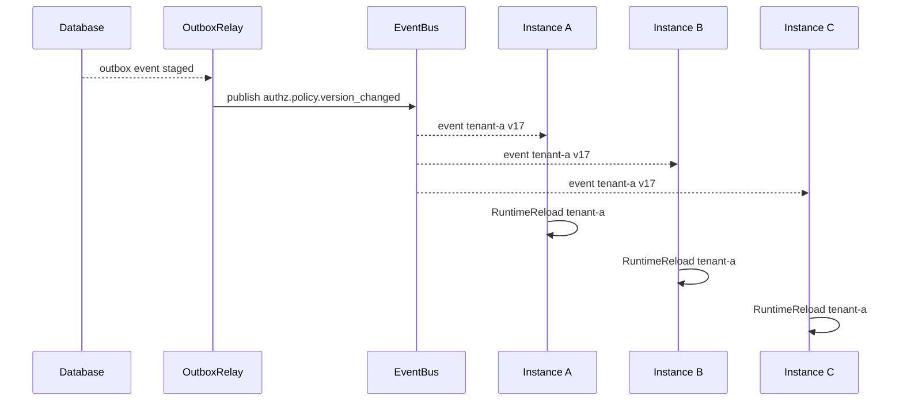

# 04-授权版本与事件传播链路：PolicyVersion、Outbox、RuntimeReload

## 1. 本文定位

本文是 `03-授权AuthZ/` 文档组中关于 **授权版本、事件传播与运行时刷新** 的文档。

上一篇《03-授权写入链路》已经说明：

```text
Application Command
  -> PolicyAdministration
  -> AuthorizationPolicy
  -> PolicyChange
  -> PolicyChangeCommitter
  -> AuthZ UoW
  -> Management Records + Runtime Facts + PolicyVersion + Outbox
```

也就是说，第 03 篇关注的是：

```text
授权事实如何被生成并事务提交？
```

本文关注的是提交之后的问题：

```text
授权事实已经改变后，运行时和其他实例如何感知？
```

主线是：

```text
PolicyChangeCommitter committed
  -> PolicyVersion persisted
  -> Outbox event staged
  -> local RuntimeReload(best-effort)
  -> OutboxRelay publishes authz.policy.version_changed
  -> other instances consume event
  -> RuntimeReload
  -> RuntimeHealthDetails updated
```

本文会回答：

```text
PolicyVersion 是什么？
为什么需要授权版本？
为什么 PolicyVersion 要和授权 facts 同事务提交？
Outbox 解决什么 dual-write 问题？
version_changed event 为什么不携带完整权限明细？
RuntimeReload 为什么是事务后的 best-effort 动作？
多实例如何通过 OutboxRelay / EventBus / Consumer 最终一致？
reload 失败、事件重复、事件乱序应该怎么处理？
Check / Snapshot 与 RuntimeReload 有什么关系？
RuntimeHealthDetails 和 reload lag 如何辅助排查？
```

本文不展开：

```text
PolicyChange 如何生成；
PolicyChangeCommitter 内部如何提交每类 PolicyChange；
Casbin p/g facts 与四段 matcher 细节；
Check / Snapshot 读链路细节；
PolicyLinter 治理规则。
```

这些分别见：

```text
03-授权写入链路-PolicyAdministration-PolicyChange-PolicyChangeCommitter.md
05-权限检查链路-Check-Snapshot.md
06-Casbin运行时模型-pgFacts与四段Matcher.md
07-AuthZ分层架构与事实源索引.md
```

---

## 2. 30 秒结论

授权写入成功后，不能只更新数据库。

还必须让当前进程和其他进程的授权运行时最终看到新事实。

因此需要三类机制：

```text
PolicyVersion：标识某个 tenant / authorization domain 下授权事实的版本。
Outbox：在同一数据库事务中记录“授权版本已变更”的待发布事件。
RuntimeReload：让本地 Casbin runtime / policy snapshot 重新加载授权 facts。
```

核心链路是：

```text
PolicyChangeCommitter
  -> WithinTx:
       write facts
       increment PolicyVersion
       stage Outbox version_changed event
  -> after commit:
       local best-effort RuntimeReload

OutboxRelay
  -> publish authz.policy.version_changed
  -> consumers reload runtime
  -> update RuntimeHealthDetails
```

一句话：

> PolicyVersion 让授权事实有版本，Outbox 让版本变化可靠传播，RuntimeReload 让进程内授权运行时追上数据库事实；三者共同解决“授权写入成功后，运行时和多实例如何最终一致”的问题。

---

## 3. 第 03 / 第 04 篇的边界

新版 AuthZ 文档中，第 03 和第 04 篇边界必须分清。

### 3.1 第 03 篇负责写入提交

第 03 篇关注：

```text
Grant / Revoke / Bind / Unbind 如何变成 PolicyChange？
PolicyChangeCommitter 如何提交 PolicyChange？
AuthZ UoW 如何保证管理面记录、运行时 facts、PolicyVersion、Outbox 同事务？
```

它的终点是：

```text
数据库事实已经提交；
PolicyVersion 已递增；
Outbox event 已 stage；
当前实例尝试 best-effort reload。
```

---

### 3.2 第 04 篇负责版本传播与运行时刷新

本文关注：

```text
PolicyVersion 如何被读链路感知？
OutboxRelay 如何发布 version_changed event？
其他实例如何消费事件并 reload？
runtime 版本如何追上 persisted policy version？
reload lag 如何观测和排查？
```

也就是：

```text
写入提交之后的传播闭环。
```

---

## 4. 为什么 AuthZ 需要 PolicyVersion

如果授权事实没有版本，系统会遇到这些问题：

```text
Check 返回 allow/deny，但无法知道基于哪个版本的策略；
Snapshot 返回角色和权限，但无法知道是否已经过期；
多实例场景下，不知道哪个实例仍在使用旧策略；
SDK / 下游服务无法判断授权缓存是否需要刷新；
排查权限问题时，不知道某次判定发生在授权变更前还是变更后；
RuntimeReload 失败时，没有明确的滞后指标。
```

PolicyVersion 的价值是给授权事实一个明确的版本号。

它使系统能回答：

```text
当前数据库授权事实是哪个版本？
当前 runtime 已加载到哪个版本？
某次 Check 是基于哪个版本？
某个 Snapshot 是基于哪个版本？
某个事件通知的是哪个版本变化？
```

---

## 5. PolicyVersion 的模型语义

### 5.1 PolicyVersion 是什么

`PolicyVersion` 表示某个授权域下授权事实的版本。

它不是权限本身。

它是对当前授权事实集合的版本标识。

可以理解为：

```text
tenant-a 的授权事实当前处于 version 17。
tenant-b 的授权事实当前处于 version 3。
```

每次成功提交授权事实变更时，对应 tenant / domain 的 PolicyVersion 应递增。

---

### 5.2 为什么是 Tenant 维度

AuthZ 的核心授权事实通常带 tenant / domain。

例如：

```text
Permission(role=iam:admin, tenant=tenant-a, resource=..., action=..., scope=...)
RoleBinding(subject=user:1001, role=iam:admin, tenant=tenant-a)
```

如果 tenant-a 的授权事实变了，不应该导致 tenant-b 的授权版本变化。

因此 PolicyVersion 应以 tenant / authorization domain 为边界。

这样可以支持：

```text
局部 reload；
局部 snapshot 版本；
局部权限缓存失效；
多租户隔离排查。
```

---

### 5.3 PolicyVersion 进入哪些读模型

PolicyVersion 应进入：

```text
AuthorizationDecision
AuthorizationSnapshot
RuntimeHealthDetails
version_changed event
SDK / remote check response(optional)
```

例如一次 Check 可以返回：

```text
Allowed: true
MatchedRole: iam:admin
MatchedPermission: iam:identity:user:* read all:*
PolicyVersion: 17
EvaluatedAt: 2026-05-11T...
```

Snapshot 可以返回：

```text
Subject: user:1001
Tenant: tenant-a
Roles: [iam:admin]
Permissions: [...]
PolicyVersion: 17
```

这让调用方知道：

```text
这个结果基于哪个授权事实版本。
```

---

### 5.4 version 是否必须连续

在单个 tenant / domain 内，PolicyVersion 通常应该单调递增。

是否必须连续，取决于实现策略。

推荐理解为：

```text
PolicyVersion 用于 freshness / staleness 判断；
它不是 event sourcing 的增量回放序号；
version_changed event 是 invalidation signal，不是完整变更日志。
```

因此，如果 consumer 收到：

```text
last_loaded_version = 10
event.version = 13
```

不一定需要按 11、12、13 逐个 replay。

更合理的是：

```text
直接 reload 当前最新 DB facts，并将 runtime version 更新到最新版本。
```

---

## 6. Transactional Outbox

### 6.1 dual-write 问题

授权写入同时涉及两个世界：

```text
数据库事实变更；
事件通知其他实例 reload。
```

如果直接这样做：

```text
1. 提交数据库事务。
2. 调用消息系统发布 event。
```

会遇到 dual-write 问题。

典型失败：

```text
数据库提交成功，但消息发布失败；
消息发布成功，但数据库事务回滚；
进程在提交后、发消息前崩溃；
消息系统短暂不可用。
```

这些都会导致：

```text
数据库里授权事实已改变，但其他实例不知道；
或者其他实例收到变更通知，但数据库事实并没有提交成功。
```

---

### 6.2 Outbox 解决什么

Transactional Outbox 的核心思想是：

```text
业务事实变更和待发布事件写入同一个数据库事务。
```

在 AuthZ 中，就是：

```text
write facts
increment PolicyVersion
insert outbox event
```

这三者必须在同一个事务中成功或失败。

如果事务回滚：

```text
facts 不变；
PolicyVersion 不变；
Outbox event 不存在。
```

如果事务提交：

```text
facts 已变；
PolicyVersion 已递增；
Outbox event 一定存在，后续可由 relay 发布。
```

这样可以避免数据库事实和事件通知不一致。

---

### 6.3 Outbox 不等于消息队列

Outbox 是数据库中的待发布事件表。

它不是消息队列本身。

完整传播链路是：

```text
Outbox table
  -> OutboxRelay
  -> EventBus / Message Broker
  -> Consumer
  -> RuntimeReload
```

Outbox 的职责是保证：

```text
只要数据库事实提交成功，就一定留下一个可重试发布的事件记录。
```

EventBus 的职责是：

```text
把事件传递给其他进程或服务实例。
```

Consumer 的职责是：

```text
收到事件后触发 runtime reload 或缓存失效。
```

---

### 6.4 OutboxRelay 的职责

OutboxRelay 是后台发布器。

它负责：

```text
扫描未发布 outbox event；
按策略发布到 EventBus；
发布成功后标记已发布；
发布失败时保留并重试；
记录重试次数、错误原因和发布时间。
```

OutboxRelay 需要考虑：

```text
重复发布；
发布顺序；
批量发布；
重试退避；
死信或人工介入；
实例竞争；
可观测性。
```

因此 consumer 必须是幂等的。

---

## 7. `authz.policy.version_changed` event

### 7.1 事件表达什么

`authz.policy.version_changed` 表达的是：

```text
某个 tenant / authorization domain 的授权事实版本已经变化。
```

它不是完整权限变更明细。

它是 runtime reload / cache invalidation signal。

典型字段：

```text
event_id
event_type
tenant_id
policy_version
change_kind
changed_by
reason
trace_id
occurred_at
```

---

### 7.2 为什么不携带完整权限明细

事件不建议携带完整 Permission / RoleBinding 明细。

原因是：

```text
权限明细可能很大；
事件载荷会膨胀；
事件消费者需要理解复杂变更语义；
乱序/重复时增量应用更容易出错；
事实源已经在数据库中，runtime reload 应以数据库事实为准。
```

因此，version_changed event 更适合表达：

```text
tenant-a 的授权事实已经变更到 version 17，请刷新。
```

而不是：

```text
请增量添加这一条 p fact，删除那一条 g fact。
```

---

### 7.3 change_kind / actor / reason / trace_id

虽然事件不携带完整权限明细，但应该携带足够的上下文用于排查。

建议包含：

| 字段 | 用途 |
| --- | --- |
| `change_kind` | grant_permission / revoke_permission / bind_role / unbind_role 等 |
| `changed_by` | 谁触发了变更 |
| `reason` | 为什么变更 |
| `trace_id` | 链路追踪 |
| `occurred_at` | 事件发生时间 |

这些字段有助于：

```text
排查为什么 runtime reload；
追踪权限变更来源；
关联管理后台操作；
审计敏感权限变化。
```

---

## 8. RuntimeReload

### 8.1 Runtime policy 是什么

Runtime policy 是进程内授权运行时使用的策略视图。

在当前 IAM 中，运行时通常由 Casbin Enforcer 承载：

```text
p facts：Permission runtime facts
g facts：RoleBinding runtime facts
matcher：resource / action / scope / domain 匹配规则
```

Runtime policy 不是领域模型本身。

它是领域授权事实在 infra runtime 中的加载结果。

---

### 8.2 local best-effort reload

PolicyChangeCommitter 提交事务成功后，可以触发当前实例本地 best-effort reload。

作用是：

```text
让当前处理写入请求的实例尽快加载新授权事实。
```

但这个动作是 best-effort。

也就是说：

```text
reload 成功：当前实例很快看到新策略；
reload 失败：数据库事实仍然已经提交，不应回滚事务；
后续依赖 Outbox / sync / health check 补偿。
```

---

### 8.3 为什么不在事务内 reload

RuntimeReload 不应该放在数据库事务内部。

原因是：

```text
RuntimeReload 是内存状态刷新，不是数据库事实写入；
它可能较慢；
它可能依赖 Casbin adapter / runtime lock；
它失败不应该回滚已经提交的授权事实；
它会扩大数据库事务时间，增加锁持有时间。
```

因此推荐边界是：

```text
事务内：facts + PolicyVersion + Outbox
事务后：best-effort RuntimeReload
```

---

### 8.4 reload 失败如何处理

reload 失败时：

```text
记录错误；
保留数据库 facts 和 PolicyVersion；
保留 Outbox event；
标记 RuntimeHealthDetails stale / reload_failed；
等待后续事件或健康检查触发重新 reload。
```

不要：

```text
回滚已提交授权事实；
静默吞掉错误；
让 Check 直接使用半加载 runtime。
```

如果 reload 过程不是原子切换，应保证：

```text
要么继续使用旧 runtime；
要么切换到完整新 runtime；
不要暴露半加载策略。
```

---

## 9. 多实例传播闭环

### 9.1 单实例与多实例差异

单实例场景下，事务提交后 local best-effort reload 可能已经足够。

多实例场景下不够。

因为：

```text
写入请求只发生在实例 A；
实例 B / C / D 的 runtime 仍然是旧策略；
如果没有事件传播，其他实例不会知道授权事实变化。
```

因此必须有：

```text
OutboxRelay -> EventBus -> Consumer -> RuntimeReload
```

---

### 9.2 传播链路

完整多实例传播链路：



这里要注意：

```text
Instance A 可能已经本地 best-effort reload；
但它仍然可以消费同一个 event；
consumer 必须幂等。
```

---

### 9.3 Consumer 幂等

事件可能重复投递。

Consumer 必须幂等。

推荐处理：

```text
if event.version <= runtime.loaded_version:
    ignore
else:
    reload latest facts
    update runtime.loaded_version
```

这样即使事件重复，也不会重复造成不一致。

---

### 9.4 乱序与旧版本事件处理

事件可能乱序。

例如 runtime 当前已经加载到 v17，又收到 v16：

```text
runtime.loaded_version = 17
event.version = 16
```

应该忽略。

如果收到跳跃版本：

```text
runtime.loaded_version = 10
event.version = 13
```

不需要回放 11、12、13。

因为 version_changed event 是 invalidation signal，不是 event sourcing log。

正确做法是：

```text
直接 reload 数据库中的最新 facts。
```

---

### 9.5 是否按 Tenant 局部 reload

理想情况下，可以按 tenant / authorization domain 局部 reload。

优点：

```text
减少 reload 开销；
减少大租户影响小租户；
更容易做 reload lag 监控；
更符合 PolicyVersion 的 tenant 维度。
```

但实现复杂度更高。

如果当前 runtime 只能全量 reload，也可以先使用全量 reload。

文档中应明确：

```text
event 是 tenant 维度；
runtime reload 可以先全量实现；
未来可以优化为 tenant 局部 reload。
```

---

## 10. RuntimeHealthDetails 与 reload lag

RuntimeHealthDetails 用于观察当前实例的授权运行时状态。

它可以包含：

```text
loaded_policy_version
latest_persisted_policy_version
last_reload_at
last_reload_error
reload_lag
stale
```

其中：

```text
reload_lag = latest_persisted_policy_version - loaded_policy_version
```

它回答：

```text
当前实例是否已经加载到最新授权策略？
如果没有，落后多少版本？
上次 reload 是什么时候？
上次 reload 是否失败？
```

这对生产排查很重要。

例如：

```text
用户刚被授予角色，但某个实例仍然拒绝访问。
```

可以检查：

```text
该实例 loaded_policy_version 是否落后；
OutboxRelay 是否发布事件；
Consumer 是否处理事件；
RuntimeReload 是否失败；
Casbin runtime 是否加载成功。
```

---

## 11. Check / Snapshot 与 RuntimeReload 的关系

### 11.1 Check 不应该主动修改 runtime

Check 是读链路。

它应该使用当前已加载 runtime 做判定。

它不应该在每次请求时主动：

```text
查数据库 facts；
发现版本落后就 reload；
写 PolicyVersion；
消费 Outbox event。
```

否则 Check 会变成读写混合链路，性能和边界都会变差。

---

### 11.2 Check 应返回 PolicyVersion

Check 返回 AuthorizationDecision 时，应该带上当前判定使用的 PolicyVersion。

这样调用方和排查人员可以知道：

```text
这次 allow / deny 基于哪个授权版本。
```

如果用户反馈“刚授权还不能访问”，就可以判断：

```text
是权限事实本身不匹配；
还是 runtime 还没 reload 到最新版本。
```

---

### 11.3 Snapshot 应带版本

AuthorizationSnapshot 也应带 PolicyVersion。

因为 Snapshot 是主体授权视图。

它应该明确：

```text
这个角色/权限快照是基于哪个版本生成的？
```

如果 Snapshot 来源于 runtime，则它对应 runtime loaded version。

如果 Snapshot 来源于 DB facts，则它对应 persisted policy version。

这两种来源需要在实现和文档中保持清楚。

---

## 12. 与 Casbin Runtime 的关系

RuntimeReload 最终会让 Casbin runtime 重新加载授权 facts。

这些 facts 通常包括：

```text
Permission -> p fact
RoleBinding -> g fact
```

Casbin RBAC with domains 使用三元 `g = _, _, _` 表达 subject-role-domain 关系。

IAM 在此基础上还会通过 matcher 处理：

```text
ResourcePattern vs ResourceKey
ActionPattern vs Action
Scope vs ObjectScope
Tenant / Domain match
```

本文不展开 p/g facts 和四段 matcher 细节。

这些放到：

```text
06-Casbin运行时模型-pgFacts与四段Matcher.md
```

这里需要记住：

```text
第 04 篇关注 runtime 是否加载到新事实；
第 06 篇关注新事实被加载后如何通过 matcher 判定。
```

---

## 13. 与 PolicyLinter 的关系

PolicyLinter 与 RuntimeReload 解决的问题不同。

RuntimeReload 关注：

```text
运行时是否加载了当前授权事实？
```

PolicyLinter 关注：

```text
当前授权事实本身是否合理？
```

例如：

```text
某条 Permission 指向了不存在的 Resource；
某条 Permission 使用了 ResourceCatalog 不支持的 Action；
某条 Permission 使用了不支持的 ScopeKind。
```

RuntimeReload 即使成功，也只是加载了这些事实。

它不会判断这些事实是否合理。

PolicyLinter 是 read-only diagnosis 能力。

它不是 RuntimeReload，也不是 OutboxRelay。

PolicyLinter 作为事实治理能力，统一放入：

```text
07-AuthZ分层架构与事实源索引.md
```

中说明。

---

## 14. 生产化建议

### 14.1 OutboxRelay 需要可观测

应观测：

```text
待发布事件数量；
发布延迟；
发布失败次数；
最大重试次数；
死信事件数量；
最近一次成功发布时间。
```

---

### 14.2 Consumer 需要可观测

应观测：

```text
收到事件数；
忽略旧事件数；
reload 成功数；
reload 失败数；
reload 耗时；
当前 loaded version；
当前 reload lag。
```

---

### 14.3 RuntimeReload 需要原子切换

如果 reload 是重建 runtime，则推荐：

```text
先构建新 runtime；
验证新 runtime 加载完整；
再原子替换旧 runtime；
失败则继续使用旧 runtime。
```

避免出现：

```text
runtime 加载一半时被 Check 使用。
```

---

### 14.4 Access path 要明确一致性等级

不同接口可以有不同一致性要求：

```text
普通业务 Check：接受短暂最终一致；
高风险管理操作：可以强制 Online / DB-backed check；
权限管理后台：可以展示 persisted version 和 runtime loaded version 差异。
```

不要假设所有授权变更都能在所有实例上瞬间生效。

---

## 15. 常见误区

### 15.1 PolicyVersion 是权限内容

错误。

PolicyVersion 是授权事实版本，不是权限内容。

权限内容是 Permission / RoleBinding facts。

---

### 15.2 Outbox 就是消息队列

错误。

Outbox 是数据库中的待发布事件表。

消息队列 / EventBus 是外部传输组件。

---

### 15.3 Outbox event 应该携带完整权限明细

通常不应该。

version_changed event 更适合作为 reload / cache invalidation signal。

运行时应从事实源重新加载最新授权 facts。

---

### 15.4 RuntimeReload 应该放在数据库事务内

错误。

RuntimeReload 是内存状态刷新，不应扩大数据库事务。

事务内只提交 facts / version / outbox。

---

### 15.5 Check 应该发现版本落后后自动 reload

通常不应该。

Check 是读链路，不应混入 reload 写行为。

可以返回版本信息，交给监控、同步器或管理面处理。

---

### 15.6 收到每个 event 都必须增量应用

不对。

version_changed event 是 invalidation signal，不是 event sourcing log。

收到新版本事件后，可以直接 reload 最新事实。

---

### 15.7 reload 成功等于授权事实合理

不对。

reload 只说明 runtime 加载了事实。

事实是否合理，需要 PolicyLinter / 治理能力检查。

---

## 16. 代码事实源

本文只列版本传播相关入口，更完整的事实源索引见：

```text
07-AuthZ分层架构与事实源索引.md
```

主要代码事实源：

```text
internal/apiserver/application/authz
internal/apiserver/domain/authz
internal/apiserver/infra/casbin
internal/apiserver/infra/mysql
internal/apiserver/infra/events
configs/casbin_model.conf
```

重点关注：

| 主题 | 事实源 |
| --- | --- |
| PolicyVersion | `domain/authz` / `application/authz` |
| PolicyChangeCommitter | `application/authz` |
| AuthZ UoW | `application/authz` / infra UoW adapter |
| Outbox event staging | `application/authz` / infra events adapter |
| OutboxRelay | infra events / runtime task，以当前代码为准 |
| RuntimeReload | `application/authz` / `infra/casbin` |
| RuntimeHealthDetails | `application/authz` / runtime health 相关代码 |
| Casbin LoadPolicy | `infra/casbin` |
| Casbin matcher | `configs/casbin_model.conf` |

如果本文与代码不一致，以代码事实源为准，并同步更新本文档。

---

## 17. 后续文档入口

本文说明授权版本与事件传播链路。

后续继续阅读：

```text
05-权限检查链路-Check-Snapshot.md
06-Casbin运行时模型-pgFacts与四段Matcher.md
07-AuthZ分层架构与事实源索引.md
```

其中：

```text
第 05 篇说明 Check / Snapshot 如何消费授权 facts 与 PolicyVersion；
第 06 篇说明 RuntimeReload 后的 p/g facts 如何被 Casbin matcher 使用；
第 07 篇统一收口分层架构、代码路径、表结构、坏味道和维护原则。
```

---

## 18. 本文总结

授权写入提交成功后，系统还需要解决运行时和多实例一致性问题。

核心链路是：

```text
PolicyChangeCommitter committed
  -> PolicyVersion persisted
  -> Outbox event staged
  -> local RuntimeReload(best-effort)
  -> OutboxRelay publishes authz.policy.version_changed
  -> consumers reload runtime
  -> RuntimeHealthDetails updated
```

其中：

```text
PolicyVersion 让授权事实具备版本；
Outbox 让版本变化可靠传播；
RuntimeReload 让进程内授权 runtime 加载最新事实；
RuntimeHealthDetails 让我们知道 runtime 是否落后；
Outbox-driven propagation 让多实例最终一致。
```

如果只记住一句话：

> 第 03 篇讲授权变更如何被事务提交，第 04 篇讲提交后的 PolicyVersion / Outbox event 如何让多实例 Runtime 最终加载到新授权事实。