# 授权版本事件与 Outbox

## 本文回答

本文回答：IAM AuthZ 的授权策略变更为什么要产生版本事件；`iam.authz.version_changed` 如何在 UoW 中被 stage 到 transactional outbox；outbox 记录如何通过 relay 被异步发布到 EventBus；EventBus 不可用、发布失败、mark 失败、relay 重启时系统如何保证事件不丢；policy version、outbox、runtime reload 三者分别解决什么问题。

读完本文，你应该能回答：

- 为什么 AuthZ policy 变更需要版本事件；
- `PolicyVersion` 和 `iam.authz.version_changed` 的关系是什么；
- `StagePolicyVersionChanged` 在 UoW 中做了什么；
- `event.Stager` 和 `event.Publisher` 有什么区别；
- 为什么 `iam.authz.version_changed` 必须走 durable outbox；
- outbox row 中记录了哪些字段；
- outbox 状态机：pending、publishing、published、failed 分别是什么意思；
- relay 如何 claim、publish、mark；
- EventBus 不可用时为什么不 claim 事件；
- publish 失败后如何重试；
- runtime policy reload 与 outbox event 发布有什么区别；
- outbox 事件能保证什么，不能保证什么；
- 下游消费者为什么仍然需要幂等。

---

## 30 秒结论

AuthZ 策略变更有三类“后续影响”，它们不是一回事：

```text
1. DB 授权事实变化
2. 本进程 runtime policy reload
3. 跨系统授权版本事件传播
```

`PolicyChangeCommitter` 在同一个 UoW 事务内完成：

```text
write authorization facts
  -> increment policy version
  -> stage iam.authz.version_changed into outbox
```

事务提交后：

```text
ReloadRuntimePolicy
```

后台 relay 再异步执行：

```text
claim pending outbox rows
  -> publish to EventBus
  -> mark published / failed
```

核心链路：

```text
PolicyChangeCommitter
  -> PolicyVersions.Increment
  -> StagePolicyVersionChanged
  -> event.Stager.Stage
  -> domain_event_outbox
  -> OutboxRelay.DispatchDue
  -> EventBus.PublishMessage
```

最关键的设计点是：

> 授权事实、policy version 和 outbox 事件记录在同一个数据库事务中提交。EventBus 不可用不会导致事件丢失，因为事件先落库，后投递。

当前事件目录明确配置：

```yaml
iam.authz.version_changed:
  topic: authz_version
  delivery: durable_outbox
  aggregate: PolicyVersion
  domain: authz
  handler: iam-policy-sync
```

所以这个事件不能通过普通 `event.Publisher.Publish` 直接 best-effort 发布，必须通过 outbox staging。

核心源码入口：

- [../../internal/apiserver/application/authz/policy/committer.go](../../internal/apiserver/application/authz/policy/committer.go)
- [../../internal/apiserver/application/authz/shared/version_event.go](../../internal/apiserver/application/authz/shared/version_event.go)
- [../../internal/apiserver/domain/authz/policy/events.go](../../internal/apiserver/domain/authz/policy/events.go)
- [../../pkg/event/event.go](../../pkg/event/event.go)
- [../../configs/events.yaml](../../configs/events.yaml)
- [../../internal/apiserver/container/container.go](../../internal/apiserver/container/container.go)
- [../../internal/apiserver/infra/mysql/eventoutbox/store.go](../../internal/apiserver/infra/mysql/eventoutbox/store.go)
- [../../pkg/outboxcore/core.go](../../pkg/outboxcore/core.go)
- [../../internal/apiserver/infra/messaging/outbox_relay.go](../../internal/apiserver/infra/messaging/outbox_relay.go)
- [../../internal/apiserver/process/shutdown_lifecycle.go](../../internal/apiserver/process/shutdown_lifecycle.go)

---

## 主图：授权变更到 Outbox Relay

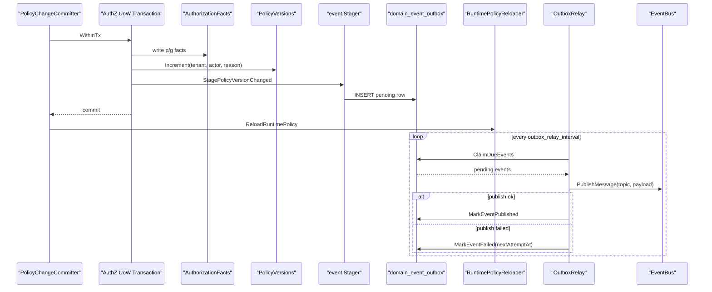

---

## 重点速查

| 问题 | 当前答案 | 代码证据 |
| --- | --- | --- |
| 授权版本事件在哪里 stage | `PolicyChangeCommitter.Commit` 调用 `StagePolicyVersionChanged`。 | [../../internal/apiserver/application/authz/policy/committer.go](../../internal/apiserver/application/authz/policy/committer.go) |
| 事件类型是什么 | `iam.authz.version_changed`。 | [../../internal/apiserver/eventing/eventing.go](../../internal/apiserver/eventing/eventing.go) |
| 事件 payload 是什么 | `{tenant_id, version}`。 | [../../internal/apiserver/domain/authz/policy/events.go](../../internal/apiserver/domain/authz/policy/events.go) |
| 事件目录怎么配置 | `iam.authz.version_changed` -> topic `iam.authz.version`，delivery `durable_outbox`。 | [../../configs/events.yaml](../../configs/events.yaml) |
| event.Stager 是什么 | 在调用方事务内 durable stage domain events。 | [../../pkg/event/event.go](../../pkg/event/event.go) |
| outbox store 如何要求事务 | `Store.Stage` 调用 `dbmysql.RequireTx(ctx)`，没有 active tx 会失败。 | [../../internal/apiserver/infra/mysql/eventoutbox/store.go](../../internal/apiserver/infra/mysql/eventoutbox/store.go) |
| outbox row 初始状态 | `pending`，`next_attempt_at=now`。 | [../../pkg/outboxcore/core.go](../../pkg/outboxcore/core.go) |
| relay 如何取事件 | `ClaimDueEvents` 取 pending/failed due 以及 stale publishing。 | [../../internal/apiserver/infra/mysql/eventoutbox/store.go](../../internal/apiserver/infra/mysql/eventoutbox/store.go) |
| relay 如何发布 | `PublishMessage(topic, payload)`，metadata 带 event_type/aggregate/source。 | [../../internal/apiserver/infra/messaging/outbox_relay.go](../../internal/apiserver/infra/messaging/outbox_relay.go) |
| EventBus 不可用怎么办 | relay 不 claim，只记录 degraded，outbox rows 保持原状态。 | [../../internal/apiserver/infra/messaging/outbox_relay.go](../../internal/apiserver/infra/messaging/outbox_relay.go) |
| relay 由谁启动 | process runtime task 通过 `container.BuildRuntimeDeps().OutboxRelay` 启动。 | [../../internal/apiserver/process/shutdown_lifecycle.go](../../internal/apiserver/process/shutdown_lifecycle.go) |
| AuthZ module 如何拿到 stager | `moduleGraph.authzModuleDependencies` 将 `container.outboxStore` 注入 AuthZ。 | [../../internal/apiserver/container/module_graph.go](../../internal/apiserver/container/module_graph.go) |

---

## 1. 为什么 AuthZ 需要版本事件

AuthZ 的授权策略会被多个地方使用：

```text
IAM 本进程 Casbin runtime
业务服务本地授权缓存
SDK / gRPC consumer
外部 policy sync worker
```

当授权事实发生变化时，系统需要一种信号告诉其他组件：

```text
某个 tenant 的授权版本已经变化
你本地缓存的授权快照可能过期
请重新拉取或刷新
```

这就是 `PolicyVersion` 和 `iam.authz.version_changed` 的作用。

Policy version 不是具体权限明细。它是一个 tenant 级别的变更序号：

```text
tenant-a version 1
tenant-a version 2
tenant-a version 3
```

下游看到版本变化后，可以按自己的策略：

- 拉取新 snapshot；
- 清理本地缓存；
- 重新同步 policy；
- 标记某个 tenant 的授权数据过期。

### 为什么不是直接把所有权限明细发出去

直接把所有权限明细放进事件会有几个问题：

- payload 可能很大；
- 事件消费者要理解权限模型细节；
- 每次变更都要传全量；
- 权限事实与事件 payload 容易产生漂移。

当前版本事件只传：

```text
tenant_id
version
```

它更像 cache invalidation / sync signal，而不是完整 policy 数据复制。

---

## 2. PolicyVersion 与 VersionChangedEvent

`PolicyVersion` 字段：

| 字段 | 含义 |
| --- | --- |
| `TenantID` | 授权域 |
| `Version` | 版本号 |
| `ChangedBy` | 变更人 |
| `Reason` | 变更原因 |

`VersionChangedEvent` payload：

```json
{
  "tenant_id": "tenant-a",
  "version": 2
}
```

事件基础字段由 `BaseEvent` 提供：

| 字段 | 值 |
| --- | --- |
| EventType | `iam.authz.version_changed` |
| AggregateType | `PolicyVersion` |
| AggregateID | `<tenantID>:<version>` |
| EventID | uuid |
| OccurredAt | 当前时间 |

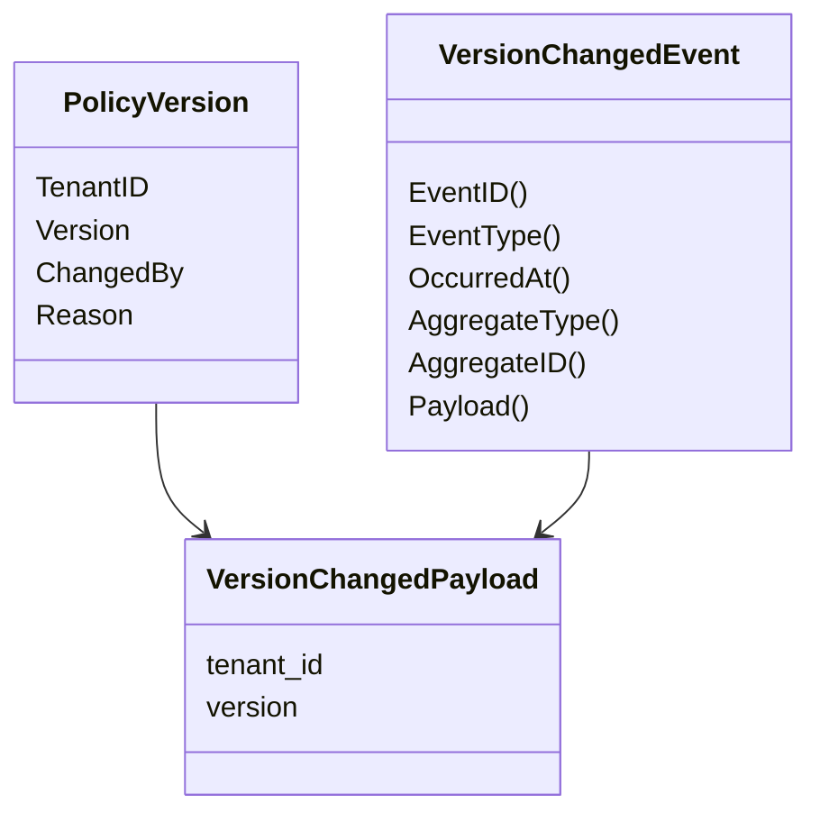

核心源码：

- [../../internal/apiserver/domain/authz/policy/policy_version.go](../../internal/apiserver/domain/authz/policy/policy_version.go)
- [../../internal/apiserver/domain/authz/policy/events.go](../../internal/apiserver/domain/authz/policy/events.go)

---

## 3. StagePolicyVersionChanged

`StagePolicyVersionChanged` 做的事情很少，但很关键：

```text
if version == nil:
    return nil

if stager == nil:
    return error

stager.Stage(ctx, NewVersionChangedEvent(tenantID, version.Version))
```

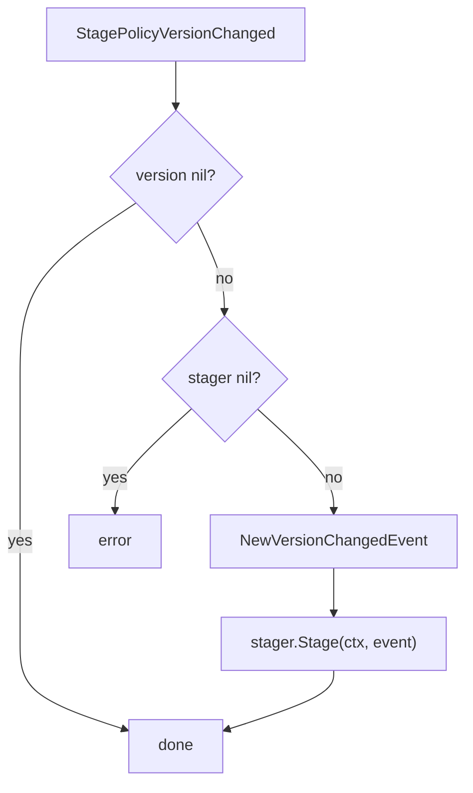

### 为什么 stager nil 要报错

对 AuthZ version event 来说，stager 不是可选 side effect。  
如果授权事实和 version 已经变了，但无法 stage 事件，下游系统可能永远不知道授权发生变化。

因此当前设计选择：

```text
stager nil -> Commit 失败 -> UoW 回滚
```

这比“悄悄跳过事件”更安全。

核心源码：

- [../../internal/apiserver/application/authz/shared/version_event.go](../../internal/apiserver/application/authz/shared/version_event.go)

---

## 4. event.Stager 与 event.Publisher 的区别

`pkg/event` 定义了两个不同接口：

```go
type Stager interface {
    Stage(ctx context.Context, events ...DomainEvent) error
}

type Publisher interface {
    Publish(ctx context.Context, event DomainEvent) error
    PublishAll(ctx context.Context, events []DomainEvent) error
}
```

它们的语义完全不同。

| 接口 | 语义 | 适合事件 |
| --- | --- | --- |
| `Stager` | 在调用方 active transaction 内把事件持久化 | durable outbox |
| `Publisher` | 直接发布事件到 MQ 或日志 | best effort / immediate publish |

### 对 durable_outbox 事件的限制

`eventruntime.RoutingPublisher.Publish` 会检查 event catalog。  
如果事件 delivery 是 `durable_outbox`，直接 publish 会返回错误：

```text
event type "... " is durable_outbox and must be staged to outbox
```

这防止开发者绕过 transactional outbox 直接发授权版本事件。

### AuthZ version event 必须 Stage

因为事件目录写明：

```text
iam.authz.version_changed:
  delivery: durable_outbox
```

所以它必须走：

```text
event.Stager.Stage
```

而不是：

```text
event.Publisher.Publish
```

核心源码：

- [../../pkg/event/event.go](../../pkg/event/event.go)
- [../../pkg/eventruntime/publisher.go](../../pkg/eventruntime/publisher.go)
- [../../configs/events.yaml](../../configs/events.yaml)

---

## 5. Event Catalog：事件路由与投递级别

事件目录在：

```text
configs/events.yaml
```

关键配置：

```yaml
topics:
  authz_version:
    name: iam.authz.version
    description: Authorization policy version changes.

events:
  iam.authz.version_changed:
    topic: authz_version
    delivery: durable_outbox
    aggregate: PolicyVersion
    domain: authz
    handler: iam-policy-sync
    description: Authorization policy version changed.
```

Catalog 提供两个核心能力：

| 能力 | 用途 |
| --- | --- |
| `GetTopicForEvent(eventType)` | 根据 event type 找 topic name |
| `GetDeliveryClass(eventType)` | 判断事件是 `best_effort` 还是 `durable_outbox` |

`outboxcore.BuildRecords` 会使用 catalog：

1. 找事件 topic；
2. 校验 delivery class；
3. 如果不是 `durable_outbox`，拒绝 stage 到 outbox。

这保证：

```text
只有声明为 durable_outbox 的事件才能被写入 outbox
```

核心源码：

- [../../configs/events.yaml](../../configs/events.yaml)
- [../../pkg/eventcatalog/catalog.go](../../pkg/eventcatalog/catalog.go)
- [../../pkg/eventcatalog/config.go](../../pkg/eventcatalog/config.go)
- [../../pkg/outboxcore/core.go](../../pkg/outboxcore/core.go)

---

## 6. Container 如何装配 Outbox

container 初始化 eventing：

```text
initEventing
  -> load event catalog
  -> create event publisher
  -> if mysqlDB != nil: create outbox store
  -> if eventBus != nil: create outbox relay
```

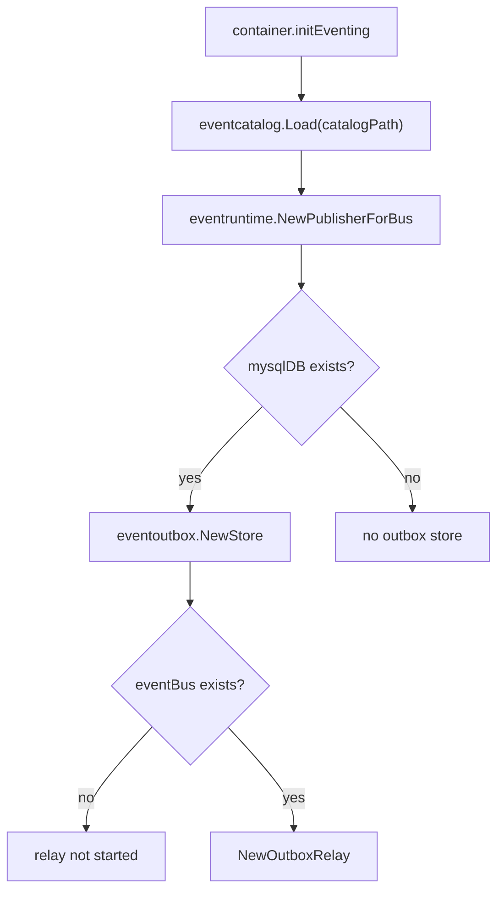

### 6.1 OutboxStore

当 MySQL 存在时：

```text
c.outboxStore = eventoutbox.NewStore(c.mysqlDB, catalog)
```

这个 store 同时实现：

```text
event.Stager
outbox.Store
outbox.StatusReader
```

### 6.2 OutboxRelay

当 EventBus 存在时：

```text
c.outboxRelay = NewOutboxRelay(...)
```

如果 EventBus 不存在：

```text
outboxStore 仍然存在
outboxRelay 不启动
```

这意味着：

```text
授权事件可以继续入库
只是暂时不会被投递到 MQ
```

核心源码：

- [../../internal/apiserver/container/container.go](../../internal/apiserver/container/container.go)

---

## 7. AuthZ 如何拿到 EventStager

AuthZ module dependencies 中：

```go
func (g *moduleGraph) authzModuleDependencies() assembler.AuthzModuleDeps {
    return assembler.AuthzModuleDeps{
        DB:          g.container.mysqlDB,
        EventStager: g.container.outboxStore,
    }
}
```

然后 AuthZ module 创建 UoW：

```text
mysqlAuthzUow.NewUnitOfWork(deps.DB, deps.EventStager)
```

最终 UoW 内的 `TxRepositories.Events` 就是这个 stager。

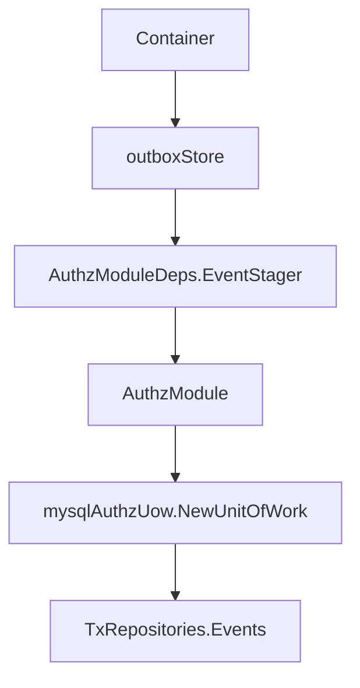

因此 `PolicyChangeCommitter` 中的：

```text
tx.Events
```

实际就是 transactional outbox store。

核心源码：

- [../../internal/apiserver/container/module_graph.go](../../internal/apiserver/container/module_graph.go)
- [../../internal/apiserver/container/assembler/authz.go](../../internal/apiserver/container/assembler/authz.go)
- [../../internal/apiserver/infra/mysql/uow/authz/uow.go](../../internal/apiserver/infra/mysql/uow/authz/uow.go)

---

## 8. Outbox Store：Stage 必须在事务内

`eventoutbox.Store.Stage` 的第一步是：

```text
tx, err := dbmysql.RequireTx(ctx)
```

也就是说，Stage 必须在 active transaction context 内执行。  
如果没有事务，Stage 会失败。

这非常重要，因为它保证：

```text
业务事实和事件记录使用同一个数据库事务
```

`Stage` 流程：

```text
RequireTx(ctx)
  -> buildRows(events)
  -> tx.Create(rows)
```

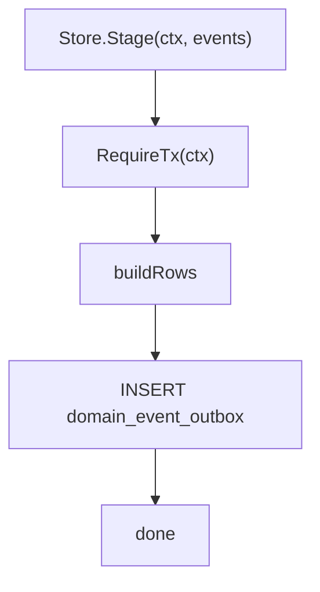

### 为什么不能事务外 stage

如果事务外 stage，会出现经典不一致：

| 场景 | 后果 |
| --- | --- |
| 先发事件，后业务事务回滚 | 下游看到不存在的授权变化 |
| 先提交业务事务，后写事件失败 | 授权变化发生了，但下游永远不知道 |
| 两个 DB 事务分别提交 | 无法保证事实与事件同步 |

Transactional outbox 的核心就是避免这类不一致。

核心源码：

- [../../internal/apiserver/infra/mysql/eventoutbox/store.go](../../internal/apiserver/infra/mysql/eventoutbox/store.go)

---

## 9. Outbox row 字段

`domain_event_outbox` 对应 `OutboxPO`。

关键字段：

| 字段 | 含义 |
| --- | --- |
| `EventID` | 事件 ID，唯一 |
| `EventType` | 事件类型，例如 `iam.authz.version_changed` |
| `AggregateType` | 聚合类型，例如 `PolicyVersion` |
| `AggregateID` | 聚合 ID，例如 `tenant-a:2` |
| `TopicName` | MQ topic，例如 `iam.authz.version` |
| `PayloadJSON` | 事件 payload JSON |
| `Status` | pending / publishing / published / failed |
| `AttemptCount` | 发布失败次数 |
| `NextAttemptAt` | 下次可投递时间 |
| `LastError` | 最近错误 |
| `CreatedAt` | 创建时间 |
| `UpdatedAt` | 更新时间 |
| `PublishedAt` | 成功发布时间 |

初始 record 由 `outboxcore.BuildRecords` 生成：

```text
status = pending
attempt_count = 0
next_attempt_at = now
created_at = now
updated_at = now
```

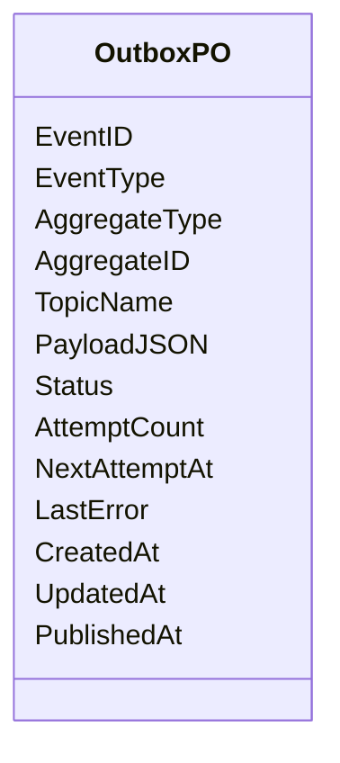

核心源码：

- [../../internal/apiserver/infra/mysql/eventoutbox/store.go](../../internal/apiserver/infra/mysql/eventoutbox/store.go)
- [../../pkg/outboxcore/core.go](../../pkg/outboxcore/core.go)

---

## 10. Outbox 状态机

当前状态：

```text
pending
publishing
published
failed
```

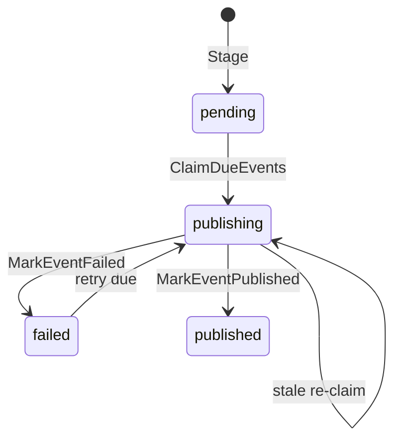

### 状态含义

| 状态 | 含义 |
| --- | --- |
| `pending` | 已入库，等待 relay claim |
| `publishing` | 已被 relay claim，正在投递 |
| `published` | 已投递成功并标记完成 |
| `failed` | 投递失败，等待 retry |

### stale publishing

如果事件进入 `publishing` 后进程崩溃，可能永远无法 mark。  
因此 `ClaimDueEvents` 也会 claim：

```text
status = publishing
and updated_at <= staleBefore
```

默认 stale 窗口：

```text
DefaultPublishingStaleFor = 1 minute
```

这让 relay 重启后可以恢复卡在 publishing 的事件。

核心源码：

- [../../internal/apiserver/infra/mysql/eventoutbox/store.go](../../internal/apiserver/infra/mysql/eventoutbox/store.go)
- [../../pkg/outboxcore/core.go](../../pkg/outboxcore/core.go)

---

## 11. ClaimDueEvents

`ClaimDueEvents(ctx, limit, now)` 会选取：

```text
pending   且 next_attempt_at <= now
failed    且 next_attempt_at <= now
publishing 且 updated_at <= staleBefore
```

按 `created_at ASC` 排序，limit 限制批量大小。

非 sqlite 场景使用：

```text
FOR UPDATE SKIP LOCKED
```

然后把选中的 row 更新为：

```text
status = publishing
updated_at = now
```

再返回 `PendingEvent` 给 relay。

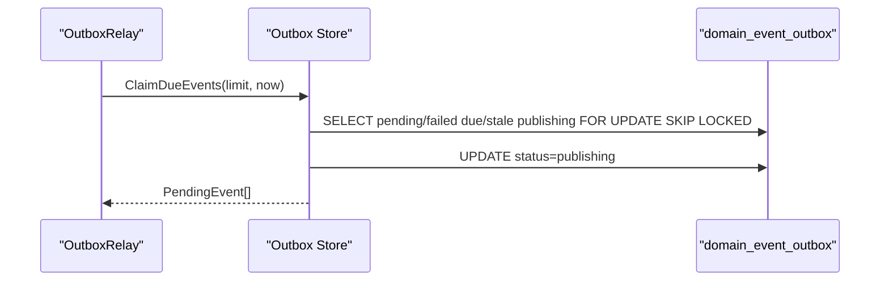

### 为什么先标记 publishing

这是为了避免多个 relay 实例同时投递同一条事件。  
`SKIP LOCKED` 进一步减少并发 claim 冲突。

核心源码：

- [../../internal/apiserver/infra/mysql/eventoutbox/store.go](../../internal/apiserver/infra/mysql/eventoutbox/store.go)

---

## 12. OutboxRelay.DispatchDue

`OutboxRelay.DispatchDue` 的流程：

```text
if store nil:
    return nil

if publisher nil:
    log degraded
    return nil

pendingEvents = store.ClaimDueEvents(batchSize, now)

for each pending:
    PublishMessage(topic, payload, metadata)

    if publish success:
        MarkEventPublished(eventID)

    if publish failed:
        MarkEventFailed(eventID, err, now + retryDelay)
```

```mermaid
sequenceDiagram
    participant Loop as "runOutboxRelay"
    participant Relay as "OutboxRelay"
    participant Store as "Outbox Store"
    participant Bus as "EventBus Publisher"

    Loop->>Relay: DispatchDue(ctx)

    alt publisher unavailable
        Relay-->>Loop: degraded, return nil
    else publisher available
        Relay->>Store: ClaimDueEvents(batchSize, now)
        Store-->>Relay: PendingEvent[]
        loop each event
            Relay->>Bus: PublishMessage(topic, message)
            alt publish ok
                Relay->>Store: MarkEventPublished(eventID)
            else publish failed
                Relay->>Store: MarkEventFailed(eventID, nextAttemptAt)
            end
        end
    end
```

### Message metadata

relay 发布时会设置 metadata：

| metadata | 值 |
| --- | --- |
| `event_type` | outbox event type |
| `aggregate_type` | aggregate type |
| `aggregate_id` | aggregate id |
| `source` | `iam-outbox-relay` |

这让下游消费者可以在消息层做路由、日志和幂等处理。

核心源码：

- [../../internal/apiserver/infra/messaging/outbox_relay.go](../../internal/apiserver/infra/messaging/outbox_relay.go)

---

## 13. EventBus 不可用时为什么不会丢事件

这是 Outbox 的关键价值。

### 13.1 事件入库时 EventBus 不参与

授权写入阶段只需要：

```text
MySQL
outboxStore
UoW transaction
```

EventBus 不参与事务提交。

因此只要 MySQL 和 outboxStore 可用，授权版本事件可以被 durable stage 到数据库。

### 13.2 relay 没有 publisher 时不 claim

`DispatchDue` 中如果 publisher nil：

```text
log degraded
return nil
```

它不会调用：

```text
ClaimDueEvents
```

因此 outbox rows 保持：

```text
pending / failed
```

不会被错误推进到 publishing。

### 13.3 EventBus 恢复后继续投递

当 EventBus 可用并且 relay 启动后，会重新 claim due rows：

```text
pending due
failed due
stale publishing
```

这就是“事件不丢”的核心机制。

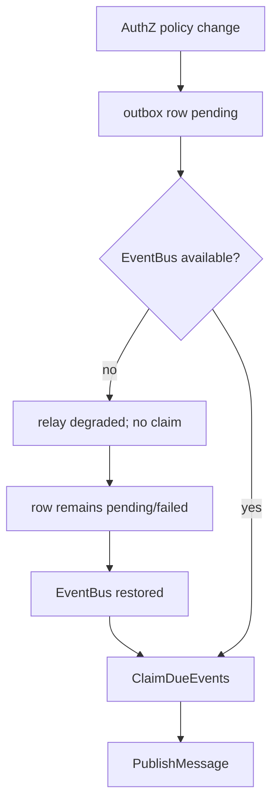

核心源码：

- [../../internal/apiserver/infra/messaging/outbox_relay.go](../../internal/apiserver/infra/messaging/outbox_relay.go)
- [../../internal/apiserver/infra/mysql/eventoutbox/store.go](../../internal/apiserver/infra/mysql/eventoutbox/store.go)
- [../../internal/apiserver/container/container.go](../../internal/apiserver/container/container.go)

---

## 14. Publish 失败与重试

如果 `PublishMessage` 失败，relay 会：

```text
MarkEventFailed(eventID, err, now + retryDelay)
```

`MarkEventFailed` 会更新：

```text
status = failed
last_error = err
next_attempt_at = now + retryDelay
updated_at = now
attempt_count = attempt_count + 1
```

默认 retry delay：

```text
DefaultRelayRetryDelay = 10 seconds
```

如果 runtime options 设置了：

```text
events.outbox_relay_retry_delay
```

则使用配置值。

下一次 claim 时，只要：

```text
status = failed
next_attempt_at <= now
```

就会重新投递。

核心源码：

- [../../internal/apiserver/infra/messaging/outbox_relay.go](../../internal/apiserver/infra/messaging/outbox_relay.go)
- [../../internal/apiserver/infra/mysql/eventoutbox/store.go](../../internal/apiserver/infra/mysql/eventoutbox/store.go)
- [../../pkg/outboxcore/core.go](../../pkg/outboxcore/core.go)
- [../../internal/apiserver/options/runtime_options.go](../../internal/apiserver/options/runtime_options.go)

---

## 15. MarkEventPublished 与重复投递边界

发布成功后，relay 调用：

```text
MarkEventPublished(eventID, publishedAt)
```

它会设置：

```text
status = published
published_at = publishedAt
updated_at = publishedAt
```

### mark published 失败怎么办

如果 `PublishMessage` 成功，但 `MarkEventPublished` 失败，会出现：

```text
消息已经发出
DB 仍未标记 published
```

后续该事件可能被重新 claim 并再次发布。

因此 outbox 提供的是：

```text
at-least-once delivery
```

不是 exactly-once delivery。

这意味着下游消费者必须按以下字段做幂等：

```text
event_id
event_type
aggregate_id
tenant_id + version
```

对于 AuthZ version changed 事件，消费者可以用：

```text
tenant_id + version
```

判断是否已经处理过该版本。

核心源码：

- [../../internal/apiserver/infra/messaging/outbox_relay.go](../../internal/apiserver/infra/messaging/outbox_relay.go)
- [../../internal/apiserver/infra/mysql/eventoutbox/store.go](../../internal/apiserver/infra/mysql/eventoutbox/store.go)

---

## 16. Relay 如何启动和停止

process runtime task 会启动 relay。

启动条件：

```text
container.BuildRuntimeDeps().OutboxRelay != nil
```

启动方式：

```text
go s.runOutboxRelay(ctx, relay)
```

relay loop：

```text
DispatchDue(ctx)
wait ticker
DispatchDue(ctx)
...
```

间隔来自：

```text
events.outbox_relay_interval
```

如果小于等于 0，使用默认 2 秒。

关闭时：

```text
lifecycle.AddShutdownHook("stop outbox relay", cancel)
```

也就是说，shutdown 先 cancel relay context，再关闭 DB。  
这保证 relay 尽量不会在 DB 已关闭后继续 claim/mark。

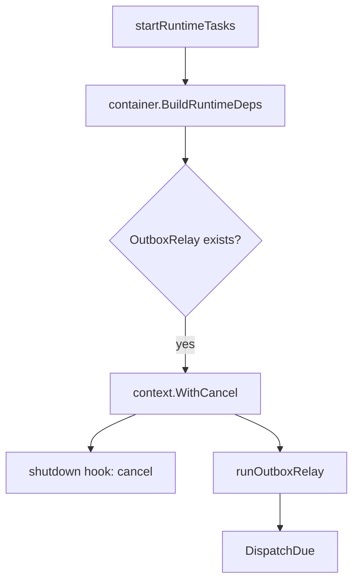

核心源码：

- [../../internal/apiserver/process/shutdown_lifecycle.go](../../internal/apiserver/process/shutdown_lifecycle.go)
- [../../internal/apiserver/container/runtime_deps.go](../../internal/apiserver/container/runtime_deps.go)

---

## 17. OutboxStatusSnapshot

Outbox store 实现了 `outbox.StatusReader`。

它可以读取未完成状态：

```text
pending
failed
publishing
```

并返回每个状态的：

| 字段 | 含义 |
| --- | --- |
| `count` | 当前状态数量 |
| `oldest_created_at` | 最老未完成事件创建时间 |
| `oldest_age_seconds` | 最老未完成事件 age |

这适合 debug/cache governance 或运维面观测：

```text
是否有大量 pending
failed 是否堆积
publishing 是否卡住
最老事件滞留多久
```

注意：  
这个 snapshot 是诊断视图，不会主动修复 outbox。修复仍依赖 relay claim/retry 或人工排查。

核心源码：

- [../../internal/apiserver/infra/mysql/eventoutbox/store.go](../../internal/apiserver/infra/mysql/eventoutbox/store.go)
- [../../pkg/outboxcore/core.go](../../pkg/outboxcore/core.go)
- [../../pkg/outbox/outbox.go](../../pkg/outbox/outbox.go)

---

## 18. Runtime reload、PolicyVersion 与 Outbox Event 的区别

这三个机制经常被混淆。

| 机制 | 解决什么 | 同步/异步 | 失败影响 |
| --- | --- | --- | --- |
| `PolicyVersions.Increment` | 记录 tenant 授权事实版本 | 同事务同步 | 失败则事务回滚 |
| `StagePolicyVersionChanged` | 持久化跨系统变化通知 | 同事务同步入库 | 失败则事务回滚 |
| `ReloadRuntimePolicy` | 刷新本进程 Casbin runtime | 事务后 best-effort | 失败不回滚 DB |
| `OutboxRelay` | 把持久化事件投递到 EventBus | 异步 | 失败后 retry |

它们的关系是：

```text
DB facts 是授权事实源
PolicyVersion 是版本标记
Outbox event 是跨系统通知
Runtime reload 是本进程刷新
Relay 是异步投递器
```

### 为什么有了 runtime reload 还要 outbox

runtime reload 只影响当前 IAM 进程。  
外部服务、其他 IAM 实例、SDK cache、policy sync worker 不会因为当前进程 reload 自动知道授权变化。

所以需要 outbox event 通知其他系统。

### 为什么有了 outbox 还要 runtime reload

outbox event 是异步的。  
当前进程的 PDP Check 不能等外部事件传播后再生效。  
所以事务提交后要立即 reload 当前 runtime policy。

---

## 19. 端到端链路示例：GrantPermission

```text
POST /api/v2/authz/policies
  -> PolicyHandler.AddPermission
  -> PolicyCommandService.AddPermission
  -> PolicyAdministration.GrantPermissionToRole
  -> PolicyChangeCommitter.Commit
      -> tx.AuthorizationFacts.AddPermission
      -> tx.PolicyVersions.Increment
      -> tx.Events.Stage(iam.authz.version_changed)
  -> commit
  -> ReloadRuntimePolicy
  -> OutboxRelay.DispatchDue
      -> ClaimDueEvents
      -> PublishMessage(topic=iam.authz.version)
      -> MarkEventPublished
```

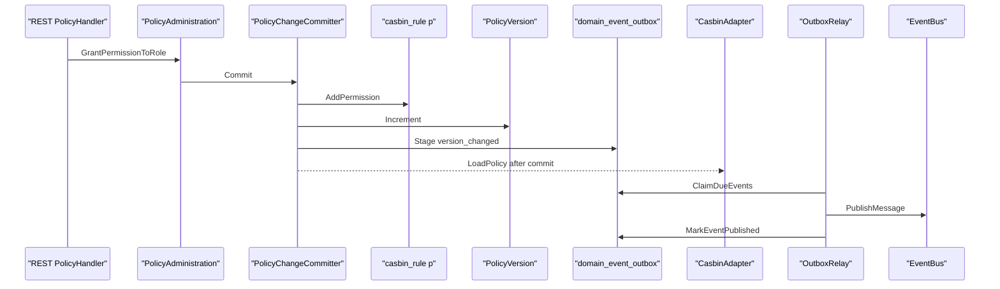

---

## 20. 端到端链路示例：BindRole

```text
POST /api/v2/authz/assignments/grant
  -> RoleBindingHandler.GrantRoleBinding
  -> RoleBindingCommandService.Grant
  -> PolicyAdministration.BindRoleToSubject
  -> PolicyChangeCommitter.Commit
      -> BeforeFacts: tx.Bindings.Create
      -> tx.AuthorizationFacts.AddRoleBinding
      -> tx.PolicyVersions.Increment
      -> tx.Events.Stage(iam.authz.version_changed)
  -> commit
  -> ReloadRuntimePolicy
  -> OutboxRelay publish version event
```

这里的重点是：

```text
Binding 管理记录
Casbin g fact
PolicyVersion
Outbox event
```

都在同一个 UoW transaction 内完成。

---

## 21. 失败边界

| 阶段 | 失败点 | 当前行为 |
| --- | --- | --- |
| StagePolicyVersionChanged | version nil | no-op |
| StagePolicyVersionChanged | stager nil | 返回错误，UoW 回滚 |
| Store.Stage | 没有 active tx | 返回错误，UoW 回滚 |
| BuildRecords | event 不在 catalog | 返回错误，UoW 回滚 |
| BuildRecords | event delivery 不是 durable_outbox | 返回错误，UoW 回滚 |
| Insert outbox row | event_id 重复或 DB 错误 | 返回错误，UoW 回滚 |
| Runtime reload | LoadPolicy 失败 | 重试 3 次，记录 degraded，不回滚 |
| Relay startup | EventBus nil | relay 不创建或 DispatchDue degraded |
| Relay dispatch | publisher nil | 不 claim，记录 degraded |
| ClaimDueEvents | DB 错误 | DispatchDue 返回错误，下一轮继续 |
| PublishMessage | MQ 错误 | MarkEventFailed，设置 nextAttemptAt |
| MarkEventPublished | DB 错误 | 可能重复投递，下游需幂等 |
| MarkEventFailed | DB 错误 | 记录 mark failed，下一轮可能因 publishing stale 被 reclaim |
| Process shutdown | relay 正在运行 | lifecycle hook cancel context |

---

## 22. Outbox 能保证什么，不能保证什么

### 22.1 能保证

| 能力 | 说明 |
| --- | --- |
| 业务事实与事件记录同事务 | facts、version、outbox row 一起提交或回滚 |
| EventBus 不可用时事件不丢 | 事件先落 DB，relay 不 claim |
| 发布失败可重试 | failed + next_attempt_at |
| relay 崩溃可恢复 | stale publishing 可重新 claim |
| 多 relay 降低重复 claim | `FOR UPDATE SKIP LOCKED` |
| 下游可识别事件身份 | event_id、event_type、aggregate_id、payload |

### 22.2 不能保证

| 不保证 | 原因 |
| --- | --- |
| exactly-once delivery | publish 成功但 mark published 失败会重复投递 |
| 下游一定处理成功 | outbox 只保证发布到 EventBus，不保证 consumer 成功处理 |
| 事件立即到达 | relay 是异步轮询 |
| runtime reload 成功 | reload 是事务后 best-effort |
| 顺序绝对全局一致 | outbox 按 created_at claim，但跨实例/重试/下游处理仍需版本判断 |

### 22.3 下游消费者必须幂等

对 `iam.authz.version_changed`，推荐幂等键：

```text
event_id
```

或者业务幂等键：

```text
tenant_id + version
```

消费者应只处理大于本地已处理版本的事件。

---

## 23. 常见误区

### 误区一：Outbox 就是 MQ

不对。  
Outbox 是数据库中的 durable event table；MQ 是 relay 后面的投递目标。

### 误区二：事件 stage 就等于事件已经发布

不对。  
Stage 只是写入 `domain_event_outbox`。真正发布由 relay 异步完成。

### 误区三：EventBus 不可用会导致授权写入失败

不一定。  
授权写入依赖的是 outbox store/stager。EventBus 不可用时，outbox row 仍可入库，只是 relay 不投递。

### 误区四：runtime reload 成功就不需要 outbox

不对。  
reload 只影响当前进程；outbox event 用于通知其他系统或其他实例。

### 误区五：outbox 发布成功就代表下游已处理

不对。  
relay 只知道消息发布到 EventBus 成功，不知道 consumer 是否完成处理。

### 误区六：outbox 保证 exactly once

不对。  
当前是 at-least-once。下游必须幂等。

### 误区七：best_effort 事件也能随便 stage 到 outbox

不对。  
`outboxcore.BuildRecords` 会检查 delivery class。非 `durable_outbox` 事件不能 stage 到 outbox。

---

## 24. 当前边界与待讨论点

### 24.1 EventStager 是 AuthZ 写入的必要依赖

`StagePolicyVersionChanged` 在 stager nil 时返回错误。  
这意味着如果 container 没有成功创建 outboxStore，AuthZ 写入会失败。这个选择偏安全：宁愿不提交授权变更，也不提交“无法通知”的授权变更。

### 24.2 OutboxRelay 只有 EventBus 存在时才创建

如果 MySQL 存在但 EventBus 不存在：

```text
outboxStore exists
outboxRelay nil
```

事件可以累积在 outbox 中。EventBus 恢复后需要确保 relay 被创建并运行，才能继续投递历史事件。

### 24.3 Outbox 状态需要运维观测

如果 pending/failed 长期堆积，说明 relay 或 EventBus 有问题。  
`OutboxStatusSnapshot` 可以作为后续 debug/health/metrics 的基础。

### 24.4 下游应该按 version 拉取最新授权

版本事件不包含全量授权数据。  
下游收到事件后，应根据 `tenant_id/version` 决定是否拉取 snapshot 或刷新本地 policy cache。

---

## 25. 设计模式

| 模式 | 为什么用 | IAM 落地 | 代价和边界 |
| --- | --- | --- | --- |
| Transactional Outbox | DB 事实与 MQ 发布无法原子提交 | UoW 内 Stage outbox row | 需要 relay 和状态管理 |
| Versioned Invalidation | 下游不需要每次接收全量权限 | `PolicyVersion` + `version_changed` | 下游需主动刷新或拉取 |
| Durable vs BestEffort Catalog | 不同事件可靠性要求不同 | events.yaml delivery class | 配置错误会导致 stage/publish 失败 |
| Polling Relay | 简单可靠地投递 DB 事件 | `runOutboxRelay` 周期 DispatchDue | 存在轮询延迟 |
| At-least-once Delivery | 发布与 mark 无法原子 | mark failed/published + retry | consumer 必须幂等 |
| Stale Publishing Recovery | relay 崩溃不能卡死事件 | stale publishing 重新 claim | 可能重复投递 |
| Runtime Reload + Event Propagation | 本进程和外部系统都要感知变化 | commit 后 reload + outbox event | 两者失败边界不同 |

---

## 26. 推荐源码阅读路线

### 第一轮：版本事件入口

```text
internal/apiserver/application/authz/policy/committer.go
internal/apiserver/application/authz/shared/version_event.go
internal/apiserver/domain/authz/policy/events.go
internal/apiserver/domain/authz/policy/policy_version.go
```

目标：看清 policy version 如何变成 domain event。

### 第二轮：Event 接口和事件目录

```text
pkg/event/event.go
configs/events.yaml
pkg/eventcatalog/catalog.go
pkg/eventcatalog/config.go
pkg/eventruntime/publisher.go
```

目标：看清 Stager / Publisher、delivery class、topic mapping。

### 第三轮：Outbox store

```text
internal/apiserver/infra/mysql/eventoutbox/store.go
pkg/outboxcore/core.go
pkg/outbox/outbox.go
```

目标：看清 Stage、BuildRecords、OutboxPO、ClaimDueEvents、MarkEventPublished/Failed。

### 第四轮：Container 装配

```text
internal/apiserver/container/container.go
internal/apiserver/container/module_graph.go
internal/apiserver/container/runtime_deps.go
internal/apiserver/container/assembler/authz.go
```

目标：看清 outboxStore 如何进入 AuthZ UoW，outboxRelay 如何暴露给 runtime。

### 第五轮：Relay 和运行时

```text
internal/apiserver/infra/messaging/outbox_relay.go
internal/apiserver/process/shutdown_lifecycle.go
internal/apiserver/options/runtime_options.go
```

目标：看清 relay dispatch、batch size、retry delay、interval、shutdown cancel。

### 第六轮：测试

```text
internal/apiserver/application/authz/policy/committer_test.go
internal/apiserver/infra/mysql/eventoutbox/store_test.go
internal/apiserver/container/eventing_test.go
pkg/outboxcore/core_test.go
pkg/eventcatalog/config_test.go
```

目标：看清 event staging、durable delivery class、EventBus unavailable、outbox state transitions 的测试保护。

---

## 27. 验证建议

```bash
go test ./internal/apiserver/application/authz/policy \
  ./internal/apiserver/infra/mysql/eventoutbox \
  ./internal/apiserver/infra/messaging \
  ./internal/apiserver/container \
  ./pkg/outboxcore \
  ./pkg/eventcatalog \
  ./pkg/eventruntime

make docs-hygiene
```

建议重点测试方向：

| 测试方向 | 目的 |
| --- | --- |
| StagePolicyVersionChanged | version nil no-op，stager nil error |
| Event catalog durable_outbox | `iam.authz.version_changed` 必须为 durable_outbox |
| Store.Stage requires tx | 无 active tx 时失败 |
| BuildRecords | 未注册事件 / 非 durable_outbox 事件不能 stage |
| Outbox row initial state | pending、attempt_count=0、next_attempt_at=now |
| ClaimDueEvents | pending/failed due、stale publishing 可 claim |
| ClaimDueEvents concurrency | 非 sqlite 使用 SKIP LOCKED |
| Publish success | MarkEventPublished |
| Publish failure | MarkEventFailed + nextAttemptAt |
| EventBus unavailable | relay 不 claim，rows 保留 |
| Mark published failure | 允许重复投递，consumer 幂等 |
| Runtime options | interval、batch size、retry delay 生效 |
| Shutdown | stop outbox relay hook cancel context |

---

## 本文总结

授权版本事件与 Outbox 的核心可以压缩成一句话：

> AuthZ policy 变更在同一个 UoW 事务内写入授权事实、递增版本并 stage durable outbox 事件；事务提交后本进程 runtime 尽力 reload，后台 relay 再把 outbox 事件异步发布到 EventBus。

核心链路是：

```text
PolicyChange
  -> AuthorizationFacts
  -> PolicyVersion
  -> VersionChangedEvent
  -> domain_event_outbox
  -> OutboxRelay
  -> EventBus
```

这套设计解决的是：

```text
授权事实不能丢
授权变化要能跨系统传播
EventBus 不可用时事件不能丢
relay 崩溃后事件要能恢复
下游缓存要能按 version 失效
```

同时也要明确：

```text
outbox 是 at-least-once，不是 exactly-once
下游消费者必须幂等
runtime reload 和 outbox event 是两个不同机制
```

至此，AuthZ 四篇核心文档的主线完整闭合：

```text
授权模型
  -> 授权判定
  -> 授权写入事务
  -> 授权版本事件传播
```
