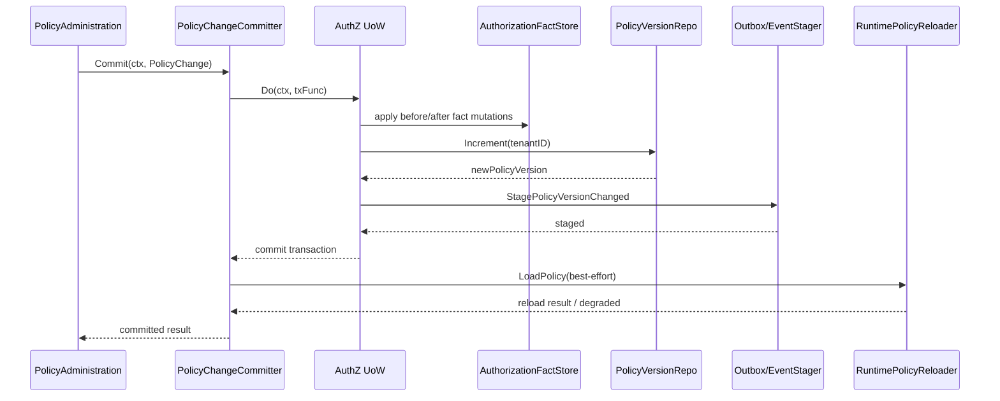

# 05-PolicyChangeCommitter 与 AuthZ UoW

## 1. 本文定位

本文是 `03-授权AuthZ/` 文档组中关于 **授权写入提交链路** 的文档。

上一篇《04-授权写入链路-PolicyAdministration与PolicyChange》已经解释了授权写入的前半段：

```text
Application Command
  -> PolicyAdministration
  -> AuthorizationPolicy
  -> PolicyChange
```

上一篇重点回答：

```text
如何把 Grant / Revoke / Bind / Unbind 转化为 PolicyChange？
```

本文继续回答：

```text
PolicyChange 生成之后，如何被安全提交？
```

也就是：

```text
如何在事务内写入授权事实？
如何同时维护管理面记录和运行时 facts？
如何递增 PolicyVersion？
如何 stage Outbox event？
提交后如何刷新 runtime policy？
为什么这些动作必须由统一提交器完成？
```

本文重点讲：

```text
PolicyChangeCommitter
AuthZ UoW
AuthorizationFacts
PolicyVersion
Outbox staging
RuntimeReload
```

Casbin matcher 细节会放到：

```text
06-Casbin运行时模型-pgFacts与四段Matcher.md
```

PolicyVersion 与 Outbox 的传播机制会在下一篇进一步展开：

```text
07-PolicyVersion-Outbox与RuntimeReload.md
```

---

## 2. 30 秒结论

`PolicyChangeCommitter` 是 AuthZ 写入链路的统一提交器。

它接收上一篇生成的：

```text
PolicyChange
```

然后在 UoW 事务边界内完成：

```text
管理面记录变更
Permission / RoleBinding facts 写入或删除
PolicyVersion 递增
version_changed event staging
```

事务提交成功后，再执行：

```text
本实例 RuntimeReload
```

核心链路是：

```text
PolicyChange
  -> PolicyChangeCommitter
  -> AuthZ UoW Transaction
  -> AuthorizationFacts
  -> PolicyVersion increment
  -> Outbox stage version_changed
  -> Commit Transaction
  -> Best-effort RuntimeReload
```

一句话：

> PolicyChangeCommitter 的职责不是生成授权变更，而是把已经生成的 PolicyChange 以事务化、版本化、事件化的方式安全落地，并在提交后尽力刷新本实例 runtime policy。

---

## 3. 为什么需要 PolicyChangeCommitter

如果没有统一的提交器，授权写入很容易变成多个服务各自修改一部分事实：

```text
某个 handler 直接 insert role_bindings
某个 service 直接 insert casbin_rule
另一个地方单独递增 policy_version
还有一个地方尝试 reload runtime policy
```

这种设计会导致严重问题：

```text
管理面记录和运行时 facts 不一致
PolicyVersion 没有递增或递增错乱
Outbox event 丢失
runtime policy 未刷新
重复写入导致脏数据
撤销失败导致幽灵权限
审计 actor / reason 丢失
```

AuthZ 写入是安全敏感操作。

它必须具备：

```text
原子性
可审计性
可版本化
可传播性
可恢复性
```

因此，所有 PolicyChange 必须统一交给：

```text
PolicyChangeCommitter
```

由它把授权变更安全提交。

---

## 4. 提交链路总览

### 4.1 提交链路图



---

### 4.2 提交链路分两段

PolicyChangeCommitter 的动作可以分成两段。

第一段是事务内动作：

```text
应用管理面 mutation
写入 / 删除授权 facts
递增 PolicyVersion
stage Outbox event
```

第二段是事务后动作：

```text
本实例 runtime policy reload
```

为什么要分两段？

因为：

```text
数据库事务只能保证数据库内事实一致
RuntimeReload 是进程内缓存刷新，不应放进数据库事务中
```

如果 reload 失败，不应该回滚已经提交的授权事实。

正确做法是：

```text
事务事实成功提交
reload 失败时标记 runtime degraded
依赖后续重试 / outbox-driven reload / 运维告警修复
```

---

## 5. PolicyChangeCommitter 的职责边界

### 5.1 它负责什么

PolicyChangeCommitter 负责：

```text
接收 PolicyChange
开启 AuthZ UoW 事务
执行管理面记录 mutation
执行 authorization facts mutation
递增 PolicyVersion
stage version_changed event
提交事务
提交后触发 runtime policy reload
返回提交结果
```

也就是说，它负责把变更计划落地。

---

### 5.2 它不负责什么

PolicyChangeCommitter 不负责：

```text
解析 REST / gRPC 请求
构造 AddPermissionCommand / GrantCommand
加载 Role / Resource / Subject 上下文
判断 Resource 是否支持 Action
判断 ScopeKind 是否被 Resource 支持
决定这次变更应该添加哪些 facts
```

这些职责属于：

```text
Transport
Application Command
PolicyAdministration
AuthorizationPolicy
```

PolicyChangeCommitter 只接受已经构造好的 PolicyChange。

---

### 5.3 为什么不能让 Committer 生成 PolicyChange

如果 Committer 同时负责生成和提交 PolicyChange，会导致：

```text
领域规则和事务提交混在一起
Committer 需要加载大量上下文
难以单独测试 AuthorizationPolicy
难以复用 PolicyChange 作为统一变更计划
提交器职责膨胀
```

因此当前分工是：

```text
AuthorizationPolicy 生成 PolicyChange。
PolicyChangeCommitter 提交 PolicyChange。
```

这个边界必须保持。

---

## 6. AuthZ UoW：授权写入事务边界

### 6.1 UoW 是什么

UoW 是 Unit of Work。

在 AuthZ 中，UoW 负责把一次授权写入涉及的多个 repository 操作放进同一个数据库事务中。

它回答：

```text
这次授权写入需要哪些仓储在同一个事务里协作？
```

一次授权写入可能涉及：

```text
role repository
resource repository
rolebinding repository
authorization fact store
policy version repository
outbox event stager
```

UoW 的价值是：

```text
要么这些数据库事实一起成功
要么一起回滚
```

---

### 6.2 AuthZ UoW 管什么

AuthZ UoW 通常需要暴露这些能力：

```text
Roles
Resources
RoleBindings
AuthorizationFacts
PolicyVersions
Events
Users / SubjectResolver 所需仓储
```

不同写入用例使用不同仓储。

例如 GrantPermission 需要：

```text
Role repository
Resource repository
AuthorizationFactStore
PolicyVersion repository
Outbox stager
```

BindRole 需要：

```text
Role repository
RoleBinding repository
SubjectResolver 相关仓储
AuthorizationFactStore
PolicyVersion repository
Outbox stager
```

这些必须在同一个事务上下文中协作。

---

### 6.3 为什么不能每个 repository 自己开事务

如果每个 repository 自己开事务，会出现：

```text
Binding 记录写入成功，但 g fact 写入失败
p fact 写入成功，但 PolicyVersion 递增失败
PolicyVersion 递增成功，但 Outbox event 没有 stage
Outbox event stage 成功，但 facts 回滚
```

这些都是危险状态。

授权系统不能接受这类部分成功。

因此：

```text
授权写入必须由 UoW 统一管理事务。
```

---

## 7. AuthorizationFacts：运行时授权事实

### 7.1 AuthorizationFacts 是什么

AuthorizationFacts 是读链路和 runtime policy 需要消费的授权事实。

主要包括两类：

```text
Permission facts
RoleBinding facts
```

领域层分别对应：

```text
Permission
RoleBinding
```

运行时通常映射为：

```text
Casbin p facts
Casbin g facts
```

---

### 7.2 Permission fact

Permission fact 表示：

```text
某个 Role 在某个 Tenant 下，拥有某个 ResourcePattern / ActionPattern / Scope 能力。
```

领域语义是：

```text
Permission(
  RoleName,
  TenantID,
  ResourcePattern,
  ActionPattern,
  Scope,
)
```

运行时表示类似：

```text
p, role:<roleName>, tenantID, resourcePattern, actionPattern, scope
```

它会被 Check 链路消费，用于回答：

```text
Role 是否拥有目标资源动作范围？
```

---

### 7.3 RoleBinding fact

RoleBinding fact 表示：

```text
某个 Subject 在某个 Tenant 下持有某个 Role。
```

领域语义是：

```text
RoleBinding(
  Subject,
  RoleName,
  TenantID,
)
```

运行时表示类似：

```text
g, subject, role:<roleName>, tenantID
```

它会被 Check 链路消费，用于回答：

```text
Subject 是否拥有某个 Role？
```

---

### 7.4 Facts 与管理面记录的区别

不要混淆：

```text
管理面记录
运行时 facts
```

| 类型 | 主要用途 |
| --- | --- |
| 管理面记录 | 查询、展示、按 ID 撤销、审计 |
| 运行时 facts | Check / Snapshot / Casbin runtime 判定 |

例如 RoleBinding 写入可能同时产生：

```text
role_bindings 管理记录
g fact 运行时授权事实
```

它们都重要。

只写其中一个都会导致系统不一致。

---

## 8. PolicyVersion：授权事实版本

### 8.1 PolicyVersion 是什么

PolicyVersion 是某个 Tenant 下授权事实的版本号。

它回答：

```text
当前 Tenant 的授权策略变更到了第几个版本？
```

每次授权写入成功后，都应该递增该 Tenant 的 PolicyVersion。

例如：

```text
tenant-a policy version = 17
GrantPermission 成功
tenant-a policy version = 18
```

---

### 8.2 为什么需要 PolicyVersion

PolicyVersion 有几个作用：

```text
Check 返回时携带版本，方便排查判定基于哪个版本
Snapshot 返回时携带版本，方便 SDK / 调用方缓存
Outbox event 携带版本，方便其他实例感知策略变化
RuntimeHealth 可以对比 last_event_version 与 last_reload_version
PolicyLinter / 治理工具可以定位策略状态
```

没有版本号，授权系统很难判断：

```text
当前 runtime policy 是否最新？
调用方缓存是否过期？
某次拒绝是发生在权限变更前还是后？
```

---

### 8.3 PolicyVersion 递增必须在事务内

PolicyVersion 必须和 facts 变更在同一个事务内完成。

否则会出现：

```text
facts 已变更，但 version 未变
version 已递增，但 facts 未变更
outbox event 中的 version 与 facts 不一致
```

这些都会破坏读链路和事件传播。

因此，PolicyChangeCommitter 应该在 UoW 事务中完成：

```text
facts mutation
PolicyVersion increment
version_changed event staging
```

---

### 8.4 PolicyVersion 的并发要求

同一个 Tenant 下可能同时发生多个授权写入。

例如：

```text
管理员 A 给 user:1001 绑定 role
管理员 B 同时给 role 添加 permission
```

这两个操作都要递增同一个 Tenant 的 PolicyVersion。

因此 PolicyVersion 递增需要考虑并发安全：

```text
行级锁
唯一约束
retry
事务隔离
```

目标是：

```text
同一个 Tenant 下版本单调递增
不出现重复版本
不把 duplicate 泄漏给上层业务
```

---

## 9. Outbox staging：版本事件进入事务

### 9.1 为什么需要 Outbox

授权事实变更后，其他系统或其他 apiserver 实例需要知道：

```text
某个 Tenant 的授权策略已经变化
新的 PolicyVersion 是多少
应该刷新 runtime policy 或缓存
```

如果在事务提交后直接发消息，可能出现：

```text
DB commit 成功，但发消息失败
消息发出成功，但 DB commit 失败
```

这会导致消息和数据库事实不一致。

Transactional Outbox 的做法是：

```text
在同一个数据库事务中写业务事实和 outbox event
事务提交后由 outbox relay 异步发布事件
```

---

### 9.2 version_changed event 表达什么

AuthZ 写入成功后，应该 stage 一个版本变更事件。

它通常包含：

```text
tenant_id
policy_version
change_kind
occurred_at
```

语义是：

```text
某个 tenant 的授权策略已经变更为指定版本。
```

这个事件不是权限明细。

它是缓存失效和 runtime reload 的信号。

---

### 9.3 为什么 Outbox staging 要在事务内

如果 event 不在事务内 stage，会出现：

```text
facts 写入成功，但没有事件通知其他实例
事件发出，但 facts 回滚，其他实例 reload 了不存在的版本
```

因此，PolicyChangeCommitter 必须在 UoW 事务中执行：

```text
StagePolicyVersionChanged
```

并保证它和 facts / PolicyVersion 同事务提交。

---

## 10. RuntimeReload：事务后的 best-effort 动作

### 10.1 RuntimeReload 是什么

RuntimeReload 是将数据库中的授权 facts 重新加载到本实例 runtime policy 中。

在当前系统中，runtime policy 通常由 Casbin enforcer 持有。

授权写入提交后，需要让当前进程尽快看到最新策略。

因此会执行：

```text
LoadPolicy
```

或等价的 runtime reload 动作。

---

### 10.2 为什么 RuntimeReload 不在事务内

RuntimeReload 是进程内缓存刷新。

它不属于数据库事务。

如果把 reload 放到事务内，会有几个问题：

```text
事务时间变长
runtime reload 失败会影响数据库事务
reload 读取未提交数据的语义不清晰
多实例 reload 本来就不能靠本地事务保证
```

因此，正确设计是：

```text
事务内提交 facts / version / outbox
事务提交后 best-effort reload 本实例 runtime
```

---

### 10.3 reload 失败怎么办

如果事务提交成功，但 reload 失败，不能回滚授权事实。

因为数据库事实已经提交。

更合理的处理方式是：

```text
记录 reload 失败
标记 runtime degraded
暴露 RuntimeHealthDetails
依赖后续重试或 outbox-driven reload 修复
```

这意味着可能短暂出现：

```text
DB facts 已更新
PolicyVersion 已递增
当前实例 runtime 仍是旧策略
```

这属于最终一致性窗口。

后续多实例生产化需要依靠：

```text
Outbox event consumer
RuntimePolicyReloadHandler
reload_lag metrics
health check
```

来治理。

---

## 11. PolicyChangeCommitter 的执行阶段

### 11.1 阶段一：校验 PolicyChange

Committer 首先应该确认：

```text
PolicyChange 不为空
TenantID 合法
ChangeKind 合法
Actor 合法
facts mutation 合法
```

这些校验不应该替代 AuthorizationPolicy 的领域规则。

它只是提交前的防御性检查。

---

### 11.2 阶段二：执行 management mutations

某些 PolicyChange 会包含管理面记录 mutation。

例如 BindRole 需要：

```text
新增 Binding 管理记录
```

UnbindRole 可能需要：

```text
删除 Binding 管理记录
或标记 Binding revoked
```

这些 mutation 必须和 runtime facts 同事务。

否则会出现管理面看到的数据和判定事实不一致。

---

### 11.3 阶段三：执行 facts mutations

Committer 根据 PolicyChange 写入或删除：

```text
Permission facts
RoleBinding facts
```

对应运行时事实：

```text
p facts
g facts
```

必须保证：

```text
新增 facts 不重复或具备幂等性
删除 facts 的语义明确
错误时事务回滚
```

---

### 11.4 阶段四：递增 PolicyVersion

facts 变更完成后，在同一事务中递增：

```text
PolicyVersion
```

并得到新版本号。

新版本号后续用于：

```text
CheckResponse
AuthorizationSnapshot
Outbox event
RuntimeHealthDetails
```

---

### 11.5 阶段五：stage Outbox event

得到新 PolicyVersion 后，在同一事务中 stage：

```text
AuthZ policy version changed event
```

事件语义是：

```text
tenant 的授权策略已经变更到 version N
```

它为跨实例 reload 和缓存失效提供信号。

---

### 11.6 阶段六：提交事务

UoW 提交后，数据库中的授权事实、版本和 outbox event 才成为事实源。

如果提交失败，前面的操作全部回滚。

---

### 11.7 阶段七：事务后 RuntimeReload

事务提交成功后，Committer 执行本实例 reload。

它是 best-effort。

成功后，本实例 Check / Snapshot 可以尽快看到最新策略。

失败后，不能回滚事务，只能进入 degraded 状态并等待后续治理。

---

## 12. 幂等性与重复提交

### 12.1 为什么需要幂等性

授权写入可能因为网络超时、客户端重试、任务重放而重复提交。

常见重复场景：

```text
重复 GrantPermission
重复 RevokePermission
重复 BindRole
重复 UnbindRole
Outbox relay 重试
RuntimeReload 重试
```

如果没有幂等性，可能出现：

```text
重复 facts
重复版本递增
重复事件
重复管理记录
```

---

### 12.2 facts 层幂等

Permission fact 和 RoleBinding fact 应该具备唯一约束或等价幂等保护。

例如：

```text
同一个 role / tenant / resource / action / scope 不能重复插入相同 Permission fact
同一个 subject / role / tenant 不能重复插入相同 RoleBinding fact
```

重复插入时，可以根据业务语义：

```text
视为成功
或返回 already_exists
```

但不能导致重复运行时事实。

---

### 12.3 version 层幂等

PolicyVersion 通常在每次有效变更时递增。

如果一次重复请求没有产生实际事实变化，是否递增版本，需要明确。

常见选择：

```text
只有事实发生变化才递增
重复请求视为 no-op，不递增
重复请求仍记录一次操作，递增版本
```

更推荐第一种：

```text
只有授权事实实际变化时才递增 PolicyVersion。
```

但最终要以当前实现和测试为准。

---

## 13. 错误处理边界

### 13.1 事务内错误

事务内错误包括：

```text
management mutation 失败
facts mutation 失败
PolicyVersion 递增失败
Outbox staging 失败
```

这些错误应该导致：

```text
整个 UoW 事务回滚
PolicyChange 提交失败
上层返回错误
```

因为此时授权事实尚未可靠提交。

---

### 13.2 事务后 reload 错误

RuntimeReload 错误发生在事务提交之后。

此时：

```text
facts 已提交
PolicyVersion 已递增
Outbox event 已 stage
```

因此 reload 错误不应该导致：

```text
数据库回滚
PolicyVersion 回退
Outbox event 删除
```

它应该导致：

```text
runtime health degraded
日志和指标记录
后续重试或事件驱动 reload
```

---

### 13.3 系统错误不能伪装成授权拒绝

提交链路出现系统错误时，不能把它伪装成：

```text
allowed = false
```

因为写链路不是授权判定。

写链路失败应该明确返回错误。

---

## 14. 与读链路的一致性关系

读链路依赖写链路产出的事实。

```text
Check 依赖 Permission / RoleBinding facts
Snapshot 依赖 Role / Permission 投影
Check / Snapshot 都依赖 PolicyVersion
```

写链路提交成功后，期望读链路最终看到：

```text
最新 facts
最新 PolicyVersion
最新 runtime policy
```

但存在两个不同层次：

```text
数据库事实一致性
runtime 缓存最终一致性
```

数据库事实一致性由：

```text
AuthZ UoW
```

保证。

runtime 缓存最终一致性由：

```text
RuntimeReload
Outbox-driven reload
health / metrics
```

治理。

---

## 15. 与 PolicyLinter 的关系

PolicyLinter 是只读治理工具。

它读取已有授权 facts，并检查：

```text
missing_resource
unsupported_action
unsupported_scope_kind
invalid_permission_fact
uncheckable_action_pattern
```

如果未来 PolicyLinter 发现问题后需要自动修复，不能直接删除 facts。

必须通过：

```text
PolicyReconciler
  -> PolicyChange
  -> PolicyChangeCommitter
```

也就是说：

```text
所有授权事实修复，都必须回到统一提交链路。
```

这可以保证：

```text
修复动作也有 PolicyVersion
修复动作也有 Outbox event
修复动作也能 RuntimeReload
修复动作也可以审计
```

---

## 16. 常见误区

### 16.1 PolicyChangeCommitter 只是 DAO 包装

错误。

它是授权写入的统一提交器。

它负责事实、版本、事件和 reload 的一致性协调。

---

### 16.2 UoW 只是一层多余封装

错误。

AuthZ 写入涉及多个 repository。

没有 UoW 就很容易出现部分成功。

---

### 16.3 PolicyVersion 可以事务外递增

错误。

PolicyVersion 必须和 facts 变更同事务。

否则版本和事实可能不一致。

---

### 16.4 Outbox event 可以提交后再随便发

错误。

事件必须通过 Transactional Outbox stage 到事务中。

否则数据库事实和消息可能不一致。

---

### 16.5 RuntimeReload 失败要回滚数据库

错误。

RuntimeReload 在事务提交后执行。

失败时应该标记 degraded，而不是回滚事实。

---

### 16.6 直接改 casbin_rule 再 reload 就够了

错误。

这会绕过管理面记录、PolicyVersion、Outbox、审计和 UoW。

---

### 16.7 PolicyLinter 修复问题可以直接删 facts

错误。

自动修复也必须生成 PolicyChange，并通过 Committer 提交。

---

## 17. 代码事实源

本文涉及的主要代码事实源：

```text
internal/apiserver/application/authz/policy
internal/apiserver/application/authz/uow
internal/apiserver/domain/authz/policy
internal/apiserver/domain/authz/permission
internal/apiserver/domain/authz/rolebinding

internal/apiserver/infra/mysql/uow
internal/apiserver/infra/mysql/casbinrule
internal/apiserver/infra/mysql/policy
internal/apiserver/infra/casbin
internal/apiserver/shared/authz
```

重点关注：

| 主题 | 事实源 |
| --- | --- |
| PolicyChangeCommitter | `application/authz/policy` |
| PolicyChange | `domain/authz/policy` |
| AuthZ UoW 接口 | `application/authz/uow` |
| MySQL UoW 实现 | `infra/mysql/uow` |
| AuthorizationFactStore | `infra/mysql/casbinrule` |
| PolicyVersionRepository | `infra/mysql/policy` |
| RuntimePolicyReloader | `infra/casbin` |
| Reload helper / shared logic | `shared/authz` |
| Outbox EventStager | 事件模块 / shared outbox 相关实现 |

如果本文与代码不一致，以代码事实源为准。

---

## 18. 本文总结

本文讲的是 PolicyChange 生成后的提交链路。

核心流程是：

```text
PolicyChange
  -> PolicyChangeCommitter
  -> AuthZ UoW Transaction
  -> AuthorizationFacts mutation
  -> PolicyVersion increment
  -> Outbox event staging
  -> Commit Transaction
  -> RuntimeReload(best-effort)
```

其中：

```text
UoW 保证数据库事实的一致性
PolicyVersion 提供版本感知
Outbox 保证事实与事件同事务
RuntimeReload 让本实例尽快看到新策略
```

如果只记住一句话：

> PolicyChangeCommitter 是 AuthZ 写入链路的统一提交器，它把领域层生成的 PolicyChange 以事务化、版本化、事件化的方式落地，并在提交后尽力刷新 runtime policy；所有授权事实修改和未来修复动作都必须回到这条统一提交链路。
