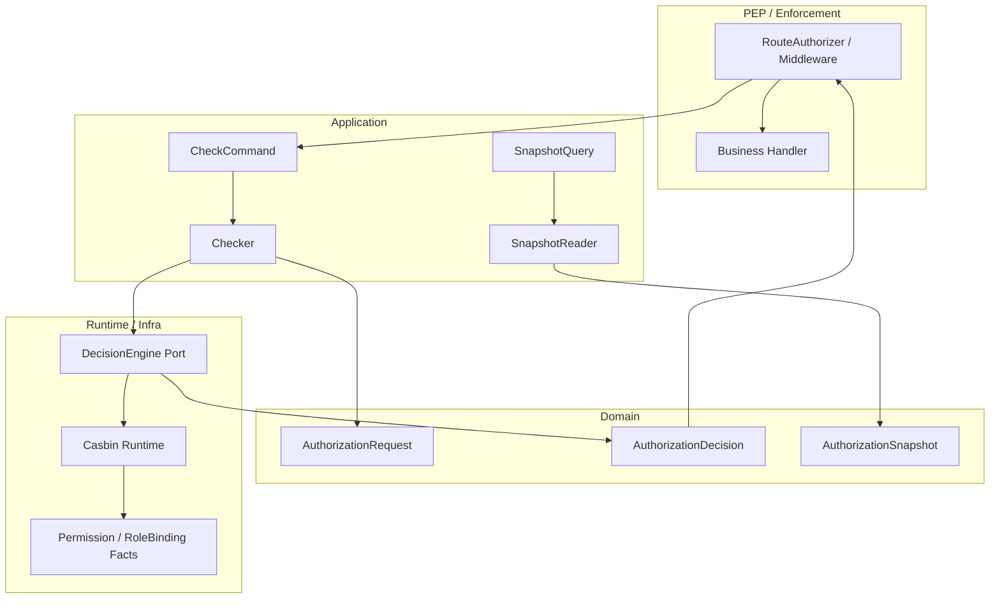
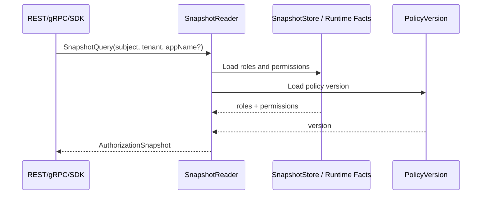

# 05-权限检查链路：Check、Snapshot

## 1. 本文定位

本文是 `03-授权AuthZ/` 文档组中关于 **权限检查读链路** 的文档。

前面几篇文档已经说明：

```text
00-AuthZ模型总览：Subject -> RoleBinding -> Role -> Permission -> Resource / Action / Scope
01-资源模型：ResourceKey / ResourcePattern / Action / ActionPattern / Scope
02-角色模型：Role / RoleBinding / Subject
03-授权写入链路：PolicyAdministration / PolicyChange / PolicyChangeCommitter
04-授权版本与事件传播链路：PolicyVersion / Outbox / RuntimeReload
```

本文开始说明 AuthZ 的读链路。

AuthZ 读链路主要有两类：

```text
Check：判断一次访问请求是否允许。
Snapshot：读取某个 Subject 当前的授权视图。
```

本文要回答：

```text
Check 和 Snapshot 分别解决什么问题？
RouteAuthorizer、Checker、DecisionEngine 的边界是什么？
PEP / PDP 如何分工？
CheckCommand 如何从 Transport 进入 Application？
AuthorizationRequest 如何表达领域判定请求？
DecisionEngine 如何屏蔽 Casbin Runtime？
AuthorizationDecision 为什么不应该只是 bool？
Snapshot 与 Check 有什么区别？
PolicyVersion 在读链路中起什么作用？
Check / Snapshot 与 RuntimeReload 的一致性边界是什么？
为什么业务代码不应该直接调用 Casbin Enforce？
```

本文不展开 Casbin p/g facts 和四段 matcher 的实现细节。

这些内容放到：

```text
06-Casbin运行时模型-pgFacts与四段Matcher.md
```

---

## 2. 30 秒结论

AuthZ 读链路分为两类：

```text
Check     权威判定：这次请求是否允许？
Snapshot  授权视图：这个 Subject 当前拥有哪些角色和权限？
```

Check 主线是：

```text
REST / gRPC / SDK / RouteAuthorizer
  -> CheckCommand
  -> Checker
  -> AuthorizationRequest
  -> DecisionEngine
  -> Casbin Runtime
  -> AuthorizationDecision
```

Snapshot 主线是：

```text
REST / gRPC / SDK
  -> SnapshotQuery
  -> SnapshotReader
  -> AuthorizationSnapshot
```

核心边界：

```text
Check 是授权判定，不是授权事实展示。
Snapshot 是授权视图，不是访问判定替代品。
Check / Snapshot 是读链路，不应该主动修改 runtime。
Check / Snapshot 应返回 PolicyVersion，便于判断判定或快照基于哪个授权版本。
Casbin 是 infra runtime，不是业务 Handler 的直接依赖。
```

一句话：

> Check 回答“这次请求能不能过”，Snapshot 回答“这个主体当前有哪些授权事实”；读链路只消费当前授权 facts 和 runtime version，不负责写入、传播或 reload。

---

## 3. 为什么需要 Check 和 Snapshot 两条读链路

### 3.1 Check 解决判定问题

Check 面向访问控制。

它回答：

```text
Subject 在某个 Tenant 下，能不能对某个 Resource 执行某个 Action，并且满足某个 Scope？
```

例如：

```text
user:1001 在 tenant-a 下，能否 read iam:identity:user:*，scope=all:*？
```

Check 的结果应该直接用于：

```text
allow
reject
```

因此 Check 是权威判定链路。

---

### 3.2 Snapshot 解决展示问题

Snapshot 面向查询和展示。

它回答：

```text
Subject 当前在某个 Tenant 下拥有哪些 Role？
这些 Role 带来了哪些 Permission？
这些授权事实属于哪个 PolicyVersion？
```

例如：

```text
user:1001 在 tenant-a 下拥有：
- role: iam:admin
- permissions: iam:identity:user:* read|update all:*
- policy_version: 17
```

Snapshot 常用于：

```text
权限管理后台；
SDK 查询当前主体权限；
调试授权问题；
展示用户当前角色；
判断缓存是否过期。
```

---

### 3.3 Snapshot 不能替代 Check

Snapshot 展示的是授权事实视图。

它不应该被业务代码用来替代实时判定。

错误方式：

```text
snapshot := GetSnapshot(user)
if snapshot contains role admin {
    allow
}
```

正确方式：

```text
decision := Check(subject, tenant, resource, action, scope)
if decision.Allowed {
    allow
}
```

原因是：

```text
Snapshot 可能是展示视图；
Snapshot 可能被缓存；
Snapshot 不一定包含 matcher 的全部语义；
Snapshot 不一定表达本次请求的具体 ObjectScope；
Check 才是权威访问判定。
```

---

## 4. 读链路总览



这张图表达：

```text
RouteAuthorizer 是执行点；
Checker 是 Check 用例编排器；
DecisionEngine 是判定端口；
Casbin Runtime 是 infra 实现；
SnapshotReader 是授权视图读取器。
```

---

## 5. PEP / PDP 边界

### 5.1 PEP 是什么

PEP 是 Policy Enforcement Point，策略执行点。

它负责：

```text
拦截请求；
提取 Principal / Subject；
构造授权检查输入；
调用授权判定；
根据 allow / deny 执行放行或拒绝。
```

在 IAM 中，PEP 可能是：

```text
RouteAuthorizer
REST middleware
gRPC interceptor
SDK-side guard
```

PEP 不应该直接理解 Casbin p/g facts。

它只需要知道：

```text
我要检查 subject 是否能访问 resource/action/scope。
```

---

### 5.2 PDP 是什么

PDP 是 Policy Decision Point，策略判定点。

它负责：

```text
根据 AuthorizationRequest 和当前授权 facts，返回 AuthorizationDecision。
```

在 IAM 中，PDP 边界可以理解为：

```text
Checker / DecisionEngine
```

其中：

```text
Checker 是应用层用例编排器；
DecisionEngine 是判定端口；
Casbin Runtime 是 DecisionEngine 的 infra 实现。
```

---

### 5.3 为什么业务 Handler 不直接调用 Casbin

错误方式：

```text
handler -> casbin.Enforce(...)
```

问题是：

```text
绕过 CheckCommand；
绕过 AuthorizationRequest 领域模型；
绕过 DecisionEngine port；
绕过 PolicyVersion；
绕过统一 deny reason；
绕过审计和 metrics；
把业务 Handler 绑定到 Casbin runtime。
```

正确方式：

```text
handler / middleware -> RouteAuthorizer -> Checker -> DecisionEngine
```

Casbin 是 infra runtime。

它应该被包在 DecisionEngine 后面。

Casbin 模型中 `[request_definition]` 定义传给 `Enforce(...)` 的请求参数；经典三元是 `sub, obj, act`，也可以按系统需要扩展。RBAC with domains 使用 `g = _, _, _` 将 domain/tenant 纳入 subject-role 关系，并在 matcher 中检查 `g(r.sub, p.sub, r.dom)` 与 `r.dom == p.dom`。

---

## 6. CheckCommand：Transport 到 Application 的边界

### 6.1 CheckCommand 是什么

`CheckCommand` 是 Application 层的授权检查输入。

它是 Transport request 到领域判定请求之间的边界对象。

它通常包含：

```text
Subject
TenantID
Resource
Action
ObjectScope
Trace / Request Metadata(optional)
```

它回答：

```text
这次调用方想检查什么授权问题？
```

---

### 6.2 CheckCommand 的职责

CheckCommand 负责：

```text
表达一次权限检查意图；
将 REST / gRPC / SDK 输入转换为应用层结构；
完成基础字段校验；
将裸 string 转为 Subject / Tenant / Resource / Action / Scope 等 VO；
阻止明显非法输入进入 Checker。
```

例如：

```text
subject 不能为空；
tenant_id 不能为空；
resource 必须是四段授权资源语义；
action 必须是具体动作；
scope 必须合法。
```

---

### 6.3 CheckCommand 不应该做什么

CheckCommand 不应该：

```text
调用 Casbin；
查询数据库；
读取 Snapshot；
触发 RuntimeReload；
根据 role 字符串自行判断权限；
直接返回 allow / deny。
```

这些职责分别属于：

```text
Checker
DecisionEngine
RuntimeReload / RuntimeHealth
```

---

## 7. AuthorizationRequest：领域判定请求

### 7.1 AuthorizationRequest 是什么

`AuthorizationRequest` 是领域层授权判定请求。

它回答：

```text
当前 Subject 在某个 Tenant 下，是否能对某个 Resource 执行某个 Action，并满足某个 ObjectScope？
```

推荐语义：

```text
AuthorizationRequest(
  Subject,
  TenantID,
  ResourceKey,
  Action,
  ObjectScope,
)
```

这里的 `ResourceKey` 表示请求侧的具体授权资源语义。

判定时它会与 Permission 侧的 `ResourcePattern` 做匹配。

---

### 7.2 Request Resource 与 Policy ResourcePattern

第 01 篇已经确立：

```text
ResourceKey      资源目录 / 请求侧具体资源语义
ResourcePattern  Permission 中的授权匹配表达式
```

因此 Check 语义应理解为：

```text
request.resource      = iam:identity:user:*
policy.resource       = iam:identity:user:* 或 iam:*:*:* 或 *:*:*:*
matcher 判断二者是否匹配
```

不要把请求侧 resource 理解成可以任意传入的宽泛 pattern。

如果当前代码中使用 `resource.Pattern` 类型承载请求 object，那更多是实现命名或复用四段解析能力。

文档语义上仍应区分：

```text
请求侧资源语义
授权事实中的 ResourcePattern
```

---

### 7.3 Action 与 ActionPattern

Check 请求侧使用具体 Action。

例如：

```text
read
update
export
approve
```

Permission 侧使用 ActionPattern。

例如：

```text
read|list
create|update|delete
.*
```

判定时：

```text
request.action 是否被 policy.action_pattern 覆盖
```

---

### 7.4 ObjectScope 与 Policy Scope

Check 请求侧使用 ObjectScope。

Permission 侧使用 Policy Scope。

语义是：

```text
policy scope = all:*       可以覆盖任意 request scope
policy scope = origin:x    只能覆盖 request scope = origin:x
```

因此：

```text
request.scope = all:*
policy.scope = origin:x
```

不应匹配。

因为窄权限不能覆盖宽请求。

---

## 8. Checker：Check 用例编排器

### 8.1 Checker 是什么

`Checker` 是 Application 层的 Check 用例编排器。

它负责：

```text
接收 CheckCommand；
构造 AuthorizationRequest；
调用 DecisionEngine；
处理 runtime error；
返回 CheckResponse / AuthorizationDecision。
```

Checker 不应该直接拼 Casbin 参数。

它应该通过 DecisionEngine port 屏蔽 runtime 实现。

---

### 8.2 Checker 的典型流程

```text
1. 接收 CheckCommand。
2. 校验并转换 Subject / Tenant / Resource / Action / Scope。
3. 构造 AuthorizationRequest。
4. 调用 DecisionEngine.Decide。
5. 得到 AuthorizationDecision。
6. 转换为 CheckResponse。
```

Checker 关注的是：

```text
授权检查这个用例如何执行。
```

它不关注：

```text
Casbin matcher 如何写；
p/g facts 如何存储；
RuntimeReload 如何触发；
Outbox event 如何传播。
```

---

## 9. DecisionEngine：授权判定端口

### 9.1 DecisionEngine 是什么

`DecisionEngine` 是授权判定端口。

它回答：

```text
给定 AuthorizationRequest，当前授权 runtime 是否允许？
```

它的输入是：

```text
AuthorizationRequest
```

它的输出是：

```text
AuthorizationDecision
```

---

### 9.2 为什么需要 DecisionEngine port

如果 Checker 直接依赖 Casbin：

```text
Checker -> Casbin Enforcer
```

会导致：

```text
Application 层被 Casbin 绑定；
测试需要真实 Casbin runtime；
未来替换判定引擎困难；
AuthorizationDecision 的 reason / version 难以统一封装；
Casbin p/g/r 术语污染应用层。
```

DecisionEngine 的价值是：

```text
Application / Domain 使用 AuthorizationRequest / AuthorizationDecision；
Infra/casbin 负责把它转换为 Enforce 输入。
```

---

### 9.3 DecisionEngine 的实现边界

DecisionEngine 可以有多种实现：

```text
CasbinDecisionEngine
FakeDecisionEngine for tests
RemoteDecisionEngine for SDK / sidecar
CompositeDecisionEngine for future ABAC/RBAC mix
```

当前主要实现是 Casbin Runtime。

但应用层不应直接依赖 Casbin 类型。

---

## 10. Casbin Runtime 在 Check 中的角色

Casbin Runtime 负责运行时判定。

映射关系是：

```text
AuthorizationRequest -> r request
Permission facts      -> p facts
RoleBinding facts     -> g facts
```

典型匹配维度：

```text
subject / role / tenant
resource pattern
active action
scope
```

但第 05 篇不展开具体 matcher。

这里要记住：

```text
Casbin 是 DecisionEngine 的 infra 实现。
Check 链路不应该把 Casbin 暴露给 Transport / Handler。
```

p/g facts、`model.conf`、`resourceMatch`、`actionMatch`、`scopeMatch` 见：

```text
06-Casbin运行时模型-pgFacts与四段Matcher.md
```

---

## 11. AuthorizationDecision / CheckResponse

### 11.1 AuthorizationDecision 不应该只是 bool

授权判定不应该只返回：

```text
true / false
```

更好的 AuthorizationDecision 应包含：

```text
Allowed
Reason
DenyCode
MatchedRole
MatchedPermission
PolicyVersion
EvaluatedAt
```

原因是：

```text
拒绝时需要知道为什么拒绝；
排查问题时需要知道是否匹配了某个 Role / Permission；
多实例问题需要知道判定基于哪个 PolicyVersion；
审计时需要记录 evaluated_at。
```

---

### 11.2 Reason 与 DenyCode

常见拒绝原因：

```text
subject_not_found
role_not_bound
permission_not_matched
resource_not_matched
action_not_allowed
scope_not_covered
runtime_stale
runtime_error
```

注意：

```text
runtime_error 不等于 authorization denied。
```

如果 runtime 出错，应返回系统错误，而不是伪装成 deny。

否则会掩盖运行时故障。

---

### 11.3 CheckResponse 的外部表达

Transport 层可以把 AuthorizationDecision 转成 CheckResponse。

例如：

```json
{
  "allowed": false,
  "reason": "permission_not_matched",
  "deny_code": "policy_not_matched",
  "policy_version": 17
}
```

对外是否暴露 `MatchedRole` / `MatchedPermission`，需要根据安全边界决定。

内部管理接口可以更详细。

普通业务接口可以只返回 deny code。

---

## 12. Snapshot 链路总览

### 12.1 Snapshot 是什么

`AuthorizationSnapshot` 是某个 Subject 的授权视图。

它回答：

```text
这个 Subject 在某个 Tenant 下拥有哪些 Role？
这些 Role 带来了哪些 Permission？
这些授权事实基于哪个 PolicyVersion？
```

Snapshot 常用于：

```text
管理后台展示；
调试授权问题；
SDK 获取当前主体能力；
前端控制按钮展示；
权限缓存刷新判断。
```

---

### 12.2 Snapshot 链路



Snapshot 链路不应该调用 Check 来逐条试探权限。

它应该读取授权事实视图。

---

## 13. SnapshotQuery：快照读取边界

SnapshotQuery 通常包含：

```text
Subject
TenantID
AppName(optional)
IncludePermissions(optional)
```

其中：

```text
Subject 表示要查询谁的授权视图；
TenantID 表示授权域；
AppName 可用于按 app 投影；
IncludePermissions 控制是否展开权限明细。
```

SnapshotQuery 不应该包含：

```text
HTTP request body；
Casbin p/g facts；
数据库表名；
```

它是 Application 层读取授权视图的输入。

---

## 14. SnapshotReader / SnapshotStore

### 14.1 SnapshotReader 是什么

`SnapshotReader` 是 Application 层服务。

它负责：

```text
接收 SnapshotQuery；
读取 Subject 当前 RoleBinding；
读取 Role 对应 Permission；
按 appName 投影；
附带 PolicyVersion；
返回 AuthorizationSnapshot。
```

---

### 14.2 SnapshotStore 是什么

SnapshotStore 是底层读取端口或实现。

它可能从这些地方读取：

```text
管理面表；
runtime facts；
projection table；
缓存；
```

当前具体实现以代码为准。

文档需要强调的是边界：

```text
Snapshot 读取的是授权事实视图；
Check 使用的是判定引擎；
二者不应互相替代。
```

---

## 15. Snapshot 的 app 投影规则

AuthZ Snapshot 可以支持按 app 投影。

例如：

```text
appName = iam
```

表示只返回 IAM 相关资源权限。

```text
appName = qs
```

表示只返回 QS 相关资源权限。

这个能力依赖 ResourceKey 的四段结构：

```text
<app>:<domain>:<type>:<name-or-*>
```

因此：

```text
ResourceKey 第一段 app 是 Snapshot 投影的重要依据。
```

这也是第 01 篇坚持四段 ResourceKey 的原因之一。

---

## 16. Snapshot 与 Check 的边界

| 项 | Check | Snapshot |
| --- | --- | --- |
| 目标 | 判定一次访问是否允许 | 展示某个 Subject 的授权视图 |
| 输入 | Subject + Tenant + Resource + Action + Scope | Subject + Tenant + appName(optional) |
| 输出 | AuthorizationDecision | AuthorizationSnapshot |
| 是否权威判定 | 是 | 否 |
| 是否可缓存 | 谨慎 | 可以更容易缓存 |
| 是否使用 matcher | 是 | 不一定 |
| 典型用途 | API 访问控制 | 管理后台、SDK、调试 |

核心原则：

```text
访问控制用 Check。
授权展示用 Snapshot。
```

不要用 Snapshot 简化后的角色列表替代 Check。

---

## 17. PolicyVersion 在读链路中的作用

PolicyVersion 是读链路的重要上下文。

### 17.1 Check 中的 PolicyVersion

AuthorizationDecision 应包含 PolicyVersion。

它回答：

```text
这次判定基于哪个授权版本？
```

这有助于排查：

```text
权限已经写入，但 runtime 是否还没加载？
某个实例是否仍使用旧版本？
拒绝是否发生在授权变更之前？
```

---

### 17.2 Snapshot 中的 PolicyVersion

AuthorizationSnapshot 应包含 PolicyVersion。

它回答：

```text
这个授权视图基于哪个版本？
```

如果前端或 SDK 缓存 Snapshot，可以通过 PolicyVersion 判断是否需要刷新。

---

### 17.3 PolicyVersion 不等于权限内容

PolicyVersion 只是版本标识。

它不直接表示权限内容。

权限内容仍然来自：

```text
RoleBinding facts
Permission facts
```

---

## 18. RuntimeReload 与读链路一致性边界

### 18.1 Check / Snapshot 不主动触发 RuntimeReload

Check / Snapshot 是读链路。

它们不应该在每次请求中主动：

```text
检查 persisted version 是否更新；
触发 RuntimeReload；
消费 Outbox event；
写 runtime health；
```

这些职责属于：

```text
OutboxRelay
AuthzPolicySync
RuntimeReloader
RuntimeHealth
```

---

### 18.2 读链路可以暴露版本信息

虽然 Check / Snapshot 不主动 reload，但它们可以返回：

```text
policy_version
runtime_loaded_version
```

这样调用方或运维人员可以判断：

```text
当前结果是否可能基于旧策略。
```

---

### 18.3 强一致访问的选择

默认情况下，AuthZ runtime 可以接受短暂最终一致。

如果某些高风险路径要求更强一致，可以单独设计：

```text
DB-backed check；
Online strict check；
force refresh before check；
admin-only consistency mode。
```

但这不应该成为普通 Check 的默认行为。

普通 Check 应保持：

```text
高频、快速、读 runtime。
```

---

## 19. 错误处理与拒绝语义

### 19.1 输入错误

输入错误包括：

```text
subject 为空；
tenant 为空；
resource 不是四段结构；
action 为空或非法；
scope 格式非法。
```

这些应返回参数错误。

它们不是授权拒绝。

---

### 19.2 授权拒绝

授权拒绝是：

```text
输入合法；
runtime 正常；
但没有匹配到允许访问的授权事实。
```

常见原因：

```text
subject 没有 role；
role 没有 permission；
resource 不匹配；
action 不匹配；
scope 不覆盖。
```

这应返回 AuthorizationDecision：

```text
Allowed = false
Reason = permission_not_matched / scope_not_covered / ...
```

---

### 19.3 Runtime 错误

Runtime 错误包括：

```text
Casbin runtime 未初始化；
Enforce 调用失败；
matcher 函数异常；
runtime policy 未加载；
内部状态损坏。
```

这些不是普通 deny。

应该作为系统错误处理。

否则系统会把运行时故障伪装成权限不足，排查会非常困难。

---

## 20. 常见误区

### 20.1 Check 只是返回 bool

不够。

Check 应返回 AuthorizationDecision，至少包含：

```text
Allowed
Reason
DenyCode
PolicyVersion
```

---

### 20.2 Snapshot 可以替代 Check

错误。

Snapshot 是授权视图。

Check 是权威判定。

---

### 20.3 业务 Handler 可以直接调 Casbin

错误。

业务 Handler 应通过 RouteAuthorizer / Checker。

Casbin 应被包在 DecisionEngine 后面。

---

### 20.4 Check 请求可以传任意 ResourcePattern

错误。

Check 请求侧应该传具体授权资源语义。

Permission 侧才是 ResourcePattern。

---

### 20.5 Check 应该自动 reload runtime

通常不应该。

Check 是高频读链路。

RuntimeReload 应由版本传播链路负责。

---

### 20.6 Runtime 错误可以当成 deny

不推荐。

Runtime 错误是系统错误。

Deny 是授权判定结果。

两者必须区分。

---

## 21. 代码事实源

本文只列权限检查相关入口，更完整的事实源索引见：

```text
07-AuthZ分层架构与事实源索引.md
```

主要代码事实源：

```text
internal/apiserver/application/authz
internal/apiserver/domain/authz
internal/apiserver/infra/casbin
internal/apiserver/transport/rest/authz
internal/apiserver/transport/grpc
configs/casbin_model.conf
```

重点关注：

| 主题 | 事实源 |
| --- | --- |
| CheckCommand | `application/authz` |
| Checker | `application/authz` |
| SnapshotQuery | `application/authz` |
| SnapshotReader | `application/authz` |
| AuthorizationRequest | `domain/authz` |
| AuthorizationDecision | `domain/authz` |
| AuthorizationSnapshot | `domain/authz` / `application/authz` |
| DecisionEngine port | `domain/authz` / `application/authz` |
| CasbinDecisionEngine | `infra/casbin` |
| RouteAuthorizer | `transport/rest/authz` 或对应 middleware |
| Runtime matcher | `configs/casbin_model.conf` |

如果本文与代码不一致，以代码事实源为准，并同步更新本文档。

---

## 22. 后续文档入口

本文说明 Check / Snapshot 权限检查读链路。

后续继续阅读：

```text
06-Casbin运行时模型-pgFacts与四段Matcher.md
07-AuthZ分层架构与事实源索引.md
```

其中：

```text
第 06 篇说明 AuthorizationRequest 如何被映射为 Casbin r request，Permission / RoleBinding 如何被映射为 p/g facts，以及四段 matcher 如何执行；
第 07 篇统一收口分层架构、代码路径、表结构、坏味道和维护原则。
```

也可以回看：

```text
03-授权写入链路-PolicyAdministration-PolicyChange-PolicyChangeCommitter.md
04-授权版本与事件传播链路-PolicyVersion-Outbox-RuntimeReload.md
```

以理解读链路消费的授权 facts 和 PolicyVersion 是如何产生与传播的。

---

## 23. 本文总结

AuthZ 读链路分为：

```text
Check：一次访问请求的权威授权判定。
Snapshot：某个 Subject 当前授权视图的读取。
```

Check 主线是：

```text
RouteAuthorizer / REST / gRPC / SDK
  -> CheckCommand
  -> Checker
  -> AuthorizationRequest
  -> DecisionEngine
  -> Casbin Runtime
  -> AuthorizationDecision
```

Snapshot 主线是：

```text
SnapshotQuery
  -> SnapshotReader
  -> AuthorizationSnapshot
```

关键边界是：

```text
Check 不只是 bool，而是 AuthorizationDecision；
Snapshot 不是 Check 的替代品；
Check 请求侧使用具体资源语义，Permission 侧使用 ResourcePattern；
PEP 负责执行 allow/deny，PDP 负责判定；
Casbin 是 infra runtime，不应暴露给业务 Handler；
读链路不主动 reload runtime，只返回当前版本上下文。
```

如果只记住一句话：

> Check 回答“这次访问能不能过”，Snapshot 回答“这个主体现在有哪些授权事实”；Check 是权威判定，Snapshot 是授权视图，二者都应带 PolicyVersion，但都不负责写入、传播或 RuntimeReload。
