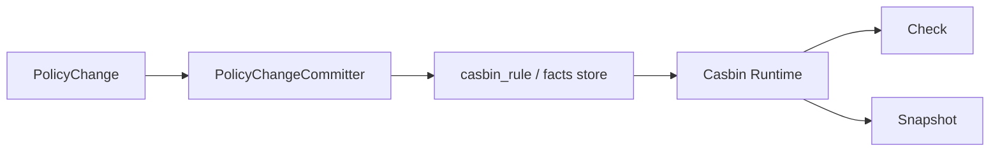

# 06-Casbin 运行时模型：p/g Facts 与四段 Matcher

## 1. 本文定位

本文是 `03-授权AuthZ/` 文档组中关于 **Casbin 运行时模型** 的文档。

前面几篇文档已经解释了 AuthZ 的领域模型、读链路和写链路：

```text
00-AuthZ模型总览：Subject -> RoleBinding -> Role -> Permission -> Resource / Action / Scope
01-授权资源与动作模型：ResourceKey / ResourcePattern / Action / Scope
02-授权角色与绑定模型：Role / RoleBinding / Subject
03-Check与Snapshot读链路：Check / Snapshot
04-授权写入链路：PolicyAdministration 与 PolicyChange
05-PolicyChangeCommitter 与 AuthZ UoW
```

本文进入 infra/runtime 层，回答：

```text
领域模型中的 Permission 和 RoleBinding 如何映射为 Casbin p/g facts？
Check 请求如何映射为 Casbin request？
Casbin model.conf 中的 r / p / g / matcher 分别表达什么？
resourceMatch / actionMatch / scopeMatch 如何支持四段资源模型？
为什么 Casbin 只是运行时引擎，不是领域模型？
```

本文重点讲：

```text
Casbin Runtime
p facts
 g facts
r request
resourceMatch
actionMatch
scopeMatch
RuntimeAdapters
```

PolicyVersion、Outbox、RuntimeReload 的传播机制会在下一篇展开：

```text
07-PolicyVersion-Outbox与RuntimeReload.md
```

---

## 2. 30 秒结论

AuthZ 的领域模型是：

```text
Subject
Role
Resource
Action
Scope
Permission
RoleBinding
AuthorizationDecision
```

Casbin 的运行时模型是：

```text
r = sub, dom, obj, act, scope
p = sub, dom, obj, act, scope
g = _, _, _
matcher = g(...) && resourceMatch(...) && actionMatch(...) && scopeMatch(...)
```

两者的映射关系是：

```text
Permission   -> p fact
RoleBinding  -> g fact
Check Request -> r request
```

其中：

```text
p fact 表示 Role 拥有什么 Permission
g fact 表示 Subject 在 Tenant 下持有什么 Role
r request 表示本次 Check 请求
```

一句话：

> Casbin 是 AuthZ 的运行时判定引擎；Domain/Application 使用 Subject、Role、Permission、RoleBinding 等授权语言，infra/casbin 才负责把它们转换成 p/g/r facts 并执行 matcher。

---

## 3. 为什么需要单独讲 Casbin Runtime

AuthZ 领域层不应该出现 Casbin 术语。

领域层应该讲：

```text
Subject
Role
Resource
Action
Scope
Permission
RoleBinding
AuthorizationRequest
AuthorizationDecision
PolicyChange
```

但运行时判定需要一个高效的策略匹配引擎。

当前 IAM 选择 Casbin 作为运行时 engine。

Casbin 擅长处理：

```text
策略加载
RBAC role relation
request/policy matcher
Enforce 判定
EnforceEx 获取匹配策略
```

因此，IAM 的设计是：

```text
Domain/Application 负责授权语义。
Infra/Casbin 负责运行时匹配。
```

这条边界非常重要。

如果把 Casbin 术语泄漏到 domain/application，就会出现：

```text
领域模型变成 p/g/v0/v1/v2/v3/v4
PolicyAdministration 直接拼 casbin_rule
Transport 直接调用 Enforce
测试依赖 Casbin 内部规则
后续替换 matcher 或 runtime 时牵连业务层
```

因此，Casbin 必须被限制在 infra runtime 层。

---

## 4. Casbin model.conf 总览

### 4.1 当前运行时模型

当前 AuthZ 的 Casbin model 可以抽象为：

```ini
[request_definition]
r = sub, dom, obj, act, scope

[policy_definition]
p = sub, dom, obj, act, scope

[role_definition]
g = _, _, _

[policy_effect]
e = some(where (p.eft == allow))

[matchers]
m = g(r.sub, p.sub, r.dom)
    && r.dom == p.dom
    && resourceMatch(r.obj, p.obj)
    && actionMatch(r.act, p.act)
    && scopeMatch(r.scope, p.scope)
```

它表达的是：

```text
请求主体 r.sub 必须在 r.dom 下拥有策略角色 p.sub；
请求租户 r.dom 必须等于策略租户 p.dom；
请求资源 r.obj 必须被策略资源 p.obj 覆盖；
请求动作 r.act 必须被策略动作 p.act 覆盖；
请求 scope r.scope 必须被策略 scope p.scope 覆盖。
```

---

### 4.2 为什么 r / p 都是五元组

Check 请求需要五个维度：

```text
Subject
Tenant
Resource
Action
Scope
```

Permission fact 也需要五个维度：

```text
Role
Tenant
ResourcePattern
ActionPattern
Scope
```

因此 Casbin 的 r / p 都建模成五元组：

```text
r = sub, dom, obj, act, scope
p = sub, dom, obj, act, scope
```

字段同名，但语义不同。

| 字段 | r request 中的含义 | p policy 中的含义 |
| --- | --- | --- |
| sub | 请求主体 | 拥有 Permission 的 Role |
| dom | 请求 Tenant | Permission 所属 Tenant |
| obj | 请求资源 | Permission.ResourcePattern |
| act | 请求动作 | Permission.ActionPattern |
| scope | 请求对象范围 | Permission.Scope |

这个区别必须牢记。

---

### 4.3 g 是什么

`g` 表示 RBAC role relation。

在当前 AuthZ 中，它表达：

```text
Subject 在某个 Tenant 下持有某个 Role。
```

也就是 RoleBinding fact。

例如：

```text
g, user:1001, role:iam:admin, tenant-a
```

表示：

```text
user:1001 在 tenant-a 下持有 iam:admin 角色。
```

matcher 中的：

```text
g(r.sub, p.sub, r.dom)
```

表示：

```text
请求主体 r.sub 是否在请求 tenant r.dom 下持有策略角色 p.sub？
```

这正是：

```text
Subject -> RoleBinding -> Role
```

在 runtime 层的表达。

---

## 5. p fact：Permission 的运行时表达

### 5.1 Permission 领域模型

领域中的 Permission 表达：

```text
某个 Role 在某个 Tenant 下，对某类 Resource，拥有某些 Action 能力，并且受 Scope 限制。
```

结构是：

```text
Permission(
  RoleName,
  TenantID,
  ResourcePattern,
  ActionPattern,
  Scope,
)
```

例如：

```text
RoleName: iam:admin
TenantID: tenant-a
ResourcePattern: iam:identity:user:*
ActionPattern: read|update|delete
Scope: all:*
```

---

### 5.2 Permission 如何映射为 p fact

运行时 p fact 可以表示为：

```text
p, role:<roleName>, tenantID, resourcePattern, actionPattern, scope
```

例如：

```text
p, role:iam:admin, tenant-a, iam:identity:user:*, read|update|delete, all:*
```

它表达：

```text
role:iam:admin 在 tenant-a 下，
可以对 iam:identity:user:* 执行 read/update/delete，
作用范围是 all:*。
```

注意：

```text
role:iam:admin 是 runtime subject，不是用户 subject。
```

在 p fact 中，`sub` 存的是 Role。

在 r request 中，`sub` 存的是真实请求 Subject。

二者通过 `g` relation 连接。

---

### 5.3 为什么 p.sub 是 Role 而不是 User

如果 p fact 直接写 user：

```text
p, user:1001, tenant-a, iam:identity:user:*, read, all:*
```

就变成了直接给用户授权。

这会绕开 RoleBinding 模型。

当前 AuthZ 的设计是：

```text
Subject 通过 RoleBinding 持有 Role。
Role 通过 Permission 获得能力。
```

所以 p fact 必须挂在 Role 上：

```text
p, role:iam:admin, tenant-a, iam:identity:user:*, read, all:*
```

然后通过 g fact 表达：

```text
g, user:1001, role:iam:admin, tenant-a
```

最终 matcher 组合两者。

---

## 6. g fact：RoleBinding 的运行时表达

### 6.1 RoleBinding 领域模型

领域中的 RoleBinding 表达：

```text
某个 Subject 在某个 Tenant 下持有某个 Role。
```

结构是：

```text
RoleBinding(
  Subject,
  RoleName,
  TenantID,
)
```

例如：

```text
Subject: user:1001
RoleName: iam:admin
TenantID: tenant-a
```

---

### 6.2 RoleBinding 如何映射为 g fact

运行时 g fact 可以表示为：

```text
g, subject, role:<roleName>, tenantID
```

例如：

```text
g, user:1001, role:iam:admin, tenant-a
```

它表达：

```text
user:1001 在 tenant-a 下持有 role:iam:admin。
```

这样 matcher 就可以判断：

```text
r.sub 是否在 r.dom 下拥有 p.sub 指向的 Role？
```

---

### 6.3 为什么 g fact 必须带 tenant

如果 g fact 不带 tenant：

```text
g, user:1001, role:iam:admin
```

就无法表达：

```text
user:1001 在 tenant-a 下是 admin
user:1001 在 tenant-b 下只是 viewer
```

当前模型必须支持 tenant/domain 维度。

因此 g fact 使用三元组：

```text
g = subject, role, tenant
```

对应 Casbin 的 role definition：

```text
g = _, _, _
```

---

## 7. r request：Check 请求的运行时表达

### 7.1 AuthorizationRequest 领域模型

领域中的 AuthorizationRequest 表达：

```text
Subject 在 Tenant 下，能不能对 ResourcePattern 执行 Action，并且满足 ObjectScope？
```

结构是：

```text
AuthorizationRequest(
  Subject,
  TenantID,
  ResourcePattern,
  Action,
  ObjectScope,
)
```

例如：

```text
Subject: user:1001
TenantID: tenant-a
ResourcePattern: iam:identity:user:*
Action: read
ObjectScope: all:*
```

---

### 7.2 AuthorizationRequest 如何映射为 r request

运行时 request 可以表示为：

```text
r, subject, tenantID, resourcePattern, action, objectScope
```

例如：

```text
r, user:1001, tenant-a, iam:identity:user:*, read, all:*
```

进入 matcher 后，会与 p/g facts 组合判定。

---

### 7.3 r.act 必须是具体动作

r request 中的 `act` 是请求动作。

它应该是：

```text
read
update
delete
export
```

不应该是：

```text
read|list
.*
```

因为：

```text
r.act = Action
p.act = ActionPattern
```

请求侧传入 ActionPattern 会扩大判定问题。

因此，应用层 `CheckCommand` 必须保证 Action 是具体动作。

---

## 8. Matcher 总体语义

### 8.1 matcher 逐项拆解

完整 matcher 可以拆成五个判断：

```text
g(r.sub, p.sub, r.dom)
r.dom == p.dom
resourceMatch(r.obj, p.obj)
actionMatch(r.act, p.act)
scopeMatch(r.scope, p.scope)
```

分别对应：

| 判断 | 含义 |
| --- | --- |
| `g(r.sub, p.sub, r.dom)` | 请求 Subject 是否在 Tenant 下持有策略 Role |
| `r.dom == p.dom` | 请求 Tenant 是否等于策略 Tenant |
| `resourceMatch(r.obj, p.obj)` | 请求 Resource 是否被策略 ResourcePattern 覆盖 |
| `actionMatch(r.act, p.act)` | 请求 Action 是否被策略 ActionPattern 覆盖 |
| `scopeMatch(r.scope, p.scope)` | 请求 ObjectScope 是否被策略 Scope 覆盖 |

这五个条件都满足，才允许访问。

---

### 8.2 matcher 对应领域主线

领域主线是：

```text
Subject
  -> RoleBinding
  -> Role
  -> Permission
  -> Resource / Action / Scope
```

matcher 对应关系是：

```text
g(r.sub, p.sub, r.dom)           -> Subject -> RoleBinding -> Role
r.dom == p.dom                   -> Tenant 边界
resourceMatch(r.obj, p.obj)      -> Resource / ResourcePattern
ActionMatch(r.act, p.act)        -> Action / ActionPattern
scopeMatch(r.scope, p.scope)     -> Scope 覆盖
```

注意：上面 `ActionMatch` 在配置中应是 `actionMatch`，这里大小写只是在解释文字中突出概念。

---

## 9. resourceMatch：四段资源匹配

### 9.1 为什么不用普通 keyMatch

早期如果直接使用通用 path matcher，很容易出现两个问题：

```text
资源模型被路径匹配语义污染
四段 ResourceKey 的 app/domain/type/name 边界不清楚
```

IAM 的 ResourcePattern 是四段授权语义：

```text
<app>:<domain>:<type>:<name-or-pattern>
```

它不是 HTTP path。

因此需要专门的：

```text
resourceMatch(requestResource, policyResourcePattern)
```

---

### 9.2 resourceMatch 的基本语义

resourceMatch 比较的是：

```text
r.obj 请求资源
p.obj 策略资源模式
```

基本规则是：

```text
两者都必须是四段
每段按 app / domain / type / name 比较
policy 段为 * 时可以匹配 request 对应段
policy 段不为 * 时必须与 request 对应段相等
```

例如：

| Request Resource | Policy ResourcePattern | 是否匹配 |
| --- | --- | --- |
| `iam:identity:user:*` | `iam:identity:user:*` | 是 |
| `iam:identity:user:1001` | `iam:identity:user:*` | 是 |
| `iam:identity:user:1001` | `iam:*:*:*` | 是 |
| `iam:identity:user:1001` | `*:*:*:*` | 是 |
| `iam:identity:user:1001` | `qs:*:*:*` | 否 |
| `iam:identity:user:1001` | `iam:authz:role:*` | 否 |

---

### 9.3 resourceMatch 的方向

resourceMatch 的方向很重要。

它应该表达：

```text
policy pattern 是否覆盖 request resource？
```

也就是：

```text
resourceMatch(r.obj, p.obj)
```

不要反过来理解成：

```text
request pattern 覆盖 policy resource
```

因为授权判断是：

```text
策略能不能覆盖请求？
```

不是：

```text
请求能不能覆盖策略？
```

---

## 10. actionMatch：动作匹配

### 10.1 Action 与 ActionPattern

请求侧是：

```text
Action
```

策略侧是：

```text
ActionPattern
```

例如：

```text
r.act = read
p.act = read|list
```

actionMatch 负责判断：

```text
p.act 是否覆盖 r.act？
```

---

### 10.2 actionMatch 的基本语义

典型匹配关系：

| Request Action | Policy ActionPattern | 是否匹配 |
| --- | --- | --- |
| `read` | `read` | 是 |
| `read` | `read-list` | 是 |
| `list` | `read-list` | 是 |
| `delete` | `read-list` | 否 |
| `export` | `.*` | 是 |
| `bread` | `read` | 否 |

注意最后一行。

如果直接使用非锚定正则，可能出现 `read` 匹配 `bread` 这类问题。

因此 actionMatch 应该确保模式是完整匹配，而不是子串匹配。

---

### 10.3 为什么请求侧不能传 ActionPattern

如果请求侧传：

```text
read|list
```

那么判定问题就变成：

```text
我能不能执行 read 或 list？
```

这不是单次访问判定。

Check 应该回答的是：

```text
我能不能执行 read？
```

所以：

```text
r.act 必须是 Action
p.act 可以是 ActionPattern
```

---

## 11. scopeMatch：作用范围覆盖

### 11.1 Scope 的两个方向

请求侧 scope 是：

```text
ObjectScope
```

策略侧 scope 是：

```text
Permission.Scope
```

scopeMatch 负责判断：

```text
policy scope 是否覆盖 request scope？
```

也就是：

```text
scopeMatch(r.scope, p.scope)
```

---

### 11.2 scopeMatch 的基本语义

当前支持：

```text
all:*
origin:<value>
```

基本匹配规则：

| Request Scope | Policy Scope | 是否匹配 |
| --- | --- | --- |
| `all:*` | `all:*` | 是 |
| `origin:1001` | `all:*` | 是 |
| `origin:1001` | `origin:1001` | 是 |
| `origin:1002` | `origin:1001` | 否 |
| `all:*` | `origin:1001` | 否 |

核心语义是：

```text
all:* 是更宽权限。
origin:x 是更窄权限。
窄权限不能覆盖宽请求。
```

---

### 11.3 为什么 Scope 不放进 ResourceKey

如果把 Scope 放进 ResourceKey，会变成：

```text
qs:evaluation:report:origin:1001
```

这会破坏四段 ResourceKey 结构。

更好的方式是：

```text
ResourcePattern: qs:evaluation:report:*
Action: read
Scope: origin:1001
```

这样 resourceMatch 和 scopeMatch 可以独立演进。

---

## 12. 一次完整 Check 示例

### 12.1 已有授权事实

假设有 Permission fact：

```text
p, role:iam:admin, tenant-a, iam:identity:user:*, read|update|delete, all:*
```

还有 RoleBinding fact：

```text
g, user:1001, role:iam:admin, tenant-a
```

表示：

```text
user:1001 在 tenant-a 下持有 iam:admin。
iam:admin 在 tenant-a 下可以对 iam:identity:user:* 执行 read/update/delete，scope 为 all:*。
```

---

### 12.2 请求判定

Check 请求是：

```text
r, user:1001, tenant-a, iam:identity:user:2001, read, origin:2001
```

matcher 逐项判断：

```text
g(user:1001, role:iam:admin, tenant-a)              true
r.dom == p.dom                                      true
resourceMatch(iam:identity:user:2001, iam:identity:user:*) true
actionMatch(read, read|update|delete)               true
scopeMatch(origin:2001, all:*)                      true
```

最终：

```text
allowed = true
```

---

### 12.3 失败示例

如果请求是：

```text
r, user:1001, tenant-a, iam:identity:user:2001, export, origin:2001
```

则：

```text
actionMatch(export, read|update|delete) = false
```

最终拒绝。

如果请求是：

```text
r, user:1001, tenant-b, iam:identity:user:2001, read, origin:2001
```

则：

```text
g(user:1001, role:iam:admin, tenant-b) = false
或 r.dom == p.dom = false
```

最终拒绝。

---

## 13. Snapshot 与 Casbin Runtime

Snapshot 读取的是授权事实视图。

它通常需要：

```text
RoleNamesForSubject(subject, tenant)
PermissionsForSubject(subject, tenant)
```

当前可以由 Casbin runtime adapter 提供这些能力。

例如：

```text
通过 g facts 读取 Subject 的 RoleNames
通过 RoleNames 再读取对应 p facts
组装 AuthorizationSnapshot
```

但是 SnapshotReader 不应该直接依赖 Casbin API。

它应该依赖：

```text
SnapshotStore
```

这样底层可以是：

```text
Casbin Runtime
缓存投影
数据库读模型
```

而应用层不受影响。

---

## 14. RuntimeAdapters：隔离 CasbinAdapter

### 14.1 为什么需要 RuntimeAdapters

CasbinAdapter 底层可能具备很多能力：

```text
Check
AuthorizeRoute
RoleNamesForSubject
PermissionsForSubject
LoadPolicy
RuntimeHealthDetails
RecordPolicyVersionEvent
```

如果把同一个 adapter 到处注入，会造成：

```text
应用层依赖过宽
测试替身难写
Casbin 能力泄漏到各处
后续拆分 runtime 困难
```

因此需要外层 RuntimeAdapters，将 CasbinAdapter 包装成多个窄接口。

---

### 14.2 常见 runtime 端口

AuthZ runtime 可以拆成这些端口：

```text
DecisionEngine
RouteAuthorizer
SnapshotStore
RolePermissionStore
PolicyReloader
RuntimeHealthReporter
RoleNameReader
```

其中：

| 端口 | 用途 |
| --- | --- |
| DecisionEngine | Check 判定 |
| SnapshotStore | Snapshot 读取 |
| RolePermissionStore | Permission command 辅助读取 |
| PolicyReloader | RuntimeReload |
| RuntimeHealthReporter | 暴露 reload 健康状态 |
| RouteAuthorizer | REST 路由级权限判断 |

这样 application 只依赖自己需要的最小接口。

---

### 14.3 底层共享不是问题

底层仍然可以共享同一个 Casbin enforcer 或 CasbinAdapter。

关键是：

```text
对外暴露窄接口
内部复用 runtime 实例
```

这样既避免重复加载 policy，又不会让 application 直接依赖大而全的 infra 对象。

---

## 15. Casbin policy 存储与加载

### 15.1 数据库事实源

当前运行时 facts 通常存储在数据库中。

也就是：

```text
casbin_rule
```

但要注意：

```text
casbin_rule 是运行时授权 facts 的持久化形式。
它不是 AuthZ 的全部事实源。
```

AuthZ 还包括：

```text
Role 管理记录
ResourceCatalog
RoleBinding 管理记录
PolicyVersion
Outbox events
```

---

### 15.2 LoadPolicy 做什么

LoadPolicy 会从持久化存储中加载 p/g facts 到 Casbin runtime。

它使本实例运行时具备最新或较新的授权策略。

当授权写入成功后，本实例通常会执行 best-effort LoadPolicy。

跨实例则需要依靠：

```text
PolicyVersion changed event
Outbox relay
Runtime reload subscriber
```

这些会在下一篇展开。

---

### 15.3 AutoSave 的边界

在当前设计中，Casbin runtime 不应该成为写入事实源。

授权写入应该通过：

```text
PolicyChangeCommitter
```

写入数据库 facts。

Casbin runtime 通过 LoadPolicy 重新加载。

因此，应该避免让业务代码通过 Casbin runtime 直接 AutoSave policy。

换句话说：

```text
数据库 facts 是运行时策略事实源。
Casbin runtime 是加载和判定器。
```

---

## 16. 与 PolicyChangeCommitter 的关系

PolicyChangeCommitter 负责提交：

```text
Permission facts
RoleBinding facts
PolicyVersion
Outbox event
```

Casbin runtime 负责消费：

```text
Permission facts
RoleBinding facts
```

二者关系是：



注意：

```text
PolicyChangeCommitter 写 facts。
Casbin Runtime 读 facts。
```

不要反过来让 Casbin Runtime 成为写入入口。

---

## 17. 与 PolicyLinter 的关系

PolicyLinter 读取已有 Permission facts，并与 ResourceCatalog 对比。

它关心的是：

```text
p facts 是否仍然引用存在的 Resource？
p facts 中的 ActionPattern 是否可检查？
p facts 中的 ScopeKind 是否被 Resource 支持？
```

例如：

```text
p, role:iam:admin, tenant-a, iam:identity:user:*, export, all:*
```

如果 ResourceCatalog 中 `iam:identity:user:*` 不支持 `export`，PolicyLinter 可以报告：

```text
unsupported_action
```

但 PolicyLinter 不应该直接删除 p fact。

修复必须通过：

```text
PolicyReconciler
  -> PolicyChange
  -> PolicyChangeCommitter
```

---

## 18. 常见误区

### 18.1 Casbin 就是 AuthZ 领域模型

错误。

Casbin 是 runtime engine。

AuthZ 领域模型是 Subject、Role、Permission、RoleBinding、Resource、Action、Scope。

---

### 18.2 p fact 可以直接挂 User

错误。

当前模型是 RBAC。

Permission 应该挂在 Role 上。

Subject 通过 g fact 绑定到 Role。

---

### 18.3 g fact 不需要 Tenant

错误。

没有 Tenant 就无法表达同一 Subject 在不同授权域下持有不同 Role。

---

### 18.4 可以继续用 keyMatch 代替 resourceMatch

错误。

ResourcePattern 是四段授权资源语义，不是 HTTP path。

应该用四段语义的 resourceMatch。

---

### 18.5 actionMatch 可以使用普通子串匹配

错误。

Action 匹配应确保完整匹配，避免 `read` 误匹配 `bread` 这类问题。

---

### 18.6 scopeMatch 是简单字符串相等

错误。

`all:*` 应该能覆盖 `origin:x`。

而 `origin:x` 不能覆盖 `all:*`。

---

### 18.7 业务代码可以直接调用 Enforce

错误。

业务代码应该调用 AuthZ Check / SDK。

Transport / Application 不应直接依赖 Casbin API。

---

### 18.8 修改权限时直接调用 AddPolicy 就可以

错误。

授权写入必须通过 PolicyChangeCommitter。

直接 AddPolicy 会绕过 UoW、PolicyVersion、Outbox、审计和管理面记录。

---

## 19. 代码事实源

本文涉及的主要代码事实源：

```text
configs/casbin_model.conf

internal/apiserver/infra/casbin
internal/apiserver/infra/mysql/casbinrule

internal/apiserver/domain/authz/permission
internal/apiserver/domain/authz/rolebinding
internal/apiserver/domain/authz/decision
internal/apiserver/domain/authz/resource
internal/apiserver/domain/authz/scope

internal/apiserver/application/authz/authorization
internal/apiserver/application/authz/policy
internal/apiserver/application/authz/policylint
```

重点关注：

| 主题 | 事实源 |
| --- | --- |
| Casbin model | `configs/casbin_model.conf` |
| p/g facts mapping | `infra/casbin` |
| fact persistence | `infra/mysql/casbinrule` |
| Permission | `domain/authz/permission` |
| RoleBinding fact | `domain/authz/rolebinding` |
| AuthorizationRequest / Decision | `domain/authz/decision` |
| ResourcePattern / ActionPattern | `domain/authz/resource` |
| Scope | `domain/authz/scope` |
| Check / Snapshot | `application/authz/authorization` |
| PolicyChangeCommitter | `application/authz/policy` |
| PolicyLinter | `application/authz/policylint` |

如果本文与代码不一致，以代码事实源为准。

---

## 20. 本文总结

本文讲的是 AuthZ 的 Casbin 运行时模型。

核心映射是：

```text
Permission   -> p fact
RoleBinding  -> g fact
Check Request -> r request
```

核心 matcher 是：

```text
g(r.sub, p.sub, r.dom)
&& r.dom == p.dom
&& resourceMatch(r.obj, p.obj)
&& actionMatch(r.act, p.act)
&& scopeMatch(r.scope, p.scope)
```

其中：

```text
resourceMatch 支持四段资源模式匹配
actionMatch 支持请求 Action 与策略 ActionPattern 匹配
scopeMatch 支持 policy scope 对 request scope 的覆盖判断
```

如果只记住一句话：

> Casbin 在 IAM AuthZ 中只是运行时判定引擎；领域层生成 Permission 和 RoleBinding，写入链路提交为 p/g facts，Check 链路将请求转换为 r request，最终由四段 matcher 完成 resource/action/scope 的运行时匹配。
