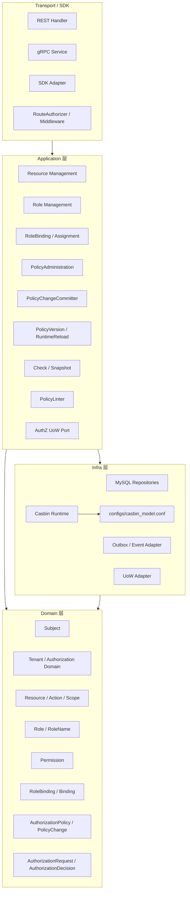

# 07-AuthZ 分层架构与事实源索引

## 1. 本文定位

本文是 `03-授权AuthZ/` 文档组的收口文档。

前面几篇文档已经分别说明：

```text
00-AuthZ模型总览-Subject-Role-Resource-Permission-RoleBinding.md
01-资源模型-ResourceKey-ResourcePattern-Action-Scope.md
02-角色模型-Role-RoleBinding-Subject.md
03-授权写入链路-PolicyAdministration-PolicyChange-PolicyChangeCommitter.md
04-授权版本与事件传播链路-PolicyVersion-Outbox-RuntimeReload.md
05-权限检查链路-Check-Snapshot.md
06-Casbin运行时模型-pgFacts与四段Matcher.md
```

本文不再展开单个模型或单条链路，而是从 **分层架构** 和 **代码事实源** 的角度统一说明：

```text
AuthZ 的领域模型事实源在哪里？
Application 用例事实源在哪里？
Casbin Runtime 事实源在哪里？
PolicyVersion / Outbox / RuntimeReload 事实源在哪里？
PolicyLinter 作为治理能力放在哪里？
Transport / SDK / Container / Assembler 如何定位？
修改 AuthZ 时应该同步检查哪些文档、代码、表结构和测试？
```

一句话：

> 第 07 篇负责把 AuthZ 的模型、资源、角色、写入、传播、检查、运行时和治理能力统一收口到分层架构与事实源索引中。

---

## 2. 30 秒结论

AuthZ 模块采用典型分层：

```text
Transport / SDK
  -> Application
  -> Domain
  -> Infra
  -> Container / Assembler
```

其中：

| 层次 | 职责 |
| --- | --- |
| Domain | Subject、Role、Resource、Permission、RoleBinding、PolicyChange、AuthorizationDecision 等领域模型 |
| Application | PolicyAdministration、Check、Snapshot、PolicyChangeCommitter、RuntimeReload、PolicyLinter 等用例编排 |
| Infra | MySQL repository、Casbin runtime、Outbox/event adapter、UoW adapter 等技术实现 |
| Transport / SDK | REST/gRPC/SDK 契约适配 |
| Container / Assembler | 组合根，负责装配 ports、adapters、services、runtime capabilities |

AuthZ 的核心事实源关系是：

```text
领域事实源：internal/apiserver/domain/authz
应用事实源：internal/apiserver/application/authz
运行时事实源：internal/apiserver/infra/casbin + configs/casbin_model.conf
持久化事实源：internal/apiserver/infra/mysql + migration schema
装配事实源：internal/apiserver/container/assembler
```

核心边界：

```text
Domain 不依赖 Casbin / GORM / Redis / HTTP。
Application 不直接暴露 Casbin p/g/r 术语。
Transport 不直接操作 Repository 或 Casbin Enforce。
授权写入必须走 PolicyChangeCommitter。
RuntimeReload 不属于数据库事务。
PolicyLinter 是 read-only diagnosis，不是自动修复器。
```

---

## 3. 新版 AuthZ 文档体系

当前 AuthZ 文档体系如下：

| 文档 | 主题 |
| --- | --- |
| `00-AuthZ模型总览-Subject-Role-Resource-Permission-RoleBinding.md` | 建立 Subject、Role、Resource、Permission、RoleBinding、Decision、PolicyChange 等总模型 |
| `01-资源模型-ResourceKey-ResourcePattern-Action-Scope.md` | 说明 ResourceKey、ResourcePattern、Action、ActionPattern、Scope 边界 |
| `02-角色模型-Role-RoleBinding-Subject.md` | 说明 Subject、Role、RoleName、Tenant、RoleBinding、Assignment 边界 |
| `03-授权写入链路-PolicyAdministration-PolicyChange-PolicyChangeCommitter.md` | 说明 Grant/Revoke/Bind/Unbind 如何生成并提交 PolicyChange |
| `04-授权版本与事件传播链路-PolicyVersion-Outbox-RuntimeReload.md` | 说明 PolicyVersion、Outbox、OutboxRelay、RuntimeReload、多实例最终一致 |
| `05-权限检查链路-Check-Snapshot.md` | 说明 Check、Snapshot、PEP/PDP、DecisionEngine、AuthorizationDecision |
| `06-Casbin运行时模型-pgFacts与四段Matcher.md` | 说明 Permission/RoleBinding 如何映射为 p/g facts，r request 如何进入四段 matcher |
| `07-AuthZ分层架构与事实源索引.md` | 统一收口分层架构、代码事实源、数据事实源、护栏、测试和维护规则 |

推荐阅读顺序：

```text
00 建立总模型；
01 理解 Resource / Action / Scope；
02 理解 Subject / Role / RoleBinding；
03 理解授权事实如何写入；
04 理解授权版本如何传播并触发 RuntimeReload；
05 理解 Check / Snapshot 如何消费授权事实；
06 理解 Casbin Runtime 如何执行 p/g/r/matcher；
07 回到分层架构和代码事实源。
```

---

## 4. AuthZ 分层总览



依赖方向应保持：

```text
Transport -> Application
Application -> Domain / ports
Infra -> Domain / Application ports
Domain -> no Transport / no Infra / no Casbin
```

---

## 5. Domain 层事实源

### 5.1 Domain 层职责

Domain 层负责表达 AuthZ 的领域模型和不变量。

它回答：

```text
Subject 是什么？
Role 是什么？
ResourceKey / ResourcePattern 有什么边界？
Permission 如何表达 Role 的能力？
RoleBinding 如何表达 Subject 在 Tenant 下持有 Role？
AuthorizationRequest / AuthorizationDecision 如何表达一次判定？
PolicyChange 如何表达一次授权事实变更？
```

主要事实源入口：

```text
internal/apiserver/domain/authz
```

重点语义包括：

```text
subject
tenant / authorization domain
role / role name
resource / resource pattern / action / action pattern
scope
permission
rolebinding / binding / fact
decision / authorization request / authorization decision
policy / policy change / authorization policy
```

---

### 5.2 Domain 层不应该依赖什么

Domain 层不应该依赖：

```text
GORM / SQL builder
Casbin Enforcer
Redis client
HTTP / Gin / gRPC
Outbox relay
message broker
SDK DTO
```

Domain 层可以定义领域对象、值对象、领域服务和 port，但不应该知道具体技术实现。

错误方向：

```text
domain/authz -> infra/casbin
domain/authz -> gorm
domain/authz -> transport/rest
```

正确方向：

```text
Application 调用 Domain。
Infra 实现 Domain/Application 需要的 port。
```

---

## 6. Application 层事实源

### 6.1 Application 层职责

Application 层负责 AuthZ 用例编排。

主要事实源入口：

```text
internal/apiserver/application/authz
```

它回答：

```text
授权写入用例如何编排？
Check / Snapshot 如何执行？
PolicyChange 如何提交？
PolicyVersion / RuntimeReload 如何调用？
PolicyLinter 如何执行诊断？
```

Application 层可以依赖 Domain 模型和 port，也可以依赖注入的 infra adapter。

但它不应该把 Casbin p/g/r 术语暴露给 Transport 或业务 Handler。

---

### 6.2 资源与角色管理

资源和角色管理主要包括：

```text
ResourceCatalog 管理；
Role 管理；
RoleBinding / Assignment 管理；
SubjectResolver；
```

相关事实源大致位于：

```text
internal/apiserver/application/authz/resource
internal/apiserver/application/authz/role
internal/apiserver/application/authz/rolebinding
```

职责：

```text
管理资源目录；
管理角色；
处理对外 assignment 语义；
内部收敛为 RoleBinding；
校验 Subject / Role / Tenant；
进入 PolicyAdministration / PolicyChangeCommitter。
```

---

### 6.3 授权写入链路

授权写入链路主要包括：

```text
PolicyAdministration
AuthorizationPolicy
PolicyChange
PolicyChangeCommitter
AuthZ UoW
```

相关事实源大致位于：

```text
internal/apiserver/application/authz/policy
internal/apiserver/application/authz/uow
internal/apiserver/domain/authz
```

主线：

```text
Application Command
  -> PolicyAdministration
  -> AuthorizationPolicy
  -> PolicyChange
  -> PolicyChangeCommitter
  -> AuthZ UoW
```

写入链路必须保证：

```text
管理面记录；
运行时 facts；
PolicyVersion；
Outbox event；
```

在统一写入边界内保持一致。

完整说明见：

```text
03-授权写入链路-PolicyAdministration-PolicyChange-PolicyChangeCommitter.md
```

---

### 6.4 授权版本与事件传播

授权传播链路主要包括：

```text
PolicyVersion
Outbox event staging
OutboxRelay
RuntimeReload
RuntimeHealthDetails
AuthzPolicySync
```

相关事实源大致位于：

```text
internal/apiserver/application/authz
internal/apiserver/infra/events
internal/apiserver/infra/casbin
```

主线：

```text
PolicyChangeCommitter committed
  -> PolicyVersion persisted
  -> Outbox event staged
  -> local RuntimeReload(best-effort)
  -> OutboxRelay publishes authz.policy.version_changed
  -> consumers reload runtime
  -> RuntimeHealthDetails updated
```

完整说明见：

```text
04-授权版本与事件传播链路-PolicyVersion-Outbox-RuntimeReload.md
```

---

### 6.5 权限检查读链路

权限检查读链路主要包括：

```text
CheckCommand
Checker
DecisionEngine
AuthorizationRequest
AuthorizationDecision
SnapshotQuery
SnapshotReader
AuthorizationSnapshot
```

相关事实源大致位于：

```text
internal/apiserver/application/authz/authorization
internal/apiserver/domain/authz
internal/apiserver/infra/casbin
```

Check 主线：

```text
RouteAuthorizer / REST / gRPC / SDK
  -> CheckCommand
  -> Checker
  -> AuthorizationRequest
  -> DecisionEngine
  -> Casbin Runtime
  -> AuthorizationDecision
```

Snapshot 主线：

```text
SnapshotQuery
  -> SnapshotReader
  -> AuthorizationSnapshot
```

完整说明见：

```text
05-权限检查链路-Check-Snapshot.md
```

---

### 6.6 PolicyLinter 治理能力

PolicyLinter 是授权事实治理能力。

它用于只读诊断：

```text
ResourceCatalog 与 PermissionFacts 是否一致？
已有 Permission 是否引用了不存在的 Resource？
Permission 使用的 Action 是否仍被 Resource 支持？
Permission 使用的 ScopeKind 是否仍被 Resource 支持？
运行时 facts 是否存在明显脏数据？
```

PolicyLinter 的定位：

```text
read-only diagnosis
```

它不是：

```text
PolicyChangeCommitter
RuntimeReload
OutboxRelay
自动修复器
```

如果未来需要自动治理，应引入：

```text
PolicyReconciler
  -> PolicyChange
  -> PolicyChangeCommitter
```

也就是说，自动修复必须走标准授权写入链路。

相关事实源大致位于：

```text
internal/apiserver/application/authz/policylint
```

---

## 7. Infra 层事实源

### 7.1 Infra 层职责

Infra 层负责技术实现。

它回答：

```text
授权 facts 如何持久化？
Casbin runtime 如何加载 p/g facts？
UoW 如何映射到数据库事务？
Outbox event 如何写入和发布？
RuntimeReload 如何触发 Casbin LoadPolicy？
```

主要事实源入口：

```text
internal/apiserver/infra
```

AuthZ 重点关注：

```text
internal/apiserver/infra/casbin
internal/apiserver/infra/mysql
internal/apiserver/infra/mysql/casbinrule
internal/apiserver/infra/events
```

---

### 7.2 MySQL repositories

MySQL 相关 adapter 负责：

```text
Role 持久化；
ResourceCatalog 持久化；
RoleBinding / Binding 管理记录持久化；
Permission facts / RoleBinding facts 持久化；
PolicyVersion 持久化；
Outbox event 持久化；
UoW 事务适配。
```

注意：

```text
MySQL repository 只负责持久化，不决定授权语义。
```

授权语义应在 Domain / Application 层表达。

---

### 7.3 Casbin runtime

Casbin Runtime 是 AuthZ 的 infra runtime engine。

事实源：

```text
internal/apiserver/infra/casbin
configs/casbin_model.conf
```

它负责：

```text
加载 p/g facts；
执行 matcher；
实现 DecisionEngine；
实现 RuntimeReload；
暴露 RuntimeHealth；
```

领域到 runtime 的映射：

```text
Permission   -> p fact
RoleBinding  -> g fact
Check Request -> r request
```

Casbin Runtime 不应该成为写入入口。

错误方式：

```text
业务 service -> casbin.AddPolicy / AddGroupingPolicy
```

正确方式：

```text
PolicyAdministration -> PolicyChange -> PolicyChangeCommitter
```

---

### 7.4 Outbox / Events

Outbox / Events 相关 adapter 负责：

```text
stage outbox event；
scan unpublished event；
publish authz.policy.version_changed；
mark published / retry / dead-letter；
触发 consumer-side RuntimeReload。
```

Outbox 解决的是 dual-write 问题：

```text
授权 facts 写入数据库；
授权版本变化需要通知其他实例。
```

业务 facts 和 outbox event 必须在同一事务中提交。

完整说明见：

```text
04-授权版本与事件传播链路-PolicyVersion-Outbox-RuntimeReload.md
```

---

## 8. Transport / SDK 事实源

Transport / SDK 负责协议适配。

常见事实源入口：

```text
internal/apiserver/transport/rest/authz
internal/apiserver/transport/grpc
sdk / client 相关目录，以当前代码为准
```

Transport / SDK 层负责：

```text
REST / gRPC / SDK request 绑定；
将 wire term 转为 Application Command / Query；
将 Application Result 转为 response；
处理认证后的 Principal / Subject 提取；
调用 RouteAuthorizer / Checker / PolicyAdministration。
```

Transport / SDK 层不应该：

```text
直接操作 MySQL repository；
直接调用 Casbin Enforce；
直接写 casbin_rule；
直接递增 PolicyVersion；
直接 stage Outbox event。
```

---

## 9. Container / Assembler 事实源

Container / Assembler 是组合根。

常见事实源入口：

```text
internal/apiserver/container/assembler
```

它负责：

```text
创建 Domain services；
创建 Application services；
创建 Infra adapters；
创建 Casbin Runtime；
创建 DecisionEngine；
创建 PolicyChangeCommitter；
创建 UoW；
创建 Outbox / RuntimeReload / RuntimeHealth 相关能力；
将 AuthZ capabilities 暴露给 Transport / SDK / Runtime tasks。
```

如果你想知道：

```text
某个 port 当前绑定到哪个 adapter？
某个 Application service 实际使用哪些依赖？
Casbin Runtime 在哪里创建？
RuntimeReload 从哪里注入？
```

优先查看 Assembler。

---

## 10. 数据事实源索引

Schema 事实源通常位于：

```text
internal/pkg/migration/migrations
```

AuthZ 相关数据事实通常包括：

| 事实 | 语义 |
| --- | --- |
| Role records | 角色管理面记录 |
| Resource records | 资源目录记录 |
| RoleBinding / Assignment records | Subject 在 Tenant 下持有 Role 的管理面记录 |
| Permission facts | Role 拥有哪些 Resource / Action / Scope 能力 |
| RoleBinding facts | Subject 在 Tenant 下持有 Role 的 runtime facts |
| Casbin rule records | p/g facts 的运行时持久化表示 |
| PolicyVersion records | tenant / domain 下授权事实版本 |
| Outbox records | 待发布授权版本事件 |

需要注意：

```text
casbin_rule 是 runtime facts store，不是 AuthZ 领域模型本身。
```

领域模型仍然是：

```text
Subject
Role
Resource
Permission
RoleBinding
PolicyChange
AuthorizationDecision
```

---

## 11. 关键链路索引

### 11.1 GrantPermission / RevokePermission

主线：

```text
Application Command
  -> PolicyAdministration
  -> AuthorizationPolicy
  -> PolicyChange
  -> PolicyChangeCommitter
  -> Permission fact add/remove
  -> PolicyVersion
  -> Outbox
```

参考文档：

```text
01-资源模型-ResourceKey-ResourcePattern-Action-Scope.md
03-授权写入链路-PolicyAdministration-PolicyChange-PolicyChangeCommitter.md
```

---

### 11.2 BindRole / UnbindRole

主线：

```text
Application Command
  -> SubjectResolver
  -> Role lookup
  -> AuthorizationPolicy
  -> PolicyChange
  -> PolicyChangeCommitter
  -> Binding record + g fact add/remove
  -> PolicyVersion
  -> Outbox
```

参考文档：

```text
02-角色模型-Role-RoleBinding-Subject.md
03-授权写入链路-PolicyAdministration-PolicyChange-PolicyChangeCommitter.md
```

---

### 11.3 PolicyVersion / Outbox / RuntimeReload

主线：

```text
PolicyChangeCommitter committed
  -> PolicyVersion persisted
  -> Outbox event staged
  -> local RuntimeReload(best-effort)
  -> OutboxRelay publishes authz.policy.version_changed
  -> consumers reload runtime
  -> RuntimeHealthDetails updated
```

参考文档：

```text
04-授权版本与事件传播链路-PolicyVersion-Outbox-RuntimeReload.md
```

---

### 11.4 Check

主线：

```text
RouteAuthorizer / REST / gRPC / SDK
  -> CheckCommand
  -> Checker
  -> AuthorizationRequest
  -> DecisionEngine
  -> Casbin Runtime
  -> AuthorizationDecision
```

参考文档：

```text
05-权限检查链路-Check-Snapshot.md
06-Casbin运行时模型-pgFacts与四段Matcher.md
```

---

### 11.5 Snapshot

主线：

```text
SnapshotQuery
  -> SnapshotReader
  -> AuthorizationSnapshot
```

参考文档：

```text
05-权限检查链路-Check-Snapshot.md
```

---

### 11.6 PolicyLinter

主线：

```text
PolicyLinter
  -> load ResourceCatalog
  -> load PermissionFacts
  -> detect missing_resource / unsupported_action / unsupported_scope_kind
  -> return diagnosis report
```

注意：

```text
PolicyLinter 不修复事实。
自动修复必须走 PolicyReconciler -> PolicyChange -> PolicyChangeCommitter。
```

---

## 12. 架构护栏

### 12.1 Domain 不依赖 Infra

禁止：

```text
domain/authz -> infra/casbin
domain/authz -> gorm
domain/authz -> mysql
domain/authz -> transport/rest
```

原因：

```text
领域模型必须独立于技术实现。
```

---

### 12.2 Transport 不直接操作 Infra

禁止：

```text
REST handler -> MySQL repository
REST handler -> casbin.Enforce
REST handler -> PolicyVersionRepository
REST handler -> OutboxRepository
```

正确：

```text
REST handler -> Application service
```

---

### 12.3 授权写入不绕过 PolicyChangeCommitter

禁止：

```text
service -> casbin.AddPolicy
service -> casbin.AddGroupingPolicy
service -> direct insert casbin_rule
service -> direct increment policy version
```

正确：

```text
PolicyAdministration -> PolicyChange -> PolicyChangeCommitter
```

---

### 12.4 Check 不直接暴露 Casbin

禁止：

```text
business handler -> casbin.Enforce
```

正确：

```text
RouteAuthorizer -> Checker -> DecisionEngine -> Casbin runtime
```

---

### 12.5 RuntimeReload 不放入数据库事务

事务内：

```text
facts
PolicyVersion
Outbox event
```

事务后：

```text
local best-effort RuntimeReload
```

原因：

```text
RuntimeReload 是内存状态刷新，不应该扩大数据库事务。
```

---

### 12.6 casbin_model.conf 是运行时事实源

`configs/casbin_model.conf` 是 Casbin matcher 的事实源。

修改它时必须同步检查：

```text
06-Casbin运行时模型-pgFacts与四段Matcher.md
DecisionEngine tests
Casbin integration tests
p/g fact mapping
resourceMatch / actionMatch / scopeMatch
```

---

## 13. 修改 AuthZ 时的检查清单

### 13.1 修改 Resource / Action / Scope

需要检查：

```text
01-资源模型-ResourceKey-ResourcePattern-Action-Scope.md
domain/authz resource/scope 相关模型
application/authz/resource
PolicyLinter
Casbin matcher
configs/casbin_model.conf
相关测试
```

---

### 13.2 修改 Role / RoleBinding / Subject

需要检查：

```text
02-角色模型-Role-RoleBinding-Subject.md
domain/authz role / rolebinding / subject 相关模型
application/authz/rolebinding
SubjectResolver
Casbin g fact mapping
SnapshotReader
相关测试
```

---

### 13.3 修改授权写入链路

需要检查：

```text
03-授权写入链路-PolicyAdministration-PolicyChange-PolicyChangeCommitter.md
PolicyAdministration
AuthorizationPolicy
PolicyChange
PolicyChangeCommitter
AuthZ UoW
PolicyVersion
Outbox staging
相关测试
```

---

### 13.4 修改版本传播链路

需要检查：

```text
04-授权版本与事件传播链路-PolicyVersion-Outbox-RuntimeReload.md
PolicyVersion repository
Outbox event schema
OutboxRelay
RuntimeReload
RuntimeHealthDetails
Consumer idempotency
相关测试
```

---

### 13.5 修改 Check / Snapshot

需要检查：

```text
05-权限检查链路-Check-Snapshot.md
CheckCommand
Checker
DecisionEngine
AuthorizationDecision
SnapshotQuery
SnapshotReader
RouteAuthorizer
相关测试
```

---

### 13.6 修改 Casbin Runtime

需要检查：

```text
06-Casbin运行时模型-pgFacts与四段Matcher.md
configs/casbin_model.conf
infra/casbin
infra/mysql/casbinrule
DecisionEngine tests
Casbin integration tests
```

---

### 13.7 修改 PolicyLinter

需要检查：

```text
application/authz/policylint
ResourceCatalog
PermissionFacts
diagnosis report schema
future PolicyReconciler boundary
```

---

## 14. 测试建议

### 14.1 Domain tests

Domain tests 应关注：

```text
ResourceKey / ResourcePattern 校验；
Action / ActionPattern 校验；
Scope match 语义；
RoleName 约束；
SubjectRef 约束；
Permission 构造；
RoleBinding 构造；
AuthorizationPolicy 生成 PolicyChange。
```

Domain tests 不应依赖：

```text
MySQL
Casbin
Redis
HTTP
```

---

### 14.2 Application tests

Application tests 应关注：

```text
PolicyAdministration 编排；
PolicyChangeCommitter 是否提交正确 facts/version/outbox；
Check / Snapshot 是否正确调用 port；
PolicyLinter 是否产出正确 diagnosis；
错误语义和幂等语义。
```

可以使用 fake repository / fake DecisionEngine / fake RuntimeReloader。

---

### 14.3 Infra tests

Infra tests 应关注：

```text
Casbin matcher；
p/g fact persistence；
MySQL repository；
Outbox relay；
UoW transaction；
RuntimeReload。
```

---

### 14.4 架构测试

架构测试应保护：

```text
domain/authz 不 import infra/casbin；
domain/authz 不 import gorm；
transport 不直接 import infra/casbin；
handler 不直接调用 repository；
Casbin 写入不绕过 PolicyChangeCommitter；
```

---

## 15. AuthZ 与其他模块边界

### 15.1 AuthZ 与 AuthN

AuthN 回答：

```text
你是谁？
你如何证明你是谁？
```

AuthZ 回答：

```text
你能不能访问某个资源？
```

边界：

```text
AuthN 产出 Principal / Subject 上下文；
AuthZ 消费 Subject / Tenant / Resource / Action / Scope 做判定。
```

AuthZ 不负责：

```text
登录；
Token 签发；
Session 管理；
RefreshToken；
Credential；
Challenge。
```

---

### 15.2 AuthZ 与 Identity

Identity 负责：

```text
User
Profile
ProfileLink
```

AuthZ 负责：

```text
Subject
Role
RoleBinding
Permission
Resource access
```

User 是身份主体。

Subject 是授权主体引用。

---

### 15.3 AuthZ 与业务系统

业务系统应该传入：

```text
Subject
TenantID
ResourceKey / request resource
Action
ObjectScope
```

业务系统不应该传：

```text
ResourcePattern 作为请求侧宽泛 pattern；
Casbin p/g facts；
user.role 字符串做本地判定；
```

业务系统也不应该直接调用：

```text
casbin.Enforce
```

应该通过：

```text
RouteAuthorizer / Checker / SDK Check
```

---

## 16. 当前阶段性边界

当前 AuthZ 模型已经覆盖：

```text
Subject / Tenant / Role / Resource / Permission / RoleBinding 建模；
ResourceKey 四段结构；
ResourceKey / ResourcePattern 分离；
Action / ActionPattern 分离；
Scope / ObjectScope 语义；
PolicyAdministration 写链路；
PolicyChange / PolicyChangeCommitter；
PolicyVersion / Outbox / RuntimeReload；
Check / Snapshot 读链路；
Casbin p/g facts runtime mapping；
PolicyLinter read-only diagnosis；
REST/gRPC/SDK 接入基础；
```

后续扩展方向包括：

```text
group / service subject 写入开放；
PolicyReconciler 自动治理；
更完整的多实例 outbox-driven runtime reload 闭环；
更复杂的 scope hierarchy；
条件表达式 / ABAC 能力；
更强的 RuntimeHealth 和 reload lag 观测；
```

需要明确：

```text
PolicyLinter 当前是诊断，不是修复；
group/service 当前是模型预留，写入能力以代码为准；
ResourceCatalog 变更不会自动删除已有 PermissionFacts；
Casbin Runtime 是 infra，不是领域模型。
```

---

## 17. 文档维护规则

### 17.1 文档跟随代码事实源

如果文档与代码冲突：

```text
先查代码事实源；
再更新文档；
必要时补测试锁定语义。
```

---

### 17.2 修改一条链路时同步维护相关文档

例如修改授权写入链路，至少检查：

```text
03-授权写入链路-PolicyAdministration-PolicyChange-PolicyChangeCommitter.md
04-授权版本与事件传播链路-PolicyVersion-Outbox-RuntimeReload.md
07-AuthZ分层架构与事实源索引.md
```

修改 Check 链路，至少检查：

```text
05-权限检查链路-Check-Snapshot.md
06-Casbin运行时模型-pgFacts与四段Matcher.md
07-AuthZ分层架构与事实源索引.md
```

---

### 17.3 不把旧目录边界带回新文档

新版目录已经确立：

```text
03 = 授权写入；
04 = 版本传播；
05 = 权限检查；
06 = Casbin Runtime；
07 = 分层架构与事实源；
PolicyLinter 收口在 07，不再独立成篇。
```

不要再写回：

```text
03-Check与Snapshot读链路
05-PolicyChangeCommitter与AuthZUoW
07-PolicyVersion-Outbox与RuntimeReload
08-PolicyLinter与授权事实治理
09-AuthZ分层架构与事实源索引
```

---

## 18. 本文总结

第 07 篇是 AuthZ 文档组的收口文档。

它把前面 00～06 的内容统一映射回分层架构和代码事实源：

```text
Domain：Subject / Role / Resource / Permission / RoleBinding / PolicyChange / Decision
Application：PolicyAdministration / Committer / Version / Check / Snapshot / PolicyLinter
Infra：MySQL / Casbin / Outbox / UoW / RuntimeReload
Transport / SDK：协议适配与 PEP 入口
Container / Assembler：组合根与能力装配
```

如果只记住一句话：

> AuthZ 的领域语言是 Subject、Role、Permission、RoleBinding、Resource、Action、Scope；Casbin 只是 runtime engine，授权写入必须通过 PolicyChangeCommitter，授权读取必须通过 Check / Snapshot，运行时一致性通过 PolicyVersion / Outbox / RuntimeReload 维护。
