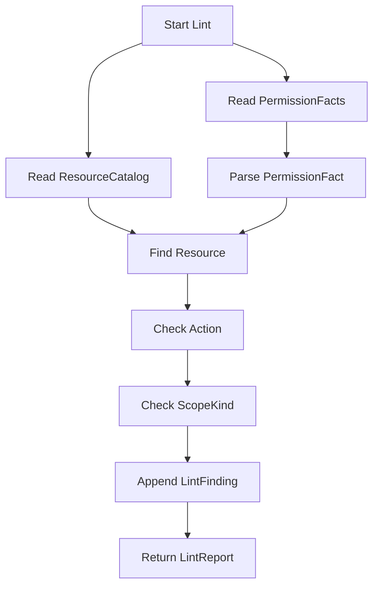

# 08-PolicyLinter 与授权事实治理

## 1. 本文定位

本文是 `03-授权AuthZ/` 文档组中关于 **授权事实治理** 的文档。

前面几篇文档已经解释了 AuthZ 的核心模型、读写链路和运行时传播：

```text
00-AuthZ模型总览：Subject -> RoleBinding -> Role -> Permission -> Resource / Action / Scope
01-授权资源与动作模型：ResourceKey / ResourcePattern / Action / Scope
02-授权角色与绑定模型：Role / RoleBinding / Subject
03-Check与Snapshot读链路：Check / Snapshot
04-授权写入链路：PolicyAdministration 与 PolicyChange
05-PolicyChangeCommitter 与 AuthZ UoW
06-Casbin运行时模型：p/g Facts 与四段 Matcher
07-PolicyVersion、Outbox 与 RuntimeReload
```

本文继续补齐 AuthZ 的治理视角，重点回答：

```text
已有授权事实是否仍然合理？
PermissionFacts 是否仍然能被 ResourceCatalog 解释？
ResourceCatalog 变更后，旧 PermissionFacts 如何检查？
PolicyLinter 能发现哪些问题？
PolicyLinter 为什么只读，不直接修复？
未来 PolicyReconciler 应该如何设计？
```

本文重点讲：

```text
PolicyLinter
PermissionFacts
ResourceCatalog
LintFinding
missing_resource
unsupported_action
unsupported_scope_kind
invalid_permission_fact
uncheckable_action_pattern
PolicyReconciler boundary
```

最后一篇会把 AuthZ 的分层架构和事实源索引收束起来：

```text
09-AuthZ分层架构与事实源索引.md
```

---

## 2. 30 秒结论

PolicyLinter 是 AuthZ 的只读诊断工具。

它不做授权判定，也不做授权写入。

它负责检查：

```text
数据库中的 PermissionFacts 是否仍然能被当前 ResourceCatalog 合理解释。
```

核心输入是：

```text
PermissionFacts
ResourceCatalog
```

核心输出是：

```text
LintReport
  -> []LintFinding
```

典型 finding 包括：

| Finding | 含义 |
| --- | --- |
| missing_resource | PermissionFact 引用了不存在的 Resource |
| unsupported_action | PermissionFact 中的 action 不被 Resource 支持 |
| unsupported_scope_kind | PermissionFact 中的 scope kind 不被 Resource 支持 |
| invalid_permission_fact | PermissionFact 格式或语义非法 |
| uncheckable_action_pattern | action pattern 无法被可靠检查 |

一句话：

> PolicyLinter 是授权事实治理的第一阶段：它只负责发现问题，不直接修复；真正修复必须通过未来 PolicyReconciler 生成 PolicyChange，并交给 PolicyChangeCommitter 提交。

---

## 3. 为什么需要 PolicyLinter

AuthZ 写入链路已经通过：

```text
Command Constructor
PolicyAdministration
AuthorizationPolicy
PolicyChangeCommitter
```

尽量保证新增授权事实是合法的。

但是，系统长期运行后仍然可能出现治理问题。

例如：

```text
ResourceCatalog 后续发生调整
某个 Resource 删除了 action
某个 Resource 删除了 scope kind
历史数据中存在旧格式 resource key
人工修库造成 casbin_rule 脏数据
迁移脚本处理不完整
旧版本 PermissionFact 残留
测试环境或初始化数据不符合新模型
```

这些问题不一定来自当前写入链路。

但它们会影响：

```text
Check 判定
Snapshot 展示
SDK 缓存
权限管理后台
安全审计
```

因此需要一个工具定期检查授权 facts 与当前资源目录是否一致。

这就是 PolicyLinter。

---

## 4. ResourceCatalog 与 PermissionFacts 的关系

### 4.1 ResourceCatalog 是授权资源目录

ResourceCatalog 记录当前系统有哪些可授权资源。

一个资源目录项通常包含：

```text
ResourceKey
AppName
Domain
Type
Actions
ScopeKinds
DisplayName
Description
```

例如：

```text
ResourceKey: iam:identity:user:*
Actions: list, read, create, update, disable, enable
ScopeKinds: all, origin
```

它回答：

```text
系统中哪些资源可以被授权？
这些资源支持哪些动作？
这些资源支持哪些 scope kind？
```

---

### 4.2 PermissionFacts 是授权运行时事实

PermissionFact 表示某个 Role 拥有什么能力。

领域语义是：

```text
Permission(
  RoleName,
  TenantID,
  ResourcePattern,
  ActionPattern,
  Scope,
)
```

运行时通常映射为 Casbin `p` fact：

```text
p, role:<roleName>, tenantID, resourcePattern, actionPattern, scope
```

例如：

```text
p, role:iam:admin, default, iam:identity:user:*, read|update|delete, all:*
```

它表达：

```text
iam:admin 在 default tenant 下，
可以对 iam:identity:user:* 执行 read/update/delete，
scope 是 all:*。
```

---

### 4.3 两者为什么可能不一致

ResourceCatalog 与 PermissionFacts 的生命周期不同。

ResourceCatalog 可能变更：

```text
新增资源
删除资源
调整 actions
调整 scopeKinds
重命名 resource key
迁移两段 resource key 到四段 resource key
```

PermissionFacts 可能长期存在：

```text
历史授权记录
初始化权限
旧版本迁移数据
人工导入数据
```

因此会出现：

```text
PermissionFact 引用了已经不存在的 Resource
PermissionFact 使用了 Resource 不支持的 action
PermissionFact 使用了 Resource 不支持的 scope kind
PermissionFact 的 resource pattern 已经不是合法四段结构
```

PolicyLinter 就是用来发现这些不一致。

---

## 5. ResourceCatalog 变更的边界

### 5.1 ResourceCatalog 变更不会自动删除旧 PermissionFacts

当前 AuthZ 的设计是：

```text
ResourceCatalog 是 grant-time validation catalog。
已有 PermissionFacts 不会因为 ResourceCatalog 更新而自动失效。
```

例如：

```text
ResourceCatalog 中 iam:identity:user:* 原本支持 export
后来删除了 export
```

这不会自动删除已有：

```text
p, role:iam:admin, default, iam:identity:user:*, export, all:*
```

为什么不自动删？

因为自动删除授权事实是高风险操作。

它可能导致：

```text
线上权限突然失效
历史审计链路断裂
误删仍然需要保留的兼容权限
多实例 runtime reload 顺序复杂
误操作难以恢复
```

因此，当前采取更稳妥的策略：

```text
ResourceCatalog 变更只影响后续 grant-time 校验。
历史 PermissionFacts 由 PolicyLinter 检查。
修复动作必须显式执行。
```

---

### 5.2 为什么不能在 Resource 更新时强制 reconcile

理论上可以在 Resource 更新时自动 reconcile。

但这样会让 ResourceCatalog 写入链路变得很重：

```text
更新 Resource
扫描所有 PermissionFacts
判断哪些 facts 已失效
自动 revoke
递增 PolicyVersion
stage Outbox event
RuntimeReload
```

这会带来几个问题：

```text
一次资源编辑可能触发大量授权变更
管理员可能没有意识到会批量撤权
自动修复策略难以确定
误删除风险高
事务时间可能很长
```

因此，更合理的分阶段策略是：

```text
第一阶段：ResourceCatalog 更新只更新目录
第二阶段：PolicyLinter 发现不一致
第三阶段：人工确认或 PolicyReconciler 生成修复计划
第四阶段：修复通过 PolicyChangeCommitter 提交
```

---

## 6. PolicyLinter 的输入与输出

### 6.1 输入：PermissionFacts

PolicyLinter 需要读取当前已有 PermissionFacts。

这些 facts 通常来自：

```text
casbin_rule 中的 p rules
```

抽象后可以理解为：

```text
PermissionFactReader.ListPermissionFacts(ctx)
```

每条 PermissionFact 至少包含：

```text
RoleName
TenantID
ResourcePattern
ActionPattern
Scope
```

---

### 6.2 输入：ResourceCatalog

PolicyLinter 还需要读取 ResourceCatalog。

它用 ResourceCatalog 判断：

```text
ResourcePattern 是否能对应到已登记资源
ActionPattern 是否被资源支持
Scope kind 是否被资源支持
```

因此需要依赖：

```text
ResourceRepository
ResourceCatalogReader
```

---

### 6.3 输出：LintReport

PolicyLinter 的输出应该是一个只读报告：

```text
LintReport
  Findings []LintFinding
```

每个 finding 包含：

```text
Code
RoleName
TenantID
ResourceKey / ResourcePattern
Action
Scope
Message
```

这个报告用于：

```text
管理后台展示
运维排查
定时检查日志
metrics / alert
未来 reconcile proposal 输入
```

---

## 7. Finding 分类

### 7.1 missing_resource

`missing_resource` 表示 PermissionFact 引用了 ResourceCatalog 中不存在的资源。

例如：

```text
PermissionFact:
  resource = iam:legacy:user:*

ResourceCatalog:
  不存在 iam:legacy:user:*
```

可能原因：

```text
资源已删除
资源 key 迁移不完整
初始化数据错误
历史版本遗留
人工修改 casbin_rule
```

治理建议：

```text
确认该资源是否仍然应该存在
如果应该存在，补回 ResourceCatalog
如果不应该存在，通过 revoke / reconcile 移除 PermissionFact
```

---

### 7.2 unsupported_action

`unsupported_action` 表示 PermissionFact 中的 action 不被对应 Resource 支持。

例如：

```text
Resource:
  iam:identity:user:*
  actions = read, list, update

PermissionFact:
  resource = iam:identity:user:*
  action = export
```

`export` 不在资源支持动作中。

可能原因：

```text
ResourceCatalog 后续删除了 export
历史权限未清理
初始化权限写错
ActionPattern 过宽
```

治理建议：

```text
确认 export 是否应该成为合法 action
如果应该支持，更新 ResourceCatalog
如果不应该支持，撤销对应 PermissionFact
```

---

### 7.3 unsupported_scope_kind

`unsupported_scope_kind` 表示 PermissionFact 中的 scope kind 不被对应 Resource 支持。

例如：

```text
Resource:
  qs:evaluation:report:*
  scopeKinds = all

PermissionFact:
  resource = qs:evaluation:report:*
  scope = origin:1001
```

如果 ResourceCatalog 没有声明支持 `origin`，则该 fact 不一致。

可能原因：

```text
ResourceCatalog scopeKinds 缺失
历史 Permission 使用了旧 scope kind
业务权限范围模型调整
```

治理建议：

```text
确认 origin 是否应该被该资源支持
如果应该支持，补充 ResourceCatalog scopeKinds
如果不应该支持，撤销或迁移 PermissionFact
```

---

### 7.4 invalid_permission_fact

`invalid_permission_fact` 表示 PermissionFact 本身格式或语义非法。

例如：

```text
resource 不是四段结构
action pattern 为空
scope 格式非法
tenantID 为空
roleName 非法
```

这类问题通常说明：

```text
历史数据不符合当前模型
迁移脚本遗漏
人工写入了脏数据
旧版本代码绕过了领域构造函数
```

治理建议：

```text
优先定位数据来源
补充迁移脚本或修复脚本
通过标准写链路清理或重建 facts
```

---

### 7.5 uncheckable_action_pattern

`uncheckable_action_pattern` 表示 PermissionFact 中的 ActionPattern 太复杂，PolicyLinter 无法可靠判断它是否被 Resource 支持。

例如：

```text
action = read.*
action = .*
action = ^(read|list)$
```

如果 ResourceCatalog 只列出具体动作：

```text
read
list
update
```

那么 Linter 可能无法可靠判断某个复杂正则是否只覆盖合法动作。

治理建议：

```text
尽量使用明确动作集合，如 read|list
谨慎使用 .*
对超级管理员权限建立白名单或特殊规则
对复杂 action pattern 标记为需要人工确认
```

---

## 8. PolicyLinter 的检查流程

PolicyLinter 的基本流程可以抽象为：

```text
1. 读取所有 PermissionFacts
2. 读取 ResourceCatalog
3. 对每条 PermissionFact 解析 ResourcePattern / ActionPattern / Scope
4. 查找匹配的 Resource
5. 检查 action 是否被 Resource 支持
6. 检查 scope kind 是否被 Resource 支持
7. 生成 LintFinding
8. 返回 LintReport
```

流程图：



注意：

```text
PolicyLinter 不调用 PolicyChangeCommitter。
PolicyLinter 不修改 PermissionFacts。
PolicyLinter 不触发 RuntimeReload。
```

---

## 9. ActionPattern 检查策略

### 9.1 具体 action

如果 ActionPattern 是具体 action：

```text
read
```

检查很简单：

```text
read 是否在 Resource.Actions 中？
```

---

### 9.2 动作集合

如果 ActionPattern 是动作集合：

```text
read|list|export
```

可以拆成：

```text
read
list
export
```

然后逐个检查是否被 Resource 支持。

如果其中一个不支持，就报告：

```text
unsupported_action
```

---

### 9.3 全匹配模式

如果 ActionPattern 是：

```text
.*
```

这表示匹配所有动作。

它可能是超级管理员的合理权限，也可能是过宽授权。

PolicyLinter 可以选择两种策略：

```text
策略一：将 .* 视为 uncheckable_action_pattern，需要人工确认
策略二：如果角色在 super admin 白名单中，则允许
```

建议不要默认把 `.*` 当作完全安全。

---

### 9.4 复杂正则

如果 ActionPattern 是复杂正则：

```text
^read_(own|all)$
```

Linter 很难完全判断它是否只覆盖 Resource.Actions 中列出的动作。

此时更稳妥的处理是：

```text
报告 uncheckable_action_pattern
交给人工或后续更强规则处理
```

---

## 10. ResourcePattern 检查策略

### 10.1 精确资源族

如果 PermissionFact 使用：

```text
iam:identity:user:*
```

而 ResourceCatalog 中存在同样 ResourceKey：

```text
iam:identity:user:*
```

则可以直接匹配。

---

### 10.2 app / domain / type 通配

如果 PermissionFact 使用：

```text
iam:*:*:*
```

它可能覆盖多个 Resource。

Linter 可以有两种策略：

```text
策略一：只要能匹配到至少一个 Resource，就继续检查 action/scope 是否被所有匹配资源支持
策略二：将宽 pattern 标记为需要人工确认
```

更安全的做法是：

```text
宽 pattern 必须对所有匹配 Resource 的 action/scope 都成立，否则报告 finding。
```

例如：

```text
PermissionFact: iam:*:*:* / export / all:*
```

如果 IAM 下只有部分资源支持 `export`，就应该报告 unsupported_action。

---

### 10.3 全局通配

如果 PermissionFact 使用：

```text
*:*:*:*
```

这通常是超级管理员权限。

PolicyLinter 不应该简单认为它总是合法。

建议策略是：

```text
对全局通配建立显式白名单
没有白名单时报告需要人工确认
```

否则容易把过宽权限长期隐藏在系统中。

---

## 11. Scope 检查策略

### 11.1 Scope kind 检查

Scope 通常形如：

```text
all:*
origin:1001
```

PolicyLinter 主要检查：

```text
scope kind 是否被 Resource.ScopeKinds 支持
```

例如：

```text
Scope: origin:1001
ScopeKind: origin
```

如果 Resource 只支持：

```text
all
```

则报告：

```text
unsupported_scope_kind
```

---

### 11.2 Scope value 不一定由 Linter 校验

PolicyLinter 通常不应该检查：

```text
origin:1001 中的 1001 是否真实存在
```

因为这可能需要访问业务域数据。

例如：

```text
origin 可能表示 user id
origin 可能表示 profile id
origin 可能表示 organization id
origin 可能表示外部系统 id
```

这类检查应该属于更高层治理或业务域校验。

PolicyLinter 的基础职责是：

```text
scope 格式合法
scope kind 被 Resource 支持
```

---

## 12. REST 入口与使用方式

PolicyLinter 可以通过内部管理接口触发。

例如：

```text
GET /authz/policies/lint
```

响应可以包含：

```json
{
  "findings": [
    {
      "code": "unsupported_action",
      "role_name": "iam:admin",
      "tenant_id": "default",
      "resource_key": "iam:identity:user:*",
      "action": "export",
      "scope": "all:*",
      "message": "resource does not support action export"
    }
  ]
}
```

这个接口适合：

```text
管理员手动检查
运维排查权限问题
部署后验证 migration 结果
定期任务调用
CI / staging 环境校验
```

生产环境要注意权限控制。

因为它可能暴露完整授权事实。

---

## 13. PolicyLinter 与 Check 的区别

PolicyLinter 不是授权判定。

Check 回答：

```text
某个 Subject 能不能访问某个 Resource？
```

PolicyLinter 回答：

```text
已有 PermissionFacts 是否与 ResourceCatalog 一致？
```

两者对比：

| 项目 | Check | PolicyLinter |
| --- | --- | --- |
| 类型 | 在线授权判定 | 离线或管理面诊断 |
| 输入 | Subject / Tenant / Resource / Action / Scope | PermissionFacts / ResourceCatalog |
| 输出 | AuthorizationDecision | LintReport |
| 是否修改数据 | 否 | 否 |
| 是否用于请求准入 | 是 | 否 |
| 是否面向治理 | 间接 | 是 |

不要用 PolicyLinter 替代 Check。

也不要在 Check 链路里同步运行 Linter。

---

## 14. PolicyLinter 与 RuntimeReload 的区别

PolicyLinter 检查：

```text
事实是否合理
```

RuntimeReload 解决：

```text
运行时是否加载了事实
```

两个问题完全不同。

例如：

```text
PermissionFact 合理，但 runtime 没 reload
```

这时 Linter 可能没有 finding，但 Check 仍然可能失败。

再比如：

```text
runtime 已经 reload，但 PermissionFact 引用了不存在的 Resource
```

这时 Check 可能仍按 runtime matcher 工作，但 Linter 会指出治理问题。

因此排查权限问题时要区分：

```text
fact correctness
runtime freshness
```

---

## 15. PolicyLinter 为什么不能自动修复

### 15.1 自动修复风险高

PolicyLinter 发现问题后，不能直接删除 PermissionFact。

原因是：

```text
无法确定业务是否仍需要兼容权限
宽 pattern 可能是有意设计
ResourceCatalog 可能缺配置，而不是 PermissionFact 错
删除权限是安全敏感操作
直接修改 facts 会绕过 PolicyVersion / Outbox / RuntimeReload
```

因此，PolicyLinter 必须是只读工具。

---

### 15.2 修复必须走标准写链路

如果未来要修复，必须走：

```text
PolicyReconciler
  -> PolicyChange
  -> PolicyChangeCommitter
```

这样才能保证：

```text
修复动作被审计
PermissionFacts 正确变更
PolicyVersion 正确递增
Outbox event 正确 stage
Runtime policy 正确 reload
```

不能直接：

```text
DELETE FROM casbin_rule WHERE ...
```

---

## 16. 未来 PolicyReconciler 的边界

### 16.1 PolicyReconciler 是什么

PolicyReconciler 是未来可能引入的写侧治理工具。

它负责把 LintFinding 转化为可执行的修复计划。

例如：

```text
unsupported_action -> RevokePermission proposal
missing_resource -> RevokePermission proposal 或补 Resource proposal
unsupported_scope_kind -> RevokePermission / MigrateScope proposal
```

注意：

```text
PolicyLinter 负责发现问题。
PolicyReconciler 负责生成修复计划。
PolicyChangeCommitter 负责提交修复。
```

三者不能混在一起。

---

### 16.2 Reconciler 不应自动执行高风险修复

即使有 PolicyReconciler，也不建议默认自动执行所有修复。

更稳妥的流程是：

```text
1. Linter 生成 findings
2. Reconciler 生成 repair proposal
3. 管理员审阅 proposal
4. 执行确认后的 repair command
5. 生成 PolicyChange
6. PolicyChangeCommitter 提交
```

对于低风险问题可以自动修复。

例如：

```text
明显非法格式的测试数据
staging 环境中的历史脏数据
```

但生产权限修复应该谨慎。

---

### 16.3 Reconcile 也必须版本化

任何修复只要改变 PermissionFacts，就必须：

```text
递增 PolicyVersion
stage Outbox event
触发 RuntimeReload
```

否则会出现：

```text
事实被修复了，但 Check runtime 仍然旧
SDK snapshot 缓存没有失效
其他实例没有 reload
审计无法追踪修复动作
```

因此 Reconciler 不能直接写库。

它必须通过 PolicyChangeCommitter。

---

## 17. 典型治理场景

### 17.1 Resource 删除后的历史权限

场景：

```text
删除 ResourceCatalog 中的 qs:evaluation:legacy_report:*
```

但 PermissionFacts 中仍存在：

```text
p, role:qs:admin, tenant-a, qs:evaluation:legacy_report:*, read, all:*
```

Linter finding：

```text
missing_resource
```

处理建议：

```text
确认 legacy_report 是否确实废弃
如果废弃，通过 RevokePermission / Reconciler 移除 fact
如果未废弃，恢复 ResourceCatalog
```

---

### 17.2 action 收缩后的旧权限

场景：

```text
Resource iam:identity:user:* 不再支持 export
```

但 PermissionFacts 中仍存在：

```text
p, role:iam:admin, default, iam:identity:user:*, export, all:*
```

Linter finding：

```text
unsupported_action
```

处理建议：

```text
确认 export 是否应重新加入 Resource.Actions
如果不应该支持，撤销对应 PermissionFact
```

---

### 17.3 scope kind 调整后的旧权限

场景：

```text
Resource qs:evaluation:report:* 从支持 origin 改为只支持 all
```

但 PermissionFacts 中仍存在：

```text
p, role:qs:evaluator, tenant-a, qs:evaluation:report:*, read, origin:1001
```

Linter finding：

```text
unsupported_scope_kind
```

处理建议：

```text
确认 origin 是否应继续支持
如果不支持，迁移或撤销旧 fact
```

---

### 17.4 旧两段 ResourceKey 残留

场景：

```text
p, role:iam:admin, default, iam:user, read, all:*
```

当前 Resource 模型要求四段：

```text
<app>:<domain>:<type>:<name-or-*>
```

Linter finding：

```text
invalid_permission_fact
```

处理建议：

```text
补 migration
映射为 iam:identity:user:*
通过标准写链路重建权限
删除旧 fact
```

---

## 18. 与测试和 CI 的关系

PolicyLinter 不只适合线上管理接口。

也适合在测试和 CI 中使用。

典型做法：

```text
初始化 bootstrap 权限后运行 Linter
migration 后运行 Linter
staging 部署后运行 Linter
CI 中对 seed data 执行 Linter
```

目标是尽早发现：

```text
初始化权限引用了不存在的 resource
新增 Resource 忘了同步 actions
迁移脚本没有处理历史 facts
测试数据仍使用旧 resource key
```

如果 Linter 在 CI 中发现 finding，可以选择：

```text
直接失败
或输出 warning
```

具体策略取决于环境。

生产环境更适合：

```text
定时 report + alert
```

而不是直接阻断服务。

---

## 19. 常见误区

### 19.1 PolicyLinter 是权限判定器

错误。

权限判定器是 Check / DecisionEngine。

PolicyLinter 是授权事实诊断工具。

---

### 19.2 PolicyLinter 会自动修复权限

错误。

PolicyLinter 只读。

修复必须通过 PolicyReconciler + PolicyChangeCommitter。

---

### 19.3 ResourceCatalog 更新会自动删除旧 PermissionFacts

错误。

当前设计中不会自动删除。

PolicyLinter 负责发现不一致，后续修复需要显式执行。

---

### 19.4 missing_resource 一定说明 PermissionFact 错

不一定。

也可能是 ResourceCatalog 缺了资源定义。

需要人工确认。

---

### 19.5 unsupported_action 一定要删除 PermissionFact

不一定。

也可能是 Resource.Actions 配置漏了该 action。

需要先确认资源模型。

---

### 19.6 `.*` 一定非法

不一定。

它可能是超级管理员权限。

但它应该被显式识别、白名单化或人工确认，而不是无感通过。

---

### 19.7 Linter 可以直接操作 casbin_rule

错误。

直接操作 casbin_rule 会绕过 PolicyVersion、Outbox、RuntimeReload 和审计。

---

## 20. 代码事实源

本文涉及的主要代码事实源：

```text
internal/apiserver/application/authz/policylint
internal/apiserver/application/authz/resource
internal/apiserver/domain/authz/resource
internal/apiserver/domain/authz/permission
internal/apiserver/domain/authz/scope
internal/apiserver/infra/mysql/casbinrule
internal/apiserver/transport/rest/authz
```

重点关注：

| 主题 | 事实源 |
| --- | --- |
| PolicyLinter | `application/authz/policylint` |
| LintReport / LintFinding | `application/authz/policylint` |
| PermissionFactReader | `infra/mysql/casbinrule` |
| ResourceCatalog | `application/authz/resource`、`domain/authz/resource` |
| Permission model | `domain/authz/permission` |
| Scope model | `domain/authz/scope` |
| Policy lint REST handler | `transport/rest/authz` |
| PolicyChangeCommitter | `application/authz/policy` |

如果本文与代码不一致，以代码事实源为准。

---

## 21. 本文总结

本文讲的是 AuthZ 的授权事实治理能力。

核心关系是：

```text
PermissionFacts
  + ResourceCatalog
  -> PolicyLinter
  -> LintReport / LintFinding
```

PolicyLinter 负责发现：

```text
missing_resource
unsupported_action
unsupported_scope_kind
invalid_permission_fact
uncheckable_action_pattern
```

但它不负责修复。

未来修复链路应该是：

```text
PolicyLinter
  -> PolicyReconciler
  -> PolicyChange
  -> PolicyChangeCommitter
  -> PolicyVersion
  -> Outbox
  -> RuntimeReload
```

如果只记住一句话：

> PolicyLinter 是 AuthZ 的只读治理工具，它检查 PermissionFacts 是否仍然符合 ResourceCatalog；发现问题后不能直接改 facts，必须通过显式修复计划和统一写入链路完成治理。
