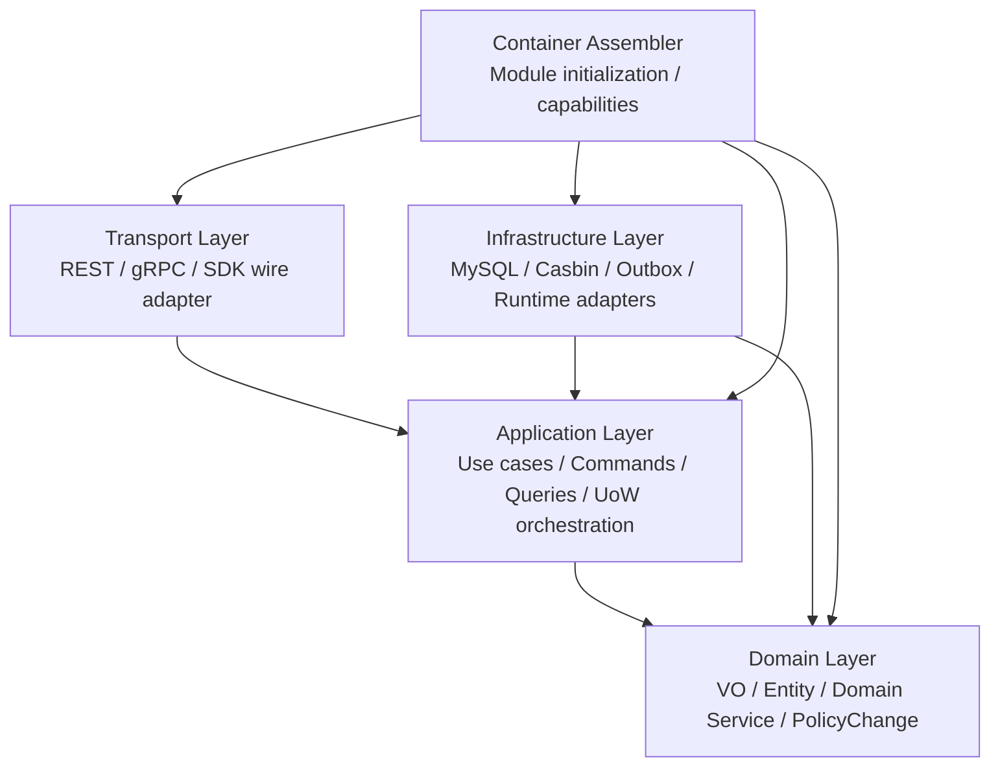

# 09-AuthZ 分层架构与事实源索引

## 1. 本文定位

本文是 `03-授权AuthZ/` 文档组的收束篇。

前面 8 篇文档分别解释了 AuthZ 的模型、读链路、写链路、运行时和治理能力：

```text
00-AuthZ模型总览：Subject -> RoleBinding -> Role -> Permission -> Resource / Action / Scope
01-授权资源与动作模型：ResourceKey / ResourcePattern / Action / Scope
02-授权角色与绑定模型：Role / RoleBinding / Subject
03-Check与Snapshot读链路：Check / Snapshot
04-授权写入链路：PolicyAdministration 与 PolicyChange
05-PolicyChangeCommitter 与 AuthZ UoW
06-Casbin运行时模型：p/g Facts 与四段 Matcher
07-PolicyVersion、Outbox 与 RuntimeReload
08-PolicyLinter 与授权事实治理
```

本文负责把这些内容从架构层面收束起来，回答：

```text
AuthZ 模块整体分几层？
每一层分别负责什么？
哪些代码是模型事实源？
哪些代码是应用服务事实源？
哪些代码是 infra/runtime 事实源？
REST/gRPC/SDK 与 AuthZ 的关系是什么？
container assembler 如何装配 AuthZ？
有哪些架构边界不能突破？
修改 AuthZ 时应该从哪里查事实源？
```

本文不是功能教程。

它是：

```text
架构地图
事实源索引
维护规则
防漂移检查清单
```

---

## 2. 30 秒结论

AuthZ 当前采用分层架构组织：

```text
transport
  -> application
  -> domain
  -> infra
  -> container assembler
```

更准确地说：

```text
Domain：表达授权领域模型和领域规则
Application：编排授权读写用例和事务边界
Infra：实现数据库、Casbin runtime、Outbox、UoW 等技术适配
Transport：REST/gRPC 协议适配，只做 DTO/proto 与 application command/query 的转换
Container：组合根，负责依赖构造和 capabilities 暴露
```

核心依赖方向应该是：

```text
transport -> application -> domain
infra -> application/domain ports
container -> 所有具体实现
```

禁止方向是：

```text
domain -> infra
domain -> casbin
application -> transport
transport -> infra/casbin
transport -> domain policy internals
业务代码直接调用 Casbin Enforce
```

一句话：

> AuthZ 的代码事实源分散在 domain/application/infra/transport/container 中，但领域语义必须从 domain 出发，用例编排必须经过 application，运行时事实必须封装在 infra，所有装配必须收口在 container assembler。

---

## 3. AuthZ 分层总览

AuthZ 的分层可以画成：



注意：图中的 `Container -> *` 表示组合根负责构造所有依赖。

它不是业务调用方向。

业务调用方向应该是：

```text
Transport -> Application -> Domain
```

Infra 通过实现 application/domain 所需端口被注入，而不是由 domain 主动依赖 infra。

---

## 4. Domain 层

### 4.1 Domain 层职责

AuthZ domain 层负责表达授权领域语言。

它回答：

```text
授权系统中有哪些核心概念？
这些概念有哪些不变量？
一次授权变更在领域上意味着什么？
一次授权判定请求应该如何表达？
```

Domain 层不关心：

```text
HTTP request
protobuf message
数据库表结构
Casbin p/g/v0/v1/v2
Outbox 表
Gin handler
GORM transaction
```

Domain 层应该只讲：

```text
Subject
Tenant
Role
Resource
Action
Scope
Permission
RoleBinding
AuthorizationRequest
AuthorizationDecision
AuthorizationPolicy
PolicyChange
PolicyVersion
```

---

### 4.2 Domain 子包结构

AuthZ domain 当前应该围绕语义子包组织：

```text
internal/apiserver/domain/authz/
├── subject
├── tenant
├── role
├── resource
├── scope
├── permission
├── rolebinding
├── decision
├── policy
└── model.go              # compatibility facade
```

其中：

| 子包 | 职责 |
| --- | --- |
| `subject` | SubjectRef、SubjectType |
| `tenant` | TenantID |
| `role` | Role、RoleName |
| `resource` | Resource、ResourceKey、ResourcePattern、Action、ActionPattern |
| `scope` | Scope、ScopeKind |
| `permission` | Permission 领域模型 |
| `rolebinding` | Binding、RoleBinding fact、SubjectResolver |
| `decision` | AuthorizationRequest、AuthorizationDecision |
| `policy` | AuthorizationPolicy、PolicyChange、PolicyVersion、Actor |
| `model.go` | 旧代码兼容 facade，后续应逐步退场 |

---

### 4.3 Domain 层核心事实源

AuthZ 领域模型事实源：

```text
internal/apiserver/domain/authz/subject
internal/apiserver/domain/authz/tenant
internal/apiserver/domain/authz/role
internal/apiserver/domain/authz/resource
internal/apiserver/domain/authz/scope
internal/apiserver/domain/authz/permission
internal/apiserver/domain/authz/rolebinding
internal/apiserver/domain/authz/decision
internal/apiserver/domain/authz/policy
```

常见查询入口：

| 想确认什么 | 看哪里 |
| --- | --- |
| Subject 支持哪些类型 | `domain/authz/subject` |
| TenantID 如何校验 | `domain/authz/tenant` |
| RoleName 如何解析 app | `domain/authz/role` |
| ResourceKey 是否必须四段 | `domain/authz/resource` |
| ResourcePattern 是否允许通配 | `domain/authz/resource` |
| Action 与 ActionPattern 区别 | `domain/authz/resource` |
| Scope 匹配语义 | `domain/authz/scope` |
| Permission 由哪些 VO 组成 | `domain/authz/permission` |
| RoleBinding fact 如何建模 | `domain/authz/rolebinding` |
| Check 请求和结果如何建模 | `domain/authz/decision` |
| PolicyChange 如何建模 | `domain/authz/policy` |

---

### 4.4 Domain 层禁止事项

Domain 层禁止出现：

```text
Casbin Enforcer
casbin_rule
p / g / v0 / v1 / v2 / v3 / v4 技术字段
GORM
Gin
protobuf message
HTTP status code
Outbox table
Redis / MySQL concrete client
```

Domain 层可以定义端口或领域服务，但不能依赖基础设施实现。

如果你发现 domain 层出现：

```text
Enforce
AddPolicy
RemovePolicy
GetRolesForUser
```

那就是架构污染。

---

## 5. Application 层

### 5.1 Application 层职责

AuthZ application 层负责用例编排。

它回答：

```text
一次 Check 请求如何被处理？
一次 Snapshot 查询如何被处理？
一次 GrantPermission 如何加载上下文并生成 PolicyChange？
一次 BindRole 如何校验 Subject 并提交授权变更？
PolicyChange 如何通过 UoW 提交？
PolicyLinter 如何读取 facts 并生成报告？
```

Application 层不应该关心：

```text
HTTP body 怎么绑定
gRPC proto 字段叫什么
Casbin p/g facts 如何存在数据库中
GORM transaction 如何实现
```

它应该关心：

```text
Command / Query
Use Case Service
Ports
UoW boundary
Domain object construction
PolicyChangeCommitter
```

---

### 5.2 Application 子包结构

AuthZ application 当前可以按用例组织：

```text
internal/apiserver/application/authz/
├── authorization
├── policy
├── role
├── resource
├── rolebinding
├── policylint
└── uow
```

其中：

| 子包 | 职责 |
| --- | --- |
| `authorization` | Check、Snapshot 读链路 |
| `policy` | Permission 写入、PolicyAdministration、PolicyChangeCommitter |
| `role` | RoleCatalog / RoleDirectory |
| `resource` | ResourceCatalog / ResourceDirectory |
| `rolebinding` | RoleBinding command / query 用例 |
| `policylint` | 授权事实只读诊断 |
| `uow` | AuthZ UoW 端口 |

---

### 5.3 Application command/query 事实源

读链路事实源：

```text
internal/apiserver/application/authz/authorization
```

重点对象：

```text
CheckCommand
NewCheckCommand
Checker
SnapshotQuery
NewSnapshotQuery
SnapshotReader
```

写链路事实源：

```text
internal/apiserver/application/authz/policy
internal/apiserver/application/authz/rolebinding
internal/apiserver/application/authz/role
internal/apiserver/application/authz/resource
```

重点对象：

```text
AddPermissionCommand
RemovePermissionCommand
PolicyAdministration
PolicyChangeCommitter
GrantCommand
RevokeCommand
CreateRoleCommand
UpdateRoleCommand
CreateResourceCommand
UpdateResourceCommand
```

治理事实源：

```text
internal/apiserver/application/authz/policylint
```

重点对象：

```text
Linter
LintReport
LintFinding
```

事务端口事实源：

```text
internal/apiserver/application/authz/uow
```

重点对象：

```text
AuthZ UoW interface
```

---

### 5.4 Application 层依赖规则

Application 可以依赖：

```text
domain/authz/*
application ports
shared code / errors / metadata
```

Application 不应该依赖：

```text
transport/rest
transport/grpc
infra/casbin concrete implementation
infra/mysql concrete repository implementation
Gin context
protobuf generated request objects
```

Application 可以定义端口，例如：

```text
DecisionEngine
SnapshotStore
RoleRepository
ResourceRepository
PolicyVersionReader
RuntimePolicyReloader
AuthorizationFactStore
```

Infra 负责实现这些端口。

---

## 6. Infra 层

### 6.1 Infra 层职责

AuthZ infra 层负责技术实现。

它回答：

```text
Role 如何存储到 MySQL？
Resource 如何存储到 MySQL？
RoleBinding 管理记录如何存储？
Permission / RoleBinding facts 如何映射到 casbin_rule？
PolicyVersion 如何持久化和并发递增？
Casbin runtime 如何 LoadPolicy / Check / Snapshot？
Outbox event 如何 stage？
```

Infra 层可以依赖具体技术：

```text
GORM
MySQL
Casbin
Outbox table
消息发布组件
```

但这些技术细节不应该向 domain/application 泄漏。

---

### 6.2 Infra 子包结构

AuthZ 相关 infra 主要包括：

```text
internal/apiserver/infra/casbin
internal/apiserver/infra/mysql/role
internal/apiserver/infra/mysql/resource
internal/apiserver/infra/mysql/rolebinding
internal/apiserver/infra/mysql/casbinrule
internal/apiserver/infra/mysql/policy
internal/apiserver/infra/mysql/uow
```

其中：

| 子包 | 职责 |
| --- | --- |
| `infra/casbin` | Casbin runtime、matcher、RuntimeAdapters、ReloadHealth |
| `infra/mysql/role` | Role repository |
| `infra/mysql/resource` | Resource repository |
| `infra/mysql/rolebinding` | RoleBinding 管理记录 repository |
| `infra/mysql/casbinrule` | p/g facts 持久化、PermissionFactReader |
| `infra/mysql/policy` | PolicyVersion repository |
| `infra/mysql/uow` | AuthZ UoW 事务实现 |

---

### 6.3 Casbin infra 事实源

Casbin runtime 事实源：

```text
internal/apiserver/infra/casbin
configs/casbin_model.conf
```

重点关注：

```text
CasbinAdapter
RuntimeAdapters
DecisionEngine wrapper
SnapshotStore wrapper
PolicyReloader wrapper
resourceMatch
actionMatch
scopeMatch
RuntimeHealthDetails
LoadPolicy
```

Casbin model 事实源：

```text
configs/casbin_model.conf
```

它必须包含：

```text
resourceMatch(r.obj, p.obj)
actionMatch(r.act, p.act)
scopeMatch(r.scope, p.scope)
```

不应该退回：

```text
keyMatch(r.obj, p.obj)
regexMatch(r.act, p.act)
```

---

### 6.4 MySQL infra 事实源

Role 存储：

```text
internal/apiserver/infra/mysql/role
```

Resource 存储：

```text
internal/apiserver/infra/mysql/resource
```

RoleBinding 管理记录：

```text
internal/apiserver/infra/mysql/rolebinding
```

Casbin facts 持久化：

```text
internal/apiserver/infra/mysql/casbinrule
```

PolicyVersion 持久化：

```text
internal/apiserver/infra/mysql/policy
```

AuthZ UoW 实现：

```text
internal/apiserver/infra/mysql/uow
```

---

### 6.5 Infra 层禁止事项

Infra 层可以知道技术细节，但不能反向拥有业务语义。

例如：

```text
infra/casbin 可以把 Permission 映射成 p fact
但不能决定一个 Role 是否应该拥有某个 Permission
```

```text
infra/mysql 可以保存 Resource
但不能绕过 Resource 领域构造函数写入非法 ResourceKey
```

```text
infra/mysql/casbinrule 可以执行 facts mutation
但不能绕过 PolicyChangeCommitter 成为授权写入入口
```

Infra 实现必须服务于 application/domain 的端口，而不是反过来主导业务流程。

---

## 7. Transport 层

### 7.1 Transport 层职责

Transport 层负责协议适配。

它回答：

```text
REST request 如何转换为 application command/query？
gRPC request 如何转换为 application command/query？
application result 如何转换为 REST/gRPC response？
```

Transport 层可以处理：

```text
HTTP path
HTTP method
JSON body
query params
protobuf message
status code mapping
```

但它不应该处理授权领域规则。

---

### 7.2 REST 事实源

REST AuthZ 事实源：

```text
internal/apiserver/transport/rest/authz
```

重点对象：

```text
CheckHandler
RoleHandler
ResourceHandler
PolicyHandler
RoleBindingHandler
DTOs
routes/register
```

REST handler 应该做：

```text
绑定请求参数
构造 application command/query
调用 application service
转换 response
```

REST handler 不应该：

```text
直接调用 Casbin Enforce
直接读写 casbin_rule
直接构造 PolicyChange
直接访问 infra/mysql repository
```

---

### 7.3 gRPC 事实源

gRPC AuthZ 事实源：

```text
internal/apiserver/transport/grpc/service/authz
```

重点对象：

```text
AuthorizationService
Check
GetAuthorizationSnapshot
GrantAssignment
RevokeAssignment
```

gRPC service 应该做：

```text
proto request -> application command/query
application result -> proto response
```

其中：

```text
Assignment 是对外 proto / SDK 术语
RoleBinding 是内部 application/domain 术语
```

---

### 7.4 Transport 层禁止事项

Transport 层禁止：

```text
直接 import infra/casbin
直接调用 Enforce / EnforceEx / GetRolesForUser
直接 import domain/authz/policy 内部对象并生成 PolicyChange
直接打开数据库事务
直接绕过 application command constructor
```

Transport 的核心原则是：

```text
只适配协议，不解释授权业务。
```

---

## 8. Container / Assembler 层

### 8.1 Container 层职责

Container assembler 是组合根。

它负责：

```text
构造 infra repositories
构造 domain validators / policies
构造 runtime adapters
构造 application services
暴露 AuthZ capabilities
把 capabilities 注入 REST/gRPC
```

它可以依赖所有层。

因为组合根的职责就是装配。

但业务逻辑不应该写在 assembler 里。

---

### 8.2 AuthZ module 初始化阶段

AuthZ 模块初始化可以按四段理解：

```text
initializeInfrastructure
initializeDomain
initializeRuntime
initializeApplication
```

分别负责：

| 阶段 | 职责 |
| --- | --- |
| Infrastructure | 构造 MySQL repositories、CasbinAdapter、UoW、facts store |
| Domain | 构造 domain validators、AuthorizationPolicy 所需依赖 |
| Runtime | 构造 route authorization、role readers、runtime health reporter |
| Application | 构造 Checker、SnapshotReader、PolicyAdministration、PolicyLinter、catalog services |

---

### 8.3 AuthZ capabilities

Assembler 最终应该暴露 AuthZ capabilities。

可以理解为：

```text
AuthZ 模块对外可用的应用能力集合
```

典型能力包括：

```text
Checker
SnapshotReader
RoleCatalog
ResourceCatalog
PolicyAdministration
RoleBindingService
PolicyLinter
RuntimeHealthReporter
RouteAuthorizer
```

REST / gRPC 不应该自己构造这些对象。

它们应该从 capabilities 获取。

---

### 8.4 Assembler 禁止事项

Assembler 不应该写业务规则。

例如不应该在 assembler 中判断：

```text
某个 Resource 是否支持某个 Action
某个 Subject 是否能绑定某个 Role
某个 Permission 是否应该生成
```

这些规则属于：

```text
Domain / Application
```

Assembler 只负责：

```text
把正确的实现注入正确的位置。
```

---

## 9. 关键运行链路与事实源

### 9.1 Check 链路事实源

链路：

```text
REST/gRPC/SDK
  -> NewCheckCommand
  -> Checker.Check
  -> AuthorizationRequest
  -> DecisionEngine
  -> Casbin Runtime
  -> AuthorizationDecision
```

事实源：

```text
application/authz/authorization

domain/authz/decision
infra/casbin
transport/rest/authz
transport/grpc/service/authz
```

---

### 9.2 Snapshot 链路事实源

链路：

```text
REST/gRPC/SDK
  -> NewSnapshotQuery
  -> SnapshotReader.Read
  -> SnapshotStore
  -> AuthorizationSnapshot
```

事实源：

```text
application/authz/authorization
infra/casbin
transport/rest/authz
transport/grpc/service/authz
```

---

### 9.3 Permission 写入链路事实源

链路：

```text
AddPermissionCommand / RemovePermissionCommand
  -> PolicyAdministration
  -> AuthorizationPolicy
  -> PolicyChange
  -> PolicyChangeCommitter
```

事实源：

```text
application/authz/policy
domain/authz/policy
domain/authz/permission
application/authz/uow
```

---

### 9.4 RoleBinding 写入链路事实源

链路：

```text
GrantCommand / RevokeCommand
  -> PolicyAdministration
  -> AuthorizationPolicy
  -> PolicyChange
  -> PolicyChangeCommitter
```

事实源：

```text
application/authz/rolebinding
application/authz/policy
domain/authz/rolebinding
domain/authz/policy
infra/mysql/rolebinding
infra/mysql/casbinrule
```

---

### 9.5 PolicyVersion / Outbox / Reload 事实源

链路：

```text
PolicyChangeCommitter
  -> PolicyVersionRepository
  -> EventStager / Outbox
  -> RuntimePolicyReloader
  -> RuntimeHealthDetails
```

事实源：

```text
application/authz/policy
infra/mysql/policy
infra/casbin
shared/authz
outbox / event modules
```

---

### 9.6 PolicyLinter 事实源

链路：

```text
PermissionFactReader
  + ResourceRepository
  -> PolicyLinter
  -> LintReport
```

事实源：

```text
application/authz/policylint
infra/mysql/casbinrule
application/authz/resource
infra/mysql/resource
transport/rest/authz
```

---

## 10. 数据事实源索引

### 10.1 Role 数据

Role 数据用于：

```text
角色管理
Permission 写入校验
RoleBinding 写入校验
Snapshot 展示
```

事实源：

```text
domain/authz/role
application/authz/role
infra/mysql/role
```

---

### 10.2 Resource 数据

Resource 数据用于：

```text
资源目录管理
Permission grant-time 校验
PolicyLinter 检查
```

事实源：

```text
domain/authz/resource
application/authz/resource
infra/mysql/resource
```

---

### 10.3 RoleBinding 管理记录

RoleBinding 管理记录用于：

```text
授权列表展示
按 ID 撤销
审计授权来源
```

事实源：

```text
domain/authz/rolebinding
application/authz/rolebinding
infra/mysql/rolebinding
```

---

### 10.4 AuthorizationFacts

AuthorizationFacts 用于：

```text
Check 判定
Snapshot 读取
Casbin runtime policy
PolicyLinter 检查
```

事实源：

```text
domain/authz/permission
domain/authz/rolebinding
infra/mysql/casbinrule
infra/casbin
```

---

### 10.5 PolicyVersion

PolicyVersion 用于：

```text
CheckResponse
AuthorizationSnapshot
Outbox version_changed event
RuntimeHealthDetails
SDK 缓存失效
```

事实源：

```text
domain/authz/policy
application/authz/policy
infra/mysql/policy
```

---

### 10.6 Outbox Events

Outbox events 用于：

```text
授权版本传播
跨实例 RuntimeReload
缓存失效通知
```

事实源：

```text
application/authz/policy
outbox / event stager modules
event relay / consumer modules
```

---

## 11. 架构护栏

### 11.1 为什么需要架构护栏

AuthZ 是安全敏感模块。

代码结构一旦漂移，很容易出现：

```text
transport 直接调用 Casbin
application 直接操作 infra/casbin
领域层出现 p/g facts
写入绕过 PolicyChangeCommitter
直接修改 casbin_rule
文档与代码事实源不一致
```

这些问题短期可能不报错，但会破坏长期可维护性和安全边界。

因此需要架构测试和人工 review 双重护栏。

---

### 11.2 应该保护的规则

建议持续保护这些规则：

```text
domain/authz 不允许依赖 Casbin
application/authz 不允许依赖 transport
transport/authz 不允许依赖 infra/casbin
transport/authz 不允许直接调用 Enforce / GetRolesForUser
新增代码不应继续依赖 domain/authz root facade
授权写入不应绕过 PolicyChangeCommitter
configs/casbin_model.conf 必须使用 resourceMatch / actionMatch / scopeMatch
```

这些规则应该尽量通过测试固化。

---

### 11.3 root authz facade 退场

`domain/authz/model.go` 当前是 compatibility facade。

它用于兼容旧代码。

但新代码应该直接 import 语义子包：

```text
domain/authz/subject
domain/authz/tenant
domain/authz/role
domain/authz/resource
domain/authz/scope
domain/authz/permission
domain/authz/rolebinding
domain/authz/decision
domain/authz/policy
```

后续维护策略：

```text
不新增 root facade 依赖
逐步清理测试 allowlist
大版本或稳定阶段考虑删除 facade
```

---

### 11.4 Casbin model 防漂移

Casbin model 是 runtime 判定关键事实源。

必须防止它退回旧 matcher。

应检查：

```text
configs/casbin_model.conf 包含 resourceMatch(r.obj, p.obj)
configs/casbin_model.conf 包含 actionMatch(r.act, p.act)
configs/casbin_model.conf 包含 scopeMatch(r.scope, p.scope)
configs/casbin_model.conf 不应使用 keyMatch(r.obj, p.obj)
configs/casbin_model.conf 不应使用 regexMatch(r.act, p.act)
```

否则四段 ResourcePattern 和 ActionPattern 的语义会被破坏。

---

## 12. 修改 AuthZ 时的检查清单

### 12.1 修改 Domain 模型时

检查：

```text
是否破坏 VO 不变量？
是否影响 application command constructor？
是否影响 infra mapper？
是否影响 Casbin facts 映射？
是否需要 migration？
是否需要更新文档 00/01/02？
```

---

### 12.2 修改 Resource / Action / Scope 时

检查：

```text
ResourceKey / ResourcePattern 规则是否变化？
Action / ActionPattern 规则是否变化？
Scope 匹配语义是否变化？
ResourceCatalog 校验是否需要更新？
PolicyLinter 是否需要更新？
Casbin matcher 是否需要更新？
```

对应文档：

```text
01-授权资源与动作模型
06-Casbin运行时模型
08-PolicyLinter与授权事实治理
```

---

### 12.3 修改 Check / Snapshot 时

检查：

```text
是否仍通过 NewCheckCommand / NewSnapshotQuery 进入？
是否仍返回 PolicyVersion？
是否区分参数错误、授权拒绝、系统错误？
是否绕过 DecisionEngine / SnapshotStore？
REST / gRPC / SDK 是否一致？
```

对应文档：

```text
03-Check与Snapshot读链路
```

---

### 12.4 修改授权写入时

检查：

```text
是否新增或修改 command constructor？
是否仍通过 PolicyAdministration？
是否仍由 AuthorizationPolicy 生成 PolicyChange？
是否仍通过 PolicyChangeCommitter 提交？
是否影响 PolicyVersion / Outbox / RuntimeReload？
```

对应文档：

```text
04-授权写入链路
05-PolicyChangeCommitter与AuthZUoW
07-PolicyVersion-Outbox与RuntimeReload
```

---

### 12.5 修改 Casbin runtime 时

检查：

```text
model.conf 是否同步？
resourceMatch / actionMatch / scopeMatch 是否仍符合领域语义？
p/g facts mapping 是否变化？
SnapshotStore 是否受影响？
RuntimeHealthDetails 是否受影响？
```

对应文档：

```text
06-Casbin运行时模型
07-PolicyVersion-Outbox与RuntimeReload
```

---

### 12.6 修改 PolicyLinter 时

检查：

```text
Finding code 是否需要补文档？
ResourcePattern 检查策略是否变化？
ActionPattern 检查策略是否变化？
ScopeKind 检查策略是否变化？
REST response DTO 是否变化？
未来 Reconciler 边界是否仍清晰？
```

对应文档：

```text
08-PolicyLinter与授权事实治理
```

---

## 13. 测试建议

### 13.1 Domain 单测

应覆盖：

```text
SubjectRef 构造
TenantID 构造
RoleName 构造和 app 解析
ResourceKey / ResourcePattern 构造
Action / ActionPattern 构造
Scope 构造与匹配
Permission 构造
RoleBinding / Binding 构造
AuthorizationRequest / Decision 构造
PolicyChange 构造
```

---

### 13.2 Application 单测

应覆盖：

```text
NewCheckCommand
NewSnapshotQuery
NewAddPermissionCommand
NewRemovePermissionCommand
NewGrantCommand
NewRevokeCommand
NewCreateRoleCommand
NewCreateResourceCommand
PolicyAdministration grant/revoke/bind/unbind
PolicyChangeCommitter 提交行为
PolicyLinter findings
```

---

### 13.3 Infra 集成测试

应覆盖：

```text
Casbin matcher resource/action/scope
p/g facts mapping
PolicyVersion 并发递增
UoW 事务回滚
Outbox event staging
LoadPolicy / RuntimeReload
MySQL repository mapper
migration 四段 ResourceKey
```

---

### 13.4 架构测试

应覆盖：

```text
domain 不依赖 infra/casbin
transport 不直接依赖 infra/casbin
application 不依赖 transport
禁止直接调用 Enforce
禁止恢复 assignment 内部包
禁止新增 root authz facade 依赖
casbin_model.conf matcher 防漂移
```

---

## 14. 文档维护规则

### 14.1 文档必须跟随代码事实源

如果代码变了，文档必须同步。

尤其是：

```text
ResourceKey 规则
ActionPattern 规则
Scope 匹配语义
PolicyChange 结构
Casbin matcher
PolicyLinter findings
REST/gRPC response 字段
```

这些一旦漂移，后续读者会被误导。

---

### 14.2 文档不要替代代码事实源

本文档是解释性文档。

不是最终事实源。

最终事实源仍然是：

```text
代码
migration
config
proto / OpenAPI / SDK 契约
测试
```

如果文档与代码冲突，以代码为准，并修正文档。

---

### 14.3 新增能力要补对应文档

例如未来新增：

```text
group subject 写入
service subject 写入
PolicyReconciler
ABAC condition
tenant-level incremental reload
更复杂 scope hierarchy
```

则应同步更新：

```text
00 模型总览
02 角色与绑定模型
04 写入链路
07 版本传播
08 治理文档
09 事实源索引
```

必要时新增专题文档，而不是把所有内容塞进已有文档。

---

## 15. AuthZ 与其他模块的边界

### 15.1 与 Identity 的边界

Identity 负责：

```text
User
Profile
ProfileLink
身份关系
```

AuthZ 负责：

```text
Subject
Role
Permission
Resource access
```

AuthZ 可以引用：

```text
user:<id>
```

但不应该持有完整 User 聚合。

Subject 是否存在由 SubjectResolver 处理。

---

### 15.2 与 AuthN 的边界

AuthN 负责：

```text
认证
登录
Token
Principal
Session / Refresh
```

AuthZ 负责：

```text
授权判定
角色绑定
权限事实
资源访问控制
```

典型链路是：

```text
AuthN 认证出 Principal
AuthZ 将 Principal 映射为 Subject
AuthZ Check 判断是否允许访问资源
```

不要把 Token 签发、登录流程、Account 模型放进 AuthZ。

---

### 15.3 与业务系统的边界

业务系统不应该理解 AuthZ 内部 p/g facts。

业务系统应该通过：

```text
REST Check
gRPC Check
SDK Allow / Check
AuthorizationSnapshot
```

接入权限。

业务系统应该传入：

```text
Subject
TenantID
ResourcePattern
Action
Scope
```

而不是传入：

```text
casbin sub/dom/obj/act/v0/v1
```

---

## 16. 当前阶段性边界

当前 AuthZ 已经完成：

```text
核心领域模型
Application command/query VO 化
Check / Snapshot 读链路
Grant / Revoke / Bind / Unbind 写链路
PolicyChangeCommitter + UoW
Casbin p/g facts runtime
PolicyVersion
Outbox staging
Local RuntimeReload
PolicyLinter REST 入口
架构护栏基础
```

后续仍可增强：

```text
group / service subject 写入开放
outbox-driven 多实例 RuntimeReload consumer
PolicyReconciler
更复杂 scope hierarchy
ABAC / condition policy
更完整 observability metrics
root authz facade 完全退场
```

这些不影响当前模型的稳定性。

但后续实现时必须遵守本文的分层边界。

---

## 17. 本文总结

本文收束了 AuthZ 模块的分层架构和事实源索引。

AuthZ 的核心分层是：

```text
Domain：授权领域模型与规则
Application：授权读写用例与事务编排
Infra：MySQL / Casbin / Outbox / Runtime 技术实现
Transport：REST / gRPC 协议适配
Container：依赖装配与 capabilities 暴露
```

核心依赖规则是：

```text
Transport -> Application -> Domain
Infra 实现 Application / Domain 所需端口
Container 负责装配所有依赖
```

核心维护原则是：

```text
领域语言不要被 Casbin 污染
写入链路不要绕过 PolicyChangeCommitter
读链路不要绕过 Check / Snapshot 应用服务
Transport 不解释授权业务
Infra 不主导领域规则
文档必须跟随代码事实源
```

如果只记住一句话：

> AuthZ 的架构核心是边界：领域模型在 domain，用例编排在 application，运行时和存储在 infra，协议适配在 transport，依赖装配在 container；所有授权事实修改必须经过统一写入链路，所有授权判定必须经过统一读链路。
