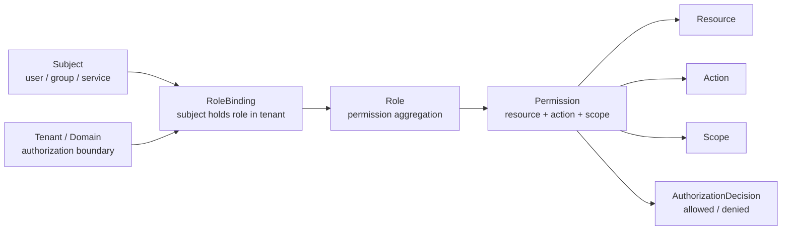
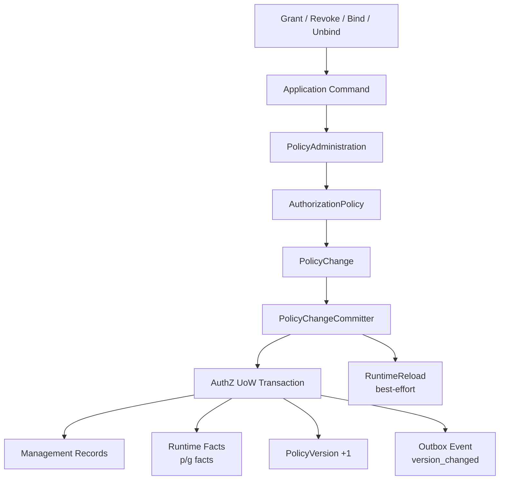
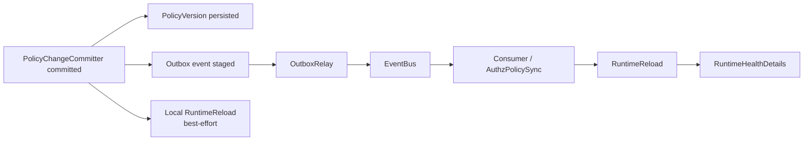
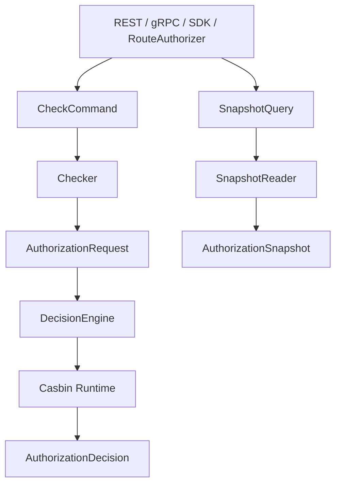
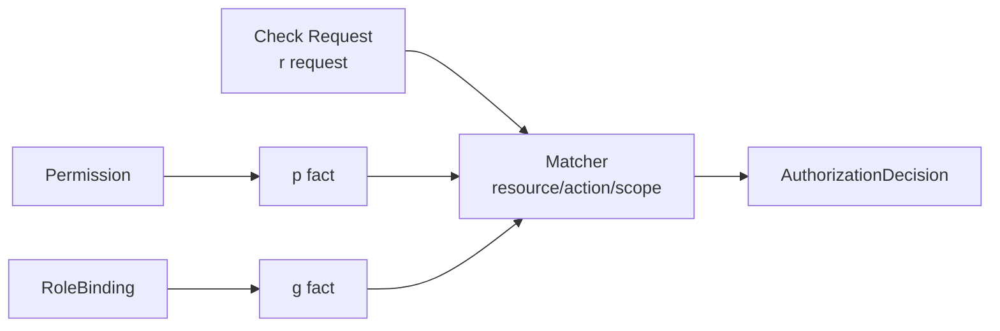

# 03-授权 AuthZ 文档总览

## 1. 模块定位

`03-授权AuthZ/` 用于说明 IAM 项目中 **授权（Authorization）模块** 的模型、链路、运行时、版本传播、分层架构与代码事实源。

AuthZ 回答的是：

```text
某个 Subject，在某个 Tenant / Authorization Domain 下，
能不能对某个 Resource 执行某个 Action，
并且满足某个 Scope？
```

换句话说，AuthZ 关注：

```text
访问权建模；
访问权写入；
访问权版本传播；
访问权判定；
运行时策略匹配；
授权事实治理。
```

AuthZ 不负责认证登录态。

以下内容属于 `02-认证AuthN/`：

```text
登录认证；
Principal 生成；
Token 签发；
Session；
RefreshToken；
JWT / JWS / JWK / JWKS；
Credential；
Challenge。
```

以下内容属于 `04-身份Identity/`：

```text
User；
Profile；
ProfileLink；
身份关系。
```

以下内容属于 `05-接入与契约/`：

```text
REST API 契约；
gRPC API 契约；
SDK 接入模型。
```

本目录专注于 AuthZ 自身：

```text
Subject；
Tenant / Authorization Domain；
Role；
Resource；
Action；
Scope；
Permission；
RoleBinding；
AuthorizationRequest；
AuthorizationDecision；
PolicyChange；
PolicyVersion；
Outbox；
RuntimeReload；
Casbin Runtime；
PolicyLinter。
```

---

## 2. 30 秒结论

AuthZ 不是：

```text
user.role == "admin"
```

也不是：

```text
直接增删改查 casbin_rule
```

AuthZ 的核心模型是：

```text
Subject
  -> RoleBinding
  -> Role
  -> Permission
  -> Resource / Action / Scope
  -> AuthorizationDecision
```

核心生命周期是：

```text
模型总览
  -> 资源模型
  -> 角色模型
  -> 授权写入
  -> 版本传播
  -> 权限检查
  -> Casbin Runtime
  -> 分层架构与事实源
```

授权写入链路是：

```text
Grant / Revoke / Bind / Unbind
  -> Application Command
  -> PolicyAdministration
  -> AuthorizationPolicy
  -> PolicyChange
  -> PolicyChangeCommitter
  -> AuthZ UoW
  -> Management Records + Runtime Facts + PolicyVersion + Outbox
```

版本传播链路是：

```text
PolicyChangeCommitter committed
  -> PolicyVersion persisted
  -> Outbox event staged
  -> local RuntimeReload(best-effort)
  -> OutboxRelay publishes authz.policy.version_changed
  -> consumers reload runtime
  -> RuntimeHealthDetails updated
```

权限检查链路是：

```text
RouteAuthorizer / REST / gRPC / SDK
  -> CheckCommand
  -> Checker
  -> AuthorizationRequest
  -> DecisionEngine
  -> Casbin Runtime
  -> AuthorizationDecision
```

一句话：

> AuthZ 用 Subject、Role、Permission、RoleBinding、Resource、Action、Scope 建模访问权；用 PolicyChangeCommitter 保证授权写入一致性；用 PolicyVersion / Outbox / RuntimeReload 维护运行时最终一致；用 Check / Snapshot 提供读能力；用 Casbin 作为 infra runtime engine；用 PolicyLinter 做授权事实只读诊断。

---

## 3. 文档目录

新版 `03-授权AuthZ/` 采用 00～07 的核心文档结构：

```text
03-授权AuthZ/
├── README.md
├── 00-AuthZ模型总览-Subject-Role-Resource-Permission-RoleBinding.md
├── 01-资源模型-ResourceKey-ResourcePattern-Action-Scope.md
├── 02-角色模型-Role-RoleBinding-Subject.md
├── 03-授权写入链路-PolicyAdministration-PolicyChange-PolicyChangeCommitter.md
├── 04-授权版本与事件传播链路-PolicyVersion-Outbox-RuntimeReload.md
├── 05-权限检查链路-Check-Snapshot.md
├── 06-Casbin运行时模型-pgFacts与四段Matcher.md
└── 07-AuthZ分层架构与事实源索引.md
```

| 文档 | 主题 |
| --- | --- |
| `00-AuthZ模型总览-Subject-Role-Resource-Permission-RoleBinding.md` | 建立 AuthZ 总模型：Subject、Role、Resource、Permission、RoleBinding、Decision、PolicyChange |
| `01-资源模型-ResourceKey-ResourcePattern-Action-Scope.md` | 说明 ResourceKey、ResourcePattern、Action、ActionPattern、Scope 边界 |
| `02-角色模型-Role-RoleBinding-Subject.md` | 说明 Subject、Role、RoleName、Tenant、RoleBinding、Assignment 边界 |
| `03-授权写入链路-PolicyAdministration-PolicyChange-PolicyChangeCommitter.md` | 说明 Grant/Revoke/Bind/Unbind 如何生成并提交 PolicyChange |
| `04-授权版本与事件传播链路-PolicyVersion-Outbox-RuntimeReload.md` | 说明 PolicyVersion、OutboxRelay、RuntimeReload、多实例最终一致 |
| `05-权限检查链路-Check-Snapshot.md` | 说明 Check、Snapshot、PEP/PDP、DecisionEngine、AuthorizationDecision |
| `06-Casbin运行时模型-pgFacts与四段Matcher.md` | 说明 Permission / RoleBinding 如何映射为 p/g facts，r request 如何进入 matcher |
| `07-AuthZ分层架构与事实源索引.md` | 统一收口分层架构、代码事实源、数据事实源、护栏、测试和维护规则 |

---

## 4. 推荐阅读顺序

### 4.1 标准顺序

第一次系统阅读 AuthZ，推荐按顺序读：

```text
00-AuthZ模型总览-Subject-Role-Resource-Permission-RoleBinding.md
  -> 01-资源模型-ResourceKey-ResourcePattern-Action-Scope.md
  -> 02-角色模型-Role-RoleBinding-Subject.md
  -> 03-授权写入链路-PolicyAdministration-PolicyChange-PolicyChangeCommitter.md
  -> 04-授权版本与事件传播链路-PolicyVersion-Outbox-RuntimeReload.md
  -> 05-权限检查链路-Check-Snapshot.md
  -> 06-Casbin运行时模型-pgFacts与四段Matcher.md
  -> 07-AuthZ分层架构与事实源索引.md
```

原因是：

```text
先建立模型；
再理解 Resource / Action / Scope；
再理解 Subject / Role / RoleBinding；
再理解授权事实如何写入；
再理解授权版本如何传播；
再理解权限如何检查；
再理解 Casbin Runtime 如何执行 matcher；
最后回到分层架构和代码事实源。
```

---

### 4.2 只想理解领域模型

推荐路径：

```text
00-AuthZ模型总览-Subject-Role-Resource-Permission-RoleBinding.md
  -> 01-资源模型-ResourceKey-ResourcePattern-Action-Scope.md
  -> 02-角色模型-Role-RoleBinding-Subject.md
```

重点关注：

```text
Subject；
Tenant / Authorization Domain；
Role / RoleName；
ResourceKey / ResourcePattern；
Action / ActionPattern；
Scope / ObjectScope；
Permission；
RoleBinding；
Assignment。
```

---

### 4.3 只想理解授权写入为什么复杂

推荐路径：

```text
03-授权写入链路-PolicyAdministration-PolicyChange-PolicyChangeCommitter.md
  -> 04-授权版本与事件传播链路-PolicyVersion-Outbox-RuntimeReload.md
  -> 07-AuthZ分层架构与事实源索引.md
```

重点关注：

```text
Application Command；
PolicyAdministration；
AuthorizationPolicy；
PolicyChange；
PolicyChangeCommitter；
AuthZ UoW；
Management Records；
Runtime Facts；
PolicyVersion；
Outbox；
RuntimeReload。
```

---

### 4.4 只想理解业务服务如何接入授权

推荐路径：

```text
05-权限检查链路-Check-Snapshot.md
  -> 06-Casbin运行时模型-pgFacts与四段Matcher.md
  -> ../05-接入与契约/
```

重点关注：

```text
RouteAuthorizer；
CheckCommand；
AuthorizationRequest；
DecisionEngine；
AuthorizationDecision；
SnapshotQuery；
AuthorizationSnapshot；
SDK Check / Allow / GetAuthorizationSnapshot。
```

---

### 4.5 只想理解 Casbin 在项目中的位置

推荐路径：

```text
06-Casbin运行时模型-pgFacts与四段Matcher.md
  -> 07-AuthZ分层架构与事实源索引.md
```

重点关注：

```text
Permission -> p fact；
RoleBinding -> g fact；
Check Request -> r request；
resourceMatch；
actionMatch；
scopeMatch；
configs/casbin_model.conf；
DecisionEngine；
RuntimeReload。
```

---

### 4.6 只想理解授权事实治理

推荐路径：

```text
07-AuthZ分层架构与事实源索引.md
  -> 01-资源模型-ResourceKey-ResourcePattern-Action-Scope.md
  -> 03-授权写入链路-PolicyAdministration-PolicyChange-PolicyChangeCommitter.md
```

重点关注：

```text
PolicyLinter；
ResourceCatalog；
PermissionFacts；
missing_resource；
unsupported_action；
unsupported_scope_kind；
PolicyReconciler boundary。
```

注意：

```text
PolicyLinter 是 read-only diagnosis，不是自动修复器。
自动修复必须走 PolicyReconciler -> PolicyChange -> PolicyChangeCommitter。
```

---

## 5. AuthZ 知识地图

```mermaid
flowchart TD
    AuthZ["03-授权 AuthZ"]

    Overview["00 模型总览"]
    Resource["01 资源模型"]
    Role["02 角色模型"]
    Write["03 授权写入"]
    Version["04 版本传播"]
    Read["05 权限检查"]
    Runtime["06 Casbin Runtime"]
    Architecture["07 分层与事实源"]

    AuthZ --> Overview
    AuthZ --> Resource
    AuthZ --> Role
    AuthZ --> Write
    AuthZ --> Version
    AuthZ --> Read
    AuthZ --> Runtime
    AuthZ --> Architecture

    Overview --> Subject["Subject"]
    Overview --> RoleBinding["RoleBinding"]
    Overview --> Permission["Permission"]
    Overview --> Decision["AuthorizationDecision"]

    Resource --> ResourceKey["ResourceKey / Pattern"]
    Resource --> Action["Action / Pattern"]
    Resource --> Scope["Scope"]

    Role --> RoleName["RoleName"]
    Role --> SubjectRef["SubjectRef"]
    Role --> Assignment["Assignment wire term"]

    Write --> Admin["PolicyAdministration"]
    Write --> Policy["AuthorizationPolicy"]
    Write --> Change["PolicyChange"]
    Write --> Committer["PolicyChangeCommitter"]

    Version --> PolicyVersion["PolicyVersion"]
    Version --> Outbox["Transactional Outbox"]
    Version --> Reload["RuntimeReload"]

    Read --> Check["Check"]
    Read --> Snapshot["Snapshot"]
    Read --> PDP["DecisionEngine"]

    Runtime --> Casbin["Casbin Runtime"]
    Runtime --> Matcher["resource/action/scope matcher"]

    Architecture --> Linter["PolicyLinter"]
    Architecture --> Guard["Architecture Guards"]
```



---

## 6. 授权模型主图



这张图表达：

```text
Subject 不直接拥有 Permission。
Subject 在 Tenant 下通过 RoleBinding 持有 Role。
Role 通过 Permission 声明 Resource / Action / Scope 能力。
最终 Check 返回 AuthorizationDecision。
```

---

## 7. 写链路主图



写链路表达的是：

```text
授权写入不是 CRUD。
授权写入的本质是生成 PolicyChange，并由 PolicyChangeCommitter 统一提交。
```

---

## 8. 版本传播主图



版本传播表达的是：

```text
PolicyVersion 让授权事实有版本；
Outbox 让版本变化可靠传播；
RuntimeReload 让进程内授权 runtime 追上数据库事实。
```

---

## 9. 读链路主图



读链路分为：

```text
Check：权威授权判定，回答“这次请求能不能过？”
Snapshot：授权事实视图，回答“这个主体当前有哪些角色和权限？”
```

---

## 10. Runtime 主图



核心映射是：

```text
Permission   -> p fact
RoleBinding  -> g fact
Check Request -> r request
```

核心 matcher 是：

```text
g(r.sub, p.sub, r.dom)
&& r.dom == p.dom
&& resourceMatch(r.obj, p.obj)
&& actionMatch(r.act, p.act)
&& scopeMatch(r.scope, p.scope)
```

---

## 11. 核心概念速查

| 概念 | 含义 |
| --- | --- |
| Subject | 被授权主体，如 user / group / service |
| Tenant / Authorization Domain | 授权域边界 |
| Role | 权限聚合点 |
| RoleName | 稳定业务角色标识 |
| ResourceKey | 资源目录 / 请求侧具体资源语义 |
| ResourcePattern | Permission 中的资源匹配表达式 |
| Action | 请求侧具体动作 |
| ActionPattern | Permission 中的动作匹配表达式 |
| Scope | 权限作用范围 |
| ObjectScope | 请求侧对象范围 |
| Permission | Role 对 Resource / Action / Scope 的能力声明 |
| RoleBinding | Subject 在 Tenant 下持有 Role 的授权事实 |
| Assignment | REST / proto / SDK 对外 wire term |
| AuthorizationRequest | 一次 Check 的领域请求 |
| AuthorizationDecision | 授权判定结果 |
| AuthorizationSnapshot | Subject 当前角色和权限快照 |
| PolicyChange | 授权事实变更计划 |
| PolicyChangeCommitter | 授权变更统一提交器 |
| PolicyVersion | Tenant 级授权事实版本 |
| Outbox | 授权事实与事件同事务机制 |
| RuntimeReload | 运行时策略刷新 |
| PolicyLinter | 授权事实只读诊断工具 |

---

## 12. AuthZ 与其他模块的关系

### 12.1 与 AuthN

AuthN 回答：

```text
你是谁？
你如何证明你是谁？
认证成功后如何表达 Principal？
```

AuthZ 回答：

```text
你能访问什么资源？
你能执行什么动作？
你的权限范围是什么？
```

典型关系是：

```text
AuthN 认证出 Principal；
AuthZ 将 Principal / UserID 映射为 Subject；
AuthZ Check 判断 Subject 是否允许访问 Resource。
```

---

### 12.2 与 Identity

Identity 负责：

```text
User；
Profile；
ProfileLink；
身份关系。
```

AuthZ 负责：

```text
Subject；
Role；
RoleBinding；
Permission；
Resource access。
```

ProfileLink 不是 Permission。

如果 Profile 操作需要资源权限，应通过：

```text
Resource；
Action；
Scope；
Check。
```

进入 AuthZ。

---

### 12.3 与 REST / gRPC / SDK

REST / gRPC / SDK 是接入层。

它们负责：

```text
协议请求 -> Application Command / Query；
Application Result -> 协议响应。
```

它们不应该：

```text
直接调用 Casbin Enforce；
直接操作 casbin_rule；
直接生成 PolicyChange；
直接打开 AuthZ UoW；
直接 stage Outbox event。
```

---

## 13. Casbin 的边界

必须明确：

```text
Casbin 是 infra 层 runtime policy engine，不是 IAM 的领域模型。
```

业务语言是：

```text
Subject；
Role；
Resource；
Permission；
RoleBinding；
Scope；
AuthorizationRequest；
AuthorizationDecision；
PolicyChange。
```

Casbin 技术语言是：

```text
p；
g；
sub；
dom；
obj；
act；
scope；
matcher。
```

边界是：

```text
Domain / Application 使用业务语言；
Infra / Casbin 负责把业务事实映射成 p/g facts；
Transport 不直接调用 Casbin Enforce；
业务系统不理解 p/g facts。
```

这条边界应由架构测试保护。

---

## 14. Assignment 与 RoleBinding 的边界

当前约定：

```text
assignment = REST / proto / SDK 对外 wire term
rolebinding = Application / Domain 内部标准术语
```

分层关系是：

| 层次 | 名称 |
| --- | --- |
| REST / proto / SDK | Assignment |
| Application / Domain | RoleBinding |
| Management DB | Binding record |
| Runtime Casbin | g fact |

不要恢复内部 `assignment` 包。

内部统一使用：

```text
rolebinding
```

这样 RBAC 语义更准确。

---

## 15. 代码事实源入口

更完整的事实源索引见：

```text
07-AuthZ分层架构与事实源索引.md
```

常用入口：

| 主题 | 代码入口 |
| --- | --- |
| AuthZ domain | `internal/apiserver/domain/authz` |
| AuthZ application | `internal/apiserver/application/authz` |
| Casbin runtime | `internal/apiserver/infra/casbin` |
| Casbin model | `configs/casbin_model.conf` |
| Casbin facts store | `internal/apiserver/infra/mysql/casbinrule` |
| MySQL repositories | `internal/apiserver/infra/mysql` |
| AuthZ UoW | `internal/apiserver/application/authz/uow` / infra UoW adapter |
| REST AuthZ | `internal/apiserver/transport/rest/authz` |
| gRPC AuthZ | `internal/apiserver/transport/grpc` |
| AuthZ assembler | `internal/apiserver/container/assembler` |
| 架构测试 | `internal/pkg/architecture` |

事实冲突时，优先级建议：

```text
源码运行行为
  -> 机器契约 / 配置 / migration
  -> 测试
  -> 当前文档
  -> 历史归档
```

---

## 16. 常见误区

### 16.1 AuthZ = user.role

错误。

IAM 的授权模型是：

```text
Subject
  -> RoleBinding
  -> Role
  -> Permission
  -> Resource / Action / Scope
```

`user.role` 无法表达资源、动作、tenant、scope、版本传播和跨服务 Check。

---

### 16.2 AuthZ = Casbin

错误。

Casbin 是 runtime policy engine。

IAM 的领域模型是 Subject、Role、Resource、Permission、RoleBinding、Scope。

Casbin p/g facts 只应该出现在 infra/casbin 和运行时事实层。

---

### 16.3 授权写入就是 CRUD

错误。

授权写入改变的是运行时授权事实。

一次写入可能同时影响：

```text
management records；
Permission / RoleBinding facts；
PolicyVersion；
Outbox event；
RuntimeReload。
```

---

### 16.4 Assignment 和 RoleBinding 是完全相同概念

不准确。

`assignment` 是对外契约术语。

`rolebinding` 是内部领域术语。

---

### 16.5 ProfileLink 可以替代 AuthZ

错误。

ProfileLink 是 Identity 关系，不是资源权限。

资源级访问仍应通过 AuthZ Resource / Action / Scope 判定。

---

### 16.6 Outbox 就是普通 MQ publish

错误。

Transactional Outbox 的关键是：

```text
业务事实和事件记录同事务提交；
relay 异步发布；
consumer 按 at-least-once 语义幂等处理。
```

---

### 16.7 PolicyLinter 会自动修复权限

错误。

PolicyLinter 是只读诊断工具。

修复必须通过未来：

```text
PolicyReconciler
  -> PolicyChange
  -> PolicyChangeCommitter
```

---

### 16.8 Check 请求侧可以传任意 ResourcePattern

错误。

Check 请求侧应该传具体资源语义：

```text
ResourceKey / request resource
```

Permission 侧才是：

```text
ResourcePattern
```

---

## 17. 验证建议

修改 AuthZ 文档或相关代码后，建议至少运行：

```bash
make docs-hygiene
```

AuthZ 应用与领域测试：

```bash
go test ./internal/apiserver/application/authz/... \
  ./internal/apiserver/domain/authz/...
```

Casbin / UoW / PolicyVersion 相关：

```bash
go test ./internal/apiserver/infra/casbin/... \
  ./internal/apiserver/infra/mysql/casbinrule/... \
  ./internal/apiserver/infra/mysql/policy/... \
  ./internal/apiserver/infra/mysql/uow/...
```

REST/gRPC 接入相关：

```bash
go test ./internal/apiserver/transport/rest/authz/... \
  ./internal/apiserver/transport/grpc/...
```

架构边界相关：

```bash
go test ./internal/pkg/architecture/...
```

涉及契约时，按项目当前命令运行：

```bash
make docs-swagger
make api-validate
make proto-gen
```

---

## 18. 维护规则

### 18.1 README 只做 AuthZ 模块入口

本 README 负责：

```text
说明 AuthZ 模块回答什么；
列出 00～07 核心文档；
提供阅读路径；
提供知识地图和事实源入口；
说明常见误区和维护规则。
```

详细模型和链路放到对应正文。

---

### 18.2 不把 AuthN 问题写进 AuthZ

AuthZ 不负责：

```text
密码验证；
登录方式选择；
Session 创建；
AccessToken 签发；
RefreshToken 轮换；
JWKS 发布。
```

这些属于 `02-认证AuthN/`。

---

### 18.3 不把 Identity 关系写成权限模型

ProfileLink 是 Identity 关系，不是 AuthZ Permission。

如果 Profile 操作需要资源权限，应通过：

```text
Resource；
Action；
Scope；
Check。
```

进入 AuthZ。

---

### 18.4 不把 Casbin 写成领域语言

文档中可以解释 Casbin 映射。

但领域语言必须优先使用：

```text
Subject；
Role；
Resource；
Permission；
RoleBinding；
Scope；
AuthorizationRequest；
AuthorizationDecision；
PolicyChange。
```

不要在领域说明中直接把 `p/g/sub/dom/obj/act` 写成业务模型。

---

### 18.5 不恢复旧 assignment 包

当前内部标准术语是：

```text
rolebinding
```

不要恢复：

```text
domain/authz/assignment；
application/authz/assignment；
infra/mysql/assignment。
```

---

### 18.6 不把 Outbox 讲成 exactly-once

当前 Outbox 语义应按：

```text
at-least-once；
consumer idempotency required。
```

来解释。

---

### 18.7 文档必须跟随代码事实源

如果这些事实变化，必须同步更新文档：

```text
ResourceKey 规则；
ActionPattern 规则；
Scope 匹配语义；
PolicyChange 结构；
Casbin matcher；
PolicyLinter findings；
REST/gRPC response 字段；
AuthZ capabilities。
```

---

## 19. 本文总结

`03-授权AuthZ/` 解释 IAM 如何处理资源级访问权。

核心心智是：

```text
AuthZ 不验证你是谁；
AuthZ 判断你能不能访问资源。

AuthZ 不是 user.role；
AuthZ 不是 Casbin 本身；
AuthZ 写入不是 CRUD；
AuthZ 版本传播不是普通 MQ publish。
```

模型主线是：

```text
Subject
  -> RoleBinding
  -> Role
  -> Permission
  -> Resource / Action / Scope
  -> AuthorizationDecision
```

写链路主线是：

```text
PolicyChange
  -> PolicyChangeCommitter
  -> AuthZ UoW
  -> Runtime Facts
  -> PolicyVersion
  -> Outbox Event
  -> RuntimeReload
```

读链路主线是：

```text
Check / Snapshot
  -> Checker / SnapshotReader
  -> Runtime / Store
  -> Decision / Snapshot
```

如果只记一句话：

> AuthZ 负责资源级访问判定，用 Role / Resource / Permission / RoleBinding 建模，用 PolicyChangeCommitter + UoW + PolicyVersion + Outbox 保证授权写入和版本传播一致性，用 Check / Snapshot 提供读能力，用 Casbin 做运行时判定，用 PolicyLinter 做授权事实治理。
