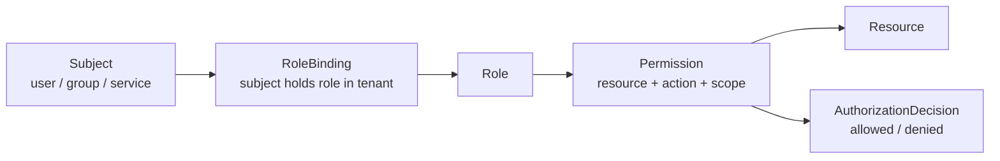
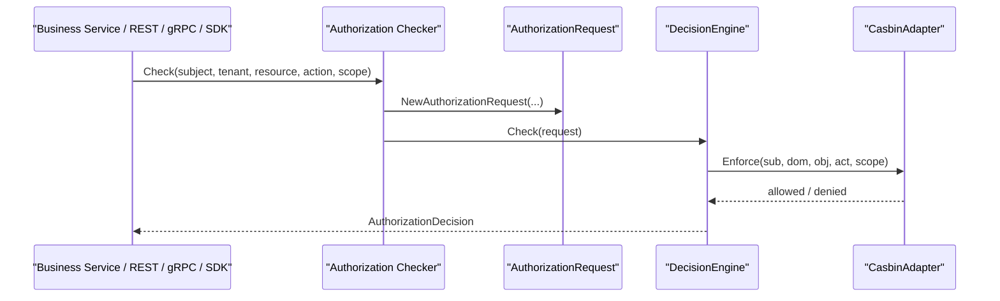
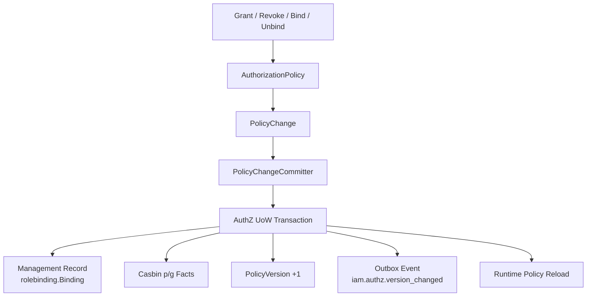

# 03-授权 AuthZ

## 本文回答

`03-授权AuthZ/` 是 IAM 文档体系中解释 **资源授权模型、授权判定链路、授权写入事务与授权版本传播** 的模块。

它回答：

1. IAM 如何表达“某个主体能不能访问某个资源”；
2. 为什么 AuthZ 不能只是 `user.role` 或普通 CRUD；
3. Role、Resource、Permission、RoleBinding、Scope 分别是什么；
4. 一次 `Check` 请求如何变成 `AuthorizationRequest` 并走到 Casbin；
5. Casbin 在 IAM 中为什么只是 infra runtime engine，而不是领域模型；
6. 授权写入为什么需要 `PolicyChangeCommitter + UoW`；
7. 为什么每次授权变更都要递增 `PolicyVersion`；
8. 为什么授权版本事件需要通过 Transactional Outbox 传播；
9. `assignment` 和 `rolebinding` 的分层边界是什么；
10. AuthZ 与 AuthN、Identity、REST/gRPC/SDK、架构护栏之间如何协作。

本目录只解释 **授权与访问权**。  
认证登录态属于 `02-认证AuthN/`；User/Profile/ProfileLink 身份关系属于 `04-身份Identity/`；接入协议属于 `05-接入与契约/`。

---

## 30 秒结论

AuthZ 负责回答：

```text
某个 subject 在某个 tenant 下，能不能对某个 resource 执行某个 action，并且满足某个 scope？
```

IAM 的 AuthZ 不是：

```text
user.role == "admin"
```

也不是：

```text
简单增删改查权限表
```

而是：

```text
Subject
  -> RoleBinding
  -> Role
  -> Permission
  -> Resource / Action / Scope
  -> AuthorizationDecision
```

授权判定链路是：

```text
CheckCommand
  -> AuthorizationRequest
  -> DecisionEngine
  -> CasbinAdapter
  -> AuthorizationDecision
```

授权写入链路是：

```text
Grant / Revoke / Bind / Unbind
  -> AuthorizationPolicy
  -> PolicyChange
  -> PolicyChangeCommitter
  -> AuthZ UoW
  -> AuthorizationFacts
  -> PolicyVersion
  -> Outbox Event
  -> Runtime Reload
```

一句话：

> **AuthZ 用 Role、Resource、Permission、RoleBinding 建模访问权，用 Casbin 做运行时判定，用 UoW + PolicyVersion + Outbox 保证授权写入和版本传播的一致性。**

---

## 本目录文档

当前 `03-授权AuthZ/` 建议包含 4 篇正文文档：

```text
03-授权AuthZ/
├── README.md
├── 01-授权模型--Role&Resource&Permission&RoleBinding.md
├── 02-授权判定链路--从Check到Casbin.md
├── 03-PolicyChangeCommitter与UoW.md
└── 04-授权版本事件与Outbox.md
```

| 文档 | 作用 | 读完后应该能回答 |
|---|---|---|
| `01-授权模型--Role&Resource&Permission&RoleBinding.md` | 解释授权领域模型 | Role、Resource、Permission、RoleBinding、Scope 如何组织 |
| `02-授权判定链路--从Check到Casbin.md` | 解释一次授权判定 | Check 如何变成 AuthorizationRequest，如何通过 CasbinAdapter 得到 Decision |
| `03-PolicyChangeCommitter与UoW.md` | 解释授权写入事务 | 为什么授权写入不是 CRUD，PolicyChangeCommitter 如何编排 UoW |
| `04-授权版本事件与Outbox.md` | 解释版本传播 | PolicyVersion、version_changed event、Transactional Outbox、runtime reload 如何协作 |

---

## AuthZ 知识地图

```mermaid
flowchart TD
    AuthZ["03-授权 AuthZ"]

    Model["01 授权模型"]
    Check["02 授权判定链路"]
    Write["03 PolicyChangeCommitter 与 UoW"]
    Event["04 授权版本事件与 Outbox"]

    AuthZ --> Model
    AuthZ --> Check
    AuthZ --> Write
    AuthZ --> Event

    Model --> Subject["Subject"]
    Model --> Role["Role"]
    Model --> Resource["Resource"]
    Model --> Permission["Permission"]
    Model --> RoleBinding["RoleBinding"]
    Model --> Scope["Scope"]

    Check --> Request["AuthorizationRequest"]
    Check --> Decision["AuthorizationDecision"]
    Check --> Engine["DecisionEngine"]
    Check --> Casbin["CasbinAdapter"]

    Write --> Policy["AuthorizationPolicy"]
    Write --> Change["PolicyChange"]
    Write --> Committer["PolicyChangeCommitter"]
    Write --> UOW["AuthZ UnitOfWork"]
    Write --> Facts["AuthorizationFacts"]

    Event --> Version["PolicyVersion"]
    Event --> VersionEvent["iam.authz.version_changed"]
    Event --> Outbox["Transactional Outbox"]
    Event --> Reload["Runtime Reload"]
```



---

## 推荐阅读顺序

### 标准顺序

```text
01-授权模型--Role&Resource&Permission&RoleBinding
  -> 02-授权判定链路--从Check到Casbin
  -> 03-PolicyChangeCommitter与UoW
  -> 04-授权版本事件与Outbox
```

原因：

1. 先理解授权模型；
2. 再理解读链路，也就是 Check；
3. 再理解写链路，也就是授权策略变更；
4. 最后理解授权版本如何传播给下游。

---

### 如果你只想理解“权限模型”

推荐路径：

```text
01-授权模型--Role&Resource&Permission&RoleBinding.md
  -> ../07-专题分析/06-为什么RoleBinding与Assignment要分层.md
```

重点关注：

```text
Subject
Role
Resource
Permission
RoleBinding
Scope
assignment wire term
rolebinding internal term
```

---

### 如果你只想理解“业务服务如何做权限判定”

推荐路径：

```text
02-授权判定链路--从Check到Casbin.md
  -> ../05-接入与契约/02-gRPC API契约.md
  -> ../05-接入与契约/03-SDK接入模型.md
  -> ../08-宣讲/04-AuthZ授权体系讲法.md
```

重点关注：

```text
CheckCommand
AuthorizationRequest
DecisionEngine
AuthorizationDecision
Authz().Check / Allow / AllowScoped
```

---

### 如果你只想理解“授权写入为什么复杂”

推荐路径：

```text
03-PolicyChangeCommitter与UoW.md
  -> 04-授权版本事件与Outbox.md
  -> ../07-专题分析/05-为什么AuthZ写入不是简单CRUD.md
  -> ../07-专题分析/09-为什么需要TransactionalOutbox传播授权版本.md
```

重点关注：

```text
PolicyChange
beforeFacts / afterFacts
AuthorizationFacts
PolicyVersion
StagePolicyVersionChanged
Runtime Reload
Outbox Relay
```

---

## 授权模型主图



这张图表达的是：

```text
subject 不是直接拥有权限
subject 通过 RoleBinding 持有 Role
Role 通过 Permission 关联 Resource / Action / Scope
最终 Check 返回 AuthorizationDecision
```

---

## 授权判定主链路



这条链路表达的是：

```text
业务服务不直接判断 user.role
业务服务把授权问题交给 AuthZ Check
AuthZ 用领域请求表达问题
CasbinAdapter 作为 DecisionEngine 实现运行时判定
```

---

## 授权写入主链路



这条链路表达的是：

```text
授权写入不是单表 CRUD
它改变的是运行时授权事实
同时要保证管理面、判定面、版本传播和 runtime reload 的一致性
```

---

## AuthZ 核心概念

| 概念 | 当前职责 | 常见误解 |
|---|---|---|
| Subject | 被授权主体，如 user/group/service | 误以为只能是用户 |
| Tenant | 授权域 / domain 边界 | 误以为所有权限都是全局的 |
| Resource | 被保护资源，例如业务对象或功能 | 误以为只需要接口路径 |
| Action | 对资源执行的动作，如 read/write/delete | 误以为 CRUD 动作能覆盖所有业务语义 |
| Scope | 权限作用范围，如 all:*、origin:<value> | 误以为权限只能全局生效 |
| Role | 权限聚合点 | 误以为 User 表里一个 role 字段就够 |
| Permission | Role 对 Resource/Action/Scope 的能力声明 | 误以为 Permission 是直接挂在 User 上 |
| RoleBinding | Subject 在 Tenant 下持有 Role 的授权事实 | 误以为就是 REST assignment DTO |
| Assignment | REST/proto 对外 wire term，表示角色分配 | 误以为内部 domain 也应该叫 assignment |
| AuthorizationRequest | 一次授权判定的领域请求 | 误以为就是 HTTP request |
| AuthorizationDecision | 授权判定结果 | 误以为是 Casbin 原始返回值 |
| CasbinAdapter | infra runtime policy engine | 误以为是 AuthZ 领域模型 |
| PolicyChange | 授权写入的领域变更对象 | 误以为直接 insert/delete 表 |
| PolicyVersion | tenant 级授权事实版本 | 误以为只是普通更新时间 |
| Outbox | 授权版本事件可靠传播机制 | 误以为只是 MQ publish |

---

## AuthZ 与其他模块的关系

| 模块 | 关系 |
|---|---|
| AuthN | AuthN 证明“你是谁”，AuthZ 判断“你能做什么” |
| Identity | Identity 提供 User / ProfileLink 等身份关系；AuthZ 使用 `user:<id>` 等 subject 做资源权限判定 |
| IDP | IDP 不参与资源授权；外部身份最终通过 AuthN 映射为 IAM subject |
| REST | REST 暴露 AuthZ Check、Role、Resource、Assignment/Policy 管理等 HTTP 接口 |
| gRPC | gRPC 暴露 AuthorizationService，适合服务间 Check 和 Snapshot |
| SDK | SDK 封装 `Authz().Check / Allow / AllowScoped / GetAuthorizationSnapshot` |
| Outbox | AuthZ 写入通过 PolicyVersion + Outbox 通知下游授权版本变化 |
| 架构护栏 | 防止 Casbin facts、assignment 包、infra 细节进入 domain/application/transport |

---

## Casbin 的边界

AuthZ README 必须明确这一点：

```text
Casbin 是 infra 层运行时策略引擎，不是 IAM 的业务模型。
```

当前业务语言是：

```text
Subject
Role
Resource
Permission
RoleBinding
Scope
AuthorizationRequest
AuthorizationDecision
PolicyChange
```

Casbin 技术语言是：

```text
p
g
sub
dom
obj
act
scopeMatch
```

它们的边界是：

```text
domain/application 使用业务语言
infra/casbin 负责把业务事实映射成 p/g facts
transport 不直接调用 Casbin Enforce
```

这条边界由架构测试保护，不能只靠约定。

---

## assignment 与 rolebinding 的边界

当前约定：

```text
assignment = REST/proto 对外 wire term
rolebinding = 内部 application/domain 标准术语
```

为什么要分层：

```text
外部 API 保留 assignment 兼容和易懂
内部领域使用 rolebinding 保持 RBAC 语义准确
```

对应模型：

| 层次 | 名称 | 用途 |
|---|---|---|
| REST/proto | Assignment | 对外表示“角色分配” |
| application/domain | RoleBinding | 表示 subject 在 tenant 下持有 role |
| DB management record | rolebinding.Binding | 便于后台查询、按 ID 撤销、审计 |
| runtime fact | Casbin g fact | 用于运行时授权判定 |

---

## 代码证据入口

| 主题 | 代码入口 |
|---|---|
| AuthZ module 装配 | `internal/apiserver/container/assembler/authz.go` |
| AuthZ 领域模型 | `internal/apiserver/domain/authz/model.go` |
| Role domain | `internal/apiserver/domain/authz/role` |
| Resource domain | `internal/apiserver/domain/authz/resource` |
| RoleBinding management domain | `internal/apiserver/domain/authz/rolebinding` |
| Policy domain | `internal/apiserver/domain/authz/policy` |
| Authorization Checker / SnapshotReader | `internal/apiserver/application/authz/authorization/service.go` |
| PolicyAdministration | `internal/apiserver/application/authz/policy/administration.go` |
| PolicyChangeCommitter | `internal/apiserver/application/authz/policy/committer.go` |
| AuthZ UoW ports | `internal/apiserver/application/authz/uow/uow.go` |
| MySQL AuthZ UoW | `internal/apiserver/infra/mysql/uow/authz/uow.go` |
| Casbin adapter | `internal/apiserver/infra/casbin/adapter.go` |
| Casbin facts mapper | `internal/apiserver/infra/casbin/facts.go` |
| PolicyVersion repo | `internal/apiserver/infra/mysql/policy` |
| Version event staging | `internal/apiserver/application/authz/shared/version_event.go` |
| Runtime reload | `internal/apiserver/application/authz/shared/reloader.go` |
| Outbox store | `internal/apiserver/infra/mysql/eventoutbox` |
| Outbox relay | `internal/apiserver/infra/messaging/outbox_relay.go` |
| REST AuthZ | `internal/apiserver/transport/rest/authz` |
| gRPC AuthZ | `internal/apiserver/transport/grpc/service/authz` |
| AuthZ proto | `api/grpc/iam/authz/v2/authz.proto` |
| REST AuthZ OpenAPI | `api/rest/authz.v2.yaml` |
| SDK AuthZ | `pkg/sdk/authz` |
| 架构测试 | `internal/pkg/architecture/architecture_test.go` |

---

## 事实源优先级

AuthZ 相关事实冲突时，按以下顺序判断：

1. **源码运行行为**  
   `internal/apiserver/domain/authz`、`application/authz`、`infra/casbin`、`infra/mysql/uow/authz`。

2. **机器契约与配置**  
   `api/rest/authz.v2.yaml`、`api/grpc/iam/authz/v2/authz.proto`、`configs/casbin_model.conf`、`configs/events.yaml`。

3. **架构与契约测试**  
   `internal/pkg/architecture`、REST/gRPC contract tests、SDK public API compile test。

4. **当前维护文档**  
   `docs/03-授权AuthZ`、`docs/05-接入与契约`、`docs/07-专题分析`、`docs/08-宣讲`。

5. **历史归档材料**  
   `_archive/` 只用于历史追溯，不作为当前事实源。

---

## 与专题分析、宣讲文档的关系

### 事实层

`03-授权AuthZ/` 是事实层，回答：

```text
当前 AuthZ 源码如何建模
当前 Check 链路如何运行
当前写入链路如何保证事务和传播
```

### 专题分析层

`07-专题分析/` 回答：

```text
为什么 AuthZ 写入不是 CRUD
为什么 RoleBinding 与 Assignment 要分层
为什么需要 Transactional Outbox 传播授权版本
```

推荐阅读：

```text
../07-专题分析/05-为什么AuthZ写入不是简单CRUD.md
../07-专题分析/06-为什么RoleBinding与Assignment要分层.md
../07-专题分析/09-为什么需要TransactionalOutbox传播授权版本.md
```

### 宣讲层

`08-宣讲/` 回答：

```text
如何把 AuthZ 授权体系讲给别人听
如何准备面试追问
如何组织技术分享
```

推荐阅读：

```text
../08-宣讲/04-AuthZ授权体系讲法.md
../08-宣讲/08-Outbox与授权版本传播讲法.md
../08-宣讲/13-面试追问证据索引.md
```

---

## 常见误区

### 误区一：AuthZ = user.role

错误。  
IAM 的授权模型是：

```text
Subject
  -> RoleBinding
  -> Role
  -> Permission
  -> Resource / Action / Scope
```

`user.role` 无法表达资源、动作、tenant、scope、版本传播和跨服务 Check。

---

### 误区二：AuthZ = Casbin

错误。  
Casbin 是 runtime policy engine。  
IAM 的领域模型是 Role、Resource、Permission、RoleBinding、Scope。  
Casbin p/g facts 只应该出现在 infra/casbin 和数据库授权事实层，不应该污染 domain。

---

### 误区三：授权写入就是 CRUD

错误。  
授权写入改变的是运行时授权事实。  
一次写入可能同时影响：

```text
rolebinding 管理记录
Casbin p/g facts
PolicyVersion
Outbox event
Runtime policy reload
```

---

### 误区四：assignment 和 rolebinding 是同一个概念

不准确。  
`assignment` 是对外契约术语，`rolebinding` 是内部领域术语。  
README 和事实层文档必须保持这条边界。

---

### 误区五：ProfileLink 可以替代 AuthZ

错误。  
ProfileLink 是 Identity 关系 guard，不是资源权限。  
资源级访问仍应通过 AuthZ Resource/Action/Scope 判定。

---

### 误区六：Outbox 就是普通 MQ publish

错误。  
Transactional Outbox 的关键是：

```text
业务事实和事件记录同事务提交
relay 异步发布
消费者按 at-least-once 幂等处理
```

---

## 验证建议

修改 AuthZ 文档或相关代码后，建议运行：

```bash
make docs-hygiene
```

AuthZ 应用与领域测试：

```bash
go test ./internal/apiserver/application/authz/... \
  ./internal/apiserver/domain/authz/...
```

Casbin / UoW / Outbox 相关：

```bash
go test ./internal/apiserver/infra/casbin \
  ./internal/apiserver/infra/mysql/uow/authz \
  ./internal/apiserver/infra/mysql/eventoutbox \
  ./internal/apiserver/infra/messaging
```

REST/gRPC 接入相关：

```bash
go test ./internal/apiserver/transport/rest/authz \
  ./internal/apiserver/transport/grpc/service/authz
```

SDK AuthZ 接入相关：

```bash
go test ./pkg/sdk/authz
```

架构边界相关：

```bash
go test ./internal/pkg/architecture
```

涉及 REST/gRPC 契约时：

```bash
make docs-swagger
make api-validate
make proto-gen
```

---

## 维护规则

### 1. README 只做 AuthZ 模块入口

本 README 负责：

```text
说明 AuthZ 模块回答什么
列出四篇正文
提供阅读路径
提供术语表和证据入口
说明和专题/宣讲/接入文档的关系
```

详细模型、判定、写入、事件传播放到对应正文。

---

### 2. 不把 AuthN 问题写进 AuthZ

AuthZ 不负责：

```text
密码验证
登录方式选择
Session 创建
Access Token 签发
Refresh Token 轮换
JWKS 发布
```

这些属于 `02-认证AuthN/`。

---

### 3. 不把 Identity 关系写成权限模型

ProfileLink 是 Identity 关系，不是 AuthZ Permission。  
如果 Profile 操作需要资源权限，应通过：

```text
Resource
Action
Scope
Check
```

进入 AuthZ。

---

### 4. 不把 Casbin 写成领域语言

文档中可以解释 Casbin 映射，但领域语言必须优先使用：

```text
Subject
Role
Resource
Permission
RoleBinding
Scope
AuthorizationRequest
AuthorizationDecision
PolicyChange
```

不要在领域说明中直接把 `p/g/sub/dom/obj/act` 写成业务模型。

---

### 5. 不恢复旧 assignment 包

当前内部标准术语是：

```text
rolebinding
```

不要恢复：

```text
domain/authz/assignment
application/authz/assignment
infra/mysql/assignment
```

---

### 6. 不把 Outbox 讲成 exactly-once

当前 Outbox 语义应按：

```text
at-least-once
consumer idempotency required
```

来解释。

---

## 本文总结

`03-授权AuthZ/` 解释的是 IAM 如何处理访问权。

核心心智是：

```text
AuthZ 不验证你是谁
AuthZ 判断你能不能访问资源

AuthZ 不是 user.role
AuthZ 不是 Casbin 本身
AuthZ 写入不是 CRUD
AuthZ 版本传播不是普通 MQ publish
```

它的主线是：

```text
Subject
  -> RoleBinding
  -> Role
  -> Permission
  -> Resource / Action / Scope
  -> AuthorizationDecision
```

写入主线是：

```text
PolicyChange
  -> UoW
  -> AuthorizationFacts
  -> PolicyVersion
  -> Outbox Event
  -> Runtime Reload
```

读完本目录后，读者应该能回答：

```text
授权模型如何组织？
一次 Check 如何走到 Casbin？
Casbin 为什么只是 infra adapter？
RoleBinding 与 Assignment 如何分层？
授权写入为什么不是 CRUD？
PolicyVersion 有什么用？
Outbox 为什么必要？
业务系统如何接入 AuthZ Check？
```

如果只记一句话：

> **AuthZ 负责资源级访问判定，用 Role/Resource/Permission/RoleBinding 建模，用 Casbin 做运行时判定，用 UoW + PolicyVersion + Outbox 保证授权写入和版本传播的一致性。**
