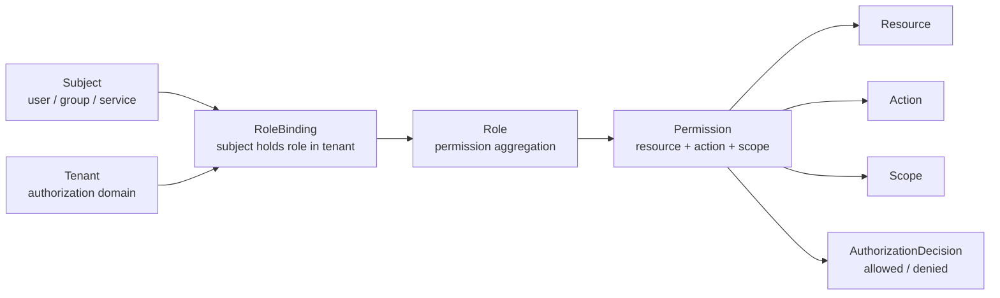
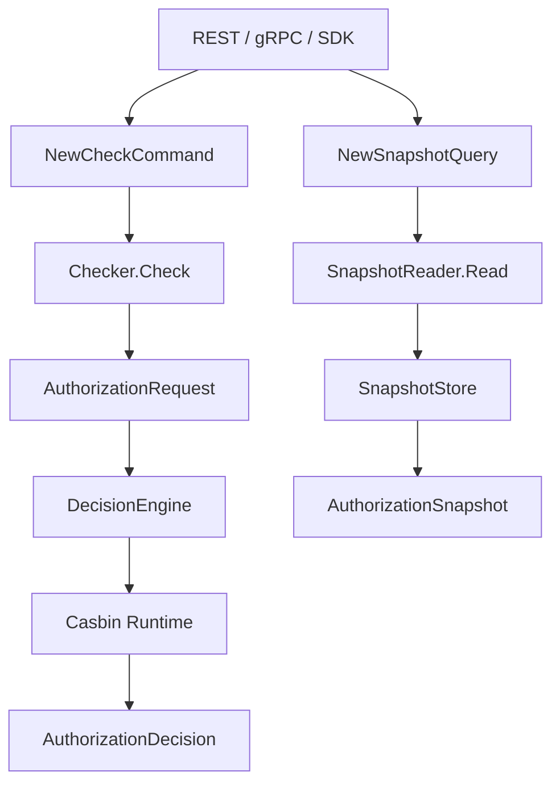
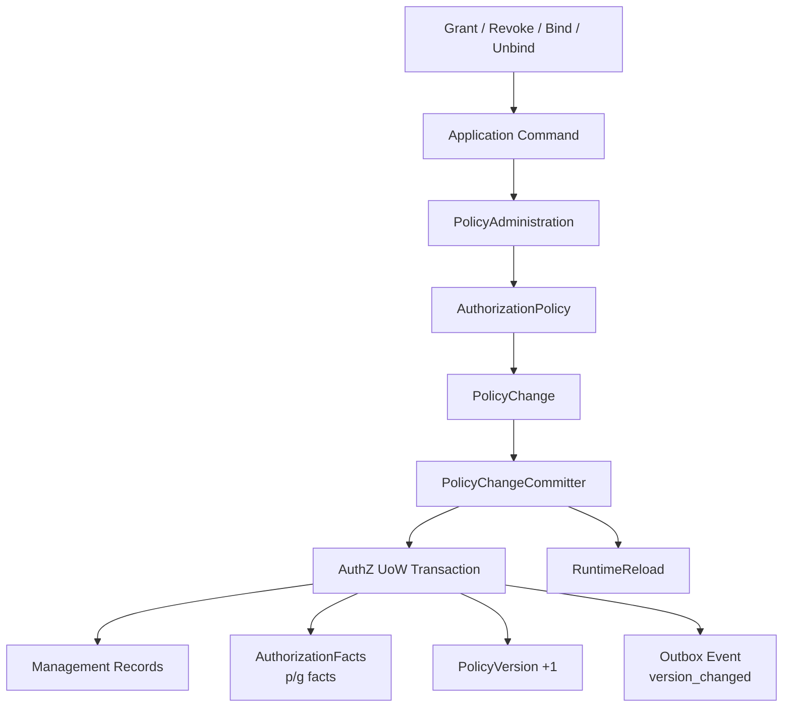
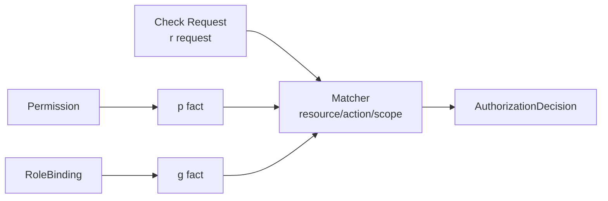

# 03-授权 AuthZ

## 1. 本目录定位

`03-授权AuthZ/` 是 IAM 文档体系中解释 **资源授权模型、授权读写链路、运行时判定、授权版本传播与授权事实治理** 的模块。

它回答的是：

```text
某个 Subject，在某个 Tenant 下，能不能对某个 Resource 执行某个 Action，并且满足某个 Scope？
```

换句话说，AuthZ 负责：

```text
访问权建模
访问权判定
访问权写入
访问权传播
访问权治理
```

本目录不解释认证登录态。

认证登录、Token 签发、Session、Refresh、JWKS 等属于：

```text
02-认证AuthN/
```

User、Profile、ProfileLink 等身份关系属于：

```text
04-身份Identity/
```

REST/gRPC/SDK 的完整接口契约属于：

```text
05-接入与契约/
```

本目录专注于 AuthZ 自身：

```text
Role
Resource
Permission
RoleBinding
Check
Snapshot
PolicyChange
PolicyVersion
Casbin Runtime
PolicyLinter
```

---

## 2. 30 秒结论

AuthZ 不是：

```text
user.role == "admin"
```

也不是：

```text
直接增删改查 casbin_rule
```

而是：

```text
Subject
  -> RoleBinding
  -> Role
  -> Permission
  -> Resource / Action / Scope
  -> AuthorizationDecision
```

读链路分为两类：

```text
Check：权威实时判定，回答“能不能访问？”
Snapshot：授权事实投影，回答“当前有哪些角色和权限？”
```

写链路是：

```text
Grant / Revoke / Bind / Unbind
  -> Application Command
  -> PolicyAdministration
  -> AuthorizationPolicy
  -> PolicyChange
  -> PolicyChangeCommitter
  -> AuthZ UoW
  -> AuthorizationFacts
  -> PolicyVersion
  -> Outbox Event
  -> RuntimeReload
```

运行时判定由 Casbin 完成，但 Casbin 不是领域模型。

领域模型是：

```text
Subject
Role
Resource
Permission
RoleBinding
Scope
AuthorizationRequest
AuthorizationDecision
PolicyChange
```

Casbin 只是 infra/runtime 层的策略匹配引擎。

一句话：

> **AuthZ 用 Role、Resource、Permission、RoleBinding 建模访问权，用 Check 和 Snapshot 提供读能力，用 PolicyChangeCommitter + UoW + PolicyVersion + Outbox 保证写入一致性，用 Casbin 做运行时判定，用 PolicyLinter 做授权事实治理。**

---

## 3. 文档目录

新版 `03-授权AuthZ/` 采用 9 篇核心文档结构：

```text
03-授权AuthZ/
├── README.md
├── 00-AuthZ模型总览-Subject-Role-Resource-Permission-RoleBinding.md
├── 01-授权资源与动作模型-ResourceKey-ResourcePattern-Action-Scope.md
├── 02-授权角色与绑定模型-Role-RoleBinding-Subject.md
├── 03-Check与Snapshot读链路.md
├── 04-授权写入链路-PolicyAdministration与PolicyChange.md
├── 05-PolicyChangeCommitter与AuthZUoW.md
├── 06-Casbin运行时模型-pgFacts与四段Matcher.md
├── 07-PolicyVersion-Outbox与RuntimeReload.md
├── 08-PolicyLinter与授权事实治理.md
└── 09-AuthZ分层架构与事实源索引.md
```

| 文档 | 主题 |
| --- | --- |
| `00-AuthZ模型总览` | AuthZ 核心模型与主线 |
| `01-授权资源与动作模型` | ResourceKey、ResourcePattern、Action、Scope |
| `02-授权角色与绑定模型` | Role、RoleBinding、Subject、Assignment 边界 |
| `03-Check与Snapshot读链路` | Check 判定与 Snapshot 快照 |
| `04-授权写入链路` | PolicyAdministration 与 PolicyChange |
| `05-PolicyChangeCommitter与AuthZUoW` | 事务提交、facts、version、outbox、reload |
| `06-Casbin运行时模型` | p/g facts 与四段 matcher |
| `07-PolicyVersion-Outbox与RuntimeReload` | 授权版本传播与运行时刷新 |
| `08-PolicyLinter与授权事实治理` | 授权事实只读诊断与治理边界 |
| `09-AuthZ分层架构与事实源索引` | 分层架构、事实源、架构护栏 |

---

## 4. AuthZ 知识地图

```mermaid
flowchart TD
    AuthZ["03-授权 AuthZ"]

    Overview["00 模型总览"]
    Resource["01 资源与动作模型"]
    Role["02 角色与绑定模型"]
    Read["03 Check 与 Snapshot"]
    Write["04 授权写入链路"]
    Commit["05 Committer 与 UoW"]
    Runtime["06 Casbin Runtime"]
    Version["07 Version / Outbox / Reload"]
    Linter["08 PolicyLinter"]
    Architecture["09 分层架构与事实源"]

    AuthZ --> Overview
    AuthZ --> Resource
    AuthZ --> Role
    AuthZ --> Read
    AuthZ --> Write
    AuthZ --> Commit
    AuthZ --> Runtime
    AuthZ --> Version
    AuthZ --> Linter
    AuthZ --> Architecture

    Overview --> Subject["Subject"]
    Overview --> RoleBinding["RoleBinding"]
    Overview --> Permission["Permission"]
    Overview --> Decision["AuthorizationDecision"]

    Resource --> ResourceKey["ResourceKey / Pattern"]
    Resource --> Action["Action / Pattern"]
    Resource --> Scope["Scope"]

    Role --> RoleName["RoleName"]
    Role --> SubjectRef["SubjectRef"]
    Role --> Assignment["Assignment wire term"]

    Read --> Check["Check"]
    Read --> Snapshot["Snapshot"]

    Write --> Admin["PolicyAdministration"]
    Write --> Policy["AuthorizationPolicy"]
    Write --> Change["PolicyChange"]

    Commit --> UOW["AuthZ UoW"]
    Commit --> Facts["AuthorizationFacts"]

    Runtime --> Casbin["CasbinAdapter"]
    Runtime --> Matcher["resource/action/scope matcher"]

    Version --> PolicyVersion["PolicyVersion"]
    Version --> Outbox["Transactional Outbox"]
    Version --> Reload["RuntimeReload"]

    Linter --> Findings["LintFindings"]
    Architecture --> Guard["Architecture Guards"]
```



---

## 5. 推荐阅读顺序

### 5.1 标准顺序

如果你是第一次系统阅读 AuthZ，推荐按顺序读：

```text
00-AuthZ模型总览
  -> 01-授权资源与动作模型
  -> 02-授权角色与绑定模型
  -> 03-Check与Snapshot读链路
  -> 04-授权写入链路
  -> 05-PolicyChangeCommitter与AuthZUoW
  -> 06-Casbin运行时模型
  -> 07-PolicyVersion-Outbox与RuntimeReload
  -> 08-PolicyLinter与授权事实治理
  -> 09-AuthZ分层架构与事实源索引
```

原因是：

```text
先理解模型
再理解读链路
再理解写链路
再理解运行时
再理解版本传播和治理
最后用分层架构与事实源索引收束
```

---

### 5.2 只想理解领域模型

推荐路径：

```text
00-AuthZ模型总览
  -> 01-授权资源与动作模型
  -> 02-授权角色与绑定模型
```

重点关注：

```text
Subject
Tenant
Role
RoleName
ResourceKey
ResourcePattern
Action
ActionPattern
Scope
Permission
RoleBinding
Assignment
```

---

### 5.3 只想理解业务服务如何接入授权

推荐路径：

```text
03-Check与Snapshot读链路
  -> 06-Casbin运行时模型
  -> ../05-接入与契约/
```

重点关注：

```text
CheckCommand
AuthorizationRequest
DecisionEngine
AuthorizationDecision
SnapshotQuery
AuthorizationSnapshot
SDK Check / Allow / GetAuthorizationSnapshot
```

---

### 5.4 只想理解授权写入为什么复杂

推荐路径：

```text
04-授权写入链路
  -> 05-PolicyChangeCommitter与AuthZUoW
  -> 07-PolicyVersion-Outbox与RuntimeReload
```

重点关注：

```text
Application Command
PolicyAdministration
AuthorizationPolicy
PolicyChange
PolicyChangeCommitter
AuthZ UoW
AuthorizationFacts
PolicyVersion
Outbox Event
RuntimeReload
```

---

### 5.5 只想理解 Casbin 在项目中的位置

推荐路径：

```text
06-Casbin运行时模型
  -> 09-AuthZ分层架构与事实源索引
```

重点关注：

```text
Permission -> p fact
RoleBinding -> g fact
Check Request -> r request
resourceMatch
actionMatch
scopeMatch
RuntimeAdapters
```

---

### 5.6 只想理解授权事实治理

推荐路径：

```text
08-PolicyLinter与授权事实治理
  -> 07-PolicyVersion-Outbox与RuntimeReload
  -> 09-AuthZ分层架构与事实源索引
```

重点关注：

```text
PermissionFacts
ResourceCatalog
PolicyLinter
LintFinding
PolicyReconciler boundary
```

---

## 6. 授权模型主图



这张图表达的是：

```text
Subject 不直接拥有 Permission。
Subject 在 Tenant 下通过 RoleBinding 持有 Role。
Role 通过 Permission 声明 Resource / Action / Scope 能力。
最终 Check 返回 AuthorizationDecision。
```

---

## 7. 读链路主图



读链路分为：

```text
Check：权威实时判定
Snapshot：授权事实投影
```

Check 用于安全准入。

Snapshot 用于菜单展示、SDK 缓存、管理界面和批量判断。

---

## 8. 写链路主图



这条链路表达的是：

```text
授权写入不是 CRUD。
授权写入的本质是生成 PolicyChange，并由统一提交链路保证管理记录、运行时事实、策略版本、事件传播和 runtime reload 的一致性。
```

---

## 9. Runtime 主图



核心映射是：

```text
Permission   -> p fact
RoleBinding  -> g fact
Check Request -> r request
```

核心 matcher 是：

```text
g(r.sub, p.sub, r.dom)
&& r.dom == p.dom
&& resourceMatch(r.obj, p.obj)
&& actionMatch(r.act, p.act)
&& scopeMatch(r.scope, p.scope)
```

---

## 10. 核心概念速查

| 概念 | 含义 |
| --- | --- |
| Subject | 被授权主体，如 user/group/service |
| Tenant | 授权域边界 |
| Role | 权限聚合点 |
| RoleName | 稳定业务角色标识 |
| ResourceKey | 资源目录中的资源标识 |
| ResourcePattern | 授权事实或请求中的资源匹配模式 |
| Action | 请求侧具体动作 |
| ActionPattern | 权限事实中的动作匹配表达式 |
| Scope | 权限作用范围 |
| Permission | Role 对 Resource / Action / Scope 的能力声明 |
| RoleBinding | Subject 在 Tenant 下持有 Role 的授权事实 |
| Assignment | REST/proto/SDK 对外 wire term |
| AuthorizationRequest | 一次 Check 的领域请求 |
| AuthorizationDecision | 授权判定结果 |
| AuthorizationSnapshot | Subject 当前角色和权限快照 |
| PolicyChange | 授权事实变更计划 |
| PolicyChangeCommitter | 授权变更统一提交器 |
| PolicyVersion | Tenant 级授权事实版本 |
| Outbox | 事实与事件同事务机制 |
| RuntimeReload | 运行时策略刷新 |
| PolicyLinter | 授权事实只读诊断工具 |

---

## 11. AuthZ 与其他模块的关系

### 11.1 与 AuthN

AuthN 回答：

```text
你是谁？
你如何证明你是谁？
认证成功后如何表达 Principal？
```

AuthZ 回答：

```text
你能访问什么资源？
你能执行什么动作？
你的权限范围是什么？
```

典型关系是：

```text
AuthN 认证出 Principal
AuthZ 将 Principal 映射为 Subject
AuthZ Check 判断是否允许访问 Resource
```

---

### 11.2 与 Identity

Identity 负责：

```text
User
Profile
ProfileLink
身份关系
```

AuthZ 负责：

```text
Subject
Role
Permission
Resource access
```

ProfileLink 不是 Permission。

如果 Profile 操作需要资源权限，应通过：

```text
Resource
Action
Scope
Check
```

进入 AuthZ。

---

### 11.3 与 REST / gRPC / SDK

REST / gRPC / SDK 是接入层。

它们负责：

```text
协议请求 -> application command/query
application result -> 协议响应
```

它们不应该：

```text
直接调用 Casbin Enforce
直接操作 casbin_rule
直接生成 PolicyChange
直接打开 AuthZ UoW
```

---

### 11.4 与 Outbox

AuthZ 写入会产生：

```text
authz.policy.version_changed
```

这类事件用于：

```text
缓存失效
跨实例 runtime reload
下游系统感知授权版本变化
```

Outbox 的关键是：

```text
授权事实和事件记录同事务提交
relay 异步发布
consumer 按 at-least-once 语义幂等消费
```

---

## 12. Casbin 的边界

必须明确：

```text
Casbin 是 infra 层 runtime policy engine，不是 IAM 的领域模型。
```

业务语言是：

```text
Subject
Role
Resource
Permission
RoleBinding
Scope
AuthorizationRequest
AuthorizationDecision
PolicyChange
```

Casbin 技术语言是：

```text
p
g
sub
dom
obj
act
scope
matcher
```

边界是：

```text
domain/application 使用业务语言
infra/casbin 负责把业务事实映射成 p/g facts
transport 不直接调用 Casbin Enforce
业务系统不理解 p/g facts
```

这条边界不能只靠约定，必须由架构测试保护。

---

## 13. Assignment 与 RoleBinding 的边界

当前约定：

```text
assignment = REST / proto / SDK 对外 wire term
rolebinding = application / domain 内部标准术语
```

分层关系是：

| 层次 | 名称 |
| --- | --- |
| REST / proto / SDK | Assignment |
| Application / Domain | RoleBinding |
| Management DB | Binding record |
| Runtime Casbin | g fact |

不要恢复内部 `assignment` 包。

内部统一使用：

```text
rolebinding
```

这样 RBAC 语义更准确。

---

## 14. 代码事实源入口

| 主题 | 代码入口 |
| --- | --- |
| AuthZ module 装配 | `internal/apiserver/container/assembler/authz.go` |
| AuthZ capabilities | `internal/apiserver/container/assembler` |
| AuthZ domain root facade | `internal/apiserver/domain/authz/model.go` |
| Subject domain | `internal/apiserver/domain/authz/subject` |
| Tenant domain | `internal/apiserver/domain/authz/tenant` |
| Role domain | `internal/apiserver/domain/authz/role` |
| Resource domain | `internal/apiserver/domain/authz/resource` |
| Scope domain | `internal/apiserver/domain/authz/scope` |
| Permission domain | `internal/apiserver/domain/authz/permission` |
| RoleBinding domain | `internal/apiserver/domain/authz/rolebinding` |
| Decision domain | `internal/apiserver/domain/authz/decision` |
| Policy domain | `internal/apiserver/domain/authz/policy` |
| Check / Snapshot | `internal/apiserver/application/authz/authorization` |
| PolicyAdministration | `internal/apiserver/application/authz/policy` |
| PolicyChangeCommitter | `internal/apiserver/application/authz/policy` |
| Role app service | `internal/apiserver/application/authz/role` |
| Resource app service | `internal/apiserver/application/authz/resource` |
| RoleBinding app service | `internal/apiserver/application/authz/rolebinding` |
| PolicyLinter | `internal/apiserver/application/authz/policylint` |
| AuthZ UoW port | `internal/apiserver/application/authz/uow` |
| Casbin runtime | `internal/apiserver/infra/casbin` |
| Casbin model | `configs/casbin_model.conf` |
| Casbin facts store | `internal/apiserver/infra/mysql/casbinrule` |
| Role repository | `internal/apiserver/infra/mysql/role` |
| Resource repository | `internal/apiserver/infra/mysql/resource` |
| RoleBinding repository | `internal/apiserver/infra/mysql/rolebinding` |
| PolicyVersion repository | `internal/apiserver/infra/mysql/policy` |
| MySQL UoW | `internal/apiserver/infra/mysql/uow` |
| REST AuthZ | `internal/apiserver/transport/rest/authz` |
| gRPC AuthZ | `internal/apiserver/transport/grpc/service/authz` |
| 架构测试 | `internal/pkg/architecture/architecture_test.go` |

---

## 15. 事实源优先级

AuthZ 相关事实冲突时，按以下顺序判断：

1. **源码运行行为**

   ```text
   internal/apiserver/domain/authz
   internal/apiserver/application/authz
   internal/apiserver/infra/casbin
   internal/apiserver/infra/mysql
   ```

2. **机器契约与配置**

   ```text
   REST / OpenAPI contract
   gRPC proto
   SDK public API
   configs/casbin_model.conf
   migrations
   ```

3. **架构与契约测试**

   ```text
   internal/pkg/architecture
   REST / gRPC contract tests
   SDK compile tests
   domain / application / infra tests
   ```

4. **当前维护文档**

   ```text
   docs/03-授权AuthZ
   docs/05-接入与契约
   docs/07-专题分析
   docs/08-宣讲
   ```

5. **历史归档材料**

   ```text
   _archive/
   ```

历史归档只用于追溯，不作为当前事实源。

---

## 16. 与专题分析、宣讲文档的关系

### 16.1 事实层

`03-授权AuthZ/` 是事实层。

它回答：

```text
当前 AuthZ 源码如何建模？
当前 Check / Snapshot 如何运行？
当前写入链路如何保证事务和传播？
当前 Casbin runtime 如何映射 facts？
当前 PolicyLinter 如何治理授权事实？
```

---

### 16.2 专题分析层

`07-专题分析/` 更适合回答：

```text
为什么 AuthZ 写入不是 CRUD？
为什么 RoleBinding 与 Assignment 要分层？
为什么需要 Transactional Outbox 传播授权版本？
为什么 Casbin 不是领域模型？
为什么 ResourceKey 要做四段结构？
```

专题分析偏设计取舍。

事实层文档偏当前实现。

---

### 16.3 宣讲层

`08-宣讲/` 更适合回答：

```text
如何把 AuthZ 授权体系讲给别人听？
如何准备面试追问？
如何组织技术分享？
```

宣讲层可以使用事实层作为证据索引。

---

## 17. 常见误区

### 17.1 AuthZ = user.role

错误。

IAM 的授权模型是：

```text
Subject
  -> RoleBinding
  -> Role
  -> Permission
  -> Resource / Action / Scope
```

`user.role` 无法表达资源、动作、tenant、scope、版本传播和跨服务 Check。

---

### 17.2 AuthZ = Casbin

错误。

Casbin 是 runtime policy engine。

IAM 的领域模型是 Role、Resource、Permission、RoleBinding、Scope。

Casbin p/g facts 只应该出现在 infra/casbin 和数据库授权事实层。

---

### 17.3 授权写入就是 CRUD

错误。

授权写入改变的是运行时授权事实。

一次写入可能同时影响：

```text
management records
Permission / RoleBinding facts
PolicyVersion
Outbox event
RuntimeReload
```

---

### 17.4 Assignment 和 RoleBinding 是完全相同概念

不准确。

`assignment` 是对外契约术语。

`rolebinding` 是内部领域术语。

---

### 17.5 ProfileLink 可以替代 AuthZ

错误。

ProfileLink 是 Identity 关系，不是资源权限。

资源级访问仍应通过 AuthZ Resource / Action / Scope 判定。

---

### 17.6 Outbox 就是普通 MQ publish

错误。

Transactional Outbox 的关键是：

```text
业务事实和事件记录同事务提交
relay 异步发布
consumer 按 at-least-once 语义幂等处理
```

---

### 17.7 PolicyLinter 会自动修复权限

错误。

PolicyLinter 是只读诊断工具。

修复必须通过未来：

```text
PolicyReconciler
  -> PolicyChange
  -> PolicyChangeCommitter
```

---

## 18. 验证建议

修改 AuthZ 文档或相关代码后，建议至少运行：

```bash
make docs-hygiene
```

AuthZ 应用与领域测试：

```bash
go test ./internal/apiserver/application/authz/... \
  ./internal/apiserver/domain/authz/...
```

Casbin / UoW / PolicyVersion 相关：

```bash
go test ./internal/apiserver/infra/casbin \
  ./internal/apiserver/infra/mysql/casbinrule \
  ./internal/apiserver/infra/mysql/policy \
  ./internal/apiserver/infra/mysql/uow/...
```

REST/gRPC 接入相关：

```bash
go test ./internal/apiserver/transport/rest/authz \
  ./internal/apiserver/transport/grpc/service/authz
```

架构边界相关：

```bash
go test ./internal/pkg/architecture
```

涉及契约时，按项目当前命令运行：

```bash
make docs-swagger
make api-validate
make proto-gen
```

---

## 19. 维护规则

### 19.1 README 只做 AuthZ 模块入口

本 README 负责：

```text
说明 AuthZ 模块回答什么
列出 9 篇核心文档
提供阅读路径
提供知识地图和事实源入口
说明常见误区和维护规则
```

详细模型和链路放到对应正文。

---

### 19.2 不把 AuthN 问题写进 AuthZ

AuthZ 不负责：

```text
密码验证
登录方式选择
Session 创建
Access Token 签发
Refresh Token 轮换
JWKS 发布
```

这些属于 `02-认证AuthN/`。

---

### 19.3 不把 Identity 关系写成权限模型

ProfileLink 是 Identity 关系，不是 AuthZ Permission。

如果 Profile 操作需要资源权限，应通过：

```text
Resource
Action
Scope
Check
```

进入 AuthZ。

---

### 19.4 不把 Casbin 写成领域语言

文档中可以解释 Casbin 映射。

但领域语言必须优先使用：

```text
Subject
Role
Resource
Permission
RoleBinding
Scope
AuthorizationRequest
AuthorizationDecision
PolicyChange
```

不要在领域说明中直接把 `p/g/sub/dom/obj/act` 写成业务模型。

---

### 19.5 不恢复旧 assignment 包

当前内部标准术语是：

```text
rolebinding
```

不要恢复：

```text
domain/authz/assignment
application/authz/assignment
infra/mysql/assignment
```

---

### 19.6 不把 Outbox 讲成 exactly-once

当前 Outbox 语义应按：

```text
at-least-once
consumer idempotency required
```

来解释。

---

### 19.7 文档必须跟随代码事实源

如果这些事实变化，必须同步更新文档：

```text
ResourceKey 规则
ActionPattern 规则
Scope 匹配语义
PolicyChange 结构
Casbin matcher
PolicyLinter findings
REST/gRPC response 字段
AuthZ capabilities
```

---

## 20. 本文总结

`03-授权AuthZ/` 解释 IAM 如何处理资源级访问权。

核心心智是：

```text
AuthZ 不验证你是谁。
AuthZ 判断你能不能访问资源。

AuthZ 不是 user.role。
AuthZ 不是 Casbin 本身。
AuthZ 写入不是 CRUD。
AuthZ 版本传播不是普通 MQ publish。
```

模型主线是：

```text
Subject
  -> RoleBinding
  -> Role
  -> Permission
  -> Resource / Action / Scope
  -> AuthorizationDecision
```

读链路主线是：

```text
Check / Snapshot
  -> Application Command / Query
  -> Checker / SnapshotReader
  -> Runtime / Store
  -> Decision / Snapshot
```

写链路主线是：

```text
PolicyChange
  -> UoW
  -> AuthorizationFacts
  -> PolicyVersion
  -> Outbox Event
  -> RuntimeReload
```

如果只记一句话：

> **AuthZ 负责资源级访问判定，用 Role / Resource / Permission / RoleBinding 建模，用 Check / Snapshot 提供读能力，用 PolicyChangeCommitter + UoW + PolicyVersion + Outbox 保证授权写入和版本传播一致性，用 Casbin 做运行时判定，用 PolicyLinter 做授权事实治理。**
