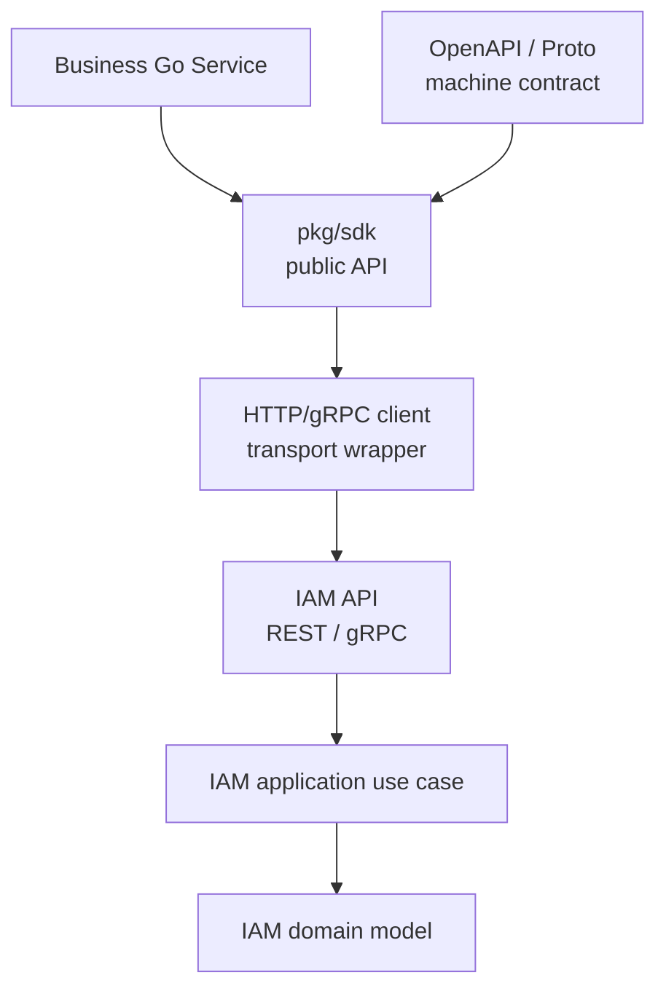

# Go SDK 接入模型

> 状态：待补证据 · Go SDK 接入总入口，待继续按 `pkg/sdk`、REST/OpenAPI、gRPC/proto、生成代码、compile test、示例代码和版本策略逐项核对。

---

## 1. 本文回答

本文回答 10 个问题：

- Go SDK 在 IAM 接入体系中负责什么？
- SDK 与 REST / gRPC 契约是什么关系？
- SDK 为什么不能 import IAM `internal` 包？
- SDK public API 应该如何设计，如何保持兼容？
- SDK 如何封装认证、Token、请求上下文、错误和重试？
- SDK 如何暴露 Identity / AuthN / AuthZ / IDP / Suggest 能力？
- SDK DTO、REST DTO、proto message、domain entity 的边界是什么？
- SDK 如何处理敏感字段、日志、脱敏和安全默认值？
- 修改 SDK 时应该同步检查哪些文件？
- 修改后应该执行哪些 Verify？

本文是 Go SDK 接入模型总入口，不替代 REST/OpenAPI 或 gRPC/proto 的机器契约。REST 契约见 [01-REST接入契约.md](01-REST接入契约.md)，gRPC 契约见 [02-gRPC接入契约.md](02-gRPC接入契约.md)。

---

## 2. 30 秒结论

Go SDK 是业务 Go 服务接入 IAM 的产品化封装。

它的定位是：

```text
把 IAM 的 REST/gRPC 接口，
封装成稳定、类型安全、可测试、可观测的 Go public API，
让业务服务不用直接拼 HTTP/gRPC 细节。
```

SDK 接入主线：

```text
Business Go Service
  -> pkg/sdk public API
  -> REST client or gRPC client
  -> IAM API
  -> application use case
  -> domain model
```

最重要的边界：

```text
SDK 不属于 IAM 业务层；
SDK 不 import internal 包；
SDK 不替代 OpenAPI/proto；
SDK DTO 不是 domain entity；
SDK 不绕过 AuthN/AuthZ；
SDK 不保存明文 secret/token 到日志；
SDK public API 变化必须有 compile test 保护；
SDK 示例不能把未实现能力写成已实现事实。
```

如果只记一句话：

> SDK 是接入封装，不是业务事实源；机器契约看 OpenAPI/proto，业务语义看 02-业务模块，SDK 只提供稳定易用的 Go 调用面。

---

## 3. 事实源

### 3.1 SDK 代码事实源

Go SDK 公开 API 以 `pkg/sdk` 为准：

```text
../../pkg/sdk
```

SDK 文档入口：

```text
../../pkg/sdk/README.md
../../pkg/sdk/docs/README.md
```

相关事实源：

| 事实 | 路径 |
| --- | --- |
| SDK public API | `../../pkg/sdk` |
| SDK examples | `../../pkg/sdk/docs`、`../../pkg/sdk`，具体以代码为准 |
| SDK compile test | `../../pkg/sdk` |
| REST OpenAPI | `../../api/rest` |
| gRPC proto | `../../api/grpc` |
| generated clients | `../../pkg`、`../../api`，具体以生成配置为准 |
| REST transport | `../../internal/apiserver/transport/rest` |
| gRPC transport | `../../internal/apiserver/transport/grpc` |
| 业务模块 | `../02-业务模块` |
| 架构测试 | `../../internal/pkg/architecture` |

注意：上表路径需要继续与当前源码核对。如果源码目录已调整，应以代码为准并同步更新本文。

---

### 3.2 机器契约事实源

SDK 不能替代机器契约。

| 协议 | 机器事实源 | SDK 关系 |
| --- | --- | --- |
| REST | `../../api/rest/*.yaml` | SDK 可以封装 HTTP client，但 schema 以 OpenAPI 为准 |
| gRPC | `../../api/grpc/**/*.proto` | SDK 可以封装 generated client，但 service/message 以 proto 为准 |

正确关系：

```text
OpenAPI / proto
  -> generated code or hand-written client wrapper
  -> pkg/sdk public API
  -> business service usage
```

---

## 4. SDK 定位

SDK 是业务 Go 服务接入 IAM 的产品化封装。

它负责：

```text
封装 IAM REST/gRPC 调用；
提供稳定 public API；
封装认证 metadata/header；
封装请求超时、context、traceID；
封装错误映射；
提供类型安全的 request/response；
提供示例和 compile test；
提供必要的重试、限流或熔断接入点，具体以代码为准。
```

SDK 不负责：

```text
定义 IAM 业务领域模型；
实现 Identity/AuthN/AuthZ/IDP/Suggest 用例；
绕过 REST/gRPC 直接访问数据库；
import internal/apiserver 包；
签发伪造 Token；
绕过 AuthZ Check；
替代 OpenAPI/proto；
替代业务模块文档。
```

---

## 5. SDK 分层模型



读图规则：

```text
业务服务只依赖 pkg/sdk；
SDK 依赖公开契约和公开生成代码；
SDK 不依赖 internal/apiserver；
SDK 通过 REST/gRPC 调用 IAM API；
IAM API 再进入 application 和 domain；
SDK 不是 IAM domain 的一部分。
```

---

## 6. SDK 与 REST / gRPC 的关系

### 6.1 与 REST 的关系

SDK 可以封装 REST 调用：

```text
SDK method
  -> build HTTP request
  -> attach Authorization header
  -> encode JSON request
  -> call IAM REST endpoint
  -> decode JSON response
  -> map error
```

边界：

```text
path/method/schema 以 OpenAPI 为准；
SDK 不手写与 OpenAPI 冲突的字段语义；
REST DTO 可以映射为 SDK DTO，但不是 domain entity；
错误码语义应和 REST 契约一致。
```

---

### 6.2 与 gRPC 的关系

SDK 可以封装 gRPC 调用：

```text
SDK method
  -> build proto request
  -> attach metadata
  -> call generated gRPC client
  -> receive proto response
  -> map to SDK response
  -> map status error
```

边界：

```text
service/rpc/message/field 以 proto 为准；
SDK 可以包一层更友好的 Go API；
SDK 不把 generated proto message 当 domain entity；
错误语义应和 gRPC status code 一致。
```

---

### 6.3 REST 与 gRPC 的选择

推荐：

```text
REST SDK：适合外部 HTTP 接入、管理端、小程序后端、跨语言调用；
gRPC SDK：适合可信服务间调用、内部高性能调用、强类型接口。
```

SDK 可以同时支持两种 transport，但 public API 要明确：

```text
当前 client 使用 REST 还是 gRPC；
错误模型如何映射；
认证信息如何传递；
超时、重试、trace 如何配置。
```

---

## 7. Public API 设计原则

SDK public API 应满足：

```text
稳定；
小而清晰；
按业务模块分组；
context.Context 优先；
显式 Options；
显式错误类型或错误码；
不泄露 transport 细节，除非必要；
不泄露 internal/domain 类型；
兼容性有测试保护。
```

推荐形态：

```go
client := iam.NewClient(iam.Config{
    Endpoint: "https://iam.example.com",
    TokenSource: tokenSource,
})

profiles, err := client.Suggest().SuggestProfile(ctx, iam.SuggestProfileRequest{
    Keyword: "张三",
    Scope: iam.ProfileAccessScopeLinkedProfiles,
    Limit: 10,
})
```

注意：上方是示意，不代表当前代码已实现。实际 API 以 `pkg/sdk` 为准。

---

## 8. SDK 模块分组

SDK public API 宜按 IAM 业务模块分组。

| SDK 分组 | 对应模块 | 典型能力 |
| --- | --- | --- |
| `Identity` | Identity | User/Profile/ProfileLink 查询或写入 |
| `AuthN` | AuthN | login、refresh、logout、JWKS、Principal 解析 |
| `AuthZ` | AuthZ | Check、Role、Permission、RoleBinding 管理 |
| `IDP` | IDP | WechatApp、Credentials、ExternalIdentity 解析 |
| `Suggest` | Suggest | SuggestProfile、masked result、手机号搜索策略接入 |

边界：

```text
SDK 分组只是接入组织方式；
不改变后端模块职责；
SDK 不应把 AuthN/AuthZ/Identity/IDP/Suggest 的概念混成一个大对象；
SDK 示例应回链对应业务模块文档。
```

---

## 9. 认证与 TokenSource

SDK 需要统一处理认证信息。

推荐模型：

```text
TokenSource
  -> returns AccessToken
  -> SDK attaches Authorization header or gRPC metadata
```

REST：

```http
Authorization: Bearer <access_token>
```

gRPC metadata：

```text
authorization: Bearer <access_token>
```

边界：

```text
AccessToken 由 AuthN 签发；
SDK 不伪造 Token；
SDK 不把 RefreshToken 当普通 API Bearer token；
SDK 不把 provider AppToken 当 IAM AccessToken；
SDK 不在日志中打印 token；
SDK 可支持 TokenSource 自动刷新，但必须遵守 AuthN refresh 语义。
```

---

## 10. Context、超时与重试

SDK public API 应优先接收 `context.Context`。

建议：

```text
每个请求都支持 context cancellation；
默认 timeout 可配置；
重试只针对安全可重试错误；
非幂等写操作默认不自动重试，除非有幂等键；
provider proof、login、refresh 等安全敏感操作谨慎重试；
429 / ResourceExhausted 应尊重退避策略；
traceID / requestID 应可注入或透传。
```

边界：

```text
SDK 重试不能制造重复 User/Profile/RoleBinding；
SDK 重试不能绕过后端限流；
SDK 不应吞掉 context cancellation；
SDK 不应无限重试。
```

---

## 11. 错误模型

SDK 应把 REST/gRPC 错误映射为稳定的 Go 错误模型。

建议错误对象表达：

```text
Code：稳定错误码；
Message：面向调用方的错误信息；
Status：HTTP status 或 gRPC code；
TraceID：排查 ID；
Details：安全可公开的细节。
```

错误分类：

| SDK 错误 | REST 来源 | gRPC 来源 | 语义 |
| --- | --- | --- | --- |
| `InvalidArgument` | 400 / 422 | InvalidArgument | 参数错误 |
| `Unauthenticated` | 401 | Unauthenticated | 未认证 |
| `PermissionDenied` | 403 | PermissionDenied | 无权限 |
| `NotFound` | 404 | NotFound | 不存在或按安全策略隐藏 |
| `AlreadyExists` | 409 | AlreadyExists | 已存在 |
| `Conflict` | 409 | Aborted / FailedPrecondition | 冲突或状态不满足 |
| `RateLimited` | 429 | ResourceExhausted | 限流 |
| `Unavailable` | 503 | Unavailable / DeadlineExceeded | 依赖不可用或超时 |
| `Internal` | 500 | Internal | 内部错误 |

边界：

```text
SDK 不应把所有错误都包装成普通 error string；
SDK 不应泄露 raw provider error、SQL、Redis key、secret、token；
SDK 应保留 traceID 便于排查；
SDK 示例应展示错误分类处理。
```

---

## 12. DTO 与领域模型边界

SDK DTO 是接入层对象，不是 IAM domain entity。

正确关系：

```text
SDK request/response
  -> REST DTO or proto message
  -> IAM transport mapper
  -> application command/query
  -> domain model
```

禁止：

```text
SDK import internal/apiserver/domain；
SDK 使用 internal domain entity 作为 public API；
SDK 暴露数据库 record；
SDK 直接构造 AuthZ RoleBinding repository 对象；
SDK 把 REST DTO / proto message 当作后端领域模型事实源。
```

---

## 13. 安全与隐私规则

SDK 必须默认安全。

要求：

```text
不在日志中打印 AccessToken / RefreshToken；
不在日志中打印 password / otp / session_key；
不在日志中打印 provider app secret / provider access_token；
不在日志中打印明文手机号或证件号；
Suggest SDK response 不暴露 mobile 明文字段；
IDP SDK response 不暴露 raw secret；
错误对象不包含敏感 raw response；
debug log 也需要脱敏。
```

SDK 对外 DTO 应避免：

```text
明文 mobile；
明文 id_no；
raw app secret；
provider access_token；
search token；
完整 RoleBinding 内部策略细节，除非明确是 AuthZ 管理 API；
internal object pointer 或数据库字段。
```

---

## 14. 兼容性与版本策略

SDK public API 变化需要谨慎。

兼容性规则：

```text
新增可选字段通常可兼容；
删除 public type / method 是破坏性变更；
改字段类型是破坏性变更；
改错误码语义是高风险；
改默认 transport / timeout / retry 策略需要文档说明；
改 TokenSource 行为需要迁移说明；
compile test 应覆盖 public API 的主要用法。
```

版本建议：

```text
SDK 版本应与 IAM API 契约版本可追踪；
SDK changelog 应说明依赖的 OpenAPI/proto 版本；
破坏性变更应有 major version 或明确迁移说明；
示例代码应跟随 public API 更新。
```

---

## 15. 测试策略

SDK 至少需要：

```text
compile test：保护 public API；
unit test：请求构造、错误映射、TokenSource、mask 字段；
contract test：对齐 OpenAPI/proto；
mock server test：REST/gRPC 响应映射；
integration test：可选，连接测试 IAM 环境；
race test：TokenSource/cache 等并发场景，若存在。
```

重点测试：

```text
Authorization header / metadata 是否正确；
context cancellation 是否生效；
429 / ResourceExhausted 是否正确映射；
401 / Unauthenticated 是否正确映射；
403 / PermissionDenied 是否正确映射；
Suggest response 是否没有 mobile 明文字段；
IDP response 是否没有 raw secret；
SDK public examples 是否能编译。
```

---

## 16. 修改 SDK 的检查清单

修改 SDK 时，至少检查：

```text
1. pkg/sdk public API 是否变化；
2. 是否 import 了 internal 包；
3. REST OpenAPI 或 gRPC proto 是否同步；
4. generated client/server 是否需要更新；
5. request/response DTO 是否与契约一致；
6. 错误映射是否与 REST/gRPC 错误模型一致；
7. TokenSource、timeout、retry、trace 是否符合安全策略；
8. 日志是否脱敏；
9. README / docs / examples 是否同步；
10. compile test 是否覆盖主要 public API；
11. 业务模块文档是否需要补充语义说明。
```

按模块修改时还要检查：

| 模块 | SDK 额外检查 |
| --- | --- |
| Identity | 不把 Profile DTO 当认证结果或授权结果 |
| AuthN | Token、RefreshToken、JWKS、安全日志 |
| AuthZ | Check 结果、RoleBinding 冲突、PolicyVersion |
| IDP | 不暴露 raw secret / provider AppToken |
| Suggest | 只暴露 `mobile_mask`，不暴露明文 `mobile` |

---

## 17. 常见反模式

| 反模式 | 问题 | 推荐做法 |
| --- | --- | --- |
| SDK import internal 包 | 破坏模块边界和可发布性 | SDK 只依赖 public contract / generated code |
| SDK 替代 OpenAPI/proto | 契约漂移 | 机器契约仍以 OpenAPI/proto 为准 |
| SDK DTO 当 domain entity | 接入模型污染领域模型 | SDK DTO 只是调用对象 |
| SDK 自动吞掉 401/403 | 调用方无法处理认证授权 | 显式返回错误类型 |
| SDK 日志打印 token | 严重安全问题 | 全部 token 脱敏或不记录 |
| SDK 返回 mobile 明文 | 隐私泄露 | 只返回 mobile_mask |
| SDK 暴露 provider access_token | 凭据泄露 | AppToken 仅服务端内部使用 |
| SDK 对非幂等写默认重试 | 可能重复创建 | 需要幂等键或关闭重试 |
| SDK public API 无 compile test | 兼容性不可控 | 添加 compile tests/examples |
| SDK 示例写未实现能力 | 误导使用方 | 未实现必须标注或不写 |

---

## 18. Verify

修改 SDK 后至少执行：

```bash
go test ./pkg/sdk/...
```

涉及 REST 契约：

```bash
make api-validate
```

涉及 gRPC 契约或 generated code：

```bash
make proto-gen
```

涉及业务模块 application：

```bash
go test ./internal/apiserver/application/identity/...
go test ./internal/apiserver/application/authn/...
go test ./internal/apiserver/application/authz/...
go test ./internal/apiserver/application/idp/...
go test ./internal/apiserver/application/suggest/...
```

涉及 REST/gRPC transport：

```bash
go test ./internal/apiserver/transport/rest/...
go test ./internal/apiserver/transport/grpc/...
```

涉及分层依赖：

```bash
go test ./internal/pkg/architecture
```

修改本文后至少执行：

```bash
make docs-hygiene
```

---

## 19. 本文总结

Go SDK 接入模型可以压缩成：

```text
OpenAPI/proto 定义机器契约；
pkg/sdk 封装 Go public API；
业务 Go 服务依赖 SDK；
SDK 通过 REST/gRPC 调用 IAM；
IAM API 进入 application/domain；
SDK 不进入 IAM internal。
```

维护 SDK 时最重要的工程规则是：

```text
SDK 是接入封装，不是业务层；
SDK 不 import internal；
SDK 不替代 OpenAPI/proto；
SDK DTO 不是 domain entity；
SDK 不绕过 AuthN/AuthZ；
SDK 不泄露 token、secret、手机号、证件号等敏感信息；
SDK public API 变化必须有 compile test 保护；
SDK 文档和示例必须跟随契约同步演进。
```
