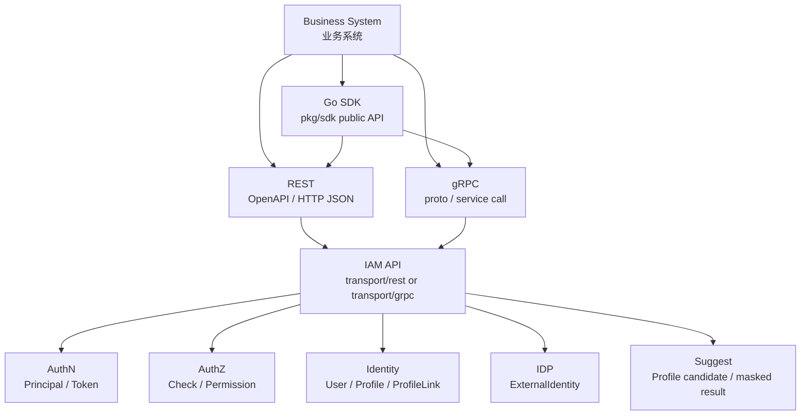

# 03-接入与契约

> 状态：规划改造 · 已完成当前事实盘点；正文仍含待实现或尚未收敛的设计内容，不得作为现有能力承诺。

---

## 1. 本目录定位

`03-接入与契约/` 说明业务系统如何通过公开契约接入 IAM。

它回答：

```text
业务系统应该通过什么方式接入 IAM？
REST、gRPC、Go SDK 分别适合什么场景？
机器契约事实源在哪里？
业务系统如何接入认证、授权、身份事实、外部身份源和 Profile 搜索？
OpenAPI、proto、SDK、transport、application、docs 如何防止漂移？
```

本目录关注“接入层契约”，不直接定义业务领域模型。

业务领域模型、关键链路和模块边界见 [02-业务模块](../02-业务模块/README.md)。

---

## 2. 30 秒结论

IAM 接入方式分为三类：

| 接入方式 | 适合场景 | 机器事实源 |
| --- | --- | --- |
| REST | Web / App / 管理端 / HTTP JSON / 跨语言接入 | `../../api/rest` |
| gRPC | 可信服务间调用 / 内部高性能接口 / 强类型接口 | `../../api/grpc` |
| Go SDK | Go 业务服务集成 / 屏蔽 HTTP/gRPC 细节 | `../../pkg/sdk` |

业务系统接入 IAM 的标准顺序是：

```text
选择 REST / gRPC / Go SDK
  -> 接入 AuthN，确认当前请求者
  -> 接入 AuthZ，确认能不能访问资源
  -> 按需接入 Identity 身份事实
  -> 按需接入 IDP 外部身份源
  -> 按需接入 Suggest Profile 搜索
  -> 统一错误、超时、重试、日志、审计和隐私治理
```

最重要的边界：

```text
OpenAPI 是 REST 机器事实源；
proto 是 gRPC 机器事实源；
pkg/sdk 是 Go SDK public API 事实源；
业务语义回链到 02-业务模块；
文档只解释语义和边界，不反向定义机器契约；
认证成功不等于授权通过；
SDK 不 import internal；
业务系统不直接访问 IAM 数据库。
```

如果只记一句话：

> REST 看 OpenAPI，gRPC 看 proto，Go 服务优先用 SDK，业务语义看 02-业务模块，契约变更必须防漂移。

---

## 3. 文档结构

当前目录保留 5 篇主文档：

| 文档 | 作用 | 阅读重点 |
| --- | --- | --- |
| [01-REST接入契约.md](01-REST接入契约.md) | REST 接入契约总入口 | OpenAPI 事实源、REST 认证授权、错误模型、DTO 边界、版本兼容 |
| [02-gRPC接入契约.md](02-gRPC接入契约.md) | gRPC 接入契约总入口 | proto 事实源、metadata 认证、status code、REST/gRPC 边界、proto mapper |
| [03-Go-SDK接入模型.md](03-Go-SDK接入模型.md) | Go SDK 接入模型 | SDK 定位、public API、TokenSource、错误模型、SDK 与 REST/gRPC 关系 |
| [04-业务系统接入IAM.md](04-业务系统接入IAM.md) | 业务系统接入 IAM 的落地指南 | 接入顺序、REST/gRPC/SDK 选择、AuthN/AuthZ/Identity/IDP/Suggest 接入边界 |
| [05-契约事实源与防漂移.md](05-契约事实源与防漂移.md) | 契约治理与防漂移规则 | 事实源总表、漂移类型、联动矩阵、CI 建议、active/archive 边界 |

---

## 4. 接入总图



读图规则：

```text
业务系统只能通过公开接入方式使用 IAM；
REST 以 OpenAPI 为准；
gRPC 以 proto 为准；
Go SDK 封装 REST/gRPC，但不替代机器契约；
IAM API 进入 transport 后再进入 application/domain；
AuthN 负责认证，AuthZ 负责授权，Identity/IDP/Suggest 按需使用。
```

---

## 5. 三种接入方式

### 5.1 REST

REST 适合：

```text
Web 管理端；
小程序后端；
跨语言调用；
HTTP/JSON 接入；
外部系统低频管理接口；
人工调试和排查。
```

事实源：

```text
../../api/rest
../../internal/apiserver/transport/rest
```

核心规则：

```text
OpenAPI 是 REST 机器契约；
REST 文档不手写完整 schema；
transport/rest 不承载业务规则；
REST DTO 不是 domain entity；
Token 验签成功不等于授权通过。
```

详细说明见 [01-REST接入契约.md](01-REST接入契约.md)。

---

### 5.2 gRPC

gRPC 适合：

```text
可信服务间调用；
内部高性能接口；
强类型契约；
批量 Check；
内部 Identity / AuthZ / Suggest 能力调用。
```

事实源：

```text
../../api/grpc
../../internal/apiserver/transport/grpc
```

核心规则：

```text
proto 是 gRPC 机器契约；
gRPC 文档不手写完整 message schema；
transport/grpc 不承载业务规则；
proto message 不是 domain entity；
domain 不 import generated proto。
```

详细说明见 [02-gRPC接入契约.md](02-gRPC接入契约.md)。

---

### 5.3 Go SDK

Go SDK 适合：

```text
Go 业务服务；
希望屏蔽 HTTP/gRPC 细节；
需要统一错误模型、TokenSource、context、timeout；
需要 compile test 保护接入代码。
```

事实源：

```text
../../pkg/sdk
```

核心规则：

```text
SDK 是接入封装，不是业务层；
SDK 不 import internal；
SDK 不替代 OpenAPI/proto；
SDK DTO 不是 domain entity；
SDK public API 变化必须有 compile test 保护。
```

详细说明见 [03-Go-SDK接入模型.md](03-Go-SDK接入模型.md)。

---

## 6. 业务系统接入主线

业务系统接入 IAM 应从最小安全闭环开始。

最小接入：

```text
1. 接入 AuthN Token 校验；
2. 在业务请求上下文中保存 Principal；
3. 定义业务 Resource / Action / Scope；
4. 接入 AuthZ Check；
5. 处理 401 / 403 / 429 / 5xx；
6. 日志脱敏 token 和敏感字段。
```

然后按需扩展：

```text
需要身份事实 -> 接入 Identity；
需要外部登录 -> 接入 AuthN provider login/link/onboarding，必要时接入 IDP；
需要 Profile 搜索 -> 接入 SuggestProfile；
需要 Go 服务统一封装 -> 接入 Go SDK。
```

详细说明见 [04-业务系统接入IAM.md](04-业务系统接入IAM.md)。

---

## 7. 契约事实源

| 契约 | 事实源 | 验证 |
| --- | --- | --- |
| REST | `../../api/rest` | `make api-validate` |
| REST runtime | `../../internal/apiserver/transport/rest` | `go test ./internal/apiserver/transport/rest/...` |
| gRPC | `../../api/grpc` | `make proto-gen` |
| gRPC runtime | `../../internal/apiserver/transport/grpc` | `go test ./internal/apiserver/transport/grpc/...` |
| Go SDK | `../../pkg/sdk` | `go test ./pkg/sdk/...` |
| 业务语义 | `../02-业务模块` | `make docs-hygiene` + module tests |
| 架构边界 | `../../internal/pkg/architecture` | `go test ./internal/pkg/architecture` |
| 文档链接 | `../../scripts/check-docs-links.py` | `make docs-hygiene` |

核心规则：

```text
不从 prose docs 反推机器契约；
改 OpenAPI 或 proto 后同步 transport、application、SDK、测试和接入文档；
改 SDK public API 后同步 SDK 文档、示例和 compile test；
active docs 不引用 archive 作为当前事实；
CI 应覆盖契约、生成物、SDK、架构边界和文档链接。
```

详细说明见 [05-契约事实源与防漂移.md](05-契约事实源与防漂移.md)。

---

## 8. 推荐阅读路径

### 8.1 新读者

```text
03-接入与契约/README.md
  -> 04-业务系统接入IAM.md
  -> 01-REST接入契约.md
  -> 02-gRPC接入契约.md
  -> 03-Go-SDK接入模型.md
  -> 05-契约事实源与防漂移.md
```

目标：先理解业务系统如何选择接入方式，再理解各类契约事实源。

---

### 8.2 准备接入 HTTP/JSON

```text
01-REST接入契约.md
  -> 04-业务系统接入IAM.md
  -> 05-契约事实源与防漂移.md
```

目标：明确 OpenAPI、REST handler、认证授权、错误模型和防漂移检查。

---

### 8.3 准备接入服务间调用

```text
02-gRPC接入契约.md
  -> 04-业务系统接入IAM.md
  -> 05-契约事实源与防漂移.md
```

目标：明确 proto、metadata、interceptor、status code、mapper 和生成物同步。

---

### 8.4 准备用 Go 服务接入

```text
03-Go-SDK接入模型.md
  -> 04-业务系统接入IAM.md
  -> 01-REST接入契约.md
  -> 02-gRPC接入契约.md
```

目标：明确 SDK public API、TokenSource、错误模型、context、重试和安全默认值。

---

### 8.5 准备修改契约

```text
05-契约事实源与防漂移.md
  -> 01-REST接入契约.md 或 02-gRPC接入契约.md
  -> 03-Go-SDK接入模型.md
```

目标：明确机器契约、transport、application、SDK、测试和文档的联动规则。

---

## 9. 接入边界总表

| 边界 | 正确理解 | 错误理解 |
| --- | --- | --- |
| OpenAPI 与 REST 文档 | OpenAPI 是机器契约，文档解释语义 | 文档手写字段替代 OpenAPI |
| proto 与 gRPC 文档 | proto 是机器契约，文档解释语义 | README 定义 service/message |
| SDK 与 OpenAPI/proto | SDK 封装调用面 | SDK 替代机器契约 |
| SDK 与 internal | SDK 只能依赖公开契约 | SDK import IAM internal 包 |
| AuthN 与 AuthZ | AuthN 认证，AuthZ 授权 | Token 验签成功就放行 |
| REST/gRPC DTO 与 domain | DTO 是协议层对象 | DTO 当领域实体保存 |
| Suggest 与业务系统 | Suggest 返回可见脱敏候选 | 业务系统直接查索引并返回 |
| IDP 与业务系统 | IDP 解析 ExternalIdentity | 业务系统把 openid 当 UserID |
| active docs 与 archive docs | active 表达当前事实 | active 引用 archive 当当前事实 |

---

## 10. 常见反模式

| 反模式 | 问题 | 推荐做法 |
| --- | --- | --- |
| 从文档反推接口字段 | 文档不是机器契约 | 字段以 OpenAPI/proto 为准 |
| handler/service method 写业务规则 | transport 吞并 application | transport 只做协议适配 |
| 业务系统只校验 Token 不做 Check | 认证和授权混淆 | Token -> Principal -> AuthZ Check |
| SDK import internal | 破坏边界和可发布性 | SDK 只依赖公开契约 |
| proto message 当 domain entity | 协议模型污染领域模型 | proto -> command/query -> domain |
| Suggest 返回 mobile 明文 | 隐私泄露 | 只返回 mobile_mask |
| IDP AppToken 当 IAM AccessToken | token 语义混淆 | AppToken 仅用于 provider API |
| 改 OpenAPI 不改 handler | REST 契约漂移 | OpenAPI、handler、test 同步 |
| 改 proto 不跑生成 | gRPC 生成物漂移 | 执行 `make proto-gen` |
| active docs 引用 archive | 当前事实被旧方案污染 | active 只引用 active |

---

## 11. Verify

修改本目录文档后至少执行：

```bash
make docs-hygiene
```

涉及 REST 契约：

```bash
make api-validate
go test ./internal/apiserver/transport/rest/...
```

涉及 gRPC 契约：

```bash
make proto-gen
go test ./internal/apiserver/transport/grpc/...
```

涉及 Go SDK：

```bash
go test ./pkg/sdk/...
```

涉及业务模块 application：

```bash
go test ./internal/apiserver/application/identity/...
go test ./internal/apiserver/application/authn/...
go test ./internal/apiserver/application/authz/...
go test ./internal/apiserver/application/idp/...
go test ./internal/apiserver/application/suggest/...
```

涉及容器装配和架构边界：

```bash
go test ./internal/apiserver/container/...
go test ./internal/pkg/architecture
```

---

## 12. 本目录总结

`03-接入与契约/` 的主线是：

```text
REST：以 OpenAPI 为机器契约；
gRPC：以 proto 为机器契约；
Go SDK：以 pkg/sdk 为 public API 事实源；
业务系统：通过 REST/gRPC/SDK 接入 IAM；
防漂移：机器契约、transport、application、SDK、测试、文档必须同步演进。
```

本目录最重要的工程规则是：

```text
机器契约优先于 prose docs；
业务语义回链到 02-业务模块；
认证不等于授权；
接入层不穿透 internal；
DTO/message 不等于 domain entity；
业务系统不直接访问 IAM 数据库；
SDK 不替代 OpenAPI/proto；
文档、契约、实现、SDK 和测试必须防漂移。
```
