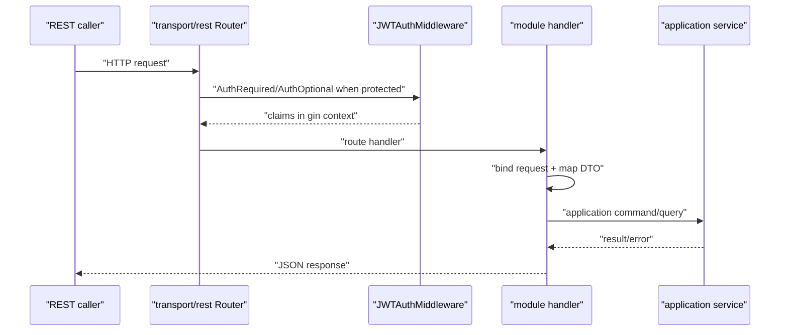

# REST 契约与接入

本文回答：IAM REST 合同在哪里、当前路由如何注册、接入方应该如何带 token、如何判断某个路由是否属于管理面，以及 REST 合同如何被验证。

## 30 秒结论

- REST 合同以 [../../api/rest](../../api/rest) 下的 OpenAPI 3.1 文件为准；swagger 只是从代码生成后用于比对的事实之一。
- 运行时路由注册在 [../../internal/apiserver/transport/rest](../../internal/apiserver/transport/rest)，模块路由由 container 提供的 handler 和 service 决定是否注册。
- 受保护业务路由需要 `Authorization: Bearer <JWT>`；AuthN token service 不可用时，依赖认证中间件的路由不会降级裸露注册。
- Debug route 与业务 API 分开：`/debug/routes`、`/debug/modules`、`/debug/cache-governance/*` 是运行时诊断面，不是对外业务合同。
- REST 适合前端、网关、管理后台和轻量集成；服务间高频调用优先使用 gRPC + SDK。

## 契约文件

| 文件 | 能力 | 说明 |
| ---- | ---- | ---- |
| [../../api/rest/authn.v2.yaml](../../api/rest/authn.v2.yaml) | 登录、Token、JWKS、账户开通 | v1 REST 入口，包含 public JWKS。 |
| [../../api/rest/authn.v2.yaml](../../api/rest/authn.v2.yaml) | 显式登录 | `auth_method + method_payload` 形态。 |
| [../../api/rest/authz.v2.yaml](../../api/rest/authz.v2.yaml) | 授权判定和管理面 | 公开 term 使用 `assignment`。 |
| [../../api/rest/identity.v2.yaml](../../api/rest/identity.v2.yaml) | User、Profile、ProfileLink | 用户和档案关系接入。 |
| [../../api/rest/idp.v2.yaml](../../api/rest/idp.v2.yaml) | IDP 微信应用管理 | 登录仍由 AuthN 统一提供。 |
| [../../api/rest/suggest.v2.yaml](../../api/rest/suggest.v2.yaml) | Profile 联想搜索 | 读侧辅助能力。 |

## 当前路由速查

| 模块 | 入口 | 认证边界 |
| ---- | ---- | ---- |
| AuthN | `/api/v2/authn/*`、`/api/v2/authn/login`、`/.well-known/jwks.json` | 登录和 JWKS 有公开入口；token 管理依合同要求认证。 |
| AuthZ | `/api/v2/authz/*` | protected route，管理面还依赖角色/权限要求。 |
| Identity | `/api/v2/identity/me`、`/api/v2/identity/profiles`、`/api/v2/identity/profile-links` | protected route。 |
| IDP | `/api/v2/idp/*` | 微信应用管理需要 admin middlewares；health 入口按 router 实现注册。 |
| Suggest | `/api/v2/suggest/profile` | protected route，返回读侧候选。 |
| Debug | `/debug/routes`、`/debug/modules`、`/debug/cache-governance/*` | 受运行模式和 debug 配置控制，生产默认要求 admin。 |

## REST 请求路径



REST handler 的职责应保持轻：解析请求、读取身份上下文、调用 application、映射响应。业务规则和事务边界应在 application/domain 中完成。

## 接入示例

v1 登录示例：

```bash
curl -X POST https://iam.example.com/api/v2/authn/login \
  -H "Content-Type: application/json" \
  -d '{"method":"password","credentials":{"username":"admin","password":"secret"}}'
```

访问 ProfileLink：

```bash
curl https://iam.example.com/api/v2/identity/profile-links \
  -H "Authorization: Bearer ${IAM_ACCESS_TOKEN}"
```

授权判定：

```bash
curl -X POST https://iam.example.com/api/v2/authz/check \
  -H "Authorization: Bearer ${IAM_ACCESS_TOKEN}" \
  -H "Content-Type: application/json" \
  -d '{"action":"read","resource":"qs:profile:1001","domain":"1"}'
```

## 接入边界

| 边界 | 说明 |
| ---- | ---- |
| 离线验签不是在线 Verify | 只验 JWT 签名不能感知所有撤销、session、用户状态变化。 |
| Debug route 不是业务 API | 不应把 `/debug/*` 接给外部业务系统。 |
| IDP 管理不是登录 | IDP 管理微信应用配置；用户登录仍走 AuthN。 |
| `assignment` 是 wire term | REST/proto 保留 `assignment`；内部代码按 `rolebinding` 组织。 |
| ProfileLink 不等于完整业务授权 | 关系存在不代表业务资源动作自动允许，必要时叠加 AuthZ。 |

## 代码证据与验证

| 事实 | 入口 |
| ---- | ---- |
| REST router | [../../internal/apiserver/transport/rest/router.go](../../internal/apiserver/transport/rest/router.go) |
| 模块路由注册 | [../../internal/apiserver/transport/rest/module_routes.go](../../internal/apiserver/transport/rest/module_routes.go) |
| Debug routes | [../../internal/apiserver/transport/rest/debug_routes.go](../../internal/apiserver/transport/rest/debug_routes.go) |
| HTTP 认证中间件 | [../../internal/pkg/middleware/authn](../../internal/pkg/middleware/authn) |
| REST 合同 | [../../api/rest](../../api/rest) |

```bash
make docs-swagger
make api-validate
go test ./internal/apiserver/transport/rest
```

`make api-validate` 需要 Docker daemon。Docker 不可用时，至少运行：

```bash
python scripts/check-openapi-contracts.py
python scripts/check-route-contracts.py
```
