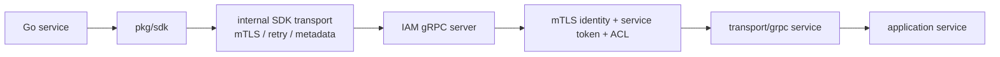

# gRPC 契约与接入

本文回答：IAM 当前发布哪些 gRPC service，服务间调用应如何处理 mTLS、service token、ACL 和 SDK，接入方应该如何判断自己该直接用 proto 还是使用 Go SDK。

## 30 秒结论

- gRPC 合同以 [../../api/grpc/iam](../../api/grpc/iam) 下的 proto 为准；当前运行时发布 v1 service。
- 服务注册由 [../../internal/apiserver/transport/grpc/registry.go](../../internal/apiserver/transport/grpc/registry.go) 统一执行，并由 proto contract test 校验覆盖关系。
- gRPC 安全链路包含 TLS/mTLS、认证、ACL、audit、health/reflection 等能力，配置映射在 [../../internal/apiserver/process/grpc_config.go](../../internal/apiserver/process/grpc_config.go)。
- Go 服务优先使用 [../../pkg/sdk](../../pkg/sdk)，少写一层手工 dial、metadata、retry、JWKS 和错误处理。
- gRPC 更适合服务间高频调用；管理后台或浏览器接入通常优先 REST。

## 服务矩阵

| Proto service | 主要用途 | 典型调用方 |
| ---- | ---- | ---- |
| `iam.authn.v1.AuthService` | Verify、Refresh、Revoke、IssueServiceToken | 网关、业务服务、后台任务 |
| `iam.authn.v1.AccountOnboardingService` | 创建运营账户 | 管理后台、初始化任务 |
| `iam.authn.v1.JWKSService` | 获取 JWKS | SDK verifier、网关 |
| `iam.authz.v1.AuthorizationService` | Check、授权快照、Grant/Revoke assignment | 业务服务、权限同步器 |
| `iam.identity.v1.IdentityRead` | 读取用户和 profile | 业务服务 |
| `iam.identity.v1.ProfileLinkQuery` | 查询 ProfileLink | 业务服务、同步器 |
| `iam.identity.v1.ProfileLinkCommand` | 建立、撤销、导入 ProfileLink | 后台任务、受控管理服务 |
| `iam.identity.v1.IdentityLifecycle` | 用户生命周期 | 管理服务 |
| `iam.idp.v1.IDPService` | 读取微信应用配置 | 内部服务或 SDK |

## 推荐调用形态



接入方如果直接使用 proto client，需要自己处理：

- endpoint、TLS/mTLS 证书、超时和重试。
- `authorization: Bearer <service-token>` metadata。
- request-id/trace-id metadata。
- gRPC status 到业务错误的映射。
- JWKS 本地缓存和刷新策略。

SDK 已经封装这些基础能力，只有当语言不是 Go、或需要极薄依赖时才建议直接使用 proto client。

## Metadata

```text
authorization: Bearer <service-token>
x-request-id: <request-id>
x-trace-id: <trace-id>
```

service token 不是 mTLS 的替代品。mTLS 证明“这个连接来自可信客户端证书”，service token 表达“这个服务身份被 IAM 签发和授权”。ACL 可以进一步限制某个服务身份能调用哪些 RPC。

## 安全与运行时开关

| 能力 | 配置 / 代码入口 | 说明 |
| ---- | ---- | ---- |
| TLS/mTLS | [../../internal/pkg/grpc/config.go](../../internal/pkg/grpc/config.go)、[../../internal/pkg/grpc/server.go](../../internal/pkg/grpc/server.go) | mTLS 优先；也支持 TLS fallback 和 insecure 开关。 |
| 配置映射 | [../../internal/apiserver/process/grpc_config.go](../../internal/apiserver/process/grpc_config.go) | 从 apiserver config 映射到 grpc.Config。 |
| ACL | [../../configs/grpc_acl.yaml](../../configs/grpc_acl.yaml) | 按 service/method 控制调用权限。 |
| Health | [../../internal/pkg/grpc/server.go](../../internal/pkg/grpc/server.go) | gRPC health 和独立 HTTP healthz。 |
| Reflection | [../../internal/pkg/grpc/server.go](../../internal/pkg/grpc/server.go) | 受配置控制，便于调试。 |
| 审计 | [../../internal/pkg/grpc/server.go](../../internal/pkg/grpc/server.go) | 拦截器链中记录调用审计。 |

## 选择 REST 还是 gRPC

| 场景 | 优先选择 |
| ---- | ---- |
| 浏览器、管理后台、人工调试 | REST |
| Go 服务间调用 IAM | SDK/gRPC |
| 高频授权判定或授权快照拉取 | gRPC |
| 获取 public JWKS | REST `/.well-known/jwks.json` 或 SDK/JWKS fetcher |
| 跨语言服务 | 直接使用 proto client，按本节补齐安全 metadata |

## 验证

```bash
make proto-gen
go test ./internal/apiserver/transport/grpc/... ./internal/pkg/grpc ./pkg/sdk/...
```

如果 proto 新增 service，还必须检查：

- [../../internal/apiserver/transport/grpc/proto_contract_test.go](../../internal/apiserver/transport/grpc/proto_contract_test.go)
- [../../internal/apiserver/transport/grpc/service/uc/identity/contract_alignment_test.go](../../internal/apiserver/transport/grpc/service/uc/identity/contract_alignment_test.go)
- SDK public API compile tests：[../../pkg/sdk/public_api_compile_test.go](../../pkg/sdk/public_api_compile_test.go)
