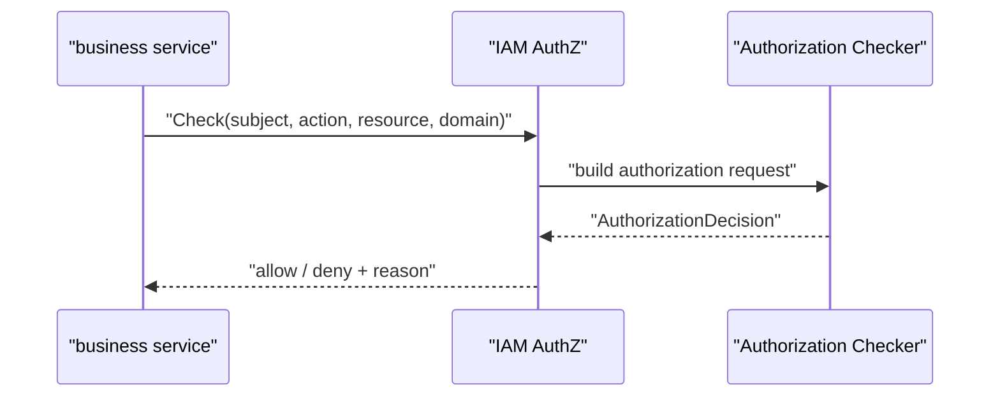
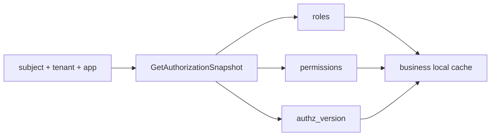

# 授权接入与边界

本文回答：业务系统如何接 IAM AuthZ，在线 Check、授权快照、管理面和 SDK 分别适合什么场景，以及 `assignment` wire term 与内部 `rolebinding` 的边界。

## 30 秒结论

- 在线判定：REST `POST /api/v1/authz/check` 或 gRPC `AuthorizationService.Check`。
- 快照接入：gRPC `AuthorizationService.GetAuthorizationSnapshot` 返回 subject 在指定 tenant/app 下的角色、权限和 `authz_version`。
- REST/proto 使用 `assignment` wire term；IAM 内部应用和领域实现使用 `rolebinding`。
- 接入方缓存授权结果时必须关注 `authz_version`，并能在策略变化后刷新。
- IAM 负责授权事实和判定，业务系统仍负责定义资源 key、action 和业务对象上下文。

## 接入模式

| 模式 | 适用场景 | 接口 | 注意点 |
| ---- | ---- | ---- | ---- |
| 在线 Check | 低频、强一致、关键动作 | REST `/api/v1/authz/check`、gRPC `Check` | 每次都回 IAM，延迟受网络影响。 |
| 授权快照 | 高频判定、本地缓存权限 | gRPC `GetAuthorizationSnapshot` | 必须处理 `authz_version` 变化。 |
| 管理面 | 运营后台维护角色、资源、策略、assignment | REST `/api/v1/authz/*` | 需要管理员认证和授权。 |
| SDK | Go 服务接入 | [../../pkg/sdk/docs/06-authz.md](../../pkg/sdk/docs/06-authz.md) | 当前稳定封装重点是判定而非完整策略管理。 |

## Online Check 流程



在线 Check 的输入应尽量明确：

- `subject`：谁在操作，可以来自 IAM claims，也可以由调用方显式传入。
- `action`：业务动作，例如 `read`、`update`、`manage`。
- `resource`：业务资源 key，例如 `qs:profile:1001`。
- `domain`：租户、学校、机构或双方约定的域。

IAM 不替业务系统解释 `qs:profile:1001` 背后的业务对象，也不替业务系统决定“读取”和“管理”具体包含哪些页面或字段。

## 授权快照语义



授权快照适合业务系统本地缓存，减少每次请求都回 IAM。接入方需要明确三件事：

1. 本地缓存 key 至少要包含 subject、tenant/domain、app 维度。
2. 判定时要使用快照里的权限语义，不要把角色名当成唯一依据。
3. `authz_version` 变化后，缓存必须刷新或失效。

版本事件通过 transactional outbox 发布，事件配置见 [../../configs/events.yaml](../../configs/events.yaml)，事件链路见 [../05-专题分析/10-授权版本事件链路--UoW到OutboxRelay.md](../05-专题分析/10-授权版本事件链路--UoW到OutboxRelay.md)。

## `assignment` 与 `rolebinding`

| 位置 | 使用术语 | 原因 |
| ---- | ---- | ---- |
| REST/proto | `assignment` | 对外合同术语，表达“把角色赋给主体”。 |
| application/domain | `rolebinding` | 内部授权事实模型，便于和 role、permission、resource 组合。 |
| 文档解释 | `assignment wire term` / 内部 `rolebinding` | 防止接入方把合同名反推成内部包路径。 |

接入方只需要遵守 REST/proto 合同里的 `assignment` 字段和 RPC；维护 IAM 内部代码时应按 `rolebinding` 找应用服务和领域模型。

## 接入边界

| 边界 | 说明 |
| ---- | ---- |
| JWT claim 不等于授权结果 | token 证明身份和基本上下文，授权仍走 Check 或快照。 |
| ProfileLink 不等于资源权限 | 用户与 profile 有关系，不代表对所有业务资源动作都允许。 |
| 本地缓存不是永久授权 | 授权策略变化后必须根据版本或事件刷新。 |
| 资源 key 是双方约定 | IAM 不知道每个业务系统内部资源树的完整语义。 |
| 管理面需要更高权限 | 角色、策略、assignment 变更不能开放给普通业务调用链。 |

## 事实入口

- 应用判定：[../../internal/apiserver/application/authz/authorization](../../internal/apiserver/application/authz/authorization)
- 角色绑定：[../../internal/apiserver/application/authz/rolebinding](../../internal/apiserver/application/authz/rolebinding)
- REST：[../../internal/apiserver/transport/rest/authz](../../internal/apiserver/transport/rest/authz)
- gRPC：[../../internal/apiserver/transport/grpc/service/authz](../../internal/apiserver/transport/grpc/service/authz)
- 契约：[../../api/rest/authz.v1.yaml](../../api/rest/authz.v1.yaml)、[../../api/grpc/iam/authz/v1/authz.proto](../../api/grpc/iam/authz/v1/authz.proto)

## 验证

```bash
go test ./internal/apiserver/application/authz/... ./internal/apiserver/transport/rest ./internal/apiserver/transport/grpc/service/authz ./pkg/sdk/authz
```
