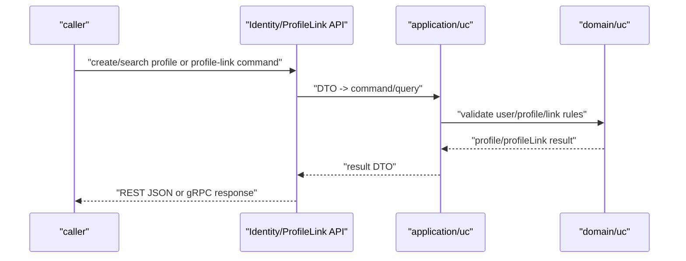

# 身份接入与 ProfileLink 边界

本文回答：业务系统如何接 IAM 的 User、Profile 和 ProfileLink 能力；哪些场景用 REST，哪些场景用 gRPC；以及 ProfileLink 与 AuthZ、Suggest、业务侧家庭规则的边界。

## 30 秒结论

- 当前关系模型名是 `ProfileLink`，REST 关系路由是 `/api/v2/identity/profile-links`，gRPC 关系服务是 `ProfileLinkQuery` 和 `ProfileLinkCommand`。
- ProfileLink 可表达自有档案、亲属关系、监护类业务语义，但 IAM 不替业务系统完成全部家庭业务规则或资源授权。
- REST 更适合当前用户视角和管理后台；gRPC 更适合服务间查询、批量查询、导入和后台同步。
- 当前用户视角下的 ProfileLink 操作有 guard，不能简单把它当成任意用户关系写入口。
- Suggest 只提供候选搜索；真正建立关系仍走 ProfileLink。

## REST 接入

| 路由 | 说明 | 典型场景 |
| ---- | ---- | ---- |
| `GET /api/v2/identity/me` | 当前用户 | 前端初始化当前身份。 |
| `PATCH /api/v2/identity/me` | 更新当前用户 | 用户资料维护。 |
| `GET /api/v2/identity/me/profiles` | 当前用户关联 profiles | 选择儿童档案、切换档案。 |
| `POST /api/v2/identity/profiles` | 创建 profile | 创建儿童或个人档案。 |
| `GET /api/v2/identity/profiles/{id}` | 读取 profile | 管理后台或详情页。 |
| `PATCH /api/v2/identity/profiles/{id}` | 更新 profile | 档案信息维护。 |
| `GET /api/v2/identity/profiles/search` | 搜索 profile | 管理后台检索。 |
| `GET /api/v2/identity/profile-links` | 查询 ProfileLink | 当前用户或管理视角查询关系。 |
| `POST /api/v2/identity/profile-links` | 建立 ProfileLink | 绑定用户和 profile。 |
| `POST /api/v2/identity/profile-links/{id}/revoke` | 撤销 ProfileLink | 解绑关系。 |

## gRPC 接入

| Service | 方法范围 | 适用场景 |
| ---- | ---- | ---- |
| `IdentityRead` | user/profile 读取、批量读取、搜索 | 服务间读用户和档案。 |
| `ProfileLinkQuery` | `HasProfileLink`、`ListProfiles`、`ListProfileLinks` | 本地业务判断用户和档案关系。 |
| `ProfileLinkCommand` | 建立、撤销、批量撤销、导入 | 后台任务、同步器、受控管理服务。 |
| `IdentityLifecycle` | 创建、更新、禁用、封禁用户 | 管理面和生命周期治理。 |

## 接入流程



接入时建议把关系动作拆清楚：

1. 如果只是找候选 profile，先用 Suggest 或 profile search。
2. 如果要创建档案，调用 Profile 创建能力。
3. 如果要建立用户和档案关系，调用 ProfileLink 建立能力。
4. 如果要判断业务资源能否操作，再调用 AuthZ 或本地授权快照。

## ProfileLink 与其他模块边界

| 模块 | ProfileLink 的关系 |
| ---- | ---- |
| AuthN | 登录和 token 只证明用户身份；不会自动授予档案权限。 |
| AuthZ | 资源动作授权仍由 AuthZ 判定；ProfileLink 可作为业务输入之一。 |
| Suggest | Suggest 返回候选 profile，不写 ProfileLink。 |
| IDP | 外部身份先经 AuthN/IDP 转成 IAM 用户，再进入 ProfileLink。 |
| 业务系统 | 家庭规则、订单、课程、内容可见性等仍由业务系统定义。 |

## 边界和不要混淆

- ProfileLink 默认查询 active 关系；撤销关系不会被当成 active。
- 创建 profile 和建立 ProfileLink 是不同能力，不要假设创建 profile 一定自动建立任意关系。
- 当前用户视角的关系操作不能直接等同于系统级导入；批量导入应走 gRPC command 或受控后台能力。
- ProfileLink 可承载监护语义，但不是法律监护判定引擎。
- 需要对业务资源做 allow/deny 时，应结合 AuthZ。

## 事实入口

- 应用层：[../../internal/apiserver/application/uc](../../internal/apiserver/application/uc)
- ProfileLink 业务域：[../../internal/apiserver/domain/uc/profilelink](../../internal/apiserver/domain/uc/profilelink)
- REST：[../../internal/apiserver/transport/rest/identity](../../internal/apiserver/transport/rest/identity)
- gRPC：[../../internal/apiserver/transport/grpc/service/uc/identity](../../internal/apiserver/transport/grpc/service/uc/identity)
- 契约：[../../api/rest/identity.v2.yaml](../../api/rest/identity.v2.yaml)、[../../api/grpc/iam/identity/v2/identity.proto](../../api/grpc/iam/identity/v2/identity.proto)

## 验证

```bash
go test ./internal/apiserver/application/uc/... ./internal/apiserver/domain/uc/... ./internal/apiserver/transport/rest ./internal/apiserver/transport/grpc/service/uc/identity
```
