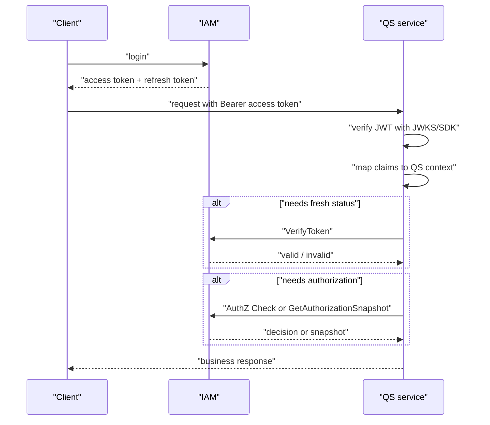

# QS 接入 IAM

本文以 QS 类业务系统为例，说明一个业务服务如何接入 IAM：登录由 IAM 完成，业务请求携带 Access Token，QS 完成身份上下文解析、授权判定、ProfileLink 使用和本地缓存策略。

## 30 秒结论

- 前端或网关拿到 IAM Access Token 后，QS 可以用 JWKS/SDK 离线验签；高风险操作再调用在线 Verify。
- QS 的业务授权应通过 AuthZ Check 或授权快照完成，不应只依赖 JWT claim。
- 儿童档案或家庭关系使用 ProfileLink 能力；业务资源授权仍由 QS 与 IAM AuthZ 协作定义。
- Go 服务优先使用 [../../pkg/sdk](../../pkg/sdk)，避免重复实现 gRPC transport、service auth、JWT/JWKS verifier 和错误映射。

## 推荐接入路径

## 最小能力组合

| 需求 | IAM 能力 | 推荐入口 |
| ---- | ---- | ---- |
| 用户登录 | AuthN login | REST `/api/v2/authn/login` 或 `/api/v2/authn/login` |
| Token 在线校验 | VerifyToken | REST `/api/v2/authn/verify` 或 gRPC `VerifyToken` |
| 离线验签 | JWKS + verifier | `/.well-known/jwks.json` 或 SDK verifier |
| 服务间 token | IssueServiceToken | SDK `serviceauth` 或 gRPC `IssueServiceToken` |
| 授权判定 | AuthZ Check | REST `/api/v2/authz/check` 或 gRPC `Check` |
| 本地授权缓存 | Authorization Snapshot | gRPC `GetAuthorizationSnapshot` |
| 用户/profile 关系 | ProfileLink | REST `/api/v2/identity/profile-links` 或 gRPC `ProfileLinkQuery` |

## QS 应维护的本地上下文

| 上下文 | 来源 | QS 侧用途 |
| ---- | ---- | ---- |
| userID / subject | Access Token claims 或在线 Verify | 绑定当前业务请求身份。 |
| tenant/domain | claims、请求路径或业务映射 | 选择授权域和业务数据范围。 |
| roles/permissions | AuthZ Check 或授权快照 | 判断当前动作是否允许。 |
| profile links | Identity/ProfileLink | 判断用户与儿童档案关系。 |
| `authz_version` | 授权快照 | 本地权限缓存失效依据。 |

## SDK 文档

- [../../pkg/sdk/docs/01-quick-start.md](../../pkg/sdk/docs/01-quick-start.md)
- [../../pkg/sdk/docs/03-token-lifecycle.md](../../pkg/sdk/docs/03-token-lifecycle.md)
- [../../pkg/sdk/docs/04-jwt-verification.md](../../pkg/sdk/docs/04-jwt-verification.md)
- [../../pkg/sdk/docs/05-service-auth.md](../../pkg/sdk/docs/05-service-auth.md)
- [../../pkg/sdk/docs/06-authz.md](../../pkg/sdk/docs/06-authz.md)

## 接入边界

- QS 的业务资源、动作和租户语义由 QS 与 IAM 共同约定。
- 离线验签不能感知撤销、session 失效或用户状态变化。
- ProfileLink 只能说明用户与 profile 的关系，不替代完整业务授权。
- 授权快照缓存需要过期和版本刷新策略，不能无限期信任。
- 对后台任务调用 IAM，优先使用 service token，而不是复用终端用户 token。

## 推荐验收

1. QS 能使用 IAM JWKS 或 SDK 验签 Access Token。
2. QS 能在需要时调用在线 Verify。
3. QS 能通过 gRPC service token 调用 IAM。
4. QS 能调用 AuthZ Check，或拉取授权快照并读取 `authz_version`。
5. QS 能查询 ProfileLink，并把关系结果与自己的业务规则分开处理。
