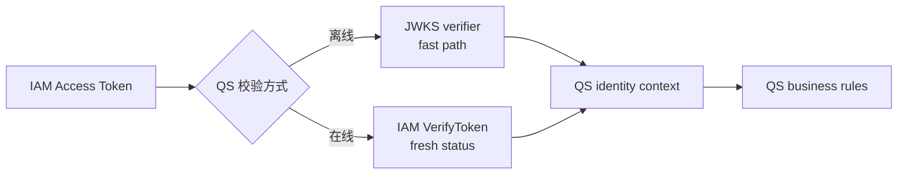
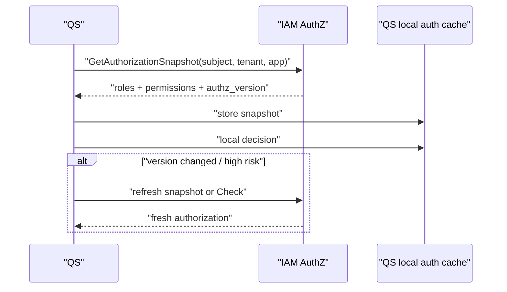

# IAM-QS 竖切边界：Token 与授权快照

本文回答：IAM 和 QS 在 Token、身份上下文、授权快照、本地缓存和事件刷新上的责任边界。它不是 QS 的完整接入手册，而是评审双方职责时使用的切分表。

## 30 秒结论

- IAM 负责签发、校验、撤销 Token，并发布 JWKS；QS 负责把 claims 映射到自己的业务上下文。
- IAM 负责维护授权事实并输出授权快照；QS 负责选择本地缓存、刷新和本地判定策略。
- IAM 用 `authz_version` 和 outbox 事件表达策略变化；QS 需要据此刷新本地权限缓存。
- 离线验签适合高频身份验证，在线 Verify/Check 适合状态敏感或高风险动作。
- IAM 不替 QS 定义业务资源树、课程/内容可见性、订单状态等业务规则。

## Token 边界

| IAM 负责 | QS 负责 |
| ---- | ---- |
| 登录、session、Access Token、Refresh Token、Service Token | 保存、转发和保护 Bearer token |
| JWKS 发布和在线 Verify | 离线验签、issuer/audience 校验、JWKS 缓存 |
| 撤销、session、用户/账号状态在线检查 | 对高风险操作调用 Verify |
| Token claim 结构和签名密钥轮换 | 将 claims 映射为 QS request context |

事实入口：

- [../../internal/apiserver/application/authn/token](../../internal/apiserver/application/authn/token)
- [../../internal/apiserver/infra/token](../../internal/apiserver/infra/token)
- [../../api/grpc/iam/authn/v1/authn.proto](../../api/grpc/iam/authn/v1/authn.proto)
- [../../pkg/sdk/docs/04-jwt-verification.md](../../pkg/sdk/docs/04-jwt-verification.md)

## 授权快照边界

| IAM 负责 | QS 负责 |
| ---- | ---- |
| 维护角色、策略、资源、rolebinding | 定义业务资源 key 和 action |
| 输出 `GetAuthorizationSnapshot` | 缓存快照并按业务策略刷新 |
| 返回 `authz_version` | 版本变化时失效本地缓存 |
| 通过 outbox 发布版本事件 | 订阅、轮询或回源刷新 |

事实入口：

- [../../internal/apiserver/application/authz/authorization](../../internal/apiserver/application/authz/authorization)
- [../../internal/apiserver/application/authz/rolebinding](../../internal/apiserver/application/authz/rolebinding)
- [../../api/grpc/iam/authz/v1/authz.proto](../../api/grpc/iam/authz/v1/authz.proto)
- [../../pkg/sdk/docs/06-authz.md](../../pkg/sdk/docs/06-authz.md)

## 推荐同步策略

| 策略 | 适合场景 | 代价 |
| ---- | ---- | ---- |
| 每次在线 Check | 低频、高风险动作 | 延迟和 IAM 可用性依赖更高。 |
| 拉取快照 + TTL | 高频普通请求 | 策略变化到 TTL 到期之间可能短暂滞后。 |
| 拉取快照 + `authz_version` | 需要版本感知的本地缓存 | 需要保存版本并设计刷新触发。 |
| 订阅 outbox 版本事件 + 回源刷新 | 多服务本地缓存 | 需要事件消费、幂等和补偿机制。 |

## 推荐验收

1. QS 能使用 IAM JWKS 或 SDK 验签 Access Token。
2. QS 能通过 gRPC service token 调用 IAM。
3. QS 能拉取授权快照并读取 `authz_version`。
4. 策略变化后，QS 能刷新本地权限缓存。
5. 对高风险操作，QS 能调用在线 Verify 或 Check。
6. QS 能证明业务资源 key/action 的命名规范和 IAM 策略配置一致。

## 不要说过头

- 不要说“JWT 里有 role 就等于授权完成”；当前可靠授权入口是 Check 或授权快照。
- 不要说“ProfileLink 存在就允许访问所有儿童数据”；资源级动作仍需要业务规则和 AuthZ。
- 不要说“QS 只要缓存一次授权快照即可”；快照必须有版本或过期策略。
- 不要说“IAM 负责 QS 所有权限模型”；IAM 提供通用授权能力，业务含义由 QS 定义。
